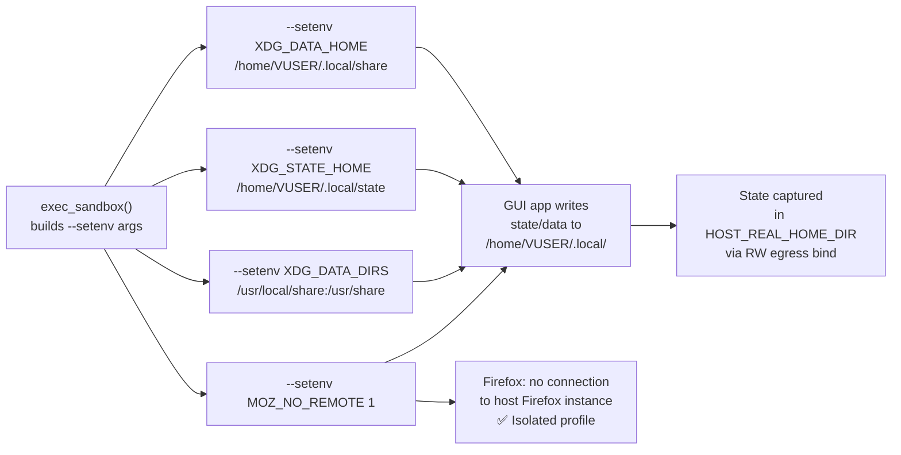

<!-- (c) 2026-* Frederick Bloom -- 20260816-182145-369828-7759-9193-402db2399377-XdgVarsSet.spec-0.0.1.md -- Hanaden AI Loader -->
---
filename-id:   20260816-182145-369828-7759-9193-402db2399377-XdgVarsSet.spec
node-type:     SPEC
layer:         4
spec-domain:   FUNC
version:       0.0.1
status:        Implemented
author:        Frederick Bloom
copyright:     (c) 2026-* Frederick Bloom
description: >
  XDG_DATA_HOME, XDG_STATE_HOME, XDG_DATA_DIRS, and MOZ_NO_REMOTE MUST be set
  in both --clear-env and inherit modes. XDG vars MUST point to /home/VUSER-relative
  paths to ensure GUI app state is stored in the egress home directory.
parent:        20260816-101335-229795-bd24-f66d-e833628900cd-EnvSanitization.feat
leaf-value:    "XDG_DATA_HOME=/home/VUSER/.local/share; XDG_STATE_HOME=/home/VUSER/.local/state; MOZ_NO_REMOTE=1"
leaf-unit:     "env var values"
tdd:
  state:          PASS
  test-file:      src/test/hanaden-bwrap-enhanced/BwrapEnhanced2026.strat/UncontainedAgentExecution.driv/NamespaceIsolatedSandbox.moti/EnvSanitization.feat/XdgVarsSet.spec/test_xdg_vars_set.sh
  last-run:       2026-08-18T16:08:59Z
  iterations:     1
  coverage-lines: "L348-L360"
---

# XdgVarsSet: XDG Environment Variables Always Sandbox-Relative

## Specification Statement

In all modes (with or without `--clear-env`), the following XDG-related vars MUST be set:
- `XDG_DATA_HOME` = `/home/VUSER/.local/share`
- `XDG_STATE_HOME` = `/home/VUSER/.local/state`
- `XDG_DATA_DIRS` = `/usr/local/share:/usr/share`
- `MOZ_NO_REMOTE` = `1`

## Rationale

XDG vars control where GUI applications store their user-specific data and state.
If these point to host paths (the default when not set), GUI app configs, browser profiles,
and user data are stored on the host filesystem outside the egress contract. By redirecting
all XDG storage to `/home/VUSER/.local/`, all app state goes through the authorized
egress path and is captured in `HOST_REAL_HOME_DIR`.

`MOZ_NO_REMOTE=1` prevents Firefox from connecting to an already-running host Firefox
instance, which would allow the sandbox Firefox to share the host's open tabs, cookies,
and browsing session — a privacy and security violation.

## Constraints

| Constraint | Value | Condition |
|------------|-------|-----------|
| XDG_DATA_HOME | /home/VUSER/.local/share | Both modes |
| XDG_STATE_HOME | /home/VUSER/.local/state | Both modes |
| XDG_DATA_DIRS | /usr/local/share:/usr/share | Both modes |
| MOZ_NO_REMOTE | 1 | Both modes |

## Leaf Value

> 🛑 **Primitive** — terminal specification.

**Value:** `XDG_DATA_HOME=/home/VUSER/.local/share; XDG_STATE_HOME=/home/VUSER/.local/state; MOZ_NO_REMOTE=1`
**Source:** bwrap-enhanced.sh L348-L360

## Measurement Method

```bash
VUSER="sandbox-user"
for mode in "" "--clear-env"; do
  echo "=== mode: ${mode:-inherit} ==="
  ./bwrap-enhanced.sh ... $mode -- bash -c "
    echo XDG_DATA_HOME=\$XDG_DATA_HOME
    echo XDG_STATE_HOME=\$XDG_STATE_HOME
    echo XDG_DATA_DIRS=\$XDG_DATA_DIRS
    echo MOZ_NO_REMOTE=\$MOZ_NO_REMOTE
  "
done
# Expected in both modes:
# XDG_DATA_HOME=/home/$VUSER/.local/share
# XDG_STATE_HOME=/home/$VUSER/.local/state
# XDG_DATA_DIRS=/usr/local/share:/usr/share
# MOZ_NO_REMOTE=1
```

## Test Suite

> **Suite ID:** 20260816-182145-369828-7759-9193-402db2399377-XdgVarsSet.spec-SUITE

### ⚙️ Functional Tests

| ID | Description | Method | Pass Criteria | TDD |
|----|-------------|--------|---------------|-----|
| XDG-001 | XDG_DATA_HOME correct (inherit mode) | `echo $XDG_DATA_HOME` | /home/VUSER/.local/share | NOT_STARTED |
| XDG-002 | XDG_DATA_HOME correct (--clear-env) | `echo $XDG_DATA_HOME` | /home/VUSER/.local/share | NOT_STARTED |
| XDG-003 | XDG_STATE_HOME correct | `echo $XDG_STATE_HOME` | /home/VUSER/.local/state | NOT_STARTED |
| XDG-004 | MOZ_NO_REMOTE=1 | `echo $MOZ_NO_REMOTE` | 1 | NOT_STARTED |
| XDG-005 | XDG_DATA_DIRS includes /usr/share | `echo $XDG_DATA_DIRS` | /usr/share present | NOT_STARTED |
| XDG-006 | GUI app writes to XDG_DATA_HOME | run app; check ~/. local/share | files present | NOT_STARTED |

## References

- bwrap-enhanced.sh L348-L360 (--setenv XDG_DATA_HOME XDG_STATE_HOME XDG_DATA_DIRS MOZ_NO_REMOTE)

## Changelog

| Version | Date | Author | Changes |
|---------|------|--------|---------|
| 0.0.1 | 2026-08-16 | Frederick Bloom + AI | Initial spec |
| 0.0.1 | 2026-08-17 | Frederick Bloom + AI | Enrich: Rationale (MOZ_NO_REMOTE rationale), Measurement Method, tests |

## Behavioral Flow


