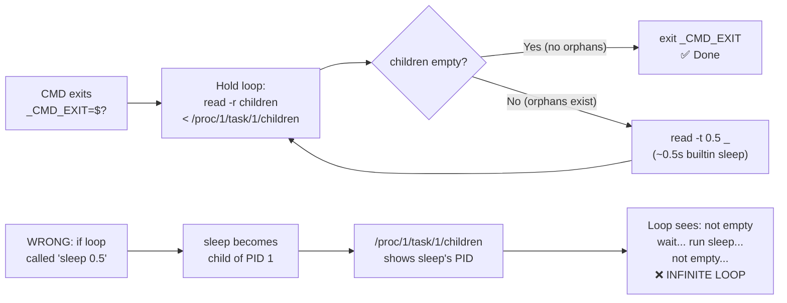

<!-- (c) 2026-* Frederick Bloom -- 20260816-182145-365032-7726-91d9-944add273525-PureBuiltinLoop.spec-0.0.1.md -- Hanaden AI Loader -->
---
filename-id:   20260816-182145-365032-7726-91d9-944add273525-PureBuiltinLoop.spec
node-type:     SPEC
layer:         4
spec-domain:   FUNC
version:       0.0.1
status:        Implemented
author:        Frederick Bloom
copyright:     (c) 2026-* Frederick Bloom
description: >
  The orphan hold loop body MUST use only bash builtins: read -r (to read
  /proc/1/task/1/children), read -t 0.5 (as sleep substitute), and [[ ]] (test).
  No external commands (sleep, cat, ps, find, awk) in the loop body. External commands
  inside the loop would appear in /proc/1/task/1/children, causing an infinite loop.
parent:        20260816-101335-883684-8118-6a29-86cf4df2ae9f-ForegroundHold.feat
leaf-value:    "loop body: read -r, read -t 0.5, [[ ]] only — no external commands"
leaf-unit:     "loop body constraints"
tdd:
  state:          PASS
  test-file:      src/test/hanaden-bwrap-enhanced/BwrapEnhanced2026.strat/UncontainedAgentExecution.driv/NamespaceIsolatedSandbox.moti/ForegroundHold.feat/PureBuiltinLoop.spec/test_pure_builtin_loop.sh
  last-run:       2026-08-18T16:08:59Z
  iterations:     1
  coverage-lines: "L549-L560"
---

# PureBuiltinLoop: Orphan Poll Loop Uses Only Bash Builtins

## Specification Statement

The orphan hold loop MUST use ONLY these bash builtins in its body:
- `read -r children < /proc/1/task/1/children` — to check for remaining children
- `read -t 0.5 _` — ~0.5s sleep without spawning an external `sleep` process
- `[[ -z "$children" ]]` — test for empty children list

No external commands (`sleep`, `cat`, `wc`, `ps`, `awk`, `find`) MUST appear in the loop body.

## Rationale

The critical invariant: `/proc/1/task/1/children` lists PIDs of all direct children of
PID 1. If the loop body runs an external command (e.g., `sleep 0.5`), that command
becomes a child process of PID 1, and `/proc/1/task/1/children` would show its PID.
The loop would see "has children" → wait → run external command → has children → …
creating an **infinite loop** that never exits, even after all orphaned GUI app
children have exited.

`read -t 0.5 _` is a bash builtin that times out after 0.5 seconds — providing the
wait interval without spawning any child process.

## Constraints

| Constraint | Value | Condition |
|------------|-------|-----------|
| Loop sleep mechanism | `read -t 0.5 _` (builtin) | Loop body |
| Children check | `read -r children < /proc/1/task/1/children` (builtin) | Loop body |
| Test | `[[ -z "$children" ]]` (builtin) | Loop body |
| External commands in loop | 0 | Always |

## Leaf Value

> 🛑 **Primitive** — terminal specification.

**Value:** Loop body: `read -r`, `read -t`, `[[ ]]` — 0 external commands
**Source:** bwrap-enhanced.sh L549-L560

## Measurement Method

```bash
# Static analysis — verify no external commands in loop:
# Extract the hold loop from the script (between _CMD_EXIT=$? and exit "$_CMD_EXIT"):
awk '/CMD_EXIT=\$\?/{capture=1} capture{print} /exit "\$_CMD_EXIT"/{capture=0}' \
  src/main/hanaden-bwrap-enhanced/bwrap-enhanced.sh \
  | grep -E '\b(sleep|cat|ps|find|awk|wc|head|tail)\b'
# Expected: 0 results

# Functional: /bin/true exits immediately — loop exits quickly (no orphans):
time ./bwrap-enhanced.sh ... -- /bin/true
# Expected: < 0.2s (no orphans → loop exits immediately after first check)

# Functional: orphan waits (loop counts iterations but stays builtin):
time ./bwrap-enhanced.sh ... -- bash -c '(sleep 1 &)'
# Expected: ~1 second (waits for orphan sleep, but uses builtin in loop)
```

## Test Suite

> **Suite ID:** 20260816-182145-365032-7726-91d9-944add273525-PureBuiltinLoop.spec-SUITE

### ⚙️ Functional Tests

| ID | Description | Method | Pass Criteria | TDD |
|----|-------------|--------|---------------|-----|
| PBL-001 | /bin/true exits immediately | `time ... -- /bin/true` | < 0.2s | NOT_STARTED |
| PBL-002 | 1s orphan waits ~1s | `time ... -- bash -c '(sleep 1 &)'` | ~1s | NOT_STARTED |
| PBL-003 | Static: no external cmds in loop | awk+grep analysis | 0 results | NOT_STARTED |
| PBL-004 | Loop doesn't hang forever | `(sleep 0.5 &); exit 0` as CMD; timeout 3 | exits within 3s | NOT_STARTED |

## References

- bwrap-enhanced.sh L549-L560 (hold loop body)
- bash(1) — `read -t`: timeout is a builtin, does not fork

## Changelog

| Version | Date | Author | Changes |
|---------|------|--------|---------|
| 0.0.1 | 2026-08-16 | Frederick Bloom + AI | Initial spec |
| 0.0.1 | 2026-08-17 | Frederick Bloom + AI | Enrich: Rationale (infinite loop risk from external cmds), static measurement method |

## Behavioral Flow: Why External Commands Would Cause Infinite Loop


