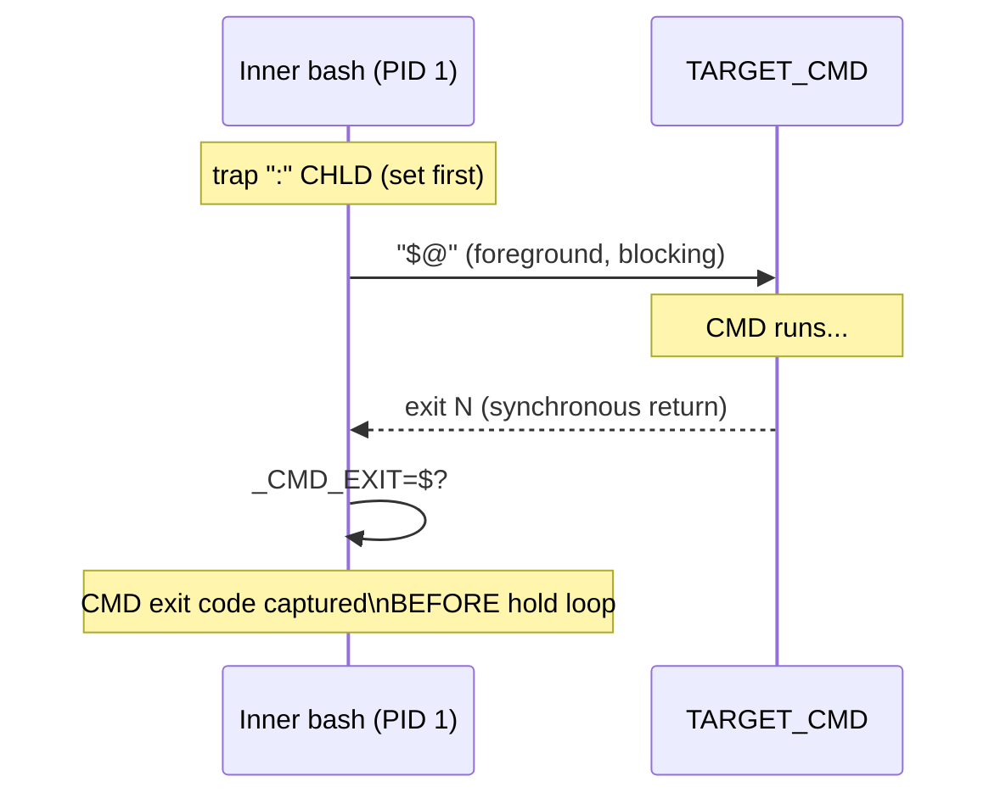

<!-- (c) 2026-* Frederick Bloom -- 20260816-182145-360427-769f-9000-bc251817eb91-SyncExecution.spec-0.0.1.md -- Hanaden AI Loader -->
---
filename-id:   20260816-182145-360427-769f-9000-bc251817eb91-SyncExecution.spec
node-type:     SPEC
layer:         4
spec-domain:   FUNC
version:       0.0.1
status:        Implemented
author:        Frederick Bloom
copyright:     (c) 2026-* Frederick Bloom
description: >
  The inner bash PID 1 MUST execute TARGET_CMD ("$@") in the foreground — no & 
  backgrounding. The inner bash blocks until CMD exits. Job control (Ctrl+C, Ctrl+Z)
  and TTY signal delivery MUST work correctly.
parent:        20260816-101335-883684-8118-6a29-86cf4df2ae9f-ForegroundHold.feat
leaf-value:    '"$@" executed in foreground; bash blocks until CMD exits'
leaf-unit:     "execution mode"
tdd:
  state:          PASS
  test-file:      src/test/hanaden-bwrap-enhanced/BwrapEnhanced2026.strat/UncontainedAgentExecution.driv/NamespaceIsolatedSandbox.moti/ForegroundHold.feat/SyncExecution.spec/test_sync_execution.sh
  last-run:       2026-08-18T16:08:59Z
  iterations:     1
  coverage-lines: "L540-L548"
---

# SyncExecution: TARGET_CMD Executes Synchronously in Foreground

## Specification Statement

Inside the inner bash payload, `"$@"` (TARGET_CMD) MUST execute in the foreground.
The inner bash process MUST block until CMD exits. No `&`, `nohup`, or `disown`
MUST appear in the inner bash payload for the CMD invocation.

## Rationale

If CMD were backgrounded with `&`, the inner bash would immediately proceed to the
orphan hold loop — which would find `_CMD_EXIT=0` (the background fork succeeded)
and `/proc/1/task/1/children` non-empty (CMD is running as child). The orphan hold loop
would then keep the sandbox alive until CMD exits anyway, but `_CMD_EXIT` would be 0
regardless of CMD's actual exit code (backgrounding always returns 0). This would
break exit code preservation. Foreground execution is the only correct model.

## Constraints

| Constraint | Value | Condition |
|------------|-------|-----------|
| CMD execution | foreground ("$@") | Always |
| Backgrounding (&, nohup) | ABSENT from payload | Always |
| Inner bash blocks | until "$@" exits | Always |
| Job control / TTY signals | functional | When sandbox has a TTY |

## Leaf Value

> 🛑 **Primitive** — terminal specification.

**Value:** `"$@"` run in foreground; inner bash blocks until exit
**Source:** bwrap-enhanced.sh L540-L548 (inner bash payload body)

## Measurement Method

```bash
# Measure CMD wall time — should equal CMD duration:
time ./bwrap-enhanced.sh ... -- sleep 2
# Expected: ~2 seconds wall time

# Verify no & in payload:
# Extract inner bash payload from bwrap invocation:
grep -A 20 'bash --norc -c' src/main/hanaden-bwrap-enhanced/bwrap-enhanced.sh \
  | grep -E '"?\$@"? ?&'
# Expected: 0 results (no backgrounding of "$@")
```

## Test Suite

> **Suite ID:** 20260816-182145-360427-769f-9000-bc251817eb91-SyncExecution.spec-SUITE

### ⚙️ Functional Tests

| ID | Description | Method | Pass Criteria | TDD |
|----|-------------|--------|---------------|-----|
| SE-001 | CMD runs synchronously | `sleep 1` as CMD; measure time | ~1 second | NOT_STARTED |
| SE-002 | No backgrounding in payload | `grep '"$@" &'` in script | 0 results | NOT_STARTED |
| SE-003 | Interactive bash works | `bash -i` as CMD | TTY/readline works | NOT_STARTED |

## References

- bwrap-enhanced.sh L540-L548 (inner bash payload: `"$@"` invocation)

## Changelog

| Version | Date | Author | Changes |
|---------|------|--------|---------|
| 0.0.1 | 2026-08-16 | Frederick Bloom + AI | Initial spec |
| 0.0.1 | 2026-08-17 | Frederick Bloom + AI | Enrich: Rationale (backgrounding would break exit code), Measurement Method |

## Behavioral Flow


