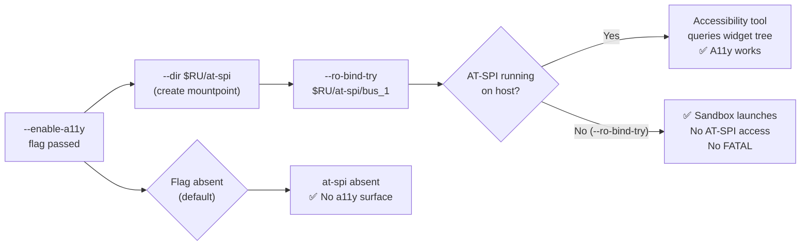

<!-- (c) 2026-* Frederick Bloom -- 20260818-042727-af04500e-7e5c-4f5f-A11yPassthrough.spec-0.0.1.md -- Hanaden AI Loader -->
---
filename-id:   20260818-042727-af04500e-7e5c-4f5f-A11yPassthrough.spec
node-type:     SPEC
layer:         4
spec-domain:   FUNC
version:       0.0.1
status:        Implemented
author:        Frederick Bloom
copyright:     (c) 2026-* Frederick Bloom
description: >
  When --enable-a11y is passed, the AT-SPI2 accessibility bus socket
  (/run/user/UID/at-spi/bus_1) MUST be RO-bound into the sandbox.
  The at-spi directory MUST be created via --dir. Without --enable-a11y,
  no AT-SPI socket is present in the sandbox.
parent:        20260816-182145-GuiPassthrough.feat
leaf-value:    "--dir $RU/at-spi + --ro-bind-try $RU/at-spi/bus_1"
leaf-unit:     "RO socket bind-mount (try)"
tdd:
  state:          PASS
  test-file:      src/test/hanaden-bwrap-enhanced/BwrapEnhanced2026.strat/UncontainedAgentExecution.driv/NamespaceIsolatedSandbox.moti/GuiPassthrough.feat/A11yPassthrough.spec/test_a11y_passthrough.sh
  last-run:       2026-08-18T16:08:59Z
  iterations:     1
  coverage-lines: "L379-L383"
---

# A11yPassthrough: AT-SPI2 Accessibility Bus RO-Bound When --enable-a11y

## Specification Statement

With `--enable-a11y`: the AT-SPI2 (Assistive Technology Service Provider Interface)
directory MUST be created via `--dir /run/user/UID/at-spi`, and the bus socket
`/run/user/UID/at-spi/bus_1` MUST be RO-bound via `--ro-bind-try`. Without
`--enable-a11y`, no AT-SPI path MUST be present.

## Rationale

AT-SPI2 is the Linux accessibility infrastructure used by screen readers (Orca),
test automation frameworks (LDTP, dogtail), and GUI testing tools (Accerciser).
AI agents performing UI accessibility testing, GUI element inspection, or running
automated screen reader validation require the AT-SPI bus to query widget properties
(roles, labels, states) and simulate user interactions.

The socket is RO-bound (not RW) because accessibility clients read the widget tree
— they do not write to the bus itself. The `--dir` is required to create the
mountpoint directory inside the `/run/user/UID` tmpfs before `--remount-ro /` locks
the root.

Using `--ro-bind-try` means the sandbox launches successfully even on systems where
AT-SPI is not running (servers without a graphical session).

## Constraints

| Constraint | Value | Condition |
|------------|-------|-----------|
| /run/user/UID/at-spi dir | created (--dir) | With --enable-a11y |
| at-spi/bus_1 | RO-bound (--ro-bind-try) | With --enable-a11y |
| Sandbox fails if socket absent | MUST NOT (--ro-bind-try) | Always |
| Default: no AT-SPI socket | yes (empty /run/user/UID tmpfs) | Without --enable-a11y |

## Leaf Value

> 🛑 **Primitive** — terminal specification.

**Value:** `--dir $RU/at-spi` + `--ro-bind-try $RU/at-spi/bus_1`
**Source:** bwrap-enhanced.sh L379-L383

## Measurement Method

```bash
_RU="/run/user/$(id -u)"

# With --enable-a11y (on system with AT-SPI running):
./bwrap-enhanced.sh ... --enable-a11y -- bash -c \
  'stat /run/user/$(id -u)/at-spi/bus_1 2>&1'
# Expected: socket exists (or ENOENT if AT-SPI not running)

# at-spi dir created:
./bwrap-enhanced.sh ... --enable-a11y -- bash -c \
  'test -d /run/user/$(id -u)/at-spi && echo PASS'
# Expected: PASS

# No FATAL if socket absent:
./bwrap-enhanced.sh ... --enable-a11y -- /bin/true
# Expected: exit 0

# Without --enable-a11y:
./bwrap-enhanced.sh ... -- bash -c \
  'test -d /run/user/$(id -u)/at-spi 2>&1; echo $?'
# Expected: 1 (directory does not exist)
```

## Test Suite

> **Suite ID:** 20260818-042727-af04500e-7e5c-4f5f-A11yPassthrough.spec-SUITE

### ⚙️ Functional Tests

| ID | Description | Method | Pass Criteria | TDD |
|----|-------------|--------|---------------|-----|
| A11Y-001 | at-spi dir exists with --enable-a11y | `test -d $RU/at-spi` inside | exit 0 | NOT_STARTED |
| A11Y-002 | bus_1 socket accessible (if running) | `stat $RU/at-spi/bus_1` inside | exists or ENOENT | NOT_STARTED |
| A11Y-003 | --enable-a11y ok on system without AT-SPI | run /bin/true | exit 0 | NOT_STARTED |
| A11Y-004 | Default: at-spi dir absent | `test -d $RU/at-spi` inside (no flag) | exit 1 | NOT_STARTED |
| A11Y-005 | bus_1 is RO | `touch $RU/at-spi/bus_1` inside | EROFS or permission denied | NOT_STARTED |

## References

- bwrap-enhanced.sh L379-L383 (ENABLE_A11Y block)
- AT-SPI2 — https://wiki.gnome.org/Accessibility

## Changelog

| Version | Date | Author | Changes |
|---------|------|--------|---------|
| 0.0.1 | 2026-08-18 | Frederick Bloom + AI | Initial spec — reverse-engineered from bwrap-enhanced.sh L379-L383 |

## Behavioral Flow


