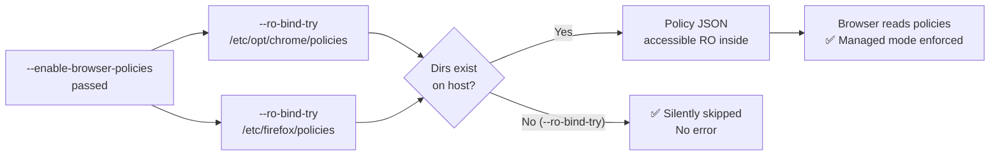

<!-- (c) 2026-* Frederick Bloom -- 20260816-182145-382094-76e4-b5d4-ff920e9a7794-BrowserPolicies.spec-0.0.1.md -- Hanaden AI Loader -->
---
filename-id:   20260816-182145-382094-76e4-b5d4-ff920e9a7794-BrowserPolicies.spec
node-type:     SPEC
layer:         4
spec-domain:   FUNC
version:       0.0.1
status:        Implemented
author:        Frederick Bloom
copyright:     (c) 2026-* Frederick Bloom
description: >
  When --enable-browser-policies is passed, enterprise policy directories for Chrome
  (/etc/opt/chrome/policies) and Firefox (/etc/firefox/policies) MUST be RO-bound
  via --ro-bind-try (no error if absent). This enables managed browser mode in the sandbox.
parent:        20260816-182145-GuiPassthrough.feat
leaf-value:    "--ro-bind-try /etc/opt/chrome/policies + /etc/firefox/policies"
leaf-unit:     "RO bind-mounts (try)"
tdd:
  state:          PASS
  test-file:      src/test/hanaden-bwrap-enhanced/BwrapEnhanced2026.strat/UncontainedAgentExecution.driv/NamespaceIsolatedSandbox.moti/GuiPassthrough.feat/BrowserPolicies.spec/test_browser_policies.sh
  last-run:       2026-08-18T16:08:59Z
  iterations:     1
  coverage-lines: "L425-L440"
---

# BrowserPolicies: Chrome/Firefox Enterprise Policy Dirs RO-Bound When --enable-browser-policies

## Specification Statement

With `--enable-browser-policies`: `/etc/opt/chrome/policies` and `/etc/firefox/policies`
MUST be RO-bound via `--ro-bind-try` (silently skipped if absent on host). Enterprise
browser policy JSON files MUST be accessible RO inside the sandbox.

## Rationale

Enterprise AI deployments often use managed Chrome/Firefox instances with policy
enforcement (e.g., disabling incognito mode, enforcing proxy settings, allowing
specific extensions). Enterprise policies are read from `/etc/opt/chrome/policies/`
and `/etc/firefox/policies/` at browser startup. Without these dirs, managed browsers
ignore policies and may operate in an unconstrained mode.

`--ro-bind-try` (not `--ro-bind`) is used because these directories are optional —
many host systems don't have enterprise browser policies installed.

## Constraints

| Constraint | Value | Condition |
|------------|-------|-----------|
| /etc/opt/chrome/policies | RO-bound (--ro-bind-try) | With --enable-browser-policies, if exists on host |
| /etc/firefox/policies | RO-bound (--ro-bind-try) | With --enable-browser-policies, if exists on host |
| Sandbox fails if paths absent | MUST NOT fail | --ro-bind-try is silently skipped |
| Default | not bound | Without flag |

## Leaf Value

> 🛑 **Primitive** — terminal specification.

**Value:** `--ro-bind-try /etc/opt/chrome/policies --ro-bind-try /etc/firefox/policies`
**Source:** bwrap-enhanced.sh L425-L440

## Measurement Method

```bash
# With --enable-browser-policies (on system with Chrome policies):
./bwrap-enhanced.sh ... --enable-browser-policies -- \
  ls /etc/opt/chrome/policies/managed/ 2>&1
# Expected: policy JSON files listed (or empty if no policies defined)

# Policy dir absent on host — no FATAL:
CHROME_POLICIES_ABSENT=true  # hypothetical
./bwrap-enhanced.sh ... --enable-browser-policies -- /bin/true
# Expected: exit 0 (--ro-bind-try silently skips absent paths)
```

## Test Suite

> **Suite ID:** 20260816-182145-382094-76e4-b5d4-ff920e9a7794-BrowserPolicies.spec-SUITE

### ⚙️ Functional Tests

| ID | Description | Method | Pass Criteria | TDD |
|----|-------------|--------|---------------|-----|
| BP-001 | Chrome policy dir accessible (if exists) | `ls /etc/opt/chrome/policies` inside | accessible or absent | NOT_STARTED |
| BP-002 | Firefox policy dir accessible (if exists) | `ls /etc/firefox/policies` inside | accessible or absent | NOT_STARTED |
| BP-003 | --enable-browser-policies works on system without dirs | run /bin/true with flag | exit 0 | NOT_STARTED |
| BP-004 | Policy dirs RO | `touch /etc/opt/chrome/policies/probe` inside | EROFS (if dir present) | NOT_STARTED |

## References

- bwrap-enhanced.sh L425-L440 (--enable-browser-policies handling)

## Changelog

| Version | Date | Author | Changes |
|---------|------|--------|---------|
| 0.0.1 | 2026-08-16 | Frederick Bloom + AI | Initial spec |
| 0.0.1 | 2026-08-17 | Frederick Bloom + AI | Enrich: Rationale, ro-bind-try rationale, Measurement Method, Leaf Value |

## Behavioral Flow


