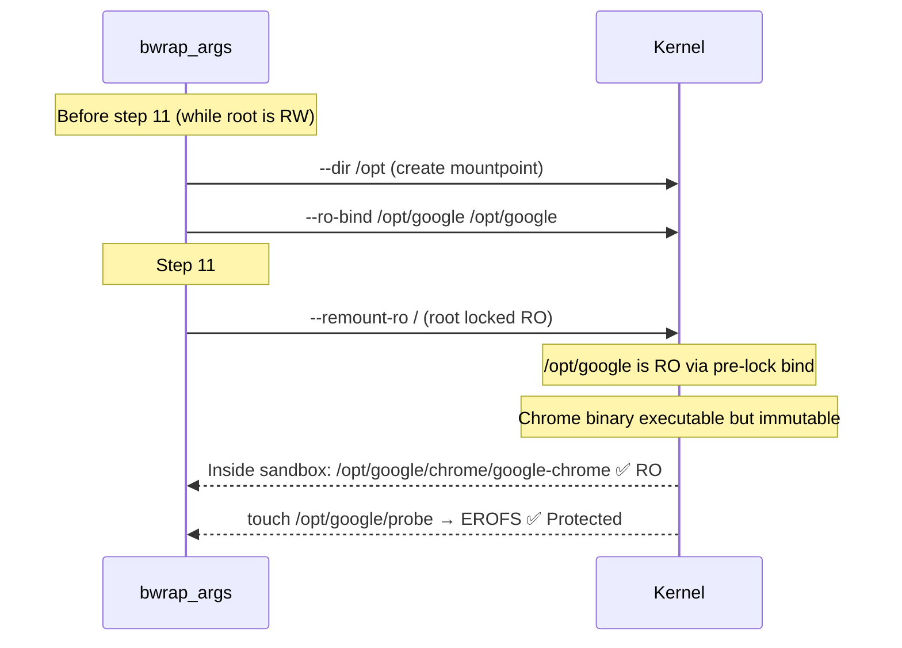

<!-- (c) 2026-* Frederick Bloom -- 20260818-042727-e67900aa-46b7-4071-ChromeOptBind.spec-0.0.1.md -- Hanaden AI Loader -->
---
filename-id:   20260818-042727-e67900aa-46b7-4071-ChromeOptBind.spec
node-type:     SPEC
layer:         4
spec-domain:   FUNC
version:       0.0.1
status:        Implemented
author:        Frederick Bloom
copyright:     (c) 2026-* Frederick Bloom
description: >
  Google Chrome lives in /opt/google (not /usr), which is absent from virtual-roots/.
  The sandbox MUST unconditionally create /opt via --dir and RO-bind /opt/google
  via --ro-bind BEFORE --remount-ro / (step 11) so the mountpoint can be created
  while the sandbox root is still RW.
parent:        20260816-182145-GuiPassthrough.feat
leaf-value:    "--dir /opt + --ro-bind /opt/google /opt/google (always, pre-remount-ro)"
leaf-unit:     "RO bind-mount"
tdd:
  state:          PASS
  test-file:      src/test/hanaden-bwrap-enhanced/BwrapEnhanced2026.strat/UncontainedAgentExecution.driv/NamespaceIsolatedSandbox.moti/GuiPassthrough.feat/ChromeOptBind.spec/test_chrome_opt_bind.sh
  last-run:       2026-08-18T16:08:59Z
  iterations:     1
  coverage-lines: "L333-L337"
---

# ChromeOptBind: Google Chrome /opt/google Unconditionally RO-Bound Before --remount-ro

## Specification Statement

The sandbox MUST unconditionally (without a CLI flag) include:

```
--dir /opt
--ro-bind /opt/google /opt/google
```

in `bwrap_args` BEFORE `--remount-ro /` (step 11 of the VFS mount sequence).

This bind is unconditional — it is not gated on a `--enable-chrome` flag.
If `/opt/google` does not exist on the host, bwrap's `--ro-bind` will fail at
launch. The `--dir /opt` creates the mountpoint while the root is still RW.

## Rationale

Google Chrome (and Chromium-based tools like Electron, Cursor IDE) installs its
binary at `/opt/google/chrome/google-chrome`, not under `/usr/`. The initial
`--bind HOST_ROOT /` creates the sandbox root from a real host root directory
(`--host-real-root /` in the typical case). If the sandbox root is `/` (the live
host), `/opt/google` is visible automatically via the root bind. However, when
`--host-real-root` points to a virtual root (e.g., `virtual-roots/bookworm-base/`),
that directory does not contain an `/opt/google` subtree.

The `--dir /opt` is required because bwrap cannot create the `/opt` mountpoint
directory after `--remount-ro /` has made the sandbox root read-only. Creating it
beforehand (step pre-11) then RO-binding `/opt/google` into it makes Chrome
accessible without needing `/opt` in the virtual root.

The bind is RO (not RW) because Chrome should only be executed, not modified.
Chrome's writable state (profile, cache) lives under `/home/VUSER/.config/google-chrome`,
which is in the RW egress home.

The bind is unconditional (no opt-in flag) because:
1. The project's primary use case is browser-based AI agent execution
2. `/opt/google` absence on the host causes a clear bwrap FATAL (not a silent failure)
3. The `/dir /opt` mountpoint creation has zero side effects if Chrome is absent

## Constraints

| Constraint | Value | Condition |
|------------|-------|-----------|
| --dir /opt | present in bwrap_args | Always (unconditional) |
| --ro-bind /opt/google /opt/google | present in bwrap_args | Always (unconditional) |
| Position in bwrap_args | BEFORE --remount-ro / (step 11) | Mandatory ordering |
| /opt/google bind mode | RO | Always |
| Failure when /opt/google absent on host | bwrap FATAL | Expected (host configuration error) |

## Leaf Value

> 🛑 **Primitive** — terminal specification.

**Value:** `--dir /opt` + `--ro-bind /opt/google /opt/google` always present, before step 11
**Source:** bwrap-enhanced.sh L333-L337

## Measurement Method

```bash
# Verify /opt/google is accessible (RO) inside sandbox:
./bwrap-enhanced.sh ... -- bash -c 'ls /opt/google'
# Expected: google-chrome/ or similar Chrome directories

# Verify RO:
./bwrap-enhanced.sh ... -- bash -c \
  'touch /opt/google/probe 2>&1'
# Expected: "Read-only file system" or "Permission denied"

# Verify Chrome launches:
./bwrap-enhanced.sh ... -- /opt/google/chrome/google-chrome --version
# Expected: Google Chrome version string

# Static ordering check:
grep -n 'opt/google\|remount-ro' src/main/hanaden-bwrap-enhanced/bwrap-enhanced.sh
# Expected: opt/google line number < remount-ro line number

# Verify /opt exists as mountpoint:
./bwrap-enhanced.sh ... -- bash -c 'test -d /opt && echo PASS'
# Expected: PASS
```

## Test Suite

> **Suite ID:** 20260818-042727-e67900aa-46b7-4071-ChromeOptBind.spec-SUITE

### ⚙️ Functional Tests

| ID | Description | Method | Pass Criteria | TDD |
|----|-------------|--------|---------------|-----|
| COB-001 | /opt/google accessible inside sandbox | `ls /opt/google` inside | Chrome dirs visible | NOT_STARTED |
| COB-002 | /opt dir exists as mountpoint | `test -d /opt` inside | exit 0 | NOT_STARTED |
| COB-003 | /opt/google is RO | `touch /opt/google/probe` inside | EROFS | NOT_STARTED |
| COB-004 | Chrome binary executable | `ls /opt/google/chrome/google-chrome` inside | file exists | NOT_STARTED |
| COB-005 | Static: opt/google before remount-ro | grep line order | opt/google line < remount-ro line | NOT_STARTED |
| COB-006 | Chrome --version works inside sandbox | `google-chrome --version` inside | version string | NOT_STARTED |

### 🛡️ Security Tests

| ID | Description | Attack / Scenario | Expected Defense | TDD |
|----|-------------|-------------------|------------------|-----|
| COB-S001 | Cannot modify Chrome binary | `cp /bin/sh /opt/google/chrome/evil` inside | EROFS | NOT_STARTED |
| COB-S002 | Chrome profile in RW egress only | `ls ~/.config/google-chrome` inside | in /home/VUSER (RW) | NOT_STARTED |

## References

- bwrap-enhanced.sh L333-L337 (--dir /opt + --ro-bind /opt/google)
- bwrap-enhanced.sh inline comment: "Bind it before --remount-ro / so the mountpoint dir can be created while root is still RW"
- BindSequence.spec (VfsIsolation.feat) — ordering invariant

## Changelog

| Version | Date | Author | Changes |
|---------|------|--------|---------|
| 0.0.1 | 2026-08-18 | Frederick Bloom + AI | Initial spec — reverse-engineered from bwrap-enhanced.sh L333-L337 |

## Behavioral Flow


