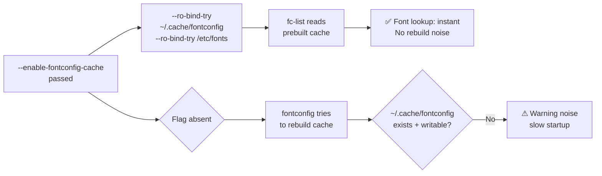

<!-- (c) 2026-* Frederick Bloom -- 20260816-182145-380922-7160-b173-b94f0a9f73a2-FontconfigCache.spec-0.0.1.md -- Hanaden AI Loader -->
---
filename-id:   20260816-182145-380922-7160-b173-b94f0a9f73a2-FontconfigCache.spec
node-type:     SPEC
layer:         4
spec-domain:   FUNC
version:       0.0.1
status:        Implemented
author:        Frederick Bloom
copyright:     (c) 2026-* Frederick Bloom
description: >
  When --enable-fontconfig-cache is passed, ~/.cache/fontconfig and /etc/fonts MUST
  be RO-bound inside the sandbox. This allows GUI apps to read prebuilt font cache
  without rebuilding it inside the sandbox (which is slow and writes to the ephemeral
  /tmp or fails with EROFS).
parent:        20260816-182145-GuiPassthrough.feat
leaf-value:    "RO-bind ~/.cache/fontconfig + /etc/fonts"
leaf-unit:     "RO bind-mounts"
tdd:
  state:          PASS
  test-file:      src/test/hanaden-bwrap-enhanced/BwrapEnhanced2026.strat/UncontainedAgentExecution.driv/NamespaceIsolatedSandbox.moti/GuiPassthrough.feat/FontconfigCache.spec/test_fontconfig_cache.sh
  last-run:       2026-08-18T16:08:59Z
  iterations:     1
  coverage-lines: "L410-L425"
---

# FontconfigCache: Fontconfig Cache and Fonts RO-Bound When --enable-fontconfig-cache

## Specification Statement

With `--enable-fontconfig-cache`: `~/.cache/fontconfig` and `/etc/fonts` MUST be
RO-bound into the sandbox (using `--ro-bind-try` for robustness if paths don't exist).

## Rationale

Fontconfig rebuilds its cache when it detects the cache is missing or stale. Cache
rebuilding inside a sandbox:
1. Is slow (scans all font files)
2. Tries to write to `~/.cache/fontconfig` — which may fail if the egress home doesn't
   have that directory pre-created, causing many tools to print fontconfig warnings

Providing the prebuilt host cache (RO) makes font lookup instant and eliminates
cache rebuild noise from GUI app logs.

## Constraints

| Constraint | Value | Condition |
|------------|-------|-----------|
| ~/.cache/fontconfig | RO-bound (--ro-bind-try) | With --enable-fontconfig-cache |
| /etc/fonts | RO-bound | With --enable-fontconfig-cache |
| Default | not bound | Without flag |

## Leaf Value

> 🛑 **Primitive** — terminal specification.

**Value:** `--ro-bind-try ~/.cache/fontconfig + --ro-bind-try /etc/fonts`
**Source:** bwrap-enhanced.sh L410-L425

## Measurement Method

```bash
# With --enable-fontconfig-cache:
./bwrap-enhanced.sh ... --enable-fontconfig-cache -- fc-list 2>&1 | head -3
# Expected: font names, no rebuild errors

./bwrap-enhanced.sh ... --enable-fontconfig-cache -- stat /etc/fonts
# Expected: directory exists
```

## Test Suite

> **Suite ID:** 20260816-182145-380922-7160-b173-b94f0a9f73a2-FontconfigCache.spec-SUITE

### ⚙️ Functional Tests

| ID | Description | Method | Pass Criteria | TDD |
|----|-------------|--------|---------------|-----|
| FC-001 | fc-list works without rebuild | `fc-list \| head -3` inside | font names listed | NOT_STARTED |
| FC-002 | /etc/fonts accessible | `stat /etc/fonts` inside | exists | NOT_STARTED |
| FC-003 | fontconfig cache RO | `touch ~/.cache/fontconfig/probe` inside | EROFS or denied | NOT_STARTED |

## References

- bwrap-enhanced.sh L410-L425 (--enable-fontconfig-cache handling)

## Changelog

| Version | Date | Author | Changes |
|---------|------|--------|---------|
| 0.0.1 | 2026-08-16 | Frederick Bloom + AI | Initial spec |
| 0.0.1 | 2026-08-17 | Frederick Bloom + AI | Enrich: Rationale, Measurement Method, Leaf Value |

## Behavioral Flow


