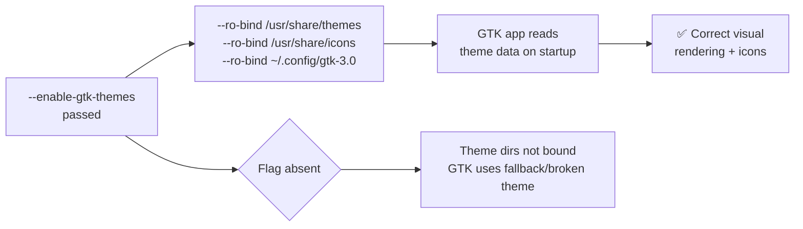

<!-- (c) 2026-* Frederick Bloom -- 20260816-182145-378886-78c5-8944-464718788e9b-GtkThemes.spec-0.0.1.md -- Hanaden AI Loader -->
---
filename-id:   20260816-182145-378886-78c5-8944-464718788e9b-GtkThemes.spec
node-type:     SPEC
layer:         4
spec-domain:   FUNC
version:       0.0.1
status:        Implemented
author:        Frederick Bloom
copyright:     (c) 2026-* Frederick Bloom
description: >
  When --enable-gtk-themes is passed, GTK theme and icon directories (/usr/share/themes,
  /usr/share/icons, /usr/local/share/themes, /usr/local/share/icons, ~/.config/gtk-3.0)
  MUST be RO-bound inside the sandbox so GUI apps render with the correct theme.
parent:        20260816-182145-GuiPassthrough.feat
leaf-value:    "RO-bind /usr/share/themes /usr/share/icons + gtk-3.0 config"
leaf-unit:     "RO bind-mounts"
tdd:
  state:          PASS
  test-file:      src/test/hanaden-bwrap-enhanced/BwrapEnhanced2026.strat/UncontainedAgentExecution.driv/NamespaceIsolatedSandbox.moti/GuiPassthrough.feat/GtkThemes.spec/test_gtk_themes.sh
  last-run:       2026-08-18T16:08:59Z
  iterations:     1
  coverage-lines: "L391-L410"
---

# GtkThemes: GTK Theme and Icon Dirs RO-Bound When --enable-gtk-themes

## Specification Statement

With `--enable-gtk-themes`: `/usr/share/themes`, `/usr/share/icons`,
`/usr/local/share/themes`, `/usr/local/share/icons`, and `~/.config/gtk-3.0` MUST
be RO-bound into the sandbox.

## Rationale

Without theme data, GTK apps render with a broken fallback appearance — no icons, wrong
colors, potentially misaligned layouts. For visual inspection of sandboxed apps (e.g.,
AI-driven browser automation where the agent takes screenshots), correct rendering is
required for reliable UI element recognition. The theme dirs are RO-bound (not RW)
because the sandbox should not be able to install or modify GTK themes on the host.

## Constraints

| Constraint | Value | Condition |
|------------|-------|-----------|
| /usr/share/themes | RO-bound | With --enable-gtk-themes |
| /usr/share/icons | RO-bound | With --enable-gtk-themes |
| ~/.config/gtk-3.0 | RO-bound | With --enable-gtk-themes |
| Without flag | not bound (relies on VFS defaults) | Default |

## Leaf Value

> 🛑 **Primitive** — terminal specification.

**Value:** GTK theme dirs RO-bound via `--ro-bind-try`
**Source:** bwrap-enhanced.sh L391-L410

## Measurement Method

```bash
# With --enable-gtk-themes:
./bwrap-enhanced.sh ... --enable-gtk-themes -- ls /usr/share/themes | head -3
# Expected: theme names listed

./bwrap-enhanced.sh ... --enable-gtk-themes -- ls /usr/share/icons | head -3
# Expected: icon theme names listed
```

## Test Suite

> **Suite ID:** 20260816-182145-378886-78c5-8944-464718788e9b-GtkThemes.spec-SUITE

### ⚙️ Functional Tests

| ID | Description | Method | Pass Criteria | TDD |
|----|-------------|--------|---------------|-----|
| GTK-001 | /usr/share/themes accessible | `ls /usr/share/themes` inside | themes listed | NOT_STARTED |
| GTK-002 | /usr/share/icons accessible | `ls /usr/share/icons` inside | icons listed | NOT_STARTED |
| GTK-003 | Themes RO | `touch /usr/share/themes/probe` inside | EROFS | NOT_STARTED |

## References

- bwrap-enhanced.sh L391-L410 (--enable-gtk-themes handling)

## Changelog

| Version | Date | Author | Changes |
|---------|------|--------|---------|
| 0.0.1 | 2026-08-16 | Frederick Bloom + AI | Initial spec |
| 0.0.1 | 2026-08-17 | Frederick Bloom + AI | Enrich: Rationale, Measurement Method, Leaf Value |

## Behavioral Flow


