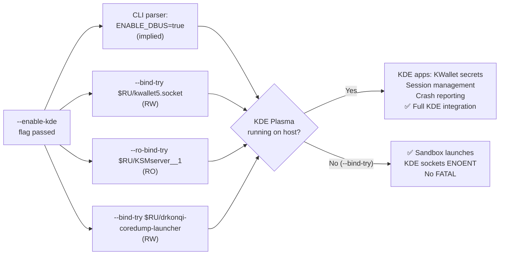

<!-- (c) 2026-* Frederick Bloom -- 20260818-042727-711ba351-44e8-490a-KdePassthrough.spec-0.0.1.md -- Hanaden AI Loader -->
---
filename-id:   20260818-042727-711ba351-44e8-490a-KdePassthrough.spec
node-type:     SPEC
layer:         4
spec-domain:   FUNC
version:       0.0.1
status:        Implemented
author:        Frederick Bloom
copyright:     (c) 2026-* Frederick Bloom
description: >
  When --enable-kde is passed, KDE-specific /run/user/UID sockets MUST be
  bound into the sandbox: kwallet5.socket (RW), KSMserver__1 (RO), and
  drkonqi-coredump-launcher (RW). --enable-kde also implies --enable-dbus
  (ENABLE_DBUS=true is set by the CLI parser). Without --enable-kde,
  none of these KDE service sockets are present in the sandbox.
parent:        20260816-182145-GuiPassthrough.feat
leaf-value:    "--bind-try kwallet5.socket + --ro-bind-try KSMserver__1 + --bind-try drkonqi-coredump-launcher"
leaf-unit:     "socket bind-mounts (try)"
tdd:
  state:          PASS
  test-file:      src/test/hanaden-bwrap-enhanced/BwrapEnhanced2026.strat/UncontainedAgentExecution.driv/NamespaceIsolatedSandbox.moti/GuiPassthrough.feat/KdePassthrough.spec/test_kde_passthrough.sh
  last-run:       2026-08-18T16:08:59Z
  iterations:     1
  coverage-lines: "L409-L415"
---

# KdePassthrough: KDE Desktop Services Bound When --enable-kde

## Specification Statement

With `--enable-kde`: the following sockets under `/run/user/$(id -u)` MUST be
bound via `--bind-try` / `--ro-bind-try` (silently skipped if absent):

- `kwallet5.socket` — KWallet secrets store (RW, `--bind-try`)
- `KSMserver__1` — KDE Session Manager server (RO, `--ro-bind-try`)
- `drkonqi-coredump-launcher` — KDE crash handler (RW, `--bind-try`)

`--enable-kde` implies `--enable-dbus` (CLI parser L744 sets `ENABLE_DBUS="true"`).

Without `--enable-kde`, NONE of these paths MUST be present.

## Rationale

KDE Plasma applications depend on session services for secrets management, session
lifecycle, and crash reporting:

- **KWallet5**: Secret storage for passwords, SSH/GPG passphrases, WiFi PSKs.
  KDE apps (Konqueror, Falkon, Kmail) refuse to save credentials without it.
- **KSMserver**: KDE Session Manager — tells apps to save state and enables logout
  sequencing. RO because the sandbox should observe but not control session lifecycle.
- **drkonqi-coredump-launcher**: KDE crash handler — processes crash dumps and
  generates bug reports. RW because it needs to write report metadata back.

AI agents automating KDE workflows or testing Qt/KDE applications need these
services for correct application behavior. Without KWallet, browser test profiles
fail to persist tokens. Without KSMserver, session-aware KDE apps may crash at startup.

All binds use `--bind-try` so the sandbox launches on non-KDE hosts without FATAL.
`--enable-kde` implies `--enable-dbus` because KWallet and KSMserver communicate
over D-Bus.

## Constraints

| Constraint | Value | Condition |
|------------|-------|-----------|
| kwallet5.socket | RW-bound (--bind-try) | With --enable-kde |
| KSMserver__1 | RO-bound (--ro-bind-try) | With --enable-kde |
| drkonqi-coredump-launcher | RW-bound (--bind-try) | With --enable-kde |
| ENABLE_DBUS implied | yes | Always with --enable-kde |
| Sandbox fails if sockets absent | MUST NOT (--bind-try) | Always |
| Default: no KDE sockets | yes | Without --enable-kde |

## Leaf Value

> 🛑 **Primitive** — terminal specification.

**Value:** kwallet5.socket (RW) + KSMserver__1 (RO) + drkonqi-coredump-launcher (RW); DBUS implied
**Source:** bwrap-enhanced.sh L409-L415

## Measurement Method

```bash
_RU="/run/user/$(id -u)"

# With --enable-kde (on KDE Plasma session):
./bwrap-enhanced.sh ... --enable-kde -- bash -c \
  'stat /run/user/$(id -u)/kwallet5.socket 2>&1'
# Expected: socket exists (or ENOENT if KWallet not running)

# KSMserver RO:
./bwrap-enhanced.sh ... --enable-kde -- bash -c \
  'stat /run/user/$(id -u)/KSMserver__1 2>&1'
# Expected: socket exists (or ENOENT if KDE not running)

# DBUS implied:
./bwrap-enhanced.sh ... --enable-kde -- bash -c \
  'stat /run/user/$(id -u)/bus 2>&1'
# Expected: D-Bus bus socket present

# No FATAL on non-KDE host:
./bwrap-enhanced.sh ... --enable-kde -- /bin/true
# Expected: exit 0

# Without --enable-kde:
./bwrap-enhanced.sh ... -- bash -c \
  'test -e /run/user/$(id -u)/kwallet5.socket; echo $?'
# Expected: 1
```

## Test Suite

> **Suite ID:** 20260818-042727-711ba351-44e8-490a-KdePassthrough.spec-SUITE

### ⚙️ Functional Tests

| ID | Description | Method | Pass Criteria | TDD |
|----|-------------|--------|---------------|-----|
| KDE-001 | kwallet5.socket bound (if running) | `stat $RU/kwallet5.socket` inside | exists or ENOENT | NOT_STARTED |
| KDE-002 | KSMserver__1 bound RO (if running) | `stat $RU/KSMserver__1` inside | exists or ENOENT | NOT_STARTED |
| KDE-003 | KSMserver__1 is RO | `touch $RU/KSMserver__1` inside | permission denied | NOT_STARTED |
| KDE-004 | drkonqi-coredump-launcher bound (if running) | `stat $RU/drkonqi-coredump-launcher` | exists or ENOENT | NOT_STARTED |
| KDE-005 | ENABLE_DBUS implied | `stat $RU/bus` inside | bus socket present | NOT_STARTED |
| KDE-006 | --enable-kde ok on non-KDE host | run /bin/true | exit 0 | NOT_STARTED |
| KDE-007 | Default: no kwallet5.socket | `test -e $RU/kwallet5.socket` (no flag) | exit 1 | NOT_STARTED |

### 🛡️ Security Tests

| ID | Description | Attack / Scenario | Expected Defense | TDD |
|----|-------------|-------------------|------------------|-----|
| KDE-S001 | No KWallet access without flag | query kwallet5 (no flag) | ENOENT | NOT_STARTED |
| KDE-S002 | KSMserver RO enforced | write to KSMserver__1 inside | permission denied | NOT_STARTED |

## References

- bwrap-enhanced.sh L409-L415 (ENABLE_KDE block)
- bwrap-enhanced.sh L744 (CLI: --enable-kde sets ENABLE_DBUS=true)
- KWallet — https://userbase.kde.org/KDE_Wallet_Manager

## Changelog

| Version | Date | Author | Changes |
|---------|------|--------|---------|
| 0.0.1 | 2026-08-18 | Frederick Bloom + AI | Initial spec — reverse-engineered from bwrap-enhanced.sh L409-L415 |

## Behavioral Flow


