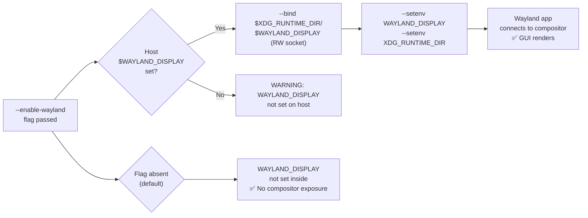

<!-- (c) 2026-* Frederick Bloom -- 20260816-182145-385382-723e-b9aa-0ffb330bb688-WaylandDisplay.spec-0.0.1.md -- Hanaden AI Loader -->
---
filename-id:   20260816-182145-385382-723e-b9aa-0ffb330bb688-WaylandDisplay.spec
node-type:     SPEC
layer:         4
spec-domain:   FUNC
version:       0.0.1
status:        Implemented
author:        Frederick Bloom
copyright:     (c) 2026-* Frederick Bloom
description: >
  When --enable-wayland is passed AND $WAYLAND_DISPLAY is set on the host, the sandbox
  MUST RW-bind the Wayland socket ($XDG_RUNTIME_DIR/$WAYLAND_DISPLAY) and inject
  WAYLAND_DISPLAY and XDG_RUNTIME_DIR env vars. Without --enable-wayland, no socket
  is bound and WAYLAND_DISPLAY is not set.
parent:        20260816-182145-GuiPassthrough.feat
leaf-value:    "--bind $XDG_RUNTIME_DIR/$WAYLAND_DISPLAY + --setenv WAYLAND_DISPLAY"
leaf-unit:     "socket bind + env var"
tdd:
  state:          PASS
  test-file:      src/test/hanaden-bwrap-enhanced/BwrapEnhanced2026.strat/UncontainedAgentExecution.driv/NamespaceIsolatedSandbox.moti/GuiPassthrough.feat/WaylandDisplay.spec/test_wayland_display.sh
  last-run:       2026-08-18T16:08:59Z
  iterations:     1
  coverage-lines: "L300-L315,L476-L480"
---

# WaylandDisplay: Wayland Socket RW-Bound When --enable-wayland

## Specification Statement

With `--enable-wayland`, when host `$WAYLAND_DISPLAY` is set: the sandbox MUST
RW-bind `$XDG_RUNTIME_DIR/$WAYLAND_DISPLAY` (the Wayland compositor socket) and
inject `WAYLAND_DISPLAY` and `XDG_RUNTIME_DIR` env vars. Without `--enable-wayland`,
neither socket nor env vars MUST be present.

## Rationale

Wayland-native applications (weston, Firefox Wayland, wl-clipboard) communicate with
the compositor via a Unix domain socket at `$XDG_RUNTIME_DIR/wayland-N`. Without
access to this socket, Wayland apps fail immediately. Binding the socket RW is
required because the client writes protocol frames to it. By making this opt-in,
the sandbox keeps its default posture of no GUI capability — avoiding compositor
protocol exposure to sandboxed code by default.

## Constraints

| Constraint | Value | Condition |
|------------|-------|-----------|
| Wayland socket bind | RW-bind to $XDG_RUNTIME_DIR/$WAYLAND_DISPLAY | With --enable-wayland |
| WAYLAND_DISPLAY env var | injected | With --enable-wayland AND host $WAYLAND_DISPLAY set |
| XDG_RUNTIME_DIR env var | injected | With --enable-wayland |
| Without --enable-wayland: WAYLAND_DISPLAY | not set | Default |

## Leaf Value

> 🛑 **Primitive** — terminal specification.

**Value:** RW socket bind + WAYLAND_DISPLAY injected
**Source:** bwrap-enhanced.sh L300-L315

## Measurement Method

```bash
# With --enable-wayland:
./bwrap-enhanced.sh ... --enable-wayland -- bash -c 'echo $WAYLAND_DISPLAY'
# Expected: wayland-N

./bwrap-enhanced.sh ... --enable-wayland -- bash -c \
  'stat $XDG_RUNTIME_DIR/$WAYLAND_DISPLAY'
# Expected: socket file exists

# Without --enable-wayland:
./bwrap-enhanced.sh ... -- bash -c 'echo ${WAYLAND_DISPLAY:-UNSET}'
# Expected: UNSET
```

## Test Suite

> **Suite ID:** 20260816-182145-385382-723e-b9aa-0ffb330bb688-WaylandDisplay.spec-SUITE

### ⚙️ Functional Tests

| ID | Description | Method | Pass Criteria | TDD |
|----|-------------|--------|---------------|-----|
| WD-001 | WAYLAND_DISPLAY set with --enable-wayland | `echo $WAYLAND_DISPLAY` inside | wayland-N | NOT_STARTED |
| WD-002 | Wayland socket accessible | `stat $XDG_RUNTIME_DIR/$WAYLAND_DISPLAY` inside | socket exists | NOT_STARTED |
| WD-003 | Default: WAYLAND_DISPLAY not set | `echo ${WAYLAND_DISPLAY:-UNSET}` inside | UNSET | NOT_STARTED |
| WD-004 | XDG_RUNTIME_DIR injected | `echo $XDG_RUNTIME_DIR` inside (--enable-wayland) | /run/user/UID | NOT_STARTED |

## References

- bwrap-enhanced.sh L300-L315 (--enable-wayland handling)

## Changelog

| Version | Date | Author | Changes |
|---------|------|--------|---------|
| 0.0.1 | 2026-08-16 | Frederick Bloom + AI | Initial spec |
| 0.0.1 | 2026-08-17 | Frederick Bloom + AI | Enrich: Rationale, Measurement Method, Leaf Value |

## Behavioral Flow


