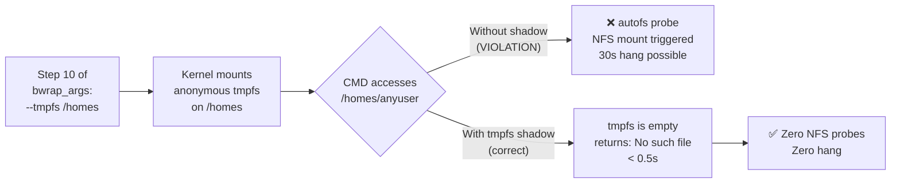

<!-- (c) 2026-* Frederick Bloom -- 20260816-182145-394116-75d7-8b3d-ec3a16ed1e5b-AutofsShadow.spec-0.0.1.md -- Hanaden AI Loader -->
---
filename-id:   20260816-182145-394116-75d7-8b3d-ec3a16ed1e5b-AutofsShadow.spec
node-type:     SPEC
layer:         4
spec-domain:   FUNC
version:       0.0.1
status:        Implemented
author:        Frederick Bloom
copyright:     (c) 2026-* Frederick Bloom
description: >
  /homes inside the sandbox MUST be an anonymous tmpfs, shadowing the host's autofs
  trigger point. Accessing /homes/any-user inside the sandbox MUST NOT trigger an
  NFS mount probe. The tmpfs shadow MUST present an empty directory.
parent:        20260816-101335-567491-3888-a3a0-3027a6c05b38-HostShadowing.feat
leaf-value:    "--tmpfs /homes (empty, no NFS probe on access)"
leaf-unit:     "fstype + behavior"
tdd:
  state:          PASS
  test-file:      src/test/hanaden-bwrap-enhanced/BwrapEnhanced2026.strat/UncontainedAgentExecution.driv/NamespaceIsolatedSandbox.moti/HostShadowing.feat/AutofsShadow.spec/test_autofs_shadow.sh
  last-run:       2026-08-18T16:08:59Z
  iterations:     1
  coverage-lines: "L263-L270"
---

# AutofsShadow: /homes Autofs Trigger Shadowed by Empty tmpfs

## Specification Statement

When the host has `/homes` as an autofs mount point, the sandbox MUST overlay it with
`--tmpfs /homes`, presenting an empty tmpfs inside the sandbox. Access to any path
under `/homes` inside the sandbox MUST complete immediately (< 1 second) with
"No such file or directory" — NOT trigger an NFS mount probe that may hang.

## Rationale

Many production Linux systems use `/homes` (distinct from `/home`) as an autofs mount
point for NFS-backed user home directories. When `bwrap --bind HOST_ROOT /` binds the
host root, `/homes` would be visible inside the sandbox as an autofs trigger. Any
`ls /homes/anyuser` inside would cause the autofs daemon to send an NFS mount request
to the NFS server — which can take 30–90 seconds to timeout on an unreachable server,
or permanently mount the NFS volume if reachable.

This is especially dangerous in AI agent workloads where the agent may iterate over
filesystem paths. A single `ls /homes` inside a loop would cause severe latency and
could accidentally mount hundreds of NFS volumes.

## Constraints

| Constraint | Value | Condition |
|------------|-------|-----------|
| /homes filesystem type inside sandbox | tmpfs | Always (when host has /homes) |
| /homes contents inside sandbox | empty | Always |
| NFS probes triggered by /homes access | 0 | Always |
| Access time to /homes | < 0.5 seconds | Always |

## Leaf Value

> 🛑 **Primitive** — terminal specification.

**Value:** `--tmpfs /homes` → empty, no NFS probe, < 0.5s access
**Source:** bwrap-enhanced.sh L263-L270

## Measurement Method

```bash
# Inside sandbox:
stat -f -c %T /homes          # Expected: tmpfs
ls /homes                     # Expected: empty
time ls /homes/nonexistent 2>&1  # Expected: < 0.5s (not 30s NFS timeout)

# On host: verify no NFS mount was triggered
mount | grep nfs | wc -l   # Before == After (no new NFS mounts)
```

## Test Suite

> **Suite ID:** 20260816-182145-394116-75d7-8b3d-ec3a16ed1e5b-AutofsShadow.spec-SUITE

### ⚙️ Functional Tests

| ID | Description | Method | Pass Criteria | TDD |
|----|-------------|--------|---------------|-----|
| AFS-001 | /homes is tmpfs | `stat -f -c %T /homes` inside | tmpfs | NOT_STARTED |
| AFS-002 | /homes is empty | `ls /homes` inside | no output | NOT_STARTED |
| AFS-003 | /homes access < 0.5s | `time ls /homes/x 2>&1` inside | < 0.5s | NOT_STARTED |
| AFS-004 | No new NFS mounts after access | mount count before/after | equal | NOT_STARTED |

### 🛡️ Security Tests

| ID | Description | Attack / Scenario | Expected Defense | TDD |
|----|-------------|-------------------|------------------|-----|
| AFS-S001 | Agent iterates /homes | `for u in /homes/*; do ls $u; done` inside | instant, empty | NOT_STARTED |

## References

- bwrap-enhanced.sh L263-L270 (--tmpfs /homes conditional on host path existence)
- autofs(8) — Linux automount daemon

## Changelog

| Version | Date | Author | Changes |
|---------|------|--------|---------|
| 0.0.1 | 2026-08-16 | Frederick Bloom + AI | Initial spec |
| 0.0.1 | 2026-08-17 | Frederick Bloom + AI | Enrich: Rationale (NFS hang danger), Measurement Method, Leaf Value |

## Behavioral Flow


