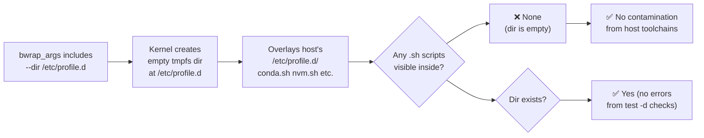

<!-- (c) 2026-* Frederick Bloom -- 20260816-182145-398450-750e-827d-2f45e8c47062-ProfileDirSuppression.spec-0.0.1.md -- Hanaden AI Loader -->
---
filename-id:   20260816-182145-398450-750e-827d-2f45e8c47062-ProfileDirSuppression.spec
node-type:     SPEC
layer:         4
spec-domain:   FUNC
version:       0.0.1
status:        Implemented
author:        Frederick Bloom
copyright:     (c) 2026-* Frederick Bloom
description: >
  /etc/profile.d inside the sandbox MUST be an empty directory, created by a bwrap
  --dir overlay that shadows the host's /etc/profile.d containing conda/nvm/pyenv
  initialization scripts. The directory MUST exist (not missing) but MUST be empty.
parent:        20260816-101335-567491-3888-a3a0-3027a6c05b38-HostShadowing.feat
leaf-value:    "--dir /etc/profile.d (empty directory, no host .sh scripts)"
leaf-unit:     "directory content"
tdd:
  state:          PASS
  test-file:      src/test/hanaden-bwrap-enhanced/BwrapEnhanced2026.strat/UncontainedAgentExecution.driv/NamespaceIsolatedSandbox.moti/HostShadowing.feat/ProfileDirSuppression.spec/test_profile_dir_suppression.sh
  last-run:       2026-08-18T16:08:59Z
  iterations:     1
  coverage-lines: "L270-L278"
---

# ProfileDirSuppression: /etc/profile.d Emptied by --dir Overlay

## Specification Statement

`/etc/profile.d` inside the sandbox MUST exist as an empty directory (via `--dir
/etc/profile.d` bwrap overlay). No `.sh` files from the host MUST be present.

## Rationale

The host `/etc/profile.d/` directory typically contains:
- `conda.sh` — initializes conda base environment
- `nvm.sh` — loads Node Version Manager
- `google-cloud-sdk.sh` — loads gcloud CLI
- `aws-cli.sh` — loads AWS CLI completions
- `pyenv.sh` — initializes pyenv shims

Even if `/etc/profile` is replaced (see ProfileReplacement.spec), tools that directly
source `/etc/profile.d/*.sh` (some login shell configs) would still contaminate the
environment. The `--dir /etc/profile.d` overlay completely neutralizes this by
presenting an empty directory — there are simply no scripts to source.

The directory must EXIST (not be absent) because some scripts test `[ -d /etc/profile.d ]`
before sourcing, and an absent directory would trigger errors.

## Constraints

| Constraint | Value | Condition |
|------------|-------|-----------|
| /etc/profile.d exists inside sandbox | yes (dir present) | Always |
| /etc/profile.d .sh file count inside | 0 | Always |
| Mechanism | --dir /etc/profile.d bwrap overlay | Always |

## Leaf Value

> 🛑 **Primitive** — terminal specification.

**Value:** `/etc/profile.d` exists as empty dir; 0 host .sh files visible
**Source:** bwrap-enhanced.sh L270-L278

## Measurement Method

```bash
# Inside sandbox:
test -d /etc/profile.d && echo "PASS: dir exists"
ls /etc/profile.d/*.sh 2>&1 | grep -q "No such file" && echo "PASS: no scripts"
find /etc/profile.d -name "*.sh" | wc -l  # Expected: 0
```

## Test Suite

> **Suite ID:** 20260816-182145-398450-750e-827d-2f45e8c47062-ProfileDirSuppression.spec-SUITE

### ⚙️ Functional Tests

| ID | Description | Method | Pass Criteria | TDD |
|----|-------------|--------|---------------|-----|
| PDS-001 | /etc/profile.d exists | `test -d /etc/profile.d` inside | exit 0 | NOT_STARTED |
| PDS-002 | /etc/profile.d is empty | `ls /etc/profile.d/` inside | no output | NOT_STARTED |
| PDS-003 | No .sh files | `find /etc/profile.d -name '*.sh'` inside | 0 results | NOT_STARTED |
| PDS-004 | conda.sh absent | `test -f /etc/profile.d/conda.sh` inside | exit 1 | NOT_STARTED |

## References

- bwrap-enhanced.sh L270-L278 (--dir /etc/profile.d in exec_sandbox)

## Changelog

| Version | Date | Author | Changes |
|---------|------|--------|---------|
| 0.0.1 | 2026-08-16 | Frederick Bloom + AI | Initial spec |
| 0.0.1 | 2026-08-17 | Frederick Bloom + AI | Enrich: Rationale (profile.d contamination list), Measurement Method |

## Behavioral Flow


