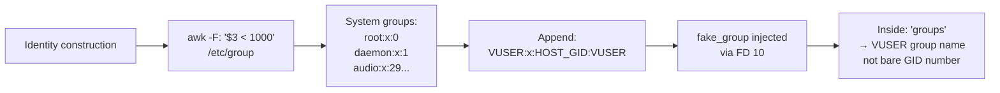

<!-- (c) 2026-* Frederick Bloom -- 20260816-182145-354298-71f3-9cfd-7e1d5157c1c4-GroupSystemClone.spec-0.0.1.md -- Hanaden AI Loader -->
---
filename-id:   20260816-182145-354298-71f3-9cfd-7e1d5157c1c4-GroupSystemClone.spec
node-type:     SPEC
layer:         4
spec-domain:   FUNC
version:       0.0.1
status:        Implemented
author:        Frederick Bloom
copyright:     (c) 2026-* Frederick Bloom
description: >
  The synthetic /etc/group MUST include system groups (GID<1000) cloned from host
  /etc/group and the virtual user's primary group (VIRTUAL_USER_NAME:x:$(id -g):VUSER).
  Host human user groups (GID>=1000, not VUSER's group) MUST NOT be included.
parent:        20260816-101335-345119-c389-12dd-dba63c99bb07-IdentityInjection.feat
leaf-value:    "GID<1000 system groups + VUSER group; human groups absent"
leaf-unit:     "group entries"
tdd:
  state:          PASS
  test-file:      src/test/hanaden-bwrap-enhanced/BwrapEnhanced2026.strat/UncontainedAgentExecution.driv/NamespaceIsolatedSandbox.moti/IdentityInjection.feat/GroupSystemClone.spec/test_group_system_clone.sh
  last-run:       2026-08-18T16:08:59Z
  iterations:     1
  coverage-lines: "L211-L220"
---

# GroupSystemClone: System Groups Cloned from Host /etc/group

## Specification Statement

`fake_group` MUST include all entries from host `/etc/group` where `GID < 1000`
(via `awk -F: '$3 < 1000 { print }' /etc/group`) plus the virtual user's group:
`${VIRTUAL_USER_NAME}:x:$(id -g):${VIRTUAL_USER_NAME}`.

## Rationale

System groups like `root`, `daemon`, `audio`, `video`, `sudo` are checked by many
system tools via `getgrgid()`. Omitting them causes "unknown GID" lookup failures.
The virtual user group ensures `id -g` and `groups` return a named group rather than
a bare GID number.

## Constraints

| Constraint | Value | Condition |
|------------|-------|-----------|
| System groups (GID<1000) | cloned from host | Always |
| VUSER group | VUSER:x:$(id -g):VUSER | Always |
| Human groups (GID>=1000, not VUSER's) | absent | Always |

## Leaf Value

> 🛑 **Primitive** — terminal specification.

**Value:** All GID<1000 host groups + VUSER group present; human groups absent
**Source:** bwrap-enhanced.sh L211-L220

## Measurement Method

```bash
# Inside sandbox:
grep '^root' /etc/group     # Expected: root:x:0:
grep "^$VUSER" /etc/group   # Expected: VUSER:x:$(id -g):VUSER
# Human group absent:
grep '^human-group' /etc/group  # Expected: no match
```

## Test Suite

> **Suite ID:** 20260816-182145-354298-71f3-9cfd-7e1d5157c1c4-GroupSystemClone.spec-SUITE

### ⚙️ Functional Tests

| ID | Description | Method | Pass Criteria | TDD |
|----|-------------|--------|---------------|-----|
| GSC-001 | root group present | `grep ^root /etc/group` inside | root:x:0: | NOT_STARTED |
| GSC-002 | VUSER group present | `grep ^VUSER /etc/group` inside | VUSER:x:GID:VUSER | NOT_STARTED |
| GSC-003 | `groups` command works | `groups` inside | VUSER or GID listed | NOT_STARTED |

## References

- bwrap-enhanced.sh L211-L220 (fake_group construction)

## Changelog

| Version | Date | Author | Changes |
|---------|------|--------|---------|
| 0.0.1 | 2026-08-16 | Frederick Bloom + AI | Initial spec |
| 0.0.1 | 2026-08-17 | Frederick Bloom + AI | Enrich: Rationale, Measurement Method, Leaf Value |

## Behavioral Flow


