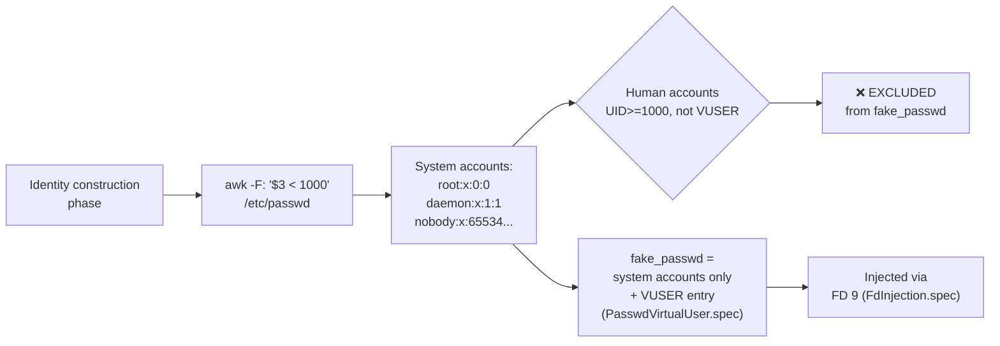

<!-- (c) 2026-* Frederick Bloom -- 20260816-182145-349588-74a9-9f19-62370991c72e-PasswdSystemClone.spec-0.0.1.md -- Hanaden AI Loader -->
---
filename-id:   20260816-182145-349588-74a9-9f19-62370991c72e-PasswdSystemClone.spec
node-type:     SPEC
layer:         4
spec-domain:   FUNC
version:       0.0.1
status:        Implemented
author:        Frederick Bloom
copyright:     (c) 2026-* Frederick Bloom
description: >
  The synthetic /etc/passwd injected into the sandbox MUST include all system accounts
  from the host with UID < 1000 (cloned via awk filter), plus nobody:x:65534:65534.
  Human user accounts from the host (UID >= 1000, not VUSER) MUST NOT appear.
parent:        20260816-101335-345119-c389-12dd-dba63c99bb07-IdentityInjection.feat
leaf-value:    "UID<1000 accounts cloned + nobody appended; human accounts absent"
leaf-unit:     "passwd entries"
tdd:
  state:          PASS
  test-file:      src/test/hanaden-bwrap-enhanced/BwrapEnhanced2026.strat/UncontainedAgentExecution.driv/NamespaceIsolatedSandbox.moti/IdentityInjection.feat/PasswdSystemClone.spec/test_passwd_system_clone.sh
  last-run:       2026-08-18T16:08:59Z
  iterations:     1
  coverage-lines: "L200-L210"
---

# PasswdSystemClone: System Accounts (UID<1000) Cloned from Host /etc/passwd

## Specification Statement

The synthetic `fake_passwd` MUST include all entries from host `/etc/passwd` where
`UID < 1000`, cloned via `awk -F: '$3 < 1000 { print }' /etc/passwd`. It MUST also
include `nobody:x:65534:65534:nobody:/nonexistent:/usr/sbin/nologin`. Host human
accounts (UID ≥ 1000) other than VUSER MUST NOT be included.

## Rationale

System accounts (root, daemon, syslog, messagebus, etc.) are required by many tools:
- `root` is needed for setuid tools that check ownership
- `nobody` is needed by NFS and many network daemons
- `daemon`, `syslog`, `messagebus` are expected by their respective services

Excluding them entirely would cause `id` lookups to return "unknown" for these UIDs,
breaking programs that call `getpwuid()`. Cloning them verbatim ensures programs
behave identically to the host for system accounts.

Human accounts (UID ≥ 1000) are excluded to prevent the sandbox from "knowing" about
other system users — a privacy boundary.

## Constraints

| Constraint | Value | Condition |
|------------|-------|-----------|
| Source for UID<1000 accounts | host /etc/passwd via awk | Always |
| nobody entry | always appended | Always |
| Human accounts (UID≥1000, not VUSER) | absent | Always |
| VUSER entry added separately | yes (PasswdVirtualUser.spec) | Always |

## Leaf Value

> 🛑 **Primitive** — terminal specification.

**Value:** All UID<1000 host accounts + nobody present; human accounts absent
**Source:** bwrap-enhanced.sh L200-L210 (fake_passwd construction)

## Measurement Method

```bash
# Inside sandbox:
grep '^root' /etc/passwd           # Expected: root:x:0:...
grep '^nobody' /etc/passwd         # Expected: nobody:x:65534:...
# Human user (replace 'realuser' with actual operator username):
grep '^realuser' /etc/passwd       # Expected: no match
# Count UID<1000 entries (should match host count):
awk -F: '$3 < 1000 {c++} END{print c}' /etc/passwd
# Expected: same as host awk count
```

## Test Suite

> **Suite ID:** 20260816-182145-349588-74a9-9f19-62370991c72e-PasswdSystemClone.spec-SUITE

### ⚙️ Functional Tests

| ID | Description | Method | Pass Criteria | TDD |
|----|-------------|--------|---------------|-----|
| PSC-001 | root account present | `grep ^root /etc/passwd` inside | root:x:0:... | NOT_STARTED |
| PSC-002 | nobody account present | `grep ^nobody /etc/passwd` inside | nobody:x:65534:... | NOT_STARTED |
| PSC-003 | Host human user absent | `grep ^$(whoami) /etc/passwd` inside (if ≠ VUSER) | no match | NOT_STARTED |
| PSC-004 | System account count matches host | awk count inside == host | equal | NOT_STARTED |

## References

- bwrap-enhanced.sh L200-L210 (fake_passwd: awk -F: '$3 < 1000' construction)

## Changelog

| Version | Date | Author | Changes |
|---------|------|--------|---------|
| 0.0.1 | 2026-08-16 | Frederick Bloom + AI | Initial spec |
| 0.0.1 | 2026-08-17 | Frederick Bloom + AI | Enrich: Rationale, Measurement Method, Leaf Value |

## Behavioral Flow


