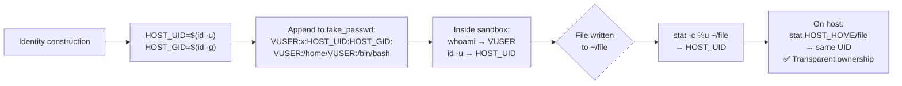

<!-- (c) 2026-* Frederick Bloom -- 20260816-182145-351687-79e2-b271-d96f268482a0-PasswdVirtualUser.spec-0.0.1.md -- Hanaden AI Loader -->
---
filename-id:   20260816-182145-351687-79e2-b271-d96f268482a0-PasswdVirtualUser.spec
node-type:     SPEC
layer:         4
spec-domain:   FUNC
version:       0.0.1
status:        Implemented
author:        Frederick Bloom
copyright:     (c) 2026-* Frederick Bloom
description: >
  The synthetic /etc/passwd MUST include an entry for VIRTUAL_USER_NAME with the
  host's real UID ($(id -u)) and GID ($(id -g)). This ensures file ownership of
  files written to /home/VUSER matches the host operator's UID without requiring
  UID namespace mapping.
parent:        20260816-101335-345119-c389-12dd-dba63c99bb07-IdentityInjection.feat
leaf-value:    "VUSER:x:$(id -u):$(id -g):VUSER:/home/VUSER:/bin/bash"
leaf-unit:     "passwd entry"
tdd:
  state:          PASS
  test-file:      src/test/hanaden-bwrap-enhanced/BwrapEnhanced2026.strat/UncontainedAgentExecution.driv/NamespaceIsolatedSandbox.moti/IdentityInjection.feat/PasswdVirtualUser.spec/test_passwd_virtual_user.sh
  last-run:       2026-08-18T16:08:59Z
  iterations:     1
  coverage-lines: "L206-L212"
---

# PasswdVirtualUser: Virtual User Entry Uses Host Real UID/GID

## Specification Statement

The virtual user entry in `fake_passwd` MUST follow the format:
`${VIRTUAL_USER_NAME}:x:$(id -u):$(id -g):${VIRTUAL_USER_NAME}:/home/${VIRTUAL_USER_NAME}:/bin/bash`

## Rationale

The sandbox bind-mounts `HOST_REAL_HOME_DIR` to `/home/VUSER`. Files in that directory
were created by the host operator (with their real UID). If the virtual user inside
the sandbox had a different UID (e.g., 1000 when the operator is 1001), file ownership
checks would fail and the operator would need complex ACL configuration.

By using `$(id -u)` / `$(id -g)` (the real host UID/GID), the file ownership is
transparent: the sandboxed VUSER is "the same person" as the host operator from the
kernel's perspective, without requiring user namespace UID remapping.

## Constraints

| Constraint | Value | Condition |
|------------|-------|-----------|
| Username field | VIRTUAL_USER_NAME | Always |
| UID field | $(id -u) — host real UID | Always |
| GID field | $(id -g) — host real GID | Always |
| Home directory field | /home/VIRTUAL_USER_NAME | Always |
| Shell field | /bin/bash | Always |

## Leaf Value

> 🛑 **Primitive** — terminal specification.

**Value:** `VUSER:x:UID:GID:VUSER:/home/VUSER:/bin/bash`
**Source:** bwrap-enhanced.sh L206-L212

## Measurement Method

```bash
HOST_UID=$(id -u); HOST_GID=$(id -g); VUSER="sandbox-user"
# Inside sandbox:
grep "^$VUSER" /etc/passwd
# Expected: sandbox-user:x:$HOST_UID:$HOST_GID:sandbox-user:/home/sandbox-user:/bin/bash

id -u  # Expected: $HOST_UID
id -g  # Expected: $HOST_GID
whoami # Expected: $VUSER

# File ownership transparent:
touch ~/ownership-test
stat -c '%u' ~/ownership-test  # Expected: $HOST_UID (matches host UID)
```

## Test Suite

> **Suite ID:** 20260816-182145-351687-79e2-b271-d96f268482a0-PasswdVirtualUser.spec-SUITE

### ⚙️ Functional Tests

| ID | Description | Method | Pass Criteria | TDD |
|----|-------------|--------|---------------|-----|
| PVU-001 | whoami returns VUSER | `whoami` inside | VIRTUAL_USER_NAME | NOT_STARTED |
| PVU-002 | id -u returns host UID | `id -u` inside | $(id -u) on host | NOT_STARTED |
| PVU-003 | id -g returns host GID | `id -g` inside | $(id -g) on host | NOT_STARTED |
| PVU-004 | /etc/passwd entry format correct | grep VUSER /etc/passwd | VUSER:x:UID:GID:... | NOT_STARTED |
| PVU-005 | File ownership transparent | stat ~/file inside | UID == host UID | NOT_STARTED |

## References

- bwrap-enhanced.sh L206-L212 (virtual user entry in fake_passwd)

## Changelog

| Version | Date | Author | Changes |
|---------|------|--------|---------|
| 0.0.1 | 2026-08-16 | Frederick Bloom + AI | Initial spec |
| 0.0.1 | 2026-08-17 | Frederick Bloom + AI | Enrich: Rationale (UID transparency), Measurement Method, Leaf Value |

## Behavioral Flow


