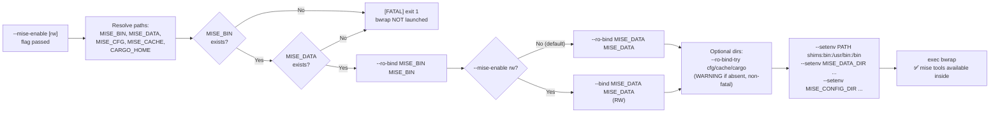

<!-- (c) 2026-* Frederick Bloom -- 20260818-042727-d3615977-9b7f-44ae-MisePassthrough.spec-0.0.1.md -- Hanaden AI Loader -->
---
filename-id:   20260818-042727-d3615977-9b7f-44ae-MisePassthrough.spec
node-type:     SPEC
layer:         4
spec-domain:   FUNC
version:       0.0.1
status:        Implemented
author:        Frederick Bloom
copyright:     (c) 2026-* Frederick Bloom
description: >
  When --mise-enable is passed, mise binary (always RO), data dir (RO default or
  RW with --mise-enable rw), and optional config/cache/cargo dirs (RO-bind-try)
  are bound into the sandbox at their host paths. PATH is set to shims-first.
  MISE_DATA_DIR and MISE_CONFIG_DIR env vars are injected. FATAL if mise binary
  or data dir absent; WARNING (non-fatal) if optional dirs absent.
parent:        20260818-042727-cd786e3d-d1d1-42f9-MisePassthrough.feat
leaf-value:    "mise binary RO + data dir RO/RW + shims-first PATH + FATAL guards"
leaf-unit:     "bind-mounts + env vars"
tdd:
  state:          PASS
  test-file:      src/test/hanaden-bwrap-enhanced/BwrapEnhanced2026.strat/UncontainedAgentExecution.driv/NamespaceIsolatedSandbox.moti/MisePassthrough.feat/MisePassthrough.spec/test_mise_passthrough.sh
  last-run:       2026-08-18T16:08:59Z
  iterations:     1
  coverage-lines: "L418-L468"
---

# MisePassthrough: mise Binary, Data, Config, Cache, Cargo Bound When --mise-enable

## Specification Statement

With `--mise-enable`: the following binds and env injections MUST occur:

**Required (FATAL if absent):**
- `--ro-bind MISE_BIN MISE_BIN` — mise binary at its host path, always RO
- `--ro-bind MISE_DATA MISE_DATA` OR `--bind MISE_DATA MISE_DATA` — mise data dir
  (RO default; RW when `--mise-enable rw` or `MISE_RW=true`)

**Optional (WARNING on stderr if absent, silently skipped):**
- `--ro-bind-try MISE_CFG MISE_CFG` — mise config dir
- `--ro-bind-try MISE_CACHE MISE_CACHE` — mise cache dir
- `--ro-bind-try CARGO_HOME CARGO_HOME` — Cargo home dir (for Rust tools)

**Path resolution** (in order of precedence):
- `MISE_BIN`: `$MISE_BIN` env var → `command -v mise` → `$HOME/.local/bin/mise`
- `MISE_DATA`: `$MISE_DATA_DIR` env var → `$HOME/.local/share/mise`
- `MISE_CFG`: `$MISE_CONFIG_DIR` env var → `$HOME/.config/mise`
- `MISE_CACHE`: `$MISE_CACHE_DIR` env var → `$HOME/.cache/mise`
- `CARGO_HOME`: `$CARGO_HOME` env var → `$HOME/.cargo`

**Environment injections (always with --mise-enable):**
- `--setenv PATH "$MISE_DATA/shims:$(dirname $MISE_BIN):/usr/bin:/bin"` — shims-first
- `--setenv MISE_DATA_DIR "$MISE_DATA"`
- `--setenv MISE_CONFIG_DIR "$MISE_CFG"`

## Rationale

mise manages tools via a shim model: `$MISE_DATA/shims/node` is a symlink to the
mise binary, which reads `argv[0]` to determine which tool version to activate and
exec. The shims must be at the front of `PATH` so that `node`, `python`, `go`, etc.
resolve to the mise-managed versions rather than any system-installed versions.

Binding mise at its host path (not a fixed `/usr/bin/mise`) preserves the shim
symlink resolution: shims point to the real mise binary path at build time.
If mise were bound to a different path inside the sandbox, shim resolution would break.

The data dir is bound RW when `--mise-enable rw` is passed to allow tool installation
or plugin updates inside the sandbox to persist to the host mise install. Default is
RO to enforce immutability.

Optional dirs (config, cache, cargo) are non-fatal because:
- They may legitimately not exist on a fresh mise installation
- Cache can be cold-rebuilt inside the sandbox
- Cargo is only needed for Rust-based tools

## Constraints

| Constraint | Value | Condition |
|------------|-------|-----------|
| mise binary | RO-bound at host path | Always with --mise-enable |
| mise data dir (RO) | RO-bound | --mise-enable (no rw) |
| mise data dir (RW) | RW-bound | --mise-enable rw OR MISE_RW=true |
| FATAL if mise binary absent | exit 1 + FATAL on stderr | Always |
| FATAL if mise data dir absent | exit 1 + FATAL on stderr | Always |
| WARNING if config dir absent | WARNING on stderr (non-fatal) | Config dir missing |
| WARNING if cache dir absent | WARNING on stderr (non-fatal) | Cache dir missing |
| WARNING if CARGO_HOME absent | WARNING on stderr (non-fatal) | Cargo dir missing |
| PATH | shims-first: $MISE_DATA/shims:$(dirname $MISE_BIN):/usr/bin:/bin | Always with --mise-enable |
| MISE_DATA_DIR env | injected ($MISE_DATA) | Always with --mise-enable |
| MISE_CONFIG_DIR env | injected ($MISE_CFG) | Always with --mise-enable |
| Default: no mise | PATH=/usr/bin:/bin | Without --mise-enable |

## Leaf Value

> 🛑 **Primitive** — terminal specification.

**Value:** mise binary RO + data dir (RO or RW) + shims-first PATH + FATAL guards for binary and data dir
**Source:** bwrap-enhanced.sh L418-L468

## Measurement Method

```bash
MISE_DATA="${MISE_DATA_DIR:-$HOME/.local/share/mise}"
MISE_BIN="${MISE_BIN:-$(command -v mise 2>/dev/null || echo "$HOME/.local/bin/mise")}"

# mise available inside sandbox:
./bwrap-enhanced.sh ... --mise-enable -- mise --version
# Expected: mise version string

# shims-first PATH:
./bwrap-enhanced.sh ... --mise-enable -- bash -c 'echo $PATH | grep -q shims && echo PASS'
# Expected: PASS

# node via mise shim:
./bwrap-enhanced.sh ... --mise-enable -- bash -c 'which node; node --version'
# Expected: $MISE_DATA/shims/node; vX.Y.Z

# FATAL if mise binary absent:
MISE_BIN=/nonexistent ./bwrap-enhanced.sh --mise-enable -- /bin/true 2>&1
# Expected: [FATAL] -- bwrap not launched

# FATAL if data dir absent:
MISE_DATA_DIR=/nonexistent ./bwrap-enhanced.sh --mise-enable -- /bin/true 2>&1
# Expected: [FATAL] -- bwrap not launched

# RO default: cannot install tools
./bwrap-enhanced.sh ... --mise-enable -- bash -c \
  'touch "$MISE_DATA_DIR/probe" 2>&1'
# Expected: Read-only file system

# RW upgrade:
./bwrap-enhanced.sh ... --mise-enable rw -- bash -c \
  'touch "$MISE_DATA_DIR/probe" && echo PASS'
# Expected: PASS
```

## Test Suite

> **Suite ID:** 20260818-042727-d3615977-9b7f-44ae-MisePassthrough.spec-SUITE

### ⚙️ Functional Tests

| ID | Description | Method | Pass Criteria | TDD |
|----|-------------|--------|---------------|-----|
| MISE-001 | mise --version works inside sandbox | `mise --version` inside | version string | NOT_STARTED |
| MISE-002 | PATH contains shims first | `echo $PATH` inside | $MISE_DATA/shims at front | NOT_STARTED |
| MISE-003 | node resolves via mise shim | `which node` inside | $MISE_DATA/shims/node | NOT_STARTED |
| MISE-004 | MISE_DATA_DIR env injected | `echo $MISE_DATA_DIR` inside | mise data path | NOT_STARTED |
| MISE-005 | MISE_CONFIG_DIR env injected | `echo $MISE_CONFIG_DIR` inside | mise config path | NOT_STARTED |
| MISE-006 | Data dir RO by default | `touch $MISE_DATA_DIR/probe` inside | EROFS | NOT_STARTED |
| MISE-007 | Data dir RW with --mise-enable rw | `touch $MISE_DATA_DIR/probe` inside | exit 0 | NOT_STARTED |
| MISE-008 | FATAL if mise binary absent | MISE_BIN=/nonexistent → exit code | $? ≥ 1 + [FATAL] | NOT_STARTED |
| MISE-009 | FATAL if data dir absent | MISE_DATA_DIR=/nonexistent → exit code | $? ≥ 1 + [FATAL] | NOT_STARTED |
| MISE-010 | WARNING (non-fatal) if cache absent | MISE_CACHE_DIR=/nonexistent → stderr | WARNING on stderr; exit 0 | NOT_STARTED |
| MISE-011 | WARNING (non-fatal) if config absent | MISE_CONFIG_DIR=/nonexistent → stderr | WARNING on stderr; exit 0 | NOT_STARTED |
| MISE-012 | cargo available via CARGO_HOME bind | `cargo --version` inside (if installed) | version or ENOENT | NOT_STARTED |
| MISE-013 | Default: no mise shims in PATH | `echo $PATH` inside (no flag) | no /shims | NOT_STARTED |

### 🛡️ Security Tests

| ID | Description | Attack / Scenario | Expected Defense | TDD |
|----|-------------|-------------------|------------------|-----|
| MISE-S001 | Cannot modify mise binary | `touch $MISE_BIN` inside | EROFS (always RO) | NOT_STARTED |
| MISE-S002 | Cannot modify shims (RO mode) | `touch $MISE_DATA/shims/evil` inside | EROFS | NOT_STARTED |
| MISE-S003 | Tool versions isolated (no system node) | `which node` without --mise-enable | not found or system node only | NOT_STARTED |

## References

- bwrap-enhanced.sh L418-L468 (ENABLE_MISE block: path resolution, FATAL guards, bind logic, env injection)
- bwrap-enhanced.sh L746-L752 (CLI: --mise-enable [rw] parser)
- mise documentation — https://mise.jdx.dev/

## Changelog

| Version | Date | Author | Changes |
|---------|------|--------|---------|
| 0.0.1 | 2026-08-18 | Frederick Bloom + AI | Initial spec — reverse-engineered from bwrap-enhanced.sh L418-L468 |

## Behavioral Flow


