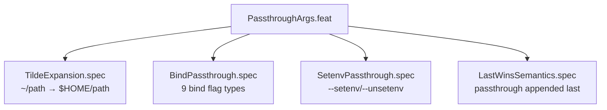

<!-- (c) 2026-* Frederick Bloom -- PassthroughArgs.feat-0.0.1.md -- Hanaden AI Loader -->
---
filename-id:   20260816-182145-PassthroughArgs.feat
node-type:     FEAT
layer:         2
version:       0.0.1
status:        Implemented
author:        Frederick Bloom
copyright:     (c) 2026-* Frederick Bloom
parent:        20260816-182145-NamespaceIsolatedSandbox.moti
description: >
  Feature: Callers can pass arbitrary bwrap bind/env flags via the CLI. All 9 bind
  flag types accepted. Tilde expansion applied. Passthrough appended AFTER engine args
  (last-wins for --setenv). Security mounts cannot be removed via passthrough.
---

# PassthroughArgs: Caller-Extensible bwrap Args

## Rationale

No fixed set of engine defaults can anticipate all workload resource needs. The
passthrough mechanism gives callers full bwrap composability while preserving security:
engine args come first (establishing security invariants), passthrough args come last
(allowing env overrides but not mount removal). This is the "open extension, closed
modification" principle applied to a security boundary.

## Feature Overview

## Changelog

| Version | Date | Author | Changes |
|---------|------|--------|---------|
| 0.0.1 | 2026-08-16 | Frederick Bloom + AI | Initial |
| 0.0.1 | 2026-08-17 | Frederick Bloom + AI | Enriched |
