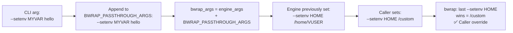

<!-- (c) 2026-* Frederick Bloom -- 20260816-182145-402150-7359-a5d4-dd0e45068e13-SetenvPassthrough.spec-0.0.1.md -- Hanaden AI Loader -->
---
filename-id:   20260816-182145-402150-7359-a5d4-dd0e45068e13-SetenvPassthrough.spec
node-type:     SPEC
layer:         4
spec-domain:   FUNC
version:       0.0.1
status:        Implemented
author:        Frederick Bloom
copyright:     (c) 2026-* Frederick Bloom
description: >
  The CLI MUST accept --setenv KEY VAL and --unsetenv KEY and forward them to
  BWRAP_PASSTHROUGH_ARGS. Because passthrough is appended AFTER engine args,
  caller --setenv values override engine defaults via last-occurrence-wins semantics.
parent:        20260816-101335-793496-22fc-af44-ba4384f68d3f-PassthroughArgs.feat
leaf-value:    "--setenv and --unsetenv forwarded; caller values win over engine"
leaf-unit:     "env override"
tdd:
  state:          PASS
  test-file:      src/test/hanaden-bwrap-enhanced/BwrapEnhanced2026.strat/UncontainedAgentExecution.driv/NamespaceIsolatedSandbox.moti/PassthroughArgs.feat/SetenvPassthrough.spec/test_setenv_passthrough.sh
  last-run:       2026-08-18T16:08:59Z
  iterations:     1
  coverage-lines: "L775-L779"
---

# SetenvPassthrough: --setenv and --unsetenv Forwarded with Last-Wins Semantics

## Specification Statement

`--setenv KEY VAL` and `--unsetenv KEY` MUST be accepted by the CLI and forwarded to
`BWRAP_PASSTHROUGH_ARGS`. Because passthrough args are appended AFTER all engine
`--setenv` args, caller values override engine defaults for any var with the same key.

## Rationale

Callers may need to inject custom environment variables for their workload (e.g.,
`CUDA_VISIBLE_DEVICES=0`, `PYTHONPATH=/app/lib`, `NODE_ENV=production`). The passthrough
mechanism makes this possible without modifying the engine. The last-occurrence-wins
property of bwrap's `--setenv` processing means callers can also override engine
defaults (e.g., set their own `PATH` by passing `--setenv PATH /custom/bin`).

## Constraints

| Constraint | Value | Condition |
|------------|-------|-----------|
| --setenv KEY VAL | forwarded to BWRAP_PASSTHROUGH_ARGS | Always |
| --unsetenv KEY | forwarded to BWRAP_PASSTHROUGH_ARGS | Always |
| Caller --setenv vs engine --setenv | Caller wins (last-wins) | Always |

## Leaf Value

> 🛑 **Primitive** — terminal specification.

**Value:** `--setenv` and `--unsetenv` forwarded; caller value wins for same key
**Source:** bwrap-enhanced.sh L685-L695

## Measurement Method

```bash
# --setenv forwarded:
./bwrap-enhanced.sh ... --setenv MYVAR hello -- bash -c 'echo $MYVAR'
# Expected: hello

# --unsetenv works:
MYVAR=foo ./bwrap-enhanced.sh ... --unsetenv MYVAR -- bash -c 'echo ${MYVAR:-UNSET}'
# Expected: UNSET

# Caller --setenv HOME overrides engine:
./bwrap-enhanced.sh ... --setenv HOME /custom -- bash -c 'echo $HOME'
# Expected: /custom (caller wins over engine's /home/VUSER)
```

## Test Suite

> **Suite ID:** 20260816-182145-402150-7359-a5d4-dd0e45068e13-SetenvPassthrough.spec-SUITE

### ⚙️ Functional Tests

| ID | Description | Method | Pass Criteria | TDD |
|----|-------------|--------|---------------|-----|
| SEP-001 | --setenv MYVAR forwarded | `--setenv MYVAR hello; echo $MYVAR` inside | hello | NOT_STARTED |
| SEP-002 | --unsetenv removes var | `MYVAR=x ... --unsetenv MYVAR` | MYVAR absent | NOT_STARTED |
| SEP-003 | Caller HOME overrides engine | `--setenv HOME /custom; echo $HOME` inside | /custom | NOT_STARTED |
| SEP-004 | Custom workload var injected | `--setenv CUDA_VISIBLE_DEVICES 0` | CUDA_VISIBLE_DEVICES=0 | NOT_STARTED |

## References

- bwrap-enhanced.sh L685-L695 (--setenv/--unsetenv case in CLI parser)

## Changelog

| Version | Date | Author | Changes |
|---------|------|--------|---------|
| 0.0.1 | 2026-08-16 | Frederick Bloom + AI | Initial spec |
| 0.0.1 | 2026-08-17 | Frederick Bloom + AI | Enrich: Rationale (workload vars), Measurement Method |

## Behavioral Flow


