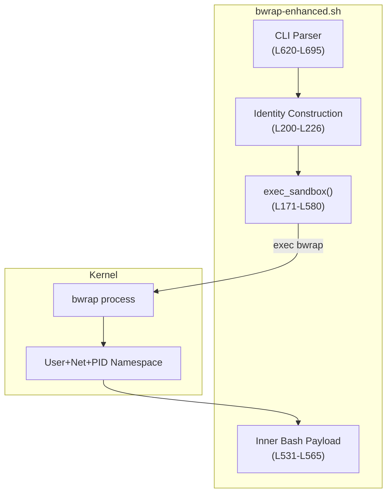
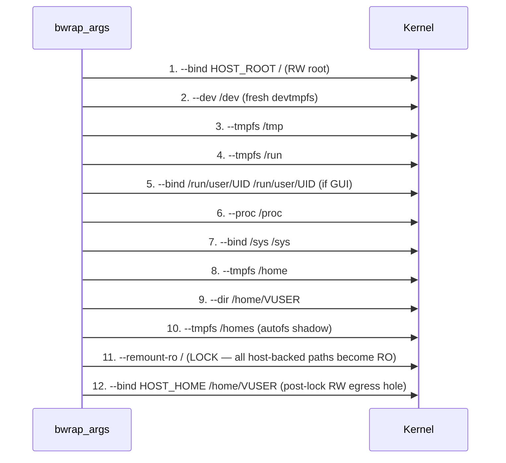

<!-- (c) 2026-* Frederick Bloom -- SandboxExecEngine.arch-0.0.1.md -- Hanaden AI Loader -->
---
filename-id:   20260816-182145-SandboxExecEngine.arch
node-type:     ARCH
layer:         3
version:       0.0.1
status:        Implemented
author:        Frederick Bloom
copyright:     (c) 2026-* Frederick Bloom
description: >
  Architecture: exec_sandbox() function that builds a bwrap_args array via a
  12-step VFS sequence, then exec-replaces the shell with bwrap. Inner bash payload
  handles orphan reaping. Identity files injected via bash FD here-strings.
---

# SandboxExecEngine: Architecture

## Rationale

The architecture must produce a bwrap invocation with ~80 arguments in a precise order
without any intermediate files, disk writes, or temporary state. The solution is a bash
function that builds an array (`bwrap_args`) incrementally, then `exec bwrap` to
replace the shell process entirely (no PID overhead, no cleanup required).

## Component Diagram



## 12-Step VFS Mount Sequence Invariant



## Identity Injection via FD Here-Strings

```mermaid
sequenceDiagram
    participant SH as bash shell
    participant BWRAP as bwrap
    participant NS as namespace /etc

    SH->>SH: fake_passwd=$(awk -F: '$3<1000' /etc/passwd; echo VUSER:x:UID:GID:...)
    SH->>SH: fake_group=$(awk -F: '$3<1000' /etc/group; echo VUSER:x:GID:VUSER)
    SH->>SH: fake_profile="PATH=/usr/bin:/bin\nexport PATH"
    SH->>BWRAP: exec bwrap [args] --ro-bind-data 9 /etc/passwd \
               --ro-bind-data 10 /etc/group \
               --ro-bind-data 11 /etc/profile \
               9<<<$fake_passwd 10<<<$fake_group 11<<<$fake_profile
    BWRAP->>NS: maps FD9 → /etc/passwd (memory-backed, RO)
    BWRAP->>NS: maps FD10 → /etc/group (memory-backed, RO)
    BWRAP->>NS: maps FD11 → /etc/profile (memory-backed, RO)
```

## Exec Contract

- `exec_sandbox()` MUST replace the shell process via `exec bwrap ...`
- Zero child processes remain after exec (no cleanup needed)
- bwrap exit code == inner bash exit code == CMD exit code

## Changelog

| Version | Date | Author | Changes |
|---------|------|--------|---------|
| 0.0.1 | 2026-08-16 | Frederick Bloom + AI | Initial |
| 0.0.1 | 2026-08-17 | Frederick Bloom + AI | Enriched: 12-step sequence diagram, FD injection diagram, Rationale |

## VFS Mount Sequence (12 Steps — code SST: bwrap-enhanced.sh L36-L98)

| Step | bwrap flag | Mode | Persists to Host? | Spec |
|------|-----------|------|-------------------|------|
| 1 | `--bind $HOST_REAL_ROOT /` | RW | Yes (host root) | ReadOnlyRoot, ZeroMutation |
| 2 | `--ro-bind /usr /usr` + symlinks /lib,/lib64,/bin | RO | No | UsrMergeSymlinks |
| 3 | `--ro-bind-try /etc/alternatives`, resolv.conf, ssl, ld.so.cache | RO | No | (system compat) |
| 4 | `--ro-bind-data 10 /etc/group`, `--ro-bind-data 11 /etc/profile` | RO | No | GroupSystemClone, MinimalProfile |
| 5 | `--proc /proc` + `--dev-bind /dev /dev` | RW* | Passthrough | PureBuiltinLoop |
| 6 | `--tmpfs /dev/shm` + `--tmpfs /tmp` + X11 socket | RW/RO | No | X11Socket |
| 7 | `--bind-try /run/dbus` + `--tmpfs /run/user/UID` + conditionals (7a-7f) | RO/RW | Conditional | WaylandDisplay, AudioPassthrough, A11yPassthrough, DbusIpcWritable, GnomePassthrough, KdePassthrough |
| 8 | `--tmpfs /homes` + `--tmpfs /home` + `--dir /home/VUSER` | RW | No | TmpfsHomeOverlay, ProfileDirSuppression |
| 9 | `--bind $HOST_REAL_HOME /home/VUSER` (initial, before root lock) | RW | **YES** | RwEgressHome |
| 10 | `--ro-bind-data 9 /etc/passwd` | RO | No | PasswdSystemClone, PasswdVirtualUser |
| 11 | `--remount-ro /` | -- | No | ReadOnlyRoot |
| 12 | `--bind $HOST_REAL_HOME /home/VUSER` (re-applied after root lock = write-hole) | RW | **YES** | RwEgressHome, BindSequence |

## Identity Injection (FD Here-strings)

Three files are built in memory (no disk writes) and injected as bash FD here-strings:

```
FD 9  → fake_passwd  → /etc/passwd  (--ro-bind-data 9)
FD 10 → fake_group   → /etc/group   (--ro-bind-data 10)
FD 11 → fake_profile → /etc/profile (--ro-bind-data 11)
```

`fake_passwd` = system UIDs (from host `/etc/passwd`) + VIRTUAL_USER entry
`fake_group` = system GIDs (from host `/etc/group`) + VIRTUAL_USER entry
`fake_profile` = minimal PATH only (no host profile.d sourcing)

## Inner Bash Payload (ForegroundHold pattern)

```bash
exec bwrap ${bwrap_args[@]} /bin/bash -c '
    trap ":" CHLD                    # Reap zombies on SIGCHLD
    "$@"; _CMD_EXIT=$?               # Run CMD synchronously, capture exit
    while true; do                   # Poll /proc (builtins only!)
        read -r children < /proc/1/task/1/children
        [ -z "$children" ] && break
        read -t 0.5 _
    done
    exit "$_CMD_EXIT"                # Propagate CMD exit code
' -- "${command[@]}" 9<<<fake_passwd 10<<<fake_group 11<<<fake_profile
```

Key invariants:
- `exec bwrap` replaces shell (no child PID)
- All poll loop commands are bash builtins (no fork)
- Exit code of CMD = exit code of bwrap-enhanced.sh

## tdd
```
tdd:
  state:          NOT_STARTED
  test-file:      null
  last-run:       null
  iterations:     0
  coverage-lines: "L15-L555"
```

## Changelog
| Version | Date | Author | Changes |
|---------|------|--------|---------|
| 0.0.1 | 2026-08-16 | Frederick Bloom + AI | Initial stub |
| 0.0.2 | 2026-08-18 | AI | Completed: VFS table, identity injection, inner bash payload from code SST |
