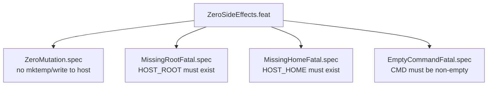

<!-- (c) 2026-* Frederick Bloom -- ZeroSideEffects.feat-0.0.1.md -- Hanaden AI Loader -->
---
filename-id:   20260816-182145-ZeroSideEffects.feat
node-type:     FEAT
layer:         2
version:       0.0.1
status:        Implemented
author:        Frederick Bloom
copyright:     (c) 2026-* Frederick Bloom
parent:        20260816-182145-NamespaceIsolatedSandbox.moti
description: >
  Feature: The sandbox MUST leave zero side effects on the host filesystem.
  Any write inside the sandbox to host-backed paths MUST fail with EROFS.
  Missing required inputs MUST cause FATAL before sandbox is spawned.
---

# ZeroSideEffects: No Host Mutation on Entry or Exit

## Rationale

An AI agent sandbox that can silently modify the host filesystem provides no safety
guarantee. The most dangerous mutations are: overwriting config files, writing new
setuid binaries, or polluting system directories. `--remount-ro /` makes all these
impossible at the kernel level — no userspace policy needed.

Pre-execution validation (missing root/home/command) prevents the common failure mode
where a sandbox is launched without required inputs and silently does nothing.

## Feature Overview

## Changelog

| Version | Date | Author | Changes |
|---------|------|--------|---------|
| 0.0.1 | 2026-08-16 | Frederick Bloom + AI | Initial |
| 0.0.1 | 2026-08-17 | Frederick Bloom + AI | Enriched: Rationale, Mermaid tree |
