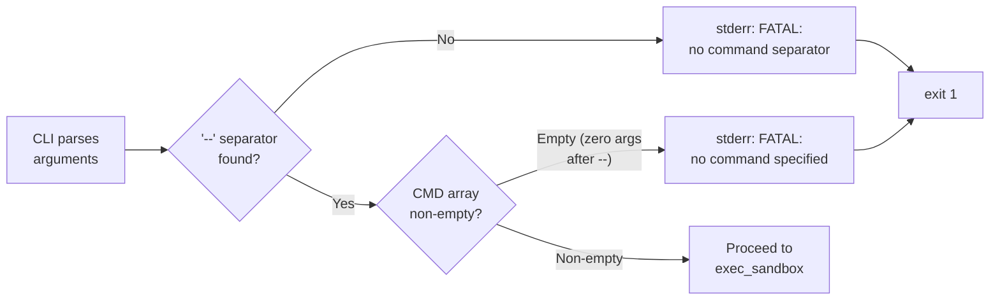

<!-- (c) 2026-* Frederick Bloom -- 20260816-101335-601386-eb43-9eb5-6c8cfb64d8fb-EmptyCommandFatal.spec-0.0.1.md -- Hanaden AI Loader -->
---
filename-id:   20260816-101335-601386-eb43-9eb5-6c8cfb64d8fb-EmptyCommandFatal.spec
node-type:     SPEC
layer:         4
spec-domain:   FUNC
version:       0.0.1
status:        Implemented
author:        Frederick Bloom
copyright:     (c) 2026-* Frederick Bloom
description: >
  If no TARGET_CMD is specified (argument array is empty after all flags are consumed),
  bwrap-enhanced.sh MUST print a FATAL ERROR and usage instructions to stderr and
  exit with non-zero code without launching bwrap.
parent:        20260816-101335-625206-4466-d976-ccc25027e9ed-ZeroSideEffects.feat
leaf-value:    "exit code >= 1 with FATAL + usage on stderr"
leaf-unit:     "exit code"
tdd:
  state:          PASS
  test-file:      src/test/hanaden-bwrap-enhanced/BwrapEnhanced2026.strat/UncontainedAgentExecution.driv/NamespaceIsolatedSandbox.moti/ZeroSideEffects.feat/EmptyCommandFatal.spec/test_empty_command_fatal.sh
  last-run:       2026-08-18T16:08:59Z
  iterations:     1
  coverage-lines: "L795-L804"
---

# EmptyCommandFatal: FATAL Exit When No Command Specified

## Specification Statement

When no TARGET_CMD is provided (i.e., `$#` is 0 after flag parsing), `bwrap-enhanced.sh`
MUST emit "FATAL ERROR: No command specified" (or equivalent) and usage instructions
to stderr, then exit with a non-zero code. bwrap MUST NOT be launched.

## Rationale

Launching `exec bwrap ... -- bash -c ""` would silently succeed with exit 0, giving the
caller no indication that they forgot to provide a command. This is especially dangerous
in scripted invocations where an empty command variable can accidentally succeed. The
pre-launch empty-command check ensures the operator gets an immediate, actionable error.

## Constraints

| Constraint | Value | Condition |
|------------|-------|-----------|
| Exit code | ≥ 1 | Always when CMD empty |
| "No command" message on stderr | MUST appear | Always |
| Usage instructions on stderr | MUST appear | Always |
| bwrap launched | MUST NOT | When CMD empty |

## Leaf Value

> 🛑 **Primitive** — terminal specification.

**Value:** `exit code ≥ 1, "No command" message + usage on stderr`
**Source:** L708-L718 bwrap-enhanced.sh validation block.

## Measurement Method

```bash
# Invoke with no CMD (all flags, no positional args)
output=$(./bwrap-enhanced.sh \
  --host-real-root / \
  --host-real-home-parent /tmp 2>&1)
exit_code=$?
test $exit_code -ge 1                         && echo "PASS: non-zero"
echo "$output" | grep -qi "no command\|FATAL" && echo "PASS: FATAL message"
echo "$output" | grep -qi "usage\|Usage"      && echo "PASS: usage present"
```

## Test Suite

> **Suite ID:** 20260816-101335-601386-eb43-9eb5-6c8cfb64d8fb-EmptyCommandFatal.spec-SUITE

### ⚙️ Functional Tests

| ID | Description | Method | Pass Criteria | TDD |
|----|-------------|--------|---------------|-----|
| ECF-001 | Non-zero exit on empty CMD | no CMD arg → $? | $? ≥ 1 | NOT_STARTED |
| ECF-002 | "No command" in stderr | grep stderr | "no command" or "FATAL" | NOT_STARTED |
| ECF-003 | Usage in stderr | grep stderr | "Usage" or "usage" | NOT_STARTED |
| ECF-004 | Empty after -- separator also FATAL | `-- ` with no args after | exit ≥1 + FATAL | NOT_STARTED |
| ECF-005 | bwrap not launched | pgrep bwrap | 0 results | NOT_STARTED |

## References

- bwrap-enhanced.sh L708-L718 (empty command check)

## Changelog

| Version | Date | Author | Changes |
|---------|------|--------|---------|
| 0.0.1 | 2026-08-16 | Frederick Bloom + AI | Initial spec |
| 0.0.1 | 2026-08-16 | Frederick Bloom + AI | Enrich: Rationale, Measurement Method, Leaf Value |

## Behavioral Flow


