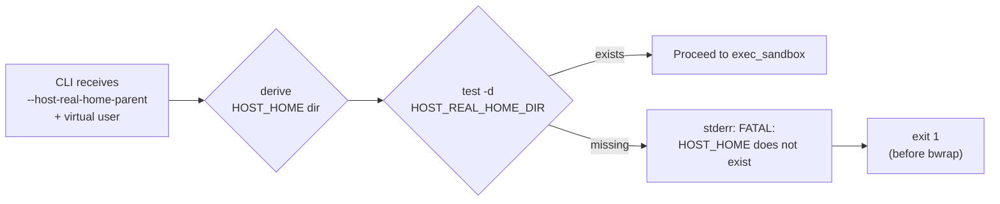

<!-- (c) 2026-* Frederick Bloom -- 20260816-101335-622474-aa66-e09f-7e83a66b1e16-MissingHomeFatal.spec-0.0.1.md -- Hanaden AI Loader -->
---
filename-id:   20260816-101335-622474-aa66-e09f-7e83a66b1e16-MissingHomeFatal.spec
node-type:     SPEC
layer:         4
spec-domain:   FUNC
version:       0.0.1
status:        Implemented
author:        Frederick Bloom
copyright:     (c) 2026-* Frederick Bloom
description: >
  If HOST_REAL_HOME_DIR (= HOST_REAL_HOME_PARENT / VIRTUAL_USER_NAME) does not exist
  as a directory, bwrap-enhanced.sh MUST print FATAL ERROR to stderr and exit with
  non-zero exit code without launching bwrap.
parent:        20260816-101335-625206-4466-d976-ccc25027e9ed-ZeroSideEffects.feat
leaf-value:    "exit code >= 1 with FATAL on stderr"
leaf-unit:     "exit code"
tdd:
  state:          PASS
  test-file:      src/test/hanaden-bwrap-enhanced/BwrapEnhanced2026.strat/UncontainedAgentExecution.driv/NamespaceIsolatedSandbox.moti/ZeroSideEffects.feat/MissingHomeFatal.spec/test_missing_home_fatal.sh
  last-run:       2026-08-18T16:08:59Z
  iterations:     1
  coverage-lines: "L816-L827"
---

# MissingHomeFatal: FATAL Exit When HOST_HOME_DIR Does Not Exist

## Specification Statement

When `HOST_REAL_HOME_DIR` (`HOST_REAL_HOME_PARENT/VIRTUAL_USER_NAME`) does not exist
as a directory, `bwrap-enhanced.sh` MUST emit a FATAL ERROR to stderr, exit ≥1,
and MUST NOT launch bwrap.

## Rationale

The egress home directory is the single authorized write path. If it does not exist,
the sandbox would have no place for the agent to persist work. Silently launching would
create a confusing state where writes fail with EROFS (no RW bind). Pre-validating
ensures the operator gets a clear actionable error with the expected path, not a
cryptic EROFS mid-execution.

## Constraints

| Constraint | Value | Condition |
|------------|-------|-----------|
| Exit code | ≥ 1 | Always when HOME_DIR missing |
| FATAL on stderr | MUST appear | Always |
| FATAL message includes | Expected path | Always |
| bwrap launched | MUST NOT | When HOME_DIR missing |

## Leaf Value

> 🛑 **Primitive** — terminal specification.

**Value:** `exit code ≥ 1, FATAL on stderr, bwrap not launched`
**Source:** L730-L740 bwrap-enhanced.sh validation block.

## Measurement Method

```bash
FAKE_HOME_PARENT="/tmp"
FAKE_VUSER="nonexistent-user-$$"
# FAKE_HOME_PARENT/FAKE_VUSER does NOT exist
output=$(./bwrap-enhanced.sh \
  --host-real-home-parent "$FAKE_HOME_PARENT" \
  --virtual-user-name "$FAKE_VUSER" \
  -- /bin/true 2>&1)
exit_code=$?
test $exit_code -ge 1              && echo "PASS: non-zero exit"
echo "$output" | grep -qi "FATAL" && echo "PASS: FATAL on stderr"
echo "$output" | grep -q "$FAKE_HOME_PARENT/$FAKE_VUSER" && echo "PASS: path in message"
```

## Test Suite

> **Suite ID:** 20260816-101335-622474-aa66-e09f-7e83a66b1e16-MissingHomeFatal.spec-SUITE

### ⚙️ Functional Tests

| ID | Description | Method | Pass Criteria | TDD |
|----|-------------|--------|---------------|-----|
| MHF-001 | Non-zero exit when home absent | missing home path → $? | $? ≥ 1 | NOT_STARTED |
| MHF-002 | FATAL on stderr | grep stderr | "FATAL" present | NOT_STARTED |
| MHF-003 | Expected path in message | grep expected path in stderr | match | NOT_STARTED |
| MHF-004 | bwrap not launched | pgrep bwrap | 0 results | NOT_STARTED |
| MHF-005 | 0 host mutations | find -newer ref | 0 results | NOT_STARTED |

## References

- bwrap-enhanced.sh L730-L740 (HOME_DIR validation)

## Changelog

| Version | Date | Author | Changes |
|---------|------|--------|---------|
| 0.0.1 | 2026-08-16 | Frederick Bloom + AI | Initial spec |
| 0.0.1 | 2026-08-16 | Frederick Bloom + AI | Enrich: Rationale, Measurement Method, Leaf Value, tests |

## Behavioral Flow


