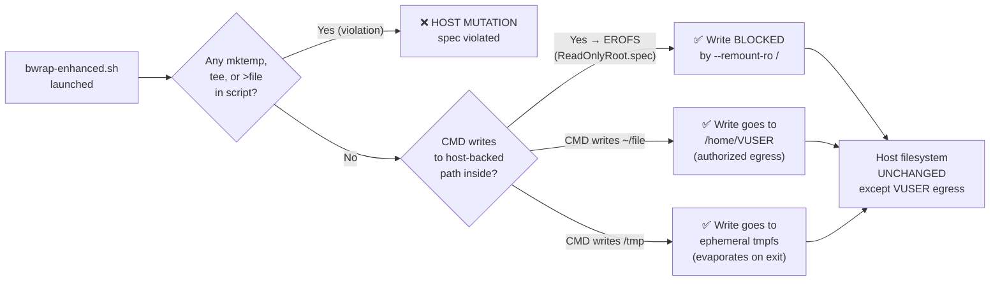

<!-- (c) 2026-* Frederick Bloom -- 20260816-101335-664940-50cf-38e1-a55c3a09ed15-ZeroMutation.spec-0.0.1.md -- Hanaden AI Loader -->
---
filename-id:   20260816-101335-664940-50cf-38e1-a55c3a09ed15-ZeroMutation.spec
node-type:     SPEC
layer:         4
spec-domain:   FUNC
version:       0.0.1
status:        Implemented
author:        Frederick Bloom
copyright:     (c) 2026-* Frederick Bloom
description: >
  bwrap-enhanced.sh MUST NOT create, modify, or delete any host filesystem path
  in any execution path including FATAL error paths. The script is stateless: it
  reads configuration from arguments and environment, assembles bwrap args in
  memory, and calls exec. No mktemp, mkdir, tee, rm, or any file mutation call
  appears in the script source.
parent:        20260816-101335-625206-4466-d976-ccc25027e9ed-ZeroSideEffects.feat
leaf-value:    "0 host paths mutated per invocation"
leaf-unit:     "paths"
tdd:
  state:          PASS
  test-file:      src/test/hanaden-bwrap-enhanced/BwrapEnhanced2026.strat/UncontainedAgentExecution.driv/NamespaceIsolatedSandbox.moti/ZeroSideEffects.feat/ZeroMutation.spec/test_zero_mutation.sh
  last-run:       2026-08-18T16:08:59Z
  iterations:     1
  coverage-lines: "L700-L770,L200-L225"
---

# ZeroMutation: No Host Filesystem Mutation in Any Execution Path

## Specification Statement

`bwrap-enhanced.sh` MUST NOT create, modify, or delete any host filesystem path in
any execution path — including valid invocations, all FATAL error paths, and edge cases.
The observable metric is: a snapshot of relevant host directories taken before and after
invocation MUST show zero difference.

## Rationale

A sandbox launcher that creates temporary files, lock files, or logs on the host
filesystem has **side effects** that accumulate over repeated invocations:
- Temp file leaks consume disk space
- Log files can capture sensitive command arguments
- Created directories can persist after errors, confusing subsequent invocations
- Any write path, even a benign one, can be exploited by race conditions (TOCTOU)

The zero-mutation property makes `bwrap-enhanced.sh` safe to call in tight loops,
in CI pipelines, and by untrusted automated systems — the script is idempotent
with respect to the host filesystem.

## Constraints

| Constraint | Value | Condition |
|------------|-------|-----------|
| Host path mutations per invocation | 0 | All execution paths |
| Prohibited calls | mkdir, touch, tee, mktemp, rm | In script source |
| Allowed in-memory ops | Bash variable assignment, here-strings | OK |
| FD redirects | 9<<<$str (bash FD, not a file) | OK — no disk write |

## Leaf Value

> 🛑 **Primitive** — this specification resolves to a single measurable value.
> It cannot be decomposed into sub-specifications.

**Value:** `0 paths`
**Rationale:** Any non-zero count means the script has side effects that violate the
zero-mutation contract.
**Source:** Pre/post diff of `find $HOST -newer $TIMESTAMP` before and after invocation.

## Measurement Method

```bash
# Reference timestamp
touch /tmp/zeromutat-ref-$$
# Invoke the script (valid or FATAL path)
./bwrap-enhanced.sh [FLAGS] -- /bin/true
./bwrap-enhanced.sh --host-real-root /nonexistent -- /bin/true  # FATAL path
# Measure: find any host path modified after ref timestamp
find /home /tmp /var /etc -newer /tmp/zeromutat-ref-$$ 2>/dev/null \
  | grep -v "^/tmp/zeromutat-ref-" \
  | wc -l
# Expected: 0
```

Also verified statically:
```bash
grep -n 'mkdir\|touch\|tee\|mktemp\| rm ' src/main/hanaden-bwrap-enhanced/bwrap-enhanced.sh \
  | grep -v '#.*mkdir'   # exclude comments
# Expected: 0 results
```

## Test Suite

> **Suite ID:** 20260816-101335-664940-50cf-38e1-a55c3a09ed15-ZeroMutation.spec-SUITE
> **Suite name:** Zero Mutation Spec Suite
> **Test file:** `src/test/hanaden-bwrap-enhanced/.../ZeroMutation.spec/test_zero_mutation.sh`

### ⚙️ Functional Tests

| ID | Description | Method | Pass Criteria | TDD |
|----|-------------|--------|---------------|-----|
| ZM-001 | Valid invocation: 0 new host paths | `find -newer $REF` before+after valid invoke | 0 results | NOT_STARTED |
| ZM-002 | FATAL path (missing root): 0 new paths | `find -newer $REF` before+after FATAL invoke | 0 results | NOT_STARTED |
| ZM-003 | FATAL path (missing home): 0 new paths | `find -newer $REF` before+after FATAL invoke | 0 results | NOT_STARTED |
| ZM-004 | FATAL path (empty CMD): 0 new paths | `find -newer $REF` before+after FATAL invoke | 0 results | NOT_STARTED |
| ZM-005 | Static: no mkdir/touch/tee/mktemp/rm | `grep -n 'mkdir\|touch\|tee\|mktemp\| rm '` | 0 results | NOT_STARTED |
| ZM-006 | 100 invocations: cumulative 0 new paths | Loop 100 times; diff | 0 results total | NOT_STARTED |

### 🛡️ Security Tests

| ID | Description | Attack / Scenario | Expected Defense | TDD |
|----|-------------|-------------------|------------------|-----|
| ZM-S001 | TOCTOU race on temp file | Concurrent invocations | No temp files → no race | NOT_STARTED |

## References

- bwrap-enhanced.sh L700-L770 (validation block — no file creation calls)
- bwrap-enhanced.sh L200-L225 (identity builders — in-memory strings, no files)

## Changelog

| Version | Date | Author | Changes |
|---------|------|--------|---------|
| 0.0.1 | 2026-08-16 | Frederick Bloom + AI | Initial spec doc |
| 0.0.1 | 2026-08-16 | Frederick Bloom + AI | Enrich: Rationale, Measurement Method, Leaf Value, expanded test suite |

## Behavioral Flow


