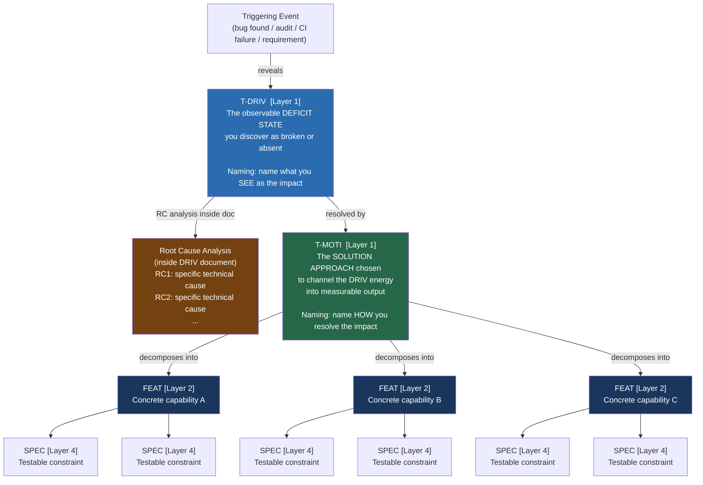

<!-- (c) 2026-* Frederick Bloom -- MotivatorDriver-terms.analy.md -- Hanaden AI -->
---
filename-id:   MotivatorDriver-terms.analy
node-type:     ANALYS
layer:         -1
version:       0.0.1
status:        Active
author:        Frederick Bloom
copyright:     (c) 2026-* Frederick Bloom
description: >
  Project reference for Driver and Motivator terminology as applied to the
  BwrapEnhanced SDLC node taxonomy. Defines naming rules for T-DRIV and T-MOTI
  nodes, clarifies the Layer 1 peer relationship, documents DRIV naming
  anti-patterns, and provides the corrected GenericSdlcEngine.strat decomposition
  design as an approved reference tree.
cross-references:
  - 20260818-033649-124680-7266-a219-84d3929f1e0a-SdlcEngineSpec.system-0.0.1
  - 20260816-171937-121071-7f00-a05f-7ea9697692bc-SdlcHierarchyOverview.overview-0.0.1
  - DriverVsMotivator-analysis.analys (generic-sdlc-and-engine-readonly/)
---

# MotivatorDriver: Terms, Naming Rules, and GenericSdlcEngine Decomposition

## 1. Layer Model (Authoritative)

From [`SdlcHierarchyOverview.overview`](./20260816-171937-121071-7f00-a05f-7ea9697692bc-SdlcHierarchyOverview.overview-0.0.1.md)
and [`SdlcEngineSpec.system`](../generic-sldc-and-engine-readonly/20260818-033649-124680-7266-a219-84d3929f1e0a-SdlcEngineSpec.system-0.0.1.md):

| Layer | Node Type | Role |
|---|---|---|
| -1 | OVERVIEW | Meta-index of the whole hierarchy |
| 0 | SYSTEM | READ-ONLY engine authority — defines all rules |
| 0 | CORP-STRAT | Root strategy node — the "why this project exists" |
| **1** | **T-DRIV** | **The observable deficit state / impact (the problem discovered)** |
| **1** | **T-MOTI** | **The solution approach chosen (peer of T-DRIV at same layer)** |
| 2 | FEAT | A concrete capability implementing the MOTI |
| 3 | ARCH | Cross-cutting structural design, peer of FEATs |
| 4 | SPEC | Atomic, testable constraint — the only testable leaf |

> [!IMPORTANT]
> **T-DRIV and T-MOTI are BOTH at Layer 1.** They are companion nodes —
> conceptual peers addressing the same concern (one as problem statement, one as
> solution choice). The filesystem convention of placing the MOTI directory
> *inside* the DRIV directory is **organizational only**, not a parent→child
> hierarchy. The visual tree in `SdlcHierarchyOverview.overview §Purpose` shows
> MOTI at visual depth 2 as an artifact of directory nesting — the layer number
> remains 1 for both.

---

## 2. Term Definitions

Derived from [`DriverVsMotivator-analysis.analys.md`](../generic-sldc-and-engine-readonly/DriverVsMotivator-analysis.analys.md).



### Driver (T-DRIV)
- The **Why**. Names the **observable deficit state** or **discovered impact** — what you SEE as broken, missing, or dangerous.
- Stems from deprivation: the system is in a state that forces action.
- Root causes (RC) explaining *why* you are in that state go **inside** the DRIV document, never in the name.
- A DRIV without a MOTI is an unresolved problem. A DRIV with only one child MOTI must document at least one rejected alternative MOTI for the choice to be meaningful.

### Motivator (T-MOTI)
- The **How**. Names the **solution approach chosen** to channel the DRIV's energy into a measurable resolution.
- One DRIV can have N candidate MOTIs (alternatives considered). Only one is `status: Active`.
- A MOTI without at least 2 FEATs is not decomposed — it has no implementation breadth.

---

## 3. Naming Rules and Anti-Patterns

| Anti-Pattern | Wrong Example | Correct |
|---|---|---|
| Names the RC instead of the impact | `HardcodedMachinePaths.driv` | `NonPortableArtifacts.driv` |
| Names the goal instead of the deficit | `PortabilityAndDeterminism.driv` | `NonPortableArtifacts.driv` |
| Names a broad solution domain as a DRIV | `LangStandards.driv` | `BashTestNonStandardization.driv` |
| MOTI names the problem not the solution | `ArtifactAnonimity.moti` | `TimestampUuidNaming.moti` |
| DRIV→MOTI is 1:1 with no alternatives | (single-child DRIV, no rejected MOTIs) | Document ≥2 candidate MOTIs; mark one `Active` |
| MOTI has only 1 FEAT child | (single-child MOTI) | Decompose into ≥2 FEATs covering distinct capabilities |
| FEAT has only 1 SPEC | (single-child FEAT) | Decompose into ≥2 independently testable SPECs |

---

## 4. Corrected GenericSdlcEngine.strat Decomposition Design

This is the approved reference tree for `generic-sdlc-and-engine-readonly/`.
**No files have been created yet for this design.** Existing wrong files must be
deleted and replaced with this structure.

```
generic-sdlc-and-engine-readonly/
│
├── SdlcEngineSpec.system-0.0.1.md     [SYSTEM L0 — READ-ONLY, untouched]
│
└── GenericSdlcEngine.strat/     technical      [CORP-STRAT L0]
    │
    ├── UntraceableArtifacts.driv/     [T-DRIV L1]
    │   │   problem: SDLC artifacts cannot be located, cross-referenced, or audited
    │   │   RC1: no UUID/timestamp naming scheme
    │   │   RC2: filename-id field absent from frontmatter
    │   │   RC3: parent cross-reference field absent
    │   └── TimestampUuidNaming.moti/  [T-MOTI L1]
    │       │   solution: stable timestamp+uuid identity scheme for all artifacts
    │       ├── NamingConvention.feat/         [FEAT L2]
    │       │   ├── FilenameFormat.spec/       [SPEC L4] exact format rule
    │       │   └── FilenameIdField.spec/      [SPEC L4] filename-id frontmatter field
    │       └── CrossReferenceability.feat/    [FEAT L2]
    │           ├── ParentField.spec/          [SPEC L4] parent: cross-ref field
    │           └── CrossRefField.spec/        [SPEC L4] cross-references: list field
    │
    ├── NonPortableArtifacts.driv/     [T-DRIV L1]
    │   │   problem: SDLC artifacts and tests only work on the author's machine
    │   │   RC1: hardcoded /homes/... absolute paths in source and test files
    │   │   RC2: fixed-depth relative traversal (../../../../)
    │   │   RC3: no PROJECT_HOME boundary enforced
    │   └── FileReferencePortability.moti/  [T-MOTI L1]
    │       │   solution: Maven-tree locality + walk-up anchor discovery
    │       ├── PathDiscovery.feat/           [FEAT L2]
    │       │   ├── WalkUpDiscovery.spec/     [SPEC L4] BASH_SOURCE walk-up pattern
    │       │   └── AnchorFileDetection.spec/ [SPEC L4] shared/env.sh found-or-abort
    │       ├── RootBoundaryEnforcement.feat/ [FEAT L2]
    │       │   ├── ProjectHomeBoundary.spec/ [SPEC L4] never traverse above PROJECT_HOME
    │       │   └── NoAbsolutePaths.spec/     [SPEC L4] prohibit all /homes /etc /usr refs
    │       ├── CrossTreeIndirection.feat/    [FEAT L2]
    │       │   ├── IndirectionVariable.spec/ [SPEC L4] $BWRAP_SH pattern — declared var only
    │       │   └── InlinePathProhibition.spec/ [SPEC L4] no src/main paths inline in src/test
    │       └── TreeLocalityEnforcement.feat/ [FEAT L2]
    │           ├── TestResourceLocality.spec/ [SPEC L4] shared/ local to src/test subtree
    │           └── MainResourceLocality.spec/ [SPEC L4] resources local to src/main subtree
    │
    ├── UnverifiedSpecCompliance.driv/ [T-DRIV L1]
    │   │   problem: no way to know if any SPEC constraint is actually implemented
    │   │   RC1: tdd.test-file field absent or null in spec frontmatter
    │   │   RC2: no constraint ID to test assertion mapping
    │   │   RC3: tests written before specs (violates spec-first ordering)
    │   └── SpecTracedTDD.moti/        [T-MOTI L1]
    │       │   solution: spec→test→code derivation chain; spec is the ontological root
    │       ├── SpecTestFileLink.feat/        [FEAT L2]
    │       │   ├── TestFilePath.spec/        [SPEC L4] tdd.test-file field required in spec
    │       │   └── TddStateTracking.spec/    [SPEC L4] tdd.state enum lifecycle enforced
    │       └── SpecConstraintCoverage.feat/  [FEAT L2]
    │           ├── ConstraintIdMapping.spec/ [SPEC L4] each C-ID has ≥1 test assertion
    │           └── FullCoverageMandate.spec/ [SPEC L4] zero untested SPEC constraints
    │
    ├── UnreliableQualityGates.driv/   [T-DRIV L1]
    │   │   problem: test output cannot be trusted, automated, or machine-ingested
    │   │   RC1: no standard output format across test suites
    │   │   RC2: test results are human-readable only, not SDLC-engine parseable
    │   │   RC3: test isolation not enforced — side effects poison subsequent tests
    │   └── StructuredTestAutomation.moti/ [T-MOTI L1]
    │       │   solution: standardized test framework + JSONL machine-readable output
    │       ├── TestConventions.feat/         [FEAT L2 — language-agnostic]
    │       │   ├── TestIsolation.spec/       [SPEC L4] each test isolated, no shared state
    │       │   ├── TestIdConvention.spec/    [SPEC L4] test ID maps to SPEC constraint ID
    │       │   └── NoHostSideEffects.spec/   [SPEC L4] no untracked tempfiles, no env mutation
    │       └── TestOutputSchema.feat/        [FEAT L2 — language-agnostic JSONL schema]
    │           ├── SuiteStartedSchema.spec/  [SPEC L4] suite_started JSONL record fields
    │           ├── TestCaseSchema.spec/      [SPEC L4] test_case JSONL record fields
    │           └── SuiteFinishedSchema.spec/ [SPEC L4] suite_finished JSONL record fields
    │
    ├── BashTestNonStandardization.driv/ [T-DRIV L1]
    │   │   problem: Bash test suites are inconsistent, non-portable, incompatible
    │   │   RC1: no canonical test preamble — each file uses ad-hoc sourcing
    │   │   RC2: no shared/env.sh contract — SUT paths hardcoded per file
    │   │   RC3: no mandated test runner — bats/pytest/shell scripts mixed
    │   └── BashTestStandards.moti/     [T-MOTI L1]
    │       │   solution: bats-core + walk-up preamble + shared/env.sh contract
    │       ├── BashTestConventions.feat/     [FEAT L2]
    │       │   ├── WalkUpPreamble.spec/      [SPEC L4] canonical BASH_SOURCE walk-up
    │       │   ├── SharedEnvContract.spec/   [SPEC L4] shared/env.sh must-export contract
    │       │   └── TestFileNaming.spec/      [SPEC L4] test_.sh naming, src/test location
    │       └── BashTestSupportingLibs.feat/  [FEAT L2]
    │           ├── BatsCoreMandate.spec/     [SPEC L4] bats-core >= 1.10 required
    │           ├── BatsHelperLibs.spec/      [SPEC L4] bats-support/assert/file in test_helper/
    │           └── TapToJsonlPipeline.spec/  [SPEC L4] TAP→JSONL transformation required
    │
    └── BashCodeInconsistency.driv/    [T-DRIV L1]
        │   problem: Bash scripts across the project have inconsistent style and safety
        │   RC1: shebang conventions vary (#!/bin/bash vs #!/usr/bin/env bash)
        │   RC2: error handling absent or inconsistent (set -euo pipefail not universal)
        │   RC3: no static analysis gate — ShellCheck not enforced
        └── BashCodingStandards.moti/  [T-MOTI L1]
            │   solution: define and enforce Bash coding conventions + ShellCheck
            ├── BashCodingConventions.feat/   [FEAT L2]
            │   ├── ShebangConvention.spec/   [SPEC L4]
            │   ├── ErrorHandling.spec/       [SPEC L4] set -euo pipefail mandate
            │   └── FunctionNaming.spec/      [SPEC L4]
            └── BashShellCheckCompliance.feat/ [FEAT L2]
                ├── ShellCheckMandatory.spec/ [SPEC L4]
                └── ShellCheckSuppression.spec/ [SPEC L4]
```

---

## 5. Files to DELETE (Wrong Structure Already Created)

These exist on disk and must be removed before the new tree is built:

| Path | Reason |
|---|---|
| `GenericSdlcEngine.strat/PortabilityAndDeterminism.driv/` | Name is a goal not a deficit state; maps to `NonPortableArtifacts.driv` |
| `GenericSdlcEngine.strat/QualityAndVerification.driv/` | Name is a goal not a deficit state; maps to `UnreliableQualityGates.driv` |
| `QualityAndVerification.driv/BashTestAutomation.moti/` | Bash-specific MOTI under wrong DRIV; remapped to `BashTestNonStandardization.driv/BashTestStandards.moti/` |
| `BashTestAutomation.moti/LangBashTestConventions.feat/` | Content split; preamble → `BashTestConventions.feat`, JSONL → `TestOutputSchema.feat` |
| `BashTestAutomation.moti/LangBashTestSupportingLibs.feat/` | Renamed → `BashTestSupportingLibs.feat` under `BashTestStandards.moti` |
| `FileRefPortability.feat/FileRefPortability.spec/` | Collapsed single feat+spec; expands to 4 FEATs × 2+ SPECs |

> [!CAUTION]
> Do not delete until the replacement files are written and content migrated.
