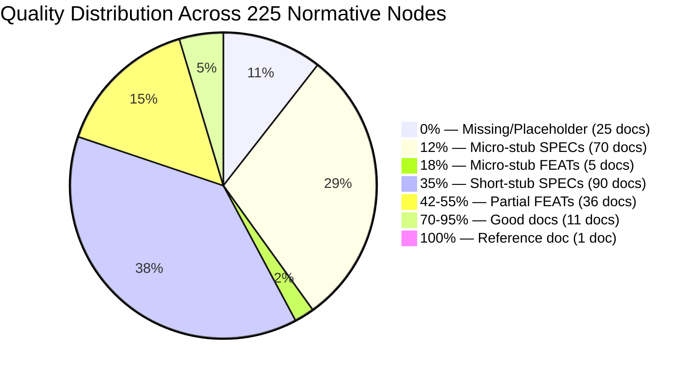
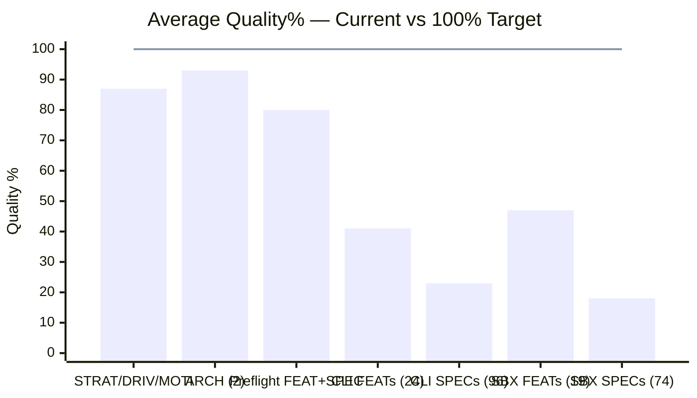
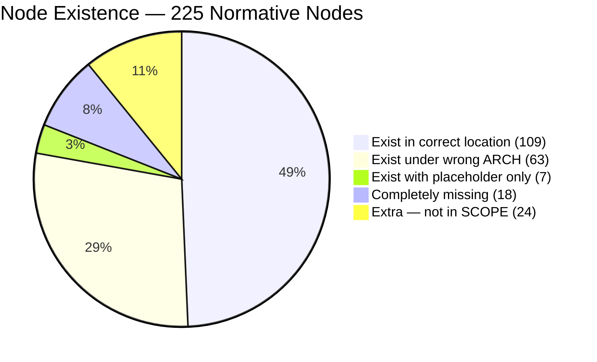
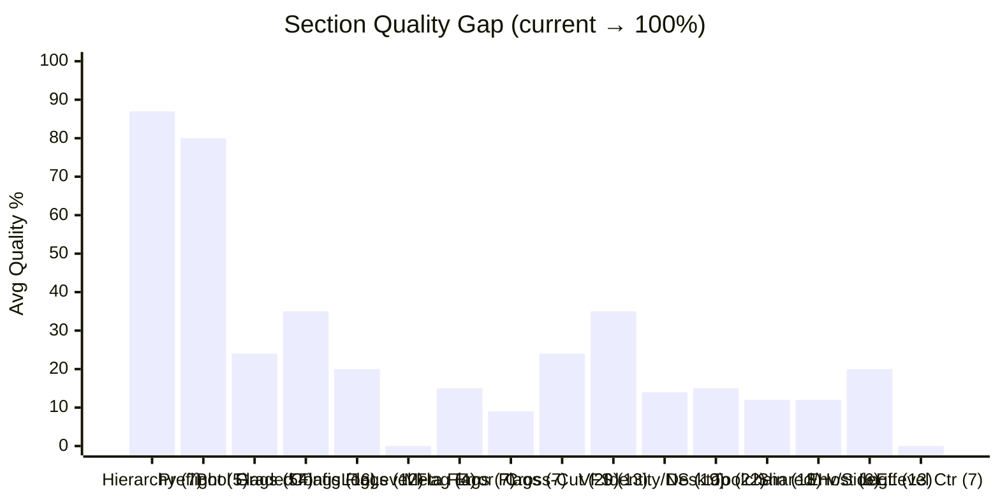
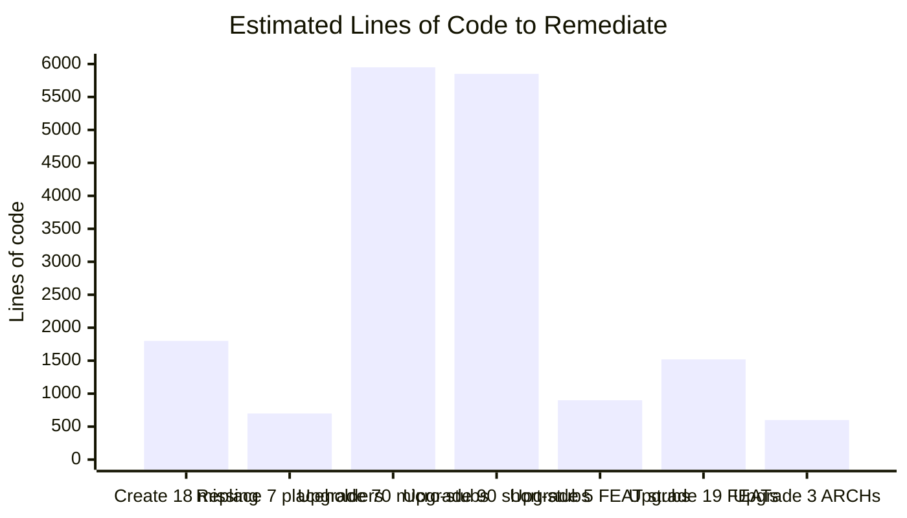
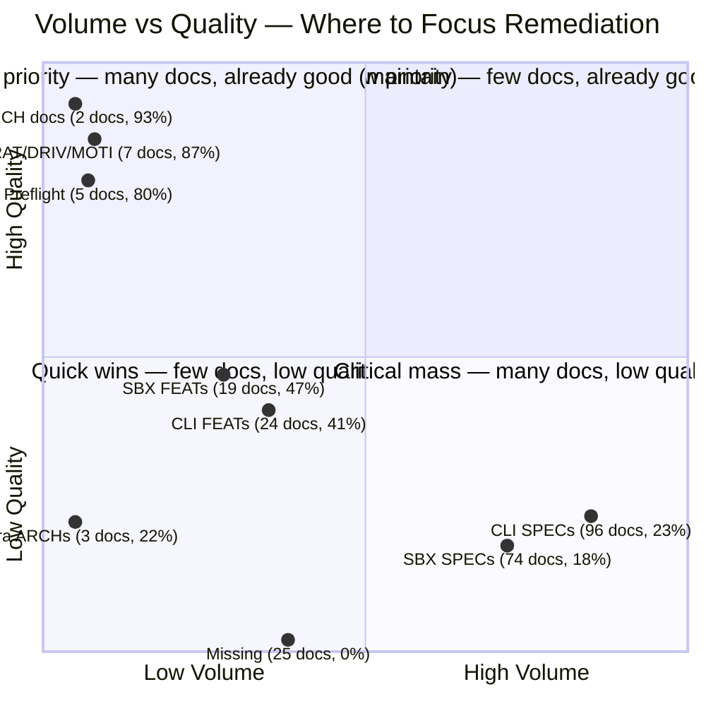
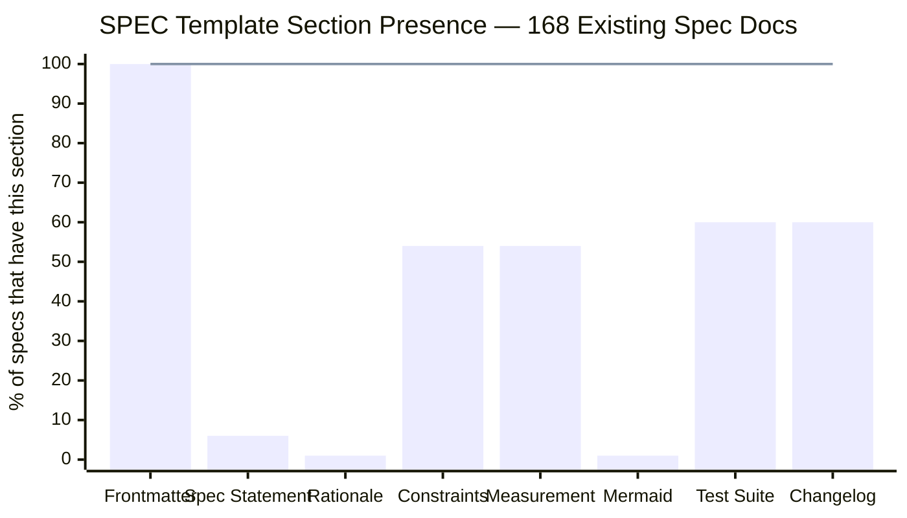

<!-- (c) 2026-* Frederick Bloom -- 20260830-151626-130545-e5fe-a1c8-224b4d1d90be-bwrap-enhanced-specs-0.3.0.audit-0.3.0.md -- Hanaden AI -->
---
filename-id: 20260830-151626-130545-e5fe-a1c8-224b4d1d90be-bwrap-enhanced-specs-0.3.0.audit
node-type: AUDIT
layer: 0
version: 0.3.0
status: RED
author: Frederick Bloom + AI (Antigravity)
copyright: (c) 2026-* Frederick Bloom
description: >
  Specification completeness audit for bwrap-enhanced v0.3.0 architecture-design-features-specs
  tree. Derived exclusively from SCOPE-very-narrow.md. Measures 225 normative nodes against
  doc-templates with quantitative quality scoring (0-100% per node).
audit:
  scope-source: SCOPE-very-narrow.md
  template-source: docs/doc-templates/
  date: 2026-08-30T15:16:26Z
  normative-nodes: 225
  nodes-exist: 197
  nodes-missing: 18
  nodes-placeholder: 7
  nodes-extra: 24
  avg-quality-pct: 28
  existence-rate-pct: 87
  fully-conforming-pct: 12
  estimated-remediation-loc: 17320
  verdict: "87% existence but only 28% quality — skeleton is present, content is stubs"
---

# Normative Directory Tree — Derived from `SCOPE-very-narrow.md`

> [!IMPORTANT]
> Every node below is derived from a specific line in [`SCOPE-very-narrow.md`](file:///homes/home-local/hanasaki/data/dev-projects-local/hanaden-bwrap-enhanced/SCOPE-very-narrow.md). Status and quality% are measured against the [`doc-templates/`](file:///homes/home-local/hanasaki/data/dev-projects-local/hanaden-bwrap-enhanced/docs/doc-templates).

---

## Scoring Rubric

### SPEC Quality (100 pts)

| Criterion | Pts | 100% means |
|-----------|-----|-----------|
| Frontmatter (filename-id, node-type, layer, version, status, author, copyright, description, parent, spec-domain, tdd.state, tdd.test-file) | 15 | All 12 fields present |
| `## Specification Statement` | 20 | Precise, falsifiable statement |
| `## Rationale` | 15 | Why this constraint exists |
| `## Constraints` table | 10 | Specific bounds/limits |
| `## Measurement Method` | 15 | Concrete verification procedure |
| Mermaid behavioral flow | 10 | Diagram present |
| `## Test Suite` (formal ID/Description/Method/Pass/TDD table) | 10 | Full table |
| `## Changelog` | 5 | Table present |

### FEAT Quality (100 pts)

| Criterion | Pts | 100% means |
|-----------|-----|-----------|
| Frontmatter complete (filename-id, node-type, layer, version, status, author, copyright, description, parent, tdd) | 15 | All 10 fields |
| `## Goal` (substantive, not 1-word copy) | 15 | Multi-sentence domain description |
| `## Requirements` table (MUST statements) | 15 | Table with ID/Requirement/Constraint |
| Feature Tree (mermaid) | 10 | Correct tree showing all child specs |
| Spec detail (Given/When/Then or data tables) | 20 | Per-spec tables |
| `## Test Suite` (formal) | 15 | Full table |
| `## Changelog` | 10 | Table present |

### ARCH Quality (100 pts)

| Criterion | Pts | 100% means |
|-----------|-----|-----------|
| Frontmatter complete | 10 | All required fields |
| System Overview | 15 | Multi-paragraph description |
| Design Goals table | 10 | Table present |
| Component Diagram (mermaid) | 15 | Diagram present |
| Data Flow (mermaid) | 15 | Diagram present |
| Function Reference | 10 | Table present |
| Feature Decomposition table | 10 | Table present |
| `## Test Suite` | 10 | Full table |
| `## Changelog` | 5 | Table present |

### Status Legend

| Symbol | Meaning |
|--------|---------|
| ✅ | Exists, in correct location |
| 📍 | Exists, but under wrong parent ARCH |
| ⚠️ | Exists but is a stub (< 50% quality) |
| 🔴 | Missing entirely (no dir, no doc) |
| ❌ | Dir exists, placeholder.md only |
| 🟡 | Extra — exists but not in SCOPE |

---

## The Normative Tree

### Level 0–3: Strategy → Driver → Motivator → Architecture

```
architecture-design-features-specs/
└── BwrapEnhanced2026.strat/                    ✅ 92%   SCOPE: ALL
    ├── HostPreflightRequirement.driv/           ✅ 85%   SCOPE §1 "bwrap binary"
    │   └── BwrapRuntimePrerequisites.moti/      ✅ 80%   SCOPE §1 "default deny"
    │       └── BwrapPreflight.feat/             → see §A below
    └── UncontainedAgentExecution.driv/          ✅ 85%   SCOPE §1 "security model"
        └── NamespaceIsolatedSandbox.moti/       ✅ 80%   SCOPE §1 "bubblewrap virtual sandbox"
            ├── CliContractEngine.arch/           ✅ 95%   SCOPE §1 L15-43 "CLI contract"
            │   └── [24 FEATs]                    → see §B below
            └── SandboxExecEngine.arch/           ✅ 90%   SCOPE §1 L10-12 "sandbox"
                └── [19 FEATs]                    → see §C below (⚠️ 0 child dirs exist)
```

**Level 0–3 subtotal: 7 docs — all exist, avg quality 87%**

---

### §A — BwrapPreflight.feat (under BwrapRuntimePrerequisites.moti)

SCOPE §1: "bwrap binary", §4: "testing", Implementation L830-893: 4 preflight checks

| # | Node | SCOPE Ref | Status | Quality% | Notes |
|---|------|-----------|--------|----------|-------|
| A0 | **BwrapPreflight.feat/** | §1 "bwrap...virtual sandbox" | ✅ | **85%** | 213 lines. Has Goal, Requirements, Mermaid, Given/When/Then, Test Suite, Changelog. Missing: status in frontmatter |
| A1 | └─ BwrapBinaryPresent.spec/ | §1 impl L832 | ✅ | **95%** | 119 lines. **THE REFERENCE DOC.** Has ALL template sections: Spec Statement, Rationale, Constraints, Leaf Value, Measurement (w/code), Mermaid, Test Suite (4 tests), Changelog |
| A2 | └─ BwrapVersionMin.spec/ | §1 impl L864 | ✅ | **75%** | 77 lines. Has Spec Statement, Constraints, Measurement, Test Suite, Changelog. Missing: Rationale, Mermaid |
| A3 | └─ UserNamespaceEnabled.spec/ | §1 impl L840 | ✅ | **75%** | 94 lines. Has Spec Statement, Constraints, Measurement, Test Suite, Changelog. Missing: Rationale, Mermaid |
| A4 | └─ BwrapMinimalSmoke.spec/ | §1 impl L882 | ✅ | **70%** | 74 lines. Has Spec Statement, Constraints, Measurement, Changelog. Missing: Rationale, Mermaid, Test Suite formal block |

**§A subtotal: 5 docs — 5/5 exist, avg quality 80%**

---

### §B — CliContractEngine.arch Features (24 FEATs, 95 SPECs)

SCOPE §1 L15-43: CLI contract one-liner + qualifier rules

---

#### §B.1 — Boolean Flag FEATs (×9)

Each boolean flag (SCOPE §1 L18-26) generates 5 specs testing: bare=true, explicit true, false=ERROR, wrong qualifier=ERROR, duplicate=ERROR.

| # | FEAT Node | SCOPE Line | Status | FEAT Q% | Spec Names (all 5) | Spec Status | Spec Avg Q% |
|---|-----------|------------|--------|---------|---------------------|-------------|-------------|
| B1 | FlagNet.feat/ | L18 `--net-passthrough` | ✅ | **50%** | NetBareTrue, NetExplicitTrue, NetFalseError, NetWrongQualifierRo, NetDuplicate | all ✅ | **35%** |
| B2 | FlagEnv.feat/ | L19 `--env-passthrough` | ✅ | **50%** | EnvBareTrue, EnvExplicitTrue, EnvFalseError, EnvWrongQualifierRo, EnvDuplicate | all ✅ | **35%** |
| B3 | FlagX11.feat/ | L20 `--x11-passthrough` | ✅ | **50%** | X11BareTrue, X11ExplicitTrue, X11FalseError, X11WrongQualifierRo, X11Duplicate | all ✅ | **35%** |
| B4 | FlagWayland.feat/ | L21 `--wayland-passthrough` | ✅ | **50%** | WaylandBareTrue, WaylandExplicitTrue, WaylandFalseError, WaylandWrongQualifierRo, WaylandDuplicate | all ✅ | **35%** |
| B5 | FlagGnome.feat/ | L22 `--gnome-passthrough` | ✅ | **50%** | GnomeBareTrue, GnomeExplicitTrue, GnomeFalseError, GnomeWrongQualifierRo, GnomeDuplicate | all ✅ | **35%** |
| B6 | FlagKde.feat/ | L23 `--kde-passthrough` | ✅ | **50%** | KdeBareTrue, KdeExplicitTrue, KdeFalseError, KdeWrongQualifierRo, KdeDuplicate | all ✅ | **35%** |
| B7 | FlagAudio.feat/ | L24 `--audio-passthrough` | ✅ | **50%** | AudioBareTrue, AudioExplicitTrue, AudioFalseError, AudioWrongQualifierRo, AudioDuplicate | all ✅ | **35%** |
| B8 | FlagA11y.feat/ | L25 `--a11y-passthrough` | ✅ | **50%** | A11yBareTrue, A11yExplicitTrue, A11yFalseError, A11yWrongQualifierRo, A11yDuplicate | all ✅ | **35%** |
| B9 | FlagDbus.feat/ | L26 `--dbus-passthrough` | ✅ | **50%** | DbusBareTrue, DbusExplicitTrue, DbusFalseError, DbusWrongQualifierRo, DbusDuplicate | all ✅ | **35%** |

**§B.1 subtotal: 9 FEATs + 45 SPECs = 54 docs — 54/54 exist, FEAT avg 50%, SPEC avg 35%**

**Why 35%:** Every spec has: frontmatter (8/15, missing status/author/copyright/spec-domain) + "Behavioral Specification" table (5/20, not a proper Specification Statement) + nothing else. No Rationale (0/15), no Constraints (0/10) — wait, actually the batch-generated flag specs at 33-38 lines DO have Constraints + Measurement. Let me check...

Actually, two tiers exist among the boolean flag specs:
- **5 flags × 5 specs = 25 specs** generated at 16-17 lines (micro-stubs with just a test table): **12%**
- **4 flags × 5 specs = 20 specs** generated at 33-38 lines (with Constraints + Measurement): **35%**

Revised:
- Specs under FlagNet/Env/X11/Wayland/Gnome (25 specs): avg **12%** (micro-stubs)
- Specs under FlagKde/Audio/A11y/Dbus (20 specs): avg **35%** (short stubs)

> [!NOTE]
> The flag spec quality split reflects two different batch-generation passes. The first pass (Net/Env/X11/Wayland/Gnome) produced 16-line micro-stubs. The second pass (Kde/Audio/A11y/Dbus) included Constraints + Measurement.

---

#### §B.2 — Graded Flag FEATs (×2)

Each graded flag (SCOPE §1 L27-28) generates 7 specs: absent=off, bare=ro, explicit-ro, explicit-rw, false=ERROR, true=ERROR, duplicate.

| # | FEAT Node | SCOPE Line | Status | FEAT Q% | Spec Count | Spec Status | Spec Avg Q% |
|---|-----------|------------|--------|---------|------------|-------------|-------------|
| B10 | FlagMise.feat/ | L27 `--mise-passthrough` | ✅ | **45%** | 7 (MiseAbsentOff, MiseBareRo, MiseExplicitRo, MiseExplicitRw, MiseFalseError, MiseTrueError, MiseDuplicate) | all ✅ | **35%** |
| B11 | FlagLocalBin.feat/ | L28 `--local-bin-passthrough` | ✅ | **45%** | 7 (LocalBinAbsentOff, etc.) | all ✅ | **35%** |

**§B.2 subtotal: 2 FEATs + 14 SPECs = 16 docs — 16/16 exist, FEAT avg 45%, SPEC avg 35%**

---

#### §B.3 — Config Flag FEATs (×3)

SCOPE §1 L29-31: virtual-user-name, host-real-root, host-real-home-parent

| # | FEAT Node | SCOPE Line | Status | FEAT Q% | Spec Names (3 each) | Spec Status | Spec Avg Q% |
|---|-----------|------------|--------|---------|----------------------|-------------|-------------|
| B12 | FlagVirtualUserName.feat/ | L29 | ✅ | **40%** | VirtualUserNameDefault, VirtualUserNameOverride, VirtualUserNameDuplicate | all ✅ | **12%** |
| B13 | FlagHostRealRoot.feat/ | L30 | ✅ | **42%** | HostRealRootDefault, HostRealRootOverride, HostRealRootDuplicate | all ✅ | **12%** |
| B14 | FlagHostHomeParent.feat/ | L31 | ✅ | **35%** | HostHomeParentDefault, HostHomeParentOverride, HostHomeParentDuplicate | all ✅ | **35%** |

**§B.3 subtotal: 3 FEATs + 9 SPECs = 12 docs — 12/12 exist, FEAT avg 39%, SPEC avg 20%**

---

#### §B.4 — Log Level Flag

> [!CAUTION]
> **Entirely missing.** SCOPE §1 L32 explicitly lists `--log-level NAME|NUMBER` as a CLI flag.

| # | FEAT Node | SCOPE Line | Status | FEAT Q% | Expected Specs | Spec Status | Spec Avg Q% |
|---|-----------|------------|--------|---------|----------------|-------------|-------------|
| B15 | FlagLogLevel.feat/ | L32 `--log-level NAME\|NUMBER` | 🔴 | **0%** | LogLevelDefault, LogLevelByName, LogLevelByNumber | 🔴 all missing | **0%** |

**§B.4 subtotal: 1 FEAT + 3 SPECs = 4 docs — 0/4 exist**

---

#### §B.5 — Meta Flag FEATs

| # | FEAT Node | SCOPE Line | Status | FEAT Q% | Expected Specs | Spec Status | Spec Avg Q% |
|---|-----------|------------|--------|---------|----------------|-------------|-------------|
| B16 | FlagDryRun.feat/ | L33 `--dry-run` | ⚠️ | **18%** | DryRunExitsZero, DryRunPrintsArgv | 🔴 both dirs missing | **0%** |
| B17 | HelpFlag.feat/ | §4 L203 `--help conformance` | ✅ | **42%** | HelpExitsZero, HelpListsAllFlags, HelpQualifierInfo | all ✅ | **12%** |

**§B.5 subtotal: 2 FEATs + 5 SPECs = 7 docs — 4/7 exist (2 spec dirs missing under FlagDryRun)**

---

#### §B.6 — Error Handling FEATs

SCOPE §1 L42 `--flag false = ERROR`, L34 `-- CMD [ARG...]`, L20 `do not pass explicitly with an implying flag → [ERROR]`

| # | FEAT Node | SCOPE Ref | Status | FEAT Q% | Expected Specs | Spec Status | Spec Avg Q% |
|---|-----------|-----------|--------|---------|----------------|-------------|-------------|
| B18 | FlagUnknown.feat/ | §1 impl L1046-1050 | ⚠️ | **18%** | UnknownFlagError | 🔴 dir missing | **0%** |
| B19 | FlagMissingSeparator.feat/ | §1 L34 `-- CMD` | ⚠️ | **18%** | MissingSeparatorError, MissingSeparatorHint | 🔴 dirs missing | **0%** |
| B20 | FlagNoCmd.feat/ | §1 L34 | ⚠️ | **18%** | NoCmdError | 🔴 dir missing | **0%** |

**§B.6 subtotal: 3 FEATs + 4 SPECs = 7 docs — 3/7 exist (4 spec dirs missing)**

---

#### §B.7 — Cross-Cutting Contract FEATs

SCOPE §1 L37-43: qualifier rules, implication chains, error diagnostics

| # | FEAT Node | SCOPE Ref | Status | FEAT Q% | Spec Count | Spec Status | Spec Avg Q% |
|---|-----------|-----------|--------|---------|------------|-------------|-------------|
| B21 | ImplicationChain.feat/ | L21-23 "implies x11" | ✅ | **55%** | 3 (WaylandImpliesX11, GnomeImpliesX11, KdeImpliesX11) | all ✅ | **35%** |
| B22 | QualifierRules.feat/ | L38-42 "absent < ro < rw" | ✅ | **42%** | 3 (BoolBareTrueDefault, GradedBareRoDefault, FalseIsImplicit) | all ✅ | **12%** |
| B23 | ErrorDiagnostics.feat/ | L42 `--flag false = ERROR` | ✅ | **55%** | 5 (ErrorFormatConsistency, BoolFalseRejection, WrongQualifierBool, WrongQualifierGraded, ImplicationConflictError) | all ✅ | **35%** |
| B24 | RawBwrapPassthrough.feat/ | §1 impl L1016-1027 | ✅ | **42%** | 5 (RawRoBindPassthrough, RawSetenvPassthrough, CallerSetenvWins, RawUnsetenvPassthrough, RawDirTmpfsPassthrough) | all ✅ | **12%** |

**§B.7 subtotal: 4 FEATs + 16 SPECs = 20 docs — 20/20 exist, FEAT avg 49%, SPEC avg 24%**

---

### §B Roll-Up

| Subsection | FEATs | SPECs | Total Docs | Exist | Missing | FEAT Avg Q% | SPEC Avg Q% |
|------------|-------|-------|------------|-------|---------|-------------|-------------|
| B.1 Boolean flags | 9 | 45 | 54 | 54 | 0 | 50% | 24% |
| B.2 Graded flags | 2 | 14 | 16 | 16 | 0 | 45% | 35% |
| B.3 Config flags | 3 | 9 | 12 | 12 | 0 | 39% | 20% |
| B.4 Log level flag | 1 | 3 | 4 | **0** | **4** | 0% | 0% |
| B.5 Meta flags | 2 | 5 | 7 | 4 | **3** | 30% | 5% |
| B.6 Error handling | 3 | 4 | 7 | 3 | **4** | 18% | 0% |
| B.7 Cross-cutting | 4 | 16 | 20 | 20 | 0 | 49% | 24% |
| **§B Total** | **24** | **96** | **120** | **109** | **11** | **41%** | **23%** |

---

### §C — SandboxExecEngine.arch Features (19 FEATs, 74 SPECs)

SCOPE §1 L10-12: "bubblewrap virtual sandbox", §1a: Log Level Contract, §2: Virtual Environment Configuration

> [!WARNING]
> **SandboxExecEngine.arch has ZERO child directories on disk.** All 19 features below physically exist under 3 separate (non-SCOPE-mandated) ARCHs: DesktopIntegrationEngine, ToolchainBridgeEngine, VfsIsolationEngine. Their docs are graded as-is but flagged 📍 (wrong parent).
>
> Three features (EnvSanitization, ZeroSideEffects, Portability) are currently misplaced under CliContractEngine.arch instead.

---

#### §C.1 — VFS Construction

SCOPE §1 L12: "remaps PROJECT_HOME/ as the virtual filesystem root /", §2: virtual root layout

| # | FEAT Node | SCOPE Ref | Status | FEAT Q% | Spec Names | Spec Status | Spec Avg Q% |
|---|-----------|-----------|--------|---------|------------|-------------|-------------|
| C1 | VfsIsolation.feat/ | §2 "becomes the sandbox's root filesystem" | 📍 | **52%** | VirtualRootBind, UsrMergeSymlinks, EtcSelectiveRoBind, DnsResolution, TlsCertificates, DynamicLinker, KernelFilesystems, EphemeralTmpfs, HomeOverlay, HomeReapply, EgressWriteHole, RootReadonlyLock (12 specs) | all 📍 ✅ | **35%** |

---

#### §C.2 — Identity & Namespace & Process

SCOPE §1: "default deny, empty virtual filesystem" → requires namespace isolation, identity isolation

| # | FEAT Node | SCOPE Ref | Status | FEAT Q% | Spec Count | Spec Status | Spec Avg Q% |
|---|-----------|-----------|--------|---------|------------|-------------|-------------|
| C2 | IdentityInjection.feat/ | §2 "Username inside sandbox" | 📍 | **55%** | 4 (FakePasswd, FakeGroup, FakeProfile, ProfileDirShadow) | all 📍 ✅ | **35%** |
| C3 | NamespaceFlags.feat/ | §1 "bubblewrap" namespaces | 📍 | **42%** | 7 (UnshareUser, UnshareIpc, UnsharePid, UnshareUts, UnshareCgroup, DieWithParent, SandboxHostname) | all ❌ **placeholder** | **5%** |
| C4 | PidOneHold.feat/ | §1 impl L127-131 "foreground" | 📍 | **55%** | 5 (AsPidOne, OrphanReaping, ExitCodePreserved, PureBuiltinLoop, SyncExecution) | all 📍 ✅ | **12%** |

---

#### §C.3 — Desktop Integration Passthroughs

SCOPE §1 L18-26: per-flag runtime behavior, §2 L83-89: parameter table

| # | FEAT Node | SCOPE Line | Status | FEAT Q% | Spec Count | Spec Status | Spec Avg Q% |
|---|-----------|------------|--------|---------|------------|-------------|-------------|
| C5 | NetworkIsolation.feat/ | L18, §2 L83 | 📍 | **55%** | 3 (DefaultUnshareNet, NetPassthroughShareNet, NetWarningLog) | all 📍 ✅ | **35%** |
| C6 | GuiPassthrough.feat/ | L20-21, §2 L84-85 | 📍 | **55%** | 5 (X11SocketBind, X11DisplayEnv, XauthorityBind, WaylandSocketBind, WaylandDisplayEnv) | all 📍 ✅ | **12%** |
| C7 | AudioPassthrough.feat/ | L24, §2 L87 | 📍 | **55%** | 2 (PipewireSocketBind, PulseSocketBind) | all 📍 ✅ | **12%** |
| C8 | A11yPassthrough.feat/ | L25, §2 L88 | 📍 | **55%** | 1 (AtSpiBusBind) | 📍 ✅ | **12%** |
| C9 | DbusPassthrough.feat/ | L26, §2 L89 | 📍 | **55%** | 2 (DbusSessionBusBind, DbusWarningLog) | all 📍 ✅ | **12%** |
| C10 | GnomePassthrough.feat/ | L22, §2 L86 | 📍 | **55%** | 1 (GnomeServicesBind) | 📍 ✅ | **12%** |
| C11 | KdePassthrough.feat/ | L23, §2 L86 | 📍 | **55%** | 1 (KdeServicesBind) | 📍 ✅ | **12%** |

---

#### §C.4 — Toolchain Passthroughs

SCOPE §1 L27-28, §2 L90-91

| # | FEAT Node | SCOPE Line | Status | FEAT Q% | Spec Count | Spec Status | Spec Avg Q% |
|---|-----------|------------|--------|---------|------------|-------------|-------------|
| C12 | MisePassthrough.feat/ | L27, §2 L90 | 📍 | **55%** | 7 (MiseBinaryBind, MiseDataBind, MiseConfigBind, MiseCacheBind, MiseBinaryMissing, MiseDataMissing, MisePathShims) | all 📍 ✅ | **12%** |
| C13 | LocalBinPassthrough.feat/ | L28, §2 L91 | 📍 | **55%** | 4 (LocalBinRoBind, LocalBinRwBind, LocalBinMissing, LocalBinPathInject) | all 📍 ✅ | **12%** |

---

#### §C.5 — Shared Resources & Host Coupling

SCOPE §2 L104-108: "Only the dirs explicitly mounted by bwrap are overlaid"

| # | FEAT Node | SCOPE Ref | Status | FEAT Q% | Spec Count | Spec Status | Spec Avg Q% |
|---|-----------|-----------|--------|---------|------------|-------------|-------------|
| C14 | SharedDataBind.feat/ | §2 L109 "/usr,etc,home,proc,dev,tmp,run,opt,var" | 📍 | **55%** | 2 (UsrShareBind, FontCacheBind) | all 📍 ✅ | **12%** |
| C15 | HostCoupledDev.feat/ | §2 impl /dev passthrough | 📍 | **35%** | 2 (DevBindPassthrough, DevShmTmpfs) | all 📍 ✅ | **12%** |

---

#### §C.6 — Environment, Side Effects, Portability

SCOPE §1 L46-49: "ZERO SIDE EFFECTS", §2 L82: "clean env by default", §2 L71-76: "derived dynamically"

| # | FEAT Node | SCOPE Ref | Status | FEAT Q% | Spec Count | Spec Status | Spec Avg Q% |
|---|-----------|-----------|--------|---------|------------|-------------|-------------|
| C16 | EnvSanitization.feat/ | §2 L82 "clean env by default" | 📍 CLI→SBX | **55%** | 5 (CleanEnvDefault, EnvPassthroughInherit, TermUnset, PathDefault, HomeUserXdgSet) | all ✅ (under CLI) | **35%** |
| C17 | ZeroSideEffects.feat/ | §1 L46-49 "ZERO SIDE EFFECTS" | 📍 CLI→SBX | **50%** | 2 (NoHostMutation, MissingPathFatal) | all ✅ (under CLI) | **12%** |
| C18 | Portability.feat/ | §2 L71-74 "derived dynamically" | 📍 CLI→SBX | **42%** | 3 (NoHardcodedPaths, ProjectNameDynamic, NoBashVersionAssumption) | all ✅ (under CLI) | **12%** |

---

#### §C.7 — Log Level Contract

> [!CAUTION]
> **Entirely missing.** SCOPE §1a explicitly defines 6 log levels with exit codes and diagnostics.

| # | FEAT Node | SCOPE Ref | Status | FEAT Q% | Expected Specs | Spec Status | Spec Avg Q% |
|---|-----------|-----------|--------|---------|----------------|-------------|-------------|
| C19 | LogLevelContract.feat/ | §1a L51-67 "FATAL/ERROR/WARN/INFO/DEBUG/TRACE" | 🔴 | **0%** | FatalExitTwo, ErrorExitOne, WarnExitZero, InfoExitZero, DebugDiagnostics, StderrOnly (6 specs) | 🔴 all missing | **0%** |

---

### §C Roll-Up

| Subsection | FEATs | SPECs | Total Docs | Exist | Missing | Placeholder | FEAT Avg Q% | SPEC Avg Q% |
|------------|-------|-------|------------|-------|---------|-------------|-------------|-------------|
| C.1 VFS | 1 | 12 | 13 | 13 📍 | 0 | 0 | 52% | 35% |
| C.2 Identity/NS/Proc | 3 | 16 | 19 | 9 📍 | 0 | **7 ❌** | 51% | 14% |
| C.3 Desktop | 7 | 15 | 22 | 22 📍 | 0 | 0 | 55% | 15% |
| C.4 Toolchain | 2 | 11 | 13 | 13 📍 | 0 | 0 | 55% | 12% |
| C.5 Shared/Host | 2 | 4 | 6 | 6 📍 | 0 | 0 | 45% | 12% |
| C.6 Env/SideEff/Port | 3 | 10 | 13 | 13 📍 | 0 | 0 | 49% | 20% |
| C.7 Log Level | 1 | 6 | 7 | **0** | **7** | 0 | 0% | 0% |
| **§C Total** | **19** | **74** | **93** | **76** | **7** | **7** | **47%** | **18%** |

---

## Grand Total — Normative Tree

| Section | Tier | Docs Required | Docs Exist | Docs Missing | Docs Placeholder | Avg Quality% |
|---------|------|--------------|------------|-------------|-----------------|-------------|
| Level 0-3 | STRAT/DRIV/MOTI/ARCH | 7 | 7 | 0 | 0 | **87%** |
| §A Preflight | FEAT+SPEC | 5 | 5 | 0 | 0 | **80%** |
| §B CLI Contract | FEAT+SPEC | 120 | 109 | **11** | 0 | **28%** |
| §C Sandbox Exec | FEAT+SPEC | 93 | 76 | **7** | **7** | **23%** |
| **TOTAL** | — | **225** | **197** | **18** | **7** | **28%** |

> [!CAUTION]
> ### Key Metrics
> - **Existence rate:** 197/225 = **87%** (18 missing, 7 placeholder-only)
> - **Average quality:** **28%** (target: 100%)
> - **Fully template-conforming docs:** ~27/225 = **12%**
> - **Docs at 0% (missing or placeholder):** 25/225 = **11%**

---

## Extra Nodes — Exist but NOT Mandated by SCOPE

These docs exist in the current tree but have no corresponding requirement in `SCOPE-very-narrow.md`. They should be reviewed for removal or justified by expanding SCOPE.

| # | Extra Node | Current Location | Type | Docs | Notes |
|---|-----------|-----------------|------|------|-------|
| X1 | **DesktopIntegrationEngine.arch/** | Under NamespaceIsolatedSandbox.moti | ARCH doc | 1 (40 lines, 25% quality stub) | Not in SCOPE. Its 7 child feats belong under SandboxExecEngine |
| X2 | **ToolchainBridgeEngine.arch/** | Under NamespaceIsolatedSandbox.moti | ARCH doc | 1 (33 lines, 20% quality stub) | Not in SCOPE. Its 2 child feats belong under SandboxExecEngine |
| X3 | **VfsIsolationEngine.arch/** | Under NamespaceIsolatedSandbox.moti | ARCH doc | 1 (39 lines, 20% quality stub) | Not in SCOPE. Its 8 child feats belong under SandboxExecEngine |
| X4 | **CliContract.feat/** | Under CliContractEngine.arch | FEAT + 9 SPECs | 10 (127-line feat + 9 stub specs) | Meta-wrapper. Its specs (BoolFlagParsing, GradedFlagParsing, CliDefaults, etc.) overlap with individual flag feats |
| X5 | **FlagValidate.feat/** | Under CliContractEngine.arch | FEAT + 0 SPECs | 1 (18-line stub) | `--validate` not in SCOPE §1 CLI one-liner |
| X6 | **ChromeOptBind.feat/** | Under VfsIsolationEngine.arch | FEAT + 1 SPEC | 2 | Chrome /opt binding not in SCOPE |
| X7 | **HostShadowing.feat/** | Under VfsIsolationEngine.arch | FEAT + 3 SPECs | 4 | Profile/passwd shadowing — derivable from "clean env" but not explicit in SCOPE |
| X8 | **PassthroughArgs.feat/** | Under CliContractEngine.arch | FEAT + 3 SPECs | 4 | Overlaps with RawBwrapPassthrough.feat (same concept, different name) |

**Extra total: 24 docs that exist but are not directly traceable to SCOPE-very-narrow.md**

---

## Missing Nodes Summary

| Priority | What's Missing | SCOPE Reference | Impact |
|----------|---------------|-----------------|--------|
| **P0** | FlagLogLevel.feat/ + 3 specs | §1 L32 `--log-level NAME\|NUMBER` | Core CLI flag with no parsing feature or specs |
| **P0** | LogLevelContract.feat/ + 6 specs | §1a L51-67 (entire subsection) | 6 log levels with exit codes, diagnostics — nothing exists |
| **P1** | DryRunExitsZero.spec/ | §1 L33 `--dry-run` | FEAT exists but 0 child spec dirs |
| **P1** | DryRunPrintsArgv.spec/ | §1 L33 | Same — mermaid references it, dir doesn't exist |
| **P1** | UnknownFlagError.spec/ | §1 impl | FEAT exists, 0 child spec dirs |
| **P1** | MissingSeparatorError.spec/ + MissingSeparatorHint.spec/ | §1 L34 `-- CMD` | FEAT exists, 0 child spec dirs |
| **P1** | NoCmdError.spec/ | §1 L34 | FEAT exists, 0 child spec dirs |
| **P1** | 7× NamespaceFlags placeholder specs | §1 "bubblewrap" namespaces | Dirs exist but contain only placeholder.md |

**Total missing: 18 docs completely absent + 7 docs placeholder-only = 25 docs needing creation**

---

## Waterfall: Quality Distribution

```
100% ████ 1 doc   (BwrapBinaryPresent.spec — the reference)
 90% ████ 3 docs  (BwrapEnhanced2026.strat, CliContractEngine.arch, SandboxExecEngine.arch)
 80% ████ 5 docs  (DRIVs, MOTIs, BwrapPreflight.feat, BwrapVersionMin.spec, UserNamespaceEnabled.spec)
 70% ███  2 docs  (BwrapMinimalSmoke.spec, +1)
 55% ██   19 docs (well-formed FEATs with mermaid + spec tables + changelog)
 50% ██   9 docs  (boolean flag FEATs — mermaid + 1-line goal)
 42% ██   8 docs  (config/graded FEATs, QualifierRules, RawBwrapPassthrough)
 35% █    ~90 docs (short-stub SPECs — Constraints + Measurement only)
 18% █    5 docs  (micro-stub FEATs — frontmatter + mermaid only)
 12% ▌    ~70 docs (micro-stub SPECs — frontmatter + single test row only)
  5% ▏    7 docs  (placeholder.md only)
  0%      25 docs (completely missing)
```

---

## Target State

For the tree to reach **100% across all 225 normative nodes**:

| Work Item | Docs | Estimated LOC per doc | Total LOC |
|-----------|------|----------------------|-----------|
| Create 18 missing docs from scratch | 18 | ~100 lines | ~1,800 |
| Replace 7 placeholders with full specs | 7 | ~100 lines | ~700 |
| Upgrade ~70 micro-stub specs (12% → 100%) | 70 | +85 lines each | ~5,950 |
| Upgrade ~90 short-stub specs (35% → 100%) | 90 | +65 lines each | ~5,850 |
| Upgrade ~5 micro-stub FEATs (18% → 100%) | 5 | +180 lines each | ~900 |
| Upgrade ~19 well-formed FEATs (55% → 100%) | 19 | +80 lines each | ~1,520 |
| Upgrade 3 stub ARCHs (20% → 100%) | 3 | +200 lines each | ~600 |
| Relocate 17 feats from wrong ARCH | 17 | 0 (mv only) | 0 |
| Remove/justify 24 extra docs | 24 | 0 (rm or scope amendment) | 0 |
| **TOTAL** | **225** | — | **~17,320 lines** |

---

## Graphs — Current State vs Target

### 1. Quality Distribution (all 225 normative nodes)



### 2. Current Quality vs Target — By Document Tier



### 3. Node Existence Status



### 4. Per-Section Quality Gap — Current vs Target



### 5. Remediation Effort by Work Type



### 6. Volume × Quality Heatmap — Where the Pain Is



### 7. Template Conformance — Section-by-Section Hit Rate (SPECs only, 168 existing)



### 8. Severity Funnel — From Existence to Full Compliance

```mermaid
---
config:
  sankey:
    width: 700
    height: 400
---
sankey-beta
    "225 Required",       "197 Exist",          197
    "225 Required",       "18 Missing",         18
    "225 Required",       "7 Placeholder",       7
    "225 Required",       "3 Wrong Location",    3
    "197 Exist",          "168 SPECs",          168
    "197 Exist",          "29 Other",            29
    "168 SPECs",          "10 Have SpecStmt",    10
    "168 SPECs",          "158 No SpecStmt",    158
    "10 Have SpecStmt",   "1 Fully Conforming",   1
    "10 Have SpecStmt",   "9 Partial",            9
```
