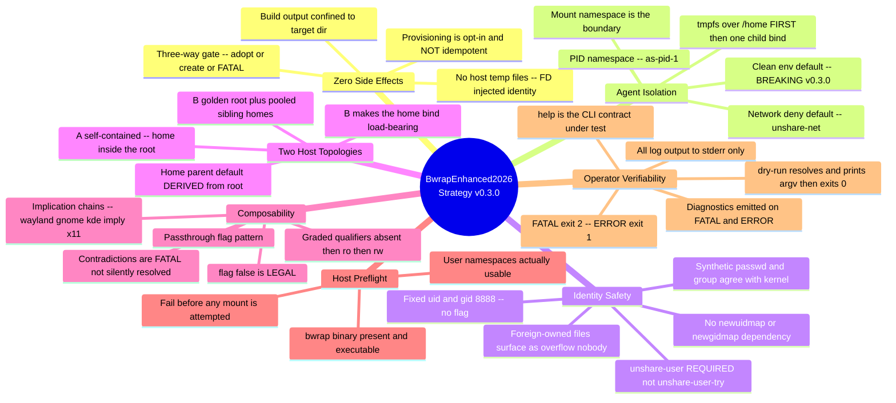
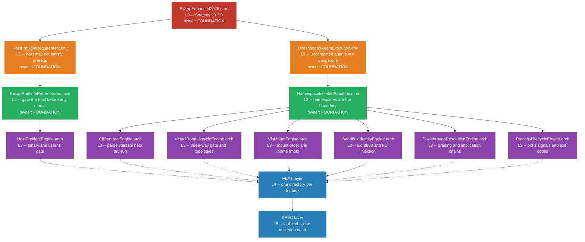

<!-- (c) 2026-* Frederick Bloom -- 20260830-174639-489402-7e7f-9743-f8e20858f291-BwrapEnhanced2026.strat-0.3.0.md -- Hanaden AI Loader -->
---
filename-id:   20260830-174639-489402-7e7f-9743-f8e20858f291-BwrapEnhanced2026.strat
node-type:     STRAT
layer:         0
version:       0.3.0
status:        Active
author:        Frederick Bloom
copyright:     (c) 2026-* Frederick Bloom
parent-slug:   none
parent-filename-id: none
description: >
  Strategy: provide a production-grade, zero-side-effect, leakproof sandbox for
  untrusted AI agent execution built on Linux namespaces via bubblewrap, driven
  by a fully specified CLI contract. v0.3.0 makes clean environment the default
  (BREAKING), renames provisioning to --provision-virtual-root-skeleton to stop
  implying idempotence, fixes sandbox identity at uid=gid=8888 with no
  newuidmap/newgidmap dependency, adds --target-passthrough, legalizes
  --flag false, and commits to two fully specified host topologies.
---

# BwrapEnhanced2026: Strategy (v0.3.0)

## Rationale

AI agents (LLMs, agentic loops, code interpreters) are fundamentally untrusted
workloads. They may generate and execute arbitrary shell commands, touch files,
consume credentials, exfiltrate data, or corrupt system state. Running them on
bare metal or in a simple `bash -c` subshell creates unacceptable production
risk.

*(Threat-model framing carried forward from the prior strategy draft,
`BwrapEnhanced2026.strat-failed-atemp/20260830-024933-915943-7f3d-8daa-c7c4b56bcb0d-BwrapEnhanced2026.strat-0.3.0.md:20-27`.
It is retained verbatim in substance because it is correct and remains the
governing threat model.)*

The strategy is to provide a single, composable, dependency-light sandbox
harness (`bwrap-enhanced.sh`) that any AI orchestrator can call as a drop-in
subprocess boundary. Per `SCOPE-very-narrow.md:7`, the security model is
**default deny over an empty virtual filesystem** -- add only what is needed --
and the contained system "must believe it is in its own real world," oblivious
to the sandbox.

Two consequences of that Rationale shape the entire tree and are stated here
because they are strategy-level, not implementation-level:

1. **The security boundary is the MOUNT NAMESPACE, not file permissions.**
   Under a single unprivileged uid mapping every host file owned by the
   launching user appears inside the jail as the sandbox uid. Permissions
   therefore cannot separate tenants; only *visibility* can. If a jail can see
   another tenant's home it can also write to it. Leak and escape tests are
   consequently not an optional hardening extra -- they *are* the security
   tests, and they carry the highest severity in this tree.

2. **The harness itself must be trustworthy, not merely correct.** The dominant
   observed failure mode in prior versions was not a missing feature but
   *silent degradation*: `--unshare-user-try` quietly yielding no user
   namespace at all, and a fixed `~/virtual-roots/home` home-parent default
   quietly placing the sandbox home outside a non-default root. Both produce a
   sandbox that looks fine and contains nothing. Every strategic goal below is
   therefore paired with a loud, diagnosable failure mode; degradation is never
   silent, and FATAL means terminate, not continue.

## Strategic Goals

The mindmap below is the strategy overview. It is not a restatement of the
prose: it enumerates the concrete mechanism chosen for each goal, which the
prose deliberately does not, so it doubles as the mechanism-to-goal index.

## Decomposition

This strategy decomposes into two independent driver branches. A driver is an
external force that creates the need; it is a force the strategy cannot remove,
only answer.

### DRIV 1: `HostPreflightRequirement.driv` (layer 1)

The host may not satisfy the kernel or binary prerequisites the strategy
depends on. A missing `bwrap` binary, or user namespaces that are administratively
or seccomp-denied, makes the entire strategy impossible to execute. No CLI flag
can rescue this: it is a hard prerequisite whose absence invalidates the
strategy rather than degrading it.

This driver exists because the prerequisite check must be a *gate*, not a
runtime discovery. A prerequisite discovered halfway through mount construction
leaves partial state and an unhelpful error; the same prerequisite discovered
before any namespace operation yields a clean, actionable FATAL.

Motivation beneath it: `BwrapRuntimePrerequisites.moti`.

### DRIV 2: `UncontainedAgentExecution.driv` (layer 1)

Uncontained AI agent execution creates unacceptable production risk. Agents may
generate arbitrary shell commands, touch files, consume credentials, exfiltrate
data, or corrupt system state.

*(Two-driver split and both DRIV slugs carried forward from the prior draft,
`.../BwrapEnhanced2026.strat-failed-atemp/20260830-024933-915943-7f3d-8daa-c7c4b56bcb0d-BwrapEnhanced2026.strat-0.3.0.md:88-108`.)*

Motivation beneath it: `NamespaceIsolatedSandbox.moti`. The fan-out question --
whether this driver has a second distinct motivation -- is evaluated and
decided in the DRIV document itself rather than here, because the reasoning
belongs with the driver it constrains.

### Deliberate deviation from the prior draft: the ARCH layer

The prior draft placed two ARCH nodes under `NamespaceIsolatedSandbox.moti`:
`CliContractEngine.arch` and a single `SandboxExecEngine.arch`
(`.../20260830-024933-915943-7f3d-8daa-c7c4b56bcb0d-BwrapEnhanced2026.strat-0.3.0.md:104-108`).
`SandboxExecEngine` is split here into five focused ARCH nodes. A single ARCH
absorbing the whole of provisioning, mounting, identity, passthrough resolution
and process lifecycle is the structural signature of an undifferentiated
dumping ground: it has no reviewable trust surface, no clean ownership
boundary, and no way to fail informatively. Five focused ARCHs give honest
fan-out and five independently auditable trust surfaces.

This is the layer at which v0.3.0's genuine broadening happens: two ARCHs
become seven. That is deliberate and is the reason no padding is required at
the DRIV or MOTI layers.

### Hierarchy Diagram

The diagram carries information the prose above does not: the complete
layer-numbered tree, the exclusive authoring-ownership assignment per ARCH
subtree (section 4.1 of the buildout coordination context), and the fact that
DRIV 1 terminates in a single ARCH while DRIV 2 fans out to six.

*(`classDef` palette carried forward unchanged from
`.../20260830-024933-915943-7f3d-8daa-c7c4b56bcb0d-BwrapEnhanced2026.strat-0.3.0.md:135-139`
so the whole tree is visually consistent.)*

Structural totals asserted by this document, and only these: 1 STRAT, 2 DRIV,
2 MOTI, 7 ARCH. FEAT and SPEC counts are deliberately NOT asserted here. They
are derived bottom-up by the ARCH-owning authors from the real contract surface
and the real threat surface, and any number stated at strategy level before
that derivation would be a target rather than a measurement. The prior draft's
"279 specs across 48 FEATs"
(`.../20260830-024933-915943-7f3d-8daa-c7c4b56bcb0d-BwrapEnhanced2026.strat-0.3.0.md:142`)
is discarded for exactly this reason and MUST NOT be used as a goal or a
ceiling.

## v0.3.0 Breaking Changes

*(Table format carried forward from
`.../20260830-024933-915943-7f3d-8daa-c7c4b56bcb0d-BwrapEnhanced2026.strat-0.3.0.md:145-157`;
rows updated for the locked v0.3.0 decisions and corrected where the prior
draft was factually wrong.)*

| Change | v0.2.x Behavior | v0.3.0 Behavior |
|--------|-----------------|-----------------|
| Clean env | Opt-in via `--clear-env` | Default; opt-out via `--env-passthrough` |
| Flag naming | `--enable-*`, `--clear-env`, `--share-net` | `--*-passthrough` pattern throughout |
| Graded flags | N/A | `--mise-passthrough`, `--local-bin-passthrough`, `--target-passthrough` take `ro` or `rw`; bare = `ro`; absent = off |
| Boolean flag `false` | N/A | `--flag false` is **LEGAL**. Corrects the prior rule that `false` is an ERROR. The real fatal case is a contradictory combination, not an explicit `false`. |
| Contradictory combinations | Silently resolved or undefined | **FATAL exit 2** with diagnostics. Canonical case: `--x11-passthrough false` with `--gnome-passthrough true`, because gnome implies x11=true. |
| Host preflight | None; silent failure at exec time | **FATAL exit 2** if `bwrap` is absent or user namespaces are unusable, checked before any mount is constructed |
| Preflight prerequisites | N/A | `newuidmap` / `newgidmap` and `/etc/subuid` are **NOT** prerequisites and are **REMOVED**. The prior draft listed them as hard preflight requirements (`.../20260830-024933-915943-7f3d-8daa-c7c4b56bcb0d-BwrapEnhanced2026.strat-0.3.0.md:68-69,151`); that was wrong and would make the tool refuse to run on hosts where it works. They are needed only for multiple simultaneous identities inside one jail, which this design does not require. |
| Provisioning flag | N/A | `--provision-virtual-root-skeleton [true|false]`, default `false`. **Renamed** from `--provision-virtual-root-if-needed` because "if-needed" falsely implies idempotence, and provisioning is deliberately NOT idempotent. |
| Provisioning semantics | Implicit / unspecified | Strict three-way gate: root present and flag absent = ADOPT; root missing and flag passed = CREATE; root missing and flag absent = FATAL; root present and flag passed = FATAL. |
| Sandbox identity | Inherited host uid/gid | Fixed `uid=gid=8888` via `--uid 8888 --gid 8888` under `--unshare-user`. No flag, no privileges, no helper binaries. |
| User namespace flag | `--unshare-user-try` tolerated | `--unshare-user` **only**. The `-try` variant silently degrades to no user namespace, destroying the boundary. Failure to unshare is FATAL. |
| Synthetic identity files | Host temp files | Injected via `--file FD DEST` / `--ro-bind-data FD DEST`; zero host temp files. `passwd`/`group` MUST declare `sandbox_user:x:8888:8888` so `id`, `whoami` and `getpwuid` agree with the kernel. |
| Home parent default | Fixed `~/virtual-roots/home` in v0.2.x help text | **DERIVED** `${HOST_REAL_ROOT}/home` per `SCOPE-very-narrow.md:34`. The fixed default is a bug: it silently places home outside a non-default root. |
| Host topologies | One, implicit | **Two**, both fully specified. A: self-contained, home inside the root. B: golden root plus pooled sibling homes outside the root. They exercise different code paths, so both require coverage. |
| `/home` exposure | Host `/home` bound; every host user's home visible inside | `--tmpfs /home` unconditionally FIRST, then a single bind of the one resolved child. `HOST_REAL_HOME_PARENT` itself is NEVER bound. Invariant: `/home` inside the jail contains **exactly one** entry, always. |
| Build output access | N/A | New `--target-passthrough [rw|ro]` (bare `ro`, absent off) mounts the build target directory and test tree so the suite can run inside a jail. |
| Log level | Ad hoc `echo`/`printf` | Structured contract: FATAL(100) exit **2**, ERROR(200) exit **1**, WARN/INFO/DEBUG/TRACE exit 0; all output to **stderr**; default INFO; `--log-level NAME|NUMBER`. |
| Implication chains | N/A | `--wayland-passthrough`, `--gnome-passthrough`, `--kde-passthrough` each imply `x11=true`. `--dbus-passthrough` is NEVER implied. |
| Dry run | N/A | `--dry-run` resolves all flags, prints the resolved argv, exits 0, executes no `bwrap`. |
| Target version | `0.2.2` (repo `VERSION`) | `0.3.0` |

Two rows present in the prior draft's table are deliberately absent here. Its
`--validate` row
(`.../20260830-024933-915943-7f3d-8daa-c7c4b56bcb0d-BwrapEnhanced2026.strat-0.3.0.md:157`)
is dropped because `--validate` does not appear anywhere in the
`SCOPE-very-narrow.md:20-41` CLI contract; asserting it would invent surface
area the SST does not authorize. Its `--provision-virtual-root-if-needed` row is
replaced rather than kept, per the rename above.

## Strategy-Level Verification Posture

Real `bwrap` cannot execute on the current development host: nested user
namespaces are denied. This is a strategy-level constraint because it
determines what any specification in this tree is permitted to claim.

- `argv-capture` -- a spy `bwrap` shim on `PATH` captures the exact argument
  vector the script builds. Genuine, mutation-catching behavioral coverage of
  mount order, flag resolution, identity arguments and argv construction. Runs
  anywhere. This is not a source-text scan and source-text scans are forbidden.
- `real-exec` -- genuinely runs `bwrap`; the only tier that can prove leak,
  escape, uid mapping and actual visibility. MUST skip loudly with an explicit
  reason when user namespaces are unavailable, and MUST NOT be reported as a
  pass.
- `pure-function` -- unit tests of parsing and resolution helpers, no spawn.

**Honesty requirement, binding on every descendant of this node:** the
`--uid 8888` mapping under `--unshare-user` has NOT been empirically verified
on this host. It is the reasoned consequence of how unprivileged user
namespaces constrain the outside id but not the inside id. It MUST be treated
as the GATING first `real-exec` integration test and MUST NOT be written up
anywhere in this tree as established fact.

## Changelog

| Version | Date | Author | Changes |
|---------|------|--------|---------|
| 0.0.1 | 2026-08-16 | Frederick Bloom + AI | Initial |
| 0.0.1 | 2026-08-17 | Frederick Bloom + AI | Enriched: Rationale, Mermaid mindmap |
| 0.3.0 | 2026-08-30 | Frederick Bloom + AI | Full redesign from `SCOPE-very-narrow.md`; two-DRIV split; 279-spec count asserted |
| 0.3.0 | 2026-08-30 | Frederick Bloom + AI | Rebuild. Carried forward Rationale, mindmap, `classDef` palette, DRIV/MOTI slugs, breaking-changes and changelog table formats. Removed `newuidmap`/`newgidmap` preflight prerequisites as factually wrong. Removed the unsubstantiated FEAT/SPEC counts. Split `SandboxExecEngine.arch` into five focused ARCHs, giving seven total. Added locked decisions: `--provision-virtual-root-skeleton` rename, `--flag false` legal, fixed uid/gid 8888, `--target-passthrough`, two topologies, derived home-parent default, `/home` single-entry invariant. |
