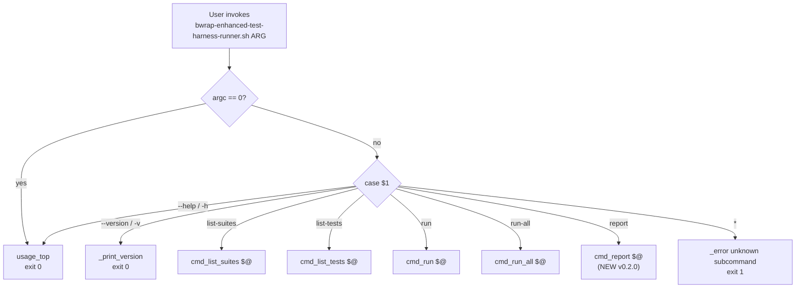
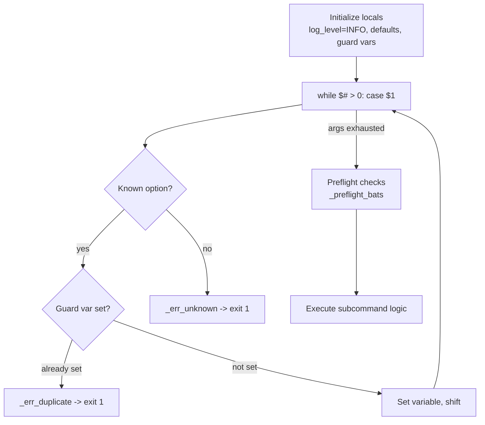
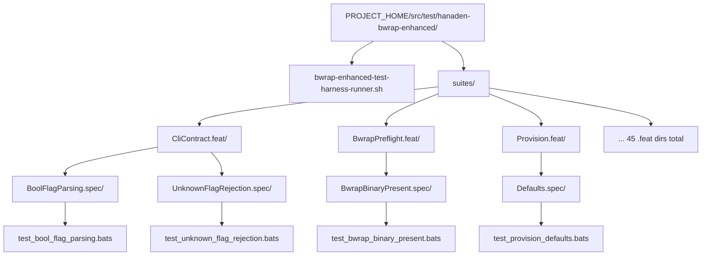
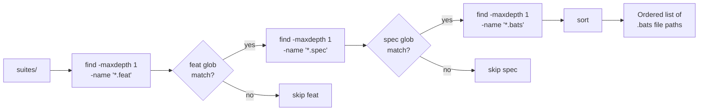
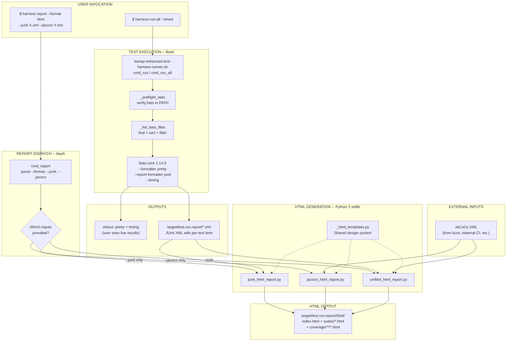
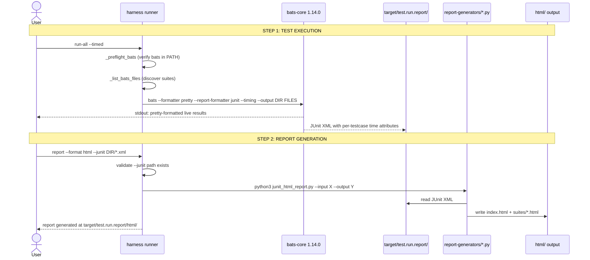
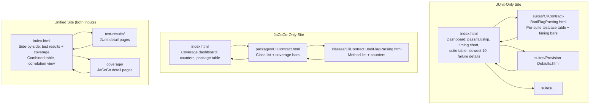

# TestHarnessSystem -- bwrap-enhanced Test Harness Complete System Design

> **Node:** `BwrapEnhanced2026.strat/FormalTestObservability.driv/UnifiedStructuredTestReporting.moti/TestHarnessSystem.sys/`
> **Version:** 0.0.1 (initial)
> **Status:** DRAFT

---

## 1. System Overview

The bwrap-enhanced test harness is a Bash-based test runner built on bats-core 1.14.0. It is the **sole supported way** to discover, execute, and report on the bwrap-enhanced test suite.

### Design Principles

1. **Single entry point.** All test operations go through one script: `bwrap-enhanced-test-harness-runner.sh`
2. **Subcommand dispatch.** Follows the git/podman/systemctl CLI pattern -- each subcommand owns its own options
3. **Standards-native.** Test results use JUnit XML (bats native). Coverage uses JaCoCo XML (external tools). No custom intermediate formats for reporting
4. **Strict schemas.** Every data interchange format has a published, externally-validatable schema. Zero ad-hoc formats
5. **Ephemeral output.** All generated reports go to `PROJECT_HOME/target/` (`.gitignore`'d, never committed)
6. **Zero external dependencies.** Bash 5.2+, bats-core 1.14.0, jq, python3 (stdlib only), xmllint -- nothing to pip/npm install
7. **Air-gap capable.** HTML reports are fully self-contained (all CSS inlined, no CDN)

### Tech Stack

| Tool | Version | Role |
|:---|:---|:---|
| Bash | 5.2+ | Harness runner, subcommand dispatch, discovery |
| bats-core | 1.14.0 | Test execution, JUnit XML output, timing |
| jq | latest | JSON/JSONL construction and validation |
| Python 3 | 3.14+ | HTML report generation (stdlib only) |
| xmllint | system | XML validation (JUnit, JaCoCo) |

---

## 2. Subcommand Dispatch Architecture

All user interaction enters through the main dispatch `case` block at L638-649 of `bwrap-enhanced-test-harness-runner.sh`.



Each `cmd_*` function follows the same internal pattern:



---

## 3. Log System Architecture

The harness implements a 6-level threshold-gated log system. All log output goes to **stderr**. Test results (bats output) go to **stdout**. The two streams never mix.

### Log Levels

| Name | Numeric | Constant | Semantics |
|:---|:---|:---|:---|
| `FATAL` | 100 | `$_LL_FATAL` | Unrecoverable error -> immediate `exit 1` |
| `ERROR` | 200 | `$_LL_ERROR` | Serious problem, but execution may continue |
| `WARN` | 300 | `$_LL_WARN` | Unexpected condition, non-fatal |
| `INFO` | 400 | `$_LL_INFO` | Normal operational messages (default) |
| `DEBUG` | 500 | `$_LL_DEBUG` | Detailed diagnostic output |
| `TRACE` | 600 | `$_LL_TRACE` | Very verbose step-by-step tracing |

### Threshold Gate

```
_log(threshold, current_level, label, message):
    if current_level >= threshold:
        printf '[%s] %s\n' label message >&2
```

A message is printed only when the **current log level** (set by `--log-level`) is **>=** the message's threshold. This means:
- `--log-level INFO` (400): shows FATAL, ERROR, WARN, INFO
- `--log-level DEBUG` (500): shows all above + DEBUG
- `--log-level FATAL` (100): shows only FATAL

### Log Functions (source L83-88)

| Function | Threshold | Extra behavior |
|:---|:---|:---|
| `_fatal` | 100 | Prints then calls `exit 1` |
| `_error` | 200 | Prints only |
| `_warn` | 300 | Prints only |
| `_info` | 400 | Prints only |
| `_debug` | 500 | Prints only |
| `_trace` | 600 | Prints only |

### Level Resolution (`_resolve_log_level`, source L51-65)

Accepts either a **name** (`INFO`, `debug`, case-insensitive) or a **numeric value** (`100`, `400`, `600`). Invalid input -> `exit 1`.

---

## 4. Option Parsing Contract

Every subcommand follows these invariants:

### Duplicate Rejection

Each option has a guard variable (`_feat_set`, `_fmt_set`, etc.). If the same option is passed twice, the parser calls `_err_duplicate` -> `exit 1`.

```bash
# Source L93
_err_duplicate() { _error "$1" "${_HARNESS_NAME}: duplicate option: $2"; exit 1; }
```

### Unknown Option Rejection

Any unrecognized option triggers `_err_unknown` -> prints error + hint -> `exit 1`.

```bash
# Source L94-96
_err_unknown() { _error "$1" "${_HARNESS_NAME} $2: unknown option: $3"
                 _info  "$1" "Run: ${_HARNESS_NAME} $2 --help"
                 exit 1; }
```

> [!WARNING]
> **Exit Code Discrepancy (Tech Debt):** The usage help text for `run` (L458) and `run-all` (L559) documents exit code **3** for option parse errors, but the actual `_err_unknown` and `_err_duplicate` functions call `exit 1`. The IMPLEMENTATION exits 1. This document records the actual behavior.

### Preflight Checks

Before any test execution, `_preflight_bats()` (source L101-107) verifies `bats` is in `$PATH`. If not found -> `_fatal` -> `exit 1`. On success, logs bats version at DEBUG level.

---

## 5. Suite Hierarchy and Discovery

### Directory Layout



### Naming Conventions

| Level | Pattern | Example | Meaning |
|:---|:---|:---|:---|
| Feature | `<Name>.feat/` | `CliContract.feat/` | Functional area under test |
| Spec | `<Name>.spec/` | `BoolFlagParsing.spec/` | Specific behavioral specification |
| Test file | `test_<name>.bats` | `test_bool_flag_parsing.bats` | Executable bats test file |
| Test case | `@test "<ID>: <description>"` | `@test "BOOL-NET-001: --net bare accepted"` | Atomic test with structured ID |

### Test ID Convention

```
<PREFIX>-<AREA>-<SEQ>: <human description>
```

- `PREFIX`: Short mnemonic for the spec (e.g., `BOOL`, `UNK-FLAG`, `DRY`, `PROV-DFLT`)
- `AREA`: Sub-area within the spec (e.g., `NET`, `ENV`, `AUDIO`)
- `SEQ`: 3-digit zero-padded sequence (e.g., `001`, `002`)

### Discovery Helpers (source L109-152)

| Function | Signature | What it does |
|:---|:---|:---|
| `_list_bats_files` | `(feat_filter, spec_filter)` -> stdout | `find` at depth 3 under `suites/`, filtered by `*/FEAT.feat/SPEC.spec/*.bats`, sorted |
| `_list_feat_dirs` | `()` -> stdout | Lists `.feat` basenames (stems without suffix) |
| `_list_spec_dirs` | `(feat_stem)` -> stdout | Lists `.spec` basenames under a given `.feat` directory |
| `_count_tests` | `(bats_file)` -> stdout | `grep -c '^@test '` (returns 0 if none) |
| `_extract_test_names` | `(bats_file)` -> stdout | `grep '^@test '` then `sed` to strip `@test "..."` wrapper |
| `_extract_test_id` | `(test_name)` -> stdout | First whitespace-delimited token, colon stripped |

### Discovery Flow



---

## 6. Existing Subcommand Contracts (v0.1.0)

### 6.1 `list-suites`

Discover and display all feat/spec pairs.

```
USAGE:  bwrap-enhanced-test-harness-runner.sh list-suites [OPTIONS]

OPTIONS:
  -h, --help
  --feat     PATTERN       Filter by feat name (fnmatch glob, omit .feat suffix)
  --spec     PATTERN       Filter by spec name (fnmatch glob, omit .spec suffix)
  --populated              Show only suites that contain at least one .bats file
  --format   table|names   Output format (default: table)
                             table:  aligned columns (FEAT  SPEC  TESTS  STATUS)
                             names:  bare <FEAT>/<SPEC> one per line
  --log-level NAME|NUMBER  (default: INFO)

EXIT CODES:
  0  success
  1  option parse error (duplicate flag, unknown flag, bad --format value)
```

**Output (table format):**
```
FEAT                            SPEC                            TESTS  STATUS
CliContract                     BoolFlagParsing                    20  populated
CliContract                     UnknownFlagRejection                8  populated
```

### 6.2 `list-tests`

List all `@test` cases with structured metadata.

```
USAGE:  bwrap-enhanced-test-harness-runner.sh list-tests [OPTIONS]

OPTIONS:
  -h, --help
  --feat     PATTERN       Filter by feat name (fnmatch glob, omit .feat suffix)
  --spec     PATTERN       Filter by spec name (fnmatch glob, omit .spec suffix)
  --format   table|ids     Output format (default: table)
                             table:  FEAT  SPEC  ID  NAME
                             ids:    bare test IDs (first token of test name, colon stripped)
  --log-level NAME|NUMBER  (default: INFO)

EXIT CODES:
  0  success (even if 0 tests found)
  1  option parse error
```

**Output (table format):**
```
FEAT                       SPEC                       ID                NAME
CliContract                BoolFlagParsing             BOOL-NET-001      BOOL-NET-001: --net bare accepted
```

### 6.3 `run`

Run tests matching filters.

```
USAGE:  bwrap-enhanced-test-harness-runner.sh run [OPTIONS]

OPTIONS:
  -h, --help
  --feat     PATTERN       Run only suites in matching .feat dirs (fnmatch glob)
  --spec     PATTERN       Run only .spec dirs matching this glob
  --filter   REGEX         Pass --filter REGEX to bats (match by test name)
  --format   pretty|tap|tap13|junit   Bats formatter (default: pretty)
  --log-level NAME|NUMBER  (default: INFO)
  -n, --dry-run            Print the bats invocation; do not run

EXIT CODES:
  0  all tests passed
  1  >=1 test failed (bats exit code propagated) OR option parse error
  2  no .bats files matched the given filters
```

> [!NOTE]
> Exit code 1 is overloaded: it covers both "bats test failure" AND "option parse error." The usage help text documents exit 3 for option parse errors, but the implementation (`_err_unknown`, `_err_duplicate`) calls `exit 1`. This overloading should be resolved in a future version.

### 6.4 `run-all`

Run the entire test suite.

```
USAGE:  bwrap-enhanced-test-harness-runner.sh run-all [OPTIONS]

OPTIONS:
  -h, --help
  --populated-only         Skip suites with no .bats files (default: true)
  --no-populated-only      Include empty suites (will produce no tests)
  --format   pretty|tap|tap13|junit   Bats formatter (default: pretty)
  --log-level NAME|NUMBER  (default: INFO)
  -n, --dry-run            Print the bats invocation; do not run

EXIT CODES:
  0  all tests passed, OR no .bats files found (exits cleanly with warning)
  1  >=1 test failed (bats exit code propagated) OR option parse error
```

---

## 7. New Capabilities (v0.2.0)

### 7.1 Timed Test Execution

**What changes:** `run` and `run-all` gain a `--timed` flag. When present, bats is invoked with dual formatters:

```bash
bats --formatter pretty \
     --report-formatter junit \
     --output target/test.run.report/ \
     --timing \
     "${bats_files[@]}"
```

**Effect:**
- Console: user sees `pretty` output with timing annotations (bats `--timing`)
- Disk: JUnit XML written to `target/test.run.report/` with per-testcase `time` attributes
- No intermediate transforms -- bats produces both outputs in one invocation

**New option on `run` and `run-all`:**

| Flag | Meaning |
|:---|:---|
| `--timed` | Enable timing + JUnit XML report output to `target/test.run.report/` |

### 7.2 Report Generation Subcommand

> [!IMPORTANT]
> **`--format` naming collision:** The existing `run` and `run-all` subcommands use `--format` to select the **bats formatter** (`pretty|tap|tap13|junit`). The new `report` subcommand uses `--format` to select the **report output type** (`html`). These are different `--format` options on different subcommands with different value enums. Each subcommand validates its own `--format` values independently.

```
USAGE:  bwrap-enhanced-test-harness-runner.sh report --format <fmt> [OPTIONS]

FORMATS:
  html            Generate HTML site report

OPTIONS (--format html):
  --junit <path>       Path to JUnit XML file or directory of XML files
  --jacoco <path>      Path to JaCoCo XML file
  --output <dir>       Output directory (default: target/test.run.report/html/)
  --log-level NAME|NUM (default: INFO)

BEHAVIOR (determined by which inputs are provided):
  --junit only         -> JUnit-only HTML report (test results + timing)
  --jacoco only        -> JaCoCo-only HTML report (coverage)
  --junit + --jacoco   -> Unified HTML report (test results + coverage combined)

EXIT CODES:
  0  report generated successfully
  1  option parse error
  2  input file not found or invalid XML
```

**Examples:**
```bash
# Run tests with timing, then generate HTML report
./harness run-all --timed
./harness report --format html --junit target/test.run.report/*.xml

# Ingest external JaCoCo coverage and combine with test results
./harness report --format html \
    --junit target/test.run.report/*.xml \
    --jacoco /path/to/external/jacoco.xml

# JaCoCo-only HTML report from external tool
./harness report --format html --jacoco /path/to/jacoco.xml
```

---

## 8. Data Pipeline Architecture

### Full System Pipeline



### Data Flow -- Step by Step



---

## 9. Schema References

**Invariant:** Every data format in the pipeline has a published, externally-validatable schema. No ad-hoc formats.

### 9.1 JUnit XML

| Property | Value |
|:---|:---|
| **Producer** | bats-core 1.14.0 (`--report-formatter junit`) |
| **Consumer** | `junit_html_report.py`, `unified_html_report.py` |
| **Authority** | De facto standard (testmoapp/junitxml) |
| **Validation** | `xmllint --noout <file>` |
| **Key elements** | `testsuites` -> `testsuite` -> `testcase` (+ `failure`/`skipped`/`error`) |
| **Timing** | `testcase/@time` (float, seconds) -- requires bats `--timing` flag |

**Required attributes per element:**

| Element | Required Attributes | Type |
|:---|:---|:---|
| `testsuites` | `time` | float (seconds) |
| `testsuite` | `name`, `tests`, `failures`, `errors`, `skipped`, `time`, `timestamp` | string, int x 4, float, ISO-8601 |
| `testcase` | `name`, `classname`, `time` | string, string, float |

**Child elements on `testcase`:**

| Condition | Element | Attributes |
|:---|:---|:---|
| Test failed | `<failure message="..." type="failure">full output</failure>` | `message`, `type` |
| Test skipped | `<skipped message="reason"/>` | `message` |
| Setup/teardown crash | `<error message="..." type="error">stack trace</error>` | `message`, `type` |
| Output captured | `<system-out>text</system-out>`, `<system-err>text</system-err>` | -- |

### 9.2 JaCoCo XML

| Property | Value |
|:---|:---|
| **Producer** | External tools (kcov, JaCoCo, future integration) |
| **Consumer** | `jacoco_html_report.py`, `unified_html_report.py` |
| **Authority** | Official DTD: jacoco.org/jacoco/trunk/coverage/report.dtd |
| **Validation** | `xmllint --dtdvalid report.dtd <file>` |
| **Key elements** | `report` -> `package` -> `class`/`sourcefile` -> `method` -> `counter` |
| **Counter types** | `INSTRUCTION`, `LINE`, `BRANCH`, `COMPLEXITY`, `METHOD`, `CLASS` |

**Counter element contract:**

| Attribute | Type | Meaning |
|:---|:---|:---|
| `type` | enum | One of: `INSTRUCTION`, `LINE`, `BRANCH`, `COMPLEXITY`, `METHOD`, `CLASS` |
| `missed` | integer >= 0 | Units not covered by tests |
| `covered` | integer >= 0 | Units covered by tests |

### 9.3 JSONL Streaming Events (Separate Feature -- Not Part of Reporting Pipeline)

| Property | Value |
|:---|:---|
| **Authority** | `TestRunReportSchema.feat-0.0.1` (JSON Schema Draft 7) |
| **Record types** | `suite_started`, `test_case`, `coverage_record`, `suite_finished` |
| **Status** | Schema defined. Emission implementation is a SEPARATE work item |
| **Relationship to reporting** | Independent. JSONL streaming is for real-time dashboards/CI gates. HTML reporting consumes JUnit/JaCoCo XML directly |

---

## 10. HTML Report Specifications

### 10.1 Shared Design System

**Visual Identity:** Hanaden brand -- dark mode, purple/indigo accents.

**CSS Variables (design tokens):**
```css
:root {
  --bg-primary:        #0f0f1a;      /* deep navy-black */
  --bg-secondary:      #1a1a2e;      /* dark panel */
  --bg-tertiary:       #16213e;      /* card background */
  --text-primary:      #e0e0e0;      /* main text */
  --text-secondary:    #a0a0b0;      /* muted text */
  --accent-primary:    #7c3aed;      /* purple -- Hanaden brand */
  --accent-secondary:  #6366f1;      /* indigo */
  --status-pass:       #22c55e;      /* green */
  --status-fail:       #ef4444;      /* red */
  --status-skip:       #f59e0b;      /* amber */
  --status-error:      #f97316;      /* orange */
  --coverage-high:     #22c55e;      /* >=80% */
  --coverage-mid:      #f59e0b;      /* 50-79% */
  --coverage-low:      #ef4444;      /* <50% */
  --font-family:       system-ui, -apple-system, sans-serif;
  --font-mono:         ui-monospace, monospace;
  --border-radius:     0.5rem;
}
```

**Self-contained constraint:** All CSS inlined in each HTML page via `<style>` block. No external `<link>` tags. No JavaScript CDN dependencies. Interactive elements use HTML5-native `<details>/<summary>`.

### 10.2 HTML Site Navigation Map



### 10.3 JUnit-Only HTML Site

**Dashboard (`index.html`):**
- Header: project name, run timestamp, total execution time
- Summary cards: Total / Passed / Failed / Skipped / Errors (colored badges)
- Pass rate gauge (SVG arc)
- Per-suite summary table: Name | Tests | Pass | Fail | Skip | Time | Status
- Slowest 10 tests table: Name | Suite | Time
- Failure details: expandable `<details>` blocks with full error output

**Suite detail pages (`suites/<Feat>-<Spec>.html`):**
- Breadcrumb: Home -> Suite Name
- Suite summary stats
- Testcase table: ID | Name | Status | Time
- Per-test timing bar (inline SVG)
- Failure/error details with full output

### 10.4 JaCoCo-Only HTML Site

**Dashboard (`index.html`):**
- Session info: run ID, start/end timestamps
- Overall counters: METHOD, CLASS, LINE, BRANCH as progress bars with percentages
- Package breakdown table: Name | Methods (covered/total) | Lines | Branches | %

**Package pages:**
- Class list with per-class counter bars
- Aggregate counters for the package

**Class pages:**
- Method list with covered/missed status indicator
- Source file reference
- Per-counter breakdowns

### 10.5 Unified HTML Site (both JUnit + JaCoCo present)

**Unified dashboard (`index.html`):**
- Side-by-side summary cards: Test Results + Coverage
- Combined table: each row shows BOTH suite test status AND matching package coverage
- Correlation view: suites sorted by (slowest time x lowest coverage)
- Navigation: "Test Results" | "Coverage" | "Combined" (anchor links, no JS)
- Overall health badge (combines pass rate + coverage %)

---

## 11. Complete File Map

### Existing Files (No Modification by Reporting Subsystem)

| Path | Responsibility |
|:---|:---|
| `src/test/.../bwrap-enhanced-test-harness-runner.sh` | Entry point, subcommand dispatch |
| `src/test/.../suites/**/*.bats` | 53 test files, 736 test cases |

### Modified Files

| Path | Changes |
|:---|:---|
| `src/test/.../bwrap-enhanced-test-harness-runner.sh` | Add `--timed` flag to `cmd_run`/`cmd_run_all`, add `cmd_report` function + `report` dispatch case, update `usage_top` help text |

### New Files

| Path | Responsibility | Language |
|:---|:---|:---|
| `src/lib/report-generators/__init__.py` | Python package marker | Python |
| `src/lib/report-generators/_html_templates.py` | Shared HTML/CSS design system, SVG chart primitives, color palette | Python |
| `src/lib/report-generators/junit_html_report.py` | JUnit XML -> HTML site (entry point: `--input`, `--output`) | Python |
| `src/lib/report-generators/jacoco_html_report.py` | JaCoCo XML -> HTML site (entry point: `--input`, `--output`) | Python |
| `src/lib/report-generators/unified_html_report.py` | JUnit XML + JaCoCo XML -> unified HTML site | Python |

### Generated Output (Ephemeral, .gitignore'd)

```
PROJECT_HOME/target/
  test.run.report/
    *.xml                        -- bats JUnit XML output (from --timed)
    html/                        -- generated HTML site
      index.html
      suites/*.html
      coverage/**/*.html         (when JaCoCo input present)
```

---

## 12. Testing Strategy for New Components

New test suites under `suites/TestHarness.feat/`:

| Spec | What It Validates |
|:---|:---|
| `TimedExecution.spec` | `--timed` flag produces JUnit XML in `target/`, XML is valid per `xmllint`, `testcase` elements have `time` attributes with float values > 0 |
| `ReportSubcommand.spec` | `report` dispatches correctly, rejects missing `--format`, rejects `--format` without `--junit` or `--jacoco`, rejects nonexistent input file paths with exit 2, rejects malformed XML with exit 2 |
| `JunitHtmlReport.spec` | Feed known JUnit XML fixture, verify: output dir created, `index.html` exists, contains `<h1>`, pass/fail counts in HTML match XML source data, CSS is inlined (grep for `<style>`, no `<link rel="stylesheet"`), per-suite pages generated, internal links resolve |
| `JacocoHtmlReport.spec` | Feed known JaCoCo XML fixture, verify: `index.html` exists, coverage counter values in HTML match XML `<counter>` attributes, package and class pages generated |
| `UnifiedHtmlReport.spec` | Feed both XML fixtures, verify: unified `index.html` contains both test result and coverage sections, navigation anchors present, combined table has both test counts and coverage percentages |

### Test Fixture Strategy

Each spec includes a `fixtures/` directory with small, handcrafted XML files that have known values:

```
suites/TestHarness.feat/
  JunitHtmlReport.spec/
    fixtures/
      sample-junit.xml              -- 2 suites, 5 tests (3 pass, 1 fail, 1 skip)
    test_html_report_junit.bats
  JacocoHtmlReport.spec/
    fixtures/
      sample-jacoco.xml             -- 1 package, 2 classes, known counter values
    test_html_report_jacoco.bats
```

Tests assert against the **known values** in these fixtures -- not against arbitrary runtime data.

---

## 13. Open Items and Future Extensions

| Item | Status | Notes |
|:---|:---|:---|
| JSONL streaming emission (`test-emit.sh`) | **Deferred** | Separate work item -- independent of reporting pipeline |
| `kcov` integration for Bash coverage | **Future** | Would produce real JaCoCo XML for the pipeline to ingest |
| Report retention/cleanup | **User-managed** | No automatic cleanup -- user decides when to delete `target/` |
| Multi-run trend analysis | **Future** | Compare HTML reports across runs -- requires storing historical data |
| CI integration (Jenkins/GitLab) | **Future** | JUnit XML already consumable; HTML reports deployable as artifacts |
| Exit code 3 for option parse errors | **Bug/Tech Debt** | Usage text documents exit 3 but `_err_unknown`/`_err_duplicate` call exit 1. Resolve in next harness version |
