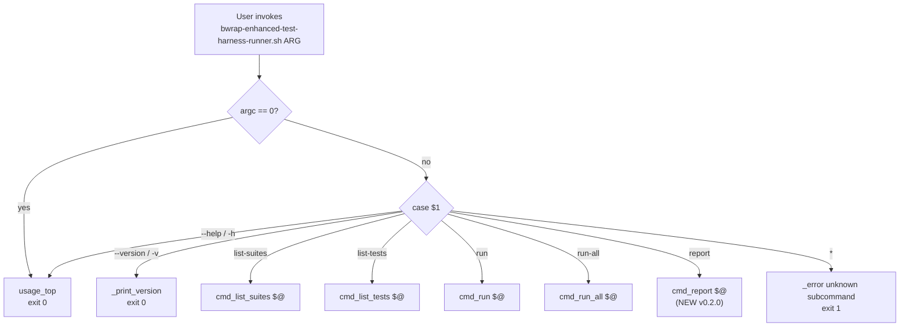
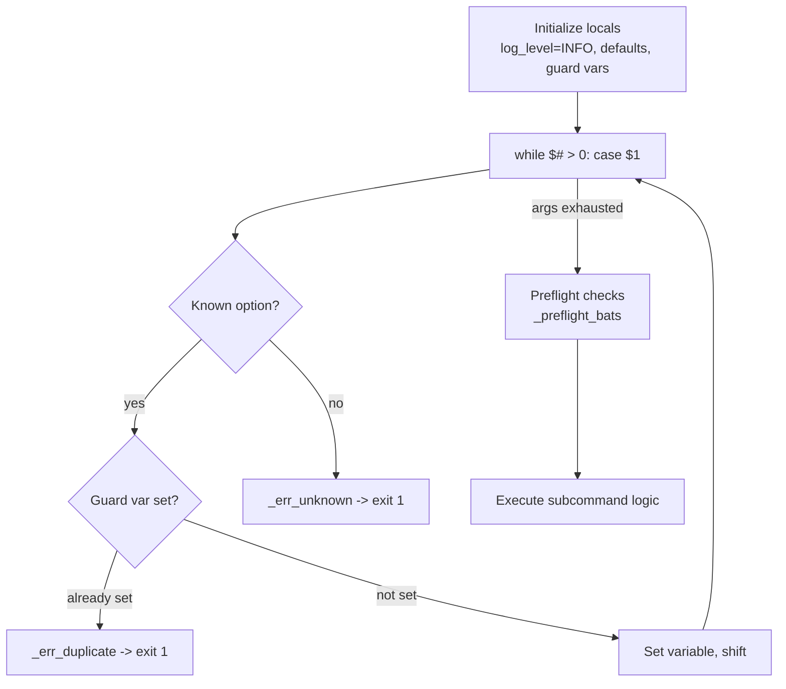
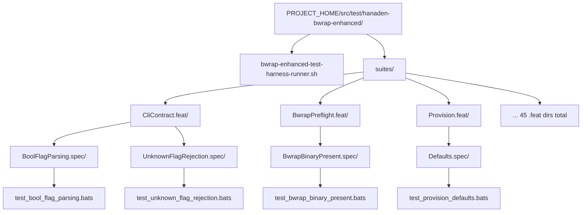
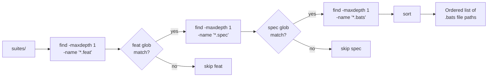
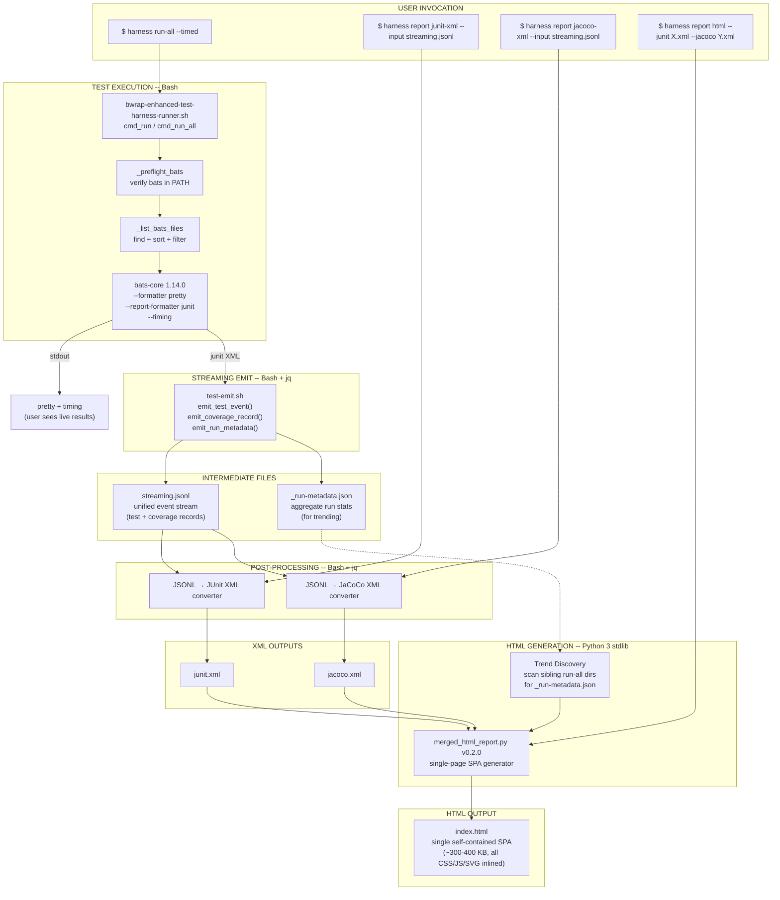
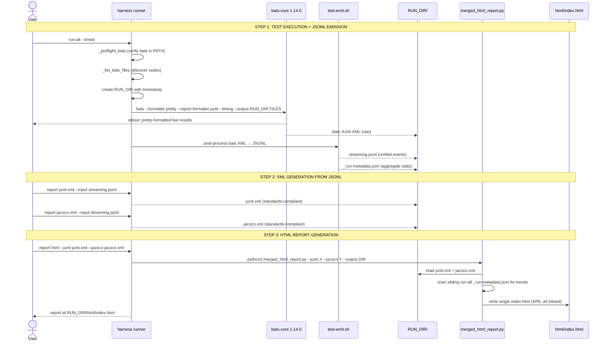

# TestHarnessSystem -- bwrap-enhanced Test Harness Complete System Design

> **Node:** `BwrapEnhanced2026.strat/FormalTestObservability.driv/UnifiedStructuredTestReporting.moti/TestHarnessSystem.sys/`
> **Version:** 0.0.1 (initial)
> **Status:** DRAFT

---

## 1. System Overview

The bwrap-enhanced test harness is a Bash-based test runner built on bats-core 1.14.0. It is the **sole supported way** to discover, execute, and report on the bwrap-enhanced test suite.

### Design Principles

1. **Single entry point.** All test operations go through one script: `bwrap-enhanced-test-harness-runner.sh`
2. **Subcommand dispatch.** Follows the git/podman/systemctl CLI pattern -- each subcommand owns its own options
3. **Standards-native.** Test results use JUnit XML (bats native). Coverage uses JaCoCo XML (external tools). No custom intermediate formats for reporting
4. **Strict schemas.** Every data interchange format has a published, externally-validatable schema. Zero ad-hoc formats
5. **Ephemeral output.** All generated reports go to `PROJECT_HOME/target/` (`.gitignore`'d, never committed)
6. **Zero external dependencies.** Bash 5.2+, bats-core 1.14.0, jq, python3 (stdlib only), xmllint -- nothing to pip/npm install
7. **Air-gap capable.** HTML reports are fully self-contained (all CSS inlined, no CDN)

### Tech Stack

| Tool | Version | Role |
|:---|:---|:---|
| Bash | 5.2+ | Harness runner, subcommand dispatch, discovery |
| bats-core | 1.14.0 | Test execution, JUnit XML output, timing |
| jq | latest | JSON/JSONL construction and validation |
| Python 3 | 3.14+ | HTML report generation (stdlib only) |
| xmllint | system | XML validation (JUnit, JaCoCo) |

---

## 2. Subcommand Dispatch Architecture

All user interaction enters through the main dispatch `case` block at L638-649 of `bwrap-enhanced-test-harness-runner.sh`.



Each `cmd_*` function follows the same internal pattern:



---

## 3. Log System Architecture

The harness implements a 6-level threshold-gated log system. All log output goes to **stderr**. Test results (bats output) go to **stdout**. The two streams never mix.

### Log Levels

| Name | Numeric | Constant | Semantics |
|:---|:---|:---|:---|
| `FATAL` | 100 | `$_LL_FATAL` | Unrecoverable error -> immediate `exit 1` |
| `ERROR` | 200 | `$_LL_ERROR` | Serious problem, but execution may continue |
| `WARN` | 300 | `$_LL_WARN` | Unexpected condition, non-fatal |
| `INFO` | 400 | `$_LL_INFO` | Normal operational messages (default) |
| `DEBUG` | 500 | `$_LL_DEBUG` | Detailed diagnostic output |
| `TRACE` | 600 | `$_LL_TRACE` | Very verbose step-by-step tracing |

### Threshold Gate

```
_log(threshold, current_level, label, message):
    if current_level >= threshold:
        printf '[%s] %s\n' label message >&2
```

A message is printed only when the **current log level** (set by `--log-level`) is **>=** the message's threshold. This means:
- `--log-level INFO` (400): shows FATAL, ERROR, WARN, INFO
- `--log-level DEBUG` (500): shows all above + DEBUG
- `--log-level FATAL` (100): shows only FATAL

### Log Functions (source L83-88)

| Function | Threshold | Extra behavior |
|:---|:---|:---|
| `_fatal` | 100 | Prints then calls `exit 1` |
| `_error` | 200 | Prints only |
| `_warn` | 300 | Prints only |
| `_info` | 400 | Prints only |
| `_debug` | 500 | Prints only |
| `_trace` | 600 | Prints only |

### Level Resolution (`_resolve_log_level`, source L51-65)

Accepts either a **name** (`INFO`, `debug`, case-insensitive) or a **numeric value** (`100`, `400`, `600`). Invalid input -> `exit 1`.

---

## 4. Option Parsing Contract

Every subcommand follows these invariants:

### Duplicate Rejection

Each option has a guard variable (`_feat_set`, `_fmt_set`, etc.). If the same option is passed twice, the parser calls `_err_duplicate` -> `exit 1`.

```bash
# Source L93
_err_duplicate() { _error "$1" "${_HARNESS_NAME}: duplicate option: $2"; exit 1; }
```

### Unknown Option Rejection

Any unrecognized option triggers `_err_unknown` -> prints error + hint -> `exit 1`.

```bash
# Source L94-96
_err_unknown() { _error "$1" "${_HARNESS_NAME} $2: unknown option: $3"
                 _info  "$1" "Run: ${_HARNESS_NAME} $2 --help"
                 exit 1; }
```

> [!WARNING]
> **Exit Code Discrepancy (Tech Debt):** The usage help text for `run` (L458) and `run-all` (L559) documents exit code **3** for option parse errors, but the actual `_err_unknown` and `_err_duplicate` functions call `exit 1`. The IMPLEMENTATION exits 1. This document records the actual behavior.

### Preflight Checks

Before any test execution, `_preflight_bats()` (source L101-107) verifies `bats` is in `$PATH`. If not found -> `_fatal` -> `exit 1`. On success, logs bats version at DEBUG level.

---

## 5. Suite Hierarchy and Discovery

### Directory Layout



### Naming Conventions

| Level | Pattern | Example | Meaning |
|:---|:---|:---|:---|
| Feature | `<Name>.feat/` | `CliContract.feat/` | Functional area under test |
| Spec | `<Name>.spec/` | `BoolFlagParsing.spec/` | Specific behavioral specification |
| Test file | `test_<name>.bats` | `test_bool_flag_parsing.bats` | Executable bats test file |
| Test case | `@test "<ID>: <description>"` | `@test "BOOL-NET-001: --net bare accepted"` | Atomic test with structured ID |

### Test ID Convention

```
<PREFIX>-<AREA>-<SEQ>: <human description>
```

- `PREFIX`: Short mnemonic for the spec (e.g., `BOOL`, `UNK-FLAG`, `DRY`, `PROV-DFLT`)
- `AREA`: Sub-area within the spec (e.g., `NET`, `ENV`, `AUDIO`)
- `SEQ`: 3-digit zero-padded sequence (e.g., `001`, `002`)

### Discovery Helpers (source L109-152)

| Function | Signature | What it does |
|:---|:---|:---|
| `_list_bats_files` | `(feat_filter, spec_filter)` -> stdout | `find` at depth 3 under `suites/`, filtered by `*/FEAT.feat/SPEC.spec/*.bats`, sorted |
| `_list_feat_dirs` | `()` -> stdout | Lists `.feat` basenames (stems without suffix) |
| `_list_spec_dirs` | `(feat_stem)` -> stdout | Lists `.spec` basenames under a given `.feat` directory |
| `_count_tests` | `(bats_file)` -> stdout | `grep -c '^@test '` (returns 0 if none) |
| `_extract_test_names` | `(bats_file)` -> stdout | `grep '^@test '` then `sed` to strip `@test "..."` wrapper |
| `_extract_test_id` | `(test_name)` -> stdout | First whitespace-delimited token, colon stripped |

### Discovery Flow



---

## 6. Existing Subcommand Contracts (v0.1.0)

### 6.1 `list-suites`

Discover and display all feat/spec pairs.

```
USAGE:  bwrap-enhanced-test-harness-runner.sh list-suites [OPTIONS]

OPTIONS:
  -h, --help
  --feat     PATTERN       Filter by feat name (fnmatch glob, omit .feat suffix)
  --spec     PATTERN       Filter by spec name (fnmatch glob, omit .spec suffix)
  --populated              Show only suites that contain at least one .bats file
  --format   table|names   Output format (default: table)
                             table:  aligned columns (FEAT  SPEC  TESTS  STATUS)
                             names:  bare <FEAT>/<SPEC> one per line
  --log-level NAME|NUMBER  (default: INFO)

EXIT CODES:
  0  success
  1  option parse error (duplicate flag, unknown flag, bad --format value)
```

**Output (table format):**
```
FEAT                            SPEC                            TESTS  STATUS
CliContract                     BoolFlagParsing                    20  populated
CliContract                     UnknownFlagRejection                8  populated
```

### 6.2 `list-tests`

List all `@test` cases with structured metadata.

```
USAGE:  bwrap-enhanced-test-harness-runner.sh list-tests [OPTIONS]

OPTIONS:
  -h, --help
  --feat     PATTERN       Filter by feat name (fnmatch glob, omit .feat suffix)
  --spec     PATTERN       Filter by spec name (fnmatch glob, omit .spec suffix)
  --format   table|ids     Output format (default: table)
                             table:  FEAT  SPEC  ID  NAME
                             ids:    bare test IDs (first token of test name, colon stripped)
  --log-level NAME|NUMBER  (default: INFO)

EXIT CODES:
  0  success (even if 0 tests found)
  1  option parse error
```

**Output (table format):**
```
FEAT                       SPEC                       ID                NAME
CliContract                BoolFlagParsing             BOOL-NET-001      BOOL-NET-001: --net bare accepted
```

### 6.3 `run`

Run tests matching filters.

```
USAGE:  bwrap-enhanced-test-harness-runner.sh run [OPTIONS]

OPTIONS:
  -h, --help
  --feat     PATTERN       Run only suites in matching .feat dirs (fnmatch glob)
  --spec     PATTERN       Run only .spec dirs matching this glob
  --filter   REGEX         Pass --filter REGEX to bats (match by test name)
  --format   pretty|tap|tap13|junit   Bats formatter (default: pretty)
  --log-level NAME|NUMBER  (default: INFO)
  -n, --dry-run            Print the bats invocation; do not run

EXIT CODES:
  0  all tests passed
  1  >=1 test failed (bats exit code propagated) OR option parse error
  2  no .bats files matched the given filters
```

> [!NOTE]
> Exit code 1 is overloaded: it covers both "bats test failure" AND "option parse error." The usage help text documents exit 3 for option parse errors, but the implementation (`_err_unknown`, `_err_duplicate`) calls `exit 1`. This overloading should be resolved in a future version.

### 6.4 `run-all`

Run the entire test suite.

```
USAGE:  bwrap-enhanced-test-harness-runner.sh run-all [OPTIONS]

OPTIONS:
  -h, --help
  --populated-only         Skip suites with no .bats files (default: true)
  --no-populated-only      Include empty suites (will produce no tests)
  --format   pretty|tap|tap13|junit   Bats formatter (default: pretty)
  --log-level NAME|NUMBER  (default: INFO)
  -n, --dry-run            Print the bats invocation; do not run

EXIT CODES:
  0  all tests passed, OR no .bats files found (exits cleanly with warning)
  1  >=1 test failed (bats exit code propagated) OR option parse error
```

---

## 7. New Capabilities (v0.2.0)

### 7.1 Timed Test Execution

**What changes:** `run` and `run-all` gain a `--timed` flag. When present, bats is invoked with dual formatters:

```bash
bats --formatter pretty \
     --report-formatter junit \
     --output target/test.run.report/ \
     --timing \
     "${bats_files[@]}"
```

**Effect:**
- Console: user sees `pretty` output with timing annotations (bats `--timing`)
- Disk: JUnit XML written to `target/test.run.report/` with per-testcase `time` attributes
- No intermediate transforms -- bats produces both outputs in one invocation

**New option on `run` and `run-all`:**

| Flag | Meaning |
|:---|:---|
| `--timed` | Enable timing + JUnit XML report output to `target/test.run.report/` |

### 7.2 Report Generation Subcommand

> [!IMPORTANT]
> **`--format` naming collision:** The existing `run` and `run-all` subcommands use `--format` to select the **bats formatter** (`pretty|tap|tap13|junit`). The new `report` subcommand uses `--format` to select the **report output type** (`html`). These are different `--format` options on different subcommands with different value enums. Each subcommand validates its own `--format` values independently.

```
USAGE:  bwrap-enhanced-test-harness-runner.sh report --format <fmt> [OPTIONS]

FORMATS:
  html            Generate HTML site report

OPTIONS (--format html):
  --junit <path>       Path to JUnit XML file or directory of XML files
  --jacoco <path>      Path to JaCoCo XML file
  --output <dir>       Output directory (default: target/test.run.report/html/)
  --log-level NAME|NUM (default: INFO)

BEHAVIOR (determined by which inputs are provided):
  --junit only         -> JUnit-only HTML report (test results + timing)
  --jacoco only        -> JaCoCo-only HTML report (coverage)
  --junit + --jacoco   -> Unified HTML report (test results + coverage combined)

EXIT CODES:
  0  report generated successfully
  1  option parse error
  2  input file not found or invalid XML
```

**Examples:**
```bash
# Run tests with timing, then generate HTML report
./harness run-all --timed
./harness report --format html --junit target/test.run.report/*.xml

# Ingest external JaCoCo coverage and combine with test results
./harness report --format html \
    --junit target/test.run.report/*.xml \
    --jacoco /path/to/external/jacoco.xml

# JaCoCo-only HTML report from external tool
./harness report --format html --jacoco /path/to/jacoco.xml
```

---

## 8. Data Pipeline Architecture (v0.2.0)

### 8.1 Pipeline Overview

The v0.2.0 pipeline follows a **JSONL-first** architecture. All test execution and coverage data flows through a universal JSONL streaming format before being post-processed into JUnit XML, JaCoCo XML, and HTML reports.

```
bats → JSONL → JUnit XML → ─┐
                              ├─→ merged_html_report.py → index.html (SPA)
       JSONL → JaCoCo XML → ─┘
```

> [!IMPORTANT]
> **Design Decision:** JSONL is the universal intermediate format. Both JUnit and JaCoCo XML are **derived** from JSONL, never the reverse. The HTML report consumes the XML files because XML is the standards-native format for these domains, but JSONL is always the source of truth.

### 8.2 Full System Pipeline



### 8.3 Data Flow -- Step by Step



### 8.4 One-Liner Invocation

```bash
# Full pipeline: test → JSONL → XML → HTML
./bwrap-enhanced-test-harness-runner.sh run-all --timed
```

The `--timed` flag on `run-all` automatically executes the entire pipeline:

1. Runs all bats tests with timing + JUnit output
2. Post-processes bats JUnit XML into JSONL (`streaming.jsonl`)
3. Writes run metadata (`_run-metadata.json`) with aggregate stats
4. Converts JSONL → `junit.xml` (standards-compliant)
5. Converts JSONL → `jacoco.xml` (coverage-as-methods)
6. Generates `html/index.html` (single-page SPA)

All outputs land in a timestamped run directory under `target/test.run.report/`.

---

## 9. Run Directory and Retention

### 9.1 Run Directory Naming Convention

Each test run produces an isolated directory under `target/test.run.report/`:

```
<YYYYMMDD>-<HHMMSS>-<FFFFFF>.<scope>.test.run/
```

| Segment | Format | Example | Meaning |
|:---|:---|:---|:---|
| `YYYYMMDD-HHMMSS-FFFFFF` | UTC timestamp, microsecond precision | `20260901-105109-495733` | When the run started (Zulu time) |
| `scope` | dot-separated scope descriptor | `run-all` | Full suite run |
| | | `run--feat-BwrapPreflight--spec-BwrapBinaryPresent` | Filtered run with feat+spec |
| `.test.run` | Fixed suffix | | Identifies as a test run directory |

**Examples:**

```
20260901-021326-247633.run-all.test.run/
20260901-021332-069238.run--feat-BwrapPreflight--spec-BwrapBinaryPresent.test.run/
20260901-105109-495733.run-all.test.run/
```

### 9.2 Run Directory Contents

```
<timestamp>.<scope>.test.run/
├── _run-metadata.json        # Aggregate run stats (required)
├── streaming.jsonl           # Universal event stream (required)
├── junit.xml                 # JUnit XML (derived from JSONL)
├── jacoco.xml                # JaCoCo XML (derived from JSONL)
└── html/
    └── index.html            # Self-contained SPA report
```

### 9.3 Retention Policy

- **No automatic cleanup.** All runs are retained until the user deletes `target/`.
- **Each run is independent.** No run modifies or depends on another run's data files.
- **Trending data** is read from sibling `_run-metadata.json` files at HTML generation time (read-only scan).
- The entire `target/` tree is `.gitignore`'d. Never committed.

---

## 10. Schema Specifications

**Invariant:** Every data interchange format in the pipeline has a published, externally-validatable schema. No ad-hoc formats.

### 10.1 JSONL Test Event Schema

| Property | Value |
|:---|:---|
| **Schema file** | `src/lib/schemas/test-event.schema.json` |
| **Standard** | JSON Schema Draft 7 |
| **$id** | `https://hanaden.ai/schemas/test-event/0.1.0` |
| **Producer** | `test-emit.sh` (via `jq`) |
| **Consumer** | JSONL → JUnit XML converter, JSONL → JaCoCo XML converter |
| **Validation** | Any JSON Schema Draft 7 validator |

**Record types** (discriminated union on `type` field):

#### `suite_started`

| Field | Type | Required | Description |
|:---|:---|:---|:---|
| `type` | `"suite_started"` | ✓ | Discriminator |
| `trace_id` | string (32 hex chars) | ✓ | Links all events in one harness invocation |
| `timestamp_unix_ms` | integer | ✓ | Unix epoch milliseconds |
| `suite_name` | string | ✓ | Bats filename |
| `test_count` | integer ≥ 0 | ✓ | Number of test cases in this suite |

#### `test_case`

| Field | Type | Required | Description |
|:---|:---|:---|:---|
| `type` | `"test_case"` | ✓ | Discriminator |
| `trace_id` | string (32 hex chars) | ✓ | Links to run |
| `timestamp_unix_ms` | integer | ✓ | When event was recorded |
| `span_id` | string (16 hex chars) | ✓ | Unique to this test case |
| `vector_id` | string | ✓ | Structured test ID (e.g. `PF-BIN-001`) |
| `description` | string | ✓ | Full test name with ID + human description |
| `feat` | string | ✓ | Feature area (maps to JUnit classname prefix) |
| `spec` | string | ✓ | Specification (maps to JUnit classname suffix) |
| `status` | `"PASS"` ǀ `"FAIL"` ǀ `"SKIP"` ǀ `"ERROR"` | ✓ | Test outcome |
| `duration_ms` | integer ≥ 0 | ✓ | Execution time in milliseconds |
| `error_message` | string | ✗ | Summary (present only on FAIL/ERROR) |
| `error_output` | string | ✗ | Full output (present only on FAIL/ERROR) |

#### `suite_finished`

| Field | Type | Required | Description |
|:---|:---|:---|:---|
| `type` | `"suite_finished"` | ✓ | Discriminator |
| `trace_id` | string (32 hex chars) | ✓ | Links to run |
| `timestamp_unix_ms` | integer | ✓ | When event was recorded |
| `suite_name` | string | ✓ | Bats filename |
| `tests_run` | integer ≥ 0 | ✓ | Total tests executed |
| `tests_passed` | integer ≥ 0 | ✓ | Pass count |
| `tests_failed` | integer ≥ 0 | ✓ | Fail count |
| `tests_skipped` | integer ≥ 0 | ✓ | Skip count |
| `total_duration_ms` | integer ≥ 0 | ✓ | Wall-clock ms for suite |

### 10.2 JSONL Coverage Event Schema

| Property | Value |
|:---|:---|
| **Schema file** | `src/lib/schemas/coverage-event.schema.json` |
| **Standard** | JSON Schema Draft 7 |
| **$id** | `https://hanaden.ai/schemas/coverage-event/0.1.0` |
| **Producer** | `test-emit.sh` (via `jq`) |
| **Consumer** | JSONL → JaCoCo XML converter |
| **Model** | Timing-as-coverage: a passing test method = 1 covered method |

**Record: `coverage_record`**

| Field | Type | Required | Description |
|:---|:---|:---|:---|
| `type` | `"coverage_record"` | ✓ | Fixed value |
| `trace_id` | string (32 hex chars) | ✓ | Links to run |
| `feat` | string | ✓ | Feature → maps to JaCoCo `<package>` |
| `spec` | string | ✓ | Spec → maps to JaCoCo `<class>` |
| `methods_covered` | integer ≥ 0 | ✓ | PASSED test count → METHOD counter `covered` |
| `methods_total` | integer ≥ 0 | ✓ | Total test count → METHOD counter `missed + covered` |
| `lines_covered` | integer ≥ 0 | ✓ | Assertion lines in passing tests → LINE counter `covered` |
| `lines_total` | integer ≥ 0 | ✓ | All assertion lines → LINE counter `missed + covered` |

`additionalProperties: false` — no extra fields permitted.

### 10.3 Run Metadata Schema

| Property | Value |
|:---|:---|
| **File** | `_run-metadata.json` (one per run directory) |
| **Producer** | `test-emit.sh → emit_run_metadata()` |
| **Consumer** | `merged_html_report.py` (trend discovery) |

| Field | Type | Example | Purpose |
|:---|:---|:---|:---|
| `timestamp` | ISO-8601 Zulu | `"2026-09-01T10:53:17.820Z"` | When run completed |
| `hostname` | string | `"laptop-0000"` | Machine identity |
| `trace_id` | string (32 hex) | `"3f94a0d3c4e84d82..."` | Links to JSONL events |
| `bats_version` | string | `"Bats 1.14.0"` | Runtime version |
| `harness_version` | string | `"0.2.0"` | Harness version |
| `scope` | string | `"run-all"` ǀ `"run"` | What was executed |
| `filters` | string | `"all"` ǀ `"--feat X --spec Y"` | Filter applied |
| `test_file_count` | integer | `170` | Number of .bats files |
| `exit_code` | integer | `0` ǀ `1` | bats exit code |
| `run_dir` | string (abs path) | `"/.../.test.run"` | Absolute path to run directory |
| `tests_total` | integer | `826` | **Total test cases** |
| `tests_passed` | integer | `742` | **Pass count** |
| `tests_failed` | integer | `84` | **Fail count** |
| `tests_skipped` | integer | `0` | **Skip count** |
| `total_duration_ms` | integer | `76199` | **Wall-clock ms** |
| `suites_count` | integer | `170` | **Number of suites** |
| `methods_covered` | integer | `742` | **JaCoCo METHOD covered** |
| `methods_total` | integer | `826` | **JaCoCo METHOD total** |
| `coverage_pct` | string | `"89.8"` | **Formatted percentage** |

> [!IMPORTANT]
> The fields from `tests_total` through `coverage_pct` are **aggregated at run completion** by scanning `streaming.jsonl`. They exist specifically to enable **trend discovery** without re-parsing the full JSONL.

### 10.4 JUnit XML (Output)

Same schema as §9.1 above. Produced from JSONL by the `report junit-xml` subcommand.

### 10.5 JaCoCo XML (Output)

Same schema as §9.2 above. Produced from JSONL by the `report jacoco-xml` subcommand.

### 10.6 Feat/Spec Path Extraction

Suite names in JUnit XML and JaCoCo XML contain **full absolute paths** from bats discovery:

```
/homes/.../suites/BwrapPreflight.feat/BwrapBinaryPresent.spec/test_bwrap.bats
```

The HTML report generator and tree builder extract `feat` and `spec` via regex:

| Priority | Pattern | Example Match | Extracts |
|:---|:---|:---|:---|
| 1 | `/([^/]+)\.feat/([^/]+)\.spec/` | `.../BwrapPreflight.feat/BwrapBinaryPresent.spec/` | feat=`BwrapPreflight`, spec=`BwrapBinaryPresent` |
| 2 | `/suites/([^/]+)/feat/([^/]+)\.spec/` | `.../suites/BwrapPreflight/feat/X.spec/` | feat=`BwrapPreflight`, spec=`X` |
| 3 | `/suites/([^/]+)\.feat/([^/]+)/` | `.../suites/X.feat/Y/` | feat=`X`, spec=`Y` |
| 4 | `.` in name, no `/` | `BwrapPreflight.BwrapBinaryPresent` | feat=`BwrapPreflight`, spec=`BwrapBinaryPresent` |
| 5 | Short name with `/` | `test_foo/bats` | feat=`test_foo`, spec=`test_foo` |
| fallback | No match | `test_foo` | feat=`test_foo`, spec=`test_foo` |

JaCoCo package names use the same extraction for **display labels** (raw path stored internally):

| Priority | Pattern | Example | Extracts |
|:---|:---|:---|:---|
| 1 | `/suites/([^/]+?)(?:\.feat)?$` | `.../suites/BwrapPreflight` | `BwrapPreflight` |
| 2 | `([^/]+)\.feat$` | `BwrapPreflight.feat` | `BwrapPreflight` |
| fallback | basename | `/long/path/FlagNet` | `FlagNet` |

---

## 11. HTML Report Specification (v0.2.0 -- Single-Page Application)

### 11.1 Architecture Decision

> [!IMPORTANT]
> **v0.1.0 → v0.2.0 Migration:** The original multi-page HTML architecture (separate `index.html`, `suites/*.html`, `coverage/**/*.html`) was abandoned in favor of a **single self-contained `index.html`** (SPA). The multi-page design suffered from:
> - Too much scrolling and navigation friction
> - Difficulty correlating test results with coverage
> - No trend visibility
>
> The v0.2.0 SPA addresses all three. All data, CSS, JS, and SVG charts are inlined in one file (~300-400 KB).

### 11.2 Generator

| Property | Value |
|:---|:---|
| **Script** | `src/lib/report-generators/merged_html_report.py` |
| **Version** | 0.2.0 |
| **Language** | Python 3.14+ (stdlib only, no pip dependencies) |
| **Input** | `--junit <path>` and/or `--jacoco <path>` (XML files) |
| **Output** | `--output <dir>` → `<dir>/index.html` |
| **Self-contained** | All CSS, JS, SVG inlined. Zero external requests. Air-gap safe |

### 11.3 Visual Design System

**Theme:** Hanaden Dark v2

```css
:root {
  --bg-0: #0a0a14;        /* page background */
  --bg-1: #0f0f1a;        /* sidebar background */
  --bg-2: #1a1a2e;        /* card / input background */
  --bg-3: #16213e;        /* alt card */
  --bg-hover: #232342;    /* hover state */
  --border: #2d2d4a;      /* borders */
  --accent: #7c3aed;      /* Hanaden purple */
  --accent2: #6366f1;     /* indigo */
  --txt: #e2e8f0;         /* primary text */
  --txt2: #94a3b8;        /* secondary text */
  --txt3: #64748b;        /* muted text */
  --txt-h: #f1f5f9;       /* header text */
  --pass: #22c55e;        /* green */
  --fail: #ef4444;        /* red */
  --skip: #f59e0b;        /* amber */
  --err: #f97316;         /* orange */
  --cov-hi: #22c55e;      /* coverage ≥80% */
  --cov-md: #f59e0b;      /* coverage 50-79% */
  --cov-lo: #ef4444;      /* coverage <50% */
  --font: 'Inter', system-ui, sans-serif;
  --mono: 'JetBrains Mono', 'Fira Code', monospace;
}
```

### 11.4 Page Layout

```
┌─────────────────────────────────────────────────────────────────┐
│ SUMMARY BAR (fixed, mono font)                                  │
│ bwrap-enhanced │ 826 tests │ 742 ✓ │ 84 ✗ │ 0 ⊘ │ 89.8% │ 1m │
├────────┬────────────────────────────────────────────────────────┤
│SIDEBAR │ TAB BAR: [Dashboard] [Tests] [Coverage] [Failures 84]  │
│        │          [Trends]                                       │
│Filter: │                                                         │
│[______]│ ┌─────────────────────────────────────────────────────┐ │
│        │ │                                                     │ │
│⊛ All   │ │                TAB CONTENT PANE                     │ │
│▸ Audio │ │                (varies by active tab)               │ │
│▸ Bwrap │ │                                                     │ │
│▸ Cli   │ │                                                     │ │
│▸ Dbus  │ │                                                     │ │
│▸ Env   │ │                                                     │ │
│▸ Flag  │ │                                                     │ │
│▸ Fsck  │ │                                                     │ │
│  ...   │ │                                                     │ │
│        │ └─────────────────────────────────────────────────────┘ │
├────────┴────────────────────────────────────────────────────────┤
│ FOOTER: (c) 2026 Frederick Bloom — Hanaden AI │ generated ts    │
└─────────────────────────────────────────────────────────────────┘
```

#### Summary Bar (fixed top, 36px)

| Element | CSS Class | Content | Color |
|:---|:---|:---|:---|
| Project name | `.project` | `bwrap-enhanced` | `--txt-h` (white) |
| Separator | `.sep` | `│` | `--txt3` (muted) |
| Test count | — | `826 tests` | `--txt` |
| Pass count | `.pass-n` | `742 ✓` | `--pass` (green) |
| Fail count | `.fail-n` | `84 ✗` | `--fail` (red) |
| Skip count | `.skip-n` | `0 ⊘` | `--skip` (amber) |
| Coverage | `.cov-n` | `89.8% cov` | `--accent` (purple) |
| Duration | — | `1m 16s` | `--txt` |

#### Sidebar (fixed left, 220px)

| Element | Behavior |
|:---|:---|
| **Filter input** | Text input at top. Keystroke filtering on feature names. Placeholder: `Filter features...` |
| **"All" item** | Click to clear any scope filter. Shows `⊛ All` marker |
| **Feature tree** | Collapsible `▸`/`▾` toggles. Shows feat name + test count + fail count badge |
| **Spec items** | Indented under feat. Click to scope all tabs to that spec |
| **Click-to-scope** | Clicking any sidebar item filters Dashboard, Tests, Coverage, Failures tabs |

#### Tab Bar

| Tab | Label | Badge | Content |
|:---|:---|:---|:---|
| Dashboard | `Dashboard` | — | Charts grid |
| Tests | `Tests` | — | Sortable test table |
| Coverage | `Coverage` | — | Package coverage table |
| Failures | `Failures` | red badge with count | Expandable failure list |
| Trends | `Trends` | — | Historical trend charts |

### 11.5 Dashboard Tab

**Layout:** 2×2 chart grid + optional overflow

| Position | Chart | Type | Data Source |
|:---|:---|:---|:---|
| Top-left | **TEST RESULTS** | SVG donut chart | Pass/fail/skip counts |
| Top-right | **TIMING BY FEATURE** | SVG horizontal bar chart | Top 7 features by total duration |
| Bottom-left | **COVERAGE BY FEATURE** | SVG horizontal bar chart | Coverage % per JaCoCo package |
| Bottom-right | **TREND: PASS RATE** | SVG line chart with area fill | Historical pass rate from `_run-metadata.json` |

**Donut chart spec:**
- Outer radius: 120px, inner radius: 75px (ring)
- Center text: `{pct}%` (mono font, large), `pass rate` label below
- Colors: `--pass`, `--fail`, `--skip` segments

**Bar chart spec:**
- Horizontal bars, sorted descending by value
- Label left, value right, max 7 bars visible
- Colors: `--accent` (timing), `--pass`/`--cov-md`/`--cov-lo` (coverage)

**Line chart spec:**
- X-axis: run timestamps (abbreviated)
- Y-axis: percentage (auto-scaled to data range)
- Line color: `--pass`
- Area fill: semi-transparent `--pass`
- Data points: circles at each run
- Labels: percentage values at each point

### 11.6 Tests Tab

**Sortable table** with columns:

| Column | Header | Width | Content | Sortable |
|:---|:---|:---|:---|:---|
| Status | `ST` | 30px | `✓` (green) or `✗` (red) or `⊘` (amber) | ✓ |
| Test name | `TEST` | flex | Full test name with ID | ✓ |
| Feature | `FEATURE` | 150px | Extracted feat name | ✓ |
| Spec | `SPEC` | 180px | Extracted spec name | ✓ |
| Time | `TIME` | 80px | Duration (e.g. `38ms`) | ✓ (numeric) |

**Sorting:** Click column header to sort. Click again to reverse. Active sort indicated by arrow.

**Scoping:** Sidebar click filters table to only show tests from that feat/spec.

### 11.7 Coverage Tab

**Table** with columns:

| Column | Header | Content |
|:---|:---|:---|
| Package | `PACKAGE` | Clean feature name (extracted from full path) |
| Methods | `METHODS` | `covered / total` with numeric values |
| Coverage | `COVERAGE` | CSS progress bar + percentage text |
| Lines | `LINES` | `covered / total` |
| Classes | `CLASSES` | `covered / total` |

**Progress bar colors:**
- `≥80%` → `--cov-hi` (green)
- `50-79%` → `--cov-md` (amber)
- `<50%` → `--cov-lo` (red)

### 11.8 Failures Tab

**List of expandable failure items:**

```
┌─────────────────────────────────────────┐
│ ✗ PF-BIN-001: bwrap present on PATH    │  ← clickable header
│   Feature: BwrapPreflight               │
│   Spec: BwrapBinaryPresent              │
│   Duration: 27ms                        │
│                                         │
│   ┌───────────────────────────────────┐ │
│   │ (in test file ..., line 12)       │ │  ← error output (mono font, 
│   │ `[[ "$output" == *"bwrap"* ]]'    │ │     --bg-2 background)
│   │ failed                            │ │
│   └───────────────────────────────────┘ │
└─────────────────────────────────────────┘
```

- Red badge in tab bar showing failure count (e.g. `84`)
- Each item shows test name, feat, spec, duration
- Expandable error output section with mono font
- Scoped by sidebar selection

### 11.9 Trends Tab

**Historical trend charts** (last 20 `run-all` executions):

| Chart | Type | X-axis | Y-axis | Colors |
|:---|:---|:---|:---|:---|
| **PASS RATE TREND** | Line + area fill | Run timestamps | Percentage | `--pass` |
| **TEST COUNT & DURATION** | Combined bar + line | Run timestamps | Tests (bars) + Duration (line) | `--accent` (bars), `--txt2` (line) |
| **FAILURES OVER TIME** | Area chart | Run timestamps | Failure count | `--fail` |

**Trend data discovery algorithm:**

```python
# Pseudocode for trend point collection
parent_dir = os.path.dirname(current_run_dir)
trend_points = []
for sibling in sorted(os.listdir(parent_dir)):
    if sibling.endswith('.test.run') and '.run-all.' in sibling:
        meta_path = os.path.join(parent_dir, sibling, '_run-metadata.json')
        if os.path.isfile(meta_path):
            meta = json.load(open(meta_path))
            if 'tests_total' in meta:  # has aggregate stats
                trend_points.append(meta)
# Take last 20, sorted by timestamp
trend_points = sorted(trend_points, key=lambda m: m['timestamp'])[-20:]
```

> [!IMPORTANT]
> **Trend data scope:** Only `run-all` runs are included in trends. Filtered runs (e.g. `--feat BwrapPreflight`) are excluded because partial data would skew trend lines.

### 11.10 SVG Chart Implementation

All charts are **hand-coded SVG** (no external libraries like D3/Chart.js):

| Constraint | Rationale |
|:---|:---|
| No CDN/npm dependencies | Air-gap capability requirement |
| All SVG inlined in HTML | Self-contained single-file constraint |
| Python stdlib only | Zero pip install requirement |
| Responsive via `viewBox` | Charts scale with container |

**Chart generation functions** (in `merged_html_report.py`):

| Function | Input | Output |
|:---|:---|:---|
| `_svg_donut(passed, failed, skipped)` | Counts | SVG string with arc paths |
| `_svg_hbar(items, label_key, value_key)` | List of {label, value} | SVG horizontal bar chart |
| `_svg_line(points, labels)` | List of (x, y) + labels | SVG polyline with area fill |
| `_svg_combined_bar_line(bars, line)` | Bar data + line data | SVG overlay chart |

---

## 12. Complete File Map (v0.2.0)

### Source Files

| Path | Responsibility | Language |
|:---|:---|:---|
| `src/test/.../bwrap-enhanced-test-harness-runner.sh` | Entry point, subcommand dispatch, `--timed` pipeline, `report` subcommand | Bash |
| `src/test/.../suites/**/*.bats` | 170 test files, 826 test cases | Bats |
| `src/lib/test-emit.sh` | JSONL emission: `emit_test_event()`, `emit_coverage_record()`, `emit_run_metadata()` | Bash + jq |
| `src/lib/schemas/test-event.schema.json` | JSON Schema Draft 7 for test events | JSON |
| `src/lib/schemas/coverage-event.schema.json` | JSON Schema Draft 7 for coverage events | JSON |
| `src/lib/report-generators/merged_html_report.py` | Single-page SPA generator (v0.2.0) | Python 3 |
| `src/lib/report-generators/_html_templates.py` | Shared design tokens (legacy, referenced by older generators) | Python 3 |
| `src/lib/report-generators/__init__.py` | Python package marker | Python |

### Generated Output (Ephemeral, .gitignore'd)

```
PROJECT_HOME/target/
  test.run.report/
    <timestamp>.<scope>.test.run/
      _run-metadata.json         # Aggregate run stats (trending)
      streaming.jsonl            # Universal JSONL event stream
      junit.xml                  # JUnit XML (from JSONL)
      jacoco.xml                 # JaCoCo XML (from JSONL)
      html/
        index.html               # Self-contained SPA (~300-400 KB)
```

---

## 13. Testing Strategy for New Components

### Test Suites

New test suites under `suites/TestHarness.feat/`:

| Spec | What It Validates |
|:---|:---|
| `TimedExecution.spec` | `--timed` flag produces JUnit XML in `target/`, XML valid per `xmllint`, `testcase/@time` float > 0 |
| `ReportSubcommand.spec` | `report` dispatches correctly, rejects missing inputs, rejects nonexistent paths (exit 2), rejects malformed XML (exit 2) |
| `JsonlEmission.spec` | `streaming.jsonl` contains valid JSON per line, `type` field matches schema enum, `trace_id` is 32 hex chars, `_run-metadata.json` has all required aggregate fields |
| `XmlFromJsonl.spec` | `report junit-xml` produces valid JUnit XML from JSONL fixture, `report jacoco-xml` produces valid JaCoCo XML, counter values match JSONL source data |
| `HtmlSpaReport.spec` | Feed known XML fixtures, verify: single `index.html` exists, contains `<style>` (CSS inlined), no `<link rel="stylesheet"` (no external CSS), no `<script src=` (no external JS), DOM has `.summary-bar`, `.sidebar`, `.tabs`, `.tab-pane` elements, pass/fail counts in HTML match XML source data |
| `TrendDiscovery.spec` | Create 3 sibling `run-all` directories with `_run-metadata.json`, generate report, verify trend chart data points match metadata values |

### Test Fixture Strategy

Each spec includes a `fixtures/` directory with small, handcrafted data files:

```
suites/TestHarness.feat/
  JsonlEmission.spec/
    test_jsonl_emission.bats
  XmlFromJsonl.spec/
    fixtures/
      sample.jsonl                    # 2 suites, 5 test_case events, 2 coverage_records
    test_xml_from_jsonl.bats
  HtmlSpaReport.spec/
    fixtures/
      sample-junit.xml                # 2 suites, 5 tests (3 pass, 1 fail, 1 skip)
      sample-jacoco.xml               # 1 package, 2 classes, known counter values
    test_html_spa_report.bats
  TrendDiscovery.spec/
    fixtures/
      run-1-metadata.json             # known values for trend point 1
      run-2-metadata.json             # known values for trend point 2
      run-3-metadata.json             # known values for trend point 3
    test_trend_discovery.bats
```

Tests assert against the **known values** in these fixtures -- not against arbitrary runtime data.

---

## 14. Open Items and Future Extensions

| Item | Status | Notes |
|:---|:---|:---|
| `kcov` integration for Bash coverage | **Future** | Would produce real JaCoCo XML with LINE/BRANCH counters for the pipeline to ingest |
| Real-time JSONL streaming to CI | **Future** | Stream events to CI dashboard via stdin pipe or named pipe |
| Report retention/cleanup | **User-managed** | No automatic cleanup -- user decides when to delete `target/` |
| CI integration (Jenkins/GitLab) | **Future** | JUnit XML already consumable; HTML SPA deployable as artifact |
| Exit code 3 for option parse errors | **Bug/Tech Debt** | Usage text documents exit 3 but `_err_unknown`/`_err_duplicate` call exit 1 |
| Coverage trend chart | **Future** | Add coverage % line to Trends tab when enough historical coverage data exists |
| Flaky test detection | **Future** | Compare test outcomes across runs to flag intermittent failures |
