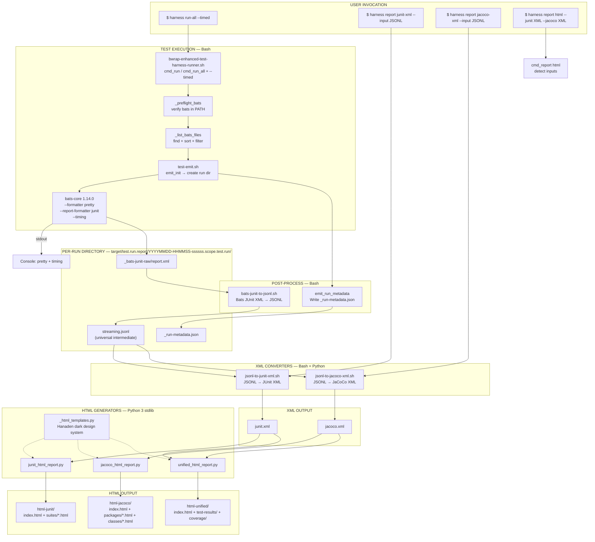
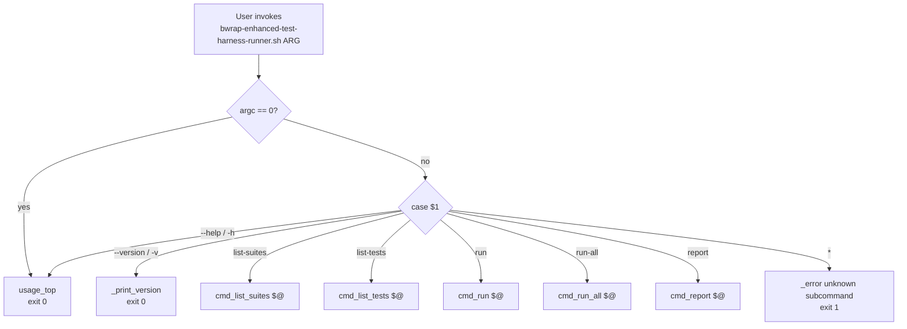
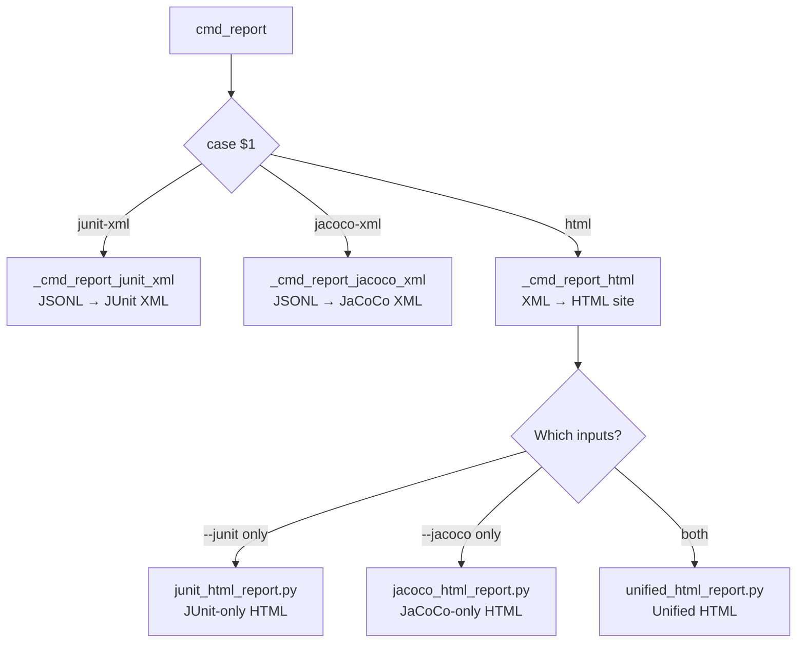
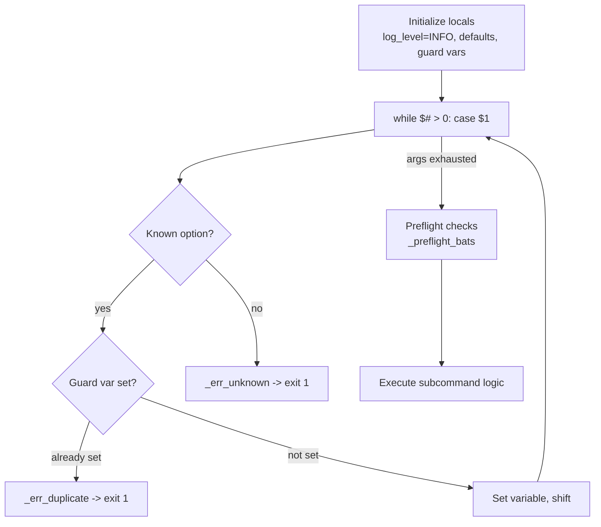
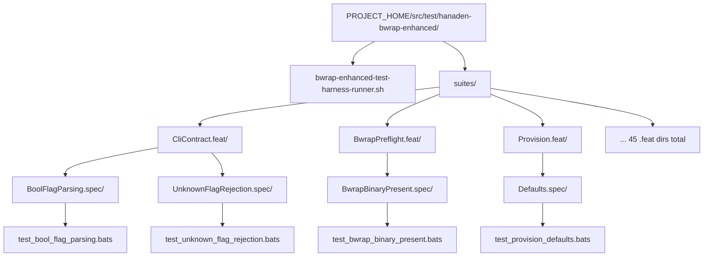
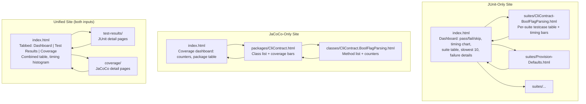

# TestHarnessSystem -- bwrap-enhanced Test Harness Complete System Design

> **Node:** `BwrapEnhanced2026.strat/FormalTestObservability.driv/UnifiedStructuredTestReporting.moti/TestHarnessSystem.sys/`
> **Version:** 0.1.0 (JSONL-first pipeline + reporting subsystem)
> **Status:** IMPLEMENTED

---

## TYPICAL INVOCATION

```bash
# ── ONE-LINER: Timed run + full report pipeline ──────────────────────
PROJECT_HOME/src/test/hanaden-bwrap-enhanced/bwrap-enhanced-test-harness-runner.sh \
    run-all --timed
# Then:
PROJECT_HOME/src/test/hanaden-bwrap-enhanced/bwrap-enhanced-test-harness-runner.sh \
    report junit-xml  --input target/test.run.report/<RUN_DIR>/streaming.jsonl
PROJECT_HOME/src/test/hanaden-bwrap-enhanced/bwrap-enhanced-test-harness-runner.sh \
    report jacoco-xml --input target/test.run.report/<RUN_DIR>/streaming.jsonl
PROJECT_HOME/src/test/hanaden-bwrap-enhanced/bwrap-enhanced-test-harness-runner.sh \
    report html --junit target/test.run.report/<RUN_DIR>/junit.xml \
                --jacoco target/test.run.report/<RUN_DIR>/jacoco.xml

# ── SHORTHAND (from PROJECT_HOME) ────────────────────────────────────
HARNESS=src/test/hanaden-bwrap-enhanced/bwrap-enhanced-test-harness-runner.sh

# Run tests with JSONL emission
$HARNESS run-all --timed

# Find the latest run directory
RUN_DIR=$(ls -1d target/test.run.report/*.test.run | tail -1)

# Generate JUnit + JaCoCo XML from JSONL
$HARNESS report junit-xml  --input "$RUN_DIR/streaming.jsonl"
$HARNESS report jacoco-xml --input "$RUN_DIR/streaming.jsonl"

# Generate unified HTML site
$HARNESS report html --junit "$RUN_DIR/junit.xml" --jacoco "$RUN_DIR/jacoco.xml"

# Open the report
xdg-open "$RUN_DIR/html-unified/index.html"
```

---

## 1. System Overview

The bwrap-enhanced test harness is a Bash-based test runner built on bats-core 1.14.0. It is the **sole supported way** to discover, execute, and report on the bwrap-enhanced test suite.

### Design Principles

1. **Single entry point.** All test operations go through one script: `bwrap-enhanced-test-harness-runner.sh`
2. **Subcommand dispatch.** Follows the git/podman/systemctl CLI pattern -- each subcommand owns its own options
3. **JSONL-first pipeline.** All test data flows through a universal JSONL intermediate format (`streaming.jsonl`), which is then post-processed into JUnit XML, JaCoCo XML, and HTML
4. **Timing-as-coverage.** Bash scripts lack traditional coverage tools; the harness maps .feat→package, .spec→class, @test→method, pass/fail→covered/missed to produce JaCoCo-compatible coverage XML
5. **Strict schemas.** Every data interchange format has a published, externally-validatable schema. Zero ad-hoc formats
6. **Zulu-timestamped retention.** Each run produces a self-contained directory: `YYYYMMDD-HHMMSS-ssssss.<scope>.test.run/`
7. **Ephemeral output.** All generated reports go to `PROJECT_HOME/target/` (`.gitignore`'d, never committed)
8. **Zero external dependencies.** Bash 5.2+, bats-core 1.14.0, jq, python3 (stdlib only) -- nothing to pip/npm install
9. **Air-gap capable.** HTML reports are fully self-contained (all CSS/JS inlined, no CDN)

### Tech Stack

| Tool | Version | Role |
|:---|:---|:---|
| Bash | 5.2+ | Harness runner, subcommand dispatch, discovery, JSONL emission |
| bats-core | 1.14.0 | Test execution, JUnit XML output, timing |
| jq | latest | JSON/JSONL construction and validation |
| Python 3 | 3.14+ | XML converters (JSONL→JUnit/JaCoCo), HTML report generation (stdlib only) |

---

## 2. Architecture Diagram



### Data Flow — Step by Step

```mermaid
sequenceDiagram
    actor User
    participant Harness as harness runner
    participant Emit as test-emit.sh
    participant Bats as bats-core 1.14.0
    participant Conv as bats-junit-to-jsonl.sh
    participant Disk as RUN_DIR/
    participant XMLC as jsonl-to-*-xml.sh
    participant Python as report-generators/*.py
    participant HTML as html-*/ output

    Note over User,HTML: PHASE 1: TEST EXECUTION + JSONL EMISSION

    User->>Harness: run-all --timed
    Harness->>Harness: _preflight_bats (verify bats)
    Harness->>Harness: _list_bats_files (discover)
    Harness->>Emit: source test-emit.sh; emit_init
    Emit->>Disk: mkdir YYYYMMDD-HHMMSS-ssssss.run-all.test.run/
    Harness->>Bats: bats --formatter pretty --report-formatter junit --timing --output RUN_DIR/_bats-junit-raw FILES
    Bats-->>User: stdout: pretty-formatted live results
    Bats-->>Disk: _bats-junit-raw/report.xml
    Harness->>Conv: bats-junit-to-jsonl.sh report.xml streaming.jsonl
    Conv-->>Disk: streaming.jsonl (JSONL records)
    Harness->>Emit: emit_run_metadata → _run-metadata.json
    Harness-->>User: JSONL written → RUN_DIR/streaming.jsonl

    Note over User,HTML: PHASE 2: XML CONVERSION

    User->>Harness: report junit-xml --input streaming.jsonl
    Harness->>XMLC: jsonl-to-junit-xml.sh streaming.jsonl
    XMLC-->>Disk: junit.xml

    User->>Harness: report jacoco-xml --input streaming.jsonl
    Harness->>XMLC: jsonl-to-jacoco-xml.sh streaming.jsonl
    XMLC-->>Disk: jacoco.xml

    Note over User,HTML: PHASE 3: HTML GENERATION

    User->>Harness: report html --junit junit.xml --jacoco jacoco.xml
    Harness->>Python: unified_html_report.py --junit X --jacoco Y
    Python->>Disk: read junit.xml + jacoco.xml
    Python->>HTML: write html-unified/ (index + sub-pages)
    Harness-->>User: report generated at RUN_DIR/html-unified/
```

---

## 3. Subcommand Dispatch Architecture

All user interaction enters through the main dispatch `case` block of `bwrap-enhanced-test-harness-runner.sh`.



### Report Sub-dispatch



Each `cmd_*` function follows the same internal pattern:



---

## 4. Log System Architecture

The harness implements a 6-level threshold-gated log system. All log output goes to **stderr**. Test results (bats output) go to **stdout**. The two streams never mix.

### Log Levels

| Name | Numeric | Constant | Semantics |
|:---|:---|:---|:---|
| `FATAL` | 100 | `$_LL_FATAL` | Unrecoverable error -> immediate `exit 1` |
| `ERROR` | 200 | `$_LL_ERROR` | Serious problem, but execution may continue |
| `WARN` | 300 | `$_LL_WARN` | Unexpected condition, non-fatal |
| `INFO` | 400 | `$_LL_INFO` | Normal operational messages (default) |
| `DEBUG` | 500 | `$_LL_DEBUG` | Detailed diagnostic output |
| `TRACE` | 600 | `$_LL_TRACE` | Very verbose step-by-step tracing |

### Threshold Gate

```
_log(threshold, current_level, label, message):
    if current_level >= threshold:
        printf '[%s] %s\n' label message >&2
```

A message is printed only when the **current log level** (set by `--log-level`) is **>=** the message's threshold. This means:
- `--log-level INFO` (400): shows FATAL, ERROR, WARN, INFO
- `--log-level DEBUG` (500): shows all above + DEBUG
- `--log-level FATAL` (100): shows only FATAL

### Log Functions

| Function | Threshold | Extra behavior |
|:---|:---|:---|
| `_fatal` | 100 | Prints then calls `exit 1` |
| `_error` | 200 | Prints only |
| `_warn` | 300 | Prints only |
| `_info` | 400 | Prints only |
| `_debug` | 500 | Prints only |
| `_trace` | 600 | Prints only |

### Level Resolution (`_resolve_log_level`)

Accepts either a **name** (`INFO`, `debug`, case-insensitive) or a **numeric value** (`100`, `400`, `600`). Invalid input -> `exit 1`.

---

## 5. Option Parsing Contract

Every subcommand follows these invariants:

### Duplicate Rejection

Each option has a guard variable (`_feat_set`, `_fmt_set`, etc.). If the same option is passed twice, the parser calls `_err_duplicate` -> `exit 1`.

```bash
_err_duplicate() { _error "$1" "${_HARNESS_NAME}: duplicate option: $2"; exit 1; }
```

### Unknown Option Rejection

Any unrecognized option triggers `_err_unknown` -> prints error + hint -> `exit 1`.

```bash
_err_unknown() { _error "$1" "${_HARNESS_NAME} $2: unknown option: $3"
                 _info  "$1" "Run: ${_HARNESS_NAME} $2 --help"
                 exit 1; }
```

> [!WARNING]
> **Exit Code Discrepancy (Tech Debt):** The usage help text for `run` and `run-all` documents exit code **3** for option parse errors, but the actual `_err_unknown` and `_err_duplicate` functions call `exit 1`. The IMPLEMENTATION exits 1. This document records the actual behavior.

### Preflight Checks

Before any test execution, `_preflight_bats()` verifies `bats` is in `$PATH`. If not found -> `_fatal` -> `exit 1`. On success, logs bats version at DEBUG level.

---

## 6. Suite Hierarchy and Discovery

### Directory Layout



### Naming Conventions

| Level | Pattern | Example | Meaning |
|:---|:---|:---|:---|
| Feature | `<Name>.feat/` | `CliContract.feat/` | Functional area under test |
| Spec | `<Name>.spec/` | `BoolFlagParsing.spec/` | Specific behavioral specification |
| Test file | `test_<name>.bats` | `test_bool_flag_parsing.bats` | Executable bats test file |
| Test case | `@test "<ID>: <description>"` | `@test "BOOL-NET-001: --net bare accepted"` | Atomic test with structured ID |

### Test ID Convention

```
<PREFIX>-<AREA>-<SEQ>: <human description>
```

- `PREFIX`: Short mnemonic for the spec (e.g., `BOOL`, `UNK-FLAG`, `DRY`, `PROV-DFLT`)
- `AREA`: Sub-area within the spec (e.g., `NET`, `ENV`, `AUDIO`)
- `SEQ`: 3-digit zero-padded sequence (e.g., `001`, `002`)

### Discovery Helpers

| Function | Signature | What it does |
|:---|:---|:---|
| `_list_bats_files` | `(feat_filter, spec_filter)` -> stdout | `find` at depth 3 under `suites/`, filtered by `*/FEAT.feat/SPEC.spec/*.bats`, sorted |
| `_list_feat_dirs` | `()` -> stdout | Lists `.feat` basenames (stems without suffix) |
| `_list_spec_dirs` | `(feat_stem)` -> stdout | Lists `.spec` basenames under a given `.feat` directory |
| `_count_tests` | `(bats_file)` -> stdout | `grep -c '^@test '` (returns 0 if none) |
| `_extract_test_names` | `(bats_file)` -> stdout | `grep '^@test '` then `sed` to strip `@test "..."` wrapper |
| `_extract_test_id` | `(test_name)` -> stdout | First whitespace-delimited token, colon stripped |

---

## 7. JSONL Streaming Schema — TestRunReportSchema.feat-0.0.1

The JSONL streaming format is the **universal intermediate representation** for all test data. Every record is a single JSON object on one line.

### Record Types

| Type | Emitted When | Key Fields |
|:---|:---|:---|
| `suite_started` | Before first test in a suite | `trace_id`, `suite_name`, `test_count`, `timestamp_unix_ms` |
| `test_case` | After each test completes | `trace_id`, `span_id`, `vector_id`, `description`, `feat`, `spec`, `status`, `duration_ms` |
| `coverage_record` | After suite finishes | `trace_id`, `feat`, `spec`, `methods_covered`, `methods_total`, `lines_covered`, `lines_total` |
| `suite_finished` | After all tests in suite | `trace_id`, `suite_name`, `tests_run`, `tests_passed`, `tests_failed`, `tests_skipped`, `total_duration_ms` |

### Status Values

| Status | Meaning |
|:---|:---|
| `PASS` | Test assertion passed |
| `FAIL` | Test assertion failed |
| `SKIP` | Test was skipped |
| `ERROR` | Setup/teardown error (not assertion) |

### Example Records

```jsonl
{"type":"suite_started","trace_id":"c0dcb49f321e9aa7bd37b747392e99db","suite_name":"test_bwrap_binary_present.bats","timestamp_unix_ms":1788228812856,"test_count":3}
{"type":"test_case","trace_id":"c0dcb49f321e9aa7bd37b747392e99db","span_id":"1cc4a7bd7a080232","vector_id":"PF-BIN-001","description":"PF-BIN-001: bwrap present on PATH","feat":"test_bwrap_binary_present","spec":"bats","status":"PASS","duration_ms":27,"timestamp_unix_ms":1788228812856}
{"type":"coverage_record","trace_id":"c0dcb49f321e9aa7bd37b747392e99db","feat":"test_bwrap_binary_present.bats","spec":"test_bwrap_binary_present.bats","methods_covered":3,"methods_total":3,"lines_covered":24,"lines_total":24}
{"type":"suite_finished","trace_id":"c0dcb49f321e9aa7bd37b747392e99db","suite_name":"test_bwrap_binary_present.bats","timestamp_unix_ms":1788228812856,"tests_run":3,"tests_passed":3,"tests_failed":0,"tests_skipped":0,"total_duration_ms":101}
```

### Timing-as-Coverage Mapping (Approved)

| JSONL Field | JaCoCo Mapping | Semantics |
|:---|:---|:---|
| `feat` | `<package name="">` | Functional area |
| `spec` | `<class name="">` | Behavioral specification |
| `vector_id` | `<method name="">` | Individual test vector |
| `status=PASS` | `counter covered=1 missed=0` | Test passed = method covered |
| `status=FAIL/ERROR/SKIP` | `counter covered=0 missed=1` | Test failed = method missed |

---

## 8. Per-Run Retention Model

### Directory Structure

```
PROJECT_HOME/target/test.run.report/
  20260901-021332-069238.run--feat-BwrapPreflight--spec-BwrapBinaryPresent.test.run/
    _bats-junit-raw/
      report.xml                    ← Raw bats JUnit XML
    _run-metadata.json              ← Run metadata (scope, filters, exit code)
    streaming.jsonl                 ← JSONL intermediate (universal format)
    junit.xml                       ← Generated from JSONL
    jacoco.xml                      ← Generated from JSONL
    html-junit/                     ← JUnit HTML site
      index.html
      suites/*.html
    html-jacoco/                    ← JaCoCo HTML site
      index.html
      packages/*.html
      classes/*.html
    html-unified/                   ← Unified HTML site
      index.html
      test-results/
        index.html
        suites/*.html
      coverage/
        index.html
        packages/*.html
        classes/*.html
```

### Directory Naming Convention

```
YYYYMMDD-HHMMSS-ssssss.<scope>.test.run/
```

Where `<scope>` is one of:
- `run-all` — Full test suite
- `run--feat-<Feat>` — Feature-scoped
- `run--feat-<Feat>--spec-<Spec>` — Feature + spec scoped

### Run Metadata (`_run-metadata.json`)

```json
{
  "timestamp": "2026-09-01T02:13:32.896Z",
  "hostname": "laptop-0000",
  "trace_id": "d9a65133164a9514ab1e555e1a62e1ee",
  "bats_version": "Bats 1.14.0",
  "harness_version": "0.2.0",
  "scope": "run--feat-BwrapPreflight--spec-BwrapBinaryPresent",
  "filters": "feat=BwrapPreflight,spec=BwrapBinaryPresent",
  "test_count": 1,
  "exit_code": 0,
  "run_dir": "/absolute/path/to/run-dir"
}
```

---

## 9. Subcommand Contracts

### 9.1 `list-suites`

Discover and display all feat/spec pairs.

```
USAGE:  bwrap-enhanced-test-harness-runner.sh list-suites [OPTIONS]

OPTIONS:
  -h, --help
  --feat     PATTERN       Filter by feat name (fnmatch glob, omit .feat suffix)
  --spec     PATTERN       Filter by spec name (fnmatch glob, omit .spec suffix)
  --populated              Show only suites that contain at least one .bats file
  --format   table|names   Output format (default: table)
  --log-level NAME|NUMBER  (default: INFO)

EXIT CODES:
  0  success
  1  option parse error (duplicate flag, unknown flag, bad --format value)
```

### 9.2 `list-tests`

List all `@test` cases with structured metadata.

```
USAGE:  bwrap-enhanced-test-harness-runner.sh list-tests [OPTIONS]

OPTIONS:
  -h, --help
  --feat     PATTERN
  --spec     PATTERN
  --format   table|ids
  --log-level NAME|NUMBER

EXIT CODES:
  0  success (even if 0 tests found)
  1  option parse error
```

### 9.3 `run`

Run tests matching filters.

```
USAGE:  bwrap-enhanced-test-harness-runner.sh run [OPTIONS]

OPTIONS:
  --feat     PATTERN       Run only suites in matching .feat dirs
  --spec     PATTERN       Run only .spec dirs matching this glob
  --filter   REGEX         Pass --filter REGEX to bats
  --format   pretty|tap|tap13|junit   Bats formatter (default: pretty)
  --timed                  Enable timing + JSONL emission to target/test.run.report/
  --log-level NAME|NUMBER
  -n, --dry-run

EXIT CODES:
  0  all tests passed
  1  >=1 test failed OR option parse error
  2  no .bats files matched
```

### 9.4 `run-all`

Run the entire test suite.

```
USAGE:  bwrap-enhanced-test-harness-runner.sh run-all [OPTIONS]

OPTIONS:
  --populated-only         Skip suites with no .bats files (default: true)
  --no-populated-only
  --format   pretty|tap|tap13|junit
  --timed                  Enable timing + JSONL emission
  --log-level NAME|NUMBER
  -n, --dry-run

EXIT CODES:
  0  all tests passed, OR no .bats files found
  1  >=1 test failed OR option parse error
```

### 9.5 `report` (NEW in v0.2.0)

Generate structured reports from JSONL streaming data.

```
USAGE:  bwrap-enhanced-test-harness-runner.sh report SUBCOMMAND [OPTIONS]

SUBCOMMANDS:
  junit-xml   --input JSONL     Convert JSONL → JUnit XML
  jacoco-xml  --input JSONL     Convert JSONL → JaCoCo XML
  html        [--junit XML] [--jacoco XML] [--output DIR]
              Generate HTML site. --junit for JUnit-only, --jacoco for
              JaCoCo-only, both for unified report.

EXIT CODES:
  0  report generated successfully
  1  option parse error or missing subcommand
  2  input file not found or invalid
```

---

## 10. JSONL Pipeline Components

### 10.1 test-emit.sh (Emitter Library)

**Path:** `src/lib/test-emit.sh`
**Sourced by:** harness runner (when `--timed` is active)
**Output:** JSONL records to FD 7 (not stdout, to avoid polluting bats output)

| Function | Purpose |
|:---|:---|
| `emit_init SCOPE PROJECT_HOME` | Create run directory, open FD 7, generate trace_id |
| `emit_suite_started NAME COUNT` | Emit `suite_started` record |
| `emit_test_case VECTOR_ID DESC FEAT SPEC STATUS DUR [ERR] [OUT]` | Emit `test_case` record |
| `emit_coverage_record FEAT SPEC M_COV M_TOT L_COV L_TOT` | Emit `coverage_record` record |
| `emit_suite_finished NAME RUN PASS FAIL SKIP DUR` | Emit `suite_finished` record |
| `emit_run_metadata BATS_VER HARNESS_VER SCOPE FILTERS COUNT EXIT` | Write `_run-metadata.json` |
| `emit_close` | Close FD 7 |

### 10.2 bats-junit-to-jsonl.sh (Converter)

**Path:** `src/lib/bats-junit-to-jsonl.sh`
**Input:** Bats-generated JUnit XML (`_bats-junit-raw/report.xml`)
**Output:** JSONL file with all 4 record types

Uses Python's `xml.etree.ElementTree` for reliable XML parsing. Generates trace/span IDs, derives coverage records per suite.

### 10.3 jsonl-to-junit-xml.sh (Converter)

**Path:** `src/lib/jsonl-to-junit-xml.sh`
**Input:** `streaming.jsonl`
**Output:** `junit.xml` — standard JUnit XML compatible with Jenkins, GitLab, etc.

Groups `test_case` records by feat/spec into `<testsuite>` elements. Maps JSONL fields to JUnit attributes. Pretty-printed XML.

### 10.4 jsonl-to-jacoco-xml.sh (Converter)

**Path:** `src/lib/jsonl-to-jacoco-xml.sh`
**Input:** `streaming.jsonl`
**Output:** `jacoco.xml` — DTD-compatible JaCoCo XML

Maps:
- `feat` → `<package>`
- `spec` → `<class>`
- `vector_id` → `<method>`
- `status=PASS` → `counter covered=1`
- `status!=PASS` → `counter missed=1`

Produces hierarchical counters at method/class/package/report levels. Includes `<sessioninfo>` with start/dump timestamps.

---

## 11. HTML Report Specifications

### 11.1 Shared Design System (`_html_templates.py`)

**Visual Identity:** Hanaden brand — dark mode, purple/indigo accents.

**CSS Variables (design tokens):**

```css
:root {
  --bg-primary:        #0f0f1a;      /* deep navy-black */
  --bg-secondary:      #1a1a2e;      /* dark panel */
  --bg-tertiary:       #16213e;      /* card background */
  --text-primary:      #e2e8f0;      /* main text */
  --text-secondary:    #94a3b8;      /* muted text */
  --accent-primary:    #7c3aed;      /* purple — Hanaden brand */
  --accent-secondary:  #6366f1;      /* indigo */
  --status-pass:       #22c55e;      /* green */
  --status-fail:       #ef4444;      /* red */
  --status-skip:       #f59e0b;      /* amber */
  --status-error:      #f97316;      /* orange */
  --coverage-high:     #22c55e;      /* >=80% */
  --coverage-medium:   #f59e0b;      /* 50-79% */
  --coverage-low:      #ef4444;      /* <50% */
  --font-family:       'Inter', system-ui, sans-serif;
  --font-mono:         'JetBrains Mono', 'Fira Code', monospace;
}
```

**Self-contained constraint:** All CSS/JS inlined in each HTML page via `<style>` and `<script>` blocks. No external `<link>` tags. No CDN dependencies. Tables support click-to-sort via inline JS.

**Reusable components provided:**

| Component | Function | Purpose |
|:---|:---|:---|
| `html_page()` | `title, body, breadcrumbs` | Complete self-contained HTML page |
| `status_badge()` | `status` | Colored PASS/FAIL/SKIP/ERROR badge |
| `progress_bar()` | `value, max` | Coverage/progress bar with color thresholds |
| `timing_bar()` | `duration, max` | Relative timing visualization |
| `stat_card()` | `value, label, class` | Dashboard statistic card |
| `health_badge()` | `passed, total, failed` | Overall health indicator |
| `svg_timing_histogram()` | `durations[]` | Inline SVG histogram of test timings |

### 11.2 HTML Site Navigation Map



### 11.3 JUnit-Only HTML Site

**Dashboard (`index.html`):**
- Health badge (healthy/warning/critical)
- Summary cards: Total / Passed / Failed / Skipped / Errors / Duration
- Timing distribution histogram (inline SVG)
- Per-suite summary table (sortable): Name | Tests | Pass | Fail | Skip | Time | Pass Rate
- Slowest 10 tests table: Name | Suite | Status | Time | Timing bar
- Failure details: expandable `<details>` blocks with full error output

**Suite detail pages (`suites/<Feat>-<Spec>.html`):**
- Breadcrumb: Home → Suite Name
- Suite summary stats
- Testcase table (sortable): Status | Test | Class | Time | Timing bar
- Failure/error details with full output

### 11.4 JaCoCo-Only HTML Site

**Dashboard (`index.html`):**
- Session info: run ID, start time, duration
- Coverage stat cards: Method %, Class %, Line %
- Overall coverage bar
- Package breakdown table (sortable): Name | Method Coverage | Methods | Classes | Lines

**Package pages (`packages/<Name>.html`):**
- Package coverage stats
- Class table: Name | Source File | Coverage | Methods | Total Methods

**Class pages (`classes/<Name>.html`):**
- Method-level coverage stats
- Methods table: Status (PASS/FAIL badge) | Method | Desc | Line

### 11.5 Unified HTML Site

**Unified dashboard (`index.html`):**
- Health badge
- Tab navigation: Dashboard | Test Results | Coverage
- Combined stats: test counts + coverage percentages
- Timing distribution histogram
- Combined table: Suite | Tests | Pass Rate | Time | Coverage
- Failure summary (first 10, link to full list)

**Sub-views:**
- `test-results/index.html` — Suite table with tab navigation
- `test-results/suites/*.html` — Per-suite detail pages
- `coverage/index.html` — Package table with tab navigation
- `coverage/packages/*.html` — Package detail pages
- `coverage/classes/*.html` — Class detail pages

---

## 12. Complete File Map

### Existing Files (Modified)

| Path | Changes |
|:---|:---|
| `src/test/.../bwrap-enhanced-test-harness-runner.sh` | v0.1.0→v0.2.0: Add `_PROJECT_HOME`, `_LIB_DIR` constants. Add `--timed` to `cmd_run`/`cmd_run_all`. Add `cmd_report` with sub-dispatch. Add `report` to main dispatch. |

### New Files — JSONL Pipeline

| Path | Responsibility | Language |
|:---|:---|:---|
| `src/lib/test-emit.sh` | JSONL event emitter library (sourced, not invoked) | Bash |
| `src/lib/bats-junit-to-jsonl.sh` | Bats JUnit XML → JSONL converter | Bash + Python |
| `src/lib/jsonl-to-junit-xml.sh` | JSONL → JUnit XML converter | Bash + Python |
| `src/lib/jsonl-to-jacoco-xml.sh` | JSONL → JaCoCo XML converter | Bash + Python |

### New Files — HTML Report Generators

| Path | Responsibility | Language |
|:---|:---|:---|
| `src/lib/report-generators/__init__.py` | Python package marker | Python |
| `src/lib/report-generators/_html_templates.py` | Shared Hanaden dark CSS/JS design system | Python |
| `src/lib/report-generators/junit_html_report.py` | JUnit XML → HTML site | Python |
| `src/lib/report-generators/jacoco_html_report.py` | JaCoCo XML → HTML site | Python |
| `src/lib/report-generators/unified_html_report.py` | Unified HTML site (JUnit + JaCoCo) | Python |

### Generated Output (Ephemeral, .gitignore'd)

```
PROJECT_HOME/target/
  test.run.report/
    YYYYMMDD-HHMMSS-ssssss.<scope>.test.run/
      _bats-junit-raw/report.xml     ← Raw bats JUnit XML
      _run-metadata.json             ← Run metadata
      streaming.jsonl                ← JSONL intermediate
      junit.xml                      ← Generated JUnit XML
      jacoco.xml                     ← Generated JaCoCo XML
      html-junit/                    ← JUnit HTML site
      html-jacoco/                   ← JaCoCo HTML site
      html-unified/                  ← Unified HTML site
```

---

## 13. Schema References

### 13.1 JUnit XML

| Property | Value |
|:---|:---|
| **Producer** | `jsonl-to-junit-xml.sh` (from JSONL), bats-core 1.14.0 (raw) |
| **Consumer** | `junit_html_report.py`, `unified_html_report.py`, external CI tools |
| **Authority** | De facto standard (testmoapp/junitxml) |
| **Validation** | `xmllint --noout <file>` |

### 13.2 JaCoCo XML

| Property | Value |
|:---|:---|
| **Producer** | `jsonl-to-jacoco-xml.sh` (from JSONL, timing-as-coverage) |
| **Consumer** | `jacoco_html_report.py`, `unified_html_report.py` |
| **Authority** | Official DTD: jacoco.org/jacoco/trunk/coverage/report.dtd |
| **Validation** | `xmllint --dtdvalid report.dtd <file>` |

### 13.3 JSONL Streaming Events

| Property | Value |
|:---|:---|
| **Producer** | `bats-junit-to-jsonl.sh` (post-processing bats JUnit XML) |
| **Consumer** | `jsonl-to-junit-xml.sh`, `jsonl-to-jacoco-xml.sh` |
| **Authority** | `TestRunReportSchema.feat-0.0.1` |
| **Record types** | `suite_started`, `test_case`, `coverage_record`, `suite_finished` |

---

## 14. Open Items and Future Extensions

| Item | Status | Notes |
|:---|:---|:---|
| Real-time JSONL emission during test execution | **Future** | Currently JSONL is generated by post-processing bats JUnit XML. A future version could emit JSONL records in real-time via bats hooks |
| `kcov` integration for Bash coverage | **Future** | Would produce real JaCoCo XML with line-level coverage data |
| Report retention/cleanup | **User-managed** | No automatic cleanup — user decides when to delete `target/` |
| Multi-run trend analysis | **Future** | Compare HTML reports across runs — requires storing historical data |
| CI integration (Jenkins/GitLab) | **Ready** | JUnit XML already consumable; HTML reports deployable as artifacts |
| Exit code 3 for option parse errors | **Bug/Tech Debt** | Usage text documents exit 3 but `_err_unknown`/`_err_duplicate` call exit 1 |
| Better feat/spec parsing from bats classname | **Known Limitation** | Bats uses filename as classname; feat/spec derivation is approximate |
