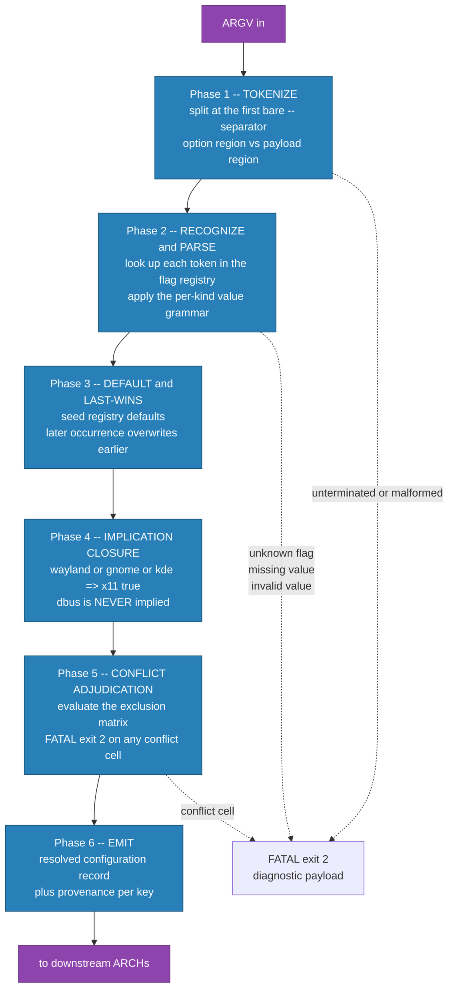
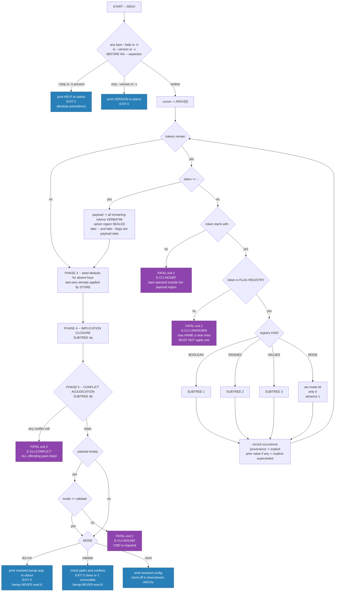
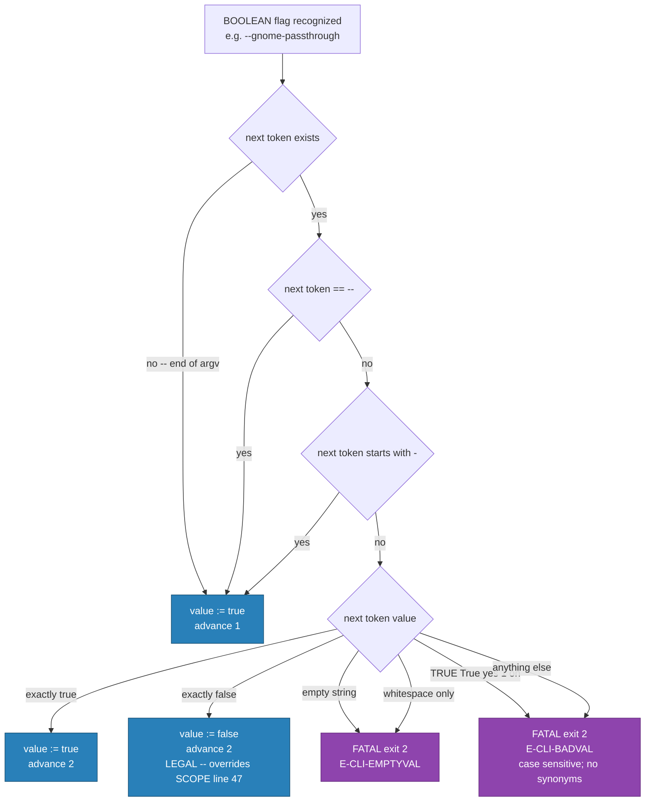
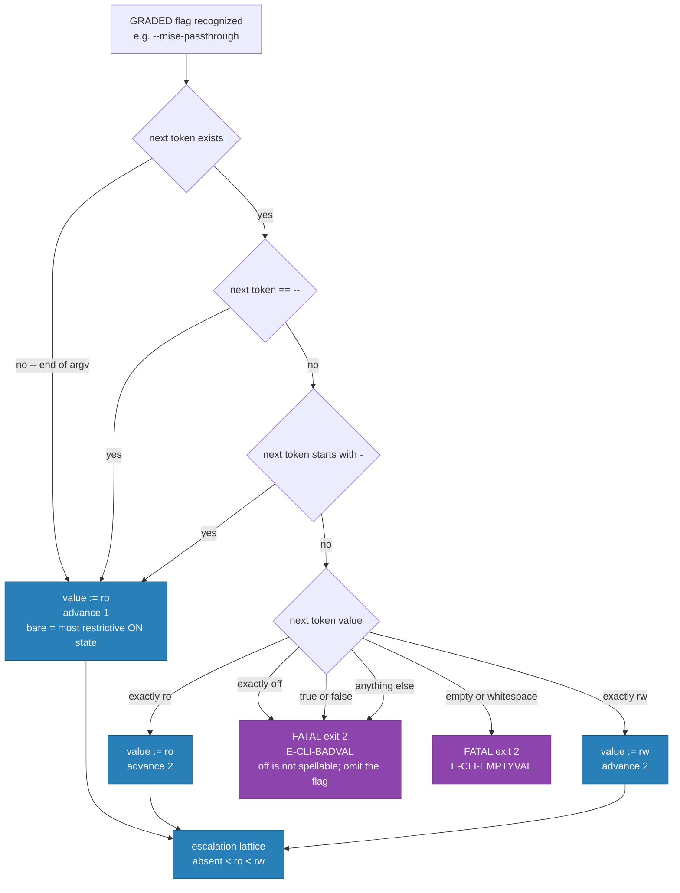
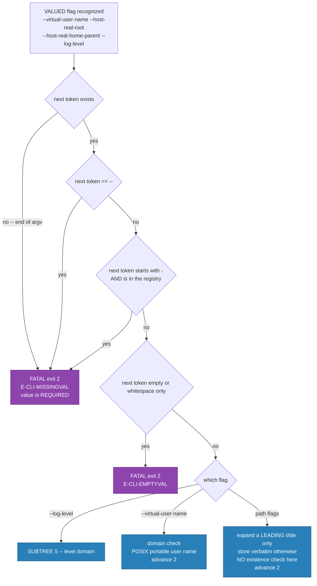
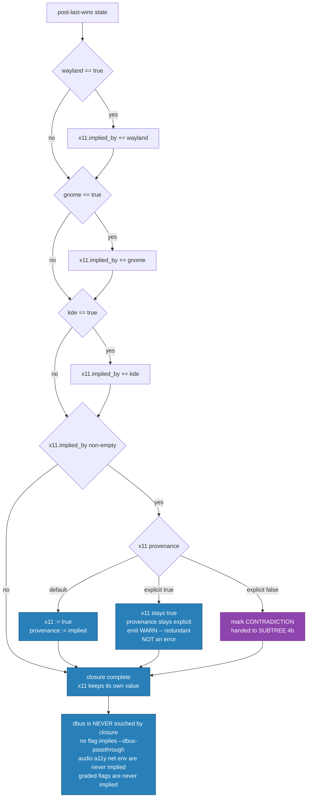
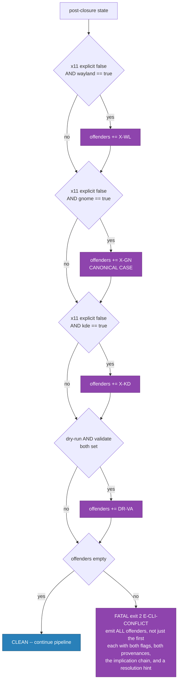
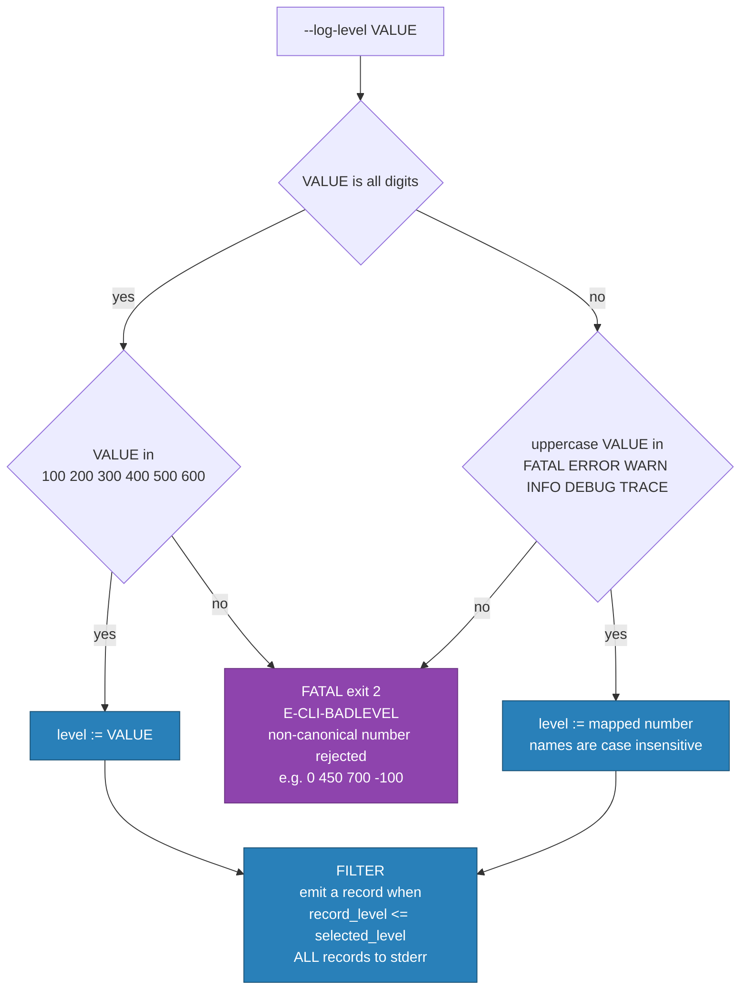

<!-- (c) 2026-* Frederick Bloom -- CliContractEngine.arch-0.3.0.md -- Hanaden AI -->
---
filename-id:   20260830-174727-854081-7f11-82a9-2e6933a1791c-CliContractEngine.arch-0.3.0
node-type:     ARCH
layer:         3
version:       0.3.0
status:        Active
author:        Frederick Bloom
copyright:     (c) 2026-* Frederick Bloom
parent-slug:   NamespaceIsolatedSandbox.moti
parent-filename-id: TBD-RECONCILE
description: >
  The CLI contract engine owns the complete user-facing invocation surface of
  bwrap-enhanced.sh v0.3.0: argument tokenization, per-kind value grammars,
  repeated-flag resolution, the implication closure, the exhaustive mutual
  exclusion matrix, diagnostic payload content, exit-code mapping, the verbatim
  --help and --version text, --log-level parsing and filtering, and the two
  non-executing modes --dry-run and --validate. It decides whether an
  invocation is LEGAL and what the RESOLVED CONFIGURATION is. It does not
  decide what any flag mounts, binds, or sets at bwrap runtime.
---

# ARCH -- CliContractEngine (v0.3.0)

## 1. Rationale

`bwrap-enhanced.sh` exists to jail an untrusted agent. The Immutable Principle
(`CONSTITUTION.md`, restated in `AGENTS.md`) requires that the jailer design and
provision the jail BEFORE execution, from OUTSIDE, and that the prisoner never
participate in building its own cell. The command line is the entire aperture
through which the jailer expresses its intent. Every subsequent security
property in this tree -- the `/home` single-entry invariant, the uid=gid=8888
mapping, the mount ordering -- is downstream of a *resolved configuration*
record produced here.

That makes the CLI contract a security-critical component, not an ergonomic
one. Three concrete failure classes justify a dedicated ARCH:

1. **Silent misinterpretation.** If `--x11-passthrough false --gnome-passthrough
   true` resolves to *some* answer instead of being rejected, the operator's
   stated intent ("no X11") and the tool's behavior ("X11 on, because GNOME
   implied it") diverge without anyone being told. A jailer that silently
   widens the jail is worse than one that refuses to start.
2. **Contract drift.** `SCOPE-very-narrow.md` section 4 makes `--help`
   conformance the FIRST test in the suite. That is only meaningful if the help
   text is a *contract artifact* with an authoritative source, rather than a
   string that drifts away from the parser. This ARCH declares one flag
   registry and requires help, contract table and parser to be provably derived
   from it.
3. **Undiagnosable rejection.** A FATAL that prints "bad arguments" forces the
   operator to guess. Section 6.9 of the working context mandates debug-level
   diagnostics on FATAL and ERROR; the diagnostic payload is therefore part of
   the contract and is spec'd, not left to implementation taste.

The boundary is deliberately narrow and it is a *trust* boundary: everything
this ARCH emits is data (a resolved configuration record plus an exit code).
It performs no mounts, spawns no processes, and touches the filesystem only in
`--validate` mode, where it reads path existence and never writes. That
narrowness is what makes the whole surface testable at tiers
`pure-function` and `argv-capture`, with no dependence on working user
namespaces -- which this development host does not have.

## 2. Design

### 2.1 The resolution pipeline

Resolution is a fixed, ordered, six-phase pipeline. The order is normative:
conflict detection MUST see the post-implication state, and implications MUST
see the post-last-wins state, or the canonical contradiction
`--x11-passthrough false --gnome-passthrough true` cannot be detected reliably.



Terminal modes short-circuit the pipeline. `--help` and `--version` are
recognized in Phase 2 and act immediately with absolute precedence, because a
user who cannot form a legal command line must still be able to read the
contract. `--dry-run` and `--validate` run the pipeline to completion and then
replace the execution step; they never bypass Phase 5.

### 2.2 What this ARCH owns and does not own

| Concern | Owner |
| ------- | ----- |
| Is this token a known flag? | THIS ARCH |
| Is this value legal for this flag's kind? | THIS ARCH |
| What is the effective value after repeats and implications? | THIS ARCH |
| Is this combination self-contradictory? | THIS ARCH |
| What exit code and what diagnostic text? | THIS ARCH |
| The verbatim `--help` and `--version` output | THIS ARCH |
| `--log-level` parsing and record suppression | THIS ARCH |
| What `--x11-passthrough true` actually binds | `PassthroughResolutionEngine.arch` |
| Whether the virtual root may be adopted or must be created | `VirtualRootLifecycleEngine.arch` |
| Mount ordering and the `/home` single-entry invariant | `VfsMountEngine.arch` |
| uid/gid mapping and synthetic identity files | `SandboxIdentityEngine.arch` |
| Signal forwarding and exit-status propagation of CMD | `ProcessLifecycleEngine.arch` |
| Host tool and kernel prerequisites | `HostPreflightEngine.arch` |

One boundary needs stating explicitly because it looks like a conflict but is
not. Working context section 6.1 defines a three-way provisioning gate whose
FATAL outcomes depend on whether the host root directory *exists*. That is
path-state adjudication and belongs to `VirtualRootLifecycleEngine.arch`. This
ARCH owns only the *flag*: its name, its aliases, and its boolean parse. In
`--validate` mode this ARCH invokes the downstream path check and maps its
verdict onto an exit code, but it does not reimplement the gate.

### 2.3 Internal structure and FEAT children

```mermaid
flowchart TB
    ARCH["CliContractEngine.arch"]

    subgraph LEX["Family A -- LEXICAL LAYER<br/>token to typed value"]
        F01["FlagInventoryContract.feat"]
        F02["BooleanFlagParsing.feat"]
        F03["GradedFlagParsing.feat"]
        F04["ValuedFlagParsing.feat"]
        F05["SeparatorAndPayloadForwarding.feat"]
        F06["UnknownFlagDiagnostics.feat"]
    end

    subgraph SEM["Family B -- SEMANTIC LAYER<br/>typed values to resolved config"]
        F07["RepeatedFlagResolution.feat"]
        F08["ImplicationResolution.feat"]
        F09["MutualExclusionMatrix.feat"]
        F10["ResolutionPipelineOrder.feat"]
    end

    subgraph SURF["Family C -- CONTRACT SURFACE<br/>what the operator can read"]
        F11["HelpTextContract.feat"]
        F12["VersionOutputContract.feat"]
        F13["ProvisionFlagAliasContract.feat"]
    end

    subgraph DIAG["Family D -- MODES, LOGGING, EXIT<br/>observable outcomes"]
        F14["LogLevelParsing.feat"]
        F15["ExitCodeContract.feat"]
        F16["ConflictDiagnosticPayload.feat"]
        F17["DryRunMode.feat"]
        F18["ValidateMode.feat"]
    end

    ARCH --> LEX
    ARCH --> SEM
    ARCH --> SURF
    ARCH --> DIAG

    F01 -.->|"registry is the single source<br/>for every other FEAT"| F11
    F01 -.-> F02
    F01 -.-> F03
    F01 -.-> F04
    F08 -.->|"post-closure state"| F09
    F09 -.->|"conflict verdict"| F16
    F16 -.-> F15

    classDef arch fill:#8e44ad,stroke:#6c3483,color:#fff
    classDef feat fill:#2980b9,stroke:#1a5276,color:#fff
    class ARCH arch
    class F01,F02,F03,F04,F05,F06,F07,F08,F09,F10,F11,F12,F13,F14,F15,F16,F17,F18 feat
```



**On sub-grouping (working context section 5.5 asks for a decision and a
justification).** Eighteen FEATs is a lot for one ARCH, and the four families
above are real: Family A converts tokens to typed values and cannot see
cross-flag state; Family B operates only on typed values and never on tokens;
Family C is output text derived from the registry; Family D is observable
outcome. I nevertheless kept a **flat FEAT list** rather than introducing
structure, for two reasons.

First, the Hanaden document taxonomy has no FEAT-group node. The only available
grouping mechanism is an additional `.moti` or `.arch` node, and both would sit
*outside* `CliContractEngine.arch/` -- creating either would violate working
context section 4.1, which makes my subtree exclusively mine and forbids
writing outside it. Splitting into, say, `CliLexicalEngine.arch` and
`CliSemanticEngine.arch` is a defensible alternative shape, but it is not mine
to create unilaterally. It is recorded as an open question in section 10.

Second, the families are not independently trustable. A parsing bug in Family A
produces exactly the same end-user harm as a conflict-detection bug in Family
B: a jail wider than the operator asked for. The trust surface is single, so a
single ARCH with a documented four-family internal partition is the honest
representation. The families are expressed in the diagram and in section 6 so
review can proceed family by family without inventing tree nodes.

### 2.4 Interfaces and contracts owned

**Inbound.** `ARGV` as received by the script, exactly, including empty-string
arguments and arguments containing whitespace.

**Outbound -- the resolved configuration record.** A flat key/value set, one
key per registry entry, plus a payload vector and a per-key provenance tag. The
provenance tag is required, not decorative: `MutualExclusionMatrix` needs to
distinguish "x11 is true because you asked" from "x11 is true because GNOME
implied it", and `ConflictDiagnosticPayload` must tell the operator which of
their flags caused an implication.

| Provenance tag | Meaning |
| -------------- | ------- |
| `default` | No occurrence on the command line; registry default applied |
| `explicit` | Set by an occurrence on the command line |
| `explicit-superseded` | An earlier occurrence existed and was overwritten by last-wins |
| `implied` | Set by the Phase 4 closure; the implying flag is recorded alongside |

**Outbound -- exit code.** `0` success, `1` ERROR, `2` FATAL. Section 5 below.

**Outbound -- diagnostic stream.** All log records and all diagnostics go to
`stderr` (`SCOPE-very-narrow.md:70`). Requested informational output --
`--help`, `--version`, and the `--dry-run` resolved argv -- goes to `stdout`,
because a user who asked for it is consuming it, possibly through a pipe.

### 2.5 Threat surface owned by this ARCH

| # | Threat | Mechanism | Mitigating FEAT |
| - | ------ | --------- | --------------- |
| T1 | **Silent jail widening.** An operator states a restriction that a second flag silently overrides. | Contradiction accepted instead of rejected | `MutualExclusionMatrix`, `ImplicationResolution` |
| T2 | **Contract lie.** `--help` advertises a default or qualifier the parser does not implement, so the operator reasons from false information. | Help text drifts from the registry | `FlagInventoryContract`, `HelpTextContract` |
| T3 | **Flag injection through the payload.** A `CMD` argument that looks like an option is consumed as an option, changing the jail. | Payload region not sealed at `--` | `SeparatorAndPayloadForwarding` |
| T4 | **Typo escalation.** `--dbus-pasthrough` is ignored as unknown-but-harmless, or worse fuzzy-matched to a real flag and silently enables a portal escape. | Lenient unknown-flag handling; fuzzy auto-correction | `UnknownFlagDiagnostics` |
| T5 | **Legacy-name confusion.** A v0.2.x invocation (`--enable-x11`, `--share-net`) is accepted or ignored, so the operator believes a restriction is in force that was never parsed. | Silent acceptance of retired names | `UnknownFlagDiagnostics`, `ProvisionFlagAliasContract` |
| T6 | **Diagnostic blindness.** A FATAL emits no actionable payload, so the operator retries with a guess and eventually reaches for a wider flag set. | Missing diagnostics | `ConflictDiagnosticPayload` |
| T7 | **Exit-code misreport.** A wrapper or CI job treats a FATAL as success, or as a retryable ERROR, and launches an unjailed process. | Wrong or inconsistent exit mapping | `ExitCodeContract` |
| T8 | **Dry-run side effects.** `--dry-run` or `--validate` actually execs `bwrap` or mutates the host, defeating the purpose of a rehearsal. | Mode not short-circuiting | `DryRunMode`, `ValidateMode` |
| T9 | **Log suppression of security records.** A permissive `--log-level` parse suppresses FATAL, hiding a refusal. | Filter allows a level below FATAL | `LogLevelParsing` |

T4 deserves a note because it drove a design decision. Fuzzy auto-correction
("did you mean, applying it for you") is FORBIDDEN in this engine. A near-miss
may be *named* in the diagnostic as a suggestion, but MUST NOT be applied. The
asymmetry is deliberate: the cost of refusing a typo is one retry; the cost of
guessing wrong is a wider jail.

## 3. THE FLAG RESOLUTION DECISION TREE

This is the headline deliverable. It must be complete enough to *generate* the
conflict tests, not to illustrate them.

**Decision on diagram count: one master tree PLUS four subtrees.** A single
diagram is not sufficient, and the reason is structural rather than aesthetic.
The tree has two dimensions that do not compose into one acyclic graph: a
*per-token* dimension (which repeats once per argv element) and a *whole-config*
dimension (which runs once, after all tokens). Splicing the per-token value
grammar inline into the whole-config adjudication would require either
duplicating the value-grammar subgraph 20 times, once per registry entry, or
drawing a back edge from the end of adjudication to the token loop -- which
would misrepresent the pipeline as re-entrant when Phase 3 to Phase 6 run
exactly once. Either rendering would be *wrong*, not merely large.

The split is therefore by dimension, and it is complete in this sense: every
argv token is fully decided by MASTER plus exactly one of SUBTREE 1 to 3
according to its registry kind, and every resolved configuration is fully
adjudicated by SUBTREE 4. There is no path through the contract that is not
covered by exactly one traversal.

### 3.1 MASTER -- per-invocation control flow



### 3.2 SUBTREE 1 -- BOOLEAN value grammar



The "next token starts with `-`" branch is load-bearing and is the reason a
bare boolean flag can never swallow a following flag. It also means
`--net-passthrough --gnome-passthrough` resolves both to `true`, which is the
only sane reading.

### 3.3 SUBTREE 2 -- GRADED value grammar



### 3.4 SUBTREE 3 -- VALUED value grammar



Note the asymmetry against SUBTREE 1 and 2: for a VALUED flag the guard is
"starts with `-` AND is a registered flag", not merely "starts with `-`". This
lets `--virtual-user-name -weird-but-legal` fail loudly as a *missing value*
only when the next token is a real flag, while still permitting a path value
that begins with a dash to be rejected as an unknown flag rather than silently
consumed. Both readings are defensible; this one is chosen because it never
consumes a token that the operator meant as a flag.

### 3.5 SUBTREE 4a -- implication closure



The closure has depth exactly one. No implied key is itself an implier, so a
single pass reaches a fixed point and a second pass changes nothing. That
idempotence is asserted by a spec rather than assumed, because a future flag
that implies `--wayland-passthrough` would silently break it.

### 3.6 SUBTREE 4b -- conflict adjudication



### 3.7 SUBTREE 5 -- log level domain



FATAL is numerically 100 and the minimum selectable level is 100, so no legal
`--log-level` value can ever suppress a FATAL record. That closes threat T9 by
construction, and a spec asserts it at every one of the six levels.

## 4. THE COMPLETE CLI CONTRACT TABLE (v0.3.0, final)

`ARITY` is the number of argv tokens consumed including the flag itself; `1/2`
means the value token is optional.

| Flag | Kind | Arity | Domain | Default | Bare means | Implies | Notes |
| ---- | ---- | ----- | ------ | ------- | ---------- | ------- | ----- |
| `--provision-virtual-root-skeleton` | BOOLEAN | 1/2 | `true` `false` | `false` | `true` | -- | Alias `--provision`. Not idempotent |
| `--provision` | ALIAS | 1/2 | as above | -- | `true` | -- | Exact alias, not a separate key |
| `--net-passthrough` | BOOLEAN | 1/2 | `true` `false` | `false` | `true` | -- | -- |
| `--env-passthrough` | BOOLEAN | 1/2 | `true` `false` | `false` | `true` | -- | -- |
| `--x11-passthrough` | BOOLEAN | 1/2 | `true` `false` | `false` | `true` | -- | Implied `true` by wayland, gnome, kde |
| `--wayland-passthrough` | BOOLEAN | 1/2 | `true` `false` | `false` | `true` | `x11=true` | -- |
| `--gnome-passthrough` | BOOLEAN | 1/2 | `true` `false` | `false` | `true` | `x11=true` | -- |
| `--kde-passthrough` | BOOLEAN | 1/2 | `true` `false` | `false` | `true` | `x11=true` | -- |
| `--audio-passthrough` | BOOLEAN | 1/2 | `true` `false` | `false` | `true` | -- | PipeWire plus PulseAudio |
| `--a11y-passthrough` | BOOLEAN | 1/2 | `true` `false` | `false` | `true` | -- | -- |
| `--dbus-passthrough` | BOOLEAN | 1/2 | `true` `false` | `false` | `true` | -- | NEVER implied. Portal escape risk |
| `--mise-passthrough` | GRADED | 1/2 | `ro` `rw` | absent/off | `ro` | -- | -- |
| `--local-bin-passthrough` | GRADED | 1/2 | `ro` `rw` | absent/off | `ro` | -- | `~/.local/bin` |
| `--target-passthrough` | GRADED | 1/2 | `ro` `rw` | absent/off | `ro` | -- | NEW in 0.3.0; build target plus test tree |
| `--virtual-user-name` | VALUED | 2 | POSIX portable name | `sandbox_user` | n/a | -- | -- |
| `--host-real-root` | VALUED | 2 | PATH | `~/virtual-roots/${PROJECT_NAME}` | n/a | -- | Leading tilde expanded |
| `--host-real-home-parent` | VALUED | 2 | PATH | `${HOST_REAL_ROOT}/home` | n/a | -- | DERIVED default. Leading tilde expanded |
| `--log-level` | VALUED | 2 | name or canonical number | `INFO` / `400` | n/a | -- | Names case insensitive |
| `--dry-run` | MODE | 1 | -- | off | n/a | -- | Excludes `--validate` |
| `--validate` | MODE | 1 | -- | off | n/a | -- | NEW in 0.3.0. Excludes `--dry-run` |
| `--help`, `-h` | MODE | 1 | -- | off | n/a | -- | Absolute precedence, stdout, exit 0 |
| `--version`, `-v` | MODE | 1 | -- | off | n/a | -- | Precedence below `--help` |
| `--` | SEPARATOR | 1 | -- | -- | n/a | -- | Seals the option region |
| `CMD [ARG...]` | PAYLOAD | rest | any | -- | n/a | -- | Forwarded verbatim |

Deliberate absences, so that "no extras" is checkable: there is NO flag for the
sandbox uid or gid (fixed at 8888 per working context 6.4), NO
`--unshare-user-try` selector (the `-try` variant is forbidden outright), and NO
bwrap-native passthrough flags (`--ro-bind`, `--bind`, `--setenv`, `--tmpfs`
etc.) even though v0.2.x accepted them at `bwrap-enhanced.sh:784-795`. Retiring
that escape hatch is a deliberate 0.3.0 breaking change: a caller able to inject
arbitrary bwrap arguments can bind host `/home` and defeat the primary security
invariant of working context 6.3, which makes it a prisoner-builds-its-own-cell
violation of the Immutable Principle.

## 5. EXIT CODE CONTRACT

| Code | Class | When |
| ---- | ----- | ---- |
| `0` | success | Normal completion; `--help`; `--version`; `--dry-run`; `--validate` with no findings |
| `1` | ERROR | Grave but user-correctable and detected without a malformed command line. In this ARCH: `--validate` reporting a missing required host path |
| `2` | FATAL | Malformed or self-contradictory invocation. Every `E-CLI-*` code in section 7 |

The dividing line: a FATAL means the *stated intent cannot be interpreted*, so
no jail can be built from it. An ERROR means the intent is clear but the *world*
does not currently satisfy it. Unknown flags, missing values, bad values,
non-canonical log levels, a missing `CMD`, and every conflict cell are all
FATAL exit 2, because in each case the resolved configuration does not exist.

**`SCOPE-very-narrow.md:52` contradiction, flagged as required.** That line
states that a missing required host path raises `[FATAL]` and exits `1`. Section
1a of the same document (`SCOPE-very-narrow.md:63`) binds `[FATAL]` to exit `2`.
The two cannot both hold. Resolution adopted here, per working context 6.9: the
`[FATAL]`-to-`2` mapping in section 1a is authoritative, and line 52 is a bug.
Draft correction in section 9.

## 6. DECOMPOSITION -- the FEAT children and why each exists

| # | FEAT | Why it exists as its own FEAT | Specs |
| - | ---- | ----------------------------- | ----- |
| 1 | `FlagInventoryContract` | Declares the registry that every other FEAT resolves against. Without one authoritative inventory, "no extras in `--help`" is unfalsifiable. | 8 |
| 2 | `BooleanFlagParsing` | One value grammar with its own bare form, its own legal `false`, and its own rejection set. SUBTREE 1. | 11 |
| 3 | `GradedFlagParsing` | A different grammar and a different lattice; `ro`/`rw` are not booleans and the bare form means something else. SUBTREE 2. | 11 |
| 4 | `ValuedFlagParsing` | Mandatory-value semantics: the only kind that can fail for *absence* of a value. SUBTREE 3. | 10 |
| 5 | `SeparatorAndPayloadForwarding` | The security seal at `--`. Threat T3 lives entirely here and nowhere else. | 10 |
| 6 | `UnknownFlagDiagnostics` | Rejection of the unrecognized, including retired v0.2.x names. Threats T4 and T5. | 9 |
| 7 | `RepeatedFlagResolution` | Last-wins is a cross-token rule that no single-token grammar can express. | 7 |
| 8 | `ImplicationResolution` | The closure, its provenance, its idempotence, and the crucial negatives. SUBTREE 4a. | 10 |
| 9 | `MutualExclusionMatrix` | The exhaustive matrix, positive cells AND negative cells. The largest single trust surface. SUBTREE 4b. | 16 |
| 10 | `ResolutionPipelineOrder` | Phase ordering and determinism are properties of the pipeline, not of any phase. | 7 |
| 11 | `HelpTextContract` | The verbatim text is a contract artifact and `SCOPE-very-narrow.md` section 4 makes it the FIRST test. | 12 |
| 12 | `VersionOutputContract` | Small but independently observable, with its own precedence rule. | 6 |
| 13 | `ProvisionFlagAliasContract` | The rename from `--provision-virtual-root-if-needed` needs its own acceptance and rejection assertions. | 6 |
| 14 | `LogLevelParsing` | Two input domains, six levels, a filter predicate and threat T9. SUBTREE 5. | 14 |
| 15 | `ExitCodeContract` | The single mapping every other FEAT's failure asserts against, plus the SCOPE line 52 defect. | 7 |
| 16 | `ConflictDiagnosticPayload` | Payload *content* is separable from conflict *detection*, and is separately falsifiable. | 8 |
| 17 | `DryRunMode` | A terminal mode with a positive output obligation and a negative side-effect obligation. | 9 |
| 18 | `ValidateMode` | The only place this ARCH touches the filesystem, and the only place it exits 1. | 9 |

Total: 18 FEATs, 180 specs. These counts are outputs of the decomposition, not
targets. `MutualExclusionMatrix` is largest because the exhaustive negative
proof requires one assertion per non-conflicting cell family;
`VersionOutputContract` is smallest because the behavior genuinely is small, and
padding it would be a section 5.5 violation in the other direction.

## 7. DIAGNOSTIC CODE REGISTRY

Every FATAL emitted by this ARCH carries a stable code. Codes are contract, so
tests assert them.

| Code | Meaning | Exit |
| ---- | ------- | ---- |
| `E-CLI-UNKNOWN` | Token starts with `-` and is not in the registry | 2 |
| `E-CLI-RETIRED` | Token is a retired v0.2.x flag name | 2 |
| `E-CLI-MISSINGVAL` | VALUED flag reached end of argv, `--`, or a registered flag | 2 |
| `E-CLI-EMPTYVAL` | Value token is empty or whitespace only | 2 |
| `E-CLI-BADVAL` | Value outside the flag's domain | 2 |
| `E-CLI-BADLEVEL` | `--log-level` value is neither a canonical name nor a canonical number | 2 |
| `E-CLI-NOSEP` | Bare operand in the option region; `--` missing | 2 |
| `E-CLI-NOCMD` | Option region ended with no `CMD` and the mode requires one | 2 |
| `E-CLI-CONFLICT` | One or more mutual exclusion cells triggered | 2 |
| `E-CLI-PATHMISSING` | `--validate`: a required host path does not exist | 1 |
| `W-CLI-REDUNDANT` | Concordant redundancy, e.g. explicit `x11 true` plus an implier | 0 |

## 8. THE COMPLETE MUTUAL EXCLUSION MATRIX

Working context 6.6 and the task brief both require the matrix to be derived
exhaustively rather than from memory. The derivation below enumerates every
source of contradiction the contract can express, then reduces.

**Sources of possible contradiction, enumerated:**

1. *Implication contradiction* -- an implier is `true` while its implied target
   is EXPLICITLY `false`. The only implication edges in the contract are
   `wayland -> x11`, `gnome -> x11`, `kde -> x11`
   (`SCOPE-very-narrow.md:26-28`, restated at `SCOPE-very-narrow.md:145-147`).
   Three edges, therefore three cells.
2. *Mode exclusion* -- two terminal modes with incompatible obligations.
   `--dry-run` must exit 0 after printing argv; `--validate` must exit 0 or 1
   after checking paths. One cell.
3. *Value-domain contradiction within one flag* -- eliminated by last-wins:
   `--mise-passthrough ro --mise-passthrough rw` is legal and resolves to `rw`.
   Zero cells.
4. *Escalation-order contradiction between graded flags* -- no graded flag
   constrains another; the lattice is per-flag. Zero cells.
5. *Topology contradiction* -- `--host-real-home-parent` inside vs outside
   `--host-real-root` distinguishes topology A from B and BOTH are supported
   (working context 6.2). Zero cells.
6. *Path-state contradiction* -- the provisioning three-way gate. Real, but
   owned by `VirtualRootLifecycleEngine.arch` and detected against filesystem
   state, not flag state. Zero cells in THIS matrix; delegated in
   `--validate`.
7. *Payload contradiction* -- a missing `CMD` is an arity failure
   (`E-CLI-NOCMD`), not an exclusion between two flags. Zero cells.
8. *Precedence, not exclusion* -- `--help` with anything, `--version` with
   anything, `--help` with `--version`. Resolved by documented precedence and
   is explicitly NOT a conflict. Zero cells.

**Result: the exclusion set is exactly four cells.** That the set is small is
itself the finding; the contract's expressive surface simply does not admit more
contradictions. Consequently the testable value of this matrix lies as much in
the NEGATIVE cells -- combinations that look like conflicts and must be proven
legal -- as in the four positive ones. Both are spec'd.

### 8.1 Positive cells -- FATAL exit 2, `E-CLI-CONFLICT`

| Cell | Combination | Why contradictory | Canonical |
| ---- | ----------- | ----------------- | --------- |
| `X-WL` | `--x11-passthrough false` + `--wayland-passthrough true` | Wayland implies `x11=true`; the operator asked for both `x11=false` and `x11=true` | -- |
| `X-GN` | `--x11-passthrough false` + `--gnome-passthrough true` | GNOME implies `x11=true` | YES -- the canonical case named in working context 6.6 |
| `X-KD` | `--x11-passthrough false` + `--kde-passthrough true` | KDE implies `x11=true` | -- |
| `DR-VA` | `--dry-run` + `--validate` | Two terminal modes with different output obligations and different exit-code domains | -- |

Multiplicity: if two or three impliers are `true` alongside `x11 false`, ALL
matching cells fire and ALL are reported in one diagnostic. The maximum is
`X-WL` + `X-GN` + `X-KD` + `DR-VA` = four simultaneous cells.

### 8.2 Negative cells -- combinations that MUST be legal

Each row is a case that superficially resembles a conflict and is proven not to
be one. These generate the anti-false-positive tests.

| Combination | Verdict | Reason |
| ----------- | ------- | ------ |
| `--x11-passthrough true` + `--gnome-passthrough true` | LEGAL, `W-CLI-REDUNDANT` | Concordant. The implication agrees with the explicit value |
| `--x11-passthrough true` + `--wayland-passthrough true` | LEGAL, warn | Concordant |
| `--x11-passthrough true` + `--kde-passthrough true` | LEGAL, warn | Concordant |
| `--x11-passthrough false` alone | LEGAL, no warn | Equals the default; no implier present |
| `--x11-passthrough false` + `--wayland-passthrough false` | LEGAL | Implier is false, so no implication is generated |
| `--dbus-passthrough false` + `--gnome-passthrough true` | LEGAL | D-Bus is NEVER implied (`SCOPE-very-narrow.md:31`, `:148`) |
| `--dbus-passthrough false` + `--kde-passthrough true` | LEGAL | As above |
| `--wayland-passthrough false` + `--gnome-passthrough true` | LEGAL | GNOME implies x11, not Wayland. No `gnome -> wayland` edge exists |
| `--kde-passthrough false` + `--gnome-passthrough true` | LEGAL | No desktop-to-desktop implication edge |
| `--gnome-passthrough true` + `--kde-passthrough true` | LEGAL | Both imply the same target with the same value. SCOPE's own example passes both (`SCOPE-very-narrow.md:158-159`) |
| `--audio-passthrough false` + any GUI flag | LEGAL | Audio is implied by nothing |
| `--a11y-passthrough false` + `--gnome-passthrough true` | LEGAL | A11y is implied by nothing |
| `--env-passthrough false` + `--net-passthrough true` | LEGAL | Orthogonal |
| `--mise-passthrough rw` + `--local-bin-passthrough ro` | LEGAL | Graded flags are mutually independent |
| `--x11-passthrough false` repeated then `true` | LEGAL, resolves `true` | Last-wins runs BEFORE adjudication |
| `--x11-passthrough true` then `false` + `--gnome-passthrough true` | CONFLICT `X-GN` | Last-wins leaves `false`; then the cell fires |
| `--help` + `--dry-run` + a conflict | LEGAL, exit 0 | Help has absolute precedence and never adjudicates |
| `--host-real-home-parent` outside `--host-real-root` | LEGAL | Topology B |
| `--provision` + `--dry-run` | LEGAL | Dry-run performs no provisioning; nothing to contradict |
| `--validate` + `--provision` | LEGAL | Validate reports on the gate; it does not execute it |

## 9. `SCOPE-very-narrow.md` CORRECTION DRAFTS (draft only -- NOT applied)

Five corrections fall within this ARCH's ownership. Exact current text to
exact proposed text. Line numbers are from the file as read at authoring time.

**Correction 1 -- `--flag false` is legal, not an ERROR. (line 47)**

Current:
```
--flag false = ERROR                   (false is implicit; omit the flag)
```
Proposed:
```
--flag false = LEGAL and EXPLICIT      (identical to omitting the flag)
```
Rationale: working context 6.6 settles this. The real failure mode is a
contradictory COMBINATION, not an explicit `false`. Making `false` an ERROR also
makes the canonical contradiction unreachable, which would delete the most
important conflict test in the suite.

**Correction 2 -- FATAL exits 2, not 1. (line 52)**

Current:
```
raises an immediate `[FATAL]` error with diagnostics and exits 1.
```
Proposed:
```
raises an immediate `[FATAL]` error with diagnostics and exits 2.
```
Rationale: direct contradiction with section 1a of the same document
(`SCOPE-very-narrow.md:63`), which binds `[FATAL]` to exit 2. Two further
occurrences of the same defect should be corrected identically: line 102
("will exit 1 if they are missing and --provision is false") and line 119
("required -- bwrap-enhanced.sh exits 1 if missing").

**Correction 3 -- explicit `--x11-passthrough` alongside an implier is not an
error when concordant. (line 25)**

Current:
```
  --x11-passthrough       [true|false]   (default: false; implied by wayland/gnome/kde -- do not pass explicitly with an implying flag -> [ERROR])
```
Proposed:
```
  --x11-passthrough       [true|false]   (default: false; implied true by wayland/gnome/kde. Passing --x11-passthrough true alongside an implying flag is redundant and emits [WARN]. Passing --x11-passthrough false alongside an implying flag set true is a contradiction: [FATAL], exit 2)
```
Rationale: as written, `--x11-passthrough true --gnome-passthrough true` is an
ERROR even though the two agree. Rejecting a concordant restatement of intent
punishes an operator for being explicit, and it conflicts with 6.6, which
locates the failure mode in contradiction. The distinction concordant-versus-
contradictory is the whole content of the exclusion matrix.

**Correction 4 -- `--host-real-root` default. (line 34)**

Current:
```
  --host-real-root        PATH           (default: ~/virtual-roots)
```
Proposed:
```
  --host-real-root        PATH           (default: ~/virtual-roots/${PROJECT_NAME})
```
Rationale: section 1b of the same document (`SCOPE-very-narrow.md:79`) and its
worked examples (`:139`, `:164`) all use `~/virtual-roots/${PROJECT_NAME}`.
Line 34 alone omits the project component, which would make every project on
the host share one virtual root -- a multi-tenant leak by default.

**Correction 5 -- three flags exist in 0.3.0 that the one-liner omits.
(insert after line 32)**

Current: no lines for `--target-passthrough` or `--validate`; the provisioning
flag appears only as `--provision` / `--provision-virtual-root-if-needed`.

Proposed insertions into the section 1 one-liner block:
```
  --target-passthrough    [rw|ro]        (default: off; bare = ro; build target and test tree)
  --validate                             (check flag conflicts and required host paths; exit 0 clean, 1 correctable; no bwrap exec)
```
and replace line 21:
```
  --provision / --provision-virtual-root-if-needed [true|false] (default: false)
```
with:
```
  --provision-virtual-root-skeleton [true|false] (default: false; alias --provision; NOT idempotent)
```
Rationale: `--target-passthrough` is required by working context 6.8;
`--validate` is required by this ARCH's brief; the provisioning rename is
required by working context 6.1, which notes that "if-needed" falsely implies
idempotence when provisioning is deliberately non-idempotent.

## 10. OPEN QUESTIONS FOR THE HUMAN

1. **`--flag=value` form.** Not mentioned anywhere in the contract. Decision
   taken here: NOT supported; `--net-passthrough=true` is `E-CLI-UNKNOWN` with
   a hint naming the space-separated form. Confirm or overturn.
2. **Log-level name case.** Decision taken: names are case insensitive
   (`info` == `INFO`), numbers must be exactly canonical. Confirm.
3. **Retiring bwrap-native passthrough.** v0.2.x accepted `--ro-bind`,
   `--bind`, `--dev-bind`, `--symlink`, `--setenv`, `--unsetenv`, `--dir`,
   `--tmpfs` and forwarded them verbatim (`bwrap-enhanced.sh:784-795`). 0.3.0
   rejects them as `E-CLI-RETIRED` because they permit binding host `/home`.
   This is a breaking change for existing callers. Confirm.
4. **Does `--validate` require `CMD`?** Decision taken: no, because validation
   concerns flags and paths. `--dry-run` DOES require `CMD`, because the
   resolved argv it prints contains it. Confirm.
5. **Would you prefer this ARCH split in two** (`CliLexicalEngine.arch` plus
   `CliSemanticEngine.arch`)? Eighteen FEATs is large. I did not split because
   creating a sibling ARCH is outside my subtree per working context 4.1.
6. **Usage text on error.** Decision taken: an error prints a diagnostic plus a
   one-line hint to stderr, NOT the full help, unlike v0.2.x which called
   `usage()` on unknown options (`bwrap-enhanced.sh:798`). Confirm.

## 11. Changelog

| Version | Date | Change |
| ------- | ---- | ------ |
| 0.3.0 | 2026-08-30 | Initial ARCH. Establishes the flag registry, the six-phase resolution pipeline, the master decision tree plus five subtrees, the four-cell exclusion matrix with its exhaustive negative proof, the `E-CLI-*` diagnostic registry, the exit-code mapping, and five drafted `SCOPE-very-narrow.md` corrections. Retires the v0.2.x bwrap-native passthrough flags and the v0.2.x `--enable-*` flag family. |
