---
# === Identity ===
filename-id: 20260804-023757-679261-75c6-8655-923e759ba255-BootstrapDesignToTddImpl-001.timeline-0.0.3.md
plan-ref: 20260804-023757-679261-75c6-8655-923e759ba255-BootstrapDesignToTddImpl.plan-0.0.3.md
run-ref: 20260804-023757-679261-75c6-8655-923e759ba255-BootstrapDesignToTddImpl-001.run-0.0.3.md
work-item: bootstrap-0.0.3
interaction: 001
run-sequence: 001
copyright: (c) 2026 Frederick Bloom
---

<!-- (c) 2026 Frederick Bloom -- Timeline Report: Bootstrap 0.0.3 Design-to-TDD Run 001 -->

# Timeline Report: Bootstrap 0.0.3 Design-to-TDD -- Run 001

> **Plan:** [BootstrapDesignToTddImpl.plan-0.0.3.md](./20260804-023757-679261-75c6-8655-923e759ba255-BootstrapDesignToTddImpl.plan-0.0.3.md)
> **Run:** [BootstrapDesignToTddImpl-001.run-0.0.3.md](./20260804-023757-679261-75c6-8655-923e759ba255-BootstrapDesignToTddImpl-001.run-0.0.3.md)

---

## 1. Execution Timeline (Gantt)

```mermaid
gantt
    title Bootstrap v0.0.3 Execution Timeline (02:38 - 02:59 UTC)
    dateFormat HH:mm:ss
    axisFormat %H:%M

    section Phase 0
    Plan saved (173 lines)              :done, p0, 02:38:29, 02:40:22

    section Phase 1 - Design Doc
    1.1 CATALOG map isExec (+918)        :done, p1_1, 02:40:22, 02:40:48
    1.2 Sequence diagram (+1-1)          :done, p1_2, 02:40:48, 02:41:27
    1.3 onBootBefore/After (+4)          :done, p1_3, 02:41:27, 02:42:13
    1.3b ASCII+Mermaid (+35-10)          :done, p1_3b, 02:42:13, 02:42:57
    1.4 onAiTurnBefore (+10-6)           :done, p1_4, 02:42:57, 02:43:25
    1.5+6 WALK_GLOB+sort (+2-2)          :done, p1_56, 02:43:25, 02:43:51
    1.7 Broken link (+1-1)               :done, p1_7, 02:43:51, 02:44:25
    1.8 snapshot pseudo (+12)            :done, p1_8, 02:44:25, 02:45:10
    1.9+10 DIFF+reboot (+5-5)            :done, p1_910, 02:45:10, 02:46:00
    1.11 frontmatter check (+2)          :done, p1_11, 02:46:00, 02:46:26
    1.12 LOGGER style (+6-6)             :done, p1_12, 02:46:26, 02:47:35
    1.13+14 assert to verifyTrue (+18-18):done, p1_1314, 02:47:35, 02:48:22
    1.15+16 verifySummary (+29-2)        :done, p1_1516, 02:48:22, 02:49:41
    1.18 Trim bloat (+3-23)              :done, p1_18, 02:49:41, 02:50:19
    1.19 Impl gap checklist (+20)        :done, p1_19, 02:50:19, 02:50:34

    section Phase 2 - BOOTSTRAP.md
    Read current (3 views)               :done, p2_read, 02:50:39, 02:50:54
    Write 14 functions (atomic)          :done, p2_write, 02:50:54, 02:53:21
    Audit wc and grep                    :done, p2_audit, 02:53:31, 02:53:42
    Commit 84716c1                       :done, p2_commit, 02:53:54, 02:53:56

    section Phase 3 - Spec Updates
    3.1 BuildCatalog.spec (+118)         :done, p3_1, 02:54:04, 02:54:46
    3.2-10 sed batch (21 files)          :done, p3_batch, 02:54:52, 02:55:39

    section Phase 4 - New TDD Specs
    4.1 DualShebang.spec (146 lines)     :done, p4_1, 02:56:18, 02:56:21
    4.2 RecursiveCatalog.spec (163)       :done, p4_2, 02:56:21, 02:56:55
    4.3 SnapshotDiff.spec (128)           :done, p4_3, 02:56:55, 02:57:21
    4.4 VerifyAssertions.spec (128)       :done, p4_4, 02:57:21, 02:57:51
    4.5 Commit e4af98f                    :done, p4_commit, 02:57:57, 02:58:00
    4.6 Plan timing update                :done, p4_plan, 02:58:30, 02:59:46

    section TDD Execution
    RED cycles 22 expected                :crit, tdd_red, 02:59:46, 02:59:46
    GREEN cycles 22 expected              :crit, tdd_green, 02:59:46, 02:59:46
    Test harness build                    :crit, tdd_harness, 02:59:46, 02:59:46
```



## 2. Phase Duration Summary

| Phase | Start (UTC) | Duration | Tasks | Commits | +Lines | -Lines |
|-------|:-----------:|:--------:|:-----:|:-------:|-------:|-------:|
| P0 Plan | 02:38:29 | 00:01:53 | 1 | 1 | 173 | 0 |
| P1 Design Doc | 02:40:22 | 00:12:05 | 20 | 15 | 1,066 | 74 |
| P2 BOOTSTRAP.md | 02:50:39 | 00:02:55 | 20 | 1 | 166 | 179 |
| P3 Spec Updates | 02:54:04 | 00:01:35 | 10 | 2 | 2,731 | 0 |
| P4 New TDD | 02:56:18 | 00:03:52 | 6 | 2 | 629 | 0 |
| TDD Execution | -- | -- | 0 | 0 | 0 | 0 |
| **TOTAL** | **02:38:29** | **00:21:17** | **57** | **21** | **4,765** | **253** |

## 3. Velocity Trend (cumulative tasks over time)

```
Tasks
  64 |                                                          *---*
  60 |                                                        */
  56 |                                                      */   P4
  50 |                                                  *--*
  48 |                                                */          P3
  40 |                                           *---*
  20 |                *--*--*--*--*--*--*--*--*--*                P2
  15 |             *-*                                           P1
  10 |          *-*
   5 |     *--*
   0 *--*-
     |----|----|----|----|----|----|----|----|----|----|----|----|
     38   40   42   44   46   48   50   52   54   56   58   60
                        Minutes past 02:00 (UTC)
```

## 4. Lines of Code Trend (cumulative)

```
Lines
4500 |                                                     *-------*
4000 |                                                   */
3500 |                                                  *
3000 |                                                */     P3 (+2731)
2500 |                                               *
2000 |                                             */
1500 |                                       *----*
1000 |  *---------------------------------*-*              P1 (+992)
 500 |*/
   0 *
     |----|----|----|----|----|----|----|----|----|----|----|----|
     38   40   42   44   46   48   50   52   54   56   58   60
                        Minutes past 02:00 (UTC)
```

## 5. Commit Frequency Distribution

```
Commits/min
   4 |
   3 |  *
   2 |  *  *     *           *
   1 |  *  *  *  *  *  *  *  *  *  *  *  *  *     *
   0 |--|--|--|--|--|--|--|--|--|--|--|--|--|--|--|--|--|--|--|--|
     40 41 42 43 44 45 46 47 48 49 50 51 52 53 54 55 56 57 58 59
                        Minutes past 02:00 (UTC)

     <--- P1 (dense) --->  <P2>  <P3> <- P4 ->
```
