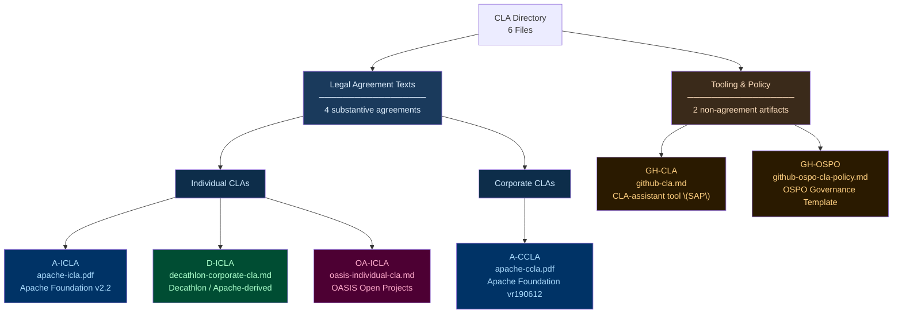
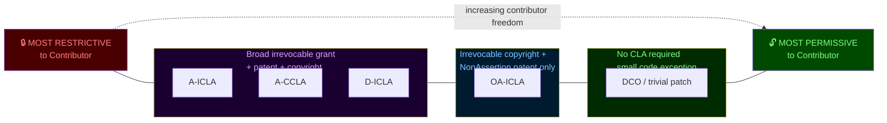
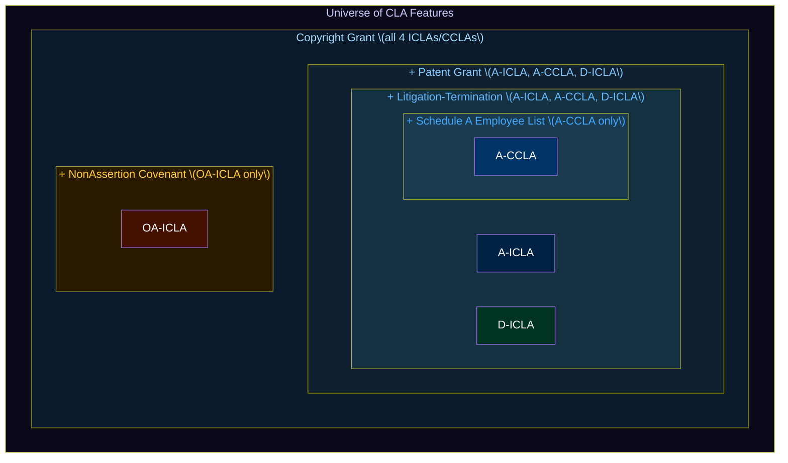
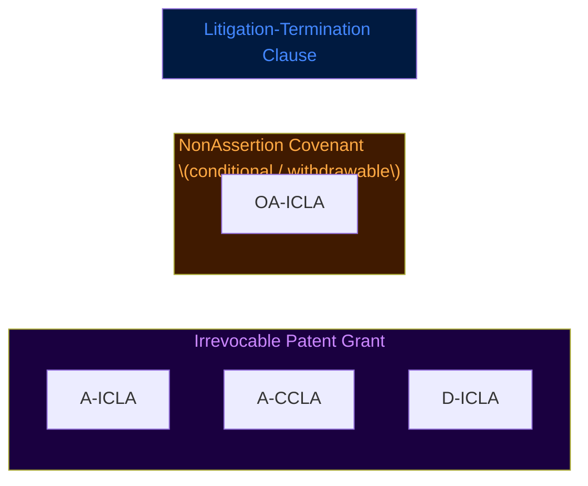
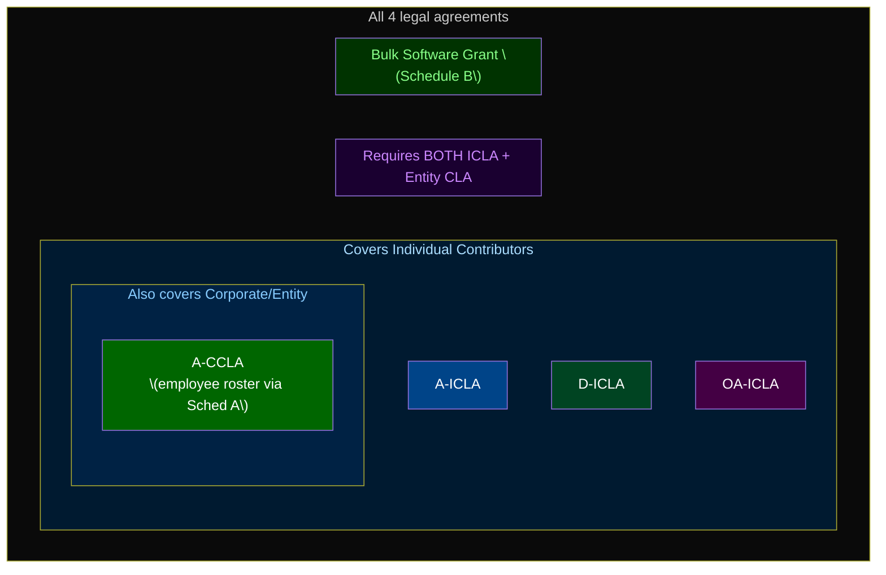
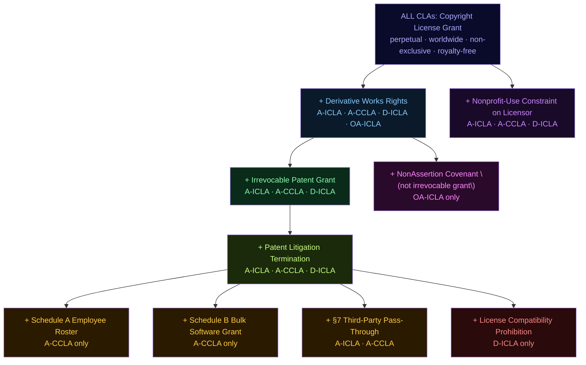
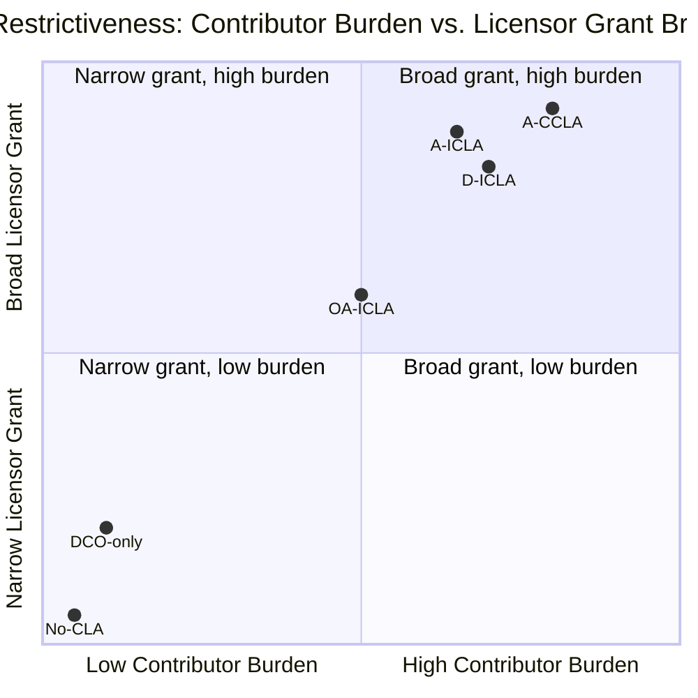
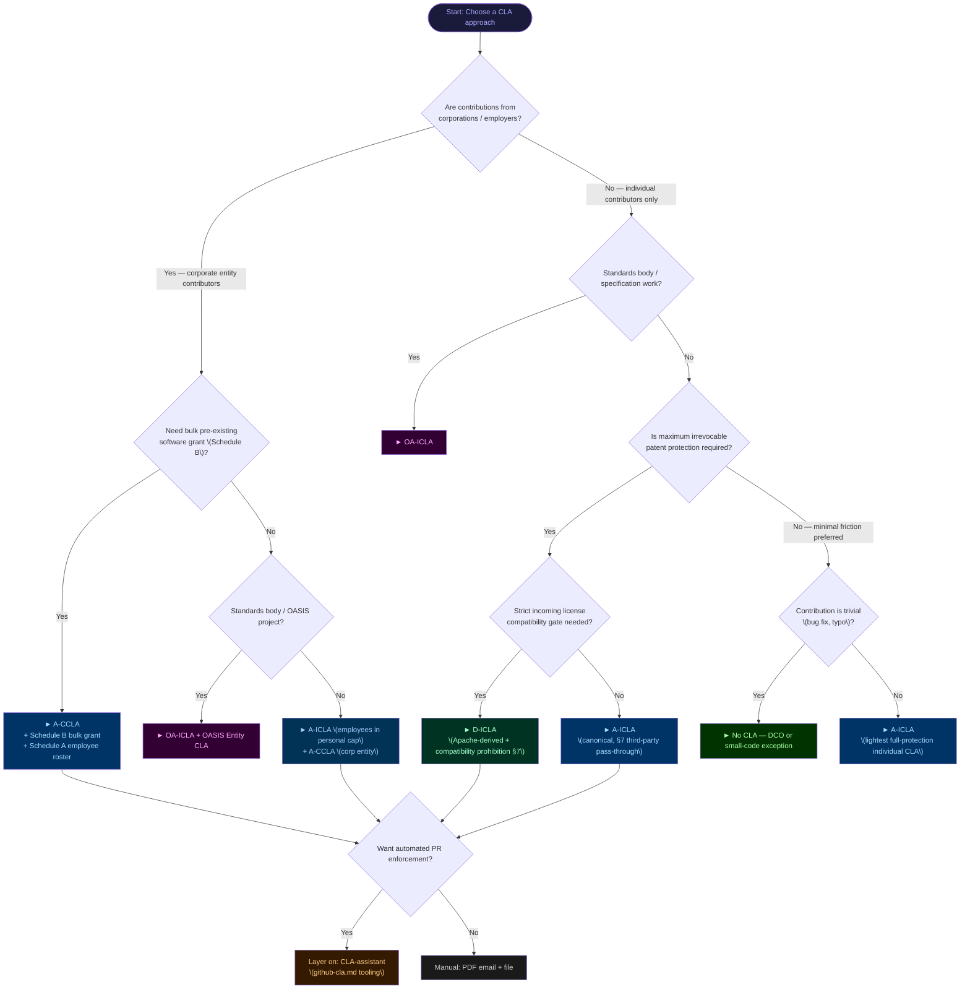

# CLA Comparison: Features Matrix & Selection Criteria

> **Analysis by:** Claude Sonnet 4.6 (Anthropic) · Generated 2026-08-24

> **Scope:** Six CLA documents found in `third-party/contributor-license-agreement/`
> — analyzed on their own merits, generically, without reference to any specific downstream project.

---

## 0. Visual Overview

### 0a. Document Taxonomy Tree



---

### 0b. Restrictive → Permissive Spectrum



---

### 0c. Feature Subset Relationships (Set Diagram)

The following Venn captures which agreement feature-sets are subsets of others:



---

### 0d. Venn — Patent Protection Overlap



---

### 0e. Venn — Entity / Scope Coverage



---

## 1. Documents Analyzed

| ID | File | Organization | Type | Format |
|----|------|-------------|------|--------|
| **A-ICLA** | `apache-icla.pdf` | Apache Software Foundation | Individual CLA | PDF (v2.2) |
| **A-CCLA** | `apache-ccla.pdf` | Apache Software Foundation | Corporate/Software-Grant CLA | PDF (vr190612) |
| **D-ICLA** | `decathlon-corporate-cla.md` | Decathlon (Apache-derived) | Individual CLA | Markdown |
| **GH-CLA** | `github-cla.md` | SAP / cla-assistant.io | CLA *Automation Tool* (not a CLA text) | Markdown |
| **GH-OSPO** | `github-ospo-cla-policy.md` | Generic OSPO template | CLA Policy / Governance Document | Markdown |
| **OA-ICLA** | `oasis-individual-cla.md` | OASIS Open Projects | Individual CLA | Markdown (web-form exhibit) |

> [!NOTE]
> `github-cla.md` is the README for the **CLA-assistant** open-source tool (by SAP, Apache-2.0 licensed).
> It describes *automation infrastructure* for enforcing any CLA, not a CLA text itself.
> `github-ospo-cla-policy.md` is a templated OSPO *policy document* for employee guidance — again not a CLA text.
> Both are evaluated as **tooling/policy** artifacts, not as legal agreements.

---

## 2. Legal Agreement Features Matrix

### 2a. Core Grant Clauses

| Feature | A-ICLA | A-CCLA | D-ICLA | OA-ICLA |
|---------|--------|--------|--------|---------|
| **Copyright license grant** | ✅ Perpetual, worldwide, non-exclusive, royalty-free, irrevocable | ✅ Identical to A-ICLA | ✅ Identical to A-ICLA | ✅ Perpetual, worldwide, non-exclusive, royalty-free, irrevocable + sublicense right |
| **Derivative works right** | ✅ Prepare & distribute | ✅ Prepare & distribute | ✅ Prepare & distribute | ✅ Prepare, publicly display, perform & distribute |
| **Patent license grant** | ✅ Perpetual, worldwide, non-exclusive, royalty-free, irrevocable (with litigation termination) | ✅ Identical to A-ICLA | ✅ Identical to A-ICLA | ✅ Via "Specification NonAssertion Covenant" (more conditional, standards-body model) |
| **Patent litigation termination clause** | ✅ Terminates on filing date | ✅ Terminates on filing date | ✅ Terminates on filing date | ⚠️ Via NonAssertion Covenant (terminable under different conditions) |
| **Software grant (bulk pre-contribution)** | ❌ Not included | ✅ Schedule B for concurrent bulk grants | ❌ Not included | ❌ Not included |
| **Sublicense right granted** | ✅ Implied (distribute to recipients) | ✅ Implied | ✅ Implied | ✅ Explicit direct+indirect sublicense |
| **License scope** | Contributions to Foundation works | Contributions to Foundation works + Schedule B grant | Contributions to Decathlon works | Contributions to any OASIS Open Project repo |
| **License target** | Foundation + downstream recipients | Foundation + downstream recipients | Decathlon + downstream recipients | OASIS + downstream via Applicable License |

---

### 2b. Contributor Entity Type & Control

| Feature | A-ICLA | A-CCLA | D-ICLA | OA-ICLA |
|---------|--------|--------|--------|---------|
| **Contributor type** | Individual (natural person or authorized legal entity) | Corporation / Organization | Individual | Individual (Entity CLA required separately for corps) |
| **"Control" definition (50% rule)** | ✅ Defined (power, shares, beneficial ownership) | ✅ Identical | ✅ Identical | ❌ Not explicitly defined |
| **Employer-rights representation** | ✅ §4: Requires employer permission/waiver or Corporate CLA | ✅ §4: Corp authorizes named employees via Schedule A | ✅ §4: Same as Apache ICLA | ✅ Contributor represents they have employer permission |
| **Employee designation mechanism** | ❌ N/A (individual) | ✅ Schedule A (list of authorized employees, mutable) | ❌ N/A (individual) | ❌ N/A (Entity CLA separate) |
| **Third-party submission mechanism** | ✅ §7: Mark as "Submitted on behalf of third-party" | ✅ §7: Same mechanism | ⚠️ §7 replaced with a prohibition on copying incompatible-licensed code | ❌ Not included |

---

### 2c. Contributor Representations & Warranties

| Feature | A-ICLA | A-CCLA | D-ICLA | OA-ICLA |
|---------|--------|--------|--------|---------|
| **Original creation representation** | ✅ §5 | ✅ §5 | ✅ §5 | ✅ Implicit |
| **Third-party restriction disclosure** | ✅ §5 (patents, trademarks, licenses) | ✅ §5 | ✅ §5 | ✅ Required |
| **"AS IS" no-warranty disclaimer** | ✅ §6 | ✅ §6 | ✅ §6 | ❌ Not stated |
| **Notification of inaccuracies obligation** | ✅ §8 | ✅ §8 | ✅ §8 | ✅ Notification to OASIS required |
| **License compatibility obligation** | ❌ Not mentioned | ❌ Not mentioned | ✅ §7: Explicit — prohibits copying code under incompatible licenses | ❌ Not mentioned |
| **Ownership/rights reserved** | ✅ Contributor retains all rights outside scope | ✅ Contributor retains all rights outside scope | ✅ Contributor retains all rights outside scope | ✅ Not a transfer of ownership |

---

### 2d. Scope & Applicability

| Feature | A-ICLA | A-CCLA | D-ICLA | OA-ICLA |
|---------|--------|--------|--------|---------|
| **Temporal scope** | Present + future contributions | Present + future contributions | Present + future contributions | Present + future (all repos of that OASIS project) |
| **Contribution definition breadth** | Original work + modifications + additions; excludes "Not a Contribution" marked comms | Same; adds Schedule B explicit works | Same as Apache; excludes marked comms | Original work + modifications + additions submitted to any OASIS Open Project repo |
| **Submitted channels** | Email, mailing lists, SCM, issue trackers | Same + explicit bulk via Schedule B | Same | Same (any submission to OASIS project repos) |
| **Project specificity** | Any Foundation-managed product | Any Foundation-managed product + Schedule B named works | Any Decathlon OSS product | Any OASIS Open Project (cross-project scope) |
| **Dual Individual+Corporate model** | ❌ Separate docs required | ✅ Corporate model is this doc | ✅ References separate Corporate CLA | ✅ Explicit: ICLA + Entity CLA both required |

---

### 2e. Process & Mechanics

| Feature | A-ICLA | A-CCLA | D-ICLA | OA-ICLA |
|---------|--------|--------|--------|---------|
| **Execution mechanism** | Wet signature → PDF via email | Wet/digital signature → PDF via email | Wet signature → scan/PDF via email | Online web form + email confirmation |
| **Storage / record** | Apache Foundation file | Apache Foundation file | Decathlon file | OASIS permanent public record |
| **Contributor data collected** | Name (public/private), address, country, email, optional Apache ID, notify project | Corp name, address, POC, email, phone + Schedule A employees | Full name, postal address, email, GitHub handle, date, signature | Name, email, GitHub username, mailing address, employer info |
| **Identity verification** | None beyond signature attestation | None beyond signature attestation | None beyond signature attestation | Email reply confirmation |
| **Automation support** | ❌ Manual process | ❌ Manual process | ❌ Manual process | ❌ Manual web form + email |
| **Versioning** | v2.2 (publicly versioned) | vr190612 (date-versioned) | "Adapted from Apache" (no version) | Referenced to Open Project Rules (externally versioned) |
| **CLA re-sign on update** | ❌ Not addressed | ❌ Not addressed | ❌ Not addressed | ❌ Not addressed in text |
| **Privacy policy reference** | ✅ s.apache.org/cla-privacy-policy | ❌ Not referenced | ❌ Not referenced | ✅ Public record explicitly noted |

---

### 2f. Nonprofit / Public Benefit Constraint on Licensor

| Feature | A-ICLA | A-CCLA | D-ICLA | OA-ICLA |
|---------|--------|--------|--------|---------|
| **Licensor constrained to public benefit** | ✅ "shall not use in a way contrary to public benefit or inconsistent with its nonprofit status" | ✅ Same | ✅ Same (adapted) | ❌ No such constraint |
| **Nonprofit bylaws alignment required** | ✅ Explicitly | ✅ Explicitly | ✅ Adapted reference | ❌ Not stated |

---

## 3. Tooling & Policy Document Analysis

### 3a. GitHub CLA-Assistant (`github-cla.md`)

This is the README of the **cla-assistant** open-source project by SAP (Apache-2.0).

| Capability | Detail |
|-----------|--------|
| **What it is** | A GitHub-integrated web service + GitHub Action that automates CLA collection during PR workflow |
| **CLA storage model** | CLA text stored as a GitHub Gist; signee data stored in Cosmos DB (Azure, EU region) |
| **Signing flow** | PR opened → bot comments → contributor signs in-PR via GitHub OAuth |
| **Authentication** | GitHub account OAuth |
| **Re-sign on CLA update** | ✅ Automatic re-sign request when Gist changes |
| **Custom fields** | ✅ JSON metadata schema drives dynamic form generation |
| **Bot/automation allowlisting** | ✅ Bot users (Dependabot, etc.) can be whitelisted |
| **Export** | ✅ CSV export of signee list |
| **Self-hosting** | ✅ Full self-host via Docker Compose or manual Node.js |
| **Hosted SaaS** | ✅ cla-assistant.io (free, SAP-operated) |
| **GHE support** | ✅ Configurable `GITHUB_HOST` / `GITHUB_API_HOST` env vars |
| **Data residency** | Azure Cosmos DB, Europe |
| **Lite variant** | ✅ GitHub Actions-only version available |

### 3b. GitHub OSPO CLA Policy (`github-ospo-cla-policy.md`)

A **templated internal governance document** (placeholders: `<COMPANY_NAME>`, `<LEGAL_CONTACT>`).

| Aspect | Content |
|--------|---------|
| **Purpose** | Explains CLA concepts to employees and sets organizational policy |
| **ICLA guidance** | Employees sign in personal capacity; OSPO/Legal review required; Section 4 Apache language sufficient for employer-permission representation |
| **CCLA stance** | ❌ OSPO/Legal **discourages CCLAs**; prefers ICLA; if CCLA done, contributor maintains it themselves |
| **Small code exception** | ✅ Bug fixes / trivial patches exempt from CLA requirement |
| **Own repos policy** | ❌ Explicitly **does not use CLAs** on own repos (cites Ben Balter rationale) |
| **Use case** | Guidance for employees contributing *to external projects that require CLAs* |

---

## 4. Comparative Dimensions Summary

### 4a. Legal Strength / Protection Spectrum

```
Strongest corporate protection ←————————————————————→ Lightest touch

  A-CCLA          A-ICLA / D-ICLA        OA-ICLA          (no CLA)
  (corp +         (individual,           (individual,     (DCO/license
  Schedule A +    nonprofit              standards-body    headers only)
  bulk grant)     constraint)            NonAssertion)
```

### 4b. Patent Treatment Comparison

| | A-ICLA | A-CCLA | D-ICLA | OA-ICLA |
|---|---|---|---|---|
| **Patent grant** | Broad, irrevocable | Broad, irrevocable | Broad, irrevocable | NonAssertion Covenant only (conditional, reversible) |
| **Termination trigger** | Patent litigation filed | Patent litigation filed | Patent litigation filed | Withdrawal under covenant terms |
| **Scope** | Claims necessarily infringed by contribution alone or in combination | Same | Same | Claims described in covenant; varies by PGB membership |

> [!WARNING]
> OASIS's NonAssertion Covenant model is significantly weaker as patent protection than the Apache-style irrevocable patent grant.
> It is designed for standards bodies (OASIS), not typical OSS projects.

### 4c. Third-Party / Non-Original Code

| | A-ICLA | A-CCLA | D-ICLA | OA-ICLA |
|---|---|---|---|---|
| **Mechanism** | §7 "on behalf of third-party" carve-out | §7 Same | Prohibition — do not submit incompatible code | No explicit mechanism |

> [!NOTE]
> Decathlon replaces the Apache §7 pass-through mechanism with a **prohibition on submitting code under incompatible licenses**.
> This is stricter but trades flexibility for clarity.

---

## 5. Selection Criteria Framework

When evaluating which CLA type or combination best fits a use case, apply the following criteria:

### 5.1 Contributor Profile

| Criterion | Prefer |
|-----------|--------|
| Only individual contributors | **A-ICLA** or **D-ICLA** or **OA-ICLA** |
| Mix of individual + corporate contributors | **A-ICLA** + **A-CCLA** pair |
| Primarily corporate contributors with employee pools | **A-CCLA** (Schedule A employee management) |
| Standards-body contributors | **OA-ICLA** + OASIS Entity CLA |
| Minimize friction for small/trivial contributions | OSPO small-code exception (no CLA) or DCO only |

### 5.2 Patent Protection Priority

| Criterion | Prefer |
|-----------|--------|
| Maximum irrevocable patent protection | **A-ICLA** / **A-CCLA** (explicit irrevocable grant) |
| Standards-oriented patent framework | **OA-ICLA** (NonAssertion Covenant) |
| Basic patent protection, minimal complexity | **D-ICLA** (Apache-derived, sufficient for OSS) |
| No patent concerns / pure copyright | DCO or MIT-style headers alone |

### 5.3 Organizational Lineage & Ecosystem Fit

| Criterion | Prefer |
|-----------|--------|
| Established ASF-ecosystem projects | **A-ICLA** + **A-CCLA** (widely recognized, legally vetted) |
| Standards/specification work | **OA-ICLA** + OASIS Entity CLA |
| Retail/commercial company OSS projects | **D-ICLA** (Decathlon model) or **A-ICLA** derivative |
| Projects hosted on GitHub | **A-ICLA** text + **CLA-assistant** tooling |
| Enterprise with OSPO governance | **GH-OSPO** policy + ICLA per contributor |

### 5.4 Process Overhead vs. Legal Rigor

| Priority | Tradeoff | Recommended |
|----------|----------|-------------|
| Maximum legal rigor | High friction (PDF, email, manual file) | **A-ICLA** + **A-CCLA** |
| Moderate rigor, digital workflow | Medium friction | **OA-ICLA** (web form + email confirm) |
| Low friction, automated GitHub PR flow | Relies on tooling | Any CLA text + **CLA-assistant** |
| Minimal burden, community-friendly | Lowest rigor | DCO (`git commit -s`) only |
| Corporate OSPO risk management | Balanced | **GH-OSPO** policy + ICLA review gate |

### 5.5 Data Privacy & Residency

| Criterion | Prefer |
|-----------|--------|
| Contributor PII under own control | Self-hosted CLA-assistant or manual file |
| EU data residency (hosted) | CLA-assistant.io (Azure EU) |
| Minimal PII collection | DCO (no form, just commit email) |
| Explicit privacy policy reference | **A-ICLA** (references Apache privacy policy) |

### 5.6 Licensor Constraint (Public Benefit Alignment)

| Criterion | Prefer |
|-----------|--------|
| Nonprofit project, wants contributor assurance | **A-ICLA** / **A-CCLA** / **D-ICLA** (nonprofit-use constraint on licensor) |
| Commercial project, no such constraint desired | **OA-ICLA** or custom (no nonprofit clause) |
| Policy/internal guidance only | **GH-OSPO** template |

### 5.7 Re-licensing Flexibility

| Criterion | Prefer |
|-----------|--------|
| Potential future license change | **A-ICLA** / **A-CCLA** (broad irrevocable grant, sublicense rights) |
| Fixed to specific Applicable License | **OA-ICLA** (tied to repo's designated license) |
| Dual-licensing or commercial relicensing | **A-ICLA** / **A-CCLA** (grant structure supports it) |

---

## 6. CLA Type Taxonomy

```
CLA Documents in Collection
├── Legal Agreement Texts (substantive legal docs)
│   ├── Individual CLAs (ICLAs)
│   │   ├── Apache ICLA (A-ICLA) — canonical, industry standard
│   │   ├── Decathlon ICLA (D-ICLA) — Apache-derived, stricter §7
│   │   └── OASIS Individual CLA (OA-ICLA) — standards-body model
│   └── Corporate CLAs (CCLAs)
│       └── Apache CCLA (A-CCLA) — corp + Schedule A + bulk grant
│
└── Tooling & Policy (non-agreement artifacts)
    ├── CLA-assistant README (GH-CLA) — automation tool (SAP/GitHub)
    └── OSPO CLA Policy Template (GH-OSPO) — internal governance
```

### Mermaid: Feature Inclusion Tree (Subset Hierarchy)

Each inner ring is a **strict subset** of the outer ring — the outermost ring describes the broadest agreement class, inward layers add features only some CLAs possess.



### Mermaid: Permissive ↔ Restrictive Axis — Two Dimensions



---

## 7. Key Differentiators at a Glance

| Differentiator | Winner | Notes |
|---------------|--------|-------|
| **Broadest patent protection** | A-ICLA / A-CCLA | Irrevocable, explicit, litigation-termination |
| **Standards-body compliance** | OA-ICLA | NonAssertion Covenant required for OASIS |
| **Corporate employee management** | A-CCLA | Schedule A mutable list |
| **Bulk software grant** | A-CCLA | Schedule B |
| **Strictest compatibility gate** | D-ICLA | §7 prohibition on incompatible code |
| **Best automation / UX** | GH-CLA (cla-assistant tool) | PR-integrated, OAuth, auto re-sign |
| **Lowest contributor friction** | GH-OSPO small-code exception / DCO | No CLA required for trivial patches |
| **Most widely recognized / portable** | A-ICLA | Industry default; used by Linux Foundation derivatives |
| **Nonprofit-use constraint on licensor** | A-ICLA / A-CCLA / D-ICLA | Contributor assurance against misuse |
| **Explicit privacy policy** | A-ICLA | References apache.org privacy policy |
| **Online digital signing** | OA-ICLA | Web form; GH CLA-assistant automates any text |

---

## 8. Selection Decision Tree



---

*Analysis based on the six documents in `third-party/contributor-license-agreement/` as found on disk. No external sources were consulted.*
