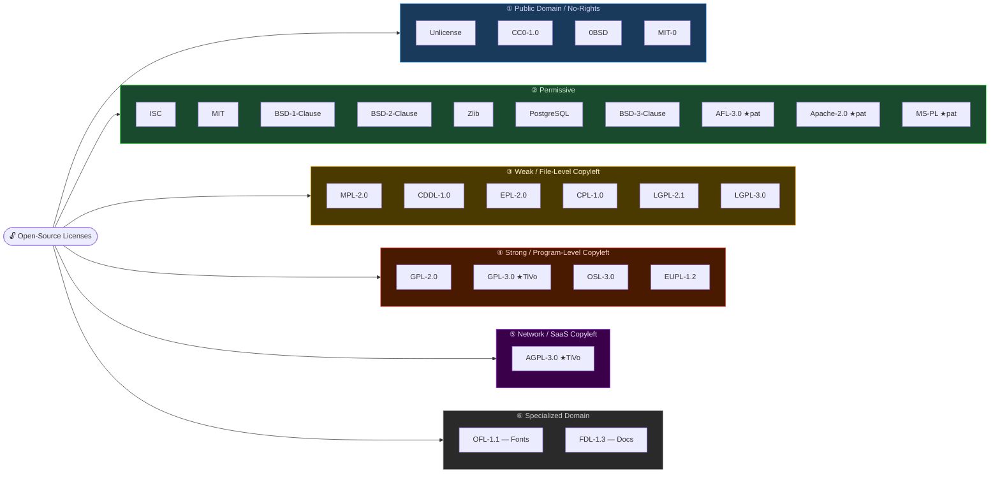
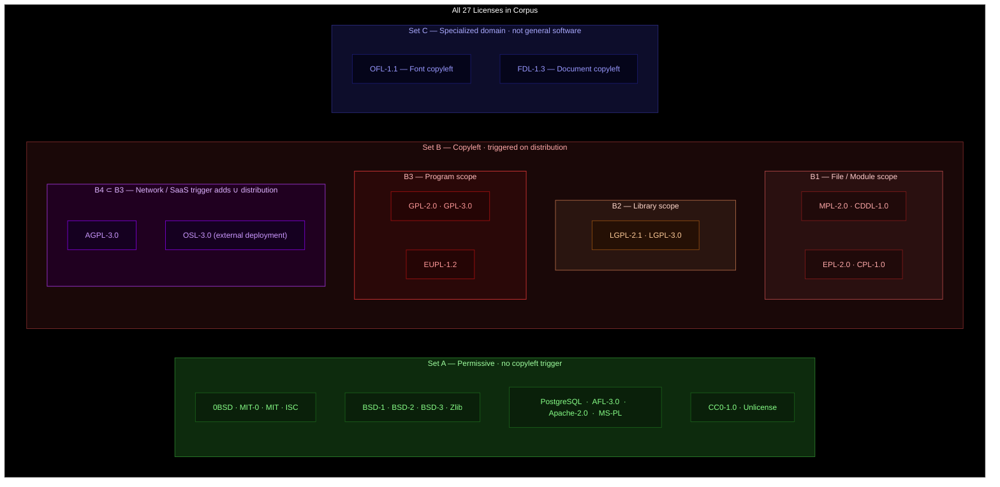
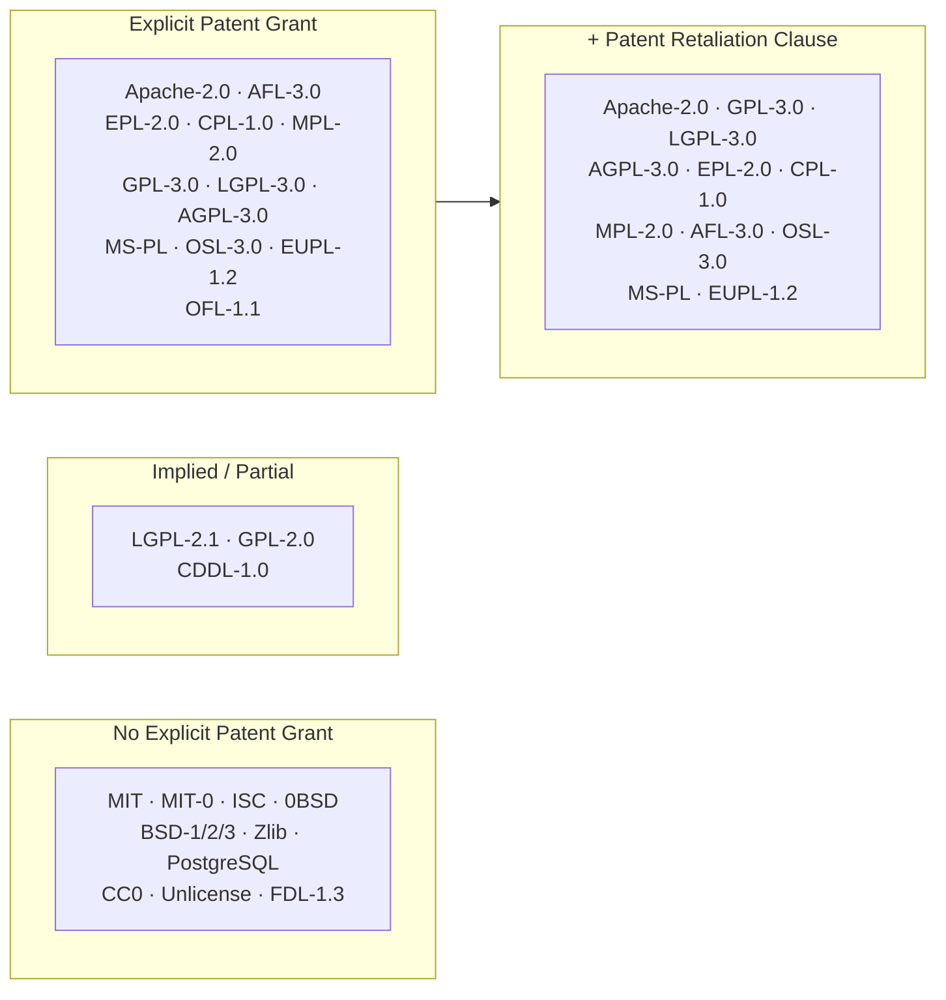
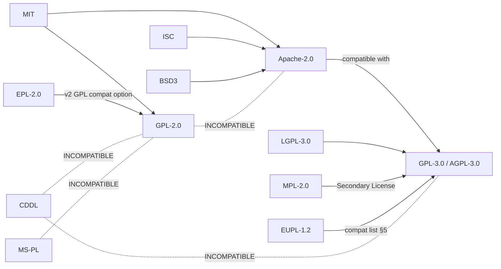
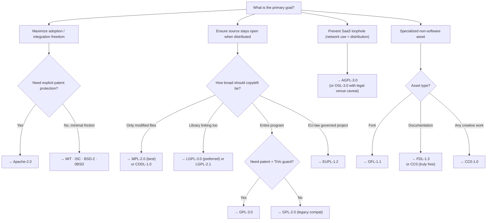

# Open-Source License Comparison: Features Matrix & Selection Criteria
<!-- Source: PROJECT_HOME/docs/legal/third-party/opensource/ — 27 license texts -->
<!-- Scope: open-source distribution licenses only. See ../contributor-license-agreement/ for CLA analysis. -->

> **Scope:** Generic analysis of the 27 OSI-recognized licenses present in the corpus.  
> No project-specific context is included.
>
> **Research & synthesis:** Prior session — Claude Sonnet 4.6 (corpus reading, legal text analysis, matrix population).  
> **Revision:** Claude Sonnet 4.6 (diagram layout & colour corrections).

---

## 1 · Taxonomy Diagrams

### 1.1 · Permissive ↔ Restrictive Spectrum (Tree)



> ★pat = explicit patent grant included · ★TiVo = installation-info guard (§6 GPLv3)

---

### 1.2 · Venn: Copyleft Trigger Sets



---

### 1.3 · Patent Grant Coverage



---

## 2 · Full Features Matrix

**Legend:**  ✅ Yes / Explicit   ⚠️ Partial / Conditional   ❌ No   🔒 Copyleft Required   `—` Not Applicable

| License | Category | Copyleft Strength | Copyleft Trigger | Explicit Patent Grant | Patent Retaliation | Attribution Required | Sublicense Allowed | Compatible with Apache-2.0 | Network/SaaS Trigger | Trademark Restriction | Endorsement Prohibition | "Or Later" Version Clause | Warranty Disclaimer | Limitation of Liability | TiVo-ization Guard | Commercial Use | Domain |
|---|---|---|---|---|---|---|---|---|---|---|---|---|---|---|---|---|---|
| **0BSD** | Public Domain-like | None | — | ❌ | ❌ | ❌ | ✅ | ✅ | ❌ | ❌ | ❌ | ❌ | ✅ | ✅ | ❌ | ✅ | Software |
| **MIT-0** | Public Domain-like | None | — | ❌ | ❌ | ❌ | ✅ | ✅ | ❌ | ❌ | ❌ | ❌ | ✅ | ✅ | ❌ | ✅ | Software |
| **Unlicense** | Public Domain | None | — | ❌ | ❌ | ❌ | ✅ | ✅ | ❌ | ❌ | ❌ | ❌ | ✅ | ✅ | ❌ | ✅ | Software |
| **CC0-1.0** | Public Domain | None | — | ⚠️ Waived | ❌ | ❌ | ✅ | ✅ | ❌ | ❌ | ❌ | ❌ | ✅ | ✅ | ❌ | ✅ | Any |
| **ISC** | Permissive | None | — | ❌ | ❌ | ✅ Notice | ✅ | ✅ | ❌ | ❌ | ❌ | ❌ | ✅ | ✅ | ❌ | ✅ | Software |
| **MIT** | Permissive | None | — | ❌ | ❌ | ✅ Notice | ✅ | ✅ | ❌ | ❌ | ❌ | ❌ | ✅ | ✅ | ❌ | ✅ | Software |
| **BSD-1-Clause** | Permissive | None | — | ❌ | ❌ | ✅ Notice | ✅ | ✅ | ❌ | ❌ | ❌ | ❌ | ✅ | ✅ | ❌ | ✅ | Software |
| **BSD-2-Clause** | Permissive | None | — | ❌ | ❌ | ✅ Notice | ✅ | ✅ | ❌ | ❌ | ❌ | ❌ | ✅ | ✅ | ❌ | ✅ | Software |
| **Zlib** | Permissive | None | — | ❌ | ❌ | ⚠️ Binary only | ✅ | ✅ | ❌ | ❌ | ❌ | ❌ | ✅ | ✅ | ❌ | ✅ | Software |
| **PostgreSQL** | Permissive | None | — | ❌ | ❌ | ✅ Notice | ✅ | ✅ | ❌ | ❌ | ❌ | ❌ | ✅ | ✅ | ❌ | ✅ | Software |
| **BSD-3-Clause** | Permissive | None | — | ❌ | ❌ | ✅ Notice | ✅ | ✅ | ❌ | ❌ | ✅ | ❌ | ✅ | ✅ | ❌ | ✅ | Software |
| **AFL-3.0** | Permissive + Patent | None | — | ✅ | ✅ | ✅ Attribution | ✅ | ✅ | ⚠️ Ext. Deploy = dist | ❌ | ✅ | ❌ | ✅ | ✅ | ❌ | ✅ | Software |
| **Apache-2.0** | Permissive + Patent | None | — | ✅ | ✅ | ✅ NOTICE file | ✅ | ✅ | ❌ | ✅ | ✅ | ❌ | ✅ | ✅ | ❌ | ✅ | Software |
| **MS-PL** | Permissive + Patent | None | — | ✅ | ✅ | ✅ Notice | ❌ (same-license) | ❌ | ❌ | ✅ (no trademark) | ❌ | ❌ | ✅ | ✅ | ❌ | ✅ | Software |
| **OFL-1.1** | Domain-Specific CL | Font copyleft | Distribution | ⚠️ Implied | ❌ | ✅ Notice | ❌ (OFL only) | ⚠️ | ❌ | ✅ Reserved Name | ✅ | ❌ | ✅ | ✅ | ❌ | ✅ (bundled) | Fonts |
| **LGPL-2.1** | Weak Copyleft | Library-level | Distribution of modified lib | ⚠️ Implied | ❌ | ✅ Notice | ✅ | ⚠️ | ❌ | ❌ | ❌ | ✅ | ✅ | ✅ | ❌ | ✅ | Software |
| **LGPL-3.0** | Weak Copyleft | Library-level | Distribution of modified lib | ✅ | ✅ | ✅ Notice | ✅ | ✅ | ❌ | ❌ | ❌ | ✅ | ✅ | ✅ | ✅ | ✅ | Software |
| **MPL-2.0** | Weak / File Copyleft | File-level | Distribution of modified files | ✅ | ✅ | ✅ Notice | ❌ (MPL or compat) | ✅ | ❌ | ❌ | ❌ | ✅ | ✅ | ✅ | ❌ | ✅ | Software |
| **CDDL-1.0** | Weak / File Copyleft | File-level | Distribution of modified files | ⚠️ Implied | ❌ | ✅ Notice | ❌ | ❌ | ❌ | ❌ | ❌ | ✅ | ✅ | ✅ | ❌ | ✅ | Software |
| **EPL-2.0** | Weak Copyleft | Module-level | Distribution | ✅ | ✅ | ✅ Notice | ❌ (EPL/GPL option) | ✅ (v2 + GPL compat) | ❌ | ❌ | ❌ | ✅ | ✅ | ✅ | ❌ | ✅ | Software |
| **CPL-1.0** | Weak Copyleft | Module-level | Distribution | ✅ | ✅ | ✅ Notice | ❌ | ❌ | ❌ | ❌ | ❌ | ✅ | ✅ | ✅ | ❌ | ✅ | Software |
| **FDL-1.3** | Domain-Specific CL | Document copyleft | Distribution | ❌ | ❌ | ✅ (authors, history) | ❌ (FDL only) | — | ❌ | ❌ | ✅ | ✅ | ✅ | ✅ | ❌ | ✅ | Documentation |
| **GPL-2.0** | Strong Copyleft | Program-level | Distribution | ⚠️ Implied | ❌ | ✅ Notices | ❌ (GPL only) | ❌ | ❌ | ❌ | ❌ | ✅ | ✅ | ✅ | ❌ | ✅ | Software |
| **GPL-3.0** | Strong Copyleft | Program-level | Distribution | ✅ | ✅ | ✅ Notices | ❌ (GPL-3 only) | ✅ (Apache-2.0 compat w/GPL-3) | ❌ | ❌ | ❌ | ✅ | ✅ | ✅ | ✅ | ✅ | Software |
| **OSL-3.0** | Strong Copyleft | Program-level | Dist + Network | ✅ | ✅ | ✅ Attribution | ❌ (OSL only) | ❌ | ✅ External deploy | ❌ | ✅ | ❌ | ✅ | ✅ | ❌ | ✅ | Software |
| **EUPL-1.2** | Strong Copyleft | Program-level | Distribution | ✅ | ✅ | ✅ Notice | ❌ (EUPL + compat list) | ✅ (via compat list) | ❌ | ❌ | ❌ | ✅ | ✅ | ✅ | ❌ | ✅ | Software |
| **AGPL-3.0** | Network Copyleft | Program + Network | Dist + Network interaction | ✅ | ✅ | ✅ Notices | ❌ (AGPL only) | ✅ (Apache-2.0 compat w/AGPL) | ✅ Network interaction | ❌ | ❌ | ✅ | ✅ | ✅ | ✅ | ✅ | Software |

---

## 3 · Feature Deep-Dive

### 3.1 · Copyleft Strength Hierarchy

```mermaid
graph BT
    A["No Copyleft\n(0BSD, MIT, ISC, Apache…)"]
    B["File / Module Copyleft\n(MPL-2.0, CDDL-1.0, EPL-2.0, CPL-1.0)"]
    C["Library Copyleft\n(LGPL-2.1, LGPL-3.0)"]
    D["Program-level Copyleft\n(GPL-2.0, GPL-3.0, OSL-3.0, EUPL-1.2)"]
    E["Network / SaaS Copyleft\n(AGPL-3.0, OSL-3.0*)"]

    A -->|"Stronger →"| B
    B --> C
    C --> D
    D --> E

    style A fill:#2ecc71,color:#000
    style B fill:#f39c12,color:#000
    C fill:#e67e22,color:#000
    style D fill:#e74c3c,color:#fff
    style E fill:#8e44ad,color:#fff
```

*OSL-3.0's "external deployment" clause places it in both D and E.

---

### 3.2 · Compatibility Web (Simplified)



---

## 4 · Detailed Feature Explanations

### 4.1 · Copyleft Trigger Conditions

| Trigger Type | When Activated | Licenses |
|---|---|---|
| **None** | Never | 0BSD, MIT-0, MIT, ISC, BSD-1/2/3, Zlib, PostgreSQL, Apache-2.0, AFL-3.0, MS-PL, CC0, Unlicense |
| **Modified-file distribution** | Only when modified covered files are distributed | MPL-2.0, CDDL-1.0 |
| **Module/program distribution** | Any distribution of the program (binary or source) | EPL-2.0, CPL-1.0, LGPL-2.1, LGPL-3.0, GPL-2.0, GPL-3.0 |
| **External deployment** | Making the work available over a network to third parties | OSL-3.0, AGPL-3.0 |
| **Document distribution** | Distributing modified documentation | FDL-1.3 |
| **Font distribution** | Distributing modified font files | OFL-1.1 |

---

### 4.2 · Patent Grant Matrix

| Feature | Licenses |
|---|---|
| **Full explicit patent grant** | Apache-2.0, AFL-3.0, GPL-3.0, LGPL-3.0, AGPL-3.0, EPL-2.0, CPL-1.0, MPL-2.0, OSL-3.0, MS-PL, EUPL-1.2, OFL-1.1 |
| **Implied / partial (no explicit §)** | GPL-2.0, LGPL-2.1, CDDL-1.0 |
| **No patent grant** | MIT, MIT-0, ISC, 0BSD, BSD-1/2/3, Zlib, PostgreSQL, CC0, Unlicense, FDL-1.3 |
| **Patent retaliation clause** | Apache-2.0, AFL-3.0, GPL-3.0, LGPL-3.0, AGPL-3.0, EPL-2.0, CPL-1.0, MPL-2.0, OSL-3.0, MS-PL, EUPL-1.2 |

---

### 4.3 · Attribution & Notice Requirements

| Requirement Level | Description | Licenses |
|---|---|---|
| **None** | No notices required at all | 0BSD, MIT-0, Unlicense |
| **Copyright notice only** | Retain copyright/license text in copies | ISC, MIT, BSD-1, BSD-2, PostgreSQL, CC0 |
| **Notice + endorsement bar** | Retain notice; prohibit endorsement with author names | BSD-3-Clause, AFL-3.0, Apache-2.0, OSL-3.0 |
| **NOTICE file required** | Must reproduce NOTICE file content | Apache-2.0 |
| **Prominent modification mark** | Must indicate modifications clearly | Zlib, LGPL, GPL, AGPL, MPL, EPL, EUPL |
| **Attribution in source** | Derived source must carry attribution notice | AFL-3.0, OSL-3.0 |
| **Historical record** | Modified docs must record change history | FDL-1.3 |

---

### 4.4 · Sublicensing

| Sublicensing Permitted | Licenses |
|---|---|
| **✅ Yes** | 0BSD, MIT-0, MIT, ISC, BSD-1/2/3, Zlib, PostgreSQL, AFL-3.0, Apache-2.0, CC0, Unlicense, LGPL-2.1, LGPL-3.0 |
| **❌ No (same-license only)** | GPL-2.0, GPL-3.0, AGPL-3.0, MPL-2.0, CDDL-1.0, EPL-2.0, CPL-1.0, OSL-3.0, EUPL-1.2, OFL-1.1, FDL-1.3 |
| **❌ No (same-license, proprietary binary allowed)** | MS-PL |

---

### 4.5 · TiVo-ization / Installation Info Guard

The "TiVo-ization" problem: distributing GPL software in hardware but preventing users from installing modified versions.

| License | Guards Against |
|---|---|
| **GPL-3.0, LGPL-3.0, AGPL-3.0** | ✅ Yes — requires Installation Information for User Products |
| **GPL-2.0, LGPL-2.1** | ❌ No explicit guard |
| **All others** | ❌ Not applicable |

---

## 5 · Selection Criteria Framework

### 5.1 · Decision Tree



---

### 5.2 · Selection Criteria Table

| Criterion | Weight | Favors Permissive | Favors Weak Copyleft | Favors Strong Copyleft | Favors Network Copyleft |
|---|---|---|---|---|---|
| **Maximize downstream adoption** | High | ✅✅ | ✅ | ⚠️ | ❌ |
| **Commercial integration (proprietary use)** | High | ✅✅ | ✅ (file scope) | ❌ | ❌ |
| **Community contribution reciprocity** | High | ❌ | ✅ (scoped) | ✅✅ | ✅✅ |
| **Patent protection (explicit grant)** | Medium | ✅ (Apache, AFL) | ✅✅ | ✅✅ | ✅✅ |
| **SaaS / hosted-service reciprocity** | Medium | ❌ | ❌ | ❌ | ✅✅ |
| **OSI & FSF dual approval** | Medium | ✅✅ | ✅ | ✅✅ | ✅ |
| **Legal clarity / battle-tested** | Medium | ✅✅ | ✅ | ✅✅ | ✅ |
| **Prevent fork-and-close** | Medium | ❌ | ⚠️ (partial) | ✅✅ | ✅✅ |
| **Compatibility with GPL ecosystem** | Medium | ✅ (Apache w/GPL-3) | ✅ (MPL-2.0, EPL-2.0) | ✅ (GPL-3) | ✅ (AGPL) |
| **TiVo / embedded hardware freedom** | Low-Med | ❌ | ❌ | ✅ (GPL-3 only) | ✅ |
| **Minimum attribution burden** | Low | ✅✅ | ✅ | ⚠️ | ⚠️ |
| **Government / EU jurisdiction compat** | Low | ✅ | ✅ | ✅ | ✅ (EUPL-1.2) |

---

### 5.3 · Use-Case Fit Summary

| Use Case | Recommended | Rationale |
|---|---|---|
| Internal tooling, no redistribution | MIT · Apache-2.0 | Minimal friction, clear IP |
| Public library / SDK meant for wide integration | MIT · Apache-2.0 · MPL-2.0 | Permissive or file-scoped copyleft keeps integrators happy |
| Core community project (keep contributions open) | GPL-3.0 · LGPL-3.0 | Strong copyleft ensures reciprocity |
| SaaS / network-deployed service | AGPL-3.0 | Only license that closes network-use loophole |
| Patent-sensitive domain | Apache-2.0 · GPL-3.0 · EPL-2.0 | Explicit grants + retaliation clauses |
| Multi-party standards body | MPL-2.0 · EPL-2.0 | File-scoped copyleft, corporate-friendly |
| Font assets | OFL-1.1 | Domain-specific, widely accepted |
| Documentation / manuals | FDL-1.3 · CC0 | FDL for copyleft docs; CC0 for no restrictions |
| Maximum freedom (no conditions) | 0BSD · Unlicense · CC0 | Closest to public domain |
| Legacy codebase (GPLv2 ecosystem) | GPL-2.0 · LGPL-2.1 | Compatibility with existing GPLv2 code |
| EU-governed project | EUPL-1.2 | Explicit EU jurisdiction, compat list §5 |

---

### 5.4 · Risk Factors by License

| License | Key Risk / Caveat |
|---|---|
| **AGPL-3.0** | Any network-served modified version must release source; strong deterrent to commercial SaaS use |
| **GPL-2.0** | No explicit patent grant; no TiVo guard; incompatible with Apache-2.0 |
| **GPL-3.0** | TiVo guard may conflict with embedded/hardware products |
| **LGPL-2.1** | "Linking" definition ambiguous in dynamic vs static contexts |
| **CDDL-1.0** | GPL-incompatible; file-level scope can be complex to track |
| **CPL-1.0** | Deprecated predecessor to EPL; prefer EPL-2.0 for new projects |
| **OSL-3.0** | Venue clause (licensor's jurisdiction) creates litigation risk; not GPL-compatible |
| **MS-PL** | No sublicensing; compiled derivatives must also use MS-PL–compliant license; unclear on GPL compat |
| **EUPL-1.2** | Complex compatibility list; requires EU legal familiarity |
| **AFL-3.0** | Similar to OSL: attorney-fee clause and venue restriction; same author (Rosen) |
| **FDL-1.3** | Invariant Sections make it incompatible with many uses; Debian "non-free" issues |
| **OFL-1.1** | Fonts only; cannot sell font alone; reserved name constraints |
| **CC0-1.0** | Patent rights not guaranteed waived in all jurisdictions |

---

## 6 · Quick-Reference Cheat Sheet

```
RESTRICTIVE ←————————————————————→ PERMISSIVE

AGPL-3.0  GPL-3.0  GPL-2.0  LGPL-3.0  LGPL-2.1  MPL-2.0  EPL-2.0  Apache-2.0  MIT  0BSD  Unlicense
   |          |        |        |          |          |        |          |        |    |       |
Network     TiVo    Legacy    Library    Library    File     Module    Patent+   Min  None   PD
copyleft    guard   compat    copyleft   copyleft   scope    scope     Notice   attr
```

| Dimension | Minimum | Maximum |
|---|---|---|
| Freedom to use | 0BSD, MIT-0 | AGPL (must release if network-served) |
| Copyleft scope | MIT (none) | AGPL-3.0 (network trigger) |
| Patent protection | MIT (none) | Apache-2.0, GPL-3.0 (explicit + retaliation) |
| Attribution burden | 0BSD (none) | FDL-1.3, AFL-3.0, OSL-3.0 (prominent notices) |
| Commercial friendliness | AGPL (low) | MIT, Apache-2.0 (high) |
| SaaS-service obligation | MIT (none) | AGPL-3.0 (must release source) |

---

*All content derived directly from the license texts in the corpus. Not legal advice.*
