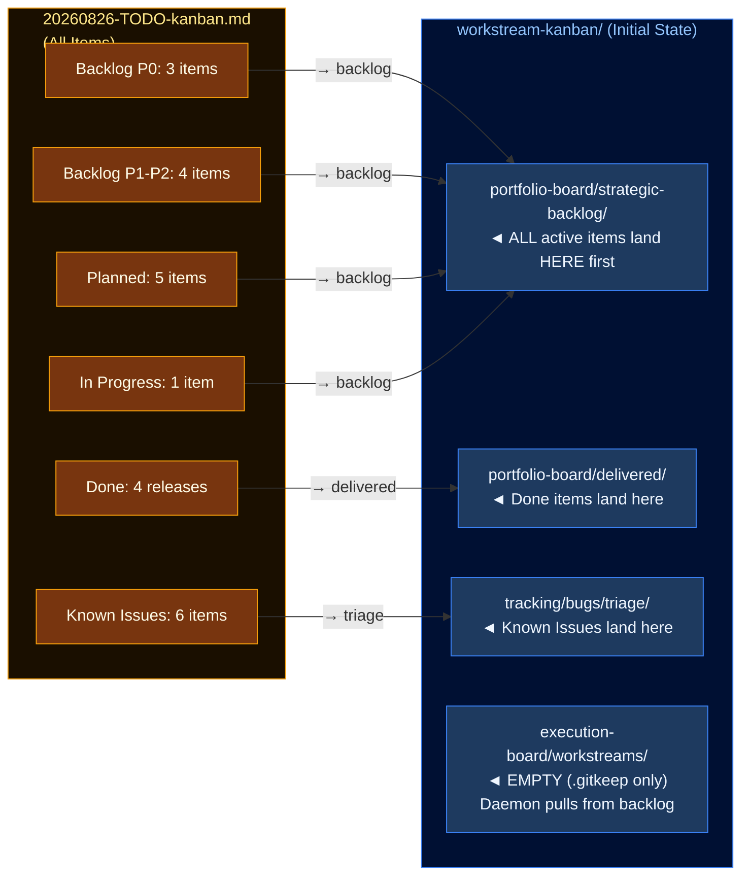
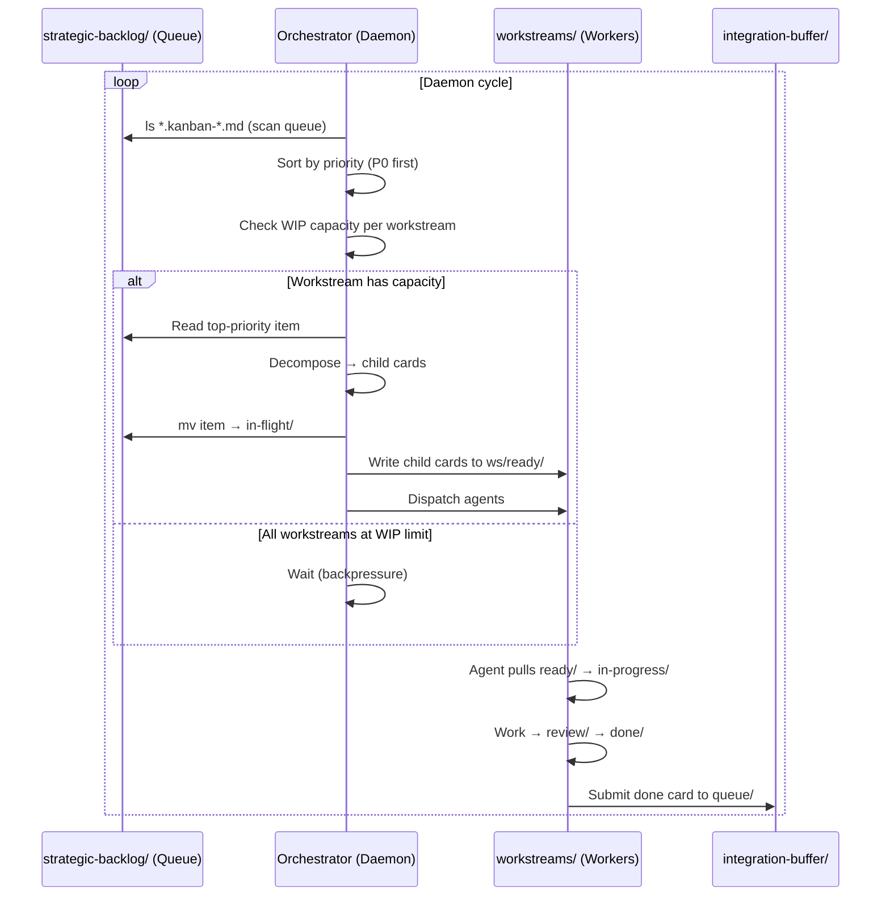
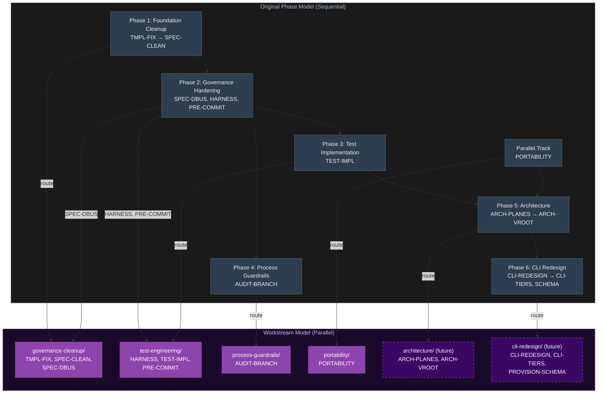
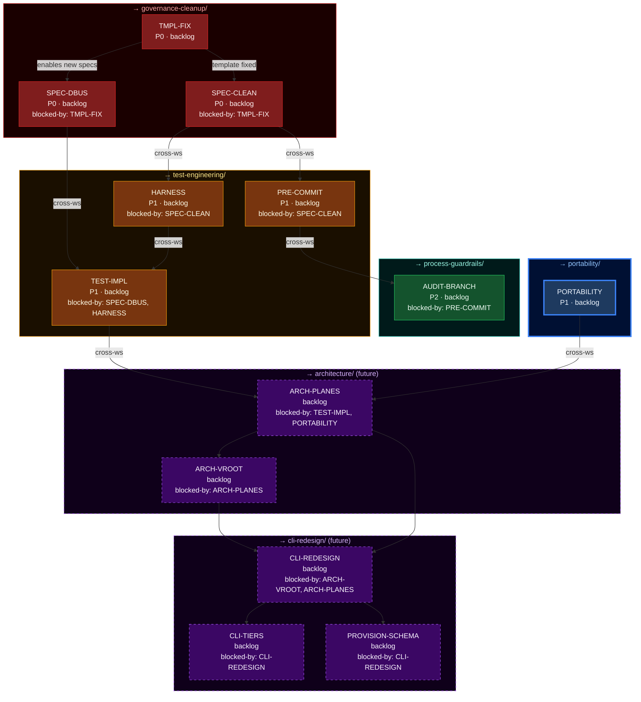
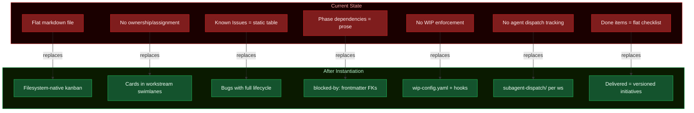
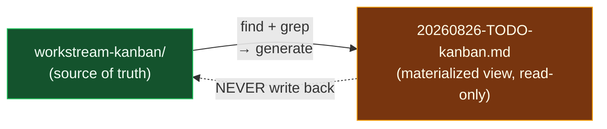

<!-- (c) 2026-* Frederick Bloom -- Bwrap-Enhanced Kanban Instantiation -- Hanaden AI -->

# Bwrap-Enhanced Kanban Instantiation

> **Status:** DRAFT — Design Only
> **Project:** `hanaden-bwrap-enhanced`
> **Source:** `PROJECT_HOME/docs/20260826-TODO-kanban.md`
> **Target:** `PROJECT_HOME/docs/workstream-kanban/`
> **Filename:** `20260827-032356-af5cec-af5c-ec44-9d64407d8eb0-BwrapEnhancedKanbanInstantiation.kanban-0.0.1.md`
> **Engine:** `PROJECT_HOME/generic-sdlc-and-engine-readonly/20260827-032351-153784-198a-2703-3f584ebf95d7-GenericWorkstreamKanbanEngine.kanban-0.0.1.md`
> **Processing Model:** Daemon-style backlog pull

---

## 1. Overview

This document defines how the hanaden-bwrap-enhanced project **instantiates**
the Generic Workstream Kanban Engine. Every item from the existing
`20260826-TODO-kanban.md` starts in the **strategic backlog**. The directory
tree is empty (`.gitkeep` only) until items are pulled and processed — like
a daemon processing a work queue.



---

## 2. Daemon-Style Backlog Processing

The backlog is processed like a daemon's work queue — items are **pulled**,
not pushed. The AI orchestrator (or future Rust engine) acts as the daemon:



**Key principle:** The dirtree starts empty. Workstream directories contain
only `.gitkeep` until the daemon pulls items from the backlog and routes them.
This is a **pull system**, not push.

---

## 3. Workstream Definitions

Workstream directories are **created empty** and populated only when the
daemon routes cards to them. Derived from TODO kanban phase groupings:

| Workstream Slug | Owner | Type | WIP Limit | Source Phase |
|-----------------|-------|------|-----------|-------------|
| `governance-cleanup` | Human/Agent | mixed | 3 | Phase 1 + Phase 2 (partial) |
| `test-engineering` | Human/Agent | mixed | 2 | Phase 2 (partial) + Phase 3 |
| `process-guardrails` | Human | human | 1 | Phase 4 |
| `portability` | Human/Agent | mixed | 2 | Parallel Track |

**Future workstreams** (created when initiatives move to in-flight):

| Workstream Slug | Source |
|-----------------|--------|
| `architecture` | Phase 5 (ARCH-PLANES, ARCH-VROOT) |
| `cli-redesign` | Phase 6 (CLI-REDESIGN, CLI-TIERS, PROVISION-SCHEMA) |

### Instantiated `wip-config.yaml`

```yaml
---
version: 1
project: hanaden-bwrap-enhanced
default-wip-limit: 3

workstreams:
  governance-cleanup:
    wip-limit: 3
    owner: "Frederick Bloom"
    type: mixed
  test-engineering:
    wip-limit: 2
    owner: "Frederick Bloom"
    type: mixed
  process-guardrails:
    wip-limit: 1
    owner: "Frederick Bloom"
    type: human
  portability:
    wip-limit: 2
    owner: "Frederick Bloom"
    type: mixed

integration-buffer:
  wip-limit: 1
  verification-timeout-hours: 4
---
```

---

## 4. Phase-to-Workstream Routing

The existing TODO kanban has 6 sequential phases + 1 parallel track. The
daemon will route backlog items to workstreams based on this mapping:



---

## 5. Item-by-Item Migration — All to Backlog

**Everything starts in `portfolio-board/strategic-backlog/`.**
The daemon will decompose, prioritize, and route.

### 5.1 Backlog P0 (Critical) → Strategic Backlog

| Item | Card File | Initial Location | SDLC Ref | Priority |
|------|-----------|------------------|----------|----------|
| **TMPL-FIX** | `TemplateCleanup.card.kanban-0.0.1.md` | `strategic-backlog/` | `SpecificationTmpl` template | P0 |
| **SPEC-CLEAN** | `SpecCleanup.card.kanban-0.0.1.md` | `strategic-backlog/` | 55 specs under `BwrapEnhanced2026.strat/` | P0 |
| **SPEC-DBUS** | `DbusSpecCreation.card.kanban-0.0.1.md` | `strategic-backlog/` | `UncontainedAgentExecution.driv` D-Bus path | P0 |

### 5.2 Backlog P1–P2 → Strategic Backlog

| Item | Card File | Initial Location | SDLC Ref | Priority |
|------|-----------|------------------|----------|----------|
| **HARNESS** | `TestHarnessDesign.card.kanban-0.0.1.md` | `strategic-backlog/` | `GenericSdlcEngine.strat` test output | P1 |
| **TEST-IMPL** | `TestImplementation.card.kanban-0.0.1.md` | `strategic-backlog/` | 260 NOT_STARTED cases, 45 specs | P1 |
| **PRE-COMMIT** | `PreCommitHook.card.kanban-0.0.1.md` | `strategic-backlog/` | Governance audit §11 | P1 |
| **AUDIT-BRANCH** | `BranchAudit.card.kanban-0.0.1.md` | `strategic-backlog/` | CONTRIBUTING.md / AGENTS.md | P2 |

### 5.3 In Progress → Strategic Backlog (re-queued)

| Item | Card File | Initial Location | SDLC Ref | Priority |
|------|-----------|------------------|----------|----------|
| **PORTABILITY** | `PortabilitySweep.card.kanban-0.0.1.md` | `strategic-backlog/` | `HostCoupledDevelopment.driv` (3 specs) | P1 |

> [!NOTE]
> Even though PORTABILITY was "In Progress" in the flat file, it starts in
> the backlog here. The daemon will re-pull it based on priority. The card's
> frontmatter will note `previously-in-progress: true` to preserve history.

### 5.4 Planned (Brainstorm) → Strategic Backlog

| Item | Card File | Initial Location | SDLC Ref |
|------|-----------|------------------|----------|
| **ARCH-PLANES** | `TwoPlaneArchitecture.init.kanban-0.0.1.md` | `strategic-backlog/` | New `.arch` node |
| **ARCH-VROOT** | `VirtualRootOverlay.init.kanban-0.0.1.md` | `strategic-backlog/` | New `.arch` node |
| **CLI-REDESIGN** | `CliModuleRedesign.init.kanban-0.0.1.md` | `strategic-backlog/` | New `.feat` node |
| **CLI-TIERS** | `SecurityTierModel.init.kanban-0.0.1.md` | `strategic-backlog/` | New `.feat` node |
| **PROVISION-SCHEMA** | `ProvisionJsonSchema.init.kanban-0.0.1.md` | `strategic-backlog/` | New `.spec` node |

### 5.5 Done → Portfolio Delivered

| Version | File | Location |
|---------|------|----------|
| **v0.2.2** | `Release-v0.2.2.init.kanban-0.0.1.md` | `portfolio-board/delivered/` |
| **v0.2.1** | `Release-v0.2.1.init.kanban-0.0.1.md` | `portfolio-board/delivered/` |
| **v0.2.0** | `Release-v0.2.0.init.kanban-0.0.1.md` | `portfolio-board/delivered/` |
| **v0.1.0** | `Release-v0.1.0.init.kanban-0.0.1.md` | `portfolio-board/delivered/` |

### 5.6 Known Issues → Tracking Bugs (triage)

| KI ID | Bug File | Location | Affected Spec | Severity |
|-------|----------|----------|---------------|----------|
| **KI-001** | `X11AuthorityBug.bug.kanban-0.0.1.md` | `tracking/bugs/triage/` | `X11Socket.spec` | Medium |
| **KI-002** | `SandboxExecNoTest.bug.kanban-0.0.1.md` | `tracking/bugs/triage/` | `SandboxExecEngine.arch` | Low |
| **KI-003** | `BwrapPreflightNoIntTest.bug.kanban-0.0.1.md` | `tracking/bugs/triage/` | `BwrapPreflight.feat` | Low |
| **KI-004** | `FabricatedTimestamp49Specs.bug.kanban-0.0.1.md` | `tracking/bugs/triage/` | 49 specs (audit §2.4) | P0 |
| **KI-005** | `AutofsNfsPathViolations.bug.kanban-0.0.1.md` | `tracking/bugs/triage/` | `NoHostTopologyInSpecs.spec` | Medium |
| **KI-006** | `UnresolvedSecurityBulletins.bug.kanban-0.0.1.md` | `tracking/bugs/triage/` | `security-bulletins/` | Review |

> [!NOTE]
> ALL Known Issues start in `triage/` — even KI-004 which was previously
> marked P0/confirmed. The daemon processes triage → confirmed → assigned.

---

## 6. Cross-Workstream Dependency Graph

These `blocked-by:` frontmatter edges are encoded in the card files sitting
in the backlog. The daemon uses them to determine routing order:



### Critical Path

```
TMPL-FIX → SPEC-CLEAN → HARNESS → TEST-IMPL → ARCH-PLANES → ARCH-VROOT → CLI-REDESIGN → CLI-TIERS / PROVISION-SCHEMA
```

---

## 7. Gap Analysis — Project-Specific

What the **existing** `20260826-TODO-kanban.md` cannot do that this
instantiation enables:



---

## 8. Instantiated Directory Tree — Initial State

**Everything in backlog. Workstream dirs are EMPTY (`.gitkeep` only).**
The daemon populates workstreams as it pulls items from the backlog.
Relative to `PROJECT_HOME/docs/workstream-kanban/`:

```
workstream-kanban/
├── README.md
├── CONVENTIONS.md
│
├── portfolio-board/
│   ├── README.md
│   ├── strategic-backlog/                 ◄── ALL ACTIVE ITEMS START HERE
│   │   ├── TemplateCleanup.card.kanban-0.0.1.md         (P0, TMPL-FIX)
│   │   ├── SpecCleanup.card.kanban-0.0.1.md             (P0, SPEC-CLEAN)
│   │   ├── DbusSpecCreation.card.kanban-0.0.1.md        (P0, SPEC-DBUS)
│   │   ├── TestHarnessDesign.card.kanban-0.0.1.md       (P1, HARNESS)
│   │   ├── TestImplementation.card.kanban-0.0.1.md      (P1, TEST-IMPL)
│   │   ├── PreCommitHook.card.kanban-0.0.1.md           (P1, PRE-COMMIT)
│   │   ├── BranchAudit.card.kanban-0.0.1.md             (P2, AUDIT-BRANCH)
│   │   ├── PortabilitySweep.card.kanban-0.0.1.md        (P1, PORTABILITY)
│   │   ├── TwoPlaneArchitecture.init.kanban-0.0.1.md    (brainstorm)
│   │   ├── VirtualRootOverlay.init.kanban-0.0.1.md      (brainstorm)
│   │   ├── CliModuleRedesign.init.kanban-0.0.1.md       (brainstorm)
│   │   ├── SecurityTierModel.init.kanban-0.0.1.md       (brainstorm)
│   │   └── ProvisionJsonSchema.init.kanban-0.0.1.md     (brainstorm)
│   ├── in-flight/
│   │   └── .gitkeep                      ◄── EMPTY (daemon populates)
│   ├── delivered/
│   │   ├── Release-v0.2.2.init.kanban-0.0.1.md
│   │   ├── Release-v0.2.1.init.kanban-0.0.1.md
│   │   ├── Release-v0.2.0.init.kanban-0.0.1.md
│   │   └── Release-v0.1.0.init.kanban-0.0.1.md
│   └── archive/
│       └── .gitkeep                      ◄── EMPTY
│
├── execution-board/
│   ├── README.md
│   ├── wip-config.yaml
│   ├── workstreams/
│   │   ├── README.md
│   │   ├── _template-workstream/
│   │   │   └── (see Engine doc)
│   │   │
│   │   ├── governance-cleanup/            ◄── EMPTY (daemon populates)
│   │   │   ├── README.md
│   │   │   ├── ready/
│   │   │   │   └── .gitkeep
│   │   │   ├── in-progress/
│   │   │   │   └── .gitkeep
│   │   │   ├── blocked/
│   │   │   │   └── .gitkeep
│   │   │   ├── review/
│   │   │   │   └── .gitkeep
│   │   │   ├── done/
│   │   │   │   └── .gitkeep
│   │   │   ├── subagent-dispatch/
│   │   │   │   ├── pending/ + active/ + completed/ + failed/
│   │   │   │   └── README.md
│   │   │   ├── worktree-branches/
│   │   │   │   ├── active-branches/ + merged-branches/
│   │   │   │   └── README.md
│   │   │   └── artifacts/
│   │   │       └── scratch/ + deliverables/
│   │   │
│   │   ├── test-engineering/              ◄── EMPTY (daemon populates)
│   │   │   └── (same structure as governance-cleanup, all .gitkeep)
│   │   │
│   │   ├── process-guardrails/            ◄── EMPTY (daemon populates)
│   │   │   └── (same structure, all .gitkeep)
│   │   │
│   │   └── portability/                   ◄── EMPTY (daemon populates)
│   │       └── (same structure, all .gitkeep)
│   │
│   └── integration-buffer/
│       ├── queue/ + active-merge/ + verification/ + integrated/
│       └── README.md
│
│
├── release-pipeline/
│   ├── staging/ + canary/ + production/ + rollback-log/
│   └── README.md                         ◄── ALL EMPTY
│
├── sdlc-specs/
│   ├── spec-requests/ + spec-reviews/ + spec-approvals/ + spec-change-proposals/
│   └── README.md                         ◄── ALL EMPTY
│
├── tracking/
│   ├── bugs/
│   │   ├── triage/                        ◄── ALL KIs START HERE
│   │   │   ├── SandboxExecNoTest.bug.kanban-0.0.1.md           (KI-002)
│   │   │   ├── BwrapPreflightNoIntTest.bug.kanban-0.0.1.md     (KI-003)
│   │   │   ├── FabricatedTimestamp49Specs.bug.kanban-0.0.1.md   (KI-004)
│   │   │   ├── AutofsNfsPathViolations.bug.kanban-0.0.1.md     (KI-005)
│   │   │   └── UnresolvedSecurityBulletins.bug.kanban-0.0.1.md (KI-006)
│   │   ├── confirmed/ + assigned/ + in-progress/ + fixed/ + wont-fix/
│   │   └── README.md                     ◄── All other columns EMPTY
│   ├── enhancements/ + incidents/ + rfcs/
│   └── README.md                         ◄── ALL EMPTY
│
├── ceremonies/ + metrics/ + governance/   ◄── ALL EMPTY (.gitkeep)
│
├── agent-orchestration/
│   ├── SPAWN-POLICY.md
│   ├── agent-registry/ + dispatch-log/ + escalation-log/ + conversation-index/
│   └── README.md                         ◄── ALL EMPTY
│
└── templates/
    ├── README.md
    └── (12 template files — see Engine doc)
```

---

## 9. Enhancements This Enables for Bwrap-Enhanced

| # | Enhancement | Concrete Impact |
|---|-------------|------------------|
| 1 | **KI lifecycle** | KI-001–KI-006 gain `triage/ → confirmed/ → assigned/ → fixed/` flow instead of static table rows |
| 2 | **Parallel workstreams** | `governance-cleanup` and `test-engineering` and `portability` work concurrently |
| 3 | **Agent dispatch for SPEC-CLEAN** | 55-spec cleanup parallelized across agents (budget-gated by depth) |
| 4 | **Agent dispatch for TEST-IMPL** | 260 NOT_STARTED test cases batched and dispatched across agents |
| 5 | **Integration buffer** | Multiple spec cleanup PRs → serial merge via buffer |
| 6 | **Release tracking** | v0.3.0 tracked through `staging/ → canary/ → production/` |
| 7 | **Cross-workstream deps** | SPEC-CLEAN → HARNESS is now a machine-readable `blocked-by:` FK |
| 8 | **Metrics** | Cycle time per card — how long from `ready/` to `done/` |

---

## 10. Relationship to Existing TODO File — RESOLVED

The existing `20260826-TODO-kanban.md` becomes a **materialized view**:

- The **filesystem** is the source of truth (the database)
- The flat `.md` file is **auto-generated** from filesystem state
- Future Rust engine will produce this view; for now AI can generate it
- The flat file is **read-only** — all mutations go through the filesystem



---

## Changelog

| Version | Date | Author | Changes |
|---------|------|--------|---------|
| DRAFT | 2026-08-27 | Frederick Bloom + AI | Initial project-specific instantiation — full migration map, 4 workstreams, 6 bugs, dependency graph |
| DRAFT v2 | 2026-08-27 | Frederick Bloom + AI | Everything starts in backlog, empty dirtree, daemon-style processing, `.{type}.kanban` suffix, resolved TODO file question (materialized view), all KIs to triage/ |

