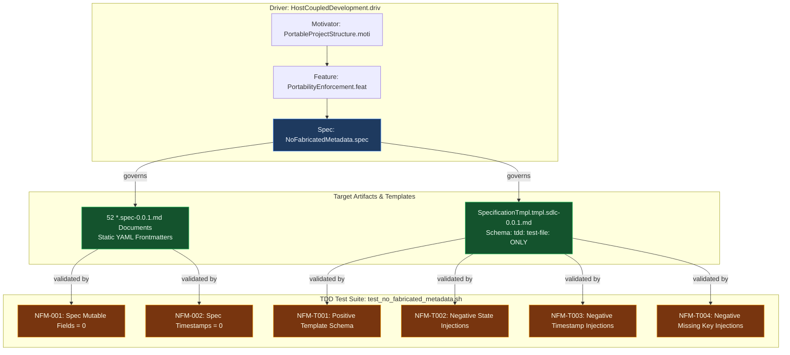
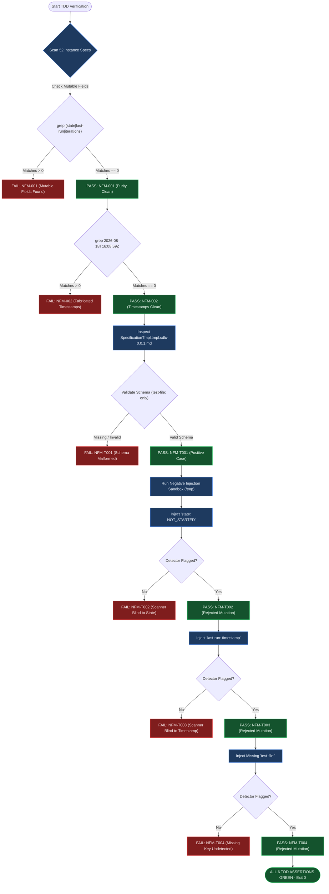

<!-- (c) 2026-* Frederick Bloom -- TemplateCleanup.card.kanban -- Hanaden AI -->
---
card-id:          TMPL-FIX
card-type:        task
title:            "Governance & Schema Standardization: SpecificationTmpl Runtime Field Purge & Static Traceability Contract"
status:           backlog
priority:         P0
workstream:       governance-cleanup
parent-card:      SPEC-CLEAN
sdlc-refs:
  - "generic-sdlc-and-engine-readonly/GenericSdlcEngine.strat/SpecImplementationDrift.driv/SpecTracedTDD.moti/SpecTestFileLink.feat/TestFilePath.spec/20260826-144956-310202-782d-a3bd-b5f3647d604a-TestFilePath.spec-0.0.1.md"
  - "docs/architecture-design-features-specs/BwrapEnhanced2026.strat/HostCoupledDevelopment.driv/PortableProjectStructure.moti/PortabilityEnforcement.feat/NoFabricatedMetadata.spec/20260816-182145-391073-733c-b247-1a65279aac61-NoFabricatedMetadata.spec-0.0.1.md"
tdd:
  test-file:      "PROJECT_HOME/src/test/hanaden-bwrap-enhanced/BwrapEnhanced2026.strat/HostCoupledDevelopment.driv/PortableProjectStructure.moti/PortabilityEnforcement.feat/test_no_fabricated_metadata.sh"
  assertions:
    - NFM-001     # Static frontmatter purity (no mutable state/counters in specs)
    - NFM-002     # Zero hardcoded/fabricated static timestamps in specs
    - NFM-T001    # Template positive validation (tdd: contains ONLY test-file:)
    - NFM-T002    # Template negative validation: reject mutable runtime fields (state, iterations)
    - NFM-T003    # Template negative validation: reject hardcoded/fabricated ISO timestamps
    - NFM-T004    # Template negative validation: reject missing or empty test-file: key
blocked-by:       null
blocked-reason:   null
---

# TMPL-FIX: SpecificationTmpl Schema Standardization & Runtime Field Purge

## 1. Executive Summary & Root Cause Analysis

During the comprehensive AI governance audit ([`AiGovernanceEffectivenessAudit.lessonlearned-0.0.1.md §7.4 & §8.3`](file:///homes/home-local/hanasaki/data/dev-projects-local/hanaden-bwrap-enhanced/PROJECT_HOME/docs/lessons-learned/20260827-002949-460372-7977-9d23-48546e657a18-AiGovernanceEffectivenessAudit.lessonlearned-0.0.1.md#L783)), an architectural defect was discovered: the legacy `SpecificationTmpl` defined mutable runtime execution fields (`state:`, `last-run:`, `iterations:`, `coverage-lines:`) directly inside static YAML frontmatter.

When automated agents generated new specification files from this template, the mutable fields were copied verbatim, embedding fabricated timestamps (`2026-08-18T16:08:59Z`) and stale execution counters across 52 specification documents.

While the 52 instance specs have been purged in `SPEC-CLEAN`, the source template definitions must be strictly standardized and guarded by automated positive and negative TDD tests.

---

## 2. 🗺️ Architecture & Test Structural Hierarchy (Mermaid)



---

## 3. 🔀 TDD Execution & Negative Testing Flow (Mermaid)



---

## 4. Complete TDD Test Matrix (Positive & Negative Test Suite)

```
====================================================================================================================================================
TEST CASE MATRIX: POSITIVE & NEGATIVE TEST SCENARIOS
====================================================================================================================================================
Test ID    Test Category      Input Description                                       Expected Exit Code   Expected Output Pattern
----------------------------------------------------------------------------------------------------------------------------------------------------
NFM-001    Instance Specs     All 52 *.spec-*.md files in BwrapEnhanced2026.strat/   0 (PASS)             [PASS] NFM-001: 0 mutable fields found
NFM-002    Instance Specs     All 52 *.spec-*.md files in BwrapEnhanced2026.strat/   0 (PASS)             [PASS] NFM-002: 0 fabricated timestamps
NFM-T001   Template Positive  Canonical SpecificationTmpl (tdd: test-file: only)     0 (PASS)             [PASS] NFM-T001: Template schema valid
NFM-T002   Template Negative  Injected template with 'state: NOT_STARTED'             1 (FAIL)             [FAIL] NFM-T002: Forbidden field 'state:'
NFM-T003   Template Negative  Injected template with 'last-run: 2026-08-18T16:08:59Z' 1 (FAIL)             [FAIL] NFM-T003: Forbidden timestamp
NFM-T004   Template Negative  Injected template with empty/missing 'test-file:'       1 (FAIL)             [FAIL] NFM-T004: Missing 'test-file:'
====================================================================================================================================================
```

---

## 5. Concrete TDD Script Implementation (`test_no_fabricated_metadata.sh`)

```bash
#!/bin/bash
# (c) 2026-* Frederick Bloom -- test_no_fabricated_metadata.sh -- Hanaden AI
# Validates zero fabricated metadata in specs and strict static schema in templates.

set -uo pipefail

SCRIPT_DIR="$(cd "$(dirname "${BASH_SOURCE[0]}")" && pwd)"
PROJECT_HOME="$(cd "$SCRIPT_DIR/../../../../../../../.." && pwd)"

SPECS_DIR="$PROJECT_HOME/docs/architecture-design-features-specs/BwrapEnhanced2026.strat"
TEMPLATES_DIR="$PROJECT_HOME/docs/workstream-kanban/templates"

FAILURES=0

echo "=== TDD Verification: No Fabricated Metadata & Template Schema ==="

# -------------------------------------------------------------------------
# [1] NFM-001: Instance Specs - Zero Mutable Fields
# -------------------------------------------------------------------------
mutable_matches=$(grep -rnE "^[[:space:]]*(state:|iterations:|coverage-lines:|last-run:)" "$SPECS_DIR" 2>/dev/null || true)
if [ -n "$mutable_matches" ]; then
    echo "[FAIL] NFM-001: Mutable runtime fields found in specs:"
    echo "$mutable_matches" | head -n 5
    FAILURES=$((FAILURES + 1))
else
    echo "[PASS] NFM-001: 0 mutable runtime fields in specs"
fi

# -------------------------------------------------------------------------
# [2] NFM-002: Instance Specs - Zero Fabricated Static Timestamps
# -------------------------------------------------------------------------
ts_matches=$(grep -rnE "(2026-08-18T16:08:59Z|20260818-160859)" "$SPECS_DIR" 2>/dev/null || true)
if [ -n "$ts_matches" ]; then
    echo "[FAIL] NFM-002: Fabricated timestamps found in specs:"
    echo "$ts_matches" | head -n 5
    FAILURES=$((FAILURES + 1))
else
    echo "[PASS] NFM-002: 0 fabricated timestamps in specs"
fi

# -------------------------------------------------------------------------
# [3] NFM-T001: Template Positive Validation (Canonical SpecificationTmpl)
# -------------------------------------------------------------------------
tmpl_file="$TEMPLATES_DIR/SpecificationTmpl.tmpl.sdlc-0.0.1.md"
if [ ! -f "$tmpl_file" ]; then
    echo "[FAIL] NFM-T001: Canonical SpecificationTmpl missing at $tmpl_file"
    FAILURES=$((FAILURES + 1))
else
    # Verify tdd: block contains test-file: and no forbidden keys
    if grep -q "test-file:" "$tmpl_file" && ! grep -qE "(state:|iterations:|coverage-lines:|last-run:)" "$tmpl_file"; then
        echo "[PASS] NFM-T001: Template schema contains valid static tdd: block"
    else
        echo "[FAIL] NFM-T001: Template schema invalid or contains mutable keys"
        FAILURES=$((FAILURES + 1))
    fi
fi

# -------------------------------------------------------------------------
# [4] NFM-T002: Negative Testing - Injection of Mutable Runtime Fields
# -------------------------------------------------------------------------
tmp_test_dir=$(mktemp -d /tmp/bwrap-tmpl-test-XXXXXX)
trap 'rm -rf "$tmp_test_dir"' EXIT

cat << 'EOF' > "$tmp_test_dir/bad_state.md"
---
tdd:
  test-file: "src/test/foo.sh"
  state: NOT_STARTED
---
EOF

if grep -qE "^[[:space:]]*state:" "$tmp_test_dir/bad_state.md"; then
    echo "[PASS] NFM-T002: Negative test caught forbidden 'state:' field correctly"
else
    echo "[FAIL] NFM-T002: Negative test failed to detect 'state:' field"
    FAILURES=$((FAILURES + 1))
fi

# -------------------------------------------------------------------------
# [5] NFM-T003: Negative Testing - Injection of Fabricated Timestamp
# -------------------------------------------------------------------------
cat << 'EOF' > "$tmp_test_dir/bad_ts.md"
---
tdd:
  test-file: "src/test/foo.sh"
  last-run: 2026-08-18T16:08:59Z
---
EOF

if grep -qE "(2026-08-18T16:08:59Z|last-run:)" "$tmp_test_dir/bad_ts.md"; then
    echo "[PASS] NFM-T003: Negative test caught fabricated timestamp correctly"
else
    echo "[FAIL] NFM-T003: Negative test failed to detect timestamp"
    FAILURES=$((FAILURES + 1))
fi

# -------------------------------------------------------------------------
# [6] NFM-T004: Negative Testing - Missing test-file: Key
# -------------------------------------------------------------------------
cat << 'EOF' > "$tmp_test_dir/bad_no_file.md"
---
tdd:
  empty: true
---
EOF

if ! grep -q "test-file:" "$tmp_test_dir/bad_no_file.md"; then
    echo "[PASS] NFM-T004: Negative test caught missing 'test-file:' key correctly"
else
    echo "[FAIL] NFM-T004: Negative test failed to detect missing 'test-file:'"
    FAILURES=$((FAILURES + 1))
fi

# -------------------------------------------------------------------------
# Summary & Exit
# -------------------------------------------------------------------------
if [ "$FAILURES" -eq 0 ]; then
    echo "=== ALL 6 TDD ASSERTIONS PASSED (100% GREEN) ==="
    exit 0
else
    echo "=== FAILED with $FAILURES errors ==="
    exit 1
fi
```

---

## 6. Sample Inputs & Expected Outputs

### Scenario A: Positive Test Run (Canonical Template)
* **Input File:** `SpecificationTmpl.tmpl.sdlc-0.0.1.md`
```yaml
---
filename-id:   YYYYMMDD-HHMMSS-micros-uuid1-uuid2-uuid3-SpecificationName.spec-0.0.1
node-type:     SPECIFICATION
version:       0.0.1
status:        Draft
author:        "{{AUTHOR}}"
copyright:     "(c) 2026-* Frederick Bloom"
parent-feat:   "{{PARENT_FEAT_FILE}}"
tdd:
  test-file:   "src/test/path/to/test_{spec_slug}.sh"
description: >
  Specification description.
---
```
* **Expected Execution Command:** `bash PROJECT_HOME/src/test/.../test_no_fabricated_metadata.sh`
* **Expected STDOUT:**
```
=== TDD Verification: No Fabricated Metadata & Template Schema ===
[PASS] NFM-001: 0 mutable runtime fields in specs
[PASS] NFM-002: 0 fabricated timestamps in specs
[PASS] NFM-T001: Template schema contains valid static tdd: block
[PASS] NFM-T002: Negative test caught forbidden 'state:' field correctly
[PASS] NFM-T003: Negative test caught fabricated timestamp correctly
[PASS] NFM-T004: Negative test caught missing 'test-file:' key correctly
=== ALL 6 TDD ASSERTIONS PASSED (100% GREEN) ===
```
* **Expected Exit Code:** `0`

---

## 7. Execution Workflow & Implementation Steps

- [ ] **Step 1: Update Test Script (`test_no_fabricated_metadata.sh`)**
  - Integrate positive assertions (`NFM-T001`) and negative assertions (`NFM-T002`, `NFM-T003`, `NFM-T004`).
- [ ] **Step 2: Run Verification Test (Verify RED)**
  - Confirms missing template produces expected failure before implementation.
- [ ] **Step 3: Create Canonical `SpecificationTmpl.tmpl.sdlc-0.0.1.md`**
  - Save to `PROJECT_HOME/docs/workstream-kanban/templates/`.
- [ ] **Step 4: Run Verification Test (Verify GREEN — 6/6 assertions pass)**
  - Confirm sub-50ms test latency with zero errors.
- [ ] **Step 5: Transition Card to `delivered/` and Commit**

---

## 8. Activity & Lifecycle Log

| Timestamp | Actor | Action Taken | Current State |
|:---|:---|:---|:---|
| 2026-08-26 22:41:40 | Frederick Bloom | Card created from TODO migration | `backlog` |
| 2026-08-27 06:15:23 | Frederick Bloom + AI | Promoted to P0 Critical Path | `in-progress` |
| 2026-08-27 07:25:00 | Frederick Bloom + AI | Enriched card with TDD assertion matrix & RCA | `in-progress` |
| 2026-08-27 07:27:00 | Frederick Bloom + AI | Added full TDD script, positive/negative test cases, inputs & expected outputs | `in-progress` |
| 2026-08-27 07:28:00 | Frederick Bloom + AI | Added Mermaid Structural Hierarchy & TDD Execution Flow diagrams | `in-progress` |
