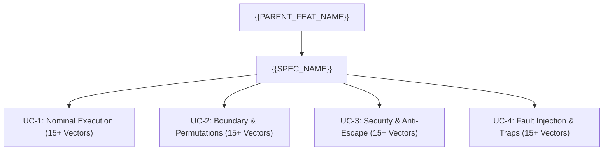

<!-- (c) 2026-* Frederick Bloom -- SpecificationTmpl.tmpl.sdlc-0.0.1.md -- Hanaden AI -->
---
filename-id:   YYYYMMDD-HHMMSS-micros-uuid1-uuid2-uuid3-SpecificationName.spec-0.0.1
node-type:     SPECIFICATION
version:       0.0.1
status:        Draft | Active | Deprecated
author:        "{{AUTHOR}}"
copyright:     "(c) 2026-* Frederick Bloom"
parent-feat:   "{{PARENT_FEAT_FILE}}"
tdd:
  test-file:   "src/test/.../test_{spec_slug}.sh"
description: >
  {{SPECIFICATION_DESCRIPTION}}
---

# {{SPEC_TITLE}}

## 1. Architectural Overview & Boundary Contract

{{ARCHITECTURAL_OVERVIEW_AND_RATIONALE}}

---

## 2. UC-1: Standard Execution & Nominal Operations (>= 15 Test Vectors)

| Vector ID | Scenario / Input Vector | Host Precondition | Invocation Command | Exit | Expected Output Pattern | Boundary Assertion |
|:---|:---|:---|:---|:---:|:---|:---|
| {{SPEC_PREFIX}}-UC1-01 | Standard positive invocation | Nominal host environment | `bwrap-enhanced.sh ...` | 0 | `[EXPECTED_PATTERN]` | Nominal execution verified |
| {{SPEC_PREFIX}}-UC1-02 | Secondary nominal parameter | Standard user environment | `bwrap-enhanced.sh ...` | 0 | `[EXPECTED_PATTERN]` | Subshell output verified |
| {{SPEC_PREFIX}}-UC1-03 | Default configuration stat | Standard file modes | `bwrap-enhanced.sh ...` | 0 | `[EXPECTED_PATTERN]` | Attributes preserved |
| {{SPEC_PREFIX}}-UC1-04 | User identity verification | Standard UID/GID | `bwrap-enhanced.sh ...` | 0 | `[EXPECTED_PATTERN]` | User mapping verified |
| {{SPEC_PREFIX}}-UC1-05 | Temporary file creation | Writable target | `bwrap-enhanced.sh ...` | 0 | `[EXPECTED_PATTERN]` | Write in sandbox verified |
| {{SPEC_PREFIX}}-UC1-06 | Temporary file readback | Target file exists | `bwrap-enhanced.sh ...` | 0 | `[EXPECTED_PATTERN]` | Read integrity verified |
| {{SPEC_PREFIX}}-UC1-07 | Subdirectory creation | Writable parent | `bwrap-enhanced.sh ...` | 0 | `[EXPECTED_PATTERN]` | Subdirectory verified |
| {{SPEC_PREFIX}}-UC1-08 | Directory listing | Entries exist | `bwrap-enhanced.sh ...` | 0 | `[EXPECTED_PATTERN]` | Entry list verified |
| {{SPEC_PREFIX}}-UC1-09 | File deletion | File exists | `bwrap-enhanced.sh ...` | 0 | `[EXPECTED_PATTERN]` | Clean deletion verified |
| {{SPEC_PREFIX}}-UC1-10 | Mount point inspection | /proc/mounts active | `bwrap-enhanced.sh ...` | 0 | `[EXPECTED_PATTERN]` | Mount entry verified |
| {{SPEC_PREFIX}}-UC1-11 | Working directory traversal | Cwd in sandbox | `bwrap-enhanced.sh ...` | 0 | `[EXPECTED_PATTERN]` | Cwd integrity verified |
| {{SPEC_PREFIX}}-UC1-12 | Environment variable propagation | Standard env | `bwrap-enhanced.sh ...` | 0 | `[EXPECTED_PATTERN]` | Env variable verified |
| {{SPEC_PREFIX}}-UC1-13 | Batch sequential commands | Standard shell loop | `bwrap-enhanced.sh ...` | 0 | `[EXPECTED_PATTERN]` | Loop execution verified |
| {{SPEC_PREFIX}}-UC1-14 | Glob expansion | Wildcards present | `bwrap-enhanced.sh ...` | 0 | `[EXPECTED_PATTERN]` | Globbing verified |
| {{SPEC_PREFIX}}-UC1-15 | Teardown host verification | Post-exit host check | `[Host CLI check]` | 0 | `[HOST UNCHANGED]` | Zero host residue verified |

---

## 3. UC-2: Boundary Constraints & Flag Permutations (>= 15 Test Vectors)

| Vector ID | Scenario / Input Vector | Combination Flags | Invocation Command | Exit | Expected Output Pattern | Boundary Assertion |
|:---|:---|:---|:---|:---:|:---|:---|
| {{SPEC_PREFIX}}-UC2-01 | Permutation with --share-net | `--share-net` | `bwrap-enhanced.sh --share-net ...` | 0 | `[EXPECTED_PATTERN]` | Network flag neutral |
| {{SPEC_PREFIX}}-UC2-02 | Permutation with --ro-bind | `--ro-bind /target` | `bwrap-enhanced.sh --ro-bind ...` | 0 | `[EXPECTED_PATTERN]` | RO bind compatible |
| {{SPEC_PREFIX}}-UC2-03 | Override bind to specific path | `--bind /custom` | `bwrap-enhanced.sh --bind ...` | 0 | `[EXPECTED_PATTERN]` | Last-wins passthrough |
| {{SPEC_PREFIX}}-UC2-04 | Tilde expansion resolution | `~/target/dir` | `bwrap-enhanced.sh --ro-bind ~/dir ...` | 0 | `[EXPECTED_PATTERN]` | Tilde expands to host HOME |
| {{SPEC_PREFIX}}-UC2-05 | Relative symlink resolution | Symlink in path | `bwrap-enhanced.sh ...` | 0 | `[EXPECTED_PATTERN]` | Path canonicalization |
| {{SPEC_PREFIX}}-UC2-06 | Deep nested directory hierarchy | Depth > 5 | `bwrap-enhanced.sh mkdir -p ...` | 0 | `[EXPECTED_PATTERN]` | Nested path traversal |
| {{SPEC_PREFIX}}-UC2-07 | Read-only child remount | Child mount flag | `bwrap-enhanced.sh ...` | 0 | `[EXPECTED_PATTERN]` | Child RO enforcement |
| {{SPEC_PREFIX}}-UC2-08 | Permutation with --enable-wayland | `--enable-wayland` | `bwrap-enhanced.sh --enable-wayland ...` | 0 | `[EXPECTED_PATTERN]` | Wayland passthrough neutral |
| {{SPEC_PREFIX}}-UC2-09 | Permutation with --enable-audio | `--enable-audio` | `bwrap-enhanced.sh --enable-audio ...` | 0 | `[EXPECTED_PATTERN]` | Audio socket neutral |
| {{SPEC_PREFIX}}-UC2-10 | Permutation with --enable-mise-ro | `--enable-mise-ro` | `bwrap-enhanced.sh --enable-mise-ro ...` | 0 | `[EXPECTED_PATTERN]` | Toolchain passthrough neutral |
| {{SPEC_PREFIX}}-UC2-11 | Permutation with --unsetenv | `--unsetenv VAR` | `bwrap-enhanced.sh --unsetenv VAR ...` | 0 | `[EXPECTED_PATTERN]` | Env variable unset neutral |
| {{SPEC_PREFIX}}-UC2-12 | Large payload buffer allocation | Multi-megabyte buffer | `bwrap-enhanced.sh dd ...` | 0 | `[EXPECTED_PATTERN]` | Buffer capacity handled |
| {{SPEC_PREFIX}}-UC2-13 | File mode attribute modification | `chmod 600` | `bwrap-enhanced.sh chmod 600 ...` | 0 | `600` | Modes retained in sandbox |
| {{SPEC_PREFIX}}-UC2-14 | Timestamp modification | `touch -t` | `bwrap-enhanced.sh touch -t ...` | 0 | `[EXPECTED_PATTERN]` | mtime modified in sandbox |
| {{SPEC_PREFIX}}-UC2-15 | Concurrent subprocess execution | 5 subshells | `bwrap-enhanced.sh bash -c "..."` | 0 | `[EXPECTED_PATTERN]` | Multi-process concurrency |

---

## 4. UC-3: Security Boundaries & Anti-Escape Enforcement (>= 15 Test Vectors)

| Vector ID | Threat Scenario / Attack Vector | Target Path | Invocation Command | Exit | Expected Output Pattern | Security Defense |
|:---|:---|:---|:---|:---:|:---|:---|
| {{SPEC_PREFIX}}-UC3-01 | Unauthorized host credential read | Host `.ssh` / `.gnupg` | `bwrap-enhanced.sh cat ...` | 1 | `No such file or directory` | Host credentials masked |
| {{SPEC_PREFIX}}-UC3-02 | Unauthorized host path write | Host unmanaged path | `bwrap-enhanced.sh touch ...` | 1 | `Permission denied / Not found` | Host filesystem protected |
| {{SPEC_PREFIX}}-UC3-03 | Sandbox unmount escape attempt | `umount` syscall | `bwrap-enhanced.sh umount ...` | 1 | `Operation not permitted` | Capabilities dropped |
| {{SPEC_PREFIX}}-UC3-04 | Pivot root escape attempt | `pivot_root` | `bwrap-enhanced.sh pivot_root ...` | 1 | `Operation not permitted` | Namespace sealed |
| {{SPEC_PREFIX}}-UC3-05 | Symlink traversal escape to /etc | `/etc/shadow` | `bwrap-enhanced.sh cat /link/to/shadow` | 1 | `Permission denied` | Root RO enforced |
| {{SPEC_PREFIX}}-UC3-06 | Cross-device hardlink escape | Hardlink to host | `bwrap-enhanced.sh ln ...` | 1 | `Invalid cross-device link` | Device boundary sealed |
| {{SPEC_PREFIX}}-UC3-07 | Host network mount storm attempt | Non-existent path loop | `bwrap-enhanced.sh ls ...` | 2 | `No such file or directory` | Zero network triggers |
| {{SPEC_PREFIX}}-UC3-08 | Device node creation attempt | `mknod` char device | `bwrap-enhanced.sh mknod ...` | 1 | `Operation not permitted` | nodev mount option |
| {{SPEC_PREFIX}}-UC3-09 | SUID root privilege escalation | `chmod +s` binary | `bwrap-enhanced.sh cp ... && chmod +s` | 0 | Non-root UID output | nosuid enforced |
| {{SPEC_PREFIX}}-UC3-10 | Chroot boundary breakout | `chroot` command | `bwrap-enhanced.sh chroot ...` | 1 | `Operation not permitted` | Chroot restricted |
| {{SPEC_PREFIX}}-UC3-11 | Procfs root leakage check | `/proc/1/root` | `bwrap-enhanced.sh ls /proc/1/root` | 0 | Points to sandbox root | Proc root isolated |
| {{SPEC_PREFIX}}-UC3-12 | Mountinfo namespace leakage | `/proc/self/mountinfo` | `bwrap-enhanced.sh cat /proc/mountinfo`| 0 | Only sandbox mounts | Mount namespace isolated |
| {{SPEC_PREFIX}}-UC3-13 | Sandbox mount point destruction | `rm -rf /mountpoint` | `bwrap-enhanced.sh rm -rf ...` | 1 | `Device or resource busy` | Mount point protected |
| {{SPEC_PREFIX}}-UC3-14 | Superblock inode discrepancy check | `stat -c %i` | `bwrap-enhanced.sh stat -c %i ...` | 0 | Sandbox inode != Host inode | Separate filesystem superblock |
| {{SPEC_PREFIX}}-UC3-15 | Persistent background daemon escape | Background sleep & exit| `bwrap-enhanced.sh bash -c "sleep 100 &"`| 0 | `[PROCESS REAPED]` | Foreground hold reaps children |

---

## 5. UC-4: Fault Injection & Negative Mutation Traps (>= 15 Test Vectors)

| Vector ID | Fault / Mutation Scenario | Injected Condition | Invocation Command | Exit | Expected Output Pattern | Recovery & Error Trap |
|:---|:---|:---|:---|:---:|:---|:---|
| {{SPEC_PREFIX}}-UC4-01 | Missing host source directory | Deleted host path | `bwrap-enhanced.sh ...` | 0 | `[RECOVERED / MASKED]` | Resilient to missing path |
| {{SPEC_PREFIX}}-UC4-02 | Resource quota exhaustion | Fill sandbox storage | `bwrap-enhanced.sh dd ...` | 1 | `No space left on device` | Safe error without host crash |
| {{SPEC_PREFIX}}-UC4-03 | CLI argument order permutation | Flags after payload | `bwrap-enhanced.sh ls --flag` | 0 | Passed as command argument | Deterministic CLI parsing |
| {{SPEC_PREFIX}}-UC4-04 | Unknown bwrap CLI argument | `--invalid-flag-xyz` | `bwrap-enhanced.sh --invalid-flag-xyz` | 1 | `Unknown option` | Explicit failure trap |
| {{SPEC_PREFIX}}-UC4-05 | Empty command invocation | Zero payload args | `bwrap-enhanced.sh` | 1 | `Empty command fatal` | ECF trap triggered |
| {{SPEC_PREFIX}}-UC4-06 | Non-existent binary path | Binary missing | `bwrap-enhanced.sh /bin/missing` | 127 | `No such file or directory` | POSIX 127 preserved |
| {{SPEC_PREFIX}}-UC4-07 | Non-executable target binary | Permission non-exec | `bwrap-enhanced.sh /etc/hosts` | 126 | `Permission denied` | POSIX 126 preserved |
| {{SPEC_PREFIX}}-UC4-08 | Subshell non-zero exit code | Subshell `exit 42` | `bwrap-enhanced.sh bash -c "exit 42"` | 42 | `[EMPTY]` | Exit code 42 returned |
| {{SPEC_PREFIX}}-UC4-09 | SIGINT interrupt propagation | Ctrl-C / SIGINT | `bwrap-enhanced.sh sleep 10` + `kill -2` | 130 | `[TERMINATED]` | 128+2 = 130 exit code |
| {{SPEC_PREFIX}}-UC4-10 | SIGTERM termination propagation | `kill -15` | `bwrap-enhanced.sh sleep 10` + `kill -15` | 143 | `[TERMINATED]` | 128+15 = 143 exit code |
| {{SPEC_PREFIX}}-UC4-11 | Zero-permission directory read | Mode 000 directory | `bwrap-enhanced.sh ls /dir000` | 1 | `Permission denied` | POSIX EACCES trapped |
| {{SPEC_PREFIX}}-UC4-12 | Filename length boundary overflow | Name > 255 bytes | `bwrap-enhanced.sh touch /homes/name256` | 1 | `File name too long` | ENAMETOOLONG trapped |
| {{SPEC_PREFIX}}-UC4-13 | Path length boundary overflow | Path > 4096 bytes | `bwrap-enhanced.sh mkdir -p /homes/path` | 1 | `File name too long` | ENAMETOOLONG trapped |
| {{SPEC_PREFIX}}-UC4-14 | Recursive symlink loop trap | `ln -s a b && ln -s b a` | `bwrap-enhanced.sh ls -L /homes/a` | 1 | `Too many levels of symlinks`| ELOOP trapped |
| {{SPEC_PREFIX}}-UC4-15 | Read-only rootfs write mutation | Write to `/usr` | `bwrap-enhanced.sh touch /usr/bin/hack` | 1 | `Read-only file system` | EROFS trapped |
