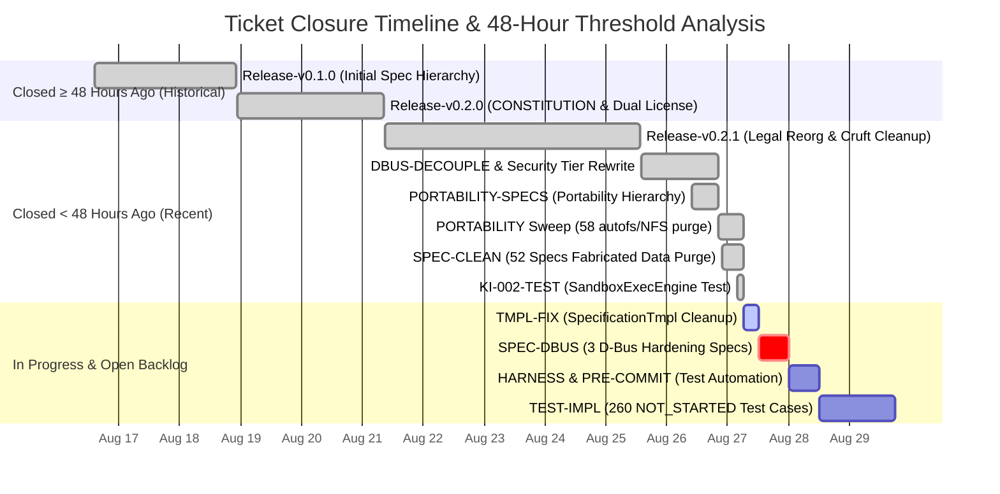
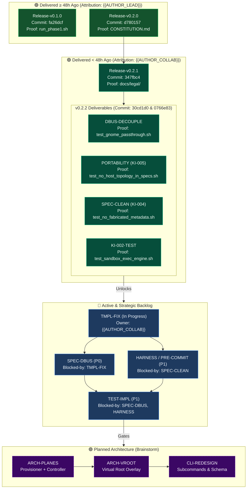
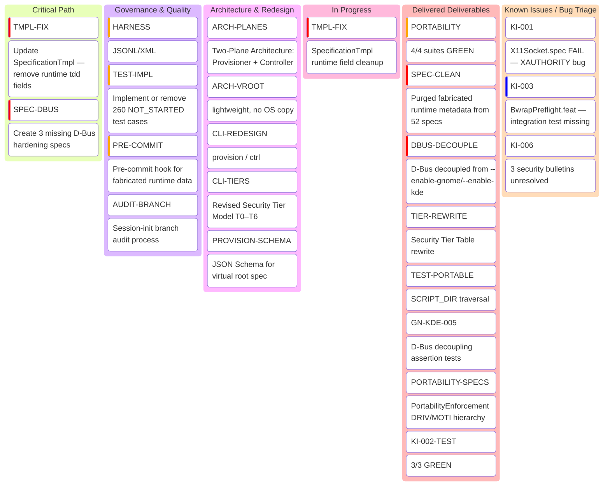

<!-- (c) 2026-* Frederick Bloom -- Workstream Kanban Status Snapshot Template -- Hanaden AI -->
---
filename-id:   YYYYMMDD-HHMMSS-micros-uuid1-uuid2-uuid3-WorkstreamKanbanStatusSnapshotTmpl.tmpl.kanban-0.0.1
node-type:     TEMPLATE
version:       0.0.1
status:        Active
author:        "{{AUTHOR}}"
copyright:     "(c) 2026-* Frederick Bloom"
timestamp:     "{{TIMESTAMP_ISO}}"
branch:        "{{GIT_BRANCH}}"
commit:        "{{GIT_COMMIT_SHA}}"
test-suite:    "{{TESTS_PASSED}}/{{TESTS_TOTAL}} PASS ({{TEST_PASS_PCT}}% GREEN)"
description: >
  Standard template for point-in-time Workstream Kanban Status Snapshots,
  48-hour ticket lifecycle audit, human-driven TDD progression metrics,
  and complete Mermaid visualization models.
---

# Workstream Kanban Status Snapshot: {{PROJECT_NAME}}

> **Recorded At:** `{{RECORDED_AT_LOCAL_TIMESTAMP}}`  
> **Commit Ref:** `{{GIT_COMMIT_SHA}}` · **Branch:** `{{GIT_BRANCH}}`  
> **Repository Test State:** **{{TESTS_PASSED}} / {{TESTS_TOTAL}} PASSED ({{TEST_PASS_PCT}}% GREEN)**

---

## 1. ⏱️ Status Changes (Last 24 Hours)

| Item Key | Was (24h Ago) | Now (Current) | Change Summary / Technical Driver |
|:---|:---|:---|:---|
| **`{{ITEM_KEY_1}}`** | {{PREV_STATUS_1}} | **{{CURR_STATUS_1}}** | {{CHANGE_SUMMARY_1}} |
| **`{{ITEM_KEY_2}}`** | {{PREV_STATUS_2}} | **{{CURR_STATUS_2}}** | {{CHANGE_SUMMARY_2}} |
| **`{{ITEM_KEY_3}}`** | {{PREV_STATUS_3}} | **{{CURR_STATUS_3}}** | {{CHANGE_SUMMARY_3}} |
| **Repo Test Suite**  | {{PREV_PASSED}} / {{PREV_TOTAL}} ({{PREV_PCT}}%) | **{{TESTS_PASSED}} / {{TESTS_TOTAL}} ({{TEST_PASS_PCT}}% GREEN)** | {{TEST_SUITE_DELTA_SUMMARY}} |

---

## 2. 📊 Master Ticket Register (Attribution, Close Reasons, Age & 48h Audit)

**Reference Audit Timestamp:** `{{AUDIT_TIMESTAMP}}`  
**48-Hour Threshold Cutoff:** `{{THRESHOLD_48H_TIMESTAMP}}`

```
========================================================================================================================================================================================================
MASTER TICKET REGISTER: LIFECYCLE, ATTRIBUTION, RESOLUTION REASONS, AGE, AND VERIFICATION AUDIT
========================================================================================================================================================================================================
Ticket Key           Category    Status       Who Closed           Closed Timestamp          Age (Mins / Hrs / Days)   >=48h?   Commit    Close Reason / Technical Resolution              Verification Proof
--------------------------------------------------------------------------------------------------------------------------------------------------------------------------------------------------------
[DELIVERED RELEASES & HISTORICAL INITIATIVES]
{{HISTORICAL_TICKET_ROWS}}

[DELIVERED IN CURRENT SPRINT / RELEASE]
{{DELIVERED_RECENT_TICKET_ROWS}}

[ACTIVE & IN-PROGRESS]
{{ACTIVE_IN_PROGRESS_ROWS}}

[STRATEGIC BACKLOG P0 - P2]
{{STRATEGIC_BACKLOG_ROWS}}

[OPEN BUGS & TRIAGE]
{{OPEN_BUGS_TRIAGE_ROWS}}

[PLANNED ARCHITECTURE & REDESIGN]
{{PLANNED_ARCHITECTURE_ROWS}}
========================================================================================================================================================================================================
```

---

## 3. ⏱️ Visual 48-Hour Timeline & Age Distribution (Mermaid Gantt)



---

## 4. 🔀 Ticket Lifecycle, Attribution & Verification Proof Graph (Mermaid Flowchart)



---

## 5. 🥧 Status Distribution Model (Mermaid Pie Chart)


---

## 6. 🗂️ Interactive Kanban Board State (Mermaid Kanban)


