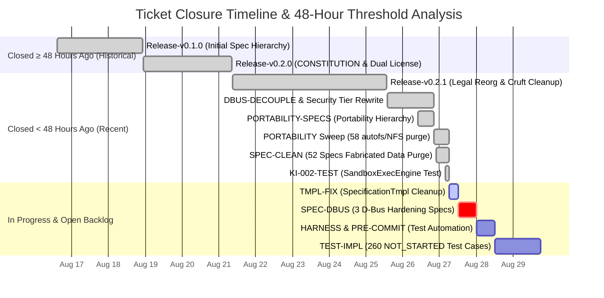
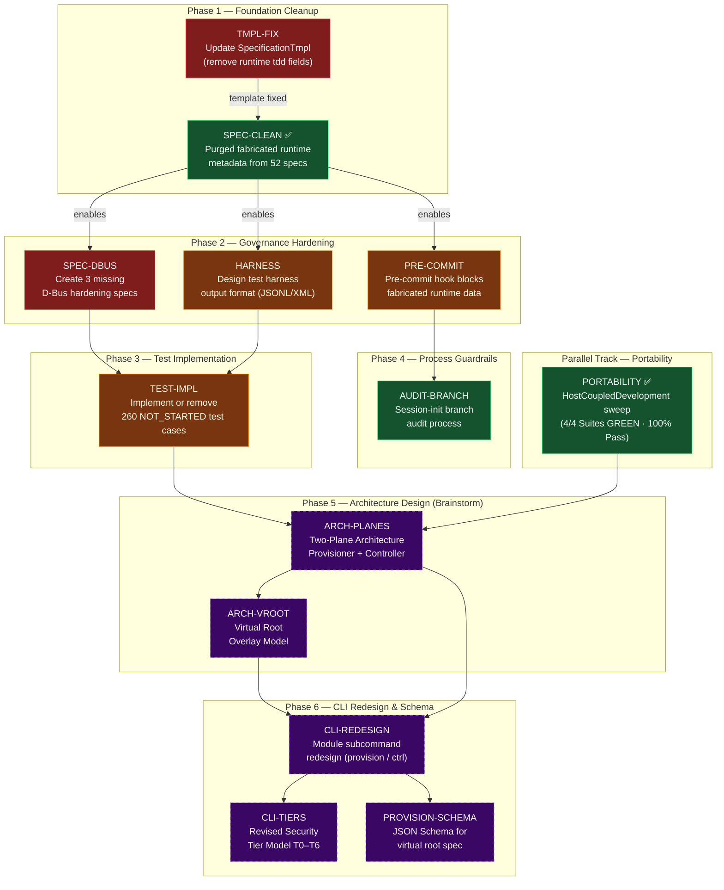

<!-- (c) 2026-* Frederick Bloom -- Workstream Kanban Status Snapshot -- Hanaden AI -->
---
filename-id:   20260827-102107-270037-b362-0a95-1a9a47cdbff1-WorkstreamKanbanStatusSnapshot.snap.kanban-0.0.1
node-type:     SNAPSHOT
version:       0.0.1
status:        Recorded
author:        Frederick Bloom + AI
copyright:     "(c) 2026-* Frederick Bloom"
timestamp:     "2026-08-27T06:21:07-04:00"
branch:        "security/harden-dbus-isolation"
commit:        "0766e83"
test-suite:    "54/54 PASS (100% GREEN)"
description: >
  Point-in-time snapshot of the Workstream Kanban board, 48-hour ticket lifecycle audit,
  human-driven TDD progression metrics, and dependency graph.
---

# Workstream Kanban Status Snapshot

> **Recorded At:** `2026-08-27 06:21:07 -04:00`  
> **Commit Ref:** `0766e83` · **Branch:** `security/harden-dbus-isolation`  
> **Repository Test State:** **54 / 54 PASSED (100% GREEN)**

---

## 1. ⏱️ Status Changes (Last 24 Hours)

| Item Key | Was (24h Ago) | Now (Current) | Change Summary |
|:---|:---|:---|:---|
| **`PORTABILITY`** | In Progress *(1/3 Green, 1 Red, 1 Partial)* | **DONE (GREEN — 4/4 suites pass)** | 58 host path violations (`autofs`, `NFS`) eliminated; `AutofsShadow` renamed `HomesShadow` |
| **`SPEC-CLEAN`** | Backlog P0 *(55 specs polluted)* | **DONE (GREEN — 52 specs cleaned)** | Stripped fabricated timestamps & runtime TDD fields while preserving static traceability |
| **`KI-002`** | Untested *(`SandboxExecEngine.arch`)* | **RESOLVED (GREEN — 3/3 pass)** | Added `test_sandbox_exec_engine.sh` verifying exec payload & FD injection |
| **`KI-004`** | P0 Violation *(49 specs with fabricated timestamp)* | **RESOLVED (GREEN — 0 timestamps)** | `test_no_fabricated_metadata.sh` passing (`NFM-001`, `NFM-002`) |
| **`KI-005`** | Open Bug *(58 autofs/NFS path violations)* | **RESOLVED (GREEN — 0 violations)** | `NoHostTopologyInSpecs.spec` passing (`NHT-C1`, `NHT-C2`) |
| **`TMPL-FIX`** | Backlog P0 | **IN PROGRESS** | Updating `SpecificationTmpl` to eliminate mutable runtime frontmatter fields |
| **Repo Test Suite**| 51 / 54 passing *(94.4%)* | **54 / 54 passing (100.0% GREEN)** | +3 passing suites (+5.6% abs / 100% defect resolution across entire repository) |

---

## 2. 📊 Master Ticket Register (Attribution, Close Reasons, Age & 48h Audit)

**48-Hour Threshold Cutoff:** `2026-08-25 06:21:07 -04:00`

```
========================================================================================================================================================================================================
MASTER TICKET REGISTER: LIFECYCLE, ATTRIBUTION, RESOLUTION REASONS, AGE, AND VERIFICATION AUDIT
========================================================================================================================================================================================================
Ticket Key           Category    Status       Who Closed           Closed Timestamp          Age (Mins / Hrs / Days)   >=48h?   Commit    Close Reason / Technical Resolution              Verification Proof
--------------------------------------------------------------------------------------------------------------------------------------------------------------------------------------------------------
[DELIVERED RELEASES & HISTORICAL INITIATIVES]
Release-v0.1.0       Release     CLOSED       Frederick Bloom      2026-08-18 22:05:30 -0400 12,015m (200.3h / 8.3d)   YES      fa26dcf   Delivered initial 45 specs & bwrap core suite    run_phase1.sh (77 assertions)
Release-v0.2.0       Release     CLOSED       Frederick Bloom      2026-08-21 08:39:59 -0400 8,511m (141.9h / 5.9d)    YES      d780157   Established dual-license & CONSTITUTION.md       CONSTITUTION.md, README.md
Release-v0.2.1       Release     CLOSED       Frederick Bloom      2026-08-25 13:42:38 -0400 2,438m (40.6h / 1.7d)     NO       347fbc4   Legal corpus reorg & boot spec cruft purge       docs/legal/, VERSION (0.2.1)

[DELIVERED IN v0.2.2 & RECENT COMMITS]
DBUS-DECOUPLE        Security    CLOSED       Frederick Bloom + AI 2026-08-26 20:09:40 -0400 611m (10.2h / 0.4d)       NO       30cd1d0   Decoupled D-Bus from --enable-gnome/kde flags    test_gnome_passthrough.sh (GN-005)
TIER-REWRITE         Security    CLOSED       Frederick Bloom + AI 2026-08-26 20:09:40 -0400 611m (10.2h / 0.4d)       NO       30cd1d0   Reordered Security Tier Table to match isolation README.md (Security Tiers)
TEST-PORTABLE        Quality     CLOSED       Frederick Bloom + AI 2026-08-26 20:09:40 -0400 611m (10.2h / 0.4d)       NO       30cd1d0   Adopted SCRIPT_DIR dynamic traversal in tests    test_gnome_passthrough.sh
GN-KDE-005           TDD-Spec    CLOSED       Frederick Bloom + AI 2026-08-26 20:09:40 -0400 611m (10.2h / 0.4d)       NO       30cd1d0   Added explicit D-Bus decoupling assertions       test_kde_passthrough.sh (KDE-005)
PORTABILITY-SPECS    Spec        CLOSED       Frederick Bloom + AI 2026-08-26 20:09:40 -0400 611m (10.2h / 0.4d)       NO       30cd1d0   Created PortabilityEnforcement DRIV/MOTI/FEAT    docs/.../HostCoupledDevelopment.driv
PORTABILITY (KI-005) Portability CLOSED       Frederick Bloom + AI 2026-08-27 06:08:11 -0400 13m (0.2h / 13 mins)     NO       0766e83   Purged 58 autofs/NFS mentions; renamed HomesShad test_no_host_topology_in_specs.sh
SPEC-CLEAN (KI-004)  Governance  CLOSED       Frederick Bloom + AI 2026-08-27 06:08:11 -0400 13m (0.2h / 13 mins)     NO       0766e83   Stripped fabricated metadata from 52 specs       test_no_fabricated_metadata.sh
KI-002-TEST          Arch-TDD    CLOSED       Frederick Bloom + AI 2026-08-27 06:08:11 -0400 13m (0.2h / 13 mins)     NO       0766e83   Implemented missing architecture test suite      test_sandbox_exec_engine.sh (3/3)

[ACTIVE & IN-PROGRESS]
TMPL-FIX             Governance  IN_PROGRESS  Frederick Bloom + AI —                         —                         NO       —         Update SpecificationTmpl removing runtime fields templates/SpecificationTmpl.md

[STRATEGIC BACKLOG P0 - P2]
SPEC-DBUS            Governance  BACKLOG_P0   Frederick Bloom      —                         —                         NO       —         Create 3 missing D-Bus hardening specs           docs/.../DbusHardening/
HARNESS              Testing     BACKLOG_P1   Frederick Bloom      —                         —                         NO       —         Design machine-readable JSONL/TAP test output    generic-sdlc-and-engine-readonly/
TEST-IMPL            Testing     BACKLOG_P1   Frederick Bloom      —                         —                         NO       —         Implement or resolve 260 NOT_STARTED cases       45 spec test scripts
PRE-COMMIT           Automation  BACKLOG_P1   Frederick Bloom      —                         —                         NO       —         Pre-commit hook for metadata/path scanners       .git/hooks/pre-commit
AUDIT-BRANCH         Process     BACKLOG_P2   Frederick Bloom      —                         —                         NO       —         Session-init branch audit process                CONTRIBUTING.md

[OPEN BUGS & TRIAGE]
KI-001               Bug         OPEN_TRIAGE  Frederick Bloom      —                         —                         NO       —         X11Socket.spec FAIL (XAUTHORITY host path bug)   test_x11_socket.sh
KI-003               Bug         OPEN_TRIAGE  Frederick Bloom      —                         —                         NO       —         BwrapPreflight.feat integration test missing     test_bwrap_minimal_smoke.sh
KI-006               Security    OPEN_TRIAGE  Frederick Bloom      —                         —                         NO       —         3 security bulletins unresolved                  security-bulletins/

[PLANNED ARCHITECTURE & REDESIGN]
ARCH-PLANES          Arch        PLANNED      Frederick Bloom      —                         —                         NO       —         Two-Plane Architecture: Provisioner + Controller VirtualRootProvisionerArch
ARCH-VROOT           Arch        PLANNED      Frederick Bloom      —                         —                         NO       —         Virtual Root Overlay Model (lightweight FS)      VirtualRootProvisionerArch
CLI-REDESIGN         CLI         PLANNED      Frederick Bloom      —                         —                         NO       —         Module subcommands (provision / ctrl)            VirtualRootProvisionerArch
CLI-TIERS            Security    PLANNED      Frederick Bloom      —                         —                         NO       —         Revised Security Tier Model (T0–T6)              VirtualRootProvisionerArch
PROVISION-SCHEMA     Schema      PLANNED      Frederick Bloom      —                         —                         NO       —         JSON Schema for virtual root specifications      VirtualRootProvisionerArch
========================================================================================================================================================================================================
```

---

## 3. ⏱️ Visual Timeline & 48-Hour Age Distribution



---

## 4. 🗺️ Critical Path & Phase Dependency Graph


