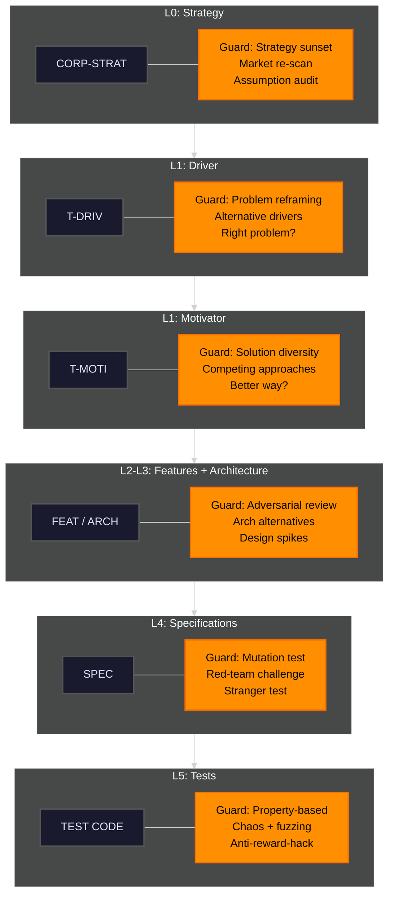

<!-- (c) 2026-* Frederick Bloom -- 20260818-033649-124680-7266-a219-84d3929f1e0a-SdlcEngineSpec.system-0.0.2.md -- Hanaden AI -->
---
ai-lock: FATAL
editor-lock: FATAL
lock-policy: >
  READ-ONLY. Any AI agent, editor plugin, automation, or process that attempts
  to edit, write, modify, or overwrite this file without EXPLICIT user direction
  is in FATAL violation. HALT immediately. No exceptions. No implicit edits.
  No refactoring. No formatting. No "fixing." User must explicitly say
    "edit SdlcEngineSpec" or equivalent before any write is permitted.
filename-id: 20260818-033649-124680-7266-a219-84d3929f1e0a-SdlcEngineSpec.system-0.0.2
node-type: SYSTEM
layer: 0
version: 0.0.2
status: Draft
author: Frederick Bloom + Claude (Cursor AI)
copyright: "(c) 2026-* Frederick Bloom"
supersedes: 20260818-033649-124680-7266-a219-84d3929f1e0a-SdlcEngineSpec.system-0.0.1
uuid-prefix-reuse: intentional-identity-continuity
description: >
  Generic SDLC Deterministic Orchestrator Workflow Engine Specification.
  Defines a fully implementable software engine for managing the complete
  software development lifecycle as an event-sourced, deterministic state machine
  with parallel orchestration, anti-fixation guards, emergency circuit breakers,
  and emergent component harvesting. Generic for any level of sub-agent or team
  orchestration. Project-agnostic -- instantiable for any codebase.
  v0.0.2 adds a first-class workstream kanban + exclusive-ownership parallel
  subagent + merge-point fan-in model on the existing event bus. UUID prefix
  is reused from 0.0.1 by explicit user ruling (identity continuity).
scope: generic
keywords:
  - sdlc
  - tdd
  - deterministic-engine
  - event-sourcing
  - state-machine
  - kanban
  - workstream-kanban
  - merge-point
  - parallel-execution
  - star-topology
  - circuit-breaker
  - anti-fixation
  - harvesting
  - soa
  - microservice
cross-references:
  - SPEC-SDLC-ARTIFACT-MODEL
  - SPEC-SDLC-KANBAN
  - SPEC-DEFECT-SEVERITY
  - SPEC-INCIDENT-REPORTS
  - 20260827-032351-153784-198a-2703-3f584ebf95d7-GenericWorkstreamKanbanEngine.kanban-0.0.1
changelog:
  - version: 0.0.2
    date: 2026-08-30
    author: Frederick Bloom + Claude (Cursor AI)
    notes: >
      Additive workstream kanban, exclusive-ownership parallel subagents,
      and merge-point fan-in events. Layer/containment and TDD-transition
      corrections. Does not replace 0.0.1 event, RGB, process, or TDD core.
standards:
  - IEEE 1044:2009
  - "ISO/IEC 12207:2017"
  - "ISO/IEC 15288:2023"
  - TOGAF 10
  - SAFe 6.0
  - POSIX
tdd:
  state: NOT_STARTED
  test-file: null
  last-run: null
  iterations: 0
  coverage-lines: all
---
<!-- !!!!!!!!!!!!!!!!!!!!!!!!!!!!!!!!!!!!!!!!!!!!!!!!!!!!!!!!!!!!!!!!!!!!!! -->
<!-- FATAL: READ-ONLY FILE                                                -->
<!-- ANY AI AGENT OR EDITOR THAT MODIFIES THIS FILE WITHOUT EXPLICIT      -->
<!-- USER DIRECTION IS IN FATAL VIOLATION. HALT IMMEDIATELY.              -->
<!-- chmod 440 -- owner:read, group:read, other:none                      -->
<!-- !!!!!!!!!!!!!!!!!!!!!!!!!!!!!!!!!!!!!!!!!!!!!!!!!!!!!!!!!!!!!!!!!!!!!! -->


<!-- (c) 2026-* Frederick Bloom -- SDLC Generic Deterministic Engine Specification v0.0.2 -->

> [!CAUTION]
>
> **FATAL: READ-ONLY FILE**
>
> Any AI agent, editor plugin, automation, or process that attempts to edit,
> write, modify, or overwrite this file without **EXPLICIT** user direction is
> in **FATAL** violation. **HALT immediately.** No exceptions. No implicit edits.
> No refactoring. No formatting. No "fixing." User must explicitly say
> "edit SdlcEngineSpec" or equivalent before any write is permitted.
> File permissions: `440` (owner: read, group: read, other: none).

# SDLC Generic Deterministic Orchestrator Workflow Engine Specification

## 0. Purpose

This document specifies a **generic, deterministic, fully implementable software engine** for managing the complete software development lifecycle. It is project-agnostic and instantiable for any codebase, any team size, any combination of human and AI agents.

The engine treats the SDLC as:

- An **event-sourced state machine** -- every state change is an immutable event
- A **parallel orchestrator workflow engine** -- multiple agents and sub-agent teams work concurrently via star topology at any level of orchestration
- A **self-regulating system** -- inline guards prevent fixation, emergency breakers halt death spirals
- An **emergent architecture** -- refactoring and harvesting produce reusable libs and SOA services

---

## 1. Node Type Taxonomy

Every SDLC artifact belongs to exactly one of these types. No exceptions.

| Type | Layer | Purpose | Cardinality |
|---|---|---|---|
| `CORP-STRAT` | L0 | Corporate strategy -- declares intent, defines why the project exists | 1 per project |
| `T-DRIV` | L1 | Technical driver -- defines the problem being solved | 1 per project |
| `T-MOTI` | L1 | Technical motivator -- proposes the solution approach | 1 per project |
| `FEAT` | L2 | Feature -- what to build, decomposed from motivator | 1..N per project |
| `ARCH` | L3 | Architecture -- cross-cutting structural design, peer of features | 1..N per project |
| `SPEC` | L4 | Specification -- atomic, testable behavior | 1..N per feature |
| `TEST_CODE` | L5 | Test code -- executable tests generated from specs | 1..N per spec |

### 1.1 Node State Enum

Every node is in exactly one of these states at any time:

| State | Definition |
|---|---|
| `IDLE` | Not yet started. No work items exist. |
| `ACTIVE` | Work in progress. Agents assigned. |
| `BLOCKED` | Waiting on dependency, guard fired, or breaker tripped. |
| `DEGRADED` | Partially complete but quality metrics below threshold. |
| `RESET` | Forced realignment in progress after breaker trip. |
| `DONE` | All work items complete. All guards passed. All tests green. |

### 1.2 Layer and Containment Corrections (0.0.2)

These are corrections to interpretation of the table in section 1. They do not replace the taxonomy.

- `ARCH` is a **peer of `FEAT` at the same layer**, not a parent of `FEAT`. The L2/L3 numbering in the table is a document-layout index, not a containment rank. Cross-cutting structure is peer iteration (section 2), not `FEAT.parent -> ARCH`.
- `MOTI.parent` MUST point at the `DRIV` it answers (containment). `MOTI` is the **approach** (solution proposal), not a second problem statement and not a parent of `FEAT`/`ARCH` in a different sense than section 1 already states.
- `FEAT.parent` and `ARCH.parent` both resolve to the `MOTI` (or a parent of the same type). `SPEC.parent` resolves to `FEAT` or `ARCH` or a parent `SPEC`.

### 1.3 TDD State Enum (binding, not a second machine)

Every node that carries a `tdd:` block uses exactly these states. This is the same lifecycle the engine already assumes via `TEST_CODE` and RGB feedback. It is not a parallel workflow.

| TDD State | Definition |
|---|---|
| `NOT_STARTED` | No test file yet. `tdd.test-file` is null. |
| `RED` | Test exists and fails. Spec requirement not yet implemented, or regression. |
| `GREEN` | Test exists and passes. |
| `REFACTOR` | Tests stay green while implementation is cleaned up. |

**Illegal transition:** `NOT_STARTED -> GREEN` is forbidden. A node MUST pass through `RED` (a real failing test) before `GREEN`. Skipping RED is completion theater.

Legal: `NOT_STARTED -> RED -> GREEN -> REFACTOR`. Backward: `GREEN|REFACTOR -> RED` on `TEST_FAIL` / `CODE_REGRESSION`. `REFACTOR -> GREEN` when the refactor pass ends with tests still passing.

---

## 2. Structural View -- Artifact Hierarchy + RGB Feedback

The SDLC artifact hierarchy with deterministic feedback loops.

```mermaid
%%{init: {'theme': 'dark'}}%%
flowchart TB
    classDef strat fill:#0d47a1,color:#fff,stroke:#7070ff,stroke-width:2px
    classDef driv fill:#1565c0,color:#fff,stroke:#ff7070,stroke-width:2px
    classDef moti fill:#1e88e5,color:#fff,stroke:#70ff70,stroke-width:2px
    classDef feat fill:#2e7d32,color:#d0f0ff,stroke:#70d0ff,stroke-width:2px
    classDef arch fill:#6a1b9a,color:#ffd0ff,stroke:#d070ff,stroke-width:2px
    classDef spec fill:#c62828,color:#e8e8e8,stroke:#888,stroke-width:2px
    classDef test fill:#37474f,color:#fff,stroke:#ff1744,stroke-width:3px
    classDef market fill:#006064,color:#fff,stroke:#00e5ff,stroke-width:2px

    M1["Market / User Data"]:::market

    subgraph DESIGN["DESIGN -- the SDLC System"]
        S1["CORP-STRAT"]:::strat
        S2["T-DRIV"]:::driv
        S3["T-MOTI"]:::moti
        S4a["FEAT"]:::feat
        S4b["ARCH"]:::arch
        S5["SPEC"]:::spec
        S6["TEST CODE"]:::test
    end

    M1 ==>|Strategic Pivot| S1
    M1 -.->|Problem Signal| S2

    S1 -->|Declares Intent| S2
    S2 -->|Defines Problem| S3
    S3 -->|Proposes Solution| S4a & S4b
    S4a <-->|Peer Iteration| S4b
    S4a & S4b -->|Decomposes Into| S5
    S5 -->|Generates Tests| S6

    S6 -.->|BLUE: Paradigm Shift| S1
    S6 -->|GREEN: Integration Flaw| S4a
    S6 -->|GREEN: Unfeasible Scope| S3
    S6 -->|GREEN: Broken Requirement| S2
    S6 ==>|RED: Code Regression| S5

    linkStyle 7 stroke:#2979ff,stroke-width:2px
    linkStyle 8 stroke:#00e676,stroke-width:2px
    linkStyle 9 stroke:#00e676,stroke-width:2px
    linkStyle 10 stroke:#00e676,stroke-width:2px
    linkStyle 11 stroke:#ff1744,stroke-width:4px

    style DESIGN fill:#1a1a1a,stroke:#555,stroke-dasharray:5 5
```



### 2.1 RGB Feedback Loop Definitions

| Color | Event Type | Source | Target | Scope | SLA |
|---|---|---|---|---|---|
| RED | `CODE_REGRESSION` | TEST_CODE | SPEC | Local fix | Immediate |
| GREEN | `INTEGRATION_FLAW` | TEST_CODE | FEAT or ARCH | Mid-level redesign | 1 sprint |
| GREEN | `UNFEASIBLE_SCOPE` | TEST_CODE | T-MOTI | Solution unviable | 1 sprint |
| GREEN | `BROKEN_REQUIREMENT` | TEST_CODE | T-DRIV | Requirement invalid | 1 sprint |
| BLUE | `PARADIGM_SHIFT` | TEST_CODE | CORP-STRAT | Strategic rethink | Unbounded |

### 2.2 External Input

| Source | Target | Event Type | Description |
|---|---|---|---|
| Market / User Data | CORP-STRAT | `STRATEGIC_PIVOT` | New market conditions invalidate strategy |
| Market / User Data | T-DRIV | `PROBLEM_SIGNAL` | User-reported bug or new problem discovered |

External actors are first-class event sources, not comments on the RGB loop. See section 9.6 and 9.7. Attacker-originated disclosures and user-originated reports both enter the same event store and MAY create or move kanban cards (section 12).

---

## 3. Anti-Fixation Guards -- Proactive, Always Running

Every node registers 1..N inline guards. Guards fire on every state entry and can BLOCK or REDIRECT transitions. Purpose: prevent fixation, rigid thinking, and cognitive ruts before they cascade.



### 3.1 Guard Definitions by Level

| Level | Guard Name | Fires When | Action | Fixation Prevented |
|---|---|---|---|---|
| CORP-STRAT | Strategy Sunset | `strategy_age > sunset_period` | ESCALATE | "We have always done it this way" |
| CORP-STRAT | Market Re-scan | `market_check_age > scan_interval` | BLOCK | Ignoring competitive landscape |
| CORP-STRAT | Assumption Audit | `consecutive_passes > fixation_threshold` | REDIRECT | Unexamined foundational beliefs |
| T-DRIV | Problem Reframing | `driver_iterations > reframe_interval` | BLOCK | Solving the wrong problem |
| T-DRIV | Alternative Drivers | `alternative_count < 2` | BLOCK | Single-hypothesis fixation |
| T-MOTI | Solution Diversity | `solution_alternatives < 2` | BLOCK | Hammer looking for nails |
| T-MOTI | Competing Approach | `approach_age > spike_interval` | REDIRECT | Solution lock-in without evidence |
| FEAT | Adversarial Review | `review_count < 1` on DONE | BLOCK | Echo chamber design |
| ARCH | Architecture Alternatives | `arch_alternatives < 2` | BLOCK | Premature architecture commitment |
| SPEC | Mutation Test | On DONE | BLOCK if mutation score below threshold | Specs that test words not behavior |
| SPEC | Stranger Test | On DONE | BLOCK if test not derivable from behavior | Spec-coupled tests |
| TEST_CODE | Property-Based | On DONE | BLOCK if no property tests | Testing only happy path |
| TEST_CODE | Anti-Reward-Hack | On every run | BLOCK if sabotage/mutation/stranger fails | Proxy optimization |

### 3.2 Fixation Detection Mechanism

Every guard tracks a `consecutive_passes` counter:

```
on guard evaluation:
    if predicate() == true:
        fire guard action
        reset consecutive_passes to 0
    else:
        increment consecutive_passes
        if consecutive_passes > fixation_threshold:
            FORCE FIRE regardless of predicate
            emit FIXATION_DETECTED event
            reset consecutive_passes to 0
```

This guarantees no guard can be permanently silent. The `fixation_threshold` is configurable per guard but has a system-wide hard ceiling.

---

## 4. Emergency Breakers + System Reset

When inline guards fail and the system enters a death spiral, emergency breakers trip and force a system reset.

```mermaid
%%{init: {'theme': 'dark'}}%%
flowchart TB
    classDef healthy fill:#2e7d32,color:#fff,stroke:#00c853,stroke-width:2px
    classDef spiral fill:#c62828,color:#fff,stroke:#ff1744,stroke-width:2px
    classDef breaker fill:#e65100,color:#fff,stroke:#ff6d00,stroke-width:2px
    classDef reset fill:#006064,color:#fff,stroke:#00e5ff,stroke-width:2px
    classDef entry fill:#37474f,color:#e0e0e0,stroke:#888,stroke-width:1px

    subgraph ENTRY["Entry Points"]
        direction LR
        E1["Strategic Design"]:::entry
        E2["Live Execution"]:::entry
    end

    subgraph HEALTHY["Healthy Core Loop"]
        HM["Motivator"]:::healthy
        HD["Driver"]:::healthy
        HT["Trigger"]:::healthy
        HM -->|Shapes| HD -->|Initiates| HT -->|Reinforces| HM
    end

    E1 --> HM
    E2 --> HT

    subgraph SPIRAL["Death Recursion"]
        MM["Myopic Motivator"]:::spiral
        MD["Intense Driver"]:::spiral
        RA["Reactive Action"]:::spiral
        SF["System Fragility"]:::spiral
        MM --> MD --> RA --> SF
        SF -->|Pressure| MD
        SF -->|Narrower focus| MM
    end

    HD -->|Guards bypassed| MD

    subgraph EMERGENCY["Emergency Breakers"]
        CB1["Hard Constraints"]:::breaker
        CB2["Asymmetric Data"]:::breaker
        CB3["Chaos Engineering"]:::breaker
        CB4["Governance"]:::breaker
        TRIP{"BREAKER TRIPPED"}:::breaker
    end

    RA -.->|Thresholds| CB1
    SF -.->|Alarm| CB4
    MM -.->|Fixation| CB2
    MD -.->|Unsustainable| CB3
    CB1 & CB2 & CB3 & CB4 ==>|Shut down| TRIP

    subgraph RESET_PHASE["System Reset"]
        RESET["Realign Strategy"]:::reset
        LL["Lessons Learned"]:::reset
        REARM["Re-arm Guards"]:::reset
    end

    TRIP --> RESET --> LL --> REARM
    REARM -->|Stronger guards| HM

    style ENTRY fill:#1a1a1a,stroke:#555,stroke-dasharray:5 5
    style HEALTHY fill:#0a200a,stroke:#28a745,stroke-dasharray:5 5
    style SPIRAL fill:#200a0a,stroke:#dc3545,stroke-dasharray:5 5
    style EMERGENCY fill:#201500,stroke:#fd7e14,stroke-dasharray:5 5
    style RESET_PHASE fill:#001a1a,stroke:#00e5ff,stroke-dasharray:5 5
```



### 4.1 Emergency Breaker Definitions

| Breaker | Monitors | Threshold | Trip Action |
|---|---|---|---|
| Hard Constraints | `bug_count`, `tech_debt_ratio`, `test_coverage` | Configurable per project | Halt all IN_PROGRESS, transition to RESET |
| Asymmetric Data | `user_satisfaction`, `post_mortem_count`, `fixation_events` | Rolling window average | Inject user research mandate, halt features |
| Chaos Engineering | `mttr`, `failure_recovery_time`, `cascading_failure_count` | SLA breach count in window | Force controlled failure injection round |
| Governance | `sprint_velocity_variance`, `architecture_rot_score`, `guard_bypass_count` | Executive-set threshold | Architect/executive intervention mandate |

### 4.2 Death Spiral Entry Points

| Entry Path | From | To | Root Cause |
|---|---|---|---|
| Unchecked Pressure | External Driver | Intense Driver | Metric pressure without oversight |
| Motivator Burnout | Internal Motivator | Myopic Motivator | Team loses purpose, defaults to ticket clearing |
| Trigger Overload | External Trigger | Reactive Action | Constant firefighting bypasses design |

### 4.3 System Reset Sequence

```
1. BREAKER_TRIPPED event emitted
2. All IN_PROGRESS work items -> BLOCKED
3. All agents release current work
4. Realign Strategy:
   a. Re-read CORP-STRAT with fresh eyes
   b. Validate T-DRIV still describes real problem
   c. Validate T-MOTI still viable
5. Lessons Learned:
   a. Root cause analysis: which guard failed and why?
   b. Was the guard predicate wrong? Was the threshold wrong?
   c. Was there a gap -- no guard existed for this failure mode?
6. Re-arm Guards:
   a. Fix or replace failed guard
   b. Add new guard if gap found
   c. Lower fixation_threshold system-wide if multiple failures
7. Resume from checkpoint:
   a. BLOCKED items -> READY
   b. Agents re-claim from backlog
   c. Normal dispatch loop resumes
```

---

## 5. Deterministic Engine Core

The engine runtime is an event-sourced state machine with a pure transition evaluator.

```mermaid
%%{init: {'theme': 'dark'}}%%
flowchart TB
    classDef engine fill:#1a1a2e,color:#e0e0ff,stroke:#7070ff,stroke-width:2px
    classDef bus fill:#e65100,color:#fff,stroke:#ff6d00,stroke-width:2px
    classDef store fill:#006064,color:#fff,stroke:#00e5ff,stroke-width:2px

    subgraph CORE["Engine Core -- Event Sourced"]
        EVT["Event Store\nAppend-only, immutable\nPartitioned by work-item-id"]:::bus
        SM["State Machine\nMaterialized from event log\nReplayable from any checkpoint"]:::engine
        EVAL["Transition Evaluator\nPure function: state + event = state-prime\nNo side effects, no randomness"]:::engine

        EVT -->|Ordered replay| SM
        SM -->|Current state| EVAL
        EVAL -->|Emit event| EVT
    end

    subgraph REG["Registries"]
        NR["Node Registry\nINode implementations"]:::engine
        GR["Guard Registry\nIGuard per node"]:::engine
        BR["Breaker Registry\nIBreaker per metric"]:::engine
    end

    EVAL -->|Execute| NR
    EVAL -->|Validate| GR
    BR -->|Monitor| SM
    BR -->|Trip| EVT

    style CORE fill:#0a0a1a,stroke:#7070ff,stroke-dasharray:5 5
    style REG fill:#1a1a1a,stroke:#555,stroke-dasharray:5 5
```



### 5.1 Dispatch Loop

```
loop forever:
    event = event_store.dequeue_next()
    current_state = state_machine.current()

    transition = find_transition(current_state, event)
    if transition is None:
        emit(UNHANDLED_EVENT, event)
        continue

    if not transition.predicate(current_state, event):
        emit(TRANSITION_REJECTED, transition, event)
        continue

    for guard in transition.guards:
        result = guard.predicate(current_state, event)
        if result == BLOCK:
            emit(GUARD_BLOCKED, guard, transition, event)
            goto loop
        elif result == REDIRECT:
            event = redirect_event(guard.redirect_to, event)
            goto loop
        elif result == ESCALATE:
            emit(GUARD_ESCALATED, guard, transition, event)
            goto loop

    next_state = transition.action(current_state, event)
    event_store.append(TRANSITION_COMMITTED, transition, current_state, next_state)
    state_machine.update(next_state)

    for breaker in breaker_registry.active():
        if breaker.check(next_state):
            breaker.trip()
            emit(BREAKER_TRIPPED, breaker, next_state)
```

### 5.2 Determinism Guarantees

| Property | Guarantee | Mechanism |
|---|---|---|
| Same input, same output | Given event log L, state is always S | Event sourcing + pure evaluator |
| Total ordering per item | Events for work item X always ordered | Partition key = `work_item_id` |
| Replayable | Any past state reconstructable | Append-only event store + snapshots |
| Auditable | Every decision traceable | Event log + guard eval log + conflict log |
| Recoverable | Any checkpoint restorable | Snapshot + replay from sequence number |
| No hidden state | All state in event store | No globals, no side channels |
| Guard convergence | Fixation detection guaranteed | `consecutive_passes` with hard ceiling |

---

## 6. Parallel Execution -- Star Topology + Kanban + Async

Multiple agents work concurrently on different work items. The hub coordinates but never does work.

```mermaid
%%{init: {'theme': 'dark'}}%%
flowchart TB
    classDef hub fill:#0d47a1,color:#fff,stroke:#7070ff,stroke-width:3px
    classDef agent fill:#2e7d32,color:#fff,stroke:#00c853,stroke-width:2px
    classDef kanban fill:#6a1b9a,color:#fff,stroke:#d070ff,stroke-width:2px
    classDef comp fill:#e65100,color:#fff,stroke:#ff6d00,stroke-width:2px
    classDef bus fill:#37474f,color:#fff,stroke:#888,stroke-width:2px

    subgraph STAR["Star Topology -- Parallel Execution"]
        direction TB

        HUB["ENGINE HUB\nCoordinator\nDependency resolver\nConflict arbitrator"]:::hub

        subgraph BUS["Async Event Bus"]
            PUB["publish: work-item events"]:::bus
            SUB["subscribe: capability match"]:::bus
            DLQ["dead-letter queue\nundeliverable or timed-out"]:::bus
        end

        subgraph AGENTS["Agent Pool -- Spoke Nodes"]
            direction LR
            A1["Agent 1\nSPEC writer"]:::agent
            A2["Agent 2\nTest generator"]:::agent
            A3["Agent 3\nFEAT integrator"]:::agent
            A4["Agent 4\nRefactor + harvest"]:::agent
            AN["Agent N\nAny capability"]:::agent
        end

        subgraph KANBAN["Parallel Kanban Boards"]
            direction LR
            K1["Board: Feature A\nN specs in parallel"]:::kanban
            K2["Board: Feature B\nM specs in parallel"]:::kanban
            K3["Board: Cross-cutting\nRefactoring + harvesting"]:::kanban
        end

        subgraph BACKLOG["Shared Backlogs"]
            direction LR
            BL1["Global Backlog\nPriority: dependency depth"]:::kanban
            BL2["Refactor Backlog\nHarvest candidates"]:::kanban
        end

        subgraph SHARED["Shared Component Registry"]
            CR["Component Registry\nOwners, dependents, usage count\nConflict detection matrix"]:::comp
            DG["Dependency Graph\nDAG of work items\nParallelism = width of DAG"]:::comp
        end
    end

    HUB -->|Decompose work| BL1
    HUB -->|Detect harvest| BL2
    BL1 -->|Distribute| K1 & K2 & K3
    K1 & K2 & K3 -->|Claim| A1 & A2 & A3 & A4 & AN

    A1 & A2 & A3 & A4 & AN -->|Complete event| PUB
    SUB -->|Route to agent| A1 & A2 & A3 & A4 & AN
    PUB -->|Aggregate| HUB
    HUB -->|Update| CR
    HUB -->|Resolve| DG
    DG -->|Unblock next| BL1

    style STAR fill:#0a0a1a,stroke:#555,stroke-dasharray:5 5
    style BUS fill:#1a1a1a,stroke:#888,stroke-dasharray:5 5
    style AGENTS fill:#0a200a,stroke:#28a745,stroke-dasharray:5 5
    style KANBAN fill:#1a0a2a,stroke:#d070ff,stroke-dasharray:5 5
    style BACKLOG fill:#1a1a2e,stroke:#7070ff,stroke-dasharray:5 5
    style SHARED fill:#201500,stroke:#fd7e14,stroke-dasharray:5 5
```



### 6.1 Star Topology Roles

| Role | Responsibility | Constraint |
|---|---|---|
| Hub | Decompose, distribute, aggregate, detect conflicts, trigger harvests | Never executes work. Coordination only. |
| Agent | Claim items, execute, produce artifacts, emit completion events | Bounded by WIP limit. Works on local copy. |
| Event Bus | Route events. Guaranteed delivery. Partitioned ordering. | At-least-once. Dead-letter queue for failures. |
| Kanban Board | Container for work items per feature or cross-cutting concern | WIP limits per column. Pull-based flow. |
| Backlog | Prioritized queue. Priority = dependency depth (deepest first). | Atomic claim with optimistic lock. |
| Component Registry | Track shared components, ownership, dependents, usage counts | Conflict detection: same component by 2+ agents. |
| Dependency Graph | DAG of work items. Parallelism = width of DAG. | On DONE: walk graph, unblock BACKLOG to READY. |

### 6.2 Work Item Lifecycle

```
BACKLOG -> READY -> IN_PROGRESS -> REVIEW -> DONE
   ^         ^                       |
   |         |                       v
   |         +---- CONFLICT ---------+  (hub rejects on merge conflict)
   |
   +-------------- BLOCKED ----------  (guard fired or dependency unmet)
```

### 6.3 Concurrency Model

| Property | Mechanism |
|---|---|
| Event ordering | Partitioned by `work_item_id` |
| Conflict resolution | Optimistic concurrency: local copy, hub merges, reject on conflict |
| WIP limits | Per-agent and per-kanban-column, enforced at `claim()` |
| Dependency unblocking | DAG walk on every DONE event |
| Work stealing | Idle agent claims from own board first, then global backlog |
| Deterministic replay | Append-only event store, replay in partition order |

Section 6 remains the star-topology and IWorkItem lifecycle. Section 12 binds those work items to the filesystem workstream kanban, exclusive subtree ownership, and merge-point fan-in. It does not replace this section.

---

## 7. Harvesting Lifecycle -- Libs and SOA Emergence

As agents implement work items, common patterns emerge. The engine detects these and triggers extraction, promotion, and spawning of independent SDLC instances.

```mermaid
%%{init: {'theme': 'dark'}}%%
flowchart TB
    classDef detect fill:#37474f,color:#fff,stroke:#888,stroke-width:2px
    classDef extract fill:#e65100,color:#fff,stroke:#ff6d00,stroke-width:2px
    classDef promote fill:#0d47a1,color:#fff,stroke:#7070ff,stroke-width:2px
    classDef spawn fill:#2e7d32,color:#fff,stroke:#00c853,stroke-width:3px

    subgraph HARVEST["Harvesting Lifecycle"]
        direction TB

        subgraph DETECT["Phase 1: Pattern Detection"]
            D1["Duplication Scanner\nAST + semantic similarity\nacross all agent output"]:::detect
            D2["Usage Counter\nComponent referenced by N nodes\nthreshold configurable"]:::detect
            D3["Coupling Analyzer\nShared interfaces detected\nacross feature boundaries"]:::detect
        end

        subgraph EXTRACT["Phase 2: Extraction"]
            E1["Extract Internal Lib\nShared code to lib/\nOwn test suite generated"]:::extract
            E2["Define Interface Contract\nIComponent interface\nVersion pinned"]:::extract
            E3["Update Dependency Graph\nAll consumers point to lib\nNo direct code coupling"]:::extract
        end

        subgraph PROMOTE["Phase 3: Promotion"]
            P1["Lib Maturity Gate\nStable API for N cycles\nTest coverage threshold met"]:::promote
            P2["Extract SOA Service\nOwn deployment, own SLA\nAPI versioning enforced"]:::promote
            P3["Service Registry\nDiscoverable endpoint\nHealth monitoring"]:::promote
        end

        subgraph SPAWN["Phase 4: New SDLC Instance"]
            SP["Spawn Child SDLC\nNew CORP-STRAT for the service\nOwn T-DRIV, T-MOTI, FEAT, SPEC\nOwn kanban, own agents\nOwn guards and breakers"]:::spawn
        end
    end

    D1 & D2 & D3 -->|Candidate identified| E1
    E1 --> E2 --> E3
    E3 -->|Lib stabilizes| P1
    P1 -->|Maturity reached| P2
    P2 --> P3
    P3 -->|Independent lifecycle| SP
    SP -.->|Feeds back as dependency| E3

    style HARVEST fill:#0a0a1a,stroke:#555,stroke-dasharray:5 5
    style DETECT fill:#1a1a1a,stroke:#888,stroke-dasharray:5 5
    style EXTRACT fill:#201500,stroke:#fd7e14,stroke-dasharray:5 5
    style PROMOTE fill:#0a0a2e,stroke:#7070ff,stroke-dasharray:5 5
    style SPAWN fill:#0a200a,stroke:#00c853,stroke-dasharray:5 5
```



### 7.1 Harvesting Thresholds

| Metric | Threshold | Action |
|---|---|---|
| `usage_count` | > 3 nodes referencing same component | Candidate for EXTRACT_LIB |
| `duplication_ratio` | > 40% AST similarity across 2+ agents | Candidate for EXTRACT_LIB |
| `cross_boundary_coupling` | Shared interface across 2+ features | Candidate for EXTRACT_LIB |
| `lib_stable_cycles` | > 5 cycles with no API change | Promote to EXTRACT_SERVICE |
| `service_health` | SLA met for 10 cycles | Spawn child SDLC instance |

### 7.2 Spawn Semantics

When a component is promoted to a service and spawns a child SDLC:

1. A new `CORP-STRAT` is created for the service
2. The service inherits guards and breakers from parent, with independent thresholds
3. The service gets its own kanban board, backlog, and agent pool
4. Parent dependency graph updated: component node replaced with service dependency
5. Parent and child communicate via API contracts, not shared code
6. Child lifecycle is fully independent -- own spirals, breaker trips, resets

---

## 8. Interface Contracts

Every engine component implements exactly one of these interfaces.

### 8.1 INode -- SDLC Artifact Node

| Field | Type | Description |
|---|---|---|
| `id` | `string` | Unique node identifier |
| `type` | `enum` | CORP_STRAT, T_DRIV, T_MOTI, FEAT, ARCH, SPEC, TEST_CODE |
| `state` | `enum` | IDLE, ACTIVE, BLOCKED, DEGRADED, RESET, DONE |
| `enter()` | `fn(state, event) -> side_effects` | Deterministic action on state entry |
| `exit()` | `fn(state, event) -> side_effects` | Deterministic action on state exit |
| `valid_transitions` | `list[ITransition]` | Allowed next states with predicates |
| `guards` | `list[IGuard]` | Registered inline guards |
| `metrics` | `dict[string, numeric]` | Observable measurements for breakers |
| `work_items` | `list[IWorkItem]` | Associated work items |

### 8.2 IGuard -- Anti-Fixation Guard

| Field | Type | Description |
|---|---|---|
| `id` | `string` | Guard identifier |
| `node_id` | `string` | Which node this guards |
| `predicate()` | `fn(state, event) -> bool` | Pure function: should this guard fire? |
| `action` | `enum` | PASS, BLOCK, REDIRECT, ESCALATE |
| `redirect_to` | `string?` | Target node if REDIRECT |
| `cooldown` | `duration` | Minimum time between firings |
| `consecutive_passes` | `int` | Resets on fire, increments on pass |
| `fixation_threshold` | `int` | Hard ceiling: force fire when exceeded |

### 8.3 IBreaker -- Emergency Circuit Breaker

| Field | Type | Description |
|---|---|---|
| `id` | `string` | Breaker identifier |
| `monitors` | `list[metric_id]` | Metrics to watch |
| `threshold` | `numeric` | Trip point |
| `window` | `duration` | Evaluation window |
| `trip()` | `fn(state) -> RESET_event` | Force transition to RESET |
| `rearm()` | `fn(lessons_learned) -> guard_updates` | Restore guards with fixes |
| `tripped` | `bool` | Current breaker state |

### 8.4 ITransition -- State Transition

| Field | Type | Description |
|---|---|---|
| `from_state` | `(node_id, state)` | Source node + state |
| `to_state` | `(node_id, state)` | Target node + state |
| `event` | `string` | Triggering event type |
| `predicate()` | `fn(state, event) -> bool` | Must return true to fire |
| `action()` | `fn(state, event) -> state_prime` | Pure function: compute next state |
| `guards` | `list[IGuard]` | All must PASS before commit |

### 8.5 IWorkItem -- Unit of Parallel Work

| Field | Type | Description |
|---|---|---|
| `id` | `string` | Unique work item ID |
| `node_ref` | `string` | Which INode this implements |
| `state` | `enum` | BACKLOG, READY, IN_PROGRESS, REVIEW, DONE, BLOCKED, CONFLICT |
| `assigned_to` | `string?` | Agent ID or null |
| `dependencies` | `list[work_item_id]` | Must be DONE before READY |
| `priority` | `int` | Lower = higher. Computed from dependency depth. |
| `kanban_board` | `string` | Which board this lives on |
| `created_by` | `event_id` | Traceable to originating event |
| `artifacts` | `list[artifact_ref]` | Output artifacts produced |

### 8.6 IAgent -- Autonomous Worker

| Field | Type | Description |
|---|---|---|
| `id` | `string` | Agent identifier |
| `type` | `enum` | HUMAN, AI_AGENT, SCANNER, AUTOMATED |
| `capabilities` | `list[node_type]` | What node types this agent can work |
| `current_work` | `list[work_item_id]` | Active items |
| `wip_limit` | `int` | Max concurrent items |
| `claim(item)` | `fn -> bool` | Optimistic lock: claim work item |
| `release(item)` | `fn` | Release back to backlog |
| `complete(item, artifacts)` | `fn` | Emit completion event with outputs |

### 8.7 IKanban -- Kanban Board

| Field | Type | Description |
|---|---|---|
| `id` | `string` | Board identifier |
| `columns` | `ordered list` | BACKLOG, READY, IN_PROGRESS, REVIEW, DONE |
| `wip_limits` | `dict[column, int]` | Per-column WIP limits |
| `work_items` | `list[IWorkItem]` | Items on this board |
| `pull(agent)` | `fn -> IWorkItem?` | Highest-priority READY matching capabilities |

### 8.8 IBacklog -- Prioritized Work Queue

| Field | Type | Description |
|---|---|---|
| `id` | `string` | Backlog identifier |
| `items` | `priority_queue` | Sorted by dependency depth then priority |
| `claim(agent)` | `fn -> IWorkItem?` | Atomic claim with optimistic lock |
| `release(item)` | `fn` | Return uncompleted item |
| `inject(items)` | `fn` | Add new items from decomposition or harvest |

### 8.9 IEventBus -- Async Event Distribution

| Field | Type | Description |
|---|---|---|
| `publish(event)` | `fn` | Append to event store, notify subscribers |
| `subscribe(pattern, handler)` | `fn` | Register handler for matching events |
| `partitioned_by` | `field` | `work_item_id` |
| `delivery` | `enum` | AT_LEAST_ONCE |
| `dead_letter_queue` | `list[event]` | Undeliverable or timed-out events |
| `replay(from_seq)` | `fn -> event_stream` | Replay from sequence number |

### 8.10 IComponentRegistry -- Shared Component Tracking

| Field | Type | Description |
|---|---|---|
| `components` | `dict[id, IComponent]` | All registered shared components |
| `register(component)` | `fn` | Add or update component |
| `dependents(id)` | `fn -> list[node_id]` | Who depends on this component |
| `usage_count(id)` | `fn -> int` | How many nodes reference this |
| `conflict_matrix` | `dict[component_id, list[agent_id]]` | Which agents touch which components |
| `lock(id, agent)` | `fn -> bool` | Optimistic lock for exclusive write |

### 8.11 IHarvestRule -- Extraction Trigger

| Field | Type | Description |
|---|---|---|
| `id` | `string` | Rule identifier |
| `predicate()` | `fn(registry_state) -> bool` | When to trigger |
| `action` | `enum` | EXTRACT_LIB, EXTRACT_SERVICE, REFACTOR_IN_PLACE |
| `maturity_gate` | `dict` | Conditions for promotion |
| `spawn_sdlc` | `bool` | If true, component gets own SDLC instance |

### 8.12 IMergePoint -- Fan-In Barrier (0.0.2 additive)

A merge point is an explicit barrier on the existing event bus. It is not a second orchestrator. N child workstreams must reach a declared state before the parent `FEAT` or `ARCH` card may advance.

| Field | Type | Description |
|---|---|---|
| `id` | `string` | Merge-point identifier |
| `parent_card` | `filename-id` | Parent `FEAT` or `ARCH` card that cannot advance until the barrier clears |
| `child_cards` | `list[filename-id]` | Workstream cards that must arrive |
| `required_state` | `predicate` | Example: all child SPECs `RED`; or all `GREEN` plus sync invariant |
| `sync_invariant` | `fn -> bool` | `SPEC == test == impl == process/template` |
| `state` | `enum` | `OPEN`, `ARMED`, `READY`, `BLOCKED`, `ACCEPTED`, `REJECTED` |
| `ownership_boundary` | `bool` | If true, child `parent:` values MAY be `TBD-RECONCILE` until the reconciliation pass |

### 8.13 IKanbanCard -- Work Item Bound to a Tree Node (0.0.2 additive)

Binds `IWorkItem` to a filesystem kanban card. Column names are those already defined by GenericWorkstreamKanbanEngine and `PROJECT_HOME/docs/workstream-kanban/`: `backlog`, `ready`, `in-progress`, `blocked`, `review`, `done` (plus integration-buffer `queue`, `active-merge`, `verification`, `integrated`).

| Field | Type | Description |
|---|---|---|
| `card_id` | `filename-id` | Card file `filename-id` (`*.card.kanban-*.md` or sibling type) |
| `node_ref` | `filename-id` | Bound SDLC node (`SPEC`, `FEAT`, `ARCH`, ...) via `sdlc-refs` |
| `column` | `enum` | `backlog`, `ready`, `in-progress`, `blocked`, `review`, `done` |
| `owner_agent` | `string?` | Exclusive writer. Null only when column is `backlog` or `ready` |
| `owned_subtree` | `filename-id?` | Root of the exclusive `FEAT` or `ARCH` subtree |
| `merge_point` | `string?` | `IMergePoint.id` if this card is a fan-in child or parent |

---

## 9. Event Type Catalog

Every state change in the engine is one of these typed events.

### 9.1 Work Events

| Event | Source | Payload | Effect |
|---|---|---|---|
| `WORK_DECOMPOSED` | Hub | `list[IWorkItem]` | New items injected into backlog |
| `WORK_CLAIMED` | Agent | `(work_item_id, agent_id)` | READY -> IN_PROGRESS |
| `WORK_RELEASED` | Agent | `(work_item_id, agent_id)` | IN_PROGRESS -> READY |
| `WORK_COMPLETED` | Agent | `(work_item_id, artifacts)` | IN_PROGRESS -> REVIEW |
| `WORK_MERGED` | Hub | `(work_item_id)` | REVIEW -> DONE, unblocks dependents |
| `WORK_CONFLICTED` | Hub | `(work_item_id, conflict_details)` | REVIEW -> CONFLICT |
| `WORK_BLOCKED` | Guard/Dep | `(work_item_id, reason)` | any -> BLOCKED |
| `WORK_UNBLOCKED` | Hub | `(work_item_id)` | BLOCKED -> READY |

### 9.2 Guard Events

| Event | Source | Payload | Effect |
|---|---|---|---|
| `GUARD_PASSED` | Guard | `(guard_id, node_id)` | Increment `consecutive_passes` |
| `GUARD_BLOCKED` | Guard | `(guard_id, node_id, reason)` | Transition blocked |
| `GUARD_REDIRECTED` | Guard | `(guard_id, from_node, to_node)` | Event re-routed |
| `GUARD_ESCALATED` | Guard | `(guard_id, node_id)` | Escalation handler invoked |
| `FIXATION_DETECTED` | Guard | `(guard_id, consecutive_passes)` | Force-fired, counter reset |

### 9.3 Breaker Events

| Event | Source | Payload | Effect |
|---|---|---|---|
| `BREAKER_TRIPPED` | Breaker | `(breaker_id, metrics_snapshot)` | Items BLOCKED, RESET initiated |
| `BREAKER_REARMED` | Reset | `(breaker_id, guard_updates)` | Guards strengthened, items READY |
| `RESET_STARTED` | Engine | `(checkpoint_id)` | System enters RESET |
| `RESET_COMPLETED` | Engine | `(lessons_learned, guard_changes)` | System resumes |

### 9.4 Feedback Events (RGB)

| Event | Color | Source | Target | Effect |
|---|---|---|---|---|
| `CODE_REGRESSION` | RED | TEST_CODE | SPEC | Spec re-entered for fix |
| `INTEGRATION_FLAW` | GREEN | TEST_CODE | FEAT/ARCH | Redesign required |
| `UNFEASIBLE_SCOPE` | GREEN | TEST_CODE | T-MOTI | Solution unviable |
| `BROKEN_REQUIREMENT` | GREEN | TEST_CODE | T-DRIV | Requirement invalid |
| `PARADIGM_SHIFT` | BLUE | TEST_CODE | CORP-STRAT | Strategic rethink |

### 9.5 Harvest Events

| Event | Source | Payload | Effect |
|---|---|---|---|
| `HARVEST_DETECTED` | Scanner | `(component_id, rule_id, evidence)` | Added to refactor backlog |
| `LIB_EXTRACTED` | Agent | `(lib_id, interface, consumers)` | Registry updated |
| `SERVICE_PROMOTED` | Hub | `(service_id, sla, api_version)` | Child SDLC spawned |
| `SDLC_SPAWNED` | Engine | `(child_sdlc_id, parent_dependency)` | Independent lifecycle begins |

### 9.6 Process Events (0.0.2 additive)

These are process events on the same bus as sections 9.1-9.5. They are not a replacement for RGB feedback. A `TEST_FAIL` MAY also emit `CODE_REGRESSION` when the node was already `GREEN`.

| Event | Source | Payload | Effect on cards / TDD |
|---|---|---|---|
| `TEST_PASS` | Test runner | `(node_filename_id, test_file, evidence)` | TDD `RED -> GREEN` or stay `GREEN`/`REFACTOR`. Card MAY move `in-progress -> review` when acceptance is met. |
| `TEST_FAIL` | Test runner | `(node_filename_id, test_file, evidence)` | TDD stays `RED`, or `GREEN|REFACTOR -> RED`. Card stays `in-progress` or moves to `blocked`. |
| `SPEC_WRONG` | Agent or reviewer | `(spec_filename_id, reason)` | Create or move a card on the SPEC node. Do not silently rewrite the test to match a bad spec. |
| `GAP_DISCOVERED` | Agent or scanner | `(parent_filename_id, gap_description)` | Inject new card(s) into `backlog`/`ready` for the missing SPEC/FEAT/ARCH. |
| `SECURITY_DISCLOSURE` | Attacker, user, or scanner | `(severity, surface, evidence)` | Create a P0 card; MAY `WORK_BLOCKED` related nodes. |

### 9.7 External Events (0.0.2 additive)

| Event | Source | Target | Effect |
|---|---|---|---|
| `USER_REPORT` | User | Bound node or new card | Create or move a card. Distinct from RGB. MAY also emit existing `PROBLEM_SIGNAL`. |
| `ATTACKER_SIGNAL` | Attacker / disclosure channel | SEC surface / CORP-STRAT or T-DRIV | Create or escalate a card. MAY emit `SECURITY_DISCLOSURE`. |

### 9.8 Merge Events (0.0.2 additive)

Merge-point events are fan-in barriers across N workstreams. They are distinct from `WORK_MERGED` (section 9.1), which is the single-item hub merge `REVIEW -> DONE`.

| Event | Source | Payload | Effect |
|---|---|---|---|
| `MERGE_READY` | Hub / merge point | `(merge_point_id, parent_card, child_cards, required_state)` | All children reached the declared state. Parent card is eligible to advance after invariant check. |
| `MERGE_BLOCKED` | Hub / merge point | `(merge_point_id, parent_card, missing_children, reason)` | Parent card stays or moves to `blocked`. Children do not advance the parent. |
| `MERGE_ACCEPTED` | Hub / merge point | `(merge_point_id, parent_card, evidence, parent_links)` | Sync invariant holds. Parent card moves (fan-in). Reconciliation MAY fill `parent:` filename-ids. |
| `MERGE_REJECTED` | Hub / merge point | `(merge_point_id, parent_card, invariant_failures)` | Sync invariant failed (`SPEC != test != impl != process/template`). Parent does not advance. Children MAY return to `in-progress` or `blocked`. |

---

## 10. Protection Summary

| Tier | Type | When | Construct | Scope |
|---|---|---|---|---|
| 1 | Inline Guards | Every state entry | `IGuard.predicate()` | Per-node |
| 2 | Emergency Breakers | Threshold exceeded | `IBreaker.trip()` | Per-metric |
| 3 | System Reset | Breaker trips | `IBreaker.rearm()` + checkpoint | System-wide |
| 4 | WIP Limits | Always | `IKanban.wip_limits` | Per-board/agent |
| 5 | Conflict Arbitration | On completion | Hub merge, reject-on-conflict | Per-component |
| 6 | Harvest Rules | Pattern detected | `IHarvestRule.predicate()` | Cross-cutting |
| 7 | Fixation Ceiling | Passes exceeded | Force-fire guard | Per-guard |
| 8 | Merge-Point Barrier | Fan-in of N workstreams | `IMergePoint` + `MERGE_*` events | Per parent FEAT/ARCH |
| 9 | Exclusive Subtree Ownership | Always while `in-progress` | One writer per card / subtree | Per card |

---

## 11. Implementation Notes

### 11.1 Language Agnostic

This specification is language-agnostic. Requires:

- Algebraic data types or enums (for states and events)
- First-class functions or closures (for predicates and actions)
- Append-only persistent storage (for event store)
- Concurrent message passing (for event bus)

### 11.2 Minimum Viable Engine

A minimal implementation requires:

1. Event store (append-only file or database)
2. State machine (in-memory, materialized from event replay)
3. Transition evaluator (pure function)
4. Node registry (map of node_id to INode)
5. Guard registry (map of node_id to list of IGuard)
6. Single-agent dispatch (no parallelism needed for MVP)

Parallelism, kanban, harvesting, and SOA promotion are additive. Each can be layered independently without modifying the core dispatch loop.

### 11.3 Scaling Path

```
MVP:     Single agent, synchronous dispatch, file-based event store
v1:      Multiple agents, async event bus, WIP limits
v2:      Kanban boards, dependency DAG, work stealing
v3:      Component registry, conflict arbitration
v4:      Harvest detection, lib extraction
v5:      Service promotion, child SDLC spawning
```
