<!-- (c) 2026-* Frederick Bloom -- 20260818-033649-124680-7266-a219-84d3929f1e0a-SdlcEngineSpec.system-0.0.3.md -- Hanaden AI -->
---
ai-lock: FATAL
editor-lock: FATAL
lock-policy: >
  READ-ONLY. Any AI agent, editor plugin, automation, or process that attempts
  to edit, write, modify, or overwrite this file without EXPLICIT user direction
  is in FATAL violation. HALT immediately. No exceptions. No implicit edits.
  No refactoring. No formatting. No "fixing." User must explicitly say
    "edit SdlcEngineSpec" or equivalent before any write is permitted.
filename-id: 20260818-033649-124680-7266-a219-84d3929f1e0a-SdlcEngineSpec.system-0.0.3
node-type: SYSTEM
layer: 0
version: 0.0.3
status: Draft
author: Frederick Bloom + Claude (Cursor AI)
copyright: "(c) 2026-* Frederick Bloom"
supersedes: 20260818-033649-124680-7266-a219-84d3929f1e0a-SdlcEngineSpec.system-0.0.2
uuid-prefix-reuse: intentional-identity-continuity
description: >
  Generic SDLC Deterministic Orchestrator Workflow Engine Specification.
  Integrated rewrite: one layer taxonomy, one kanban, one merge lifecycle,
  one exclusive-ownership model, complete event catalog, TDD gate, nested
  inner/mid/outer/meta loops, and an implementable daemon architecture.
  Project-agnostic -- instantiable for any codebase.
scope: generic
keywords:
  - sdlc
  - tdd
  - deterministic-engine
  - event-sourcing
  - state-machine
  - kanban
  - workstream-kanban
  - merge-point
  - parallel-execution
  - star-topology
  - circuit-breaker
  - anti-fixation
  - harvesting
  - soa
  - microservice
  - exclusive-ownership
cross-references:
  - SPEC-SDLC-ARTIFACT-MODEL
  - SPEC-SDLC-KANBAN
  - SPEC-DEFECT-SEVERITY
  - SPEC-INCIDENT-REPORTS
  - 20260827-032351-153784-198a-2703-3f584ebf95d7-GenericWorkstreamKanbanEngine.kanban-0.0.1
  - 20260826-140524-63d102-7728-b8b3-88ee17f824fb-DriverVsMotivator-analysis.analys-1.1.0
changelog:
  - version: 0.0.1
    date: 2026-08-18
    author: Frederick Bloom
    notes: Original engine -- loops, RGB, breakers, harvest, event-sourced core.
  - version: 0.0.2
    date: 2026-08-30
    author: Frederick Bloom + Claude (Cursor AI)
    notes: >
      Overlay attempt. FAILED integration -- dual kanbans, dual merge stories,
      dual ownership models. Kept as historical sibling. Do not implement 0.0.2.
  - version: 0.0.3
    date: 2026-08-30
    author: Frederick Bloom + Claude (Cursor AI)
    notes: Integrated rewrite. One taxonomy, one kanban, one merge, one ownership.
standards:
  - IEEE 1044:2009
  - "ISO/IEC 12207:2017"
  - "ISO/IEC 15288:2023"
  - TOGAF 10
  - SAFe 6.0
  - POSIX
tdd:
  state: NOT_STARTED
  test-file: null
  first-failure: null
  last-run: null
  iterations: 0
  coverage-lines: all
---
<!-- !!!!!!!!!!!!!!!!!!!!!!!!!!!!!!!!!!!!!!!!!!!!!!!!!!!!!!!!!!!!!!!!!!!!!! -->
<!-- FATAL: READ-ONLY FILE                                                -->
<!-- ANY AI AGENT OR EDITOR THAT MODIFIES THIS FILE WITHOUT EXPLICIT      -->
<!-- USER DIRECTION IS IN FATAL VIOLATION. HALT IMMEDIATELY.              -->
<!-- chmod 440 -- owner:read, group:read, other:none                      -->
<!-- !!!!!!!!!!!!!!!!!!!!!!!!!!!!!!!!!!!!!!!!!!!!!!!!!!!!!!!!!!!!!!!!!!!!!! -->


<!-- (c) 2026-* Frederick Bloom -- SDLC Generic Deterministic Engine Specification v0.0.3 -->

> [!CAUTION]
>
> **FATAL: READ-ONLY FILE**
>
> Any AI agent, editor plugin, automation, or process that attempts to edit,
> write, modify, or overwrite this file without **EXPLICIT** user direction is
> in **FATAL** violation. **HALT immediately.** No exceptions. No implicit edits.
> No refactoring. No formatting. No "fixing." User must explicitly say
> "edit SdlcEngineSpec" or equivalent before any write is permitted.
> File permissions: `440` (owner: read, group: read, other: none).

# SDLC Generic Deterministic Orchestrator Workflow Engine Specification

## 0. Purpose

This document specifies a **generic, deterministic, fully implementable software engine** for managing the complete software development lifecycle. It is project-agnostic and instantiable for any codebase, any team size, any combination of human and AI agents.

This is version **0.0.3**, an integrated rewrite. Version 0.0.1 defined the engine core (event store, RGB, guards, breakers, harvest, star orchestrator). Version 0.0.2 attempted to add workstream kanban, exclusive ownership, merge-point fan-in, TDD gating, and process/external events as an overlay; that overlay left two kanbans, two merge stories, two ownership models, and an inconsistent layer taxonomy. **0.0.2 is not implementable. Implement 0.0.3.**

The engine treats the SDLC as:

- An **event-sourced state machine** -- every state change is an immutable event. The event store is the source of truth. All loops emit events.
- A **parallel orchestrator** -- a star hub (event bus + agent pool + DAG) coordinates exclusive-lease workers. The hub never executes work and never content-merges files.
- **One workstream kanban** -- columns from GenericWorkstreamKanbanEngine, partitioned by `owned_subtree`, not by separate boards.
- **One merge lifecycle** -- N-child fan-in at a merge point. `WORK_MERGED` is an alias of `MERGE_ACCEPTED` for the N=1 degenerate case.
- A **self-regulating system** -- TDD gate, inline guards, RGB escalation bounds, emergency breakers, process/template self-revision.
- An **emergent architecture** -- harvest extracts libs, promotes SOA services, and spawns child SDLC engine instances (recursion: same event grammar).

### 0.1 One loop, zoom levels (binding)

There is **one** control loop: observe -> decide -> act -> emit event -> project. "Inner", "mid", "outer", and "meta" are **zoom levels** of that same loop, not four products.

| Zoom | What you see | Same loop applied to | Emits |
|---|---|---|---|
| SPEC (closest) | TDD RED / GREEN / REFACTOR | one SPEC card | `TEST_FAIL`, `TEST_PASS`, `CODE_REGRESSION` |
| L3 | RGB escalation | SPEC -> FEAT/ARCH -> MOTI -> DRIV -> STRAT | RGB events in section 2.1 |
| Instance | Harvest, child spawn, breakers, reset | one engine instance | harvest, breaker, reset events |
| Engine | Process and template self-revision | docs, templates, dispatch rules | `PROCESS_DEFECT`, `TEMPLATE_DEFECT` |
| Recursion | Child instance | a spawned engine with its own board | child's events; egress MAY ingress parent |

A child SDLC is a **full engine instance** (same grammar, one kanban, same merge, same zoom levels). Recursion is instance composition. Zoom out and the child's SPEC loop is one **board-proxy** card on the parent board (section 7.3).

### 0.2 Identity continuity

The UUID prefix `20260818-033649-124680-7266-a219-84d3929f1e0a` is reused from 0.0.1 by explicit user ruling. Only the semver suffix changes. 0.0.1 and 0.0.2 remain historical siblings and MUST NOT be edited by this version.

### 0.3 Palette (locked -- use in every mermaid)

```
classDef strat fill:#0d47a1,color:#fff,stroke:#7070ff,stroke-width:2px
classDef driv fill:#1565c0,color:#fff,stroke:#ff7070,stroke-width:2px
classDef moti fill:#1e88e5,color:#fff,stroke:#70ff70,stroke-width:2px
classDef feat fill:#2e7d32,color:#d0f0ff,stroke:#70d0ff,stroke-width:2px
classDef arch fill:#6a1b9a,color:#ffd0ff,stroke:#d070ff,stroke-width:2px
classDef spec fill:#c62828,color:#e8e8e8,stroke:#888,stroke-width:2px
classDef test fill:#37474f,color:#fff,stroke:#ff1744,stroke-width:3px
classDef market fill:#006064,color:#fff,stroke:#00e5ff,stroke-width:2px
classDef hub fill:#0d47a1,color:#fff,stroke:#7070ff,stroke-width:3px
classDef agent fill:#2e7d32,color:#fff,stroke:#00c853,stroke-width:2px
classDef kanban fill:#6a1b9a,color:#fff,stroke:#d070ff,stroke-width:2px
classDef merge fill:#e65100,color:#fff,stroke:#ff6d00,stroke-width:2px
classDef bus fill:#37474f,color:#fff,stroke:#888,stroke-width:2px
classDef guard fill:#ff8f00,color:#000,stroke:#ff6f00,stroke-width:2px
classDef breaker fill:#e65100,color:#fff,stroke:#ff6d00,stroke-width:2px
classDef reset fill:#006064,color:#fff,stroke:#00e5ff,stroke-width:2px
classDef healthy fill:#2e7d32,color:#fff,stroke:#00c853,stroke-width:2px
classDef spiral fill:#c62828,color:#fff,stroke:#ff1744,stroke-width:2px
classDef engine fill:#1a1a2e,color:#e0e0ff,stroke:#7070ff,stroke-width:2px
classDef store fill:#006064,color:#fff,stroke:#00e5ff,stroke-width:2px
```

---

## 1. Node Type Taxonomy

Every SDLC **document** artifact belongs to exactly one type below. Containment is the `parent` field. Layer number is containment rank. FEAT and ARCH share L3; they are peers, not stacked ranks.

L5 TEST is a **mirrored executable**, not a document node. It does not appear in the tree and has no `parent` field. It is bound to a SPEC via `INode.tdd.test-file`.

| Type | Layer | Role | Parent | Cardinality | 0.0.1 alias |
|---|---|---|---|---|---|
| `STRAT` | L0 | Intent. Why this engine instance exists. | none | 1 per engine instance | `CORP-STRAT` |
| `DRIV` | L1 | PROBLEM. Falsifiable deficit that makes action necessary. | `STRAT` | 1..N per STRAT | `T-DRIV` |
| `MOTI` | L2 | APPROACH. Choice among alternatives that channels a DRIV. | `DRIV` | 1..N per DRIV | `T-MOTI` |
| `FEAT` | L3 | What to build. Peer of ARCH. | `MOTI` or `FEAT` | 1..N per MOTI | `FEAT` |
| `ARCH` | L3 | Cross-cutting structure. Peer of FEAT. | `MOTI` | 1..N per MOTI | `ARCH` |
| `SPEC` | L4 | One assertion. Atomic, testable. | `FEAT` or `ARCH` or `SPEC` | 1..N per parent | `SPEC` |
| `TEST` | L5 | Mirrored executable. Not a doc node. | (mirror of SPEC via `tdd.test-file`) | 1..N files per SPEC | `TEST_CODE` |

Rules:

- `STRAT` has no parent.
- `DRIV.parent` MUST be the `STRAT`.
- `MOTI.parent` MUST be the `DRIV` it answers. MOTI is the approach, not a second problem statement and not an L1 peer of DRIV.
- Rejected MOTIs remain in the tree with `status: Rejected`. Recording competing approaches is the MOTI anti-fixation guard, not an optional extra.
- `FEAT.parent` MUST be a `MOTI` or a parent `FEAT`. `ARCH.parent` MUST be a `MOTI`. FEAT and ARCH iterate as L3 peers. ARCH is not a parent of FEAT and not a different layer number.
- `SPEC.parent` MUST be a `FEAT` or `ARCH` or a parent `SPEC`.
- `TEST` is not minted as a tree node. Creating a "TEST document node" is illegal.

Aliases `CORP-STRAT`, `T-DRIV`, `T-MOTI`, `TEST_CODE` MAY appear in historical events. SchemaRegistry maps them to `STRAT`, `DRIV`, `MOTI`, and the L5 executable mirror respectively before dispatch.

### 1.1 Node State Enum

Every document node is in exactly one of these states at any time:

| State | Definition |
|---|---|
| `IDLE` | Not yet started. No work items exist, or none claimed. |
| `ACTIVE` | Work in progress. An agent holds an exclusive lease. |
| `BLOCKED` | Waiting on dependency, guard, merge point, or breaker. |
| `DEGRADED` | Partially complete; quality metrics below threshold. Not a kanban column. |
| `RESET` | Forced realignment after breaker trip. Not a kanban column. |
| `DONE` | All work items complete. All guards passed. TDD GREEN (after any required REFACTOR) where the node is directly testable. |

`RESET` and `DEGRADED` project to kanban columns (`blocked` and `in-progress`/`review`) -- they are node qualities, not a second board.

### 1.2 TDD State Enum (on every INode, orthogonal to kanban)

Every `INode` carries `tdd {state, test-file, first-failure, iterations}`. This is the inner loop. It is not a second kanban.

| TDD State | Definition |
|---|---|
| `NOT_STARTED` | No test file, or no failing test recorded. `tdd.test-file` MAY be null. `tdd.first-failure` is null. |
| `RED` | Test exists and fails. `tdd.first-failure` is the event id of the first `TEST_FAIL` for this iteration. |
| `GREEN` | Test exists and passes. Legal only if `tdd.first-failure` is set. |
| `REFACTOR` | Tests stay green while implementation is cleaned up. |

**Illegal:** `NOT_STARTED -> GREEN`. Dispatcher MUST emit `TRANSITION_REJECTED`. A node MUST record a real failing test (`RED`, `first-failure` set) before `GREEN`. Skipping RED is completion theater.

Legal: `NOT_STARTED -> RED -> GREEN -> REFACTOR`. Backward: `GREEN|REFACTOR -> RED` on `TEST_FAIL` or `CODE_REGRESSION`. `REFACTOR -> GREEN` when the refactor pass ends with tests still passing.

STRAT, DRIV, and MOTI are not directly testable. Their `tdd.state` remains `NOT_STARTED` and no GREEN transition is ever dispatched for them. They are verified indirectly through the FEAT/ARCH -> SPEC -> TEST chain. SPEC (and any FEAT/ARCH that carries acceptance tests) MUST pass through RED.

### 1.3 MOTI status (anti-fixation is structural)

| MOTI `status` | Meaning |
|---|---|
| `Active` | The currently chosen approach for its parent DRIV. At most one Active MOTI per DRIV at a time. |
| `Rejected` | A recorded competing approach. Stays in the tree. Counts toward the competing-approaches guard. |
| `Exhausted` | Tried and found unfeasible (`UNFEASIBLE_SCOPE`). Still recorded. |

---

## 2. Structural View -- Artifact Hierarchy + RGB Feedback

Containment arrows are `parent` field. RGB arrows are mid-loop escalation. `INTEGRATION_FLAW` targets **both** FEAT and ARCH (L3 peers).

```mermaid
%%{init: {'theme': 'dark'}}%%
flowchart TB
    classDef strat fill:#0d47a1,color:#fff,stroke:#7070ff,stroke-width:2px
    classDef driv fill:#1565c0,color:#fff,stroke:#ff7070,stroke-width:2px
    classDef moti fill:#1e88e5,color:#fff,stroke:#70ff70,stroke-width:2px
    classDef feat fill:#2e7d32,color:#d0f0ff,stroke:#70d0ff,stroke-width:2px
    classDef arch fill:#6a1b9a,color:#ffd0ff,stroke:#d070ff,stroke-width:2px
    classDef spec fill:#c62828,color:#e8e8e8,stroke:#888,stroke-width:2px
    classDef test fill:#37474f,color:#fff,stroke:#ff1744,stroke-width:3px
    classDef market fill:#006064,color:#fff,stroke:#00e5ff,stroke-width:2px

    M1["External ingress -- user, attacker, market, CI, kernel"]:::market

    subgraph DESIGN["DESIGN -- one engine instance"]
        S1["L0 STRAT -- intent"]:::strat
        S2["L1 DRIV -- PROBLEM"]:::driv
        S3["L2 MOTI -- APPROACH"]:::moti
        S3r["L2 MOTI -- status Rejected"]:::moti
        S4a["L3 FEAT"]:::feat
        S4b["L3 ARCH"]:::arch
        S5["L4 SPEC -- one assertion"]:::spec
        S6["L5 TEST -- executable mirror"]:::test
    end

    M1 ==>|STRATEGIC_PIVOT| S1
    M1 -->|PROBLEM_SIGNAL USER_REPORT| S2
    M1 -->|ATTACKER_SIGNAL SECURITY_DISCLOSURE| S1
    M1 -->|ATTACKER_SIGNAL SECURITY_DISCLOSURE| S2

    S1 -->|parent declares intent| S2
    S2 -->|parent defines problem| S3
    S2 -.->|competing approach recorded| S3r
    S3 -->|parent chosen approach| S4a
    S3 -->|parent chosen approach| S4b
    S4a <-->|L3 peer iteration| S4b
    S4a -->|parent decomposes| S5
    S4b -->|parent decomposes| S5
    S5 -->|tdd.test-file mirror| S6

    S6 -.->|BLUE PARADIGM_SHIFT| S1
    S6 -->|GREEN INTEGRATION_FLAW| S4a
    S6 -->|GREEN INTEGRATION_FLAW| S4b
    S6 -->|GREEN UNFEASIBLE_SCOPE| S3
    S6 -->|GREEN BROKEN_REQUIREMENT| S2
    S6 ==>|RED CODE_REGRESSION| S5

    style DESIGN fill:#1a1a1a,stroke:#555,stroke-dasharray:5 5
```

### 2.1 RGB Feedback Loop Definitions (mid loop)

| Color | Event Type | Source | Target | Scope | SLA |
|---|---|---|---|---|---|
| RED | `CODE_REGRESSION` | TEST runner | SPEC | Local fix. Inner loop stays on this SPEC. | Immediate |
| GREEN | `INTEGRATION_FLAW` | TEST runner | FEAT **and** ARCH (L3 peers) | Mid-level redesign of what to build and/or structure. | 1 sprint |
| GREEN | `UNFEASIBLE_SCOPE` | TEST runner | MOTI | Chosen approach unviable. Activate a Rejected sibling or mint a new MOTI. | 1 sprint |
| GREEN | `BROKEN_REQUIREMENT` | TEST runner | DRIV | Problem statement invalid or no remaining viable MOTI. | 1 sprint |
| BLUE | `PARADIGM_SHIFT` | TEST runner | STRAT | Strategic rethink. | Unbounded |

`INTEGRATION_FLAW` is one event kind with two legal targets. Dispatch fans the same event to the parent FEAT and the peer ARCH that shares the MOTI (or to whichever of those exists). It is not two different event kinds.

### 2.2 Escalation bounds (mid loop -- binding)

The inner loop is allowed a bounded number of local retries before the mid loop MUST escalate. Bounds are configurable; the defaults below are the engine seed.

| Bound | Trigger | Escalation event |
|---|---|---|
| 3 SPEC failures | Three `TEST_FAIL` or `CODE_REGRESSION` cycles on the same SPEC after it had been GREEN, without a passing `TEST_PASS` that holds | `INTEGRATION_FLAW` to parent FEAT and peer ARCH |
| 2 redesigns | Two `INTEGRATION_FLAW` accepted redesigns on the same FEAT or ARCH without holding GREEN on its SPECs | `UNFEASIBLE_SCOPE` to parent MOTI |
| MOTI exhaustion | Active MOTI receives `UNFEASIBLE_SCOPE` and no remaining non-Exhausted sibling MOTI exists (Rejected siblings MAY be re-activated; Exhausted may not) | `BROKEN_REQUIREMENT` to parent DRIV |
| DRIV invalid | `BROKEN_REQUIREMENT` and alternative DRIV framings fail the "right problem?" guard | `PARADIGM_SHIFT` to STRAT |

Escalation is an event on the bus. It creates or moves cards on the **same** kanban. It does not open a second board.

### 2.3 External ingress

External actors are first-class event sources. They enter through IngressGateway onto the same event store. They MAY create or move cards. They are not comments on the RGB loop.

| Event | Typical target | Effect |
|---|---|---|
| `STRATEGIC_PIVOT` | STRAT | Strategy node re-entered. MAY spawn new DRIV or reject existing MOTIs. |
| `PROBLEM_SIGNAL` | DRIV | New or reframed problem. MAY mint a DRIV card. |
| `USER_REPORT` | bound node or new card | Create or move a card. MAY also emit `PROBLEM_SIGNAL`. |
| `ATTACKER_SIGNAL` | STRAT or DRIV or SEC surface | Create or escalate a card. MAY emit `SECURITY_DISCLOSURE`. |
| `SECURITY_DISCLOSURE` | SEC surface; related nodes | P0 card. MAY `WORK_BLOCKED` related nodes. Often followed by `GAP_DISCOVERED`. |

---

## 3. Anti-Fixation Guards -- Proactive, Always Running

Every node registers 1..N inline guards. Guards fire on **every state entry** and can BLOCK, REDIRECT, or ESCALATE. Purpose: prevent fixation, rigid thinking, and cognitive ruts before they cascade. Guards are always running.

Taxonomy in this section matches section 1: L0 STRAT, L1 DRIV, L2 MOTI, **L3 Features and Architecture (peers)**, L4 SPEC, L5 TEST (executable, not a doc node). There is no "L2-L3" combined rank.

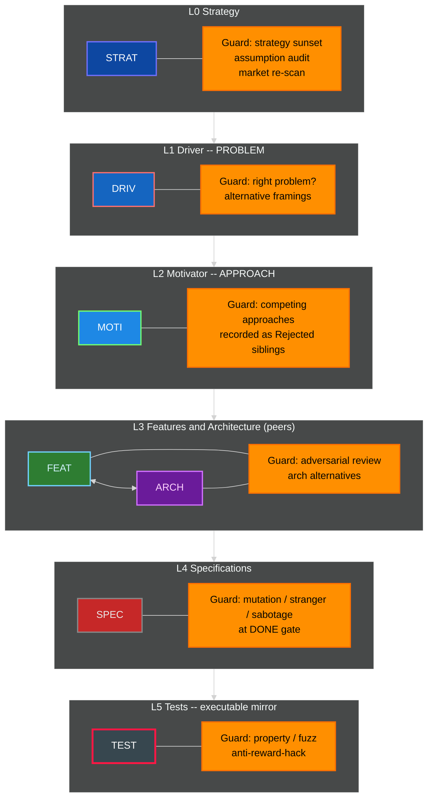

### 3.1 Guard Definitions by Level

| Level | Guard Name | Fires When | Action | Fixation Prevented |
|---|---|---|---|---|
| STRAT | Strategy Sunset | `strategy_age > sunset_period` | ESCALATE | "We have always done it this way" |
| STRAT | Assumption Audit | `consecutive_passes > fixation_threshold` | REDIRECT | Unexamined foundational beliefs |
| STRAT | Market Re-scan | `market_check_age > scan_interval` | BLOCK | Ignoring competitive landscape |
| DRIV | Right Problem | On ACTIVE and on DONE | BLOCK if problem is not falsifiable | Solving a slogan instead of a deficit |
| DRIV | Alternative Framings | `alternative_count < 2` | BLOCK | Single-hypothesis problem framing |
| MOTI | Competing Approaches | `rejected_or_active_sibling_count < 1` (need at least one recorded alternative) | BLOCK | Hammer looking for nails. **This IS the guard.** Rejected MOTI siblings are the record. |
| MOTI | Approach Evidence | `approach_age > spike_interval` with no spike evidence | REDIRECT | Solution lock-in without evidence |
| FEAT | Adversarial Review | `review_count < 1` on path to DONE | BLOCK | Echo chamber design |
| ARCH | Architecture Alternatives | `arch_alternatives < 2` | BLOCK | Premature architecture commitment |
| SPEC | Mutation Test | On DONE gate | BLOCK if mutation score below threshold | Specs that test words not behavior |
| SPEC | Stranger Test | On DONE gate | BLOCK if test not derivable from behavior | Spec-coupled tests |
| SPEC | Sabotage Test | On DONE gate | BLOCK if removing the requirement still leaves tests green | Fake tests |
| TEST | Property-Based | On DONE | BLOCK if no property tests | Testing only happy path |
| TEST | Fuzz / Chaos | On DONE | BLOCK if no fuzz or chaos probe where the SPEC claims robustness | Brittle happy-path only |
| TEST | Anti-Reward-Hack | On every run | BLOCK if sabotage/mutation/stranger fails | Proxy optimization |

The MOTI competing-approaches guard is satisfied only by **recorded sibling MOTI nodes** (Active, Rejected, or Exhausted). A comment in the Active MOTI that "other approaches were considered" does not satisfy the guard.

### 3.2 Fixation Detection Mechanism

Every guard tracks a `consecutive_passes` counter. Guards cannot be permanently silent.

```
on guard evaluation (every state entry):
    if predicate() == true:
        fire guard action
        reset consecutive_passes to 0
    else:
        increment consecutive_passes
        if consecutive_passes > fixation_threshold:
            FORCE FIRE regardless of predicate
            emit FIXATION_DETECTED event
            reset consecutive_passes to 0
```

`fixation_threshold` is configurable per guard and has a system-wide hard ceiling loaded from Config, not compiled in.

---

## 4. Emergency Breakers + System Reset (outer loop)

When inline guards fail and the system enters a death spiral, emergency breakers trip and force a system reset. Breakers, reset, and re-arm are the **outer** loop's halt path. They wrap the inner TDD loop and the mid RGB loop; they do not replace them.

### 4.0 Healthy inner-causal loop (Driver, Motivator, Action)

The healthy loop is: **Driver (deficit) activates Motivator (channel) produces Action**. Action feeds back to the Driver (deficit reduced, sustained, or intensified). Motivator does **not** shape Driver. Driver is parent pressure; Motivator is a substitutable channel.

```mermaid
%%{init: {'theme': 'dark'}}%%
flowchart TB
    classDef healthy fill:#2e7d32,color:#fff,stroke:#00c853,stroke-width:2px
    classDef spiral fill:#c62828,color:#fff,stroke:#ff1744,stroke-width:2px
    classDef breaker fill:#e65100,color:#fff,stroke:#ff6d00,stroke-width:2px
    classDef reset fill:#006064,color:#fff,stroke:#00e5ff,stroke-width:2px
    classDef entry fill:#37474f,color:#e0e0e0,stroke:#888,stroke-width:1px
    classDef driv fill:#1565c0,color:#fff,stroke:#ff7070,stroke-width:2px
    classDef moti fill:#1e88e5,color:#fff,stroke:#70ff70,stroke-width:2px
    classDef feat fill:#2e7d32,color:#d0f0ff,stroke:#70d0ff,stroke-width:2px

    subgraph ENTRY["Entry Points"]
        direction LR
        E1["Strategic design -- STRAT / DRIV"]:::entry
        E2["Live execution -- cards, tests, ingress"]:::entry
    end

    subgraph HEALTHY["Healthy loop -- Driver activates Motivator produces Action"]
        HD["Driver -- deficit pressure"]:::driv
        HM["Motivator -- channel"]:::moti
        HT["Action -- FEAT/ARCH/SPEC/TEST work"]:::feat
        HD -->|activates| HM
        HM -->|produces| HT
        HT -->|feedback resolves or intensifies deficit| HD
    end

    E1 --> HD
    E2 --> HT

    subgraph SPIRAL["Death recursion -- outer pathology"]
        MM["Myopic Motivator"]:::spiral
        MD["Intense Driver"]:::spiral
        RA["Reactive Action"]:::spiral
        SF["System Fragility"]:::spiral
        MM --> MD --> RA --> SF
        SF -->|Pressure| MD
        SF -->|Narrower focus| MM
    end

    HD -->|Guards bypassed| MD

    subgraph EMERGENCY["Emergency Breakers"]
        CB1["Hard Constraints"]:::breaker
        CB2["Asymmetric Data"]:::breaker
        CB3["Chaos Engineering"]:::breaker
        CB4["Governance"]:::breaker
        TRIP["BREAKER_TRIPPED"]:::breaker
    end

    RA -.->|Thresholds| CB1
    SF -.->|Alarm| CB4
    MM -.->|Fixation| CB2
    MD -.->|Unsustainable| CB3
    CB1 & CB2 & CB3 & CB4 ==>|Shut down| TRIP

    subgraph RESET_PHASE["System Reset"]
        RESET["Realign STRAT then DRIV then MOTI"]:::reset
        LL["Lessons Learned"]:::reset
        REARM["Re-arm Guards"]:::reset
    end

    TRIP --> RESET --> LL --> REARM
    REARM -->|Stronger guards| HD

    style ENTRY fill:#1a1a1a,stroke:#555,stroke-dasharray:5 5
    style HEALTHY fill:#0a200a,stroke:#28a745,stroke-dasharray:5 5
    style SPIRAL fill:#200a0a,stroke:#dc3545,stroke-dasharray:5 5
    style EMERGENCY fill:#201500,stroke:#fd7e14,stroke-dasharray:5 5
    style RESET_PHASE fill:#001a1a,stroke:#00e5ff,stroke-dasharray:5 5
```

External ingress may enter at the Driver (reveals or creates deficit: `PROBLEM_SIGNAL`, `USER_REPORT`, `STRATEGIC_PIVOT`) or at the Motivator (activates or redirects a channel without changing the deficit). Action always egresses an event in addition to internal feedback.

### 4.1 Emergency Breaker Definitions

| Breaker | Monitors | Threshold | Trip Action |
|---|---|---|---|
| Hard Constraints | `bug_count`, `tech_debt_ratio`, `test_coverage` | Configurable per instance | Halt all `in-progress`, transition nodes to RESET, cards to `blocked` |
| Asymmetric Data | `user_satisfaction`, `post_mortem_count`, `fixation_events` | Rolling window average | Inject user-research mandate, halt FEAT pull |
| Chaos Engineering | `mttr`, `failure_recovery_time`, `cascading_failure_count` | SLA breach count in window | Force controlled failure-injection round (`TIMER_TICK` scheduled) |
| Governance | `sprint_velocity_variance`, `architecture_rot_score`, `guard_bypass_count` | Executive-set threshold | Architect/executive intervention mandate |

Breakers are loaded from BreakerRegistry (Config + SchemaRegistry), not a compiled-in list.

### 4.2 Death Spiral Entry Points

| Entry Path | From | To | Root Cause |
|---|---|---|---|
| Unchecked Pressure | External Driver-level ingress | Intense Driver | Metric pressure without oversight |
| Motivator Burnout | Internal Motivator | Myopic Motivator | Team loses purpose, defaults to ticket clearing; competing MOTIs ignored |
| Trigger Overload | External Trigger | Reactive Action | Constant firefighting bypasses design; inner TDD skipped |

### 4.3 System Reset Sequence

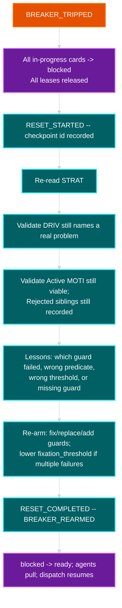

All steps emit events. Reset does not rewrite history; it appends `RESET_*` and `BREAKER_REARMED`.

---

## 5. Deterministic Engine Core

The engine runtime is an event-sourced state machine with a pure transition evaluator. Node types, event kinds, guards, and breakers are loaded from SchemaRegistry and Config. The evaluator has **no compiled-in node list**.

```mermaid
%%{init: {'theme': 'dark'}}%%
flowchart TB
    classDef engine fill:#1a1a2e,color:#e0e0ff,stroke:#7070ff,stroke-width:2px
    classDef bus fill:#37474f,color:#fff,stroke:#888,stroke-width:2px
    classDef store fill:#006064,color:#fff,stroke:#00e5ff,stroke-width:2px

    subgraph CORE["Engine Core -- Event Sourced"]
        EVT["EventStore\nappend-only, immutable\npartitioned by work_item_id\nand owned_subtree"]:::store
        SM["State Machine\nmaterialized from event log\nreplayable from checkpoint"]:::engine
        EVAL["Transition Evaluator\npure: state + event = state-prime\nno side effects, no randomness"]:::engine
        TDD["TddGate\nreject NOT_STARTED to GREEN"]:::engine

        EVT -->|Ordered replay| SM
        SM -->|Current state| EVAL
        EVAL -->|TDD predicate| TDD
        TDD -->|pass or TRANSITION_REJECTED| EVAL
        EVAL -->|Emit event| EVT
    end

    subgraph REG["Registries -- dynamic, not compiled-in"]
        NR["NodeRegistry"]:::engine
        GR["GuardRegistry"]:::engine
        BR["BreakerRegistry"]:::engine
        SR["SchemaRegistry -- event kinds"]:::engine
        TR["TransitionRegistry -- section 5.1"]:::engine
    end

    EVAL -->|Execute| NR
    EVAL -->|Validate| GR
    EVAL -->|Lookup| TR
    EVAL -->|Kind check| SR
    BR -->|Monitor| SM
    BR -->|Trip| EVT

    style CORE fill:#0a0a1a,stroke:#7070ff,stroke-dasharray:5 5
    style REG fill:#1a1a1a,stroke:#555,stroke-dasharray:5 5
```

### 5.1 Dispatch Loop and Transition Registry

UNHANDLED_EVENT is only for kinds **absent from SchemaRegistry**. Every kind in section 9 is in the seed SchemaRegistry. Catalogued kinds MUST NOT produce `UNHANDLED_EVENT`.

Alias: `WORK_MERGED` is registered as an alias of `MERGE_ACCEPTED`. Dispatch canonicalizes the kind before lookup. N=1 is a merge point with one child, not a competing lifecycle.

```
loop forever:
    event = event_store.dequeue_next()
    event.kind = SchemaRegistry.canonicalize(event.kind)   # WORK_MERGED -> MERGE_ACCEPTED
    current_state = state_machine.current_for(event.partition_key)

    if event.kind not in SchemaRegistry:
        emit(UNHANDLED_EVENT, event)
        continue

    transition = TransitionRegistry.find(current_state, event.kind)
    if transition is None:
        emit(UNHANDLED_EVENT, event)   # only possible if registry lagged schema -- treat as defect
        continue

    if TddGate.illegal(current_state, event):
        emit(TRANSITION_REJECTED, reason="TDD_GATE", event)
        continue

    if not transition.predicate(current_state, event):
        emit(TRANSITION_REJECTED, transition, event)
        continue

    for guard in GuardDaemon.guards_for(transition, current_state):
        result = guard.predicate(current_state, event)
        if result == BLOCK:
            emit(GUARD_BLOCKED, guard, transition, event)
            goto loop
        elif result == REDIRECT:
            event = redirect_event(guard.redirect_to, event)
            goto loop
        elif result == ESCALATE:
            emit(GUARD_ESCALATED, guard, transition, event)
            goto loop

    next_state = transition.action(current_state, event)
    event_store.append(TRANSITION_COMMITTED, transition, current_state, next_state)
    state_machine.update(next_state)
    KanbanProjector.apply(TRANSITION_COMMITTED)   # filesystem mv is a projection

    for breaker in BreakerRegistry.active():
        if breaker.check(next_state):
            breaker.trip()
            emit(BREAKER_TRIPPED, breaker, next_state)
```

TddGate.illegal is true when the event would set `tdd.state = GREEN` and either `tdd.state` is `NOT_STARTED` or `tdd.first-failure` is null.

#### Transition registry seed (every catalogued kind)

Column `card` is the workstream column projection. CONFLICT is not a column; `WORK_CONFLICTED` projects to `blocked`.

**Work**

| Kind | From (card) | To (card) | Predicate / effect |
|---|---|---|---|
| `WORK_CREATED` | (none) | `backlog` | Mint card bound to node. Node stays IDLE. |
| `WORK_DECOMPOSED` | parent any | children `backlog` or `ready` | Inject child cards. Parent MAY stay `in-progress`. |
| `WORK_STARTED` | `ready` | `in-progress` | Exclusive lease acquired. Same commit MAY include `WORK_CLAIMED`. Node IDLE -> ACTIVE. |
| `WORK_CLAIMED` | `ready` | `in-progress` | Exclusive lease on card+subtree. Second claim -> `TRANSITION_REJECTED`. |
| `WORK_RELEASED` | `in-progress` | `ready` | Lease released. Owner cleared. |
| `WORK_COMPLETED` | `in-progress` | `review` | Artifacts attached. Does **not** enter `done`. |
| `WORK_BLOCKED` | any except `done` | `blocked` | Guard, dep, merge, or external wait. |
| `WORK_UNBLOCKED` | `blocked` | `ready` | Cause cleared. If lease still valid, MAY return to `in-progress`. |
| `WORK_CONFLICTED` | `review` or `in-progress` | `blocked` | Overlapping-write attempt or lease collision. Hub does not merge files. |
| `WORK_MERGED` | (alias) | (alias) | Canonicalize to `MERGE_ACCEPTED`. |

**Merge (one lifecycle)**

| Kind | From | To | Predicate / effect |
|---|---|---|---|
| `MERGE_READY` | children in `review` (or TDD state matching `required_state`) | parent eligible; parent card `queue` | All `child_cards` reached `required_state`. |
| `MERGE_BLOCKED` | parent any | parent `blocked` | Missing child, unmet dep, or child `blocked`. |
| `MERGE_ACCEPTED` | parent `review` or `verification` | parent `done` or `integrated` | Sync invariant holds. N=1 degenerate is this event (not a second path). Unblocks dependents. |
| `MERGE_REJECTED` | parent `active-merge` or `verification` | parent `blocked`; children MAY `in-progress` | Sync invariant failed. |
| `RECONCILE_PARENT` | `TBD-RECONCILE` links | real `filename-id` | Hub-only. After `MERGE_READY`, before or as evidence of `MERGE_ACCEPTED`. |

**TDD / process**

| Kind | TDD effect | Card effect |
|---|---|---|
| `TEST_FAIL` | `NOT_STARTED\|GREEN\|REFACTOR -> RED`; stay RED. Set `first-failure` if null. Increment `iterations`. | Stay `in-progress` or `WORK_BLOCKED`. |
| `TEST_PASS` | `RED -> GREEN` or stay `GREEN\|REFACTOR`. **Rejected** if `NOT_STARTED` or `first-failure` null. | MAY `in-progress -> review` when acceptance met. |
| `SPEC_WRONG` | SPEC TDD MAY return to RED; do not silently rewrite the test to match a bad spec. | SPEC card `in-progress` or `blocked`. |
| `FEAT_WRONG` | Parent FEAT re-entered. SPECs MAY stay GREEN (they were right). | FEAT card `in-progress` or `blocked`. Mint GAP cards as needed. |
| `GAP_DISCOVERED` | none directly | New cards in `backlog`/`ready`. |
| `PROCESS_DEFECT` | none | Card against engine process docs. Meta loop. |
| `TEMPLATE_DEFECT` | none | Card against templates. Meta loop. |
| `SYNC_VIOLATION` | none | Merge point MUST NOT accept. MAY `MERGE_BLOCKED` or `MERGE_REJECTED`. |

**RGB (mid)**

| Kind | Target node | Card effect |
|---|---|---|
| `CODE_REGRESSION` | SPEC | SPEC `in-progress` or `blocked`. TDD `GREEN\|REFACTOR -> RED`. |
| `INTEGRATION_FLAW` | FEAT and ARCH | Those cards `in-progress` or `blocked`. Count toward 2-redesign bound. |
| `UNFEASIBLE_SCOPE` | MOTI | Active MOTI `Exhausted` or `Rejected`. Sibling MAY become Active. |
| `BROKEN_REQUIREMENT` | DRIV | DRIV re-entered. Alternative framings guard fires. |
| `PARADIGM_SHIFT` | STRAT | STRAT re-entered. Strategy sunset/assumption audit fire. |

**External**

| Kind | Effect |
|---|---|
| `STRATEGIC_PIVOT` | Ingress onto STRAT. Create or move STRAT/DRIV cards. |
| `PROBLEM_SIGNAL` | Ingress onto DRIV. Create or move DRIV cards. |
| `USER_REPORT` | Create or move a bound card. MAY emit `PROBLEM_SIGNAL`. |
| `ATTACKER_SIGNAL` | Create or escalate. MAY emit `SECURITY_DISCLOSURE`. |
| `SECURITY_DISCLOSURE` | P0 card. MAY `WORK_BLOCKED` related nodes. |

**Guards / breakers / engine / harvest / learning / timer**

| Kind | Effect |
|---|---|
| `GUARD_PASSED` | Increment `consecutive_passes`. |
| `GUARD_BLOCKED` | Transition aborted. Card MAY `blocked`. |
| `GUARD_REDIRECTED` | Event re-routed; dispatch restarts with new event. |
| `GUARD_ESCALATED` | Escalation handler; MAY emit RGB event. |
| `FIXATION_DETECTED` | Force-fired guard. Counter reset. |
| `BREAKER_TRIPPED` | All affected `in-progress` -> `blocked`. `RESET_STARTED`. |
| `BREAKER_REARMED` | Guards updated. |
| `RESET_STARTED` | Checkpoint. Nodes RESET. |
| `RESET_COMPLETED` | `blocked` -> `ready`. Dispatch resumes. |
| `UNHANDLED_EVENT` | Dead-letter candidate. Never for seed catalog kinds. |
| `TRANSITION_REJECTED` | No state change. Includes illegal TDD and second claim. |
| `TRANSITION_COMMITTED` | State+projection applied. Idempotent projectors key on this id. |
| `TIMER_TICK` | TimerDaemon only. Never a cron that bypasses the bus. Default action is no-op commit so the kind is handled. |
| `WATCHDOG_STALL` | Lease held, no `TRANSITION_COMMITTED` from that agent. After 2: `WORK_BLOCKED` reason=stall. Never auto-GREEN. |
| `WATCHDOG_THRASH` | Repeat storm or `TEST_PASS` without `first-failure`. Kill worker. Card stays RED or `blocked`. |
| `FORK_ORPHAN` | Process, worktree, or branch with no live lease. Card `blocked`. Hub does not merge orphan work. |
| `HARVEST_DETECTED` | Card in `backlog` (harvest partition). |
| `LIB_EXTRACTED` | Registry updated. Consumers retargeted by new cards, not hub file-merge. |
| `SERVICE_PROMOTED` | Maturity gate passed. |
| `SDLC_SPAWNED` | Child engine instance starts. Same event grammar. |
| `LEARNING` | `class` EFFICIENCY or CAPABILITY; `action` CREATE, REVISE, or RETIRE. |

### 5.2 Determinism Guarantees

| Property | Guarantee | Mechanism |
|---|---|---|
| Same input, same output | Given event log L, state is always S | Event sourcing + pure evaluator |
| Total ordering per item | Events for work item X always ordered | Partition key = `work_item_id` |
| Happens-before across parent/child | Child `MERGE_*` visible to parent partition before parent evaluates | parent_id correlation + parent partition subscribe (section 12.3) |
| Replayable | Any past state reconstructable | Append-only event store + snapshots |
| Auditable | Every decision traceable | Event log is the audit log |
| Recoverable | Any checkpoint restorable | Snapshot + replay from sequence number |
| No hidden state | All state in event store | No globals, no side channels |
| Guard convergence | Fixation detection guaranteed | `consecutive_passes` with hard ceiling |
| TDD honesty | No GREEN without recorded RED | TddGate + `first-failure` |

---

## 6. Parallel Execution -- One Orchestrator, One Kanban, One Ownership

Multiple agents work concurrently on different work items. The star hub is the **orchestrator** (event bus + agent pool + DAG). It is not a second kanban.

There is **one** kanban. Feature A and Feature B are **partitions** of the same column set, keyed by `owned_subtree`. Harvest candidates live in the same columns with a harvest partition key. They are not separate products.

```mermaid
%%{init: {'theme': 'dark'}}%%
flowchart TB
    classDef hub fill:#0d47a1,color:#fff,stroke:#7070ff,stroke-width:3px
    classDef agent fill:#2e7d32,color:#fff,stroke:#00c853,stroke-width:2px
    classDef kanban fill:#6a1b9a,color:#fff,stroke:#d070ff,stroke-width:2px
    classDef feat fill:#2e7d32,color:#d0f0ff,stroke:#70d0ff,stroke-width:2px
    classDef arch fill:#6a1b9a,color:#ffd0ff,stroke:#d070ff,stroke-width:2px
    classDef merge fill:#e65100,color:#fff,stroke:#ff6d00,stroke-width:2px
    classDef bus fill:#37474f,color:#fff,stroke:#888,stroke-width:2px
    classDef engine fill:#1a1a2e,color:#e0e0ff,stroke:#7070ff,stroke-width:2px

    subgraph STAR["Star topology -- orchestrator, not a second board"]
        HUB["ENGINE HUB -- orchestrator\nevent order, card mv, parent reconcile,\nmerge-point evaluation\nNEVER executes work\nNEVER content-merges files"]:::hub

        subgraph BUS["Async Event Bus"]
            PUB["publish"]:::bus
            SUB["subscribe -- capability match"]:::bus
            DLQ["dead-letter queue"]:::bus
        end

        subgraph AGENTS["Agent Pool -- exclusive lease on card + subtree"]
            direction LR
            A1["Agent 1 -- owns FEAT subtree A"]:::agent
            A2["Agent 2 -- owns ARCH subtree"]:::agent
            A3["Agent 3 -- owns FEAT subtree B"]:::agent
        end

        subgraph KANBAN["ONE workstream kanban -- partitions by owned_subtree"]
            direction LR
            C0["backlog"]:::kanban
            C1["ready"]:::kanban
            C2["in-progress"]:::kanban
            C3["blocked"]:::kanban
            C4["review"]:::kanban
            C5["done"]:::kanban
            C0 --> C1 --> C2
            C2 --> C3
            C3 --> C1
            C2 --> C4
            C4 --> C5
        end

        subgraph MERGECOLS["Merge-point columns -- same board, fan-in only"]
            direction LR
            Q["queue"]:::merge
            AM["active-merge"]:::merge
            VER["verification"]:::merge
            INT["integrated"]:::merge
            Q --> AM --> VER --> INT
        end

        subgraph SHARED["DAG + component registry"]
            CR["Component Registry -- owners, dependents, usage"]:::engine
            DG["Dependency Graph -- parallelism = DAG width"]:::engine
        end
    end

    HUB -->|Decompose WORK_DECOMPOSED| C0
    C1 -->|pull if no owner| A1 & A2 & A3
    A1 & A2 & A3 -->|events| PUB
    SUB -->|route| A1 & A2 & A3
    PUB --> HUB
    C4 -->|fan-in| Q
    HUB -->|evaluate merge point| AM
    HUB -->|Update| CR
    HUB -->|Resolve| DG
    DG -->|Unblock WORK_UNBLOCKED| C1

    style STAR fill:#0a0a1a,stroke:#555,stroke-dasharray:5 5
    style BUS fill:#1a1a1a,stroke:#888,stroke-dasharray:5 5
    style AGENTS fill:#0a200a,stroke:#28a745,stroke-dasharray:5 5
    style KANBAN fill:#1a0a2a,stroke:#d070ff,stroke-dasharray:5 5
    style MERGECOLS fill:#201500,stroke:#fd7e14,stroke-dasharray:5 5
    style SHARED fill:#0a0a1a,stroke:#7070ff,stroke-dasharray:5 5
```

### 6.1 Roles

| Role | Responsibility | Constraint |
|---|---|---|
| Hub (orchestrator) | Decompose, route, aggregate, evaluate merge points, emit `RECONCILE_PARENT`, trigger harvest detection, walk DAG | Never executes work. Never content-merges files. Never holds an exclusive write lease on SPEC/test/impl bodies. |
| Agent | Claim from `ready` with no owner, execute inside owned subtree, emit completion and test events | Exclusive lease on one card and its `owned_subtree`. WIP limit. Steal only from `ready` with no owner. |
| Event Bus | Route events. Partitioned ordering. At-least-once. | Dead-letter for poison. No cron that bypasses the bus. |
| Kanban | One board. Columns: `backlog`, `ready`, `in-progress`, `blocked`, `review`, `done`. Merge-point columns: `queue`, `active-merge`, `verification`, `integrated`. | Partitions = `owned_subtree` keys. Directory `mv` is a projection of events. |
| DAG | Parallelism = width. On `MERGE_ACCEPTED`, walk and `WORK_UNBLOCKED`. | Parent partition subscribes by `parent_id`, not a global lock. |
| Component Registry | Track shared components, usage, harvest candidates | Conflict = two leases on one file = `WORK_CONFLICTED` / `TRANSITION_REJECTED`, not a merge. |

Filesystem column names are those already defined by GenericWorkstreamKanbanEngine. Engine enums map 1:1 onto those names.

### 6.2 Work-item lifecycle (state machine)

Kanban column is the primary state. TDD is a **nested parallel** machine on the bound SPEC (same loop, closer zoom). CONFLICT is not a state and not a board; `WORK_CONFLICTED` projects to `blocked`. `review -> done` only through `MERGE_ACCEPTED` (N=1 is the degenerate merge). `stateDiagram-v2` does not take the locked `classDef` palette; flowcharts elsewhere in this spec do.

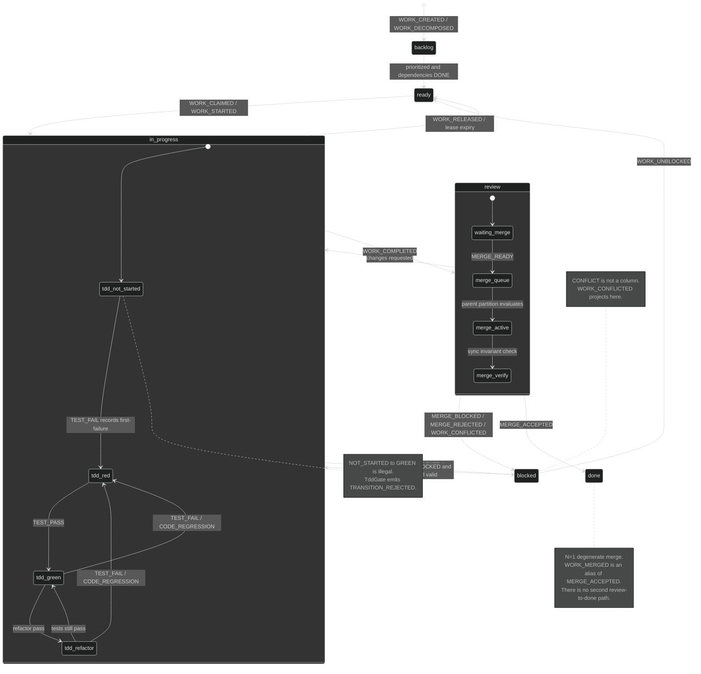

### 6.3 Exclusive ownership (the only ownership model)

Local-copy optimistic merge is **forbidden**. The hub never content-merges files.

| Rule | Meaning |
|---|---|
| Exclusive card | One agent owns one card. Null owner only in `backlog` or `ready`. |
| Exclusive subtree | One agent owns one FEAT or ARCH subtree. Child SPEC files of that subtree are that agent's to write. |
| No overlapping files | Two agents MUST NOT write the same file. Isolation is the lease, not merge-of-edits. |
| Claim | `IAgent.claim` takes a TTL lease (Lease/Lock daemon). Second claim -> `TRANSITION_REJECTED`. |
| Steal | Only from `ready` with no owner. Never from `in-progress`. |
| Lease expiry | Card returns to `ready` (if no block reason) or `blocked`. Work is not "kept" by a dead worker. |
| Hub does not write artifacts | Event order, card `mv`, `parent:` reconcile, merge-point evaluation. Nothing else. |
| Spawn budget | `spawn_budget(depth) = floor(8 / 2^depth)`. Depth 4 is a hard stop. Circuit-break worker spawn on budget exhaustion. |
| Parent vs child lease | A parent MUST NOT write files covered by a live child lease. That is `WORK_CONFLICTED`. |
| Hierarchy | L0 = hub-spawned, owns FEAT or ARCH subtree. L1 = spawned by L0 inside that subtree. L2/L3 = one SPEC or one test file. Rendezvous is `MERGE_*` on `parent_id`, not a thread join. |

### 6.4 Cards, columns, TDD

A card is an `IWorkItem` materialized as a kanban file bound to exactly one tree node via `filename-id`. Moving a card is an event; the directory `mv` is the durable projection.

| Kanban column | `IWorkItem.state` | Node state | Typical TDD | Notes |
|---|---|---|---|---|
| `backlog` | `BACKLOG` | `IDLE` | `NOT_STARTED` | Not pullable. No owner. |
| `ready` | `READY` | `IDLE` | `NOT_STARTED` or `RED` | Pullable. No unmet deps. No owner. |
| `in-progress` | `IN_PROGRESS` | `ACTIVE` or `DEGRADED` | `RED`, `GREEN`, or `REFACTOR` | Exclusive owner required. |
| `blocked` | `BLOCKED` | `BLOCKED` or `RESET` | Frozen (any TDD) | Guard, unmet dep, `MERGE_BLOCKED`, `WORK_CONFLICTED`, breaker. |
| `review` | `REVIEW` | `ACTIVE` or `DEGRADED` | `GREEN` (or `REFACTOR` if review is the refactor pass) | Awaiting merge-point. |
| `done` | `DONE` | `DONE` | `GREEN` after any required `REFACTOR` | Only via `MERGE_ACCEPTED`. |
| `queue` | (merge parent) | `ACTIVE` | n/a | Merge-point column. |
| `active-merge` | (merge parent) | `ACTIVE` | n/a | Merge-point column. WIP typically 1. |
| `verification` | (merge parent) | `ACTIVE` | n/a | Sync invariant + tests. |
| `integrated` | (merge parent) | `DONE` | n/a | Fan-in accepted. |

Illegal: card to `review` or `done` on TDD GREEN unless `first-failure` was recorded.

### 6.5 Merge points (the only merge story)

A merge point is an explicit fan-in barrier: N child workstreams must reach a declared state before the parent FEAT or ARCH card may leave `review` for `done` (or occupy merge-point columns through to `integrated`).

N=1 is degenerate: a single child reaching `review` with sync invariant true emits `MERGE_READY` then `MERGE_ACCEPTED`. That is what 0.0.1 called `WORK_MERGED`. It is the same lifecycle.

| Event | When | Parent card |
|---|---|---|
| `MERGE_READY` | Every listed child reached `required_state` | Eligible. `review`/`queue` -> `active-merge`. |
| `MERGE_BLOCKED` | A child missing, `in-progress`, or `blocked` | `blocked`. |
| `MERGE_ACCEPTED` | Sync invariant holds. Evidence includes `RECONCILE_PARENT` if any `TBD-RECONCILE` existed | `done` / `integrated`. Dependents unblocked. |
| `MERGE_REJECTED` | Sync invariant fails | Does not advance. Children MAY return to `in-progress` or `blocked`. |

**Sync invariant (MUST hold for `MERGE_ACCEPTED`):**

```
SPEC document  ==  test file / assertions  ==  implementation  ==  process and templates
```

Mismatch in any pair is `SYNC_VIOLATION` and `MERGE_REJECTED`.

**What is merged:** card status, `parent:` / `sdlc-refs` links, test evidence. **What is not merged:** overlapping file edits. If two agents would need to write the same file, the lease model already failed; emit `WORK_CONFLICTED`.

Reconciliation: `parent: TBD-RECONCILE` is legal **only across ownership boundaries**. Inside one owned subtree, `parent:` MUST be a real `filename-id`. After `MERGE_READY`, ParentReconciler (hub, not child agents) replaces `TBD-RECONCILE` and emits `RECONCILE_PARENT`. That is link repair, not a rewrite of SPEC/test/impl bodies.

`required_state` examples: all child SPECs TDD RED; all child SPECs TDD GREEN and sync invariant; all child cards in `review` or `done`.

### 6.6 Concurrency model

| Property | Mechanism |
|---|---|
| Event ordering | Partition by `work_item_id`; parent merge partition correlating `parent_id` |
| Conflict | Exclusive lease. No local-copy hub merge. Collision -> `TRANSITION_REJECTED` or `WORK_CONFLICTED` -> `blocked` |
| WIP limits | Per-agent and per-column, enforced at `claim()` |
| Dependency unblocking | DAG walk on `MERGE_ACCEPTED` |
| Work stealing | Idle agent claims from `ready` with no owner only |
| Deterministic replay | Append-only store, replay in partition order |
| Idempotent projection | Projectors key on `TRANSITION_COMMITTED` id |

---

## 7. Harvesting Lifecycle -- Outer Loop Recursion

As agents implement work items, common patterns emerge. The engine detects these and triggers extraction, promotion, and spawning of **child engine instances**. A child is a full SDLC engine: own STRAT, own DRIVs, own MOTIs, own L3 peers, own SPECs, own one kanban, own guards and breakers, same event grammar.

```mermaid
%%{init: {'theme': 'dark'}}%%
flowchart TB
    classDef detect fill:#37474f,color:#fff,stroke:#888,stroke-width:2px
    classDef extract fill:#e65100,color:#fff,stroke:#ff6d00,stroke-width:2px
    classDef promote fill:#0d47a1,color:#fff,stroke:#7070ff,stroke-width:2px
    classDef spawn fill:#2e7d32,color:#fff,stroke:#00c853,stroke-width:3px
    classDef strat fill:#0d47a1,color:#fff,stroke:#7070ff,stroke-width:2px

    subgraph HARVEST["Harvesting -- outer loop"]
        subgraph DETECT["Phase 1: Pattern Detection"]
            D1["Duplication Scanner"]:::detect
            D2["Usage Counter"]:::detect
            D3["Coupling Analyzer"]:::detect
        end

        subgraph EXTRACT["Phase 2: Extraction"]
            E1["Extract Internal Lib"]:::extract
            E2["Define Interface Contract"]:::extract
            E3["Retarget consumers via new cards"]:::extract
        end

        subgraph PROMOTE["Phase 3: Promotion"]
            P1["Lib Maturity Gate"]:::promote
            P2["Extract SOA Service"]:::promote
            P3["Service Registry"]:::promote
        end

        subgraph SPAWN["Phase 4: Child engine instance"]
            SP["SDLC_SPAWNED -- new STRAT\nown DRIV MOTI FEAT ARCH SPEC\nown one kanban, own agents\nown guards, breakers, event store"]:::spawn
        end
    end

    D1 & D2 & D3 -->|HARVEST_DETECTED| E1
    E1 --> E2 --> E3
    E3 -->|Lib stabilizes| P1
    P1 -->|SERVICE_PROMOTED| P2
    P2 --> P3
    P3 -->|SDLC_SPAWNED| SP
    SP -.->|API contract dependency, not shared code| E3

    style HARVEST fill:#0a0a1a,stroke:#555,stroke-dasharray:5 5
    style DETECT fill:#1a1a1a,stroke:#888,stroke-dasharray:5 5
    style EXTRACT fill:#201500,stroke:#fd7e14,stroke-dasharray:5 5
    style PROMOTE fill:#0a0a2e,stroke:#7070ff,stroke-dasharray:5 5
    style SPAWN fill:#0a200a,stroke:#00c853,stroke-dasharray:5 5
```

### 7.1 Harvesting Thresholds

| Metric | Threshold | Action |
|---|---|---|
| `usage_count` | > 3 nodes referencing same component | Candidate for EXTRACT_LIB |
| `duplication_ratio` | > 40% AST similarity across 2+ agents | Candidate for EXTRACT_LIB |
| `cross_boundary_coupling` | Shared interface across 2+ FEAT or ARCH nodes | Candidate for EXTRACT_LIB |
| `lib_stable_cycles` | > 5 cycles with no API change | Promote to EXTRACT_SERVICE |
| `service_health` | SLA met for 10 cycles | Spawn child SDLC instance |

Thresholds live in Config.

### 7.2 Spawn Semantics

When a component is promoted to a service and spawns a child SDLC:

1. A new `STRAT` is created for the service (new engine instance).
2. The child inherits guard and breaker **definitions** from parent, with independent thresholds and its own event store.
3. The child gets its own **one** kanban, backlog column, and agent pool. That board belongs to the child instance; it is not a second board of the parent.
4. Parent DAG updated: component node replaced with a service-dependency work item.
5. Parent and child communicate via API contracts, not shared code and not hub file-merge.
6. Child lifecycle is fully independent -- own SPEC-zoom TDD, own RGB, own harvest, own spirals, own breaker trips, own resets. Egress from the child MAY ingress the parent as `PROBLEM_SIGNAL` or `LEARNING`.
7. The parent orchestrator does **not** schedule the child's cards. It sees the child as one **board card** (a board-of-boards row) plus a contract. Rendezvous is at the child's `MERGE_ACCEPTED` / `SDLC_SPAWNED` egress, not by reaching into the child EventStore.
8. Depth: `spawn_budget(depth) = floor(8 / 2^depth)`, hard stop at depth 4. A grandchild is legal until that stop. Each level has its own Watchdog (section 12).
9. Harvest detection is **live**: HarvestDaemon subscribes to `TRANSITION_COMMITTED` and registry updates. It does not scan on a nightly batch.

### 7.3 Board of boards (harvest recursion visible on the parent)

When `SDLC_SPAWNED` fires, the parent kanban gains one card whose `owned_subtree` is the child's STRAT `filename-id` and whose type is `board-proxy`. That card moves on the **parent** board (`in-progress` while the child is ACTIVE, `blocked` if the child's breaker trips, `review` when the child emits a contract-ready egress, `done` when the parent accepts the contract). Zoom into that card and you are in the child's one kanban. Zoom out and it is one row. Same loop.

---

## 8. Interface Contracts

Every engine component implements the contract for its role. Registries are dynamic.

### 8.1 INode -- SDLC Artifact Node

| Field | Type | Description |
|---|---|---|
| `id` | `string` | Unique node identifier (`filename-id`) |
| `type` | `enum` | `STRAT`, `DRIV`, `MOTI`, `FEAT`, `ARCH`, `SPEC` |
| `parent` | `string?` | Containment. Null only for STRAT. |
| `status` | `enum` | For MOTI: `Active`, `Rejected`, `Exhausted`. Others MAY use generic status. |
| `state` | `enum` | `IDLE`, `ACTIVE`, `BLOCKED`, `DEGRADED`, `RESET`, `DONE` |
| `tdd` | `object` | `{state, test-file, first-failure, iterations}` -- required on every INode |
| `enter()` | `fn(state, event) -> side_effects` | Deterministic action on state entry (guards fire here) |
| `exit()` | `fn(state, event) -> side_effects` | Deterministic action on state exit |
| `valid_transitions` | `list[ITransition]` | Allowed next states with predicates (from TransitionRegistry) |
| `guards` | `list[IGuard]` | Registered inline guards |
| `metrics` | `dict[string, numeric]` | Observable measurements for breakers |
| `work_items` | `list[IWorkItem]` | Associated cards |

`type` does not include `TEST`. L5 is `tdd.test-file`.

### 8.2 IGuard -- Anti-Fixation Guard

| Field | Type | Description |
|---|---|---|
| `id` | `string` | Guard identifier |
| `node_id` | `string` | Which node this guards |
| `predicate()` | `fn(state, event) -> bool` | Pure function: should this guard fire? |
| `action` | `enum` | `PASS`, `BLOCK`, `REDIRECT`, `ESCALATE` |
| `redirect_to` | `string?` | Target node if REDIRECT |
| `cooldown` | `duration` | Minimum time between firings |
| `consecutive_passes` | `int` | Resets on fire, increments on pass |
| `fixation_threshold` | `int` | Hard ceiling: force fire when exceeded |

### 8.3 IBreaker -- Emergency Circuit Breaker

| Field | Type | Description |
|---|---|---|
| `id` | `string` | Breaker identifier |
| `monitors` | `list[metric_id]` | Metrics to watch |
| `threshold` | `numeric` | Trip point |
| `window` | `duration` | Evaluation window |
| `trip()` | `fn(state) -> RESET_event` | Force transition to RESET |
| `rearm()` | `fn(lessons_learned) -> guard_updates` | Restore guards with fixes |
| `tripped` | `bool` | Current breaker state |

### 8.4 ITransition -- State Transition

| Field | Type | Description |
|---|---|---|
| `from_state` | `(node_id, state)` | Source node + state |
| `to_state` | `(node_id, state)` | Target node + state |
| `event` | `string` | Triggering event kind (canonical) |
| `predicate()` | `fn(state, event) -> bool` | Must return true to fire |
| `action()` | `fn(state, event) -> state_prime` | Pure function: compute next state |
| `guards` | `list[IGuard]` | All must PASS before commit |

### 8.5 IWorkItem -- Unit of Parallel Work (a card)

| Field | Type | Description |
|---|---|---|
| `id` | `string` | Unique work item ID |
| `node_ref` | `string` | Bound INode |
| `state` | `enum` | `BACKLOG`, `READY`, `IN_PROGRESS`, `REVIEW`, `DONE`, `BLOCKED` |
| `column` | `enum` | `backlog`, `ready`, `in-progress`, `blocked`, `review`, `done`, plus merge-point `queue`, `active-merge`, `verification`, `integrated` |
| `assigned_to` | `string?` | Agent ID or null (`backlog`/`ready` only) |
| `owned_subtree` | `string?` | Partition key and exclusive subtree root |
| `lease` | `ILease?` | TTL lease, not a forever lock |
| `dependencies` | `list[work_item_id]` | Must be DONE before READY |
| `priority` | `int` | Lower = higher. Computed from dependency depth. |
| `merge_point` | `string?` | `IMergePoint.id` if fan-in child or parent |
| `created_by` | `event_id` | Traceable to originating event |
| `artifacts` | `list[artifact_ref]` | Output artifacts produced |
| `card_kind` | `enum` | `work` (default) or `board-proxy` (child engine visible on parent board) |
| `priority_score` | `numeric` | Live score from Scheduler (section 12.5). Not a static rank list. |

There is no `CONFLICT` state. There is no `kanban_board` id selecting among multiple boards.

### 8.6 IAgent -- Autonomous Worker

| Field | Type | Description |
|---|---|---|
| `id` | `string` | Agent identifier |
| `type` | `enum` | `HUMAN`, `AI_AGENT`, `SCANNER`, `AUTOMATED` |
| `capabilities` | `list[node_type]` | What node types this agent can work |
| `current_work` | `list[work_item_id]` | Active items |
| `wip_limit` | `int` | Max concurrent items |
| `depth` | `int` | Nesting depth for `spawn_budget`. Hard stop: `depth >= 4` is `TRANSITION_REJECTED`. |
| `parent_agent` | `string?` | Spawner. Null for hub-spawned L0 agents. |
| `pid` | `string?` | OS process id if the worker is a process. Watchdog MAY SIGKILL. |
| `claim(item)` | `fn -> bool` | Take TTL exclusive lease. False if owned or not `ready`. |
| `release(item)` | `fn` | Release lease; card to `ready` or `blocked` |
| `complete(item, artifacts)` | `fn` | Emit `WORK_COMPLETED` |

Workers MAY run inside bwrap in deployments that have it. The generic engine MUST NOT require bwrap.

### 8.7 IKanban -- The Single Board

| Field | Type | Description |
|---|---|---|
| `id` | `string` | Board identifier (one per engine instance) |
| `columns` | `ordered list` | `backlog`, `ready`, `in-progress`, `blocked`, `review`, `done` |
| `merge_columns` | `ordered list` | `queue`, `active-merge`, `verification`, `integrated` |
| `wip_limits` | `dict[column, int]` | Per-column WIP limits |
| `partitions` | `dict[owned_subtree, items]` | Same columns, keyed by subtree |
| `pull(agent)` | `fn -> IWorkItem?` | Highest-priority `ready` with no owner matching capabilities |

`IBacklog` is the prioritized view of the `backlog` column, not a second product.

### 8.8 IMergePoint -- Fan-In Barrier

| Field | Type | Description |
|---|---|---|
| `id` | `string` | Merge-point identifier |
| `parent_card` | `filename-id` | Parent FEAT or ARCH card |
| `child_cards` | `list[filename-id]` | Workstream cards that must arrive |
| `required_state` | `predicate` | Example: all child SPECs RED; or all GREEN plus sync invariant |
| `sync_invariant` | `fn -> bool` | `SPEC == test == impl == process/template` |
| `state` | `enum` | `OPEN`, `ARMED`, `READY`, `BLOCKED`, `ACCEPTED`, `REJECTED` |
| `ownership_boundary` | `bool` | If true, child `parent:` MAY be `TBD-RECONCILE` until `RECONCILE_PARENT` |

Compare-and-swap on `state` in the event store is the concurrency control for multi-instance orchestrators (section 12.3).

### 8.9 IEventBus -- Async Event Distribution

| Field | Type | Description |
|---|---|---|
| `publish(event)` | `fn` | Append to event store, notify subscribers |
| `subscribe(pattern, handler)` | `fn` | Register handler for matching events |
| `partitioned_by` | `field` | `work_item_id` and, for merge, `parent_id` |
| `delivery` | `enum` | `AT_LEAST_ONCE` |
| `dead_letter_queue` | `list[event]` | Undeliverable, timed-out, or poison events |
| `replay(from_seq)` | `fn -> event_stream` | Replay from sequence number |

### 8.10 IComponentRegistry -- Shared Component Tracking

| Field | Type | Description |
|---|---|---|
| `components` | `dict[id, IComponent]` | All registered shared components |
| `register(component)` | `fn` | Add or update component |
| `dependents(id)` | `fn -> list[node_id]` | Who depends on this component |
| `usage_count(id)` | `fn -> int` | How many nodes reference this |
| `lease_matrix` | `dict[path, lease]` | Who holds write lease on which path |
| `lock(id, agent)` | `fn -> bool` | **TTL exclusive lease**, not optimistic content lock |

### 8.11 IHarvestRule -- Extraction Trigger

| Field | Type | Description |
|---|---|---|
| `id` | `string` | Rule identifier |
| `predicate()` | `fn(registry_state) -> bool` | When to trigger |
| `action` | `enum` | `EXTRACT_LIB`, `EXTRACT_SERVICE`, `REFACTOR_IN_PLACE` |
| `maturity_gate` | `dict` | Conditions for promotion |
| `spawn_sdlc` | `bool` | If true, component gets own engine instance |

### 8.12 ILease -- TTL Exclusive Lease

| Field | Type | Description |
|---|---|---|
| `id` | `string` | Lease identifier |
| `holder` | `agent_id` | Exclusive holder |
| `resource` | `card_id` and/or `owned_subtree` and/or file path | What is leased |
| `ttl` | `duration` | Expiry. Never forever. |
| `expires_at` | `timestamp` | Absolute expiry |
| `renew(holder)` | `fn -> bool` | Holder heartbeat |
| `expire()` | `fn` | Card to `ready` or `blocked`; emit `WORK_RELEASED` or `WORK_BLOCKED` |

### 8.13 ISchemaRegistry -- Dynamic Kinds

| Field | Type | Description |
|---|---|---|
| `kinds` | `dict[kind, schema]` | Event kind -> payload schema + version |
| `aliases` | `dict[alias, kind]` | Seed includes `WORK_MERGED` -> `MERGE_ACCEPTED`; `CORP-STRAT` -> `STRAT`; ... |
| `canonicalize(kind)` | `fn -> kind` | Alias fold |
| `register(kind, schema)` | `fn` | Dynamic add. Not a compiled-in list. |
| `evolve(kind, new_schema)` | `fn` | Versioned evolution; old events remain readable |

---

## 9. Event Type Catalog

Every state change in the engine is one of these typed events. Section 5.1 registers a transition for each. Payloads are the seed schema; SchemaRegistry MAY evolve versions.

### 9.1 Work Events

| Event | Source | Payload | Effect |
|---|---|---|---|
| `WORK_CREATED` | Hub / Ingress / Gap | `(work_item_id, node_ref, column=backlog)` | New card in `backlog` |
| `WORK_DECOMPOSED` | Hub | `list[IWorkItem]` | Child cards injected |
| `WORK_STARTED` | Agent | `(work_item_id, agent_id)` | `ready -> in-progress` |
| `WORK_CLAIMED` | Agent | `(work_item_id, agent_id, lease)` | Exclusive lease. Often same transaction as `WORK_STARTED` |
| `WORK_RELEASED` | Agent / LeaseDaemon | `(work_item_id, agent_id)` | `in-progress -> ready` |
| `WORK_COMPLETED` | Agent | `(work_item_id, artifacts)` | `in-progress -> review` |
| `WORK_BLOCKED` | Guard/Dep/Merge/Ingress | `(work_item_id, reason)` | any -> `blocked` |
| `WORK_UNBLOCKED` | Hub | `(work_item_id)` | `blocked -> ready` (or `in-progress` if lease valid) |
| `WORK_CONFLICTED` | Hub / LeaseDaemon | `(work_item_id, conflict_details)` | -> `blocked`. No file merge |
| `WORK_MERGED` | (alias) | same as `MERGE_ACCEPTED` | Canonicalize to `MERGE_ACCEPTED` |

### 9.2 Merge Events

| Event | Source | Payload | Effect |
|---|---|---|---|
| `MERGE_READY` | MergeCoordinator | `(merge_point_id, parent_card, child_cards, required_state)` | Parent eligible; merge-point columns |
| `MERGE_BLOCKED` | MergeCoordinator | `(merge_point_id, parent_card, missing_children, reason)` | Parent `blocked` |
| `MERGE_ACCEPTED` | MergeCoordinator | `(merge_point_id, parent_card, evidence, parent_links)` | Parent `done`/`integrated`. Unblocks dependents. N=1 degenerate |
| `MERGE_REJECTED` | MergeCoordinator | `(merge_point_id, parent_card, invariant_failures)` | Parent does not advance |
| `RECONCILE_PARENT` | ParentReconciler | `(child_id, old_parent=TBD-RECONCILE, new_parent=filename-id)` | Link repair |

### 9.3 Guard Events

| Event | Source | Payload | Effect |
|---|---|---|---|
| `GUARD_PASSED` | GuardDaemon | `(guard_id, node_id)` | Increment `consecutive_passes` |
| `GUARD_BLOCKED` | GuardDaemon | `(guard_id, node_id, reason)` | Transition blocked |
| `GUARD_REDIRECTED` | GuardDaemon | `(guard_id, from_node, to_node)` | Event re-routed |
| `GUARD_ESCALATED` | GuardDaemon | `(guard_id, node_id)` | Escalation handler invoked |
| `FIXATION_DETECTED` | GuardDaemon | `(guard_id, consecutive_passes)` | Force-fired, counter reset |

### 9.4 Breaker Events

| Event | Source | Payload | Effect |
|---|---|---|---|
| `BREAKER_TRIPPED` | BreakerDaemon | `(breaker_id, metrics_snapshot)` | Cards `blocked`, RESET initiated |
| `BREAKER_REARMED` | Reset | `(breaker_id, guard_updates)` | Guards strengthened |
| `RESET_STARTED` | Engine | `(checkpoint_id)` | System enters RESET |
| `RESET_COMPLETED` | Engine | `(lessons_learned, guard_changes)` | System resumes |

### 9.5 Feedback Events (RGB -- mid loop)

| Event | Color | Source | Target | Effect |
|---|---|---|---|---|
| `CODE_REGRESSION` | RED | TestRunner | SPEC | Spec re-entered. TDD to RED |
| `INTEGRATION_FLAW` | GREEN | TestRunner | FEAT and ARCH | L3 redesign |
| `UNFEASIBLE_SCOPE` | GREEN | TestRunner | MOTI | Approach unviable |
| `BROKEN_REQUIREMENT` | GREEN | TestRunner | DRIV | Problem invalid |
| `PARADIGM_SHIFT` | BLUE | TestRunner | STRAT | Strategic rethink |

### 9.6 Process Events

| Event | Source | Payload | Effect |
|---|---|---|---|
| `TEST_PASS` | TestRunner | `(node_id, test_file, evidence)` | TDD RED->GREEN if `first-failure` set; else `TRANSITION_REJECTED` |
| `TEST_FAIL` | TestRunner | `(node_id, test_file, evidence)` | TDD to RED; record `first-failure` if null |
| `SPEC_WRONG` | Agent / reviewer | `(spec_id, reason)` | Do not silently rewrite the test to match a bad spec |
| `FEAT_WRONG` | Agent / reviewer / TDD | `(feat_id, reason)` | Feature decomposition wrong; SPECs MAY be right |
| `GAP_DISCOVERED` | Agent / scanner / ingress | `(parent_id, gap_description)` | New cards `backlog`/`ready` |
| `PROCESS_DEFECT` | Agent / Guard / retro | `(artifact_ref, reason)` | Meta: revise engine process on the bus |
| `TEMPLATE_DEFECT` | Agent / Guard / retro | `(template_ref, reason)` | Meta: revise templates on the bus |
| `SYNC_VIOLATION` | MergeCoordinator / Guard | `(pairs_mismatched, evidence)` | Blocks `MERGE_ACCEPTED` |

### 9.7 External Events

| Event | Source | Target | Effect |
|---|---|---|---|
| `STRATEGIC_PIVOT` | Market / exec / IngressGateway | STRAT | Strategy re-entered |
| `PROBLEM_SIGNAL` | User / market / IngressGateway | DRIV | Problem revealed or created |
| `USER_REPORT` | User | Bound node or new card | Create or move a card; MAY emit `PROBLEM_SIGNAL` |
| `ATTACKER_SIGNAL` | Attacker / disclosure channel | STRAT or DRIV or SEC | Create or escalate; MAY emit `SECURITY_DISCLOSURE` |
| `SECURITY_DISCLOSURE` | Attacker, user, or scanner | SEC surface | P0 card; MAY `WORK_BLOCKED` |

### 9.8 Harvest Events

| Event | Source | Payload | Effect |
|---|---|---|---|
| `HARVEST_DETECTED` | HarvestDaemon | `(component_id, rule_id, evidence)` | Card in harvest partition `backlog` |
| `LIB_EXTRACTED` | Agent | `(lib_id, interface, consumers)` | Registry updated |
| `SERVICE_PROMOTED` | Hub | `(service_id, sla, api_version)` | Maturity gate |
| `SDLC_SPAWNED` | HarvestDaemon | `(child_sdlc_id, parent_dependency)` | Child engine instance begins |

### 9.9 Engine Events

| Event | Source | Payload | Effect |
|---|---|---|---|
| `UNHANDLED_EVENT` | Dispatcher | `(raw_event)` | Only if kind not in SchemaRegistry. DLQ candidate |
| `TRANSITION_REJECTED` | Dispatcher / TddGate | `(reason, event)` | No state change |
| `TRANSITION_COMMITTED` | Dispatcher | `(transition, from, to)` | State+projection applied |
| `TIMER_TICK` | TimerDaemon | `(timer_id, scheduled_at)` | Handled no-op unless a rule is registered |
| `RECONCILE_PARENT` | ParentReconciler | see 9.2 | Link repair |
| `WATCHDOG_STALL` | Watchdog | `(agent_id, stall_count)` | After 2: `WORK_BLOCKED` reason=stall |
| `WATCHDOG_THRASH` | Watchdog | `(agent_id, evidence)` | Kill worker; no auto-GREEN |
| `FORK_ORPHAN` | Watchdog / git adapter | `(path_or_pid, reason)` | `blocked`; no merge of orphan work |

### 9.10 Learning Events

| Event | Source | Payload | Effect |
|---|---|---|---|
| `LEARNING` | LearningIngest | `(source_agent, class: EFFICIENCY\|CAPABILITY, action: CREATE\|REVISE\|RETIRE, subject_ref, evidence)` | Knowledge item created, revised, or retired |

`EFFICIENCY`: same capability, cheaper or faster (process improvement; MAY emit `PROCESS_DEFECT`). `CAPABILITY`: new ability (MAY emit `HARVEST_DETECTED` or `GAP_DISCOVERED`).

---

## 10. Protection Summary

| Tier | Type | When | Construct | Scope |
|---|---|---|---|---|
| 0 | TDD gate | Every TDD transition | TddGate; `first-failure` required for GREEN | Per SPEC |
| 1 | Inline Guards | Every state entry | `IGuard.predicate()` | Per-node |
| 2 | RGB bounds | 3 SPEC fails / 2 redesigns / MOTI exhaustion / DRIV invalid | Mid-loop escalation | Ladder |
| 3 | Emergency Breakers | Threshold exceeded | `IBreaker.trip()` | Per-metric |
| 4 | System Reset | Breaker trips | `RESET_*` + re-arm | Instance-wide |
| 5 | WIP Limits | Always | `IKanban.wip_limits` | Per column / agent |
| 6 | Exclusive lease | While `in-progress` | ILease TTL | Per card + subtree |
| 7 | Merge-point barrier | Fan-in of N cards | `IMergePoint` + `MERGE_*` | Per parent FEAT/ARCH |
| 8 | Sync invariant | Before `MERGE_ACCEPTED` | `SPEC == test == impl == process/template` | Per merge point |
| 9 | Harvest Rules | Pattern detected | `IHarvestRule.predicate()` | Cross-cutting |
| 10 | Fixation Ceiling | Passes exceeded | Force-fire guard | Per-guard |
| 11 | Spawn budget | Agent spawn | `floor(8 / 2^depth)` | Per agent tree |
| 12 | SchemaRegistry | Every dispatch | Unknown kind -> `UNHANDLED_EVENT` + DLQ | Instance |

---

## 11. Nested Loop Architecture (binding)

Section 0.1 is binding: these are **zoom levels of one loop**, not four engines. All zooms emit events. None is a side channel.

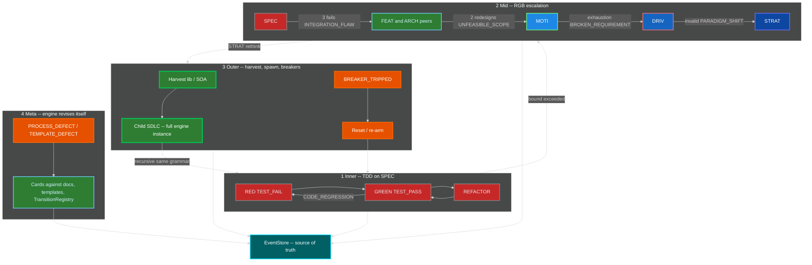

1. **Inner:** TDD on SPEC (RED-GREEN-REFACTOR). TestRunner never claims GREEN without recorded RED.
2. **Mid:** RGB ladder with bounds in section 2.2.
3. **Outer:** harvest lib -> SOA -> spawn child SDLC; plus death-spiral breakers and reset (section 4).
4. **Meta:** `PROCESS_DEFECT` / `TEMPLATE_DEFECT` revise the engine itself (docs, templates, process) as cards on the same kanban.
5. **Breakers + reset** from section 4 wrap all of the above.
6. **Event store** is source of truth; all loops emit events.

Child SDLC recursion: the child's inner loop is TDD; its mid loop is RGB; its outer loop may spawn a grandchild. Cascades use egress-as-ingress (`LEARNING`, `PROBLEM_SIGNAL`, API contracts).

---

## 12. Implementation Design

This section is the software-engineer contract. Subsystems are **daemons**: dynamic (loaded from registry/config), asynchronous (event-driven), scalable (partitioned), fault-tolerant (leases, DLQ, replay).

The engine is **always live**. There is no batch window, no nightly reconcile, no "run the orchestrator later." Every daemon is a long-running subscriber. A clock source emits `TIMER_TICK` events; cron, if any, is only an IngressGateway adapter that publishes `TIMER_TICK`. Automation MUST NOT accumulate work and flush.

### 12.1 Subsystems / daemons

| Daemon | Responsibility | Consumes | Produces | Failure mode | Scaling unit |
|---|---|---|---|---|---|
| **EventStore** | Append-only log; partitioned replay; snapshots | appends from all | ordered streams | Durability loss is catastrophic -- replicate; refuse ack if fsync fails | Partition = `tenant_id` + `work_item_id` (merge uses `parent_id` partition) |
| **Dispatcher / Orchestrator** | Transition evaluator. Stateless vs store. No hardcoded node lists | all catalog kinds | `TRANSITION_COMMITTED`, `TRANSITION_REJECTED`, `UNHANDLED_EVENT` | Crash-safe: replay from last committed seq. Multi-instance: any instance may dispatch a partition; merge eval uses CAS or a leader (12.3) | Per partition |
| **GuardDaemon** | Evaluate IGuard on state entry | `TRANSITION_COMMITTED` (entry), node state | `GUARD_*`, `FIXATION_DETECTED` | Fail-closed: if guard eval errors, `GUARD_BLOCKED` + DLQ copy | Per node type / shard |
| **BreakerDaemon** | Death-spiral detection | metrics snapshots, `TIMER_TICK` | `BREAKER_TRIPPED`, `RESET_STARTED` | Fail-open for eval errors logged; fail-closed once tripped until re-arm | Per engine instance |
| **KanbanProjector** | Event -> filesystem column `mv`. One board | `TRANSITION_COMMITTED` | (projection only; MAY emit projector-lag metrics) | Idempotent on commit id. Rebuild from replay | Per partition |
| **AgentPool / WorkerManager** | Spawn/retire workers; exclusive lease; steal only from `ready` with no owner; `spawn_budget` circuit | `WORK_CREATED` (ready), `WORK_RELEASED`, lease expiry | `WORK_CLAIMED`, spawn/retire audit | Spawn circuit-break on budget=0 or worker-churn threshold. Dead worker -> lease expiry | Worker processes; pool per instance |
| **MergeCoordinator** | Fan-in barrier; sync invariant | child `WORK_COMPLETED`, `TEST_PASS`, `SYNC_VIOLATION` | `MERGE_READY`, `MERGE_BLOCKED`, `MERGE_ACCEPTED`, `MERGE_REJECTED` | CAS on merge-point `state` in EventStore. No global lock | Parent partition |
| **ParentReconciler** | `TBD-RECONCILE` -> real `filename-id` | `MERGE_READY` | `RECONCILE_PARENT` | Retry with backoff; do not rewrite SPEC bodies | Parent partition |
| **TestRunner** | Execute tests; never claims GREEN without recorded RED | `WORK_STARTED`, `TIMER_TICK` (scheduled run) | `TEST_PASS`, `TEST_FAIL`, `CODE_REGRESSION` | On infra fail: `WORK_BLOCKED` reason=runner, not a fake GREEN | Per card / test shard |
| **TddGate** | Reject `NOT_STARTED -> GREEN` and GREEN without `first-failure` | attempted TDD transitions | `TRANSITION_REJECTED` (or allow) | Fail-closed | Inline in Dispatcher |
| **IngressGateway** | External: user, attacker, CI, kernel, market -> events. Authn/authz | HTTP/git/webhook/syslog adapters | `STRATEGIC_PIVOT`, `PROBLEM_SIGNAL`, `USER_REPORT`, `ATTACKER_SIGNAL`, `SECURITY_DISCLOSURE`, `TIMER_TICK` | Unauthenticated drop. Rate-limit. Poison -> DLQ | Horizontally scalable; idempotency keys |
| **LearningIngest** | Agent observations -> EFFICIENCY vs CAPABILITY | worker notes, retros | `LEARNING` (CREATE/REVISE/RETIRE); MAY `PROCESS_DEFECT` / `HARVEST_DETECTED` | Drop with metric if schema invalid | Per tenant |
| **HarvestDaemon** | Lib extract / SOA promote / child spawn | registry usage, `LEARNING` CAPABILITY | `HARVEST_DETECTED`, `LIB_EXTRACTED`, `SERVICE_PROMOTED`, `SDLC_SPAWNED` | Candidates only; humans/agents still execute extract cards | Per instance |
| **Health / Watchdog** | Liveness of daemons and workers; stall/thrash/orphan/write-set probes (section 12.6) | heartbeats, `TIMER_TICK`, worker events | `WATCHDOG_STALL`, `WATCHDOG_THRASH`, `FORK_ORPHAN`, `WORK_RELEASED`, `WORK_BLOCKED`; MAY SIGKILL spawned PID | If watchdog dies, process supervisor restarts it. Fail-closed on write-outside-subtree. | Per process / per lease |
| **Scheduler** | Live `priority_score` on every relevant event. No hardcoded priority list. Scores board-proxy cards, not child EventStores (section 12.5) | `TRANSITION_COMMITTED`, `WORK_UNBLOCKED`, `TIMER_TICK` (ageing), ingress | updated `priority_score`; next `claim` uses argmax | Recompute on event, never a nightly reorder job | Per partition |
| **Lease / Lock** | TTL leases, not forever locks | claim/renew/expire | `WORK_RELEASED` / `WORK_BLOCKED` on expiry | Clock skew: use store monotonic seq + lease expiry in store, not local clock alone | Per resource |
| **DeadLetter** | Poison messages | `UNHANDLED_EVENT`, handler exceptions after retries | (held); alert | Bounded queue; overflow metrics | Per partition |
| **Retry / Backoff** | At-least-once delivery retries | failed handler | republish same event id | Give up -> DLQ. Idempotent handlers required | Per subscription |
| **Snapshot / Checkpoint** | Compact state for replay | EventStore seq | snapshot blob + seq | Corrupt snapshot: ignore and replay from earlier | Per partition |
| **Metrics / Tracing** | RED/USE metrics, traces, structured logs | all daemons | (telemetry) | Telemetry loss MUST NOT block dispatch | Sidecar / collector |
| **SchemaRegistry** | Event kinds dynamic | register/evolve | used by Dispatcher | Unknown kind -> `UNHANDLED_EVENT` | Instance; replicated |
| **Config** | Thresholds, WIP, spawn_budget, topology. No hardcoded topology in binaries | watch | (config updates as events if desired) | Bad config: keep last-good | Instance |

### 12.2 Daemon and event-bus topology

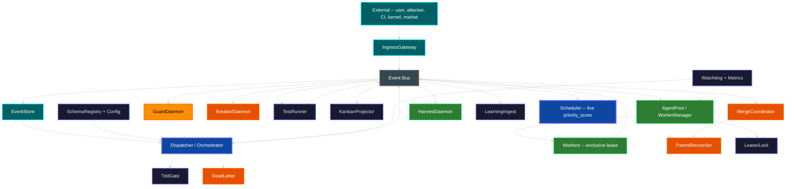

### 12.3 Orchestration, scale, fault tolerance

**Event-driven.** No daemon polls a clock to mutate state. TimerDaemon publishes `TIMER_TICK`; subscribers decide.

**Dynamic.** Node types, event kinds, guards, breakers, harvest rules, and transitions load from SchemaRegistry + Config. Shipping a new kind is a registry write, not a binary change (seed catalog in section 9 is the minimum).

**Scalable.**

- Work events partition by `work_item_id`.
- Agent execution partitions by `owned_subtree`.
- Merge-point evaluation runs on the **parent partition** keyed by `parent_card` / `parent_id`. Children do not take a global lock. Each child completion event carries `parent_id`. The bus copies (or the parent partition subscribes to) those events onto the parent partition. MergeCoordinator on that partition counts arrivals and CAS-updates `IMergePoint.state`.
- Multi-instance Dispatcher: any replica may process a work partition (competing consumers with partition affinity preferred). For merge evaluation, either (a) elect a leader per parent partition, or (b) leaderless CAS on merge-point state in EventStore. Both are legal; Config selects. CAS is the default (no extra consensus system required).

**Fault tolerant.**

- At-least-once delivery. Projectors and MergeCoordinator are idempotent on event id / `TRANSITION_COMMITTED` id.
- Lease expiry returns the card to `ready` or `blocked`. No forever lock.
- Poison messages after Retry/Backoff budget -> DeadLetter. They do not stall the partition forever.
- Orchestrator is stateless vs EventStore. Restart = replay.
- Backpressure: bounded in-memory queues; publish blocks or rejects with retry when the partition lag exceeds Config.
- Worker-spawn circuit breaker reuses `spawn_budget(depth) = floor(8 / 2^depth)` and a churn threshold.
- Snapshot/Checkpoint bounds replay time. Backup/restore of EventStore is a production requirement (section 13).

**Robust.** Graceful drain: stop IngressGateway, finish in-flight transitions, refuse new `WORK_CLAIMED`, wait leases to expire or complete, then snapshot. Workers MAY be sandboxed with bwrap; the engine does not hard-require it.

### 12.4 Sequence -- attacker disclosure to merge accepted

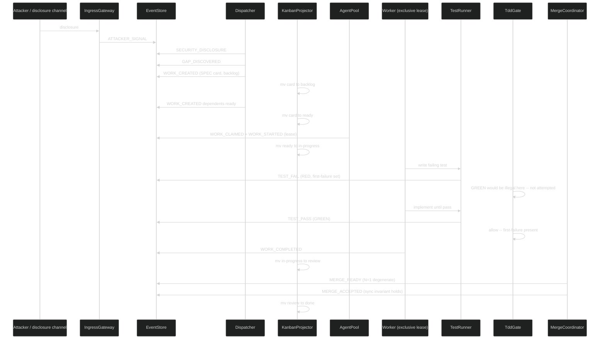

### 12.5 Live scheduler (one board, and board-of-boards)

The orchestrator does not use a compiled-in priority list. Scheduler recomputes `priority_score` on every `TRANSITION_COMMITTED`, `WORK_UNBLOCKED`, ageing `TIMER_TICK`, and ingress event. Weights live in Config.

```
priority_score(card) =
    w_p0    * is_P0
  + w_dep   * dependents_blocked_count
  + w_age   * age_in_ready_ms
  + w_merge * merge_point_waiting_on_this
  + w_risk  * security_or_breaker_flag
  + w_zoom  * (1 / (1 + nesting_level))
  - w_wip   * (column_wip / column_wip_limit)
  - w_lease * already_has_owner
```

**Pick:** AgentPool offers the highest-score `ready` card whose `owned_subtree` is free and whose deps are `done`. Tie-break: older `entered_ready`.

**Schedule:** claim = lease. WIP limits are hard.

**Reschedule:** a `SECURITY_DISCLOSURE` can jump a card over aged work without a batch reorder. Preemption of P3 for P0 is Config-gated and emits `WORK_RELEASED` reason=preempt.

A **board-proxy** card represents a child kanban. The parent Scheduler scores the proxy, not every child card. The parent MUST NOT read the child EventStore to pick a SPEC. Contract + proxy card only.

```
on event e (per partition):
  persist e
  apply transition             # Dispatcher + TddGate
  project card mv
  update scores for {e.card} union dependents union same-merge-siblings
  if agent idle and ready nonempty:
      c = argmax score(ready, subtree free, wip ok)
      claim(c)
  evaluate merge if e has parent_id
  watchdog probes that subscribe to e run immediately
```

Rendezvous is event correlation, not a thread join: child completions are copied onto the `parent_id` partition; MergeCoordinator CAS-updates arrival count on that event. A missing child is discovered when `TIMER_TICK` + Watchdog says the child is dead (`WORK_BLOCKED` + `MERGE_BLOCKED`), live, not at end of day.

### 12.6 Watchdog probes and errant forks (live)

Watchdog is a daemon. It does not batch-scan logs. It MUST be able to SIGKILL a worker it spawned. It MUST NOT write SPEC/test/impl bodies. Recovery is always: lease expire -> card on `ready`/`blocked` -> another agent may claim.

| Probe | Period | Crazy / dead if | Action |
|---|---|---|---|
| Heartbeat | Config `heartbeat_ms` via `TIMER_TICK` | No beat for `3 * heartbeat_ms` | Expire lease; `WORK_RELEASED` reason=watchdog |
| Progress | Config `progress_idle_ms` | Lease held, no `TRANSITION_COMMITTED` from that agent | `WATCHDOG_STALL`; after 2, `WORK_BLOCKED` reason=stall; no auto-GREEN |
| Output entropy | on each worker event | Token/repeat storm, or `TEST_PASS` with no `first-failure` | `WATCHDOG_THRASH`; kill worker; card stays RED or `blocked` |
| File write set | on each commit projection | Write outside `owned_subtree` | `WORK_CONFLICTED`; kill; revoke lease |
| Recursion | on spawn | `depth` or `spawn_budget` exceeded | `TRANSITION_REJECTED`; no spawn |
| Oscillation | on RGB events | Same SPEC `CODE_REGRESSION` past bound without escalation | Signal BreakerDaemon / force `INTEGRATION_FLAW` |
| Divergence | git/worktree adapter | Branch exists with no live lease and no `MERGE_ACCEPTED` | `FORK_ORPHAN` |

| Fork kind | How discovered | Event | Remedy |
|---|---|---|---|
| Orphan process | Heartbeat miss | `WORK_RELEASED` reason=dead | Kill PID if still in AgentPool; card to `ready`/`blocked` |
| Orphan branch / worktree | write_set or git adapter with no lease | `FORK_ORPHAN` | Do not merge; card `blocked` |
| Writes outside subtree | write_set vs `owned_subtree` | `WORK_CONFLICTED` | Kill; revoke lease |
| Reward-hack GREEN | `TEST_PASS` with null `first-failure` | `TRANSITION_REJECTED` + `WATCHDOG_THRASH` | TddGate forbids; Watchdog kills repeater |
| Escalation refusal | RGB bound hit, agent retries SPEC | Watchdog forces `INTEGRATION_FLAW` | SPEC lease dropped; parent FEAT/ARCH card moves |
| Split-brain two owners | second `WORK_CLAIMED` | `TRANSITION_REJECTED` | First lease wins |
| Child gone, parent waiting | `TIMER_TICK` + merge child not arrived + child lease expired | `MERGE_BLOCKED` | Parent `blocked`; child card reappears `ready` |
| Recursion bomb | spawn beyond depth/budget | `TRANSITION_REJECTED` | No new agent |

### 12.7 Localized ER schemas (rebuildable from EventStore)

The filesystem kanban remains the **workflow projection**. Each daemon MAY have a **local** relational store for queries `ls`/`mv` cannot do (leases, scores, heartbeats, event index). Stores are **per subsystem**, not one god database. EventStore is source of truth; local tables are rebuildable from replay. Identifiers are ASCII.

```
event (tenant_id, seq, partition_key, event_id PK, kind, schema_ver,
       idempotency_key UNIQUE, work_item_id, parent_id, actor_id, payload_ref, ts_store)
snapshot (tenant_id, partition_key, seq, blob_ref)
node (filename_id PK, type, parent, state, tdd_state, first_failure, iterations)
transition_reg (from_state, event_kind, to_state, predicate_ref)
committed (event_id PK, node_id, from_state, to_state)
card (filename_id PK, column, owned_subtree, owner_agent NULL, parent_card,
      card_kind, priority, priority_score, entered_column_ts)
column (name PK, wip_limit)
board_proxy (card_id PK, child_instance_id, child_strat_id)
lease (resource_id PK, agent_id, level, expires_seq, heartbeat_seq)
agent (agent_id PK, parent_agent, nesting_level, status, pid, spawn_ts)
merge_point (parent_card PK, required_state, state, n_expected, n_arrived)
merge_child (parent_card, child_card PK, arrived_event_id)
heartbeat (agent_id PK, last_seq, last_event_id)
stall (agent_id, stall_count, last_progress_seq)
write_set (event_id, path)
harvest_candidate (component_id PK, metric, value, last_event)
learning (event_id PK, class, action, target_filename_id)
ingress_dedup (idempotency_key PK, event_id)
```

`mv` of the card file and the `card.column` row MUST apply under the same `TRANSITION_COMMITTED` id. If FS `mv` succeeds and the row fails, replay repairs the row.

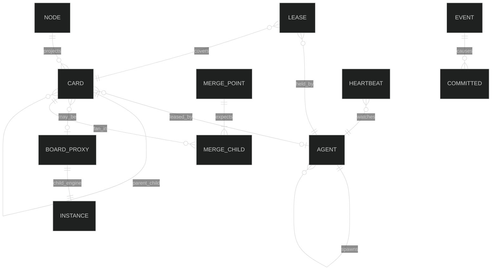

Cross-instance: parent `BOARD_PROXY.child_instance_id` is the only FK out. No join from parent Scheduler into child `CARD` rows.

---

## 13. Production Requirements Checklist

Implementations MUST satisfy the product requirements and the production-hardening requirements. A green test banner is not evidence that this list is done.

### 13.1 Product (engine semantics)

- [ ] Cohesive event + feedback + docs + process + TDD (one catalog, one dispatch registry)
- [ ] One workstream kanban (`backlog`, `ready`, `in-progress`, `blocked`, `review`, `done` + merge-point columns)
- [ ] Parallel subagents with exclusive card + exclusive subtree leases
- [ ] Merge points (N-child fan-in; N=1 = `MERGE_ACCEPTED`; `WORK_MERGED` alias)
- [ ] External and internal events both on the bus
- [ ] Learning CREATE / REVISE / RETIRE with EFFICIENCY vs CAPABILITY
- [ ] Wrong SPEC and wrong FEAT identified in TDD (`SPEC_WRONG`, `FEAT_WRONG`) -- tests not silently rewritten to match a bad spec
- [ ] Sync invariant `SPEC == test == impl == process/template` at `MERGE_ACCEPTED`
- [ ] Inner TDD, mid RGB with bounds, outer harvest/spawn/reset, meta process/template revision
- [ ] Recursive child SDLC is a full engine instance with the same event grammar
- [ ] Implementable subsystems as named daemons (section 12)
- [ ] Dynamic registries -- not hardcoded node/kind/guard lists
- [ ] Async event-driven (timers emit `TIMER_TICK`)
- [ ] Scalable partitioning (`work_item_id`, `owned_subtree`, parent merge partition)
- [ ] TDD gate: `NOT_STARTED -> GREEN` is `TRANSITION_REJECTED`
- [ ] Hub never content-merges files
- [ ] Rejected MOTIs recorded (competing approaches guard)

### 13.2 Production hardening

- [ ] Authn/authz on IngressGateway (unauthenticated events dropped)
- [ ] Audit log = EventStore (no parallel unaudited log)
- [ ] Secrets: not in event payloads; reference vault ids
- [ ] Multi-tenancy isolation of event partitions (`tenant_id` prefix)
- [ ] Schema evolution / versioning of events (SchemaRegistry)
- [ ] Clock / ordering: per-partition total order; happens-before via parent_id copy onto parent partition
- [ ] Idempotency keys on ingress and on projector apply
- [ ] Graceful drain (section 12.3)
- [ ] Backup / restore of EventStore
- [ ] SLO / error budget (dispatch lag, merge latency, DLQ rate)
- [ ] Chaos / fault-injection hooks (BreakerDaemon Chaos Engineering path)
- [ ] Observability: metrics, traces, logs (Metrics/Tracing daemon)
- [ ] Rate limits on IngressGateway
- [ ] Sandboxing of workers: MAY run in bwrap; MUST NOT be hard-required by the generic engine
- [ ] Bounded queues / backpressure
- [ ] Dead-letter + retry/backoff
- [ ] TTL leases (no forever locks)
- [ ] Snapshot / checkpoint
- [ ] Multi-instance Dispatcher with CAS or leader on merge-point state
- [ ] Always-on daemons -- no batch automation, no nightly card-move jobs
- [ ] Hierarchical agents (`parent_agent`, `depth`) with event-correlation rendezvous and Watchdog probes
- [ ] Live Scheduler `priority_score` (Config weights); board-proxy cards for child engines
- [ ] Localized ER schemas per daemon, rebuildable from EventStore (section 12.7)
- [ ] Errant-fork / runaway-AI detection in Watchdog (`FORK_ORPHAN`, `WATCHDOG_STALL`, `WATCHDOG_THRASH`)

---

## 14. One Loop at Every Zoom

The engine is a single observe-decide-act-emit-project cycle. Changing zoom changes **which card** the cycle is looking at, not which engine is running.

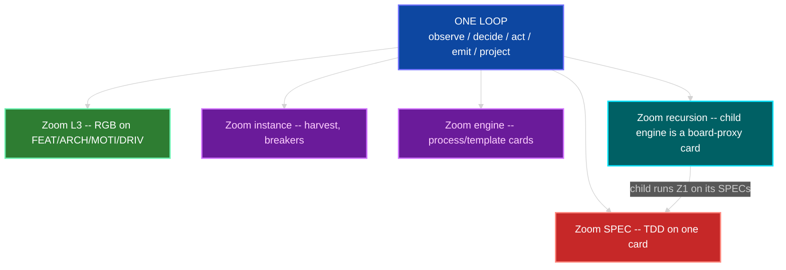

Self-improvement is not a special mode. A `PROCESS_DEFECT` is a card. A harvest is a card. A child SDLC is a board-proxy card. All wait on `ready`, take a lease, go RED before GREEN, fan in at a merge point.

---

## 15. Live Orchestrator -- Agents, Sub-agents, Rendezvous, Watchdogs

The orchestrator (Dispatcher + AgentPool + MergeCoordinator + Watchdog) is **always running**. It never "starts a run." Cards appear via events. Workers are processes with a parent pointer. Nesting is `IAgent.parent_agent` + `nesting_level` (0 = hub-spawned, 1..3 = sub / sub-sub / sub-sub-sub). Hard stop: `nesting_level >= 4` is `TRANSITION_REJECTED`.

### 15.1 Hierarchy

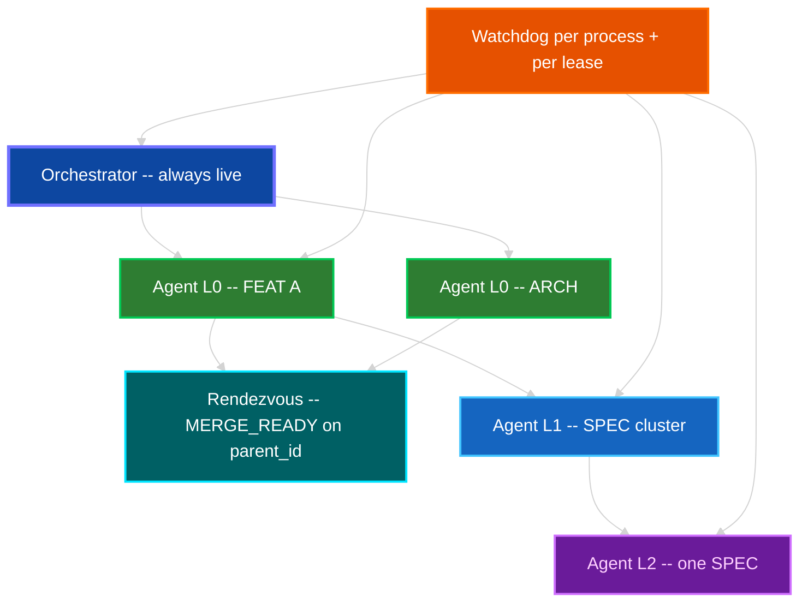

| Level | Who spawns | May write | Rendezvous |
|---|---|---|---|
| Orchestrator | process supervisor | event order, card `mv`, merge eval, parent reconcile | n/a -- it IS the rendezvous host |
| L0 agent | AgentPool | exclusive FEAT or ARCH subtree | children must `MERGE_ACCEPTED` before L0 `WORK_COMPLETED` |
| L1 agent | L0 via `WORK_DECOMPOSED` | exclusive child card(s) inside that subtree | same merge-point grammar |
| L2 / L3 | L1 / L2 | one SPEC or one test file | TDD events; parent lease remains with ancestor |

A parent MUST NOT write files covered by a live child lease. That is `WORK_CONFLICTED`.

### 15.2 Rendezvous (not a barrier sleep)

Rendezvous is **event correlation**, not a thread join and not a batch.

1. Parent card lists `child_cards` on `IMergePoint`.
2. Each child completion is published on the child's `work_item_id` partition **and copied** onto the `parent_id` partition (happens-before).
3. MergeCoordinator, already subscribed, CAS-updates arrival count **on that event**. If count < N, emit `MERGE_BLOCKED` (or stay OPEN). If count == N, emit `MERGE_READY` then evaluate sync invariant.
4. No daemon polls "are the children done?" A missing child is discovered when `TIMER_TICK` + lease/watchdog says the child is dead (section 18), which emits `WORK_BLOCKED` on the child and `MERGE_BLOCKED` on the parent -- live, not at end of day.

### 15.3 Watchdogs -- gone-crazy process or AI

Watchdog is a daemon. It does not batch-scan logs.

| Probe | Period (via `TIMER_TICK`) | Crazy / dead if | Action (live) |
|---|---|---|---|
| Heartbeat | Config `heartbeat_ms` | No beat for `3 * heartbeat_ms` | Expire lease; card -> `ready` or `blocked`; emit `WORK_RELEASED` reason=watchdog |
| Progress | Config `progress_idle_ms` | Lease held, no `TRANSITION_COMMITTED` from that agent | `WATCHDOG_STALL`; after 2 stalls, `WORK_BLOCKED` reason=stall; do not auto-GREEN |
| Output entropy | on each worker event | Token/repeat storm, or identical TEST_PASS with no first-failure | `WATCHDOG_THRASH` / `SPEC_WRONG`; kill worker; card stays RED or blocked |
| File write set | on each commit projection | Write outside `owned_subtree` | `WORK_CONFLICTED`; kill worker; revoke lease |
| Recursion | on spawn | `nesting_level` or `spawn_budget` exceeded | `TRANSITION_REJECTED`; no spawn |
| Oscillation | on RGB events | Same node `CODE_REGRESSION` more than bound without escalation | BreakerDaemon (already defined) -- Watchdog only signals metrics |
| Divergence | on git/worktree if used | Branch exists with no live lease and no `MERGE_ACCEPTED` | `FORK_ORPHAN` (section 18) |

Watchdog MUST be able to **SIGKILL** a worker it spawned. It MUST NOT write SPEC/test/impl bodies. Recovery is always: lease expire -> card visible on `ready`/`blocked` -> another agent may claim. Always live.

### 15.4 No batching (binding)

Forbidden: nightly jobs that move cards, cron that "syncs the board", queued "orchestration runs", harvest that only runs at 02:00, merge evaluation that waits for a scheduled sweep.

Required: every state change is an event handled by a running subscriber before the next event on that partition is considered complete (backpressure, not deferral).

---

## 16. Dynamic Scheduling -- Kanban and Kanban of Kanbans

The orchestrator does not use a hardcoded priority list. It **scores live** on every `TRANSITION_COMMITTED`, `WORK_UNBLOCKED`, `TIMER_TICK` (for ageing only), and ingress event. The score is a function in Config / SchemaRegistry, not compiled-in.

### 16.1 Pick / schedule / reschedule

On each of those events, Scheduler (a Dispatcher policy module) recomputes `priority_score` for every card in `ready` and every board-proxy card (child engine) that is `in-progress` on the parent board.

```
priority_score(card) =
    w_p0    * is_P0
  + w_dep   * dependents_blocked_count
  + w_age   * age_in_ready_ms
  + w_merge * merge_point_waiting_on_this
  + w_risk  * security_or_breaker_flag
  + w_zoom  * (1 / (1 + nesting_level))
  - w_wip   * (column_wip / column_wip_limit)
  - w_lease * already_has_owner
```

Weights live in Config. Changing weights is a config event, not a deploy.

**Pick:** AgentPool offers the highest-score `ready` card whose `owned_subtree` is free and whose deps are `done`. Tie-break: older `entered_ready`.

**Schedule:** claim = lease. WIP limits are hard: if column or agent WIP is full, next card stays `ready`. No overcommit.

**Reschedule:** any new event can change scores. A `SECURITY_DISCLOSURE` can jump a card over aged work **without a batch reorder job** -- the next claim sees the new score. Preemption: if a P0 security card is `ready` and an L0 agent holds only P3 work, Watchdog MAY request `WORK_RELEASED` on the P3 (cooperative) after `preempt_grace_ms`. Forcible preemption is Config-gated and emits `WORK_RELEASED` reason=preempt.

### 16.2 Board of boards

A board-proxy card represents a child kanban (harvest spawn or a FEAT decomposed into a nested board). The parent's Scheduler scores the **proxy**, not every child card. The child's Scheduler scores the child's cards independently. This is how zoom works for scheduling:

| Zoom | What is scored | Who scores |
|---|---|---|
| Child SPEC | child `ready` cards | child Dispatcher |
| Parent FEAT | parent cards + board-proxies | parent Dispatcher |
| Fleet | instance-level board-proxies only | parent of instances (if any) |

The parent MUST NOT reach into the child EventStore to pick a SPEC. That would be a second orchestrator and a batch-shaped query. Contract + proxy card only.

### 16.3 Algorithm sketch (implementable)

```
on event e:
  persist e                    # EventStore append
  apply transition             # Dispatcher + TddGate
  project card mv              # KanbanProjector
  update scores for {e.card} union dependents union same-merge-siblings
  if agent idle and ready nonempty:
      c = argmax score(ready, subtree free, wip ok)
      claim(c)                 # lease
  evaluate merge if e has parent_id
  watchdog probes that subscribe to e run immediately (not later)
```

All steps are synchronous on the **partition**. Across partitions they are async copies. No global sort of the whole fleet.

---

## 17. Localized ER / RDBMS Schemas

The filesystem kanban remains the **workflow projection** (GenericWorkstreamKanbanEngine). Each daemon MAY have a **local** relational store for queries it cannot do with `ls`/`mv` alone (leases, scores, heartbeats, event index). Stores are **per subsystem**, not one god database. The EventStore is still source of truth; local tables are rebuildable from replay.

Character set: ASCII identifiers. Types below are logical; Postgres is a valid mapping.

### 17.1 EventStore (instance-local)

```
event (
  tenant_id, seq, partition_key, event_id PK,
  kind, schema_ver, idempotency_key UNIQUE,
  work_item_id, parent_id, actor_id,
  payload_ref, ts_store
)
snapshot (tenant_id, partition_key, seq, blob_ref)
```

### 17.2 Dispatcher / transition

```
node (filename_id PK, type, parent, state, tdd_state, first_failure, iterations)
transition_reg (from_state, event_kind, to_state, predicate_ref)
committed (event_id PK, node_id, from_state, to_state)
```

### 17.3 Kanban projector

```
card (filename_id PK, column, owned_subtree, owner_agent NULL,
      parent_card, priority, entered_column_ts, score)
column (name PK, wip_limit)
board_proxy (card_id PK, child_instance_id, child_strat_id)
```

`mv` of the file and the `card.column` row MUST be the same transaction from the projector's point of view (event id apply). If the FS `mv` succeeds and the row fails, replay repairs the row.

### 17.4 Lease / AgentPool

```
lease (resource_id PK, agent_id, level, expires_seq, heartbeat_seq)
agent (agent_id PK, parent_agent, nesting_level, status, pid, spawn_ts)
```

### 17.5 MergeCoordinator

```
merge_point (parent_card PK, required_state, state, n_expected, n_arrived)
merge_child (parent_card, child_card PK, arrived_event_id)
```

### 17.6 Watchdog

```
heartbeat (agent_id PK, last_seq, last_event_id)
stall (agent_id, stall_count, last_progress_seq)
write_set (event_id, path)   -- for owned_subtree checks
```

### 17.7 Harvest / Learning / Ingress (local)

```
harvest_candidate (component_id PK, metric, value, last_event)
learning (event_id PK, class, action, target_filename_id)
ingress_dedup (idempotency_key PK, event_id)
```

### 17.8 ER (engine instance)

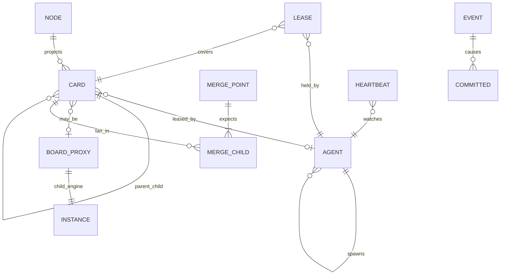

Cross-instance: parent `BOARD_PROXY.child_instance_id` is the only FK out. No join from parent Scheduler into child `CARD` rows.

---

## 18. Errant Forks and Bad Work -- Discovered Live

A **fork** here is a running agent, worktree, or card lineage that is not authorized by a live lease and a live parent, or that oscillates / writes outside its subtree.

| Kind | How discovered (live) | Event | Remedy |
|---|---|---|---|
| Orphan process | Watchdog heartbeat miss | `WORK_RELEASED` reason=dead | Kill PID if still in AgentPool table; card to `ready`/`blocked` |
| Orphan branch / worktree | write_set or git adapter event with no `lease` row | `FORK_ORPHAN` | Do not merge; card `blocked`; human/agent card to delete or claim |
| Bad fork (writes outside subtree) | write_set vs `owned_subtree` | `WORK_CONFLICTED` | Kill; revoke lease |
| Thrash / reward-hack GREEN | TEST_PASS with null `first_failure` | `TRANSITION_REJECTED` + `WATCHDOG_THRASH` | TddGate already forbids; Watchdog kills repeater |
| Escalation refusal | RGB bound hit, agent keeps retrying SPEC | `INTEGRATION_FLAW` not emitted -- Watchdog forces the event | Card moves to parent FEAT/ARCH; agent lease on SPEC dropped |
| Split-brain two owners | second `WORK_CLAIMED` | `TRANSITION_REJECTED` | First lease wins |
| Child gone, parent waiting | `TIMER_TICK` + merge child not arrived + child lease expired | `MERGE_BLOCKED` | Parent stays blocked; child card reappears `ready` |
| Recursion bomb | spawn beyond depth/budget | `TRANSITION_REJECTED` | No new agent |

`FORK_ORPHAN` and `WATCHDOG_STALL` / `WATCHDOG_THRASH` MUST be added to SchemaRegistry (they are catalog kinds; Dispatcher registers them as in section 5.1). They project to `blocked` or `ready` like any other work event. They are never a batch report.

---

## Changelog

| Version | Date | Author | Changes |
|---|---|---|---|
| 0.0.1 | 2026-08-18 | Frederick Bloom | Original generic deterministic engine: taxonomy, RGB, guards, breakers, event-sourced core, star orchestrator, harvest, interfaces, event catalog. |
| 0.0.2 | 2026-08-30 | Frederick Bloom + Claude (Cursor AI) | Overlay attempt (workstream kanban, exclusive ownership, merge-point events, process/external events, TDD gate notes). **FAILED integration** -- two kanbans, two merge stories, two ownership models, ARCH as both L3 and peer, DRIV/MOTI as both L1 peers and parent/child, `STRATEGIC_PIVOT` outside catalog. Kept as historical sibling. Do not implement. |
| 0.0.3 | 2026-08-30 | Frederick Bloom + Claude (Cursor AI) | Integrated rewrite plus live-orchestrator completion. Layers: L0 STRAT, L1 DRIV (problem), L2 MOTI (approach), L3 FEAT and ARCH peers. One kanban, one merge, one exclusive-lease ownership. Loops are zoom levels of one cycle (not four products). Section 6.2 is a colored flowchart. Always-on daemons (no batch). Hierarchical agents, rendezvous, watchdogs. Dynamic live scheduler and board-of-boards. Localized ER schemas. Errant-fork detection in-process. UUID prefix reused from 0.0.1 by explicit user ruling. |
