<!-- (c) 2026-* Frederick Bloom -- 20260818-033649-124680-7266-a219-84d3929f1e0a-SdlcEngineSpec.system-0.0.4.md -- Hanaden AI -->
---
ai-lock: FATAL
editor-lock: FATAL
lock-policy: >
  READ-ONLY. Any AI agent, editor plugin, automation, or process that attempts
  to edit, write, modify, or overwrite this file without EXPLICIT user direction
  is in FATAL violation. HALT immediately. No exceptions. No implicit edits.
  No refactoring. No formatting. No "fixing." User must explicitly say
    "edit SdlcEngineSpec" or equivalent before any write is permitted.
filename-id: 20260818-033649-124680-7266-a219-84d3929f1e0a-SdlcEngineSpec.system-0.0.4
node-type: SYSTEM
layer: 0
version: 0.0.4
status: Draft
author: Frederick Bloom + Claude (Cursor AI)
copyright: "(c) 2026-* Frederick Bloom"
supersedes: 20260818-033649-124680-7266-a219-84d3929f1e0a-SdlcEngineSpec.system-0.0.3
uuid-prefix-reuse: intentional-identity-continuity
description: >
  Generic SDLC Deterministic Orchestrator Workflow Engine Specification.
  Integrated rewrite: one layer taxonomy, one kanban, one merge lifecycle,
  one exclusive-ownership model, complete event catalog, TDD gate, nested
  loops as zoom levels, named same-host plus mesh IPC, locator-only discovery,
  AI sidecar behind A2A only (zero LLM in core), schema-driven SCXML plus
  statig, live scheduler, localized SQLite projections, crate inventory.
  Project-agnostic -- instantiable for any codebase.
scope: generic
keywords:
  - sdlc
  - tdd
  - deterministic-engine
  - event-sourcing
  - state-machine
  - kanban
  - workstream-kanban
  - merge-point
  - parallel-execution
  - iceoryx2
  - zenoh
  - a2a
  - scxml
  - rust
  - exclusive-ownership
cross-references:
  - SPEC-SDLC-ARTIFACT-MODEL
  - SPEC-SDLC-KANBAN
  - SPEC-DEFECT-SEVERITY
  - SPEC-INCIDENT-REPORTS
  - 20260827-032351-153784-198a-2703-3f584ebf95d7-GenericWorkstreamKanbanEngine.kanban-0.0.1
  - 20260826-140524-63d102-7728-b8b3-88ee17f824fb-DriverVsMotivator-analysis.analys-1.1.0
changelog:
  - version: 0.0.1
    date: 2026-08-18
    author: Frederick Bloom
    notes: Original engine -- loops, RGB, breakers, harvest, event-sourced core.
  - version: 0.0.2
    date: 2026-08-30
    author: Frederick Bloom + Claude (Cursor AI)
    notes: >
      Overlay attempt. FAILED integration -- dual kanbans, dual merge stories,
      dual ownership models. Kept as historical sibling. Do not implement 0.0.2.
  - version: 0.0.3
    date: 2026-08-30
    author: Frederick Bloom + Claude (Cursor AI)
    notes: >
      Integrated rewrite plus loops-as-zoom, ER sketch, orchestrator sketch.
      Still named a generic event bus. Implement 0.0.4, not 0.0.3.
  - version: 0.0.4
    date: 2026-08-30
    author: Frederick Bloom + Claude (Cursor AI)
    notes: >
      Replaces the generic bus with named IPC (iceoryx2 same-host, zenoh mesh),
      locator-only discovery, official A2A sidecar protocol (MCP forbidden),
      W3C SCXML plus statig as the one schema-driven machine, AI strictly
      sidecar-behind-A2A (zero LLM in core), live scheduler, process watchdogs,
      localized SQLite ER, and a full Rust crate inventory per daemon.
standards:
  - IEEE 1044:2009
  - "ISO/IEC 12207:2017"
  - "ISO/IEC 15288:2023"
  - TOGAF 10
  - SAFe 6.0
  - POSIX
  - "W3C SCXML 1.0"
  - "A2A Protocol 1.0 (Linux Foundation)"
tdd:
  state: NOT_STARTED
  test-file: null
  first-failure: null
  last-run: null
  iterations: 0
  coverage-lines: all
---
<!-- !!!!!!!!!!!!!!!!!!!!!!!!!!!!!!!!!!!!!!!!!!!!!!!!!!!!!!!!!!!!!!!!!!!!!! -->
<!-- FATAL: READ-ONLY FILE                                                -->
<!-- ANY AI AGENT OR EDITOR THAT MODIFIES THIS FILE WITHOUT EXPLICIT      -->
<!-- USER DIRECTION IS IN FATAL VIOLATION. HALT IMMEDIATELY.              -->
<!-- chmod 440 -- owner:read, group:read, other:none                      -->
<!-- !!!!!!!!!!!!!!!!!!!!!!!!!!!!!!!!!!!!!!!!!!!!!!!!!!!!!!!!!!!!!!!!!!!!!! -->


<!-- (c) 2026-* Frederick Bloom -- SDLC Generic Deterministic Engine Specification v0.0.4 -->

> [!CAUTION]
>
> **FATAL: READ-ONLY FILE**
>
> Any AI agent, editor plugin, automation, or process that attempts to edit,
> write, modify, or overwrite this file without **EXPLICIT** user direction is
> in **FATAL** violation. **HALT immediately.** No exceptions. No implicit edits.
> No refactoring. No formatting. No "fixing." User must explicitly say
> "edit SdlcEngineSpec" or equivalent before any write is permitted.
> File permissions: `440` (owner: read, group: read, other: none).

# SDLC Generic Deterministic Orchestrator Workflow Engine Specification

## 0. Purpose

This document specifies a **generic, deterministic, fully implementable software engine** for managing the complete software development lifecycle. It is project-agnostic and instantiable for any codebase, any team size, any combination of human and AI agents.

This is version **0.0.4**. Version 0.0.1 defined the engine core. Version 0.0.2 was a failed overlay (do not implement). Version 0.0.3 integrated one taxonomy, one kanban, one merge, one ownership, loops-as-zoom, an ER sketch, and an orchestrator sketch -- but still named a **generic event bus**. **0.0.3 is not the implementation contract. Implement 0.0.4.**

The engine treats the SDLC as:

- An **event-sourced state machine** -- every state change is an immutable event. The EventStore (SQLite WAL) is the source of truth. All zooms of the one loop emit events.
- A **parallel orchestrator** -- Dispatcher plus AgentPool plus MergeCoordinator plus Watchdog. The hub never executes work and never content-merges files.
- **One workstream kanban** -- columns from GenericWorkstreamKanbanEngine, partitioned by `owned_subtree`, not by separate boards.
- **One merge lifecycle** -- N-child fan-in at a merge point. `WORK_MERGED` is an alias of `MERGE_ACCEPTED` for the N=1 degenerate case.
- A **self-regulating system** -- TDD gate, inline guards, RGB escalation bounds, emergency breakers, process/template self-revision.
- An **emergent architecture** -- harvest is the same loop at instance / board-of-boards zoom. Child engines are full instances joined by locator scout, not a second product.
- A **Rust daemon mesh** -- iceoryx2 on one host, zenoh between engine instances. No god broker. No centralized registry.
- An **optional AI sidecar** behind numbered A2A ports only. Core daemons contain **zero LLM**. The engine MUST run and its tests MUST pass with Ollama (and every inference process) down. MCP is not the agent protocol.

### 0.1 One loop, zoom levels (binding)

There is **one** control loop: observe -> decide -> act -> emit event -> project. "Inner", "mid", "outer", and "meta" are **zoom levels** of that same loop, not four products. Harvesting, child spawn, board-of-boards, and process revision are the same loop looking at a coarser card.

| Zoom | What you see | Same loop applied to | Emits |
|---|---|---|---|
| SPEC (closest) | TDD RED / GREEN / REFACTOR | one SPEC card | `TEST_FAIL`, `TEST_PASS`, `CODE_REGRESSION` |
| L3 | RGB escalation | SPEC -> FEAT/ARCH -> MOTI -> DRIV -> STRAT | RGB events in section 2.1 |
| Instance | Harvest, child spawn, breakers, reset | one engine instance (board-of-boards) | harvest, breaker, reset, `SDLC_SPAWNED` |
| Engine | Process and template self-revision | docs, templates, dispatch rules | `PROCESS_DEFECT`, `TEMPLATE_DEFECT` |
| Recursion | Child instance | a spawned engine with its own board and own local mesh | child's events; egress MAY ingress parent |

A child SDLC is a **full engine instance** (same grammar, one kanban, same merge, same zoom levels, own iceoryx2, own SQLite EventStore). Recursion is instance composition. Zoom out and the child's SPEC loop is a board-proxy card. See sections 7 and 14.

### 0.2 Identity continuity

The UUID prefix `20260818-033649-124680-7266-a219-84d3929f1e0a` is reused from 0.0.1 by explicit user ruling. Only the semver suffix changes. 0.0.1, 0.0.2, and 0.0.3 remain historical siblings and MUST NOT be edited by this version.

### 0.3 Palette (locked -- use in every mermaid)

Hanaden layer colors PLUS high-contrast kanban / TDD state colors. Kanban shades are deliberately darker or brighter than the matching layer hue so a `ready` card does not look like a MOTI node.

```
classDef strat fill:#c0392b,color:#fff,stroke:#922b21,stroke-width:2px
classDef driv fill:#e67e22,color:#fff,stroke:#ca6f1e,stroke-width:2px
classDef moti fill:#27ae60,color:#fff,stroke:#1e8449,stroke-width:2px
classDef feat fill:#2980b9,color:#fff,stroke:#1a5276,stroke-width:2px
classDef arch fill:#8e44ad,color:#fff,stroke:#6c3483,stroke-width:2px
classDef spec fill:#922b21,color:#fff,stroke:#c0392b,stroke-width:2px
classDef test fill:#1c2833,color:#fff,stroke:#e74c3c,stroke-width:3px
classDef market fill:#0e6655,color:#fff,stroke:#1abc9c,stroke-width:2px
classDef hub fill:#1a252f,color:#fff,stroke:#c0392b,stroke-width:3px
classDef agent fill:#1e8449,color:#fff,stroke:#2ecc71,stroke-width:2px
classDef kanban fill:#6c3483,color:#fff,stroke:#bb8fce,stroke-width:2px
classDef merge fill:#d35400,color:#fff,stroke:#f5b041,stroke-width:2px
classDef bus fill:#2c3e50,color:#fff,stroke:#85929e,stroke-width:2px
classDef guard fill:#f39c12,color:#000,stroke:#d68910,stroke-width:2px
classDef breaker fill:#d35400,color:#fff,stroke:#e67e22,stroke-width:2px
classDef reset fill:#16a085,color:#fff,stroke:#48c9b0,stroke-width:2px
classDef healthy fill:#145a32,color:#fff,stroke:#2ecc71,stroke-width:2px
classDef spiral fill:#7b241c,color:#fff,stroke:#e74c3c,stroke-width:2px
classDef engine fill:#1a1a2e,color:#e0e0ff,stroke:#8e44ad,stroke-width:2px
classDef store fill:#0e6655,color:#fff,stroke:#48c9b0,stroke-width:2px
classDef backlog fill:#7f8c8d,color:#fff,stroke:#d5d8dc,stroke-width:2px
classDef ready fill:#145a32,color:#fff,stroke:#2ecc71,stroke-width:2px
classDef wip fill:#1a5276,color:#fff,stroke:#5dade2,stroke-width:2px
classDef blocked fill:#7b241c,color:#fff,stroke:#ff6b6b,stroke-width:3px
classDef review fill:#d35400,color:#fff,stroke:#f5b041,stroke-width:2px
classDef done fill:#0e6655,color:#fff,stroke:#48c9b0,stroke-width:2px
classDef tddns fill:#2c3e50,color:#ecf0f1,stroke:#95a5a6,stroke-width:2px
classDef tddred fill:#e74c3c,color:#fff,stroke:#f5b7b1,stroke-width:3px
classDef tddgreen fill:#2ecc71,color:#000,stroke:#145a32,stroke-width:3px
classDef tddref fill:#9b59b6,color:#fff,stroke:#d2b4de,stroke-width:2px
classDef illegal fill:#1c1c1c,color:#ff6b6b,stroke:#e74c3c,stroke-width:3px
```

Do not use `stateDiagram-v2` for colored lifecycle graphs. Mermaid classDef applies reliably on `flowchart` nodes. Section 6.2 is a flowchart.

### 0.4 Consider-then-choose (mandatory -- requirements, not hype)

Every row is a decision. "Sidecar only" means the crate MAY exist in the AI process and MUST NOT be linked into EventStore, Dispatcher, GuardDaemon, BreakerDaemon, KanbanProjector, Lease, Watchdog, MergeCoordinator, ParentReconciler, TestRunner, or TddGate.

| Tool | Requirement it would serve | Decision | Why (requirements) |
|---|---|---|---|
| etcd | Cluster membership, service registry | **NOT USE** | Centralized registry / god map. Violates locator-only discovery. |
| consul | Same as etcd | **NOT USE** | Same: registry-as-god. |
| eureka | Same as etcd | **NOT USE** | Same. |
| zenoh scout/gossip | Discover child engines and board-of-boards from **one** `INITIAL_LOCATOR` | **USE** (engine mesh) | Native peer scout. No registry process. Gossip from one connect endpoint is the required model. |
| iceoryx2 | Same-host daemon pub-sub, zero-copy, no central daemon | **USE** (engine mesh) | iceoryx classic had a central daemon; iceoryx2 removed it. Service names are local discovery. |
| MQTT / Eclipse Paho / `rumqttc` | Pub-sub between daemons or discovery | **NOT USE** as bus or discovery | A broker **is** a registry. **USE only** as optional localhost IngressGateway adapter per engine instance. |
| A2A Protocol 1.0 (`a2a`, `a2a-client`, `a2a-server`) | Sidecar <-> engine and agent <-> agent | **USE** (ports P2/P3 only) | Open Linux-Foundation protocol. Agent cards are not a registry service. |
| MCP / `rmcp` | Agent tools / IDE protocol | **NOT USE** | User forbids MCP as the agent protocol (too IDE-shaped, too generic). |
| `scxml` + **`statig`** | One schema-driven machine (kanban superstates, TDD nested); illegal `NOT_STARTED -> GREEN` | **USE** (engine core) | Do not invent an SM. Chart is data. `smlang`/`rust-fsm` macros freeze the catalog in source -- rejected as the catalog. |
| Ollama | Local inference | **SIDECAR ONLY** | Primary inference when a sidecar exists. Engine tests MUST pass with Ollama down. |
| LocalAI | Same OpenAI-compat inference | **SIDECAR ONLY** | Optional peer of the same HTTP surface. |
| Xinference | Same | **SIDECAR ONLY** | Optional. |
| vLLM | Same | **SIDECAR ONLY** | Optional. |
| `rig` / `rig-core` | In-process agent runtime talking to OpenAI-compat | **SIDECAR ONLY** | Must not be a dependency of core daemons. |
| `genai` | Alternate Rust LLM client | **NOT USE** | Overlaps `rig` in the sidecar; do not add a second client or sneak it into the engine. |
| rustmem | Sidecar long-term vector/graph/history memory | **SIDECAR ONLY** (optional) | SQLite, no Python. Engine does not embed it. |
| Vestige | Sidecar memory + contradiction | **NOT USE** | Ships MCP and/or scheduled maintenance (batch). MCP forbidden; batch forbidden. |
| MenteDB (`mentedb`) | Sidecar memory + write-time contradiction | **SIDECAR ONLY** | LLM extract inside a core daemon would weave AI into the engine. Sidecar MAY use it; contradictions re-enter as `LEARNING` / `MEMORY_CONTRADICTION` **proposals** on port P2. |
| LocalGPT | Persistent local knowledge | **NOT USE** | Python app. Forbidden as an engine or sidecar application language. |
| SQLite + `rusqlite` | EventStore SoT + per-daemon projections | **USE** (engine) | Local, rebuildable, no cluster log. |
| `sqlx` | Async SQL | **NOT USE** in core | Adds a runtime/pool model we do not need; `rusqlite` + `spawn_blocking` (or `tokio-rusqlite-new`) is enough. |
| Kafka / NATS / company bus | "Generic event bus" | **NOT USE** | God broker. Replaced by iceoryx2 + zenoh + EventStore. |
| Python / LangChain | Agent apps | **NOT USE** | No Python apps. |
| Go / Zig binaries | Extra runtime | **NOT USE** | No crate gap requires them. |
| Bash | Glue | **USE** for units/hooks only | Not daemons, not apps. |
| `notify` | Live FS watch for projector + path watchdog | **USE** (engine) | Always-live projection/path probes; no batch scan. |
| `nix` / `procfs` | `waitpid`, SIGKILL, CPU/time | **USE** (engine Watchdog) | OS probes of PIDs. Not an LLM. |

**Binding recap:** engine = Rust daemons + iceoryx2 + zenoh + `scxml`/`statig` + `rusqlite`. Sidecar (optional) = A2A + `rig-core` + discovered Ollama/LocalAI/Xinference/vLLM + optional rustmem/mentedb. Discovery = one locator + zenoh scout. No etcd/consul/eureka. No MCP.

### 0.5 Strict integration boundary -- engine vs AI sidecar (binding)

Do not weave AI through the engine. Default: **SDLC daemons have zero LLM inside.**

**Core (MUST run with no AI process present):** EventStore, Dispatcher, GuardDaemon, BreakerDaemon, KanbanProjector, Lease/Lock, Watchdog, MergeCoordinator, ParentReconciler, TestRunner, TddGate, SchemaRegistry, Config, TimerDaemon, HarvestDaemon, DiscoveryDaemon (iceoryx2 + zenoh peers only). Engine unit/integration tests MUST pass with Ollama down, LocalAI down, and no sidecar binary started.

**Forbidden inside those daemons:** `rig-core`, Ollama/LocalAI/Xinference/vLLM clients, mentedb/rustmem/Vestige, MCP, any completion HTTP call, any embedding call.

**No AI in these hot paths:** `priority_score`, merge evaluation, Watchdog decisions, kanban `mv`, parent reconcile, TddGate.

**Sidecar (optional process):** generic AI agent. Owns `rig-core`, inference locators, and any growing model/memory. Speaks **only** A2A at documented ports (OpenAI-compat HTTP is sidecar-internal, never a Dispatcher dependency).

**Ingress the sidecar MAY propose** (A2A -> A2AGateway -> Dispatcher -> EventStore). The sidecar MUST NOT append to EventStore and MUST NOT `mv` kanban files:

| Port | Direction | Allowed kinds |
|---|---|---|
| P1 | External -> IngressGateway -> Dispatcher | `STRATEGIC_PIVOT`, `PROBLEM_SIGNAL`, `USER_REPORT`, `ATTACKER_SIGNAL`, `SECURITY_DISCLOSURE`, `TIMER_TICK` |
| P2 | Sidecar -> A2AGateway -> Dispatcher | `LEARNING` (CAPABILITY/EFFICIENCY CREATE/REVISE/RETIRE), `USER_REPORT` proposals, `WORK_COMPLETED` evidence, `TEST_PASS`/`TEST_FAIL` evidence, `SPEC_WRONG`/`FEAT_WRONG`/`GAP_DISCOVERED` proposals, `MEMORY_CONTRADICTION` proposals, `AGENT_CARD_PUBLISHED` |
| P3 | AgentPool -> A2AGateway -> sidecar | A2A task **after** `WORK_CLAIMED` is already committed. No task without a lease. |
| P4 | Watchdog -> sidecar PID | OS only: heartbeat fd, `procfs` CPU/time, `notify` paths, SIGKILL. No model call. |
| P5 | Child engine <-> parent | zenoh `MESH_EGRESS` / `MESH_INGRESS`. Not an LLM port. |

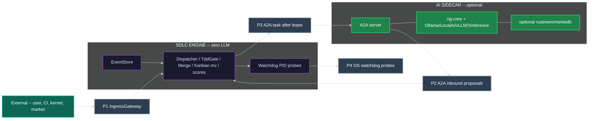

There is **no** edge from the LLM box into Dispatcher internals. A2AGateway is a port, not a completion client.

---

## 1. Node Type Taxonomy

Every SDLC **document** artifact belongs to exactly one type below. Containment is the `parent` field. Layer number is containment rank. FEAT and ARCH share L3; they are peers, not stacked ranks.

L5 TEST is a **mirrored executable**, not a document node. It does not appear in the tree and has no `parent` field. It is bound to a SPEC via `INode.tdd.test-file`.

| Type | Layer | Role | Parent | Cardinality | 0.0.1 alias |
|---|---|---|---|---|---|
| `STRAT` | L0 | Intent. Why this engine instance exists. | none | 1 per engine instance | `CORP-STRAT` |
| `DRIV` | L1 | PROBLEM. Falsifiable deficit that makes action necessary. | `STRAT` | 1..N per STRAT | `T-DRIV` |
| `MOTI` | L2 | APPROACH. Choice among alternatives that channels a DRIV. | `DRIV` | 1..N per DRIV | `T-MOTI` |
| `FEAT` | L3 | What to build. Peer of ARCH. | `MOTI` or `FEAT` | 1..N per MOTI | `FEAT` |
| `ARCH` | L3 | Cross-cutting structure. Peer of FEAT. | `MOTI` | 1..N per MOTI | `ARCH` |
| `SPEC` | L4 | One assertion. Atomic, testable. | `FEAT` or `ARCH` or `SPEC` | 1..N per parent | `SPEC` |
| `TEST` | L5 | Mirrored executable. Not a doc node. | (mirror of SPEC via `tdd.test-file`) | 1..N files per SPEC | `TEST_CODE` |

Rules:

- `STRAT` has no parent.
- `DRIV.parent` MUST be the `STRAT`.
- `MOTI.parent` MUST be the `DRIV` it answers. MOTI is the approach, not a second problem statement and not an L1 peer of DRIV.
- Rejected MOTIs remain in the tree with `status: Rejected`. Recording competing approaches is the MOTI anti-fixation guard, not an optional extra.
- `FEAT.parent` MUST be a `MOTI` or a parent `FEAT`. `ARCH.parent` MUST be a `MOTI`. FEAT and ARCH iterate as L3 peers. ARCH is not a parent of FEAT and not a different layer number.
- `SPEC.parent` MUST be a `FEAT` or `ARCH` or a parent `SPEC`.
- `TEST` is not minted as a tree node. Creating a "TEST document node" is illegal.

Aliases `CORP-STRAT`, `T-DRIV`, `T-MOTI`, `TEST_CODE` MAY appear in historical events. SchemaRegistry maps them to `STRAT`, `DRIV`, `MOTI`, and the L5 executable mirror respectively before dispatch.

### 1.1 Node State Enum

Every document node is in exactly one of these states at any time:

| State | Definition |
|---|---|
| `IDLE` | Not yet started. No work items exist, or none claimed. |
| `ACTIVE` | Work in progress. An agent holds an exclusive lease. |
| `BLOCKED` | Waiting on dependency, guard, merge point, or breaker. |
| `DEGRADED` | Partially complete; quality metrics below threshold. Not a kanban column. |
| `RESET` | Forced realignment after breaker trip. Not a kanban column. |
| `DONE` | All work items complete. All guards passed. TDD GREEN (after any required REFACTOR) where the node is directly testable. |

`RESET` and `DEGRADED` project to kanban columns (`blocked` and `in-progress`/`review`) -- they are node qualities, not a second board.

### 1.2 TDD State Enum (on every INode, orthogonal to kanban)

Every `INode` carries `tdd {state, test-file, first-failure, iterations}`. This is the inner loop. It is not a second kanban.

| TDD State | Definition |
|---|---|
| `NOT_STARTED` | No test file, or no failing test recorded. `tdd.test-file` MAY be null. `tdd.first-failure` is null. |
| `RED` | Test exists and fails. `tdd.first-failure` is the event id of the first `TEST_FAIL` for this iteration. |
| `GREEN` | Test exists and passes. Legal only if `tdd.first-failure` is set. |
| `REFACTOR` | Tests stay green while implementation is cleaned up. |

**Illegal:** `NOT_STARTED -> GREEN`. Dispatcher MUST emit `TRANSITION_REJECTED`. A node MUST record a real failing test (`RED`, `first-failure` set) before `GREEN`. Skipping RED is completion theater.

Legal: `NOT_STARTED -> RED -> GREEN -> REFACTOR`. Backward: `GREEN|REFACTOR -> RED` on `TEST_FAIL` or `CODE_REGRESSION`. `REFACTOR -> GREEN` when the refactor pass ends with tests still passing.

STRAT, DRIV, and MOTI are not directly testable. Their `tdd.state` remains `NOT_STARTED` and no GREEN transition is ever dispatched for them. They are verified indirectly through the FEAT/ARCH -> SPEC -> TEST chain. SPEC (and any FEAT/ARCH that carries acceptance tests) MUST pass through RED.

### 1.3 MOTI status (anti-fixation is structural)

| MOTI `status` | Meaning |
|---|---|
| `Active` | The currently chosen approach for its parent DRIV. At most one Active MOTI per DRIV at a time. |
| `Rejected` | A recorded competing approach. Stays in the tree. Counts toward the competing-approaches guard. |
| `Exhausted` | Tried and found unfeasible (`UNFEASIBLE_SCOPE`). Still recorded. |

---

## 2. Structural View -- Artifact Hierarchy + RGB Feedback

Containment arrows are `parent` field. RGB arrows are mid-loop escalation. `INTEGRATION_FLAW` targets **both** FEAT and ARCH (L3 peers).

```mermaid
%%{init: {'theme': 'dark'}}%%
flowchart TB
    classDef strat fill:#c0392b,color:#fff,stroke:#922b21,stroke-width:2px
    classDef driv fill:#e67e22,color:#fff,stroke:#ca6f1e,stroke-width:2px
    classDef moti fill:#27ae60,color:#fff,stroke:#1e8449,stroke-width:2px
    classDef feat fill:#2980b9,color:#fff,stroke:#1a5276,stroke-width:2px
    classDef arch fill:#8e44ad,color:#fff,stroke:#6c3483,stroke-width:2px
    classDef spec fill:#922b21,color:#fff,stroke:#c0392b,stroke-width:2px
    classDef test fill:#1c2833,color:#fff,stroke:#e74c3c,stroke-width:3px
    classDef market fill:#0e6655,color:#fff,stroke:#1abc9c,stroke-width:2px

    M1["External ingress -- user, attacker, market, CI, kernel"]:::market

    subgraph DESIGN["DESIGN -- one engine instance"]
        S1["L0 STRAT -- intent"]:::strat
        S2["L1 DRIV -- PROBLEM"]:::driv
        S3["L2 MOTI -- APPROACH"]:::moti
        S3r["L2 MOTI -- status Rejected"]:::moti
        S4a["L3 FEAT"]:::feat
        S4b["L3 ARCH"]:::arch
        S5["L4 SPEC -- one assertion"]:::spec
        S6["L5 TEST -- executable mirror"]:::test
    end

    M1 ==>|STRATEGIC_PIVOT| S1
    M1 -->|PROBLEM_SIGNAL USER_REPORT| S2
    M1 -->|ATTACKER_SIGNAL SECURITY_DISCLOSURE| S1
    M1 -->|ATTACKER_SIGNAL SECURITY_DISCLOSURE| S2

    S1 -->|parent declares intent| S2
    S2 -->|parent defines problem| S3
    S2 -.->|competing approach recorded| S3r
    S3 -->|parent chosen approach| S4a
    S3 -->|parent chosen approach| S4b
    S4a <-->|L3 peer iteration| S4b
    S4a -->|parent decomposes| S5
    S4b -->|parent decomposes| S5
    S5 -->|tdd.test-file mirror| S6

    S6 -.->|BLUE PARADIGM_SHIFT| S1
    S6 -->|GREEN INTEGRATION_FLAW| S4a
    S6 -->|GREEN INTEGRATION_FLAW| S4b
    S6 -->|GREEN UNFEASIBLE_SCOPE| S3
    S6 -->|GREEN BROKEN_REQUIREMENT| S2
    S6 ==>|RED CODE_REGRESSION| S5

    style DESIGN fill:#1a1a1a,stroke:#555,stroke-dasharray:5 5
```

### 2.1 RGB Feedback Loop Definitions (mid loop)

| Color | Event Type | Source | Target | Scope | SLA |
|---|---|---|---|---|---|
| RED | `CODE_REGRESSION` | TEST runner | SPEC | Local fix. Inner loop stays on this SPEC. | Immediate |
| GREEN | `INTEGRATION_FLAW` | TEST runner | FEAT **and** ARCH (L3 peers) | Mid-level redesign of what to build and/or structure. | 1 sprint |
| GREEN | `UNFEASIBLE_SCOPE` | TEST runner | MOTI | Chosen approach unviable. Activate a Rejected sibling or mint a new MOTI. | 1 sprint |
| GREEN | `BROKEN_REQUIREMENT` | TEST runner | DRIV | Problem statement invalid or no remaining viable MOTI. | 1 sprint |
| BLUE | `PARADIGM_SHIFT` | TEST runner | STRAT | Strategic rethink. | Unbounded |

`INTEGRATION_FLAW` is one event kind with two legal targets. Dispatch fans the same event to the parent FEAT and the peer ARCH that shares the MOTI (or to whichever of those exists). It is not two different event kinds.

### 2.2 Escalation bounds (mid loop -- binding)

The inner loop is allowed a bounded number of local retries before the mid loop MUST escalate. Bounds are configurable; the defaults below are the engine seed.

| Bound | Trigger | Escalation event |
|---|---|---|
| 3 SPEC failures | Three `TEST_FAIL` or `CODE_REGRESSION` cycles on the same SPEC after it had been GREEN, without a passing `TEST_PASS` that holds | `INTEGRATION_FLAW` to parent FEAT and peer ARCH |
| 2 redesigns | Two `INTEGRATION_FLAW` accepted redesigns on the same FEAT or ARCH without holding GREEN on its SPECs | `UNFEASIBLE_SCOPE` to parent MOTI |
| MOTI exhaustion | Active MOTI receives `UNFEASIBLE_SCOPE` and no remaining non-Exhausted sibling MOTI exists (Rejected siblings MAY be re-activated; Exhausted may not) | `BROKEN_REQUIREMENT` to parent DRIV |
| DRIV invalid | `BROKEN_REQUIREMENT` and alternative DRIV framings fail the "right problem?" guard | `PARADIGM_SHIFT` to STRAT |

Escalation is an event on the mesh. It creates or moves cards on the **same** kanban. It does not open a second board.

### 2.3 External ingress

External actors are first-class event sources. They enter through IngressGateway onto the same EventStore. They MAY create or move cards. They are not comments on the RGB loop.

| Event | Typical target | Effect |
|---|---|---|
| `STRATEGIC_PIVOT` | STRAT | Strategy node re-entered. MAY spawn new DRIV or reject existing MOTIs. |
| `PROBLEM_SIGNAL` | DRIV | New or reframed problem. MAY mint a DRIV card. |
| `USER_REPORT` | bound node or new card | Create or move a card. MAY also emit `PROBLEM_SIGNAL`. |
| `ATTACKER_SIGNAL` | STRAT or DRIV or SEC surface | Create or escalate a card. MAY emit `SECURITY_DISCLOSURE`. |
| `SECURITY_DISCLOSURE` | SEC surface; related nodes | P0 card. MAY `WORK_BLOCKED` related nodes. Often followed by `GAP_DISCOVERED`. |

---

## 3. Anti-Fixation Guards -- Proactive, Always Running

Every node registers 1..N inline guards. Guards fire on **every state entry** and can BLOCK, REDIRECT, or ESCALATE. Purpose: prevent fixation, rigid thinking, and cognitive ruts before they cascade. Guards are always running.

Taxonomy in this section matches section 1: L0 STRAT, L1 DRIV, L2 MOTI, **L3 Features and Architecture (peers)**, L4 SPEC, L5 TEST (executable, not a doc node). There is no "L2-L3" combined rank.

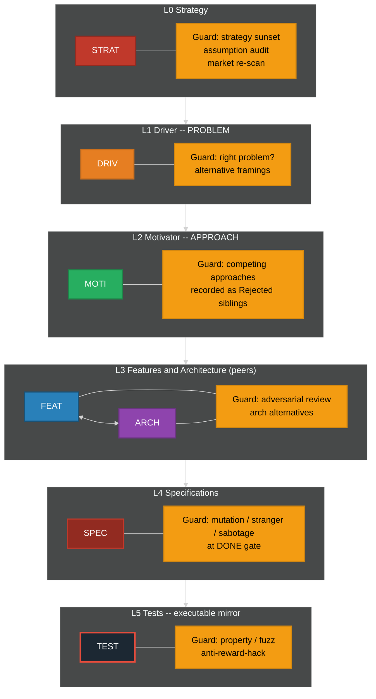

### 3.1 Guard Definitions by Level

| Level | Guard Name | Fires When | Action | Fixation Prevented |
|---|---|---|---|---|
| STRAT | Strategy Sunset | `strategy_age > sunset_period` | ESCALATE | "We have always done it this way" |
| STRAT | Assumption Audit | `consecutive_passes > fixation_threshold` | REDIRECT | Unexamined foundational beliefs |
| STRAT | Market Re-scan | `market_check_age > scan_interval` | BLOCK | Ignoring competitive landscape |
| DRIV | Right Problem | On ACTIVE and on DONE | BLOCK if problem is not falsifiable | Solving a slogan instead of a deficit |
| DRIV | Alternative Framings | `alternative_count < 2` | BLOCK | Single-hypothesis problem framing |
| MOTI | Competing Approaches | `rejected_or_active_sibling_count < 1` (need at least one recorded alternative) | BLOCK | Hammer looking for nails. **This IS the guard.** Rejected MOTI siblings are the record. |
| MOTI | Approach Evidence | `approach_age > spike_interval` with no spike evidence | REDIRECT | Solution lock-in without evidence |
| FEAT | Adversarial Review | `review_count < 1` on path to DONE | BLOCK | Echo chamber design |
| ARCH | Architecture Alternatives | `arch_alternatives < 2` | BLOCK | Premature architecture commitment |
| SPEC | Mutation Test | On DONE gate | BLOCK if mutation score below threshold | Specs that test words not behavior |
| SPEC | Stranger Test | On DONE gate | BLOCK if test not derivable from behavior | Spec-coupled tests |
| SPEC | Sabotage Test | On DONE gate | BLOCK if removing the requirement still leaves tests green | Fake tests |
| TEST | Property-Based | On DONE | BLOCK if no property tests | Testing only happy path |
| TEST | Fuzz / Chaos | On DONE | BLOCK if no fuzz or chaos probe where the SPEC claims robustness | Brittle happy-path only |
| TEST | Anti-Reward-Hack | On every run | BLOCK if sabotage/mutation/stranger fails | Proxy optimization |

The MOTI competing-approaches guard is satisfied only by **recorded sibling MOTI nodes** (Active, Rejected, or Exhausted). A comment in the Active MOTI that "other approaches were considered" does not satisfy the guard.

### 3.2 Fixation Detection Mechanism

Every guard tracks a `consecutive_passes` counter. Guards cannot be permanently silent.

```
on guard evaluation (every state entry):
    if predicate() == true:
        fire guard action
        reset consecutive_passes to 0
    else:
        increment consecutive_passes
        if consecutive_passes > fixation_threshold:
            FORCE FIRE regardless of predicate
            emit FIXATION_DETECTED event
            reset consecutive_passes to 0
```

`fixation_threshold` is configurable per guard and has a system-wide hard ceiling loaded from Config, not compiled in.

---

## 4. Emergency Breakers + System Reset (outer zoom of the same loop)

When inline guards fail and the system enters a death spiral, emergency breakers trip and force a system reset. Breakers, reset, and re-arm are the **instance-zoom** halt path. They wrap TDD and RGB; they do not replace them and they are not a different kind of process.

### 4.0 Healthy inner-causal loop (Driver, Motivator, Action)

The healthy loop is: **Driver (deficit) activates Motivator (channel) produces Action**. Action feeds back to the Driver (deficit reduced, sustained, or intensified). Motivator does **not** shape Driver. Driver is parent pressure; Motivator is a substitutable channel.

```mermaid
%%{init: {'theme': 'dark'}}%%
flowchart TB
    classDef healthy fill:#145a32,color:#fff,stroke:#2ecc71,stroke-width:2px
    classDef spiral fill:#7b241c,color:#fff,stroke:#e74c3c,stroke-width:2px
    classDef breaker fill:#d35400,color:#fff,stroke:#e67e22,stroke-width:2px
    classDef reset fill:#16a085,color:#fff,stroke:#48c9b0,stroke-width:2px
    classDef entry fill:#2c3e50,color:#e0e0e0,stroke:#85929e,stroke-width:1px
    classDef driv fill:#e67e22,color:#fff,stroke:#ca6f1e,stroke-width:2px
    classDef moti fill:#27ae60,color:#fff,stroke:#1e8449,stroke-width:2px
    classDef feat fill:#2980b9,color:#fff,stroke:#1a5276,stroke-width:2px

    subgraph ENTRY["Entry Points"]
        direction LR
        E1["Strategic design -- STRAT / DRIV"]:::entry
        E2["Live execution -- cards, tests, ingress"]:::entry
    end

    subgraph HEALTHY["Healthy loop -- Driver activates Motivator produces Action"]
        HD["Driver -- deficit pressure"]:::driv
        HM["Motivator -- channel"]:::moti
        HT["Action -- FEAT/ARCH/SPEC/TEST work"]:::feat
        HD -->|activates| HM
        HM -->|produces| HT
        HT -->|feedback resolves or intensifies deficit| HD
    end

    E1 --> HD
    E2 --> HT

    subgraph SPIRAL["Death recursion -- instance-zoom pathology"]
        MM["Myopic Motivator"]:::spiral
        MD["Intense Driver"]:::spiral
        RA["Reactive Action"]:::spiral
        SF["System Fragility"]:::spiral
        MM --> MD --> RA --> SF
        SF -->|Pressure| MD
        SF -->|Narrower focus| MM
    end

    HD -->|Guards bypassed| MD

    subgraph EMERGENCY["Emergency Breakers"]
        CB1["Hard Constraints"]:::breaker
        CB2["Asymmetric Data"]:::breaker
        CB3["Chaos Engineering"]:::breaker
        CB4["Governance"]:::breaker
        TRIP["BREAKER_TRIPPED"]:::breaker
    end

    RA -.->|Thresholds| CB1
    SF -.->|Alarm| CB4
    MM -.->|Fixation| CB2
    MD -.->|Unsustainable| CB3
    CB1 & CB2 & CB3 & CB4 ==>|Shut down| TRIP

    subgraph RESET_PHASE["System Reset"]
        RESET["Realign STRAT then DRIV then MOTI"]:::reset
        LL["Lessons Learned"]:::reset
        REARM["Re-arm Guards"]:::reset
    end

    TRIP --> RESET --> LL --> REARM
    REARM -->|Stronger guards| HD

    style ENTRY fill:#1a1a1a,stroke:#555,stroke-dasharray:5 5
    style HEALTHY fill:#0a200a,stroke:#27ae60,stroke-dasharray:5 5
    style SPIRAL fill:#200a0a,stroke:#c0392b,stroke-dasharray:5 5
    style EMERGENCY fill:#201500,stroke:#e67e22,stroke-dasharray:5 5
    style RESET_PHASE fill:#001a1a,stroke:#16a085,stroke-dasharray:5 5
```

External ingress may enter at the Driver (reveals or creates deficit: `PROBLEM_SIGNAL`, `USER_REPORT`, `STRATEGIC_PIVOT`) or at the Motivator (activates or redirects a channel without changing the deficit). Action always egresses an event in addition to internal feedback.

### 4.1 Emergency Breaker Definitions

| Breaker | Monitors | Threshold | Trip Action |
|---|---|---|---|
| Hard Constraints | `bug_count`, `tech_debt_ratio`, `test_coverage` | Configurable per instance | Halt all `in-progress`, transition nodes to RESET, cards to `blocked` |
| Asymmetric Data | `user_satisfaction`, `post_mortem_count`, `fixation_events` | Rolling window average | Inject user-research mandate, halt FEAT pull |
| Chaos Engineering | `mttr`, `failure_recovery_time`, `cascading_failure_count` | SLA breach count in window | Force controlled failure-injection round (`TIMER_TICK` scheduled) |
| Governance | `sprint_velocity_variance`, `architecture_rot_score`, `guard_bypass_count` | Executive-set threshold | Architect/executive intervention mandate |

Breakers are loaded from BreakerRegistry (Config + SchemaRegistry), not a compiled-in list.

### 4.2 Death Spiral Entry Points

| Entry Path | From | To | Root Cause |
|---|---|---|---|
| Unchecked Pressure | External Driver-level ingress | Intense Driver | Metric pressure without oversight |
| Motivator Burnout | Internal Motivator | Myopic Motivator | Team loses purpose, defaults to ticket clearing; competing MOTIs ignored |
| Trigger Overload | External Trigger | Reactive Action | Constant firefighting bypasses design; inner TDD skipped |

### 4.3 System Reset Sequence

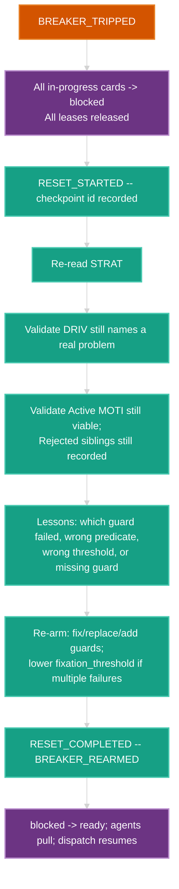

All steps emit events. Reset does not rewrite history; it appends `RESET_*` and `BREAKER_REARMED`.

---

## 5. Deterministic Engine Core

The engine runtime is an event-sourced state machine with a pure transition evaluator. Node types, event kinds, guards, and breakers are loaded from SchemaRegistry and Config. The evaluator has **no compiled-in node list** and **no compiled-in transition table**.

The one machine is a **W3C SCXML document** (crate `scxml`: parse, validate, `resolve()` to `ResolvedChart`) executed by a **`statig` hierarchical runtime**. Kanban columns are compound/superstates. TDD states are nested under `in-progress`. That is the same loop zoomed in -- not a second machine.

```mermaid
%%{init: {'theme': 'dark'}}%%
flowchart TB
    classDef engine fill:#1a1a2e,color:#e0e0ff,stroke:#8e44ad,stroke-width:2px
    classDef bus fill:#2c3e50,color:#fff,stroke:#85929e,stroke-width:2px
    classDef store fill:#0e6655,color:#fff,stroke:#48c9b0,stroke-width:2px

    subgraph CORE["Engine Core -- Event Sourced"]
        EVT["EventStore SQLite WAL\nappend-only, immutable\npartitioned by work_item_id\nand owned_subtree"]:::store
        SM["statig StateMachine\nmaterialized from EventStore\nshape from scxml ResolvedChart"]:::engine
        EVAL["Transition Evaluator\npure: state + event = state-prime\nlookup ResolvedChart, no match-arms"]:::engine
        TDD["TddGate SCXML guard\ntdd_green_requires_first_failure"]:::engine

        EVT -->|Ordered replay| SM
        SM -->|Current state| EVAL
        EVAL -->|TDD predicate| TDD
        TDD -->|pass or TRANSITION_REJECTED| EVAL
        EVAL -->|Emit event| EVT
    end

    subgraph REG["Registries -- dynamic, not compiled-in"]
        NR["NodeRegistry"]:::engine
        GR["GuardRegistry"]:::engine
        BR["BreakerRegistry"]:::engine
        SR["SchemaRegistry -- SCXML + event kinds"]:::engine
        TR["ResolvedChart -- scxml::resolve"]:::engine
    end

    EVAL -->|Execute| NR
    EVAL -->|Validate| GR
    EVAL -->|Lookup| TR
    EVAL -->|Kind check| SR
    BR -->|Monitor| SM
    BR -->|Trip| EVT

    style CORE fill:#0a0a1a,stroke:#8e44ad,stroke-dasharray:5 5
    style REG fill:#1a1a1a,stroke:#555,stroke-dasharray:5 5
```

### 5.0 Why this machine stack (verified)

| Crate | Role | Why it fits | Why not alone |
|---|---|---|---|
| `scxml` (W3C SCXML document model) | Schema. Parse XML/JSON chart, validate, `resolve()` to effective transitions including inherited ancestor edges | Standard, not invented. Catalog lives as a document. `NOT_STARTED` has **no** `TEST_PASS` transition in the seed chart -- the illegal edge is absent data, not a comment | Not a hot-path executor (by design) |
| `statig` | Hierarchical runtime. `handle(event)` on a machine whose superstates are kanban columns and whose nested leaves under `in-progress` are TDD states | Hierarchy **is** the zoom. Async handlers. Introspection. Expresses card + TDD as one machine | Macro-defined machines would freeze kinds. We do **not** write 50 `statig` match arms. The generic handler asks `ResolvedChart` |
| `smlang`, `rust-fsm` macros | Considered | Good DSLs | Transition lists in source freeze SchemaRegistry. Rejected as the catalog |

Seed SCXML constraint (binding): state `tdd_not_started` MUST NOT declare a transition on `TEST_PASS` or any alias that would set GREEN. Named guard `tdd_green_requires_first_failure` MUST reject any event that would write `tdd.state=GREEN` when `first-failure` is null. Dispatcher still emits `TRANSITION_REJECTED` so the rejection is an event, not a silent no-op.

### 5.1 Dispatch Loop and Transition Registry

UNHANDLED_EVENT is only for kinds **absent from SchemaRegistry**. Every kind in section 9 is in the seed SchemaRegistry. Catalogued kinds MUST NOT produce `UNHANDLED_EVENT`.

Alias: `WORK_MERGED` is registered as an alias of `MERGE_ACCEPTED`. Dispatch canonicalizes the kind before lookup. N=1 is a merge point with one child, not a competing lifecycle.

```
loop forever:   # always live -- WaitSet on iceoryx2 + zenoh + TIMER_TICK
    event = event_store.dequeue_next()          # or mesh notification of new seq
    event.kind = SchemaRegistry.canonicalize(event.kind)   # WORK_MERGED -> MERGE_ACCEPTED
    current_state = state_machine.current_for(event.partition_key)

    if event.kind not in SchemaRegistry:
        emit(UNHANDLED_EVENT, event)
        continue

    transition = ResolvedChart.effective(current_state, event.kind)
    if transition is None:
        emit(UNHANDLED_EVENT, event)   # only if registry lagged schema -- treat as defect
        continue

    if TddGate.illegal(current_state, event):
        emit(TRANSITION_REJECTED, reason="TDD_GATE", event)
        continue

    if not transition.guard(current_state, event):   # SCXML named guards
        emit(TRANSITION_REJECTED, transition, event)
        continue

    for guard in GuardDaemon.guards_for(transition, current_state):
        result = guard.predicate(current_state, event)
        if result == BLOCK:
            emit(GUARD_BLOCKED, guard, transition, event)
            goto loop
        elif result == REDIRECT:
            event = redirect_event(guard.redirect_to, event)
            goto loop
        elif result == ESCALATE:
            emit(GUARD_ESCALATED, guard, transition, event)
            goto loop

    next_state = statig.apply(current_state, transition, event)   # pure
    event_store.append(TRANSITION_COMMITTED, transition, current_state, next_state)
    state_machine.update(next_state)
    KanbanProjector.apply(TRANSITION_COMMITTED)   # filesystem mv is a projection
    Scheduler.recompute(affected_cards(event))    # live score, no batch sort
    mesh.publish_local(TRANSITION_COMMITTED)      # iceoryx2
    maybe_egress(event)                           # zenoh if egress-class

    for breaker in BreakerRegistry.active():
        if breaker.check(next_state):
            breaker.trip()
            emit(BREAKER_TRIPPED, breaker, next_state)
```

TddGate.illegal is true when the event would set `tdd.state = GREEN` and either `tdd.state` is `NOT_STARTED` or `tdd.first-failure` is null.

#### Transition registry seed (every catalogued kind)

The seed is an SCXML document whose `resolve()` output MUST contain a row for every kind below. Column `card` is the workstream column projection. CONFLICT is not a column; `WORK_CONFLICTED` projects to `blocked`.

**Work**

| Kind | From (card) | To (card) | Predicate / effect |
|---|---|---|---|
| `WORK_CREATED` | (none) | `backlog` | Mint card bound to node. Node stays IDLE. |
| `WORK_DECOMPOSED` | parent any | children `backlog` or `ready` | Inject child cards. Parent MAY stay `in-progress`. |
| `WORK_STARTED` | `ready` | `in-progress` | Exclusive lease acquired. Same commit MAY include `WORK_CLAIMED`. Node IDLE -> ACTIVE. |
| `WORK_CLAIMED` | `ready` | `in-progress` | Exclusive lease on card+subtree. Second claim -> `TRANSITION_REJECTED`. |
| `WORK_RELEASED` | `in-progress` | `ready` | Lease released. Owner cleared. |
| `WORK_COMPLETED` | `in-progress` | `review` | Artifacts attached. Does **not** enter `done`. |
| `WORK_BLOCKED` | any except `done` | `blocked` | Guard, dep, merge, or external wait. |
| `WORK_UNBLOCKED` | `blocked` | `ready` | Cause cleared. If lease still valid, MAY return to `in-progress`. |
| `WORK_CONFLICTED` | `review` or `in-progress` | `blocked` | Overlapping-write attempt or lease collision. Hub does not merge files. |
| `WORK_MERGED` | (alias) | (alias) | Canonicalize to `MERGE_ACCEPTED`. |

**Merge (one lifecycle)**

| Kind | From | To | Predicate / effect |
|---|---|---|---|
| `MERGE_READY` | children in `review` (or TDD state matching `required_state`) | parent eligible; parent card `queue` | All `child_cards` reached `required_state`. |
| `MERGE_BLOCKED` | parent any | parent `blocked` | Missing child, unmet dep, or child `blocked`. |
| `MERGE_ACCEPTED` | parent `review` or `verification` | parent `done` or `integrated` | Sync invariant holds. N=1 degenerate is this event (not a second path). Unblocks dependents. |
| `MERGE_REJECTED` | parent `active-merge` or `verification` | parent `blocked`; children MAY `in-progress` | Sync invariant failed. |
| `RECONCILE_PARENT` | `TBD-RECONCILE` links | real `filename-id` | Hub-only. After `MERGE_READY`, before or as evidence of `MERGE_ACCEPTED`. |

**TDD / process**

| Kind | TDD effect | Card effect |
|---|---|---|
| `TEST_FAIL` | `NOT_STARTED\|GREEN\|REFACTOR -> RED`; stay RED. Set `first-failure` if null. Increment `iterations`. | Stay `in-progress` or `WORK_BLOCKED`. |
| `TEST_PASS` | `RED -> GREEN` or stay `GREEN\|REFACTOR`. **Rejected** if `NOT_STARTED` or `first-failure` null. | MAY `in-progress -> review` when acceptance met. |
| `SPEC_WRONG` | SPEC TDD MAY return to RED; do not silently rewrite the test to match a bad spec. | SPEC card `in-progress` or `blocked`. |
| `FEAT_WRONG` | Parent FEAT re-entered. SPECs MAY stay GREEN (they were right). | FEAT card `in-progress` or `blocked`. Mint GAP cards as needed. |
| `GAP_DISCOVERED` | none directly | New cards in `backlog`/`ready`. |
| `PROCESS_DEFECT` | none | Card against engine process docs. Meta zoom. |
| `TEMPLATE_DEFECT` | none | Card against templates. Meta zoom. |
| `SYNC_VIOLATION` | none | Merge point MUST NOT accept. MAY `MERGE_BLOCKED` or `MERGE_REJECTED`. |

**RGB (mid zoom)**

| Kind | Target node | Card effect |
|---|---|---|
| `CODE_REGRESSION` | SPEC | SPEC `in-progress` or `blocked`. TDD `GREEN\|REFACTOR -> RED`. |
| `INTEGRATION_FLAW` | FEAT and ARCH | Those cards `in-progress` or `blocked`. Count toward 2-redesign bound. |
| `UNFEASIBLE_SCOPE` | MOTI | Active MOTI `Exhausted` or `Rejected`. Sibling MAY become Active. |
| `BROKEN_REQUIREMENT` | DRIV | DRIV re-entered. Alternative framings guard fires. |
| `PARADIGM_SHIFT` | STRAT | STRAT re-entered. Strategy sunset/assumption audit fire. |

**External**

| Kind | Effect |
|---|---|
| `STRATEGIC_PIVOT` | Ingress onto STRAT. Create or move STRAT/DRIV cards. |
| `PROBLEM_SIGNAL` | Ingress onto DRIV. Create or move DRIV cards. |
| `USER_REPORT` | Create or move a bound card. MAY emit `PROBLEM_SIGNAL`. |
| `ATTACKER_SIGNAL` | Create or escalate. MAY emit `SECURITY_DISCLOSURE`. |
| `SECURITY_DISCLOSURE` | P0 card. MAY `WORK_BLOCKED` related nodes. |

**Guards / breakers / engine / harvest / learning / timer / mesh / watchdog**

| Kind | Effect |
|---|---|
| `GUARD_PASSED` | Increment `consecutive_passes`. |
| `GUARD_BLOCKED` | Transition aborted. Card MAY `blocked`. |
| `GUARD_REDIRECTED` | Event re-routed; dispatch restarts with new event. |
| `GUARD_ESCALATED` | Escalation handler; MAY emit RGB event. |
| `FIXATION_DETECTED` | Force-fired guard. Counter reset. |
| `BREAKER_TRIPPED` | All affected `in-progress` -> `blocked`. `RESET_STARTED`. |
| `BREAKER_REARMED` | Guards updated. |
| `RESET_STARTED` | Checkpoint. Nodes RESET. |
| `RESET_COMPLETED` | `blocked` -> `ready`. Dispatch resumes. |
| `UNHANDLED_EVENT` | Dead-letter candidate. Never for seed catalog kinds. |
| `TRANSITION_REJECTED` | No state change. Includes illegal TDD and second claim. |
| `TRANSITION_COMMITTED` | State+projection applied. Idempotent projectors key on this id. |
| `TIMER_TICK` | TimerDaemon only. Never a cron that bypasses the mesh. Default action is no-op commit so the kind is handled. |
| `HARVEST_DETECTED` | Card in `backlog` (harvest partition). |
| `LIB_EXTRACTED` | Registry updated. Consumers retargeted by new cards, not hub file-merge. |
| `SERVICE_PROMOTED` | Maturity gate passed. |
| `SDLC_SPAWNED` | Child engine instance starts. Same event grammar. Parent holds board-proxy. |
| `LEARNING` | `class` EFFICIENCY or CAPABILITY; `action` CREATE, REVISE, or RETIRE. |
| `MEMORY_CONTRADICTION` | P2 sidecar proposal. Dispatcher MAY mint a card. Watchdog does not call a model. |
| `MESH_JOIN` | iceoryx2 service appeared or zenoh liveliness token put. |
| `MESH_LEAVE` | Service gone or liveliness token dropped. |
| `MESH_EGRESS` | Parent-visible wrapper of a child event. |
| `MESH_INGRESS` | Local append of a child egress. |
| `AGENT_CARD_PUBLISHED` | A2A agent card reachable (sidecar or human adapter). |
| `AGENT_CARD_REVOKED` | Card URL dead or liveliness lost. |
| `INFERENCE_DISCOVERED` | OpenAI-compat endpoint scouted. Skills/tools from its card are live. |
| `INFERENCE_LOST` | Endpoint liveliness dropped. Router stops sending it work. |
| `WATCHDOG_STALL` | After 2: `WORK_BLOCKED` reason=stall. |
| `WATCHDOG_THRASH` | Kill worker; no auto-GREEN. |
| `WATCHDOG_AI_STORM` | Token/loop storm. SIGKILL. Card `ready`/`blocked`. |
| `WATCHDOG_PATH_VIOLATION` | Write outside `owned_subtree`. SIGKILL. `WORK_CONFLICTED`. |
| `WATCHDOG_HANG` | Heartbeat fd silent. Lease expire. |
| `WATCHDOG_OSCILLATION` | Flip-flop `MERGE_REJECTED` without new evidence. |
| `FORK_ORPHAN` | Branch/process with no live lease. `blocked`; no merge of orphan work. |

### 5.2 Determinism Guarantees

| Property | Guarantee | Mechanism |
|---|---|---|
| Same input, same output | Given event log L, state is always S | Event sourcing + pure evaluator + ResolvedChart |
| Total ordering per item | Events for work item X always ordered | Partition key = `work_item_id` |
| Happens-before across parent/child | Child `MERGE_*` visible to parent partition before parent evaluates | parent_id correlation + zenoh egress copy (section 12.5) |
| Replayable | Any past state reconstructable | Append-only EventStore + snapshots |
| Auditable | Every decision traceable | Event log is the audit log |
| Recoverable | Any checkpoint restorable | Snapshot + replay from sequence number |
| No hidden state | All state in EventStore | No globals, no side channels |
| Guard convergence | Fixation detection guaranteed | `consecutive_passes` with hard ceiling |
| TDD honesty | No GREEN without recorded RED | SCXML missing edge + TddGate + `first-failure` |

---

## 6. Parallel Execution -- One Orchestrator, One Kanban, One Ownership

Multiple agents work concurrently on different work items. The star hub is the **orchestrator** (Dispatcher + iceoryx2 mesh + zenoh egress + agent pool + DAG). It is not a second kanban.

There is **one** kanban. Feature A and Feature B are **partitions** of the same column set, keyed by `owned_subtree`. Harvest candidates live in the same columns with a harvest partition key. They are not separate products.

```mermaid
%%{init: {'theme': 'dark'}}%%
flowchart TB
    classDef hub fill:#1a252f,color:#fff,stroke:#c0392b,stroke-width:3px
    classDef agent fill:#1e8449,color:#fff,stroke:#2ecc71,stroke-width:2px
    classDef kanban fill:#6c3483,color:#fff,stroke:#bb8fce,stroke-width:2px
    classDef feat fill:#2980b9,color:#fff,stroke:#1a5276,stroke-width:2px
    classDef arch fill:#8e44ad,color:#fff,stroke:#6c3483,stroke-width:2px
    classDef merge fill:#d35400,color:#fff,stroke:#f5b041,stroke-width:2px
    classDef bus fill:#2c3e50,color:#fff,stroke:#85929e,stroke-width:2px
    classDef engine fill:#1a1a2e,color:#e0e0ff,stroke:#8e44ad,stroke-width:2px

    subgraph STAR["Star topology -- orchestrator, not a second board"]
        HUB["ENGINE HUB -- orchestrator\nevent order, card mv, parent reconcile,\nmerge-point evaluation, live scores\nNEVER executes work\nNEVER content-merges files"]:::hub

        subgraph MESH["Named mesh -- not a god broker"]
            IOX["iceoryx2 -- same-host daemons"]:::bus
            ZEN["zenoh -- child engines / board-of-boards"]:::bus
            A2A["A2A -- sidecar agents"]:::bus
        end

        subgraph AGENTS["Agent Pool -- exclusive lease on card + subtree"]
            direction LR
            A1["Agent 1 -- owns FEAT subtree A"]:::agent
            A2["Agent 2 -- owns ARCH subtree"]:::agent
            A3["Agent 3 -- A2A sidecar"]:::agent
        end

        subgraph KANBAN["ONE workstream kanban -- partitions by owned_subtree"]
            direction LR
            C0["backlog"]:::kanban
            C1["ready"]:::kanban
            C2["in-progress"]:::kanban
            C3["blocked"]:::kanban
            C4["review"]:::kanban
            C5["done"]:::kanban
            C0 --> C1 --> C2
            C2 --> C3
            C3 --> C1
            C2 --> C4
            C4 --> C5
        end

        subgraph MERGECOLS["Merge-point columns -- same board, fan-in only"]
            direction LR
            Q["queue"]:::merge
            AM["active-merge"]:::merge
            VER["verification"]:::merge
            INT["integrated"]:::merge
            Q --> AM --> VER --> INT
        end

        subgraph SHARED["DAG + component registry"]
            CR["Component Registry -- owners, dependents, usage"]:::engine
            DG["Dependency Graph -- parallelism = DAG width"]:::engine
        end
    end

    HUB -->|Decompose WORK_DECOMPOSED| C0
    C1 -->|pull if no owner| A1 & A2 & A3
    A1 & A2 & A3 -->|events| IOX
    IOX -->|route by service name| A1 & A2 & A3
    IOX --> HUB
    ZEN -.->|egress MERGE_ACCEPTED LEARNING| HUB
    A2A --> A3
    C4 -->|fan-in| Q
    HUB -->|evaluate merge point| AM
    HUB -->|Update| CR
    HUB -->|Resolve| DG
    DG -->|Unblock WORK_UNBLOCKED| C1

    style STAR fill:#0a0a1a,stroke:#555,stroke-dasharray:5 5
    style MESH fill:#1a1a1a,stroke:#85929e,stroke-dasharray:5 5
    style AGENTS fill:#0a200a,stroke:#27ae60,stroke-dasharray:5 5
    style KANBAN fill:#1a0a2a,stroke:#8e44ad,stroke-dasharray:5 5
    style MERGECOLS fill:#201500,stroke:#e67e22,stroke-dasharray:5 5
    style SHARED fill:#0a0a1a,stroke:#8e44ad,stroke-dasharray:5 5
```

### 6.1 Roles

| Role | Responsibility | Constraint |
|---|---|---|
| Hub (orchestrator) | Decompose, route, aggregate, evaluate merge points, emit `RECONCILE_PARENT`, trigger harvest detection, walk DAG, live-score cards | Never executes work. Never content-merges files. Never holds an exclusive write lease on SPEC/test/impl bodies. |
| Agent | Claim from `ready` with no owner, execute inside owned subtree, emit completion and test events. AI agents are A2A sidecars. | Exclusive lease on one card and its `owned_subtree`. WIP limit. Steal only from `ready` with no owner. |
| iceoryx2 mesh | Same-host daemon pub-sub. Partitioned notify. At-least-once via EventStore seq. | No central iceoryx daemon. Service names only. |
| zenoh mesh | Child-engine egress/ingress, liveliness, scout from initial locator | Not a company bus. Peer mode + gossip. |
| A2A | Sidecar <-> orchestrator and agent <-> agent | MCP forbidden. Agent cards, not a registry service. |
| Kanban | One board. Columns: `backlog`, `ready`, `in-progress`, `blocked`, `review`, `done`. Merge-point columns: `queue`, `active-merge`, `verification`, `integrated`. | Partitions = `owned_subtree` keys. Directory `mv` is a projection of events. |
| DAG | Parallelism = width. On `MERGE_ACCEPTED`, walk and `WORK_UNBLOCKED`. | Parent partition subscribes by `parent_id`, not a global lock. |
| Component Registry | Track shared components, usage, harvest candidates | Conflict = two leases on one file = `WORK_CONFLICTED` / `TRANSITION_REJECTED`, not a merge. |

Filesystem column names are those already defined by GenericWorkstreamKanbanEngine. Engine enums map 1:1 onto those names.

### 6.2 Work-item lifecycle (flowchart -- high contrast)

Kanban column is the primary state. TDD is the **same loop zoomed into** `in-progress` on the bound SPEC. CONFLICT is not a state and not a board; `WORK_CONFLICTED` projects to `blocked`. `review -> done` only through `MERGE_ACCEPTED` (N=1 is the degenerate merge).

Grey = not pullable. Dark green = pullable. Navy = leased work. Maroon = blocked. Pumpkin = merge path. Teal = done. TDD zoom uses its own classDefs (slate / bright red / lime / amethyst) and MUST NOT reuse the `wip` class for `NOT_STARTED`.

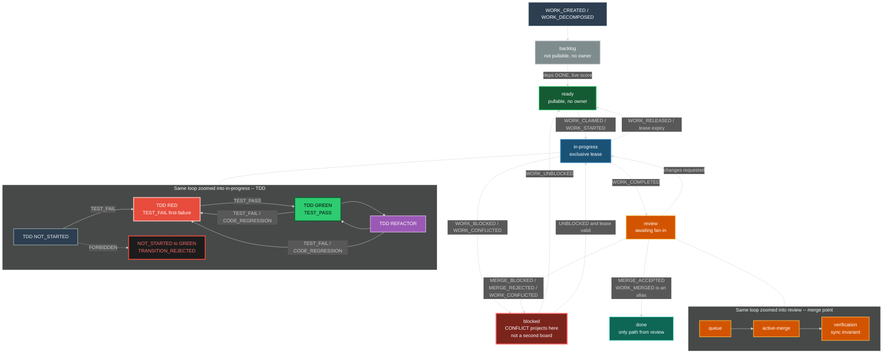

### 6.3 Exclusive ownership (the only ownership model)

Local-copy optimistic merge is **forbidden**. The hub never content-merges files.

| Rule | Meaning |
|---|---|
| Exclusive card | One agent owns one card. Null owner only in `backlog` or `ready`. |
| Exclusive subtree | One agent owns one FEAT or ARCH subtree. Child SPEC files of that subtree are that agent's to write. |
| No overlapping files | Two agents MUST NOT write the same file. Isolation is the lease, not merge-of-edits. |
| Claim | `IAgent.claim` takes a TTL lease (Lease/Lock daemon). Second claim -> `TRANSITION_REJECTED`. |
| Steal | Only from `ready` with no owner. Never from `in-progress`. |
| Lease expiry | Card returns to `ready` (if no block reason) or `blocked`. Work is not "kept" by a dead worker. |
| Hub writes | Event order, card `mv`, `parent:` reconcile, merge-point evaluation. Nothing else. |
| Spawn budget | `spawn_budget(depth) = floor(8 / 2^depth)`. Depth 4 is a hard stop. Circuit-break worker spawn on budget exhaustion. |

### 6.4 Cards, columns, TDD

A card is an `IWorkItem` materialized as a kanban file bound to exactly one tree node via `filename-id`. Moving a card is an event; the directory `mv` is the durable projection.

| Kanban column | `IWorkItem.state` | Node state | Typical TDD | Notes |
|---|---|---|---|---|
| `backlog` | `BACKLOG` | `IDLE` | `NOT_STARTED` | Not pullable. No owner. |
| `ready` | `READY` | `IDLE` | `NOT_STARTED` or `RED` | Pullable. No unmet deps. No owner. |
| `in-progress` | `IN_PROGRESS` | `ACTIVE` or `DEGRADED` | `RED`, `GREEN`, or `REFACTOR` | Exclusive owner required. |
| `blocked` | `BLOCKED` | `BLOCKED` or `RESET` | Frozen (any TDD) | Guard, unmet dep, `MERGE_BLOCKED`, `WORK_CONFLICTED`, breaker. |
| `review` | `REVIEW` | `ACTIVE` or `DEGRADED` | `GREEN` (or `REFACTOR` if review is the refactor pass) | Awaiting merge-point. |
| `done` | `DONE` | `DONE` | `GREEN` after any required `REFACTOR` | Only via `MERGE_ACCEPTED`. |
| `queue` | (merge parent) | `ACTIVE` | n/a | Merge-point column. |
| `active-merge` | (merge parent) | `ACTIVE` | n/a | Merge-point column. WIP typically 1. |
| `verification` | (merge parent) | `ACTIVE` | n/a | Sync invariant + tests. |
| `integrated` | (merge parent) | `DONE` | n/a | Fan-in accepted. |

Illegal: card to `review` or `done` on TDD GREEN unless `first-failure` was recorded.

### 6.5 Merge points (the only merge story)

A merge point is an explicit fan-in barrier: N child workstreams must reach a declared state before the parent FEAT or ARCH card may leave `review` for `done` (or occupy merge-point columns through to `integrated`).

N=1 is degenerate: a single child reaching `review` with sync invariant true emits `MERGE_READY` then `MERGE_ACCEPTED`. That is what 0.0.1 called `WORK_MERGED`. It is the same lifecycle.

| Event | When | Parent card |
|---|---|---|
| `MERGE_READY` | Every listed child reached `required_state` | Eligible. `review`/`queue` -> `active-merge`. |
| `MERGE_BLOCKED` | A child missing, `in-progress`, or `blocked` | `blocked`. |
| `MERGE_ACCEPTED` | Sync invariant holds. Evidence includes `RECONCILE_PARENT` if any `TBD-RECONCILE` existed | `done` / `integrated`. Dependents unblocked. |
| `MERGE_REJECTED` | Sync invariant fails | Does not advance. Children MAY return to `in-progress` or `blocked`. |

**Sync invariant (MUST hold for `MERGE_ACCEPTED`):**

```
SPEC document  ==  test file / assertions  ==  implementation  ==  process and templates
```

Mismatch in any pair is `SYNC_VIOLATION` and `MERGE_REJECTED`.

**What is merged:** card status, `parent:` / `sdlc-refs` links, test evidence. **What is not merged:** overlapping file edits. If two agents would need to write the same file, the lease model already failed; emit `WORK_CONFLICTED`.

Reconciliation: `parent: TBD-RECONCILE` is legal **only across ownership boundaries**. Inside one owned subtree, `parent:` MUST be a real `filename-id`. After `MERGE_READY`, ParentReconciler (hub, not child agents) replaces `TBD-RECONCILE` and emits `RECONCILE_PARENT`. That is link repair, not a rewrite of SPEC/test/impl bodies.

`required_state` examples: all child SPECs TDD RED; all child SPECs TDD GREEN and sync invariant; all child cards in `review` or `done`.

### 6.6 Concurrency model

| Property | Mechanism |
|---|---|
| Event ordering | Partition by `work_item_id`; parent merge partition correlating `parent_id` |
| Conflict | Exclusive lease. No local-copy hub merge. Collision -> `TRANSITION_REJECTED` or `WORK_CONFLICTED` -> `blocked` |
| WIP limits | Per-agent and per-column, enforced at `claim()` |
| Dependency unblocking | DAG walk on `MERGE_ACCEPTED` |
| Work stealing | Idle agent claims from `ready` with no owner only |
| Deterministic replay | Append-only store, replay in partition order |
| Idempotent projection | Projectors key on `TRANSITION_COMMITTED` id |

---

## 7. Harvesting -- Same Loop at Instance / Board-of-Boards Zoom

Harvest is **not** a different kind of process. Zoom out from a SPEC card and the same observe-decide-act-emit-project cycle is looking at usage, duplication, and coupling. When a threshold crosses **on a live event** (not a nightly scan), the engine mints a harvest card on the **same** kanban. Extract, promote, and spawn are cards that go `ready` -> `in-progress` -> `review` -> `MERGE_ACCEPTED`. A child engine is a board-proxy card: zoom in and you are in the child's one kanban.

```mermaid
%%{init: {'theme': 'dark'}}%%
flowchart TB
    classDef backlog fill:#7f8c8d,color:#fff,stroke:#d5d8dc,stroke-width:2px
    classDef ready fill:#145a32,color:#fff,stroke:#2ecc71,stroke-width:2px
    classDef wip fill:#1a5276,color:#fff,stroke:#5dade2,stroke-width:2px
    classDef review fill:#d35400,color:#fff,stroke:#f5b041,stroke-width:2px
    classDef done fill:#0e6655,color:#fff,stroke:#48c9b0,stroke-width:2px
    classDef spawn fill:#1e8449,color:#fff,stroke:#2ecc71,stroke-width:3px

    subgraph SAME["Same loop -- instance zoom"]
        D1["usage / dup / coupling\nupdated on TRANSITION_COMMITTED"]:::backlog
        H["HARVEST_DETECTED card\nsame board, harvest partition"]:::ready
        E["EXTRACT_LIB card in-progress"]:::wip
        P["SERVICE_PROMOTED card review"]:::review
        SP["SDLC_SPAWNED -- child engine\nboard-proxy on parent board"]:::spawn
        D1 -->|live threshold| H --> E --> P --> SP
    end

    SP -.->|child runs SPEC-zoom TDD on its own board| SP
```

### 7.1 Harvesting Thresholds (live)

| Metric | Threshold | Action |
|---|---|---|
| `usage_count` | > 3 nodes referencing same component | Candidate for EXTRACT_LIB |
| `duplication_ratio` | > 40% AST similarity across 2+ agents | Candidate for EXTRACT_LIB |
| `cross_boundary_coupling` | Shared interface across 2+ FEAT or ARCH nodes | Candidate for EXTRACT_LIB |
| `lib_stable_cycles` | > 5 cycles with no API change | Promote to EXTRACT_SERVICE |
| `service_health` | SLA met for 10 cycles | Spawn child SDLC instance |

Thresholds live in Config. HarvestDaemon subscribes to `TRANSITION_COMMITTED` and registry updates on iceoryx2. It does **not** scan on a nightly batch.

### 7.2 Spawn Semantics

When a component is promoted to a service and spawns a child SDLC:

1. A new `STRAT` is created for the service (new engine instance).
2. The child inherits guard and breaker **definitions** from parent, with independent thresholds and its own EventStore SQLite.
3. The child gets its own **one** kanban, backlog column, agent pool, and **own iceoryx2** domain (service-name prefix `sdlc.{child_instance}.*`). That board belongs to the child; it is not a second board of the parent.
4. Parent DAG updated: component node replaced with a service-dependency work item (board-proxy card).
5. Parent and child communicate via API contracts plus zenoh egress, not shared code and not hub file-merge.
6. Child lifecycle is fully independent -- own SPEC-zoom TDD, own RGB, own harvest, own spirals, own breaker trips, own resets. Egress from the child MAY ingress the parent as `MESH_INGRESS` wrapping `PROBLEM_SIGNAL`, `LEARNING`, `MERGE_ACCEPTED`, `BREAKER_TRIPPED`, or `MEMORY_CONTRADICTION`.
7. The parent orchestrator does **not** schedule the child's cards. It scores the **proxy**. Rendezvous is event correlation at egress, not a thread-join into the child EventStore.
8. Depth: `spawn_budget(depth) = floor(8 / 2^depth)`, hard stop at depth 4. Each level has its own Watchdog (section 15).
9. Child starts with **one initial locator** pointing at the parent zenoh peer (section 12.2). Scout/gossip finds siblings. No consul.

### 7.3 Board of boards

When `SDLC_SPAWNED` fires, the parent kanban gains one card whose `owned_subtree` is the child's STRAT `filename-id` and whose type is `board-proxy`. That card moves on the **parent** board (`in-progress` while the child is ACTIVE, `blocked` if the child's breaker trips, `review` when the child emits a contract-ready egress, `done` when the parent accepts the contract). Zoom into that card and you are in the child's one kanban. Zoom out and it is one row. Same loop.

---

## 8. Interface Contracts

Every engine component implements the contract for its role. Registries are dynamic.

### 8.1 INode -- SDLC Artifact Node

| Field | Type | Description |
|---|---|---|
| `id` | `string` | Unique node identifier (`filename-id`) |
| `type` | `enum` | `STRAT`, `DRIV`, `MOTI`, `FEAT`, `ARCH`, `SPEC` |
| `parent` | `string?` | Containment. Null only for STRAT. |
| `status` | `enum` | For MOTI: `Active`, `Rejected`, `Exhausted`. Others MAY use generic status. |
| `state` | `enum` | `IDLE`, `ACTIVE`, `BLOCKED`, `DEGRADED`, `RESET`, `DONE` |
| `tdd` | `object` | `{state, test-file, first-failure, iterations}` -- required on every INode |
| `enter()` | `fn(state, event) -> side_effects` | Deterministic action on state entry (guards fire here) |
| `exit()` | `fn(state, event) -> side_effects` | Deterministic action on state exit |
| `valid_transitions` | `list[ITransition]` | From ResolvedChart, not a compiled list |
| `guards` | `list[IGuard]` | Registered inline guards |
| `metrics` | `dict[string, numeric]` | Observable measurements for breakers |
| `work_items` | `list[IWorkItem]` | Associated cards |

`type` does not include `TEST`. L5 is `tdd.test-file`.

### 8.2 IGuard -- Anti-Fixation Guard

| Field | Type | Description |
|---|---|---|
| `id` | `string` | Guard identifier |
| `node_id` | `string` | Which node this guards |
| `predicate()` | `fn(state, event) -> bool` | Pure function: should this guard fire? |
| `action` | `enum` | `PASS`, `BLOCK`, `REDIRECT`, `ESCALATE` |
| `redirect_to` | `string?` | Target node if REDIRECT |
| `cooldown` | `duration` | Minimum time between firings |
| `consecutive_passes` | `int` | Resets on fire, increments on pass |
| `fixation_threshold` | `int` | Hard ceiling: force fire when exceeded |

### 8.3 IBreaker -- Emergency Circuit Breaker

| Field | Type | Description |
|---|---|---|
| `id` | `string` | Breaker identifier |
| `monitors` | `list[metric_id]` | Metrics to watch |
| `threshold` | `numeric` | Trip point |
| `window` | `duration` | Evaluation window |
| `trip()` | `fn(state) -> RESET_event` | Force transition to RESET |
| `rearm()` | `fn(lessons_learned) -> guard_updates` | Restore guards with fixes |
| `tripped` | `bool` | Current breaker state |

### 8.4 ITransition -- State Transition

| Field | Type | Description |
|---|---|---|
| `from_state` | `(node_id, state)` | Source node + state |
| `to_state` | `(node_id, state)` | Target node + state |
| `event` | `string` | Triggering event kind (canonical) |
| `predicate()` | `fn(state, event) -> bool` | Must return true to fire |
| `action()` | `fn(state, event) -> state_prime` | Pure function: compute next state |
| `guards` | `list[IGuard]` | All must PASS before commit |

Loaded from `scxml` ResolvedChart. Not a compiled match table in engine source.

### 8.5 IWorkItem -- Unit of Parallel Work (a card)

| Field | Type | Description |
|---|---|---|
| `id` | `string` | Unique work item ID |
| `node_ref` | `string` | Bound INode |
| `state` | `enum` | `BACKLOG`, `READY`, `IN_PROGRESS`, `REVIEW`, `DONE`, `BLOCKED` |
| `column` | `enum` | `backlog`, `ready`, `in-progress`, `blocked`, `review`, `done`, plus merge-point `queue`, `active-merge`, `verification`, `integrated` |
| `assigned_to` | `string?` | Agent ID or null (`backlog`/`ready` only) |
| `owned_subtree` | `string?` | Partition key and exclusive subtree root |
| `lease` | `ILease?` | TTL lease, not a forever lock |
| `dependencies` | `list[work_item_id]` | Must be DONE before READY |
| `priority_score` | `f64` | Live. Recomputed on every affecting event. Higher wins. |
| `merge_point` | `string?` | `IMergePoint.id` if fan-in child or parent |
| `created_by` | `event_id` | Traceable to originating event |
| `artifacts` | `list[artifact_ref]` | Output artifacts produced |

There is no `CONFLICT` state. There is no `kanban_board` id selecting among multiple boards. Integer `priority` from 0.0.3 is this score's rank alias only.

### 8.6 IAgent -- Autonomous Worker

| Field | Type | Description |
|---|---|---|
| `id` | `string` | Agent identifier |
| `type` | `enum` | `HUMAN`, `AI_SIDECAR`, `SCANNER`, `AUTOMATED` |
| `a2a_card_url` | `string?` | A2A agent-card URL. Required for `AI_SIDECAR`. |
| `capabilities` | `list[node_type]` | What node types this agent can work. Grown by discovery, not a freeze. |
| `current_work` | `list[work_item_id]` | Active items |
| `wip_limit` | `int` | Max concurrent items |
| `depth` | `int` | Nesting depth for `spawn_budget` |
| `claim(item)` | `fn -> bool` | Take TTL exclusive lease. False if owned or not `ready`. |
| `release(item)` | `fn` | Release lease; card to `ready` or `blocked` |
| `complete(item, artifacts)` | `fn` | Emit `WORK_COMPLETED` |

Workers MAY run inside bwrap in deployments that have it. The generic engine MUST NOT require bwrap. AI workers are **A2A sidecars** (section 12.6). MCP is not a legal `type` and not a transport.

### 8.7 IKanban -- The Single Board

| Field | Type | Description |
|---|---|---|
| `id` | `string` | Board identifier (one per engine instance) |
| `columns` | `ordered list` | `backlog`, `ready`, `in-progress`, `blocked`, `review`, `done` |
| `merge_columns` | `ordered list` | `queue`, `active-merge`, `verification`, `integrated` |
| `wip_limits` | `dict[column, int]` | Per-column WIP limits |
| `partitions` | `dict[owned_subtree, items]` | Same columns, keyed by subtree |
| `pull(agent)` | `fn -> IWorkItem?` | Highest `priority_score` `ready` with no owner matching capabilities |

`IBacklog` is the prioritized view of the `backlog` column, not a second product.

### 8.8 IMergePoint -- Fan-In Barrier

| Field | Type | Description |
|---|---|---|
| `id` | `string` | Merge-point identifier |
| `parent_card` | `filename-id` | Parent FEAT or ARCH card |
| `child_cards` | `list[filename-id]` | Workstream cards that must arrive |
| `required_state` | `predicate` | Example: all child SPECs RED; or all GREEN plus sync invariant |
| `sync_invariant` | `fn -> bool` | `SPEC == test == impl == process/template` |
| `state` | `enum` | `OPEN`, `ARMED`, `READY`, `BLOCKED`, `ACCEPTED`, `REJECTED` |
| `ownership_boundary` | `bool` | If true, child `parent:` MAY be `TBD-RECONCILE` until `RECONCILE_PARENT` |

Compare-and-swap on `state` in the EventStore is the concurrency control for multi-instance orchestrators.

### 8.9 IMesh -- Named IPC (replaces generic IEventBus)

There is no generic event bus and no god broker process that owns topology.

| Field | Type | Description |
|---|---|---|
| `publish_local(event)` | `fn` | Append already in EventStore; iceoryx2 notify subscribers on this host |
| `publish_egress(event)` | `fn` | zenoh put for egress-class kinds to parent/siblings |
| `subscribe_local(service, handler)` | `fn` | iceoryx2 subscriber on a **service name** |
| `subscribe_egress(keyexpr, handler)` | `fn` | zenoh subscriber |
| `partitioned_by` | `field` | `work_item_id` and, for merge, `parent_id` |
| `delivery` | `enum` | `AT_LEAST_ONCE` (EventStore seq is the cursor) |
| `dead_letter_queue` | `list[event]` | Undeliverable, timed-out, or poison events |
| `replay(from_seq)` | `fn -> event_stream` | Replay from EventStore, not from the mesh |

### 8.10 IDiscovery -- Initial locator only

| Field | Type | Description |
|---|---|---|
| `initial_locator` | `string` | The only bootstrap. Format in section 12.2. |
| `scout()` | `fn` | zenoh scout/gossip and/or iceoryx2 service tracker. Not a registry RPC. |
| `on_join(entity)` | `fn` | Emits `MESH_JOIN` / `AGENT_CARD_PUBLISHED` / `INFERENCE_DISCOVERED` |
| `on_leave(entity)` | `fn` | Liveliness drop. Emits `MESH_LEAVE` / `AGENT_CARD_REVOKED` / `INFERENCE_LOST` |

Forbidden: consul, etcd, eureka, a compiled peer list, a company MQTT broker as the discovery plane.

### 8.11 IA2ASidecar -- Generic AI agent runtime

| Field | Type | Description |
|---|---|---|
| `agent_card` | `A2A AgentCard` | Official A2A card (skills, URL, auth). Published on join. |
| `send_task(card, message)` | `fn` | `a2a-client` JSON-RPC/REST. Orchestrator is the client. |
| `stream_events()` | `fn` | A2A SSE/task events become engine events. |
| `inference` | `IInference?` | Discovered OpenAI-compat URL. Bound at join, rebound on `INFERENCE_DISCOVERED`. |

MCP is **FORBIDDEN**. `rig-core` MAY be used **only inside the sidecar**. The wire to the engine is A2A on P2/P3 only.

### 8.12 IInference -- Sidecar-only OpenAI-compat

Implemented **only in the sidecar**. Core daemons MUST NOT depend on this trait.

| Field | Type | Description |
|---|---|---|
| `locator` | `openai-compat:http://host:port/v1` | Sidecar-local discovery, not compiled-in |
| `kind` | `enum` | `OLLAMA` (sidecar primary), `LOCALAI`, `XINFERENCE`, `VLLM`, `OTHER_COMPAT` |
| `complete(req)` | `fn` | `rig-core` with `base_url` from locator |
| `list_models()` | `fn` | Sidecar skills only; does not recompute engine `priority_score` |

### 8.13 ILearningProjection -- Engine-side LEARNING table (not a model)

| Field | Type | Description |
|---|---|---|
| `apply(LEARNING)` | `fn` | Validate schema; upsert `rusqlite` row. No embed, no extract |
| `get(event_id)` | `fn` | Read projection. Rebuildable from EventStore |

### 8.14 IComponentRegistry -- Shared Component Tracking

| Field | Type | Description |
|---|---|---|
| `components` | `dict[id, IComponent]` | All registered shared components |
| `register(component)` | `fn` | Add or update component |
| `dependents(id)` | `fn -> list[node_id]` | Who depends on this component |
| `usage_count(id)` | `fn -> int` | How many nodes reference this |
| `lease_matrix` | `dict[path, lease]` | Who holds write lease on which path |
| `lock(id, agent)` | `fn -> bool` | **TTL exclusive lease**, not optimistic content lock |

### 8.15 IHarvestRule -- Extraction Trigger

| Field | Type | Description |
|---|---|---|
| `id` | `string` | Rule identifier |
| `predicate()` | `fn(registry_state) -> bool` | When to trigger (evaluated on each `TRANSITION_COMMITTED`) |
| `action` | `enum` | `EXTRACT_LIB`, `EXTRACT_SERVICE`, `REFACTOR_IN_PLACE` |
| `maturity_gate` | `dict` | Conditions for promotion |
| `spawn_sdlc` | `bool` | If true, component gets own engine instance |

### 8.16 ILease -- TTL Exclusive Lease

| Field | Type | Description |
|---|---|---|
| `id` | `string` | Lease identifier |
| `holder` | `agent_id` | Exclusive holder |
| `resource` | `card_id` and/or `owned_subtree` and/or file path | What is leased |
| `ttl` | `duration` | Expiry. Never forever. |
| `expires_at` | `timestamp` | Absolute expiry |
| `renew(holder)` | `fn -> bool` | Holder heartbeat |
| `expire()` | `fn` | Card to `ready` or `blocked`; emit `WORK_RELEASED` or `WORK_BLOCKED` |

### 8.17 ISchemaRegistry -- Dynamic Kinds + SCXML

| Field | Type | Description |
|---|---|---|
| `kinds` | `dict[kind, schema]` | Event kind -> payload schema + version |
| `aliases` | `dict[alias, kind]` | Seed includes `WORK_MERGED` -> `MERGE_ACCEPTED`; `CORP-STRAT` -> `STRAT` |
| `chart` | `scxml::Statechart` | The one machine document |
| `resolved` | `scxml::ResolvedChart` | Effective transitions |
| `canonicalize(kind)` | `fn -> kind` | Alias fold |
| `register(kind, schema)` | `fn` | Dynamic add. Not a compiled-in list. |
| `evolve(kind, new_schema)` | `fn` | Versioned evolution; old events remain readable |
| `reload_chart(scxml)` | `fn` | Hot-load a new chart; validate; `resolve()`; no binary change |

---

## 9. Event Type Catalog

Every state change in the engine is one of these typed events. Section 5.1 registers a transition for each. Payloads are the seed schema; SchemaRegistry MAY evolve versions.

### 9.1 Work Events

| Event | Source | Payload | Effect |
|---|---|---|---|
| `WORK_CREATED` | Hub / Ingress / Gap | `(work_item_id, node_ref, column=backlog)` | New card in `backlog` |
| `WORK_DECOMPOSED` | Hub | `list[IWorkItem]` | Child cards injected |
| `WORK_STARTED` | Agent | `(work_item_id, agent_id)` | `ready -> in-progress` |
| `WORK_CLAIMED` | Agent | `(work_item_id, agent_id, lease)` | Exclusive lease. Often same transaction as `WORK_STARTED` |
| `WORK_RELEASED` | Agent / LeaseDaemon | `(work_item_id, agent_id)` | `in-progress -> ready` |
| `WORK_COMPLETED` | Agent | `(work_item_id, artifacts)` | `in-progress -> review` |
| `WORK_BLOCKED` | Guard/Dep/Merge/Ingress | `(work_item_id, reason)` | any -> `blocked` |
| `WORK_UNBLOCKED` | Hub | `(work_item_id)` | `blocked -> ready` (or `in-progress` if lease valid) |
| `WORK_CONFLICTED` | Hub / LeaseDaemon | `(work_item_id, conflict_details)` | -> `blocked`. No file merge |
| `WORK_MERGED` | (alias) | same as `MERGE_ACCEPTED` | Canonicalize to `MERGE_ACCEPTED` |

### 9.2 Merge Events

| Event | Source | Payload | Effect |
|---|---|---|---|
| `MERGE_READY` | MergeCoordinator | `(merge_point_id, parent_card, child_cards, required_state)` | Parent eligible; merge-point columns |
| `MERGE_BLOCKED` | MergeCoordinator | `(merge_point_id, parent_card, missing_children, reason)` | Parent `blocked` |
| `MERGE_ACCEPTED` | MergeCoordinator | `(merge_point_id, parent_card, evidence, parent_links)` | Parent `done`/`integrated`. Unblocks dependents. N=1 degenerate |
| `MERGE_REJECTED` | MergeCoordinator | `(merge_point_id, parent_card, invariant_failures)` | Parent does not advance |
| `RECONCILE_PARENT` | ParentReconciler | `(child_id, old_parent=TBD-RECONCILE, new_parent=filename-id)` | Link repair |

### 9.3 Guard Events

| Event | Source | Payload | Effect |
|---|---|---|---|
| `GUARD_PASSED` | GuardDaemon | `(guard_id, node_id)` | Increment `consecutive_passes` |
| `GUARD_BLOCKED` | GuardDaemon | `(guard_id, node_id, reason)` | Transition blocked |
| `GUARD_REDIRECTED` | GuardDaemon | `(guard_id, from_node, to_node)` | Event re-routed |
| `GUARD_ESCALATED` | GuardDaemon | `(guard_id, node_id)` | Escalation handler invoked |
| `FIXATION_DETECTED` | GuardDaemon | `(guard_id, consecutive_passes)` | Force-fired, counter reset |

### 9.4 Breaker Events

| Event | Source | Payload | Effect |
|---|---|---|---|
| `BREAKER_TRIPPED` | BreakerDaemon | `(breaker_id, metrics_snapshot)` | Cards `blocked`, RESET initiated |
| `BREAKER_REARMED` | Reset | `(breaker_id, guard_updates)` | Guards strengthened |
| `RESET_STARTED` | Engine | `(checkpoint_id)` | System enters RESET |
| `RESET_COMPLETED` | Engine | `(lessons_learned, guard_changes)` | System resumes |

### 9.5 Feedback Events (RGB -- mid zoom)

| Event | Color | Source | Target | Effect |
|---|---|---|---|---|
| `CODE_REGRESSION` | RED | TestRunner | SPEC | Spec re-entered. TDD to RED |
| `INTEGRATION_FLAW` | GREEN | TestRunner | FEAT and ARCH | L3 redesign |
| `UNFEASIBLE_SCOPE` | GREEN | TestRunner | MOTI | Approach unviable |
| `BROKEN_REQUIREMENT` | GREEN | TestRunner | DRIV | Problem invalid |
| `PARADIGM_SHIFT` | BLUE | TestRunner | STRAT | Strategic rethink |

### 9.6 Process Events

| Event | Source | Payload | Effect |
|---|---|---|---|
| `TEST_PASS` | TestRunner | `(node_id, test_file, evidence)` | TDD RED->GREEN if `first-failure` set; else `TRANSITION_REJECTED` |
| `TEST_FAIL` | TestRunner | `(node_id, test_file, evidence)` | TDD to RED; record `first-failure` if null |
| `SPEC_WRONG` | Agent / reviewer | `(spec_id, reason)` | Do not silently rewrite the test to match a bad spec |
| `FEAT_WRONG` | Agent / reviewer / TDD | `(feat_id, reason)` | Feature decomposition wrong; SPECs MAY be right |
| `GAP_DISCOVERED` | Agent / scanner / ingress | `(parent_id, gap_description)` | New cards `backlog`/`ready` |
| `PROCESS_DEFECT` | Agent / Guard / retro | `(artifact_ref, reason)` | Meta: revise engine process on the mesh |
| `TEMPLATE_DEFECT` | Agent / Guard / retro | `(template_ref, reason)` | Meta: revise templates on the mesh |
| `SYNC_VIOLATION` | MergeCoordinator / Guard | `(pairs_mismatched, evidence)` | Blocks `MERGE_ACCEPTED` |

### 9.7 External Events

| Event | Source | Target | Effect |
|---|---|---|---|
| `STRATEGIC_PIVOT` | Market / exec / IngressGateway | STRAT | Strategy re-entered |
| `PROBLEM_SIGNAL` | User / market / IngressGateway | DRIV | Problem revealed or created |
| `USER_REPORT` | User | Bound node or new card | Create or move a card; MAY emit `PROBLEM_SIGNAL` |
| `ATTACKER_SIGNAL` | Attacker / disclosure channel | STRAT or DRIV or SEC | Create or escalate; MAY emit `SECURITY_DISCLOSURE` |
| `SECURITY_DISCLOSURE` | Attacker, user, or scanner | SEC surface | P0 card; MAY `WORK_BLOCKED` |

### 9.8 Harvest Events

| Event | Source | Payload | Effect |
|---|---|---|---|
| `HARVEST_DETECTED` | HarvestDaemon | `(component_id, rule_id, evidence)` | Card in harvest partition `backlog` |
| `LIB_EXTRACTED` | Agent | `(lib_id, interface, consumers)` | Registry updated |
| `SERVICE_PROMOTED` | Hub | `(service_id, sla, api_version)` | Maturity gate |
| `SDLC_SPAWNED` | HarvestDaemon | `(child_sdlc_id, parent_dependency, child_locator)` | Child engine begins; parent stores child's initial locator (parent zenoh peer) |

### 9.9 Engine, mesh, watchdog, learning

| Event | Source | Payload | Effect |
|---|---|---|---|
| `UNHANDLED_EVENT` | Dispatcher | `(raw_event)` | Only if kind not in SchemaRegistry. DLQ candidate |
| `TRANSITION_REJECTED` | Dispatcher / TddGate | `(reason, event)` | No state change |
| `TRANSITION_COMMITTED` | Dispatcher | `(transition, from, to)` | State+projection applied |
| `TIMER_TICK` | TimerDaemon | `(timer_id, scheduled_at)` | Handled no-op unless a rule is registered |
| `LEARNING` | P2 A2AGateway or human | `(source_agent, class, action, subject_ref, evidence)` | EventStore + LearningIngest row. Sidecar memory is separate |
| `MEMORY_CONTRADICTION` | P2 proposal from sidecar | `(subject_ref, edges)` | Dispatcher may mint a card. Watchdog does not call a model |
| `MESH_JOIN` | DiscoveryDaemon | `(entity_id, locator, role)` | Peer/daemon/sidecar appeared |
| `MESH_LEAVE` | DiscoveryDaemon | `(entity_id, reason)` | Liveliness dropped |
| `MESH_EGRESS` | InstanceMesh | `(child_instance, kind, event_id)` | Parent-visible |
| `MESH_INGRESS` | InstanceMesh | `(child_instance, wrapped)` | Local append |
| `AGENT_CARD_PUBLISHED` | A2AGateway | `(agent_id, card_url)` | Sidecar claimable |
| `AGENT_CARD_REVOKED` | A2AGateway | `(agent_id)` | Drop from pool |
| `INFERENCE_DISCOVERED` | DiscoveryDaemon | `(locator, kind, models)` | Router adds backend |
| `INFERENCE_LOST` | DiscoveryDaemon | `(locator)` | Router removes backend |
| `WATCHDOG_STALL` | Watchdog | `(agent_id, stall_count)` | After 2: `WORK_BLOCKED` |
| `WATCHDOG_THRASH` | Watchdog | `(agent_id, evidence)` | Kill; no auto-GREEN |
| `WATCHDOG_AI_STORM` | Watchdog | `(agent_id, token_rate, loop_count)` | SIGKILL |
| `WATCHDOG_PATH_VIOLATION` | Watchdog | `(agent_id, path)` | SIGKILL + `WORK_CONFLICTED` |
| `WATCHDOG_HANG` | Watchdog | `(agent_id, last_heartbeat_seq)` | Lease expire |
| `WATCHDOG_OSCILLATION` | Watchdog | `(merge_point_id, flip_flop_rate)` | Block + kill |
| `FORK_ORPHAN` | Watchdog / git adapter | `(path_or_pid, reason)` | `blocked`; no merge |

`EFFICIENCY`: same capability, cheaper or faster (MAY emit `PROCESS_DEFECT`). `CAPABILITY`: new ability (MAY emit `HARVEST_DETECTED` or `GAP_DISCOVERED`).

---

## 10. Protection Summary

| Tier | Type | When | Construct | Scope |
|---|---|---|---|---|
| 0 | TDD gate | Every TDD transition | SCXML missing edge + TddGate; `first-failure` required for GREEN | Per SPEC |
| 1 | Inline Guards | Every state entry | `IGuard.predicate()` | Per-node |
| 2 | RGB bounds | 3 SPEC fails / 2 redesigns / MOTI exhaustion / DRIV invalid | Mid-zoom escalation | Ladder |
| 3 | Emergency Breakers | Threshold exceeded | `IBreaker.trip()` | Per-metric |
| 4 | System Reset | Breaker trips | `RESET_*` + re-arm | Instance-wide |
| 5 | WIP Limits | Always | `IKanban.wip_limits` | Per column / agent |
| 6 | Exclusive lease | While `in-progress` | ILease TTL | Per card + subtree |
| 7 | Merge-point barrier | Fan-in of N cards | `IMergePoint` + `MERGE_*` | Per parent FEAT/ARCH |
| 8 | Sync invariant | Before `MERGE_ACCEPTED` | `SPEC == test == impl == process/template` | Per merge point |
| 9 | Harvest Rules | Pattern detected live | `IHarvestRule.predicate()` | Cross-cutting |
| 10 | Fixation Ceiling | Passes exceeded | Force-fire guard | Per-guard |
| 11 | Spawn budget | Agent spawn | `floor(8 / 2^depth)` | Per agent tree |
| 12 | SchemaRegistry | Every dispatch | Unknown kind -> `UNHANDLED_EVENT` + DLQ | Instance |
| 13 | Watchdog | Heartbeat, path, storm, hang, oscillation | SIGKILL + card return | Per process / sidecar |
| 14 | Sidecar boundary | Always | No LLM in core; P2 allow-list; tests pass with Ollama down | Instance |

---

## 11. Nested Loop Architecture (binding)

Section 0.1 is binding: these are **zoom levels of one loop**, not four engines. Harvest (section 7) is the instance zoom, not a second product. All zooms emit events. None is a side channel.

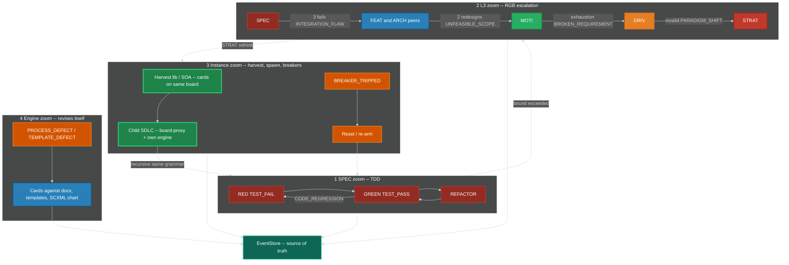

1. **SPEC zoom:** TDD on SPEC (RED-GREEN-REFACTOR). TestRunner never claims GREEN without recorded RED.
2. **L3 zoom:** RGB ladder with bounds in section 2.2.
3. **Instance zoom:** harvest lib -> SOA -> spawn child SDLC; plus death-spiral breakers and reset (section 4). Same loop.
4. **Engine zoom:** `PROCESS_DEFECT` / `TEMPLATE_DEFECT` revise the engine itself as cards on the same kanban.
5. **EventStore** is source of truth; all zooms emit events.

Child SDLC recursion: the child's SPEC zoom is TDD; its L3 zoom is RGB; its instance zoom may spawn a grandchild. Cascades use egress-as-ingress (`LEARNING`, `PROBLEM_SIGNAL`, A2A contracts, zenoh).

---

## 12. Implementation Design -- Rust Daemons, Named Mesh, Locator Discovery

This section is the software-engineer contract. Subsystems are **daemons**: dynamic, asynchronous, partitioned, fault-tolerant. The engine is **always live**. There is no batch window, no nightly reconcile, no "run the orchestrator later," no "run the suite later."

Language: **Rust 2024** for every daemon. Bash is glue (units, hooks), not applications. No Python apps. No Go or Zig binary is required.

### 12.1 Named IPC choice (binding)

A "generic event bus" is wrong. The mesh has two planes plus an optional local bridge.

**Same-host daemon plane -- iceoryx2.** Eclipse iceoryx2 is decentralized zero-copy shared-memory pub-sub. It exists specifically to **remove the central daemon** of iceoryx classic. Daemons open services by name (`sdlc.{instance}.{daemon}.{kind}`). Discovery is the iceoryx2 service tracker, not a cluster registry. EventStore remains source of truth: iceoryx2 carries **notifications** (seq, partition, kind). Payloads larger than a notify MAY be zero-copy samples or a seq the subscriber reads from SQLite.

**Nested-engine plane -- zenoh.** Each engine instance is a zenoh **peer**. Bootstrap is **one initial locator**. Gossip scout finds the rest. Liveliness tokens are join/leave. Parent does not own child topology. Child publishes egress on key expressions; parent subscribes. This is the board-of-boards routing plane.

**MQTT is not the mesh.** A broker **is** a registry. `rumqttc` MAY talk to a **local Mosquitto (or equivalent) per engine instance** as an IngressGateway adapter for external IoT. That broker MUST bind localhost (or the instance netns) and MUST NOT be the discovery plane or the daemon bus.

**Optional, not topology:** `iceoryx2-integrations-zenoh-tunnel-backend` MAY tunnel a local service off-host. It MUST NOT become a god router that owns all topics.

```
publish(event):
    eventstore.append_fsync(event)              # SoT
    iceoryx2.publish(service_for(event.kind), seq)
    if event.kind in EGRESS_SET and parent_locator is set:
        zenoh.put("sdlc/{parent}/egress/{child}/{kind}", {event_id, seq})
```

`EGRESS_SET` = `MERGE_ACCEPTED`, `LEARNING`, `SDLC_SPAWNED`, `PROBLEM_SIGNAL`, `BREAKER_TRIPPED`, `MEMORY_CONTRADICTION`, `MESH_LEAVE`.

### 12.2 Dynamic discovery from one initial locator

No consul. No etcd. No eureka. No compiled mesh map.

A node starts with **exactly one** `INITIAL_LOCATOR` (env or Config). It discovers the rest.

#### Locator string format (ASCII, binding)

```
<scheme>:<rest>

schemes:
  zenoh:<protocol>/<addr>[:<port>]
      example: zenoh:tcp/192.168.1.10:7447
      example: zenoh:udp/224.0.0.224:7446          # multicast scout
      example: zenoh:unix:/tmp/sdlc-{instance}.zenoh

  iceoryx2:service/<ServiceName>
      example: iceoryx2:service/sdlc.instA.eventstore.notify
      (same-host only; ServiceName is the iceoryx2 name)

  a2a:<url>
      example: a2a:http://127.0.0.1:8088/.well-known/agent-card.json

  openai-compat:<url>
      example: openai-compat:http://127.0.0.1:11434/v1     # Ollama primary
      example: openai-compat:http://127.0.0.1:8080/v1      # LocalAI / vLLM / Xinference

  mqtt:tcp://127.0.0.1:<port>     # OPTIONAL local ingress bridge ONLY
```

Root engine: `INITIAL_LOCATOR` MAY be `zenoh:udp/224.0.0.224:7446` (scout only) or `zenoh:tcp/127.0.0.1:7447` if this instance also listens. Child engine: `INITIAL_LOCATOR` MUST be the parent's zenoh listen locator handed in `SDLC_SPAWNED`.

#### Join / leave (live)

| Entity | Join | Leave |
|---|---|---|
| Daemon (same host) | Create iceoryx2 service `sdlc.{instance}.{daemon}.*`; tracker emits appear; `MESH_JOIN` | Process exit drops service; tracker emits disappear; `MESH_LEAVE`; leases expire |
| Engine instance | zenoh peer `connect` to `INITIAL_LOCATOR`; gossip; declare liveliness token `sdlc/{instance}/alive/engine/{id}` | Token drop; subscribers get delete; parent board-proxy `blocked`; `MESH_LEAVE` |
| A2A sidecar | Serve agent card; put card URL on zenoh `sdlc/{instance}/a2a/cards/{id}`; declare liveliness `.../alive/sidecar/{id}`; `AGENT_CARD_PUBLISHED` | Token drop; `AGENT_CARD_REVOKED`; AgentPool forgets; leased cards -> `ready`/`blocked` |
| Inference (sidecar-local only) | Sidecar scouts its own `openai-compat:` locator | Sidecar-internal. Engine DiscoveryDaemon MUST NOT probe models |

Sidecar skills may grow from its own `/v1/models` list. That does not recompute engine `priority_score` and is not engine discovery.

Zenoh config seed (peer + gossip from one connect endpoint):

```
{
  mode: "peer",
  connect: { endpoints: ["<from INITIAL_LOCATOR rest>"] },
  listen:  { endpoints: ["tcp/0.0.0.0:0"] },
  scouting: {
    multicast: { enabled: true },
    gossip: { enabled: true, autoconnect: { peer: ["router", "peer"] } }
  }
}
```

If multicast is unavailable, gossip from the single connect endpoint is sufficient. That is the native zenoh model.

### 12.3 Subsystems / daemons

Core daemons below MUST compile and run with no `rig`, no inference client, and no memory-engine crate. A2AGateway is a **port** (section 0.5): it translates A2A messages into Dispatcher-bound events. It does not call a model.

**Core -- zero LLM**

| Daemon | Responsibility | Consumes | Produces | Failure mode | Scaling unit |
|---|---|---|---|---|---|
| **EventStore** | SQLite WAL append-only log; partitioned replay; snapshots | appends from Dispatcher only | ordered streams + iceoryx2 notify | Refuse ack if fsync fails | Partition = `tenant_id` + `work_item_id` |
| **Dispatcher / Orchestrator** | `statig` + ResolvedChart evaluator. Stateless vs store | all catalog kinds | `TRANSITION_COMMITTED`, `TRANSITION_REJECTED`, `UNHANDLED_EVENT` | Replay from last committed seq. Merge eval CAS | Per partition |
| **DiscoveryDaemon** | Scout from `INITIAL_LOCATOR`; iceoryx2 tracker; zenoh liveliness of **engine** peers | liveliness, service appear/disappear | `MESH_JOIN`, `MESH_LEAVE` | Fail-open to last-known live set; no registry; no `/v1/models` probe | Per instance |
| **A2AGateway** | Port P2/P3. Map allowed A2A payloads to events; send tasks after lease | A2A on allow-list (0.5) | events via Dispatcher only | Unauthenticated drop. MCP endpoints MUST NOT exist. No completion HTTP | Per instance |
| **GuardDaemon** | Evaluate IGuard on state entry | `TRANSITION_COMMITTED` | `GUARD_*`, `FIXATION_DETECTED` | Fail-closed: `GUARD_BLOCKED` + DLQ | Per node type / shard |
| **BreakerDaemon** | Death-spiral detection | metrics, `TIMER_TICK` | `BREAKER_TRIPPED`, `RESET_STARTED` | Fail-open for eval errors logged; fail-closed once tripped | Per instance |
| **KanbanProjector** | Event -> filesystem column `mv`. One board. `notify` watches drift | `TRANSITION_COMMITTED` | (projection; lag metrics) | Idempotent on commit id | Per partition |
| **AgentPool / WorkerManager** | Spawn/retire; exclusive lease; steal from `ready`; `spawn_budget`. Sidecar optional | `WORK_CREATED` (ready), `AGENT_CARD_*`, lease expiry | `WORK_CLAIMED`, spawn/retire audit | If no sidecar: humans/scanners still pull. Circuit-break on budget=0 | Worker processes |
| **MergeCoordinator** | Fan-in barrier; sync invariant. No model | child `WORK_COMPLETED`, `TEST_PASS`, `SYNC_VIOLATION` | `MERGE_*` | CAS on merge-point `state` | Parent partition |
| **ParentReconciler** | `TBD-RECONCILE` -> real `filename-id` | `MERGE_READY` | `RECONCILE_PARENT` | Retry with backoff; do not rewrite SPEC bodies | Parent partition |
| **TestRunner** | Execute tests; never claims GREEN without recorded RED | `WORK_STARTED`, `TIMER_TICK` | `TEST_PASS`, `TEST_FAIL`, `CODE_REGRESSION` | Infra fail: `WORK_BLOCKED`, not fake GREEN | Per card / test shard |
| **TddGate** | Reject `NOT_STARTED -> GREEN` | attempted TDD transitions | `TRANSITION_REJECTED` (or allow) | Fail-closed | Inline in Dispatcher |
| **IngressGateway** | Port P1. External HTTP/git/webhook/syslog; optional local MQTT | adapters | `STRATEGIC_PIVOT`, `PROBLEM_SIGNAL`, `USER_REPORT`, `ATTACKER_SIGNAL`, `SECURITY_DISCLOSURE`, `TIMER_TICK` | Unauthenticated drop. Rate-limit | Horizontally scalable |
| **LearningIngest** | Schema-validate `LEARNING` already on the bus; SQLite projection. **No extract, no embed, no mentedb** | `LEARNING`, `MEMORY_CONTRADICTION` (from P2) | projection rows; MAY `PROCESS_DEFECT` / `HARVEST_DETECTED` from **event fields**, not from an LLM | Drop invalid schema with metric | Per tenant |
| **HarvestDaemon** | Lib extract / SOA / child spawn -- same loop, live | `TRANSITION_COMMITTED` | `HARVEST_DETECTED`, `LIB_EXTRACTED`, `SERVICE_PROMOTED`, `SDLC_SPAWNED` | Candidates only | Per instance |
| **Health / Watchdog** | Port P4. Process liveness; SIGKILL; path notify | heartbeats, `notify` paths, `procfs` | `WATCHDOG_*`, `FORK_ORPHAN`, `WORK_BLOCKED` | OS probes only. No mentedb. No completion | Per process |
| **Lease / Lock** | TTL leases | claim/renew/expire | `WORK_RELEASED` / `WORK_BLOCKED` on expiry | Store monotonic seq + expiry, not local clock alone | Per resource |
| **DeadLetter** | Poison messages | `UNHANDLED_EVENT`, handler exceptions | (held); alert | Bounded queue | Per partition |
| **Retry / Backoff** | At-least-once retries | failed handler | republish same event id | Give up -> DLQ | Per subscription |
| **Snapshot / Checkpoint** | Compact state for replay | EventStore seq | snapshot blob + seq | Corrupt snapshot: ignore and replay earlier | Per partition |
| **Metrics / Tracing** | RED/USE, traces, logs | all daemons | (telemetry) | Telemetry loss MUST NOT block dispatch | Collector |
| **SchemaRegistry** | Event kinds + SCXML chart | register/evolve/reload_chart | used by Dispatcher | Unknown kind -> `UNHANDLED_EVENT` | Instance |
| **Config** | Thresholds, WIP, spawn_budget, `INITIAL_LOCATOR` | watch | (config updates as events if desired) | Bad config: keep last-good | Instance |
| **TimerDaemon** | Clock as events | OS timer | `TIMER_TICK` | Never mutates cards itself | Per instance |

**Sidecar process (optional -- not an engine daemon)**

| Process | Responsibility | Talks to engine via | MUST NOT |
|---|---|---|---|
| **AI sidecar** | `rig-core` + discovered Ollama/LocalAI/Xinference/vLLM; optional rustmem/mentedb | P2 proposals, P3 tasks, P4 heartbeats | Append EventStore; `mv` cards; call Dispatcher internals; MCP |
| **Inference** | Lives only inside the sidecar | sidecar-local OpenAI-compat HTTP | Be a core crate or a Dispatcher client |

### 12.4 Full crate inventory (daemon | language | crates | why)

Shared workspace crates used by **every** Rust daemon: `tokio` (async runtime), `tracing` + `tracing-subscriber` (logs), `serde` + `serde_json` (payloads), `thiserror` + `anyhow` (errors), `bytes`, `parking_lot`, `uuid`.

| Daemon | Language | Crates | Why |
|---|---|---|---|
| EventStore | Rust | `rusqlite` (bundled), `tokio` (spawn_blocking or `tokio-rusqlite-new`), `iceoryx2` | WAL SoT; notify seq on iceoryx2; no sqlx-over-network required |
| Dispatcher / Orchestrator | Rust | `statig`, `scxml`, `iceoryx2`, `zenoh` | Hierarchical SM; chart from schema; local+egress publish |
| DiscoveryDaemon | Rust | `zenoh` (scout, liveliness), `iceoryx2` (service tracker) | Locator-only engine join/leave. No `/v1/models`. |
| A2AGateway | Rust | `a2a`, `a2a-client`, `a2a-server` (a2aproject/a2a-rs), `axum`, `tokio` | Ports P2/P3. Official A2A 1.0. **No MCP / `rmcp`. No `rig`.** |
| GuardDaemon | Rust | `statig` (guard hooks), `iceoryx2`, `rusqlite` | Local consecutive_passes table |
| BreakerDaemon | Rust | `iceoryx2`, `rusqlite` | Metrics windows |
| KanbanProjector | Rust | `notify` (fs watch), `rusqlite`, `iceoryx2` | `mv` projection; detect drift vs EventStore |
| AgentPool / WorkerManager | Rust | `nix` (`kill`, `waitpid`, `eventfd`), `a2a-client`, `iceoryx2` | Spawn/reap/SIGKILL; A2A claim |
| MergeCoordinator | Rust | `rusqlite`, `iceoryx2` | CAS arrival counts |
| ParentReconciler | Rust | `rusqlite` | Link repair only |
| TestRunner | Rust | `tokio::process`, `iceoryx2` | Real test processes, not keyword scans |
| TddGate | Rust | `scxml` (named guard), inline | Fail-closed GREEN |
| IngressGateway | Rust | `axum`, `reqwest`, optional `rumqttc` | HTTP/git/webhook; MQTT local-only |
| LearningIngest | Rust | `rusqlite`, `iceoryx2` | Project `LEARNING` rows. No mentedb, no embed |
| HarvestDaemon | Rust | `iceoryx2`, `rusqlite` | Live thresholds |
| Watchdog | Rust | `nix`, `notify`, `procfs`, `iceoryx2`, `tokio` | Heartbeat fd, CPU/time, unexpected paths, SIGKILL. No LLM |
| AI sidecar (optional process) | Rust | `rig-core`, `a2a-server`, optional `mentedb` or `rustmem`, `reqwest` | Completions and sidecar memory. Never a core daemon crate |
| Lease / Lock | Rust | `rusqlite`, `iceoryx2` | TTL in store |
| DeadLetter / Retry | Rust | `rusqlite`, `iceoryx2` | Bounded poison |
| Snapshot | Rust | `rusqlite` | Checkpoint blobs |
| Metrics / Tracing | Rust | `tracing`, optional `opentelemetry`, `metrics`, `metrics-exporter-prometheus` | Optional scrape; must not block |
| SchemaRegistry | Rust | `scxml`, `serde`, `rusqlite` | Chart + kinds |
| Config | Rust | `serde`, `notify` (watch file), `figment` or `config` | `INITIAL_LOCATOR`, weights |
| TimerDaemon | Rust | `tokio::time`, `iceoryx2` | `TIMER_TICK` only |

**Not used as apps:** Python, Go, Zig. **Not used as agent protocol:** MCP, `rmcp`, Vestige MCP. **Not used as discovery:** consul, etcd, eureka. **Not used as daemon bus:** MQTT, NATS, Kafka. **Not used in core daemons:** `rig-core`, mentedb, rustmem, any OpenAI-compat client.

**Memory (binding):** EventStore holds `LEARNING` events. LearningIngest is a `rusqlite` projection. Growing model/memory (rustmem or mentedb) lives **in the sidecar**. Contradictions re-enter only as P2 proposals. Vestige and LocalGPT are not used (section 0.4).

### 12.5 Two-box topology (engine | sidecar) -- ports only

The numbered-port diagram in section 0.5 is binding. Same-host daemons still use iceoryx2 among **core** processes. zenoh is P5 (child engines), not an LLM pipe. Do not draw edges from `rig`/Ollama into Dispatcher.

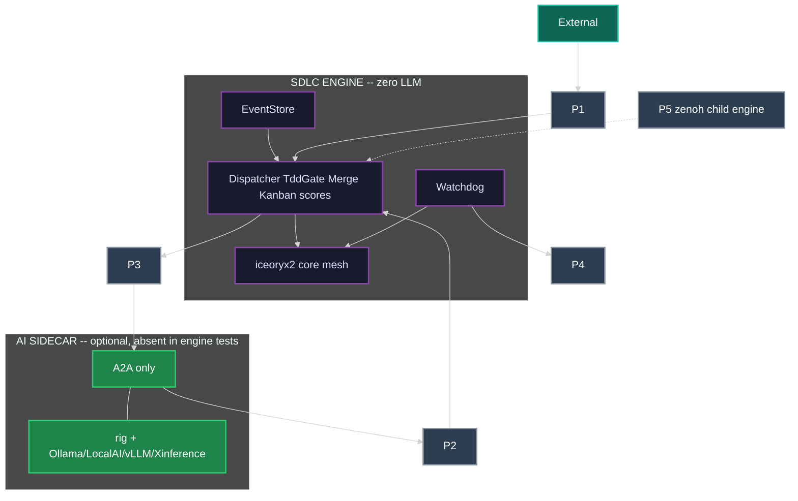

### 12.6 A2A sidecar runtime (not MCP, not in-process with Dispatcher)

The sidecar is a **separate process**. Engine tests start **zero** sidecar processes. When present, it speaks **only A2A** at P2/P3. OpenAI-compat HTTP stays inside the sidecar.

```
sidecar main:                          # NOT linked into Dispatcher
    serve a2a-server (agent card)
    announce card via A2A to P2 (AGENT_CARD_PUBLISHED)
    bind rig-core to sidecar-local openai-compat locator
    loop:
        task = A2A receive on P3       # lease already committed
        rig_agent.prompt(task)
        A2A respond; P2 may carry LEARNING / TEST_* / WORK_COMPLETED proposals
        heartbeat fd for P4
    # NEVER: EventStore.append, kanban mv, iceoryx2 publish of TRANSITION_*
```

Ollama is the sidecar's default primary inference. LocalAI, Xinference, and vLLM are optional sidecar backends. The orchestrator does not embed a vendor and does not require any of them.

### 12.7 Orchestration, scale, fault tolerance

**Event-driven.** No daemon polls a clock to mutate state. TimerDaemon publishes `TIMER_TICK`; subscribers decide.

**Dynamic.** Node types, event kinds, SCXML chart, guards, breakers, harvest rules load from SchemaRegistry + Config.

**Scalable.**

- Work events partition by `work_item_id`.
- Agent execution partitions by `owned_subtree`.
- Merge-point evaluation runs on the **parent partition**. Children do not take a global lock. Child completion is copied onto the parent partition (local iceoryx2) or via `MESH_INGRESS` (zenoh).
- Multi-instance Dispatcher: competing consumers with partition affinity preferred. Merge eval: CAS on merge-point state (default; no extra consensus system).

**Fault tolerant.** At-least-once. Idempotent projectors. Lease expiry. DLQ. Orchestrator stateless vs EventStore. Backpressure via bounded queues. `spawn_budget`. Snapshot/Checkpoint.

**Robust.** Graceful drain: stop IngressGateway, finish in-flight transitions, refuse new `WORK_CLAIMED`, wait leases, snapshot. Workers MAY be sandboxed with bwrap; the engine does not hard-require it.

### 12.8 Sequence -- attacker disclosure to merge accepted

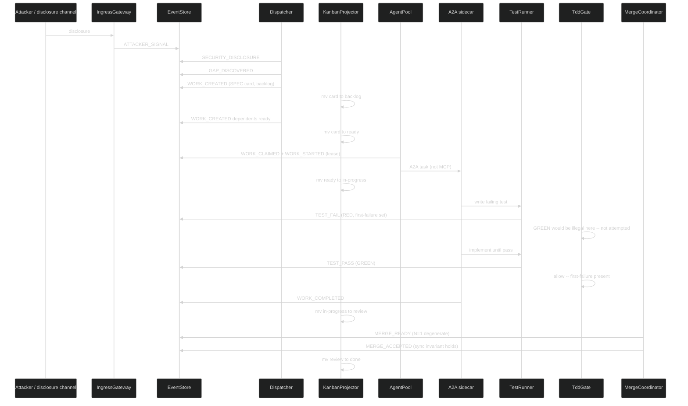

---

## 13. Production Requirements Checklist

Implementations MUST satisfy the product requirements and the production-hardening requirements. A green test banner is not evidence that this list is done.

### 13.1 Product (engine semantics)

- [ ] Cohesive event + feedback + docs + process + TDD (one catalog, one SCXML chart)
- [ ] One workstream kanban (`backlog`, `ready`, `in-progress`, `blocked`, `review`, `done` + merge-point columns)
- [ ] Parallel subagents with exclusive card + exclusive subtree leases
- [ ] Merge points (N-child fan-in; N=1 = `MERGE_ACCEPTED`; `WORK_MERGED` alias)
- [ ] External and internal events both on the named mesh
- [ ] Learning CREATE / REVISE / RETIRE with EFFICIENCY vs CAPABILITY as EventStore events; sidecar memory optional and off-engine
- [ ] Wrong SPEC and wrong FEAT identified in TDD (`SPEC_WRONG`, `FEAT_WRONG`)
- [ ] Sync invariant `SPEC == test == impl == process/template` at `MERGE_ACCEPTED`
- [ ] One loop at SPEC / L3 / instance / engine / recursion zooms
- [ ] Recursive child SDLC is a full engine instance with own iceoryx2 and EventStore
- [ ] Implementable subsystems as named Rust daemons (section 12)
- [ ] Dynamic registries -- not hardcoded node/kind/guard lists
- [ ] Async event-driven (timers emit `TIMER_TICK`)
- [ ] Scalable partitioning (`work_item_id`, `owned_subtree`, parent merge partition)
- [ ] TDD gate: `NOT_STARTED -> GREEN` is `TRANSITION_REJECTED`
- [ ] Hub never content-merges files
- [ ] Rejected MOTIs recorded (competing approaches guard)
- [ ] iceoryx2 + zenoh named mesh; no god bus
- [ ] Discovery from one `INITIAL_LOCATOR` only
- [ ] Optional A2A sidecar behind P2/P3; MCP absent; core tests pass with Ollama down; zero LLM in core daemons
- [ ] Live scheduler; no batch sort

### 13.2 Production hardening

- [ ] Authn/authz on IngressGateway and A2AGateway
- [ ] Audit log = EventStore
- [ ] Secrets: not in event payloads; reference vault ids
- [ ] Multi-tenancy isolation of event partitions (`tenant_id` prefix)
- [ ] Schema evolution / SCXML reload
- [ ] Clock / ordering: per-partition total order; happens-before via parent_id / zenoh egress
- [ ] Idempotency keys on ingress and on projector apply
- [ ] Graceful drain (section 12.7)
- [ ] Backup / restore of EventStore
- [ ] SLO / error budget (dispatch lag, merge latency, DLQ rate)
- [ ] Chaos / fault-injection hooks
- [ ] Observability: metrics, traces, logs
- [ ] Rate limits on IngressGateway
- [ ] Sandboxing of workers: MAY run in bwrap; MUST NOT be hard-required
- [ ] Bounded queues / backpressure
- [ ] Dead-letter + retry/backoff
- [ ] TTL leases (no forever locks)
- [ ] Snapshot / checkpoint
- [ ] Multi-instance Dispatcher with CAS on merge-point state
- [ ] Always-on daemons -- no batch automation
- [ ] Hierarchical agents with A2A rendezvous and watchdogs
- [ ] Localized SQLite ER per daemon (section 17)
- [ ] Errant-fork / runaway-AI detection in the running process (section 18)
- [ ] MQTT if present is localhost-only per instance

---

## 14. One Loop at Every Zoom

The engine is a single observe-decide-act-emit-project cycle. Changing zoom changes **which card** the cycle is looking at, not which engine is running.

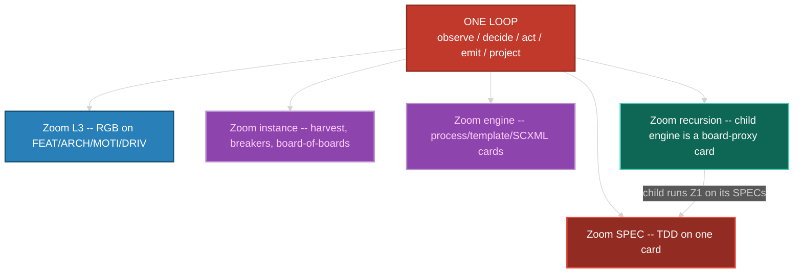

Self-improvement is not a special mode. A `PROCESS_DEFECT` is a card. A harvest is a card. A child SDLC is a board-proxy card. All wait on `ready`, take a lease, go RED before GREEN, fan in at a merge point.

---

## 15. Live Orchestrator -- Agents, Sub-agents, Rendezvous, Watchdogs

The orchestrator (Dispatcher + AgentPool + MergeCoordinator + Watchdog + DiscoveryDaemon + A2AGateway) is **always running**. It never "starts a run." Cards appear via events. Workers are processes with a parent pointer. Nesting is `IAgent.parent_agent` + `nesting_level` (0 = hub-spawned, 1..3 = sub / sub-sub / sub-sub-sub). Hard stop: `nesting_level >= 4` is `TRANSITION_REJECTED`.

### 15.1 Hierarchy

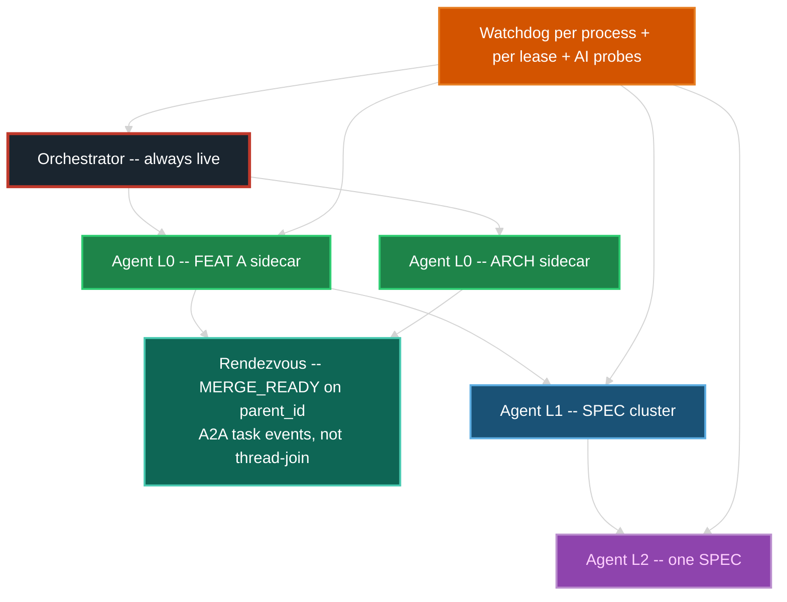

| Level | Who spawns | May write | Rendezvous |
|---|---|---|---|
| Orchestrator | process supervisor | event order, card `mv`, merge eval, parent reconcile | n/a -- it IS the rendezvous host |
| L0 agent | AgentPool via A2A | exclusive FEAT or ARCH subtree | children must `MERGE_ACCEPTED` before L0 `WORK_COMPLETED` |
| L1 agent | L0 via `WORK_DECOMPOSED` | exclusive child card(s) inside that subtree | same merge-point grammar |
| L2 / L3 | L1 / L2 | one SPEC or one test file | TDD events; parent lease remains with ancestor |

A parent MUST NOT write files covered by a live child lease. That is `WORK_CONFLICTED`.

Nested **engine** instances (board-of-boards): parent holds a **proxy card** only. The child has its own engine, own iceoryx2, own EventStore, own A2AGateway. Egress is zenoh `MESH_EGRESS`. The parent MUST NOT `waitpid` the child's workers and MUST NOT open the child's SQLite.

### 15.2 Rendezvous (event correlation, not thread-join)

1. Parent card lists `child_cards` on `IMergePoint`.
2. Each child completion is published on the child's `work_item_id` partition **and copied** onto the `parent_id` partition (local) or wrapped as `MESH_INGRESS` (child engine).
3. MergeCoordinator CAS-updates arrival count **on that event**. If count < N, stay OPEN or `MERGE_BLOCKED`. If count == N, `MERGE_READY` then sync invariant.
4. A2A task state changes are mapped to the same events. There is no `pthread_join`.
5. A missing child is discovered when `TIMER_TICK` + lease/watchdog says the child is dead (section 18), which emits `WORK_BLOCKED` on the child and `MERGE_BLOCKED` on the parent -- live, not at end of day.

### 15.3 Watchdogs -- gone-crazy process AND gone-crazy AI

Watchdog is a daemon. It does not batch-scan logs. Detection is **in the running process**.

| Probe | Period / trigger | Crazy / dead if | Action (live) |
|---|---|---|---|
| Heartbeat fd | Config `heartbeat_ms` via iceoryx2 event or `eventfd` | No beat for `3 * heartbeat_ms` | `WATCHDOG_HANG`; expire lease; card -> `ready` or `blocked` |
| Progress | `progress_idle_ms` | Lease held, no `TRANSITION_COMMITTED` from that agent | `WATCHDOG_STALL`; after 2, `WORK_BLOCKED`; do not auto-GREEN |
| Token / loop storm | sidecar stdout + A2A token counts | `token_rate > token_storm_tps` for `storm_window_ms`, or identical prompt loop `N` times | `WATCHDOG_AI_STORM`; SIGKILL; card stays RED or blocked |
| Output entropy | on each worker event | Repeat storm, or `TEST_PASS` with no first-failure | `WATCHDOG_THRASH` / `SPEC_WRONG`; kill; no auto-GREEN |
| File write set | `notify` on workspace | Create/write whose canonical path is not under `owned_subtree` | `WATCHDOG_PATH_VIOLATION` + `WORK_CONFLICTED`; SIGKILL; revoke lease |
| CPU / time budget | `procfs` + `TIMER_TICK` | `cpu_secs > budget` or wall `> time_budget` | `WATCHDOG_HANG` or storm; SIGKILL |
| Recursion | on spawn | `nesting_level` or `spawn_budget` exceeded | `TRANSITION_REJECTED`; no spawn |
| Oscillation | on RGB / merge | Same merge_point `MERGE_REJECTED` then ready then rejected `> oscillation_bound` without new child evidence; or SPEC flip-flop past RGB bound without escalate | `WATCHDOG_OSCILLATION`; force RGB event if needed; kill |
| Memory contradiction | P2 `MEMORY_CONTRADICTION` event (sidecar proposed) | Dispatcher treats as a card-minting event | Card `blocked` or `PROCESS_DEFECT`. Watchdog does not interpret embeddings |
| Divergence | git/worktree if used | Branch exists with no live lease and no `MERGE_ACCEPTED` | `FORK_ORPHAN` |

Watchdog MUST be able to **SIGKILL** a worker it spawned (`nix::sys::signal::kill`, then `waitpid`). It MUST NOT write SPEC/test/impl bodies. Recovery is always: lease expire -> card visible on `ready`/`blocked` -> another agent may claim.

### 15.4 No batching (binding)

Forbidden: nightly jobs that move cards, cron that "syncs the board", queued "orchestration runs", harvest that only runs at 02:00, merge evaluation that waits for a scheduled sweep, "run the test suite later", Vestige-style scheduled memory compact as the learning path.

Required: every state change is an event handled by a running subscriber before the next event on that partition is considered complete (backpressure, not deferral).

---

## 16. Dynamic Scheduling -- Kanban and Kanban of Kanbans

The orchestrator does not use a hardcoded priority list. It **scores live** on every `TRANSITION_COMMITTED`, `WORK_UNBLOCKED`, `TIMER_TICK` (ageing only), `MESH_INGRESS`, and P1 ingress event. The score is a pure function of card/lease/DAG fields in Config. It MUST NOT call a model, read mentedb, or use `INFERENCE_*` / sidecar memory.

### 16.1 Pick / schedule / determine / redetermine

On each of those events, Scheduler (a Dispatcher policy module) recomputes `priority_score` for the **affected** set only: the event's card, dependents, same-merge siblings, and board-proxies whose child just egressed. Never a full-fleet batch sort.

```
priority_score(card) =
    w_p0    * is_P0
  + w_dep   * dependents_blocked_count
  + w_age   * age_in_ready_ms
  + w_merge * merge_point_waiting_on_this
  + w_risk  * security_or_breaker_flag
  + w_zoom  * (1 / (1 + nesting_level))
  - w_wip   * (column_wip / column_wip_limit)
  - w_lease * already_has_owner
```

Weights live in Config. Changing weights is a config event, not a deploy.

**Pick:** AgentPool offers the highest-score `ready` card whose `owned_subtree` is free, whose deps are `done`, and whose agent type/capabilities match (human, scanner, or a live sidecar card on P2). Tie-break: older `entered_ready`. If no sidecar is running, only non-AI agents are eligible; the engine still scores and dispatches.

```
SELECT filename_id FROM card
 WHERE column = 'ready'
   AND owner_agent IS NULL
   AND capabilities_match(agent)
   AND subtree_free(owned_subtree)
   AND wip_ok(agent, column)
 ORDER BY score DESC, entered_column_ts ASC
 LIMIT 1
```

**Schedule:** claim = lease. WIP limits are hard: if column or agent WIP is full, next card stays `ready`. No overcommit. A2A `send_task` happens **after** the lease is in EventStore.

**Redetermine:** any new **engine** event can change scores. A `SECURITY_DISCLOSURE` can jump a card **without a batch reorder job** -- the next claim sees the new score. Sidecar skill changes do not recompute scores. Preemption: if a P0 security card is `ready` and an L0 agent holds only P3 work, Watchdog MAY request `WORK_RELEASED` on the P3 (cooperative) after `preempt_grace_ms`. Forcible preemption is Config-gated and emits `WORK_RELEASED` reason=preempt.

### 16.2 Board of boards

A board-proxy card represents a child kanban. The parent's Scheduler scores the **proxy**, not every child card. The child's Scheduler scores the child's cards independently.

| Zoom | What is scored | Who scores |
|---|---|---|
| Child SPEC | child `ready` cards | child Dispatcher |
| Parent FEAT | parent cards + board-proxies | parent Dispatcher |
| Fleet | instance-level board-proxies only | parent of instances (if any) |

The parent MUST NOT query the child EventStore to pick a SPEC.

### 16.3 Implementable algorithm (always-live main loop)

```
fn run(orch: Orchestrator) {
  # WaitSet: EventStore notify + iceoryx2 + zenoh + TIMER_TICK
  loop {
    for n in waitset.wait() {
      match n {
        StoreAppend(seq)        => handle_partition(seq)
        IceoryxService(_)       => handle_local_copy()
        ZenohIngress(sample)    => ingest_child_egress(sample)  # MESH_INGRESS
        LivelinessPut(tok)      => emit MESH_JOIN          # engine peers only
        LivelinessDelete(tok)   => emit MESH_LEAVE
        TimerTick(id)           => dispatch(TIMER_TICK)
      }
    }
  }
}

fn handle_partition(seq) {
  persist already done
  apply transition          # Dispatcher + TddGate + ResolvedChart
  project card mv           # KanbanProjector
  update scores for affected
  evaluate merge if parent_id
  harvest.on_event          # live, no LLM
  learning_ingest.on_event  # rusqlite projection only
  watchdog.on_event         # OS probes immediately
  offer_work()              # pick + claim; P3 only if a sidecar holds the lease
}

fn ingest_child_egress(sample) {
  # key: sdlc/{parent_instance}/egress/{child_instance}/{kind}
  append MESH_INGRESS wrapping child event
  move board-proxy column
  recompute proxy score
}
```

All steps are synchronous on the **partition**. Across partitions they are async copies. No global sort of the whole fleet.

---

## 17. Localized ER / RDBMS Schemas (SQLite per daemon)

The filesystem kanban remains the **workflow projection**. Each daemon has its **own** SQLite file for queries it cannot do with `ls`/`mv` alone. Stores are **per subsystem**, not one god database. EventStore is source of truth; local tables are rebuildable from replay.

Paths: `var/engine/{instance_id}/eventstore.sqlite` and `var/engine/{instance_id}/{daemon}.sqlite`. LearningIngest: `learningingest.sqlite`. Sidecar memory if any lives under the sidecar's own directory, not the engine EventStore. Character set: ASCII identifiers.

### 17.1 EventStore (instance-local)

```
event (
  tenant_id, seq, partition_key, event_id PK,
  kind, schema_ver, idempotency_key UNIQUE,
  work_item_id, parent_id, actor_id,
  payload_ref, ts_store
)
snapshot (tenant_id, partition_key, seq, blob_ref)
```

### 17.2 Dispatcher / transition

```
node (filename_id PK, type, parent, state, tdd_state, first_failure, iterations)
chart_hash (sha256 PK, loaded_seq)
committed (event_id PK, node_id, from_state, to_state)
```

### 17.3 Kanban projector

```
card (filename_id PK, column, owned_subtree, owner_agent NULL,
      parent_card, priority_score, entered_column_ts)
column (name PK, wip_limit)
board_proxy (card_id PK, child_instance_id, child_strat_id, child_locator)
```

`mv` of the file and the `card.column` row MUST be the same apply of one `TRANSITION_COMMITTED`. If the FS `mv` succeeds and the row fails, replay repairs the row.

### 17.4 Lease / AgentPool / A2A

```
lease (resource_id PK, agent_id, level, expires_seq, heartbeat_seq)
agent (agent_id PK, parent_agent, nesting_level, status, pid, spawn_ts,
       a2a_card_url, capabilities_json)
```

### 17.5 MergeCoordinator

```
merge_point (parent_card PK, required_state, state, n_expected, n_arrived)
merge_child (parent_card, child_card PK, arrived_event_id)
```

### 17.6 Watchdog

```
heartbeat (agent_id PK, last_seq, last_event_id, last_fd_tick)
stall (agent_id, stall_count, last_progress_seq)
write_set (event_id, path)
storm (agent_id, token_rate, loop_count, window_start)
```

### 17.7 Discovery / inference

```
locator_seen (locator PK, scheme, first_seq, last_liveliness)
inference (locator PK, kind, models_json, last_ok_seq)
```

### 17.8 Harvest / Learning / Ingress (local)

```
harvest_candidate (component_id PK, metric, value, last_event)
ingress_dedup (idempotency_key PK, event_id)
```

Learning facts on the engine are EventStore events plus the LearningIngest projection. Sidecar memory files are not EventStore and are not required to run the engine.

### 17.9 ER (engine instance)

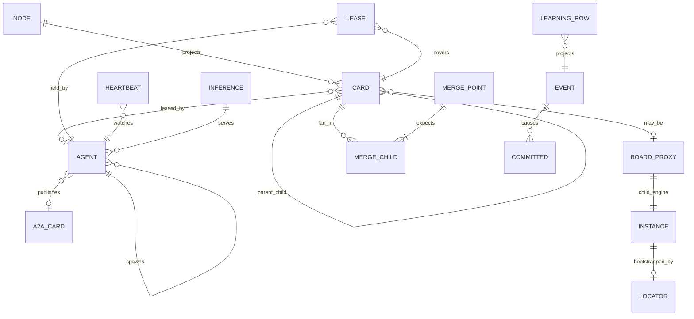

Cross-instance: parent `BOARD_PROXY.child_instance_id` plus `child_locator` are the only outbound keys. No join from parent Scheduler into child `CARD` rows.

---

## 18. Errant Forks and Bad Work -- Discovered Live

A **fork** here is a running agent, worktree, or card lineage that is not authorized by a live lease and a live parent, or that oscillates / writes outside its subtree, or an AI that storms tokens / hangs / contradicts memory.

| Kind | How discovered (live) | Event | Remedy |
|---|---|---|---|
| Orphan process | Watchdog heartbeat miss | `WATCHDOG_HANG` / `WORK_RELEASED` reason=dead | SIGKILL if pid still in AgentPool; card to `ready`/`blocked` |
| Orphan branch / worktree | write_set or git adapter event with no `lease` row | `FORK_ORPHAN` | Do not merge; card `blocked` |
| Bad fork (writes outside subtree) | `notify` vs `owned_subtree` | `WATCHDOG_PATH_VIOLATION` + `WORK_CONFLICTED` | SIGKILL; revoke lease |
| Thrash / reward-hack GREEN | TEST_PASS with null `first_failure` | `TRANSITION_REJECTED` + `WATCHDOG_THRASH` | TddGate forbids; Watchdog kills repeater |
| Token / loop storm | token_rate / identical loop | `WATCHDOG_AI_STORM` | SIGKILL; card RED/blocked |
| Silent hang | heartbeat fd + zero CPU + zero FS | `WATCHDOG_HANG` | Lease expire |
| Oscillating MERGE_REJECTED | flip-flop rate | `WATCHDOG_OSCILLATION` | Block; kill; no auto-accept |
| Escalation refusal | RGB bound hit, agent keeps retrying SPEC | Watchdog forces `INTEGRATION_FLAW` | Card moves to parent FEAT/ARCH; SPEC lease dropped |
| Memory contradiction | P2 proposal already on the bus | `MEMORY_CONTRADICTION` | Card `blocked` or `PROCESS_DEFECT`. No model in Watchdog |
| Split-brain two owners | second `WORK_CLAIMED` | `TRANSITION_REJECTED` | First lease wins |
| Child gone, parent waiting | `TIMER_TICK` + merge child not arrived + child lease expired or `MESH_LEAVE` | `MERGE_BLOCKED` | Parent stays blocked; child card reappears `ready` |
| Recursion bomb | spawn beyond depth/budget | `TRANSITION_REJECTED` | No new agent |
| Sidecar gone | A2A liveliness delete | `AGENT_CARD_REVOKED` | Same as dead worker |

These kinds are in SchemaRegistry. They project to `blocked` or `ready` like any other work event. They are never a batch report.

---

## Changelog

| Version | Date | Author | Changes |
|---|---|---|---|
| 0.0.1 | 2026-08-18 | Frederick Bloom | Original generic deterministic engine: taxonomy, RGB, guards, breakers, event-sourced core, star orchestrator, harvest, interfaces, event catalog. |
| 0.0.2 | 2026-08-30 | Frederick Bloom + Claude (Cursor AI) | Overlay attempt (workstream kanban, exclusive ownership, merge-point events, process/external events, TDD gate notes). **FAILED integration** -- two kanbans, two merge stories, two ownership models. Kept as historical sibling. Do not implement. |
| 0.0.3 | 2026-08-30 | Frederick Bloom + Claude (Cursor AI) | Integrated rewrite plus live-orchestrator **sketch**: one taxonomy, one kanban, one merge, one ownership; loops as zoom levels; ER sketch; generic event bus still named. Do not implement as the IPC contract. |
| 0.0.4 | 2026-08-30 | Frederick Bloom + Claude (Cursor AI) | Replaces the generic bus with **iceoryx2** plus **zenoh** (scout from one `INITIAL_LOCATOR`; no etcd/consul/eureka). MQTT local ingress only. One machine: **SCXML** + **`statig`**. **Consider-then-choose** table (section 0.4). **AI is a sidecar only** (section 0.5): core daemons have zero LLM; tests MUST pass with Ollama down; P2/P3 A2A ports; no AI in scores, merge, watchdog, kanban mv, TddGate. Sidecar MAY use `rig-core` + Ollama/LocalAI/Xinference/vLLM + rustmem/mentedb. **MCP forbidden**. LearningIngest is rusqlite, not mentedb-in-process. Live scheduler, OS watchdogs, localized SQLite ER, crate inventory. Harvest is the same loop at instance zoom. Section 6.2 high-contrast flowchart. UUID prefix reused from 0.0.1 by explicit user ruling. |
