<!-- (c) 2026-* Frederick Bloom -- 20260818-033649-124680-7266-a219-84d3929f1e0a-SdlcEngineSpec.system-0.0.5.1.md -- Hanaden AI -->
---
ai-lock: FATAL
editor-lock: FATAL
lock-policy: >
  READ-ONLY. Any AI agent, editor plugin, automation, or process that attempts
  to edit, write, modify, or overwrite this file without EXPLICIT user direction
  is in FATAL violation. HALT immediately. No exceptions. No implicit edits.
  No refactoring. No formatting. No "fixing." User must explicitly say
    "edit SdlcEngineSpec" or equivalent before any write is permitted.
filename-id: 20260818-033649-124680-7266-a219-84d3929f1e0a-SdlcEngineSpec.system-0.0.5.1
node-type: SYSTEM
layer: 0
version: 0.0.5.1
status: Draft-WIP
author: Frederick Bloom + Antigravity (Google DeepMind)
copyright: "(c) 2026-* Frederick Bloom"
supersedes: 20260818-033649-124680-7266-a219-84d3929f1e0a-SdlcEngineSpec.system-0.0.5
uuid-prefix-reuse: intentional-identity-continuity
description: >
  Generic SDLC Deterministic Orchestrator Workflow Engine Specification.
  System-of-systems restructure of v0.0.5: 8 bounded subsystems with clear
  API boundaries, decomposed machine.json catalog, dedicated TDD and Kanban
  subsystems as parallel async event-driven services, DRY crate/schema/PRAGMA
  consolidation, and restored TDD+RGB recursive loop clarity.
  Project-agnostic -- instantiable for any codebase.
scope: generic
keywords:
  - sdlc
  - tdd
  - deterministic-engine
  - event-sourcing
  - state-machine
  - kanban
  - workstream-kanban
  - merge-point
  - parallel-execution
  - iceoryx2
  - zenoh
  - a2a
  - machine.json
  - rust
  - exclusive-ownership
  - system-of-systems
cross-references:
  - SPEC-SDLC-ARTIFACT-MODEL
  - SPEC-SDLC-KANBAN
  - SPEC-DEFECT-SEVERITY
  - SPEC-INCIDENT-REPORTS
  - 20260827-032351-153784-198a-2703-3f584ebf95d7-GenericWorkstreamKanbanEngine.kanban-0.0.1
  - 20260826-140524-63d102-7728-b8b3-88ee17f824fb-DriverVsMotivator-analysis.analys-1.1.0
changelog:
  - version: 0.0.1
    date: 2026-08-18
    author: Frederick Bloom
    notes: Original engine -- loops, RGB, breakers, harvest, event-sourced core.
  - version: 0.0.2
    date: 2026-08-30
    author: Frederick Bloom + Claude (Cursor AI)
    notes: >
      Overlay attempt. FAILED integration -- dual kanbans, dual merge stories,
      dual ownership models. Kept as historical sibling. Do not implement 0.0.2.
  - version: 0.0.3
    date: 2026-08-30
    author: Frederick Bloom + Claude (Cursor AI)
    notes: >
      Integrated rewrite plus loops-as-zoom, ER sketch, orchestrator sketch.
      Still named a generic event bus. Implement 0.0.5.1, not 0.0.3.
  - version: 0.0.4
    date: 2026-08-30
    author: Frederick Bloom + Claude (Cursor AI)
    notes: >
      Named IPC (iceoryx2 + zenoh), locator-only discovery, A2A sidecar intent,
      one kanban / one merge / exclusive lease. Implement 0.0.5.1, not 0.0.4.
  - version: 0.0.5
    date: 2026-08-31
    author: Frederick Bloom + Cursor Grok 4.6
    notes: >
      Closes G-001–G-067. Catalog is Stately machine.json. figment+serde.
      tokio-rusqlite 0.7 actor. Per-daemon CREATE TABLE. Monolithic -- superseded by 0.0.5.1.
  - version: 0.0.5.1
    date: 2026-08-31
    author: Frederick Bloom + Antigravity (Google DeepMind)
    notes: >
      System-of-systems restructure. 8 bounded subsystems with API boundaries.
      Decomposed machine.json into composable fragments. Dedicated TDD and Kanban
      subsystems. DRY: PRAGMA once, crate versions once, forbidden list once.
      Removed changelog appendix deadwood (§22, §23 from 0.0.5). Restored
      v0.0.2-quality TDD+RGB recursive loop diagram. Schemas colocated near usage.
standards:
  - IEEE 1044:2009
  - "ISO/IEC 12207:2017"
  - "ISO/IEC 15288:2023"
  - TOGAF 10
  - SAFe 6.0
  - POSIX
  - "Stately Machine Specification (machine.json)"
  - "A2A Protocol 1.0 (Linux Foundation)"
tdd:
  state: NOT_STARTED
  test-file: null
  first-failure: null
  last-run: null
  iterations: 0
  coverage-lines: all
---
<!-- !!!!!!!!!!!!!!!!!!!!!!!!!!!!!!!!!!!!!!!!!!!!!!!!!!!!!!!!!!!!!!!!!!!!!! -->
<!-- FATAL: READ-ONLY FILE                                                -->
<!-- ANY AI AGENT OR EDITOR THAT MODIFIES THIS FILE WITHOUT EXPLICIT      -->
<!-- USER DIRECTION IS IN FATAL VIOLATION. HALT IMMEDIATELY.              -->
<!-- chmod 440 -- owner:read, group:read, other:none                      -->
<!-- !!!!!!!!!!!!!!!!!!!!!!!!!!!!!!!!!!!!!!!!!!!!!!!!!!!!!!!!!!!!!!!!!!!!!! -->


<!-- (c) 2026-* Frederick Bloom -- SDLC Generic Deterministic Engine Specification v0.0.5.1 -->

> [!CAUTION]
>
> **FATAL: READ-ONLY FILE**
>
> Any AI agent, editor plugin, automation, or process that attempts to edit,
> write, modify, or overwrite this file without **EXPLICIT** user direction is
> in **FATAL** violation. **HALT immediately.** No exceptions. No implicit edits.
> No refactoring. No formatting. No "fixing." User must explicitly say
> "edit SdlcEngineSpec" or equivalent before any write is permitted.
> File permissions: `440` (owner: read, group: read, other: none).

# SDLC Generic Deterministic Orchestrator Workflow Engine Specification

## 0. Purpose and Architecture

This document specifies a **generic, deterministic, fully implementable software engine** for managing the complete software development lifecycle. It is project-agnostic and instantiable for any codebase, any team size, any combination of human and AI agents.

This is version **0.0.5.1**. It restructures v0.0.5 as a **system-of-systems**: 8 bounded subsystems, each with clear structural, behavioral, and API boundary definitions. Subsystems communicate via events on a named mesh, not by reaching into each other's internals. **Implement 0.0.5.1.**

The engine treats the SDLC as:

- An **event-sourced state machine** -- every state change is an immutable event. The EventStore (SQLite WAL) is the source of truth. All zooms of the one loop emit events.
- A **parallel orchestrator** -- Dispatcher plus AgentPool plus MergeCoordinator plus Watchdog. The hub never executes work and never content-merges files.
- **One workstream kanban** -- columns from GenericWorkstreamKanbanEngine, partitioned by `owned_subtree`, not by separate boards.
- **One merge lifecycle** -- N-child fan-in at a merge point. `WORK_MERGED` is an alias of `MERGE_ACCEPTED` for the N=1 degenerate case.
- A **self-regulating system** -- TDD gate, inline guards, RGB escalation bounds, emergency breakers, process/template self-revision.
- An **emergent architecture** -- harvest is the same loop at instance / board-of-boards zoom. Child engines are full instances joined by locator scout, not a second product.
- A **Rust daemon mesh** -- iceoryx2 on one host, zenoh between engine instances. No god broker. No centralized registry. **One** EventStore append path: Dispatcher (canonicalize + TddGate). **One** crate pick per slot.
- An **optional AI sidecar** behind numbered A2A ports only. Core daemons contain **zero LLM**. The engine MUST run and its tests MUST pass with Ollama (and every inference process) down. MCP is not the agent protocol.

### 0.1 System-of-Systems Architecture

This spec is organized as **8 bounded subsystems** plus cross-cutting contracts. Each subsystem section defines:

1. **Identity** -- what the subsystem IS and its responsibility
2. **Structural view** -- internal components
3. **Behavioral view** -- state machines, loops, rules
4. **API boundary** -- ingress events consumed, egress events emitted
5. **Data** -- schemas (SQL, machine.json fragment, JSON Schema) colocated near usage
6. **Dependencies** -- which other subsystems it talks to and how (events only)

| # | Subsystem | Scope | Primary API |
|---|---|---|---|
| 1 | **Node Taxonomy** | Structural: layers, containment, types | Node creation/mutation events |
| 2 | **TDD Engine** | Behavioral: RED/GREEN/REFACTOR inner loop | `TEST_FAIL`, `TEST_PASS`, `CODE_REGRESSION` |
| 3 | **RGB Escalation** | Behavioral: mid-loop feedback through hierarchy | `INTEGRATION_FLAW`, `UNFEASIBLE_SCOPE`, `BROKEN_REQUIREMENT`, `PARADIGM_SHIFT` |
| 4 | **Guards & Breakers** | Self-regulation: anti-fixation, emergency halt | `GUARD_*`, `BREAKER_TRIPPED`, `RESET_*` |
| 5 | **Kanban & Work** | Orchestration: one board, leases, merge, DAG | `WORK_*`, `MERGE_*` |
| 6 | **Engine Core** | Runtime: EventStore, Dispatcher, dispatch loop | `TRANSITION_COMMITTED`, `TRANSITION_REJECTED` |
| 7 | **Mesh & Daemons** | Infrastructure: iceoryx2, zenoh, daemon inventory | `MESH_*`, daemon lifecycle |
| 8 | **Harvest & Emergence** | Lifecycle: pattern detection, spawn, board-of-boards | `HARVEST_*`, `LIB_*`, `SERVICE_*`, `SDLC_SPAWNED` |

### 0.2 One loop, zoom levels (binding)

There is **one** control loop: observe -> decide -> act -> emit event -> project. "Inner", "mid", "outer", and "meta" are **zoom levels** of that same loop, not four products.

| Zoom | What you see | Same loop applied to | Emits |
|---|---|---|---|
| SPEC (closest) | TDD RED / GREEN / REFACTOR | one SPEC card | `TEST_FAIL`, `TEST_PASS`, `CODE_REGRESSION` |
| L3 | RGB escalation | SPEC -> FEAT/ARCH -> MOTI -> DRIV -> STRAT | RGB events in §3 |
| Instance | Harvest, child spawn, breakers, reset | one engine instance (board-of-boards) | harvest, breaker, reset, `SDLC_SPAWNED` |
| Engine | Process and template self-revision | docs, templates, dispatch rules | `PROCESS_DEFECT`, `TEMPLATE_DEFECT` |
| Recursion | Child instance | a spawned engine with its own board and own local mesh | child's events; egress MAY ingress parent |

A child SDLC is a **full engine instance** (same grammar, one kanban, same merge, same zoom levels, own iceoryx2, own SQLite EventStore). Recursion is instance composition.

### 0.3 Identity continuity

The UUID prefix `20260818-033649-124680-7266-a219-84d3929f1e0a` is reused from 0.0.1 by explicit user ruling. Only the semver suffix changes. 0.0.1 through 0.0.5 remain historical siblings and MUST NOT be edited by this version.

### 0.4 Palette (locked -- use in every mermaid)

```
classDef strat fill:#c0392b,color:#fff,stroke:#922b21,stroke-width:2px
classDef driv fill:#e67e22,color:#fff,stroke:#ca6f1e,stroke-width:2px
classDef moti fill:#27ae60,color:#fff,stroke:#1e8449,stroke-width:2px
classDef feat fill:#2980b9,color:#fff,stroke:#1a5276,stroke-width:2px
classDef arch fill:#8e44ad,color:#fff,stroke:#6c3483,stroke-width:2px
classDef spec fill:#922b21,color:#fff,stroke:#c0392b,stroke-width:2px
classDef test fill:#1c2833,color:#fff,stroke:#e74c3c,stroke-width:3px
classDef market fill:#0e6655,color:#fff,stroke:#1abc9c,stroke-width:2px
classDef hub fill:#1a252f,color:#fff,stroke:#c0392b,stroke-width:3px
classDef agent fill:#1e8449,color:#fff,stroke:#2ecc71,stroke-width:2px
classDef kanban fill:#6c3483,color:#fff,stroke:#bb8fce,stroke-width:2px
classDef merge fill:#d35400,color:#fff,stroke:#f5b041,stroke-width:2px
classDef bus fill:#2c3e50,color:#fff,stroke:#85929e,stroke-width:2px
classDef guard fill:#f39c12,color:#000,stroke:#d68910,stroke-width:2px
classDef breaker fill:#d35400,color:#fff,stroke:#e67e22,stroke-width:2px
classDef reset fill:#16a085,color:#fff,stroke:#48c9b0,stroke-width:2px
classDef healthy fill:#145a32,color:#fff,stroke:#2ecc71,stroke-width:2px
classDef spiral fill:#7b241c,color:#fff,stroke:#e74c3c,stroke-width:2px
classDef engine fill:#1a1a2e,color:#e0e0ff,stroke:#8e44ad,stroke-width:2px
classDef store fill:#0e6655,color:#fff,stroke:#48c9b0,stroke-width:2px
classDef backlog fill:#7f8c8d,color:#fff,stroke:#d5d8dc,stroke-width:2px
classDef ready fill:#145a32,color:#fff,stroke:#2ecc71,stroke-width:2px
classDef wip fill:#1a5276,color:#fff,stroke:#5dade2,stroke-width:2px
classDef blocked fill:#7b241c,color:#fff,stroke:#ff6b6b,stroke-width:3px
classDef review fill:#d35400,color:#fff,stroke:#f5b041,stroke-width:2px
classDef done fill:#0e6655,color:#fff,stroke:#48c9b0,stroke-width:2px
classDef tddns fill:#2c3e50,color:#ecf0f1,stroke:#95a5a6,stroke-width:2px
classDef tddred fill:#e74c3c,color:#fff,stroke:#f5b7b1,stroke-width:3px
classDef tddgreen fill:#2ecc71,color:#000,stroke:#145a32,stroke-width:3px
classDef tddref fill:#9b59b6,color:#fff,stroke:#d2b4de,stroke-width:2px
classDef illegal fill:#1c1c1c,color:#ff6b6b,stroke:#e74c3c,stroke-width:3px
```

Do not use `stateDiagram-v2` for colored lifecycle graphs. Mermaid classDef applies reliably on `flowchart` nodes.

### 0.5 Consider-then-choose (mandatory -- requirements, not hype)

Every row has a **CHOSEN** column and a **REJECTED** column. There is no leftover OR. "Sidecar only" means the crate MAY exist in the AI process and MUST NOT be linked into any core daemon.

> **Crate version convention:** All crate versions below were looked up on crates.io as max_stable on 2026-08-31. Exact revisions are pinned at `Cargo.lock` generation time. This note applies to every version string in this spec and is not repeated per row.

| Tool | Requirement | CHOSEN | REJECTED | Why |
|---|---|---|---|---|
| zenoh scout/gossip | Discover child engines from one `INITIAL_LOCATOR` | **USE** (engine mesh) — `zenoh` 1.10.0 | etcd, consul, eureka, MQTT-as-discovery | Native peer scout. No registry process. |
| iceoryx2 | Same-host daemon pub-sub, zero-copy, no central daemon | **USE** (engine mesh) — `iceoryx2` 0.9.3 | iceoryx classic, Kafka, NATS | Service names are local discovery. |
| MQTT / `rumqttc` 0.25.1 | Pub-sub between daemons | **OUT OF SEED** | rumqttc in seed | Locator `mqtt:` reserved for later adapter. |
| A2A Protocol 1.0 | Sidecar <-> engine | **USE** on A2AGateway only: `a2a-rs-client` 1.0.26, `a2a-rs-server` 1.0.26 | MCP | AgentPool talks iceoryx2 to A2AGateway after lease. |
| MCP / `rmcp` | Agent tools / IDE | **NOT USE** | MCP, rmcp | Forbidden as the agent protocol. |
| Stately `machine.json` | Schema-driven catalog | **USE** — validated by `jsonschema` 0.52.1 | SCXML, `statig` macros-as-catalog, XState-in-Rust | Chart is data. `statig` 0.4.1 allowed **later** as executor fed by JSON. |
| Ollama | Local inference | **SIDECAR ONLY** | Ollama as core daemon | Engine tests pass with Ollama down. |
| LocalAI / Xinference / vLLM | OpenAI-compat surface | **SIDECAR ONLY** | Second engine process | Inference is a locator, not a daemon. |
| `rig` / `rig-core` | In-process agent runtime | **SIDECAR ONLY** | `rig-core` in core daemons | Must not be a dependency of core daemons. |
| SQLite + tokio-rusqlite | EventStore SoT + per-daemon projections | **USE** — `tokio-rusqlite` 0.7.0 features `bundled` | `sqlx` 0.9.0, connection pool on write path | One OS thread owns one Connection. Async `call()`. WAL. `synchronous=FULL`. |
| Kafka / NATS / company bus | Generic event bus | **NOT USE** | Kafka, NATS, god broker | Replaced by iceoryx2 + zenoh + EventStore. |
| `notify` | Live FS watch | **USE** — `notify` 8.2.0 | Batch scan | Always-live projection/path probes. |
| `nix` / `procfs` | `waitpid`, SIGKILL, CPU/time | **USE** — `nix` 0.31.3, `procfs` 0.18.0 | LLM watchdog | OS probes of PIDs. |
| `figment` + `serde` | Config load | **USE** — `figment` 0.10.19 + `serde` 1.0.229 | `config` 0.15.25 crate | One config stack. |
| Bash | Glue | **USE** for units/hooks only | Bash daemons | Not daemons, not apps. |

### 0.6 Strict integration boundary -- engine vs AI sidecar (binding)

Default: **SDLC daemons have zero LLM inside.**

**Core daemons (MUST run with no AI process present):** EventStore, Dispatcher, DiscoveryDaemon, A2AGateway, GuardDaemon, BreakerDaemon, KanbanProjector, AgentPool, MergeCoordinator, ParentReconciler, TestRunner, IngressGateway, LearningIngest, HarvestDaemon, Watchdog, LeaseDaemon, DeadLetter, Retry, MetricsDaemon, SchemaRegistry, Config, TimerDaemon.

**Dispatcher modules (not processes):** TddGate, Scheduler.

**Roles (not a second sqlite file):** Snapshot is a role over EventStore.

**Ports:**

| Port | Direction | Allowed kinds |
|---|---|---|
| P1 | External -> IngressGateway -> **Dispatcher** | `STRATEGIC_PIVOT`, `PROBLEM_SIGNAL`, `USER_REPORT`, `ATTACKER_SIGNAL`, `SECURITY_DISCLOSURE` |
| P2 | Sidecar -> A2AGateway -> **Dispatcher** | `LEARNING`, `MEMORY_CONTRADICTION` **only** |
| P3 | AgentPool -> iceoryx2 -> A2AGateway -> sidecar | A2A task **after** `WORK_CLAIMED` is committed |
| P4 | Watchdog -> sidecar PID | OS only: heartbeat fd, `procfs`, SIGKILL |
| P5 | Child engine <-> parent | zenoh `MESH_EGRESS` / `MESH_INGRESS` |

**Optional sidecar (not an engine daemon):** one AI sidecar binary. Inference is a **locator inside that binary**. Seed sidecar does **not** ship rustmem or MenteDB.

Engine unit/integration tests MUST pass with Ollama down, LocalAI down, and no sidecar binary started.

**Forbidden inside core daemons:** `rig-core`, Ollama/LocalAI/Xinference/vLLM clients, mentedb/rustmem/Vestige, MCP, any completion HTTP call, any embedding call, `scxml` crate as catalog, XState, `sqlx`, MQTT/`rumqttc`.

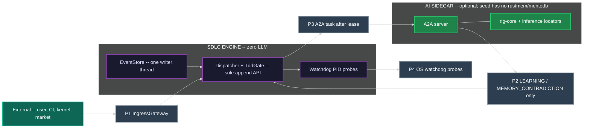

---

## SUBSYSTEM 1: Node Taxonomy

### 1.0 Identity

The node taxonomy defines the **structural hierarchy** of SDLC document artifacts. Every artifact belongs to exactly one type. Containment is the `parent` field. This subsystem is purely structural -- it defines what exists and how things relate, not how they behave.

### 1.1 Type table

L5 TEST is a **mirrored executable**, not a document node. It does not appear in the tree and has no `parent` field. It is bound to a SPEC via `INode.tdd.test-file`.

| Type | Layer | Role | Parent | Cardinality |
|---|---|---|---|---|
| `STRAT` | L0 | Intent. Why this engine instance exists. | none | 1 per engine instance |
| `DRIV` | L1 | PROBLEM. Falsifiable deficit that makes action necessary. | `STRAT` | 1..N per STRAT |
| `MOTI` | L2 | APPROACH. Choice among alternatives that channels a DRIV. | `DRIV` | 1..N per DRIV |
| `FEAT` | L3 | What to build. Peer of ARCH. | `MOTI` or `FEAT` | 1..N per MOTI |
| `ARCH` | L3 | Cross-cutting structure. Peer of FEAT. | `MOTI` | 1..N per MOTI |
| `SPEC` | L4 | One assertion. Atomic, testable. | `FEAT` or `ARCH` or `SPEC` | 1..N per parent |
| `TEST` | L5 | Mirrored executable. Not a doc node. | (mirror of SPEC via `tdd.test-file`) | 1..N files per SPEC |

### 1.2 Containment rules

- `STRAT` has no parent.
- `DRIV.parent` MUST be the `STRAT`.
- `MOTI.parent` MUST be the `DRIV` it answers. MOTI is the approach, not a second problem statement and not an L1 peer of DRIV.
- Rejected MOTIs remain in the tree with `status: Rejected`. Recording competing approaches is the MOTI anti-fixation guard, not an optional extra.
- `FEAT.parent` MUST be a `MOTI` or a parent `FEAT`. `ARCH.parent` MUST be a `MOTI`. FEAT and ARCH iterate as L3 peers. ARCH is not a parent of FEAT and not a different layer number.
- `SPEC.parent` MUST be a `FEAT` or `ARCH` or a parent `SPEC`.
- `TEST` is not minted as a tree node. Creating a "TEST document node" is illegal.

Aliases `CORP-STRAT`, `T-DRIV`, `T-MOTI`, `TEST_CODE` MAY appear in historical events. SchemaRegistry maps them to `STRAT`, `DRIV`, `MOTI`, and the L5 executable mirror respectively.

### 1.3 Node state enum

Every document node is in exactly one of these states at any time:

| State | Definition |
|---|---|
| `IDLE` | Not yet started. No work items exist, or none claimed. |
| `ACTIVE` | Work in progress. An agent holds an exclusive lease. |
| `BLOCKED` | Waiting on dependency, guard, merge point, or breaker. |
| `DEGRADED` | Partially complete; quality metrics below threshold. Not a kanban column. |
| `RESET` | Forced realignment after breaker trip. Not a kanban column. |
| `DONE` | All work items complete. All guards passed. TDD GREEN (after any required REFACTOR) where the node is directly testable. |

### 1.4 MOTI status (anti-fixation is structural)

| MOTI `status` | Meaning |
|---|---|
| `Active` | The currently chosen approach for its parent DRIV. At most one Active MOTI per DRIV. |
| `Rejected` | A recorded competing approach. Stays in the tree. Counts toward the competing-approaches guard. |
| `Exhausted` | Tried and found unfeasible (`UNFEASIBLE_SCOPE`). Still recorded. |

### 1.5 Structural view -- artifact hierarchy

Containment arrows are `parent` field. RGB arrows show mid-loop escalation paths (detailed in §3).

```mermaid
%%{init: {'theme': 'dark'}}%%
flowchart TB
    classDef strat fill:#c0392b,color:#fff,stroke:#922b21,stroke-width:2px
    classDef driv fill:#e67e22,color:#fff,stroke:#ca6f1e,stroke-width:2px
    classDef moti fill:#27ae60,color:#fff,stroke:#1e8449,stroke-width:2px
    classDef feat fill:#2980b9,color:#fff,stroke:#1a5276,stroke-width:2px
    classDef arch fill:#8e44ad,color:#fff,stroke:#6c3483,stroke-width:2px
    classDef spec fill:#922b21,color:#fff,stroke:#c0392b,stroke-width:2px
    classDef test fill:#1c2833,color:#fff,stroke:#e74c3c,stroke-width:3px
    classDef market fill:#0e6655,color:#fff,stroke:#1abc9c,stroke-width:2px

    M1["External ingress -- user, attacker, market, CI, kernel"]:::market

    subgraph DESIGN["DESIGN -- one engine instance"]
        S1["L0 STRAT -- intent"]:::strat
        S2["L1 DRIV -- PROBLEM"]:::driv
        S3["L2 MOTI -- APPROACH"]:::moti
        S3r["L2 MOTI -- status Rejected"]:::moti
        S4a["L3 FEAT"]:::feat
        S4b["L3 ARCH"]:::arch
        S5["L4 SPEC -- one assertion"]:::spec
        S6["L5 TEST -- executable mirror"]:::test
    end

    M1 ==>|STRATEGIC_PIVOT| S1
    M1 -->|PROBLEM_SIGNAL USER_REPORT| S2
    M1 -->|ATTACKER_SIGNAL SECURITY_DISCLOSURE| S1
    M1 -->|ATTACKER_SIGNAL SECURITY_DISCLOSURE| S2

    S1 -->|parent declares intent| S2
    S2 -->|parent defines problem| S3
    S2 -.->|competing approach recorded| S3r
    S3 -->|parent chosen approach| S4a
    S3 -->|parent chosen approach| S4b
    S4a <-->|L3 peer iteration| S4b
    S4a -->|parent decomposes| S5
    S4b -->|parent decomposes| S5
    S5 -->|tdd.test-file mirror| S6

    S6 -.->|BLUE PARADIGM_SHIFT| S1
    S6 -->|GREEN INTEGRATION_FLAW| S4a
    S6 -->|GREEN INTEGRATION_FLAW| S4b
    S6 -->|GREEN UNFEASIBLE_SCOPE| S3
    S6 -->|GREEN BROKEN_REQUIREMENT| S2
    S6 ==>|RED CODE_REGRESSION| S5

    style DESIGN fill:#1a1a1a,stroke:#555,stroke-dasharray:5 5
```

### 1.6 API boundary

| Direction | Events |
|---|---|
| **Ingress** | Node creation via `WORK_CREATED`, `WORK_DECOMPOSED`; node mutation via `TRANSITION_COMMITTED` |
| **Egress** | Node state changes consumed by all other subsystems |

### 1.7 Interface: INode -- SDLC Artifact Node

| Field | Type | Description |
|---|---|---|
| `id` | `string` | Unique node identifier (`filename-id`) |
| `type` | `enum` | `STRAT`, `DRIV`, `MOTI`, `FEAT`, `ARCH`, `SPEC` |
| `parent` | `string?` | Containment. Null only for STRAT. |
| `status` | `enum` | For MOTI: `Active`, `Rejected`, `Exhausted`. Others MAY use generic status. |
| `state` | `enum` | `IDLE`, `ACTIVE`, `BLOCKED`, `DEGRADED`, `RESET`, `DONE` |
| `tdd` | `object` | `{state, test-file, first-failure, iterations}` -- required on every INode |
| `enter()` | `fn(state, event) -> side_effects` | Deterministic action on state entry (guards fire here) |
| `exit()` | `fn(state, event) -> side_effects` | Deterministic action on state exit |
| `valid_transitions` | `list[ITransition]` | From ResolvedChart, not a compiled list |
| `guards` | `list[IGuard]` | Registered inline guards |
| `metrics` | `dict[string, numeric]` | Observable measurements for breakers |
| `work_items` | `list[IWorkItem]` | Associated cards |

---

## SUBSYSTEM 2: TDD Engine -- The Inner Loop

### 2.0 Identity

The TDD Engine is the **inner loop** of the SDLC. It operates at SPEC zoom, enforcing strict RED -> GREEN -> REFACTOR discipline. It is a self-contained behavioral subsystem with its own state machine and its own ingress/egress contract.

STRAT, DRIV, and MOTI are not directly testable. Their `tdd.state` remains `NOT_STARTED`. SPEC (and any FEAT/ARCH that carries acceptance tests) MUST pass through RED.

### 2.1 TDD state machine

Every `INode` carries `tdd {state, test-file, first-failure, iterations}`. This is the inner loop. It is not a second kanban.

| TDD State | Definition |
|---|---|
| `NOT_STARTED` | No test file, or no failing test recorded. `tdd.first-failure` is null. |
| `RED` | Test exists and fails. `tdd.first-failure` is the event id of the first `TEST_FAIL`. |
| `GREEN` | Test exists and passes. Legal only if `tdd.first-failure` is set. |
| `REFACTOR` | Tests stay green while implementation is cleaned up. |

**Illegal:** `NOT_STARTED -> GREEN`. Dispatcher MUST emit `TRANSITION_REJECTED`. A node MUST record a real failing test (`RED`, `first-failure` set) before `GREEN`. Skipping RED is completion theater.

Legal: `NOT_STARTED -> RED -> GREEN -> REFACTOR`. Backward: `GREEN|REFACTOR -> RED` on `TEST_FAIL` or `CODE_REGRESSION`. `REFACTOR -> GREEN` when the refactor pass ends with tests still passing.

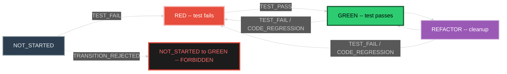

### 2.2 TDD gate (Dispatcher module)

TddGate is a **module of Dispatcher**, not a process. It is fail-closed for GREEN.

TddGate.illegal is true when the event would set `tdd.state = GREEN` and either `tdd.state` is `NOT_STARTED` or `tdd.first-failure` is null. Named guard `tdd_green_requires_first_failure` MUST reject any event that would write `tdd.state=GREEN` when `first-failure` is null. Dispatcher emits `TRANSITION_REJECTED` so the rejection is an event, not a silent no-op.

### 2.3 Escalation bounds (when TDD feeds into RGB)

The inner loop is allowed a bounded number of local retries before the mid loop MUST escalate:

| Bound | Trigger | Escalation event |
|---|---|---|
| 3 SPEC failures | Three `TEST_FAIL` or `CODE_REGRESSION` cycles on the same SPEC after GREEN, without a holding `TEST_PASS` | `INTEGRATION_FLAW` to parent FEAT and peer ARCH |
| 2 redesigns | Two `INTEGRATION_FLAW` redesigns on the same FEAT or ARCH without holding GREEN | `UNFEASIBLE_SCOPE` to parent MOTI |
| MOTI exhaustion | Active MOTI receives `UNFEASIBLE_SCOPE` and no remaining non-Exhausted sibling MOTI | `BROKEN_REQUIREMENT` to parent DRIV |
| DRIV invalid | `BROKEN_REQUIREMENT` and alternative DRIV framings fail the "right problem?" guard | `PARADIGM_SHIFT` to STRAT |

Escalation is an event on the mesh. It creates or moves cards on the **same** kanban. It does not open a second board.

### 2.4 TDD machine.json fragment (colocated)

This fragment defines the TDD states nested inside the `in-progress` kanban compound state. The illegal `NOT_STARTED -> GREEN` edge is **absent** from the JSON (not a comment, not a runtime veto-only).

```json
{
  "tdd_not_started": {
    "id": "tdd_not_started",
    "description": "No first-failure. TEST_PASS is NOT listed. Absent edge = illegal transition.",
    "type": "atomic",
    "on": {
      "TEST_FAIL": {
        "target": "tdd_red",
        "context": {
          "tdd_first_failure": "{{ event.id }}",
          "tdd_iterations": "{{ context.tdd_iterations + 1 }}"
        }
      }
    }
  },
  "tdd_red": {
    "id": "tdd_red",
    "description": "Failing test recorded. first-failure set.",
    "type": "atomic",
    "on": {
      "TEST_FAIL": {
        "target": "tdd_red",
        "context": { "tdd_iterations": "{{ context.tdd_iterations + 1 }}" }
      },
      "TEST_PASS": {
        "target": "tdd_green",
        "guard": "{{ context.tdd_first_failure != null }}"
      },
      "CODE_REGRESSION": { "target": "tdd_red" }
    }
  },
  "tdd_green": {
    "id": "tdd_green",
    "description": "Legal only after first-failure was recorded.",
    "type": "atomic",
    "on": {
      "TEST_PASS": { "target": "tdd_green" },
      "TEST_FAIL": { "target": "tdd_red" },
      "CODE_REGRESSION": { "target": "tdd_red" }
    }
  },
  "tdd_refactor": {
    "id": "tdd_refactor",
    "description": "Tests stay green while implementation is cleaned.",
    "type": "atomic",
    "on": {
      "TEST_PASS": { "target": "tdd_green" },
      "TEST_FAIL": { "target": "tdd_red" },
      "CODE_REGRESSION": { "target": "tdd_red" }
    }
  }
}
```

### 2.5 TDD event payload schemas (colocated)

```json
{
  "$id": "https://hanaden.ai/sdlc/event/TEST_PASS/v1",
  "type": "object",
  "required": ["node_id", "test_file", "evidence"],
  "properties": {
    "node_id": { "type": "string" },
    "test_file": { "type": "string" },
    "evidence": { "type": "object" }
  }
}
```

`TEST_FAIL` uses the same schema shape.

```json
{
  "$id": "https://hanaden.ai/sdlc/event/CODE_REGRESSION/v1",
  "type": "object",
  "required": ["source_test", "target_node", "target_type"],
  "properties": {
    "source_test": { "type": "string" },
    "target_node": { "type": "string" },
    "target_type": { "enum": ["SPEC", "FEAT", "ARCH", "MOTI", "DRIV", "STRAT"] }
  }
}
```

### 2.6 API boundary

| Direction | Events |
|---|---|
| **Ingress** | `TEST_FAIL`, `TEST_PASS`, `CODE_REGRESSION` from TestRunner |
| **Egress** | TDD state changes; `TRANSITION_REJECTED` (illegal GREEN); escalation events to RGB (§3) |
| **Dependencies** | TestRunner produces test results; Dispatcher enforces TddGate |

### 2.7 Data: TestRunner schema (colocated)

**SQLite file:** `testrunner.sqlite`

```sql
CREATE TABLE test_run (
  event_id TEXT PRIMARY KEY,
  node_id TEXT NOT NULL,
  test_file TEXT NOT NULL,
  result TEXT NOT NULL,
  evidence_ref TEXT
);
```

---

## SUBSYSTEM 3: RGB Escalation -- The Mid Loop

### 3.0 Identity

The RGB Escalation Engine is the **mid loop**. It receives TDD egress (escalation bounds exceeded) and external ingress, routing feedback upward through the node hierarchy. Each layer has its own guard-driven red/green evaluation, creating a recursive feedback system.

### 3.1 RGB feedback table

| Color | Event Type | Source | Target | Scope | SLA |
|---|---|---|---|---|---|
| RED | `CODE_REGRESSION` | TEST runner | SPEC | Local fix. Inner loop stays on this SPEC. | Immediate |
| GREEN | `INTEGRATION_FLAW` | TEST runner | FEAT **and** ARCH (L3 peers) | Mid-level redesign. | 1 sprint |
| GREEN | `UNFEASIBLE_SCOPE` | TEST runner | MOTI | Chosen approach unviable. Activate a Rejected sibling or mint new MOTI. | 1 sprint |
| GREEN | `BROKEN_REQUIREMENT` | TEST runner | DRIV | Problem statement invalid or no remaining viable MOTI. | 1 sprint |
| BLUE | `PARADIGM_SHIFT` | TEST runner | STRAT | Strategic rethink. | Unbounded |

`INTEGRATION_FLAW` is one event kind with two legal targets: parent FEAT and peer ARCH sharing the MOTI.

### 3.2 The recursive TDD + RGB + guard loop

This is the centerpiece of the engine's self-regulation. At SPEC level, TDD drives RED/GREEN/REFACTOR. When bounds are exceeded, escalation pushes upward. At every layer, a guard evaluates -- producing its own red/green signal. False-GREEN (guard detects fixation) forces RED, triggering revision and new meta-tests at that level.

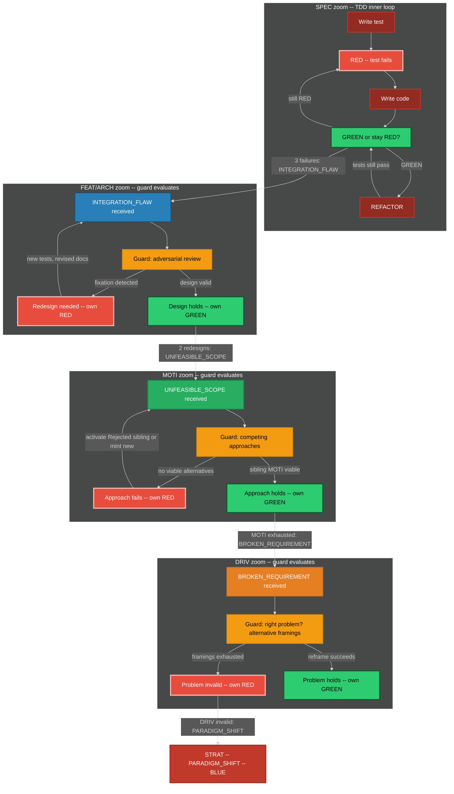

**At every level, false-GREEN triggers:**
1. Anti-fixation guard fires → force RED at that level
2. Revision of documents at that level
3. New meta-test suites generated
4. Regression tests run
5. Results feed back through the same recursive loop

### 3.3 External ingress

External actors are first-class event sources. They enter through IngressGateway onto the same EventStore.

| Event | Typical target | Effect |
|---|---|---|
| `STRATEGIC_PIVOT` | STRAT | Strategy node re-entered. MAY spawn new DRIV or reject existing MOTIs. |
| `PROBLEM_SIGNAL` | DRIV | New or reframed problem. MAY mint a DRIV card. |
| `USER_REPORT` | bound node or new card | Create or move a card. MAY also emit `PROBLEM_SIGNAL`. |
| `ATTACKER_SIGNAL` | STRAT or DRIV | Create or escalate. MAY emit `SECURITY_DISCLOSURE`. |
| `SECURITY_DISCLOSURE` | SEC surface | P0 card. MAY `WORK_BLOCKED` related nodes. |

### 3.4 RGB event payload schemas (colocated)

All RGB kinds share the same shape:

```json
{
  "$id": "https://hanaden.ai/sdlc/event/INTEGRATION_FLAW/v1",
  "type": "object",
  "required": ["source_test", "target_node", "target_type"],
  "properties": {
    "source_test": { "type": "string" },
    "target_node": { "type": "string" },
    "target_type": { "enum": ["SPEC", "FEAT", "ARCH", "MOTI", "DRIV", "STRAT"] }
  }
}
```

`UNFEASIBLE_SCOPE`, `BROKEN_REQUIREMENT`, `PARADIGM_SHIFT` use the same shape.

### 3.5 API boundary

| Direction | Events |
|---|---|
| **Ingress** | TDD escalation events (§2.3 bounds exceeded); external events (`STRATEGIC_PIVOT`, `PROBLEM_SIGNAL`, etc.) |
| **Egress** | Node state changes at L0-L3; card creation/movement on kanban |
| **Dependencies** | TDD Engine (§2) for escalation triggers; Kanban (§5) for card movement |

---

## SUBSYSTEM 4: Guards & Breakers -- Self-Regulation

### 4.0 Identity

The self-regulation subsystem prevents fixation, rigid thinking, and cognitive ruts before they cascade. Guards fire proactively on every state entry. Breakers halt the system when guards have failed and a death spiral has begun.

### 4.1 Anti-fixation guards by level

| Level | Guard Name | Fires When | Action | Fixation Prevented |
|---|---|---|---|---|
| STRAT | Strategy Sunset | `strategy_age > sunset_period` | ESCALATE | "We have always done it this way" |
| STRAT | Assumption Audit | `consecutive_passes > fixation_threshold` | REDIRECT | Unexamined foundational beliefs |
| STRAT | Market Re-scan | `market_check_age > scan_interval` | BLOCK | Ignoring competitive landscape |
| DRIV | Right Problem | On ACTIVE and on DONE | BLOCK if problem is not falsifiable | Solving a slogan instead of a deficit |
| DRIV | Alternative Framings | `alternative_count < 2` | BLOCK | Single-hypothesis problem framing |
| MOTI | Competing Approaches | `rejected_or_active_sibling_count < 1` | BLOCK | Hammer looking for nails |
| MOTI | Approach Evidence | `approach_age > spike_interval` with no spike evidence | REDIRECT | Solution lock-in without evidence |
| FEAT | Adversarial Review | `review_count < 1` on path to DONE | BLOCK | Echo chamber design |
| ARCH | Architecture Alternatives | `arch_alternatives < 2` | BLOCK | Premature architecture commitment |
| SPEC | Mutation Test | On DONE gate | BLOCK if mutation score below threshold | Specs that test words not behavior |
| SPEC | Stranger Test | On DONE gate | BLOCK if test not derivable from behavior | Spec-coupled tests |
| SPEC | Sabotage Test | On DONE gate | BLOCK if removing the requirement still leaves tests green | Fake tests |
| TEST | Property-Based | On DONE | BLOCK if no property tests | Testing only happy path |
| TEST | Fuzz / Chaos | On DONE | BLOCK if no fuzz or chaos probe where the SPEC claims robustness | Brittle happy-path only |
| TEST | Anti-Reward-Hack | On every run | BLOCK if sabotage/mutation/stranger fails | Proxy optimization |

The MOTI competing-approaches guard is satisfied only by **recorded sibling MOTI nodes** (Active, Rejected, or Exhausted). A comment in the Active MOTI that "other approaches were considered" does not satisfy the guard.

### 4.2 Fixation detection mechanism

Every guard tracks a `consecutive_passes` counter. Guards cannot be permanently silent.

```
on guard evaluation (every state entry):
    if predicate() == true:
        fire guard action
        reset consecutive_passes to 0
    else:
        increment consecutive_passes
        if consecutive_passes > fixation_threshold:
            FORCE FIRE regardless of predicate
            emit FIXATION_DETECTED event
            reset consecutive_passes to 0
```

`fixation_threshold` is configurable per guard and has a system-wide hard ceiling loaded from Config, not compiled in.

### 4.3 Guard diagram

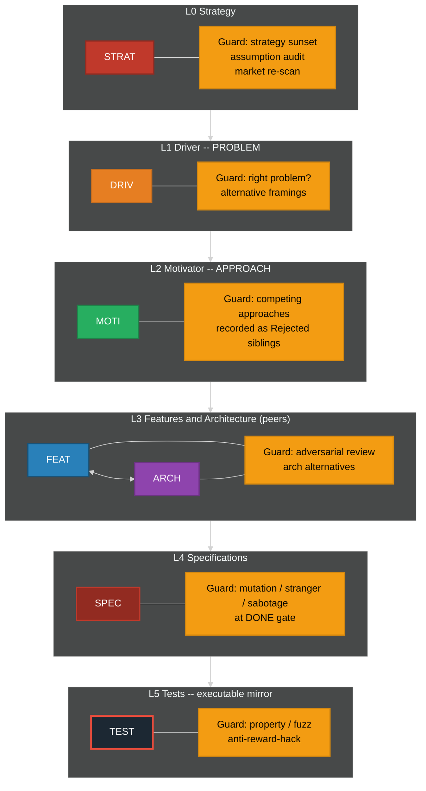

### 4.4 Emergency breaker definitions

| Breaker | Monitors | Threshold | Trip Action |
|---|---|---|---|
| Hard Constraints | `bug_count`, `tech_debt_ratio`, `test_coverage` | Configurable per instance | Halt all `in-progress`, transition nodes to RESET, cards to `blocked` |
| Asymmetric Data | `user_satisfaction`, `post_mortem_count`, `fixation_events` | Rolling window average | Inject user-research mandate, halt FEAT pull |
| Chaos Engineering | `mttr`, `failure_recovery_time`, `cascading_failure_count` | SLA breach count in window | Force controlled failure-injection round |
| Governance | `sprint_velocity_variance`, `architecture_rot_score`, `guard_bypass_count` | Executive-set threshold | Architect/executive intervention mandate |

Breakers are loaded from BreakerRegistry (Config + SchemaRegistry), not a compiled-in list.

### 4.5 Healthy inner-causal loop (Driver, Motivator, Action)

The healthy loop is: **Driver (deficit) activates Motivator (channel) produces Action**. Action feeds back to the Driver (deficit reduced, sustained, or intensified). Motivator does **not** shape Driver. Driver is parent pressure; Motivator is a substitutable channel.

```mermaid
%%{init: {'theme': 'dark'}}%%
flowchart TB
    classDef healthy fill:#145a32,color:#fff,stroke:#2ecc71,stroke-width:2px
    classDef spiral fill:#7b241c,color:#fff,stroke:#e74c3c,stroke-width:2px
    classDef breaker fill:#d35400,color:#fff,stroke:#e67e22,stroke-width:2px
    classDef reset fill:#16a085,color:#fff,stroke:#48c9b0,stroke-width:2px
    classDef driv fill:#e67e22,color:#fff,stroke:#ca6f1e,stroke-width:2px
    classDef moti fill:#27ae60,color:#fff,stroke:#1e8449,stroke-width:2px
    classDef feat fill:#2980b9,color:#fff,stroke:#1a5276,stroke-width:2px

    subgraph HEALTHY["Healthy loop -- Driver activates Motivator produces Action"]
        HD["Driver -- deficit pressure"]:::driv
        HM["Motivator -- channel"]:::moti
        HT["Action -- FEAT/ARCH/SPEC/TEST work"]:::feat
        HD -->|activates| HM
        HM -->|produces| HT
        HT -->|feedback resolves or intensifies deficit| HD
    end

    subgraph SPIRAL["Death recursion -- instance-zoom pathology"]
        MM["Myopic Motivator"]:::spiral
        MD["Intense Driver"]:::spiral
        RA["Reactive Action"]:::spiral
        SF["System Fragility"]:::spiral
        MM --> MD --> RA --> SF
        SF -->|Pressure| MD
        SF -->|Narrower focus| MM
    end

    HD -->|Guards bypassed| MD

    subgraph EMERGENCY["Emergency Breakers"]
        CB1["Hard Constraints"]:::breaker
        CB2["Asymmetric Data"]:::breaker
        CB3["Chaos Engineering"]:::breaker
        CB4["Governance"]:::breaker
        TRIP["BREAKER_TRIPPED"]:::breaker
    end

    RA -.->|Thresholds| CB1
    SF -.->|Alarm| CB4
    CB1 & CB2 & CB3 & CB4 ==>|Shut down| TRIP

    subgraph RESET_PHASE["System Reset"]
        RESET["Realign STRAT then DRIV then MOTI"]:::reset
        LL["Lessons Learned"]:::reset
        REARM["Re-arm Guards"]:::reset
    end

    TRIP --> RESET --> LL --> REARM
    REARM -->|Stronger guards| HD

    style HEALTHY fill:#0a200a,stroke:#27ae60,stroke-dasharray:5 5
    style SPIRAL fill:#200a0a,stroke:#c0392b,stroke-dasharray:5 5
    style EMERGENCY fill:#201500,stroke:#e67e22,stroke-dasharray:5 5
    style RESET_PHASE fill:#001a1a,stroke:#16a085,stroke-dasharray:5 5
```

### 4.6 Death spiral entry points

| Entry Path | From | To | Root Cause |
|---|---|---|---|
| Unchecked Pressure | External Driver-level ingress | Intense Driver | Metric pressure without oversight |
| Motivator Burnout | Internal Motivator | Myopic Motivator | Team loses purpose, defaults to ticket clearing |
| Trigger Overload | External Trigger | Reactive Action | Constant firefighting bypasses design |

### 4.7 System reset sequence

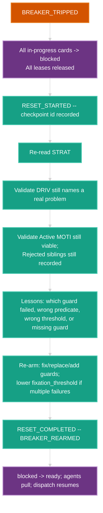

All steps emit events. Reset does not rewrite history; it appends `RESET_*` and `BREAKER_REARMED`.

### 4.8 API boundary

| Direction | Events |
|---|---|
| **Ingress** | `TRANSITION_COMMITTED` (every state entry triggers guard evaluation) |
| **Egress** | `GUARD_PASSED`, `GUARD_BLOCKED`, `GUARD_REDIRECTED`, `GUARD_ESCALATED`, `FIXATION_DETECTED`, `BREAKER_TRIPPED`, `BREAKER_REARMED`, `RESET_STARTED`, `RESET_COMPLETED` |
| **Dependencies** | Engine Core (§6) for transition events; Config for thresholds |

### 4.9 Interfaces

**IGuard:**

| Field | Type | Description |
|---|---|---|
| `id` | `string` | Guard identifier |
| `node_id` | `string` | Which node this guards |
| `predicate()` | `fn(state, event) -> bool` | Pure function: should this guard fire? |
| `action` | `enum` | `PASS`, `BLOCK`, `REDIRECT`, `ESCALATE` |
| `redirect_to` | `string?` | Target node if REDIRECT |
| `cooldown` | `duration` | Minimum time between firings |
| `consecutive_passes` | `int` | Resets on fire, increments on pass |
| `fixation_threshold` | `int` | Hard ceiling: force fire when exceeded |

**IBreaker:**

| Field | Type | Description |
|---|---|---|
| `id` | `string` | Breaker identifier |
| `monitors` | `list[metric_id]` | Metrics to watch |
| `threshold` | `numeric` | Trip point |
| `window` | `duration` | Evaluation window |
| `trip()` | `fn(state) -> RESET_event` | Force transition to RESET |
| `rearm()` | `fn(lessons_learned) -> guard_updates` | Restore guards with fixes |
| `tripped` | `bool` | Current breaker state |

### 4.10 Data: Guard and Breaker schemas (colocated)

**GuardDaemon SQLite file:** `guard.sqlite`

```sql
CREATE TABLE guard_state (
  guard_id TEXT PRIMARY KEY,
  node_id TEXT NOT NULL,
  consecutive_passes INTEGER NOT NULL,
  last_fired_seq INTEGER
);
```

**BreakerDaemon SQLite file:** `breaker.sqlite`

```sql
CREATE TABLE breaker_state (
  breaker_id TEXT PRIMARY KEY,
  tripped INTEGER NOT NULL,
  window_start INTEGER,
  metrics_snapshot_json TEXT
);
```

### 4.11 Guard and breaker machine.json fragments (colocated)

Guard states: evaluation states per guard (loaded from Config, not a separate machine file).

Breaker states: `ARMED` -> `TRIPPED` -> `RESET` -> `REARMED` -> `ARMED`.

---

## SUBSYSTEM 5: Kanban & Work Lifecycle -- Orchestration

### 5.0 Identity

The Kanban Engine manages work orchestration: one board, columns, WIP limits, exclusive leases, merge points, dependency DAG, and agent assignment. It is a **parallel, async, event-driven** subsystem that talks to TDD (§2) and RGB (§3) via events, not by reaching into their internals.

### 5.1 One workstream kanban

Columns: `backlog`, `ready`, `in-progress`, `blocked`, `review`, `done`. Merge-point columns: `queue`, `active-merge`, `verification`, `integrated`. Feature A and Feature B are **partitions** of the same column set, keyed by `owned_subtree`.

### 5.2 Kanban machine.json fragment (colocated)

```json
{
  "backlog": {
    "id": "backlog",
    "description": "Not pullable. No owner.",
    "type": "atomic",
    "on": {
      "WORK_CREATED": { "target": "backlog" },
      "WORK_DECOMPOSED": { "target": "backlog" },
      "WORK_UNBLOCKED": { "target": "ready" }
    }
  },
  "ready": {
    "id": "ready",
    "description": "Pullable. No owner.",
    "type": "atomic",
    "on": {
      "WORK_CLAIMED": { "target": "in-progress" },
      "WORK_STARTED": { "target": "in-progress" },
      "WORK_BLOCKED": { "target": "blocked" },
      "WORK_CONFLICTED": { "target": "blocked" }
    }
  },
  "blocked": {
    "id": "blocked",
    "description": "CONFLICT projects here. Not a second board.",
    "type": "atomic",
    "on": {
      "WORK_UNBLOCKED": { "target": "ready" },
      "WORK_BLOCKED": { "target": "blocked" },
      "BREAKER_TRIPPED": { "target": "blocked" }
    }
  },
  "review": {
    "id": "review",
    "description": "Awaiting fan-in. review to done only via MERGE_ACCEPTED.",
    "type": "atomic",
    "on": {
      "MERGE_READY": { "target": "queue" },
      "MERGE_BLOCKED": { "target": "blocked" },
      "MERGE_REJECTED": { "target": "blocked" },
      "WORK_CONFLICTED": { "target": "blocked" },
      "INTEGRATION_FLAW": { "target": "in-progress" },
      "CODE_REGRESSION": { "target": "in-progress" }
    }
  },
  "done": {
    "id": "done",
    "description": "Only path from review is MERGE_ACCEPTED.",
    "type": "final"
  }
}
```

### 5.3 Merge lifecycle machine.json fragment (colocated)

```json
{
  "queue": {
    "id": "queue",
    "description": "Merge-point column. Same board.",
    "type": "atomic",
    "on": {
      "MERGE_READY": { "target": "active-merge" },
      "MERGE_BLOCKED": { "target": "blocked" }
    }
  },
  "active-merge": {
    "id": "active-merge",
    "description": "Fan-in evaluation. WIP typically 1.",
    "type": "atomic",
    "on": {
      "MERGE_ACCEPTED": { "target": "verification" },
      "WORK_MERGED": { "target": "verification", "description": "Alias of MERGE_ACCEPTED." },
      "MERGE_REJECTED": { "target": "blocked" },
      "MERGE_BLOCKED": { "target": "blocked" }
    }
  },
  "verification": {
    "id": "verification",
    "description": "Sync invariant SPEC == test == impl == process/template.",
    "type": "atomic",
    "on": {
      "MERGE_ACCEPTED": { "target": "integrated" },
      "MERGE_REJECTED": { "target": "blocked" },
      "SYNC_VIOLATION": { "target": "blocked" }
    }
  },
  "integrated": {
    "id": "integrated",
    "description": "Fan-in accepted. Maps to done for N=1 degenerate.",
    "type": "final"
  }
}
```

### 5.4 Work-item lifecycle (flowchart)

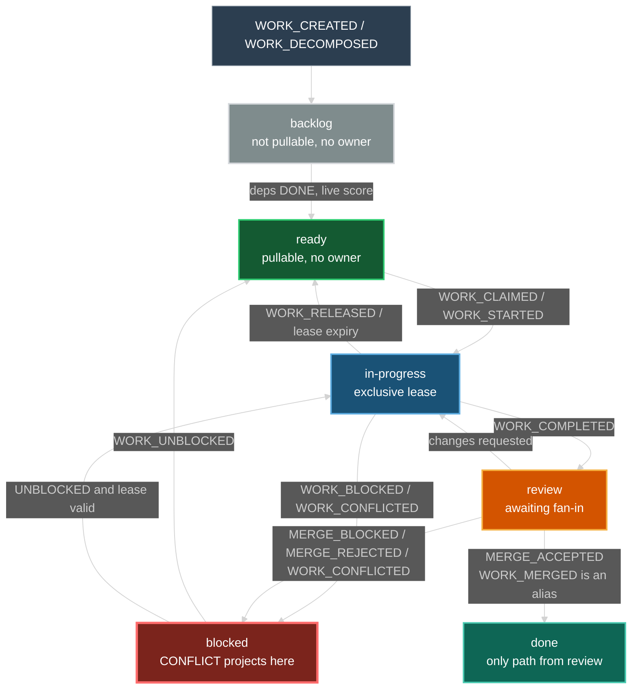

### 5.5 Exclusive ownership

Local-copy optimistic merge is **forbidden**. The hub never content-merges files.

| Rule | Meaning |
|---|---|
| Exclusive card | One agent owns one card. Null owner only in `backlog` or `ready`. |
| Exclusive subtree | One agent owns one FEAT or ARCH subtree. |
| No overlapping files | Two agents MUST NOT write the same file. Isolation is the lease, not merge-of-edits. |
| Claim | `IAgent.claim` takes a TTL lease. Second claim -> `TRANSITION_REJECTED`. |
| Steal | Only from `ready` with no owner. Never from `in-progress`. |
| Lease expiry | Card returns to `ready` (if no block reason) or `blocked`. |
| Hub writes | Event order, card `mv`, `parent:` reconcile, merge-point evaluation. Nothing else. |
| Spawn budget | `spawn_budget(depth) = floor(8 / 2^depth)`. Depth 4 is hard stop. |

### 5.6 Merge points

A merge point is an explicit fan-in barrier: N child workstreams must reach a declared state before the parent may leave `review` for `done`.

N=1 is degenerate: `MERGE_READY` then `MERGE_ACCEPTED`. That is what 0.0.1 called `WORK_MERGED`.

**Sync invariant (MUST hold for `MERGE_ACCEPTED`):**

```
SPEC document  ==  test file / assertions  ==  implementation  ==  process and templates
```

Mismatch in any pair is `SYNC_VIOLATION` and `MERGE_REJECTED`.

### 5.7 Concurrency model

| Property | Mechanism |
|---|---|
| Event ordering | Partition by `work_item_id`; parent merge partition correlating `parent_id` |
| Conflict | Exclusive lease. No local-copy hub merge. Collision -> `TRANSITION_REJECTED` or `WORK_CONFLICTED` |
| WIP limits | Per-agent and per-column, enforced at `claim()` |
| Dependency unblocking | DAG walk on `MERGE_ACCEPTED` |
| Work stealing | Idle agent claims from `ready` with no owner only |
| Deterministic replay | Append-only store, replay in partition order |
| Idempotent projection | Projectors key on `TRANSITION_COMMITTED` id |

### 5.8 Dynamic scheduling

Scheduler (a Dispatcher policy module) recomputes `priority_score` live on every affecting event. Never a full-fleet batch sort.

```
priority_score(card) =
    w_p0    * is_P0
  + w_dep   * dependents_blocked_count
  + w_age   * age_in_ready_ms
  + w_merge * merge_point_waiting_on_this
  + w_risk  * security_or_breaker_flag
  + w_zoom  * (1 / (1 + nesting_level))
  - w_wip   * (column_wip / column_wip_limit)
  - w_lease * already_has_owner
```

Weights live in Config. Changing weights is a config event, not a deploy.

### 5.9 Star topology roles

| Role | Responsibility | Constraint |
|---|---|---|
| Hub (orchestrator) | Decompose, route, aggregate, evaluate merge points, emit `RECONCILE_PARENT`, trigger harvest, walk DAG, live-score cards | Never executes work. Never content-merges files. |
| Agent | Claim from `ready`, execute inside owned subtree, emit completion/test events | Exclusive lease on one card and its `owned_subtree`. WIP limit. |
| iceoryx2 mesh | Same-host daemon pub-sub. Partitioned notify. At-least-once via EventStore seq. | No central iceoryx daemon. |
| zenoh mesh | Child-engine egress/ingress, liveliness, scout from initial locator | Peer mode + gossip. |
| A2A | Sidecar <-> orchestrator and agent <-> agent | MCP forbidden. |
| Kanban | One board. Partitions = `owned_subtree` keys. Directory `mv` is a projection. | One per instance. |

### 5.10 API boundary

| Direction | Events |
|---|---|
| **Ingress** | `WORK_*`, `MERGE_*`, `BREAKER_TRIPPED` (from §4), `TEST_*` (from §2 via Dispatcher) |
| **Egress** | Card state changes, `MERGE_ACCEPTED`, `WORK_COMPLETED`; unblock events |
| **Dependencies** | Engine Core (§6) for dispatch; TDD (§2) for test results; Guards (§4) for blocks |

### 5.11 Interfaces

**IWorkItem:**

| Field | Type | Description |
|---|---|---|
| `id` | `string` | Unique work item ID |
| `node_ref` | `string` | Bound INode |
| `state` | `enum` | `BACKLOG`, `READY`, `IN_PROGRESS`, `REVIEW`, `DONE`, `BLOCKED` |
| `column` | `enum` | `backlog`, `ready`, `in-progress`, `blocked`, `review`, `done` + merge-point columns |
| `assigned_to` | `string?` | Agent ID or null |
| `owned_subtree` | `string?` | Partition key and exclusive subtree root |
| `lease` | `ILease?` | TTL lease, not a forever lock |
| `dependencies` | `list[work_item_id]` | Must be DONE before READY |
| `priority_score` | `f64` | Live. Recomputed on every affecting event. |
| `merge_point` | `string?` | `IMergePoint.id` if fan-in child or parent |

**IAgent:**

| Field | Type | Description |
|---|---|---|
| `id` | `string` | Agent identifier |
| `type` | `enum` | `HUMAN`, `AI_SIDECAR`, `SCANNER`, `AUTOMATED` |
| `a2a_card_url` | `string?` | A2A agent-card URL. Required for `AI_SIDECAR`. |
| `capabilities` | `list[node_type]` | What node types this agent can work |
| `current_work` | `list[work_item_id]` | Active items |
| `wip_limit` | `int` | Max concurrent items |
| `depth` | `int` | Nesting depth for `spawn_budget` |
| `claim(item)` | `fn -> bool` | Take TTL exclusive lease |
| `release(item)` | `fn` | Release lease; card to `ready` or `blocked` |
| `complete(item, artifacts)` | `fn` | Emit `WORK_COMPLETED` |

**IKanban:**

| Field | Type | Description |
|---|---|---|
| `id` | `string` | Board identifier (one per engine instance) |
| `columns` | `ordered list` | `backlog`, `ready`, `in-progress`, `blocked`, `review`, `done` |
| `merge_columns` | `ordered list` | `queue`, `active-merge`, `verification`, `integrated` |
| `wip_limits` | `dict[column, int]` | Per-column WIP limits |
| `partitions` | `dict[owned_subtree, items]` | Same columns, keyed by subtree |
| `pull(agent)` | `fn -> IWorkItem?` | Highest `priority_score` `ready` with no owner matching capabilities |

**IMergePoint:**

| Field | Type | Description |
|---|---|---|
| `id` | `string` | Merge-point identifier |
| `parent_card` | `filename-id` | Parent FEAT or ARCH card |
| `child_cards` | `list[filename-id]` | Workstream cards that must arrive |
| `required_state` | `predicate` | Example: all child SPECs RED; or all GREEN plus sync invariant |
| `sync_invariant` | `fn -> bool` | `SPEC == test == impl == process/template` |
| `state` | `enum` | `OPEN`, `ARMED`, `READY`, `BLOCKED`, `ACCEPTED`, `REJECTED` |

**ILease:**

| Field | Type | Description |
|---|---|---|
| `id` | `string` | Lease identifier |
| `holder` | `agent_id` | Exclusive holder |
| `resource` | `card_id` and/or `owned_subtree` | What is leased |
| `ttl` | `duration` | Expiry. Never forever. |
| `renew(holder)` | `fn -> bool` | Holder heartbeat |
| `expire()` | `fn` | Card to `ready` or `blocked`; emit `WORK_RELEASED` or `WORK_BLOCKED` |

### 5.12 Data: Kanban schemas (colocated)

**KanbanProjector SQLite file:** `kanbanprojector.sqlite`

```sql
CREATE TABLE card (
  filename_id TEXT PRIMARY KEY,
  column TEXT NOT NULL,
  owned_subtree TEXT,
  owner_agent TEXT,
  parent_card TEXT,
  priority_score REAL NOT NULL DEFAULT 0,
  entered_column_ts INTEGER NOT NULL,
  last_applied_seq INTEGER NOT NULL
);

CREATE TABLE column_def (
  name TEXT PRIMARY KEY,
  wip_limit INTEGER NOT NULL
);

CREATE TABLE board_proxy (
  card_id TEXT PRIMARY KEY,
  child_instance_id TEXT NOT NULL,
  child_strat_id TEXT NOT NULL,
  child_locator TEXT NOT NULL
);
```

**LeaseDaemon SQLite file:** `leasedaemon.sqlite`

```sql
CREATE TABLE lease (
  resource_id TEXT PRIMARY KEY,
  agent_id TEXT NOT NULL,
  level TEXT NOT NULL,
  expires_seq INTEGER NOT NULL,
  heartbeat_seq INTEGER NOT NULL
);
```

**AgentPool SQLite file:** `agentpool.sqlite`

```sql
CREATE TABLE agent (
  agent_id TEXT PRIMARY KEY,
  parent_agent TEXT,
  nesting_level INTEGER NOT NULL,
  status TEXT NOT NULL,
  pid INTEGER,
  spawn_ts INTEGER,
  capabilities_json TEXT
);
```

**MergeCoordinator SQLite file:** `mergecoordinator.sqlite`

```sql
CREATE TABLE merge_point (
  parent_card TEXT PRIMARY KEY,
  required_state TEXT NOT NULL,
  state TEXT NOT NULL,
  n_expected INTEGER NOT NULL,
  n_arrived INTEGER NOT NULL
);

CREATE TABLE merge_child (
  parent_card TEXT NOT NULL,
  child_card TEXT NOT NULL,
  arrived_event_id TEXT,
  PRIMARY KEY (parent_card, child_card)
);
```

### 5.13 Agent hierarchy and rendezvous

Workers are processes with a parent pointer. Nesting: `IAgent.parent_agent` + `nesting_level` (0 = hub-spawned, 1..3 = sub / sub-sub / sub-sub-sub). Hard stop: `nesting_level >= 4` is `TRANSITION_REJECTED`.

| Level | Who spawns | May write | Rendezvous |
|---|---|---|---|
| Orchestrator | process supervisor | event order, card `mv`, merge eval, parent reconcile | n/a -- it IS the rendezvous host |
| L0 agent | AgentPool via A2A | exclusive FEAT or ARCH subtree | children must `MERGE_ACCEPTED` before L0 `WORK_COMPLETED` |
| L1 agent | L0 via `WORK_DECOMPOSED` | exclusive child card(s) inside that subtree | same merge-point grammar |
| L2 / L3 | L1 / L2 | one SPEC or one test file | TDD events; parent lease remains with ancestor |

A parent MUST NOT write files covered by a live child lease. That is `WORK_CONFLICTED`.

Nested **engine** instances (board-of-boards): parent holds a **proxy card** only. The child has its own engine, own iceoryx2, own EventStore, own A2AGateway. Egress is zenoh `MESH_EGRESS`. The parent MUST NOT `waitpid` the child's workers and MUST NOT open the child's SQLite.

**Rendezvous (event correlation, not thread-join):**

1. Parent card lists `child_cards` on `IMergePoint`.
2. Each child completion is published on the child's `work_item_id` partition **and copied** onto the `parent_id` partition (local) or wrapped as `MESH_INGRESS` (child engine).
3. MergeCoordinator CAS-updates arrival count. If count < N, stay OPEN or `MERGE_BLOCKED`. If count == N, `MERGE_READY` then sync invariant.
4. A2A task state changes are mapped to the same events. There is no `pthread_join`.
5. A missing child is discovered when `TIMER_TICK` + lease/watchdog says the child is dead, which emits `WORK_BLOCKED` on the child and `MERGE_BLOCKED` on the parent -- live, not at end of day.

### 5.14 Kanban apply protocol (binding, not 2PC)

EventStore **COMMIT** -> projector apply keyed by commit seq -> FS `mv` -> if `mv` is missing on replay, repair from seq. EventStore is source of truth. Projector + FS are rebuildable.

```
EventStore writer: BEGIN IMMEDIATE; INSERT event; COMMIT; notify(seq)
KanbanProjector:   read seq; upsert card row; rename/mv file; if mv missing on replay, redo mv from row
```

### 5.15 Preemption

If a P0 security card is `ready` and an L0 agent holds only P3 work, Watchdog MAY request `WORK_RELEASED` on the P3 (cooperative) after `preempt_grace_ms`. Forcible preemption is Config-gated and emits `WORK_RELEASED` reason=preempt.

### 5.16 Cards, columns, TDD mapping

| Kanban column | `IWorkItem.state` | Node state | Typical TDD | Notes |
|---|---|---|---|---|
| `backlog` | `BACKLOG` | `IDLE` | `NOT_STARTED` | Not pullable. No owner. |
| `ready` | `READY` | `IDLE` | `NOT_STARTED` or `RED` | Pullable. No unmet deps. |
| `in-progress` | `IN_PROGRESS` | `ACTIVE` or `DEGRADED` | `RED`, `GREEN`, or `REFACTOR` | Exclusive owner required. |
| `blocked` | `BLOCKED` | `BLOCKED` or `RESET` | Frozen (any TDD) | Guard, unmet dep, merge, breaker. |
| `review` | `REVIEW` | `ACTIVE` or `DEGRADED` | `GREEN` | Awaiting merge-point. |
| `done` | `DONE` | `DONE` | `GREEN` after any required `REFACTOR` | Only via `MERGE_ACCEPTED`. |

Illegal: card to `review` or `done` on TDD GREEN unless `first-failure` was recorded.

---

## SUBSYSTEM 6: Engine Core -- Runtime

### 6.0 Identity

The Engine Core is the deterministic runtime: event-sourced state machine, EventStore, Dispatcher, dispatch loop, and transition evaluator. It is the foundation that all other subsystems emit events through and receive transitions from.

### 6.1 Deterministic engine

The engine runtime is an event-sourced state machine with a pure transition evaluator. Node types, event kinds, guards, and breakers are loaded from SchemaRegistry and Config. The evaluator has **no compiled-in node list** and **no compiled-in transition table**.

The **one** catalog is a **Stately `machine.json` document**. Seed file (normative): `20260818-033649-124680-7266-a219-84d3929f1e0a-catalog.machine.json`. Mermaid diagrams and markdown tables in this spec are **human-only, non-normative views**.

### 6.2 Orchestrator machine.json (composing subsystem fragments)

The full `machine.json` composes the fragments defined in subsystems 2 and 5:

```json
{
  "key": "sdlcEngine",
  "version": "0.0.5.1",
  "id": "sdlcEngine",
  "type": "compound",
  "initial": "backlog",
  "context": {
    "tdd_first_failure": null,
    "tdd_iterations": 0
  },
  "guards": {
    "tdd_green_requires_first_failure": {
      "when": "{{ context.tdd_first_failure != null }}"
    }
  },
  "states": {
    "backlog": "§5.2 kanban fragment",
    "ready": "§5.2 kanban fragment",
    "in-progress": {
      "id": "in-progress",
      "type": "compound",
      "initial": "tdd_not_started",
      "on": {
        "WORK_BLOCKED": { "target": "blocked" },
        "WORK_CONFLICTED": { "target": "blocked" },
        "WORK_RELEASED": { "target": "ready" },
        "WORK_COMPLETED": { "target": "review" },
        "INTEGRATION_FLAW": { "target": "in-progress", "reenter": true },
        "UNFEASIBLE_SCOPE": { "target": "blocked" },
        "BROKEN_REQUIREMENT": { "target": "blocked" },
        "PARADIGM_SHIFT": { "target": "blocked" },
        "SPEC_WRONG": { "target": "in-progress", "reenter": true },
        "FEAT_WRONG": { "target": "blocked" }
      },
      "states": "§2.4 TDD fragment"
    },
    "blocked": "§5.2 kanban fragment",
    "review": "§5.2 kanban fragment",
    "queue": "§5.3 merge fragment",
    "active-merge": "§5.3 merge fragment",
    "verification": "§5.3 merge fragment",
    "integrated": "§5.3 merge fragment",
    "done": "§5.2 kanban fragment"
  }
}
```

> The references above (§5.2, §2.4, etc.) resolve to the literal JSON fragments in those sections. The sibling `catalog.machine.json` file contains the fully expanded, normative version. If this table disagrees with the JSON file, the JSON file wins.

### 6.3 Dispatch loop

```
loop forever:   # always live -- WaitSet on iceoryx2 + zenoh + TIMER_TICK
    event = event_store.dequeue_next()
    event.kind = SchemaRegistry.canonicalize(event.kind)
    current_state = state_machine.current_for(event.partition_key)

    if event.kind not in SchemaRegistry:
        emit(UNHANDLED_EVENT, event)
        continue

    transition = ResolvedChart.effective(current_state, event.kind)
    if transition is None:
        emit(UNHANDLED_EVENT, event)
        continue

    if TddGate.illegal(current_state, event):
        emit(TRANSITION_REJECTED, reason="TDD_GATE", event)
        continue

    if not transition.guard(current_state, event):
        emit(TRANSITION_REJECTED, transition, event)
        continue

    for guard in GuardDaemon.guards_for(transition, current_state):
        result = guard.predicate(current_state, event)
        if result == BLOCK:
            emit(GUARD_BLOCKED, guard, transition, event)
            goto loop
        elif result == REDIRECT:
            event = redirect_event(guard.redirect_to, event)
            goto loop
        elif result == ESCALATE:
            emit(GUARD_ESCALATED, guard, transition, event)
            goto loop

    next_state = chart.apply(current_state, transition, event)
    accepted = Dispatcher.submit_to_eventstore(TRANSITION_COMMITTED, ...)
    state_machine.update(next_state)
    KanbanProjector.apply(seq)
    Scheduler.recompute(affected_cards(event))
    maybe_egress(event)

    for breaker in BreakerRegistry.active():
        if breaker.check(next_state):
            breaker.trip()
            emit(BREAKER_TRIPPED, breaker, next_state)
```

### 6.4 Determinism guarantees

| Property | Guarantee | Mechanism |
|---|---|---|
| Same input, same output | Given event log L, state is always S | Event sourcing + pure evaluator |
| Total ordering per item | Events for work item X always ordered | Partition key = `work_item_id` |
| Replayable | Any past state reconstructable | Append-only EventStore + snapshots |
| Auditable | Every decision traceable | Event log is the audit log |
| No hidden state | All state in EventStore | No globals, no side channels |
| Guard convergence | Fixation detection guaranteed | `consecutive_passes` with hard ceiling |
| TDD honesty | No GREEN without recorded RED | `machine.json` missing edge + TddGate |

### 6.5 EventStore ACID, actor, and thread model (binding)

- **One OS thread owns one `Connection`.** That thread is the EventStore actor.
- Async daemons talk to it through `tokio-rusqlite` `Connection::call(|conn| { ... })`.
- Inside `call`, code uses `rusqlite` APIs on **that** `conn`. `rusqlite` 0.40.2 is never used on a tokio worker thread.
- Optional extra READ-ONLY connections MAY live on extra threads for WAL readers.

Each **accepted** event is one transaction:

```
conn.call(|conn| {
    let tx = conn.transaction_with_behavior(TransactionBehavior::Immediate)?;
    tx.execute("INSERT INTO event (...)", params)?;
    tx.commit()?;          // durability here
    Ok(seq)
}).await?;
iceoryx2.notify(seq);      // AFTER commit. Never notify then commit.
```

**Kanban apply protocol** is in §5.14.

**Forbidden:**

| Forbidden | Why |
|---|---|
| `rusqlite` on tokio worker threads | SQLITE_MISUSE / lock inversion |
| `spawn_blocking` per statement | Hidden thread-per-query |
| Connection pool on the write path | Multiple writers on one file |
| `BEGIN` hopping threads | Transaction bound to connection/thread |
| `sqlx` 0.9.0 | Different runtime/pool model |
| Competing consumers on one `eventstore.sqlite` | Two writers. FORBIDDEN |

### 6.6 Envelope JSON Schema (colocated)

```json
{
  "$id": "https://hanaden.ai/sdlc/event/envelope/v1",
  "$schema": "https://json-schema.org/draft/2020-12/schema",
  "type": "object",
  "required": ["event_id", "kind", "schema_ver", "idempotency_key", "ts_store"],
  "properties": {
    "event_id": { "type": "string", "minLength": 1 },
    "kind": { "type": "string", "minLength": 1 },
    "schema_ver": { "type": "integer", "minimum": 1 },
    "idempotency_key": { "type": "string", "minLength": 1 },
    "work_item_id": { "type": ["string", "null"] },
    "parent_id": { "type": ["string", "null"] },
    "actor_id": { "type": ["string", "null"] },
    "secret_ids": { "type": "array", "items": { "type": "string" }, "description": "opaque secret ids; no vault in seed" },
    "payload": { "type": "object" },
    "ts_store": { "type": "integer" }
  },
  "additionalProperties": false
}
```

Secrets: payloads MAY carry **opaque secret ids**. There is **no vault in seed**.

### 6.7 API boundary

| Direction | Events |
|---|---|
| **Ingress** | ALL event kinds as envelopes from every subsystem |
| **Egress** | `TRANSITION_COMMITTED`, `TRANSITION_REJECTED`, `UNHANDLED_EVENT` |

### 6.8 Interfaces

**ITransition:**

| Field | Type | Description |
|---|---|---|
| `from_state` | `(node_id, state)` | Source node + state |
| `to_state` | `(node_id, state)` | Target node + state |
| `event` | `string` | Triggering event kind (canonical) |
| `predicate()` | `fn(state, event) -> bool` | Must return true to fire |
| `action()` | `fn(state, event) -> state_prime` | Pure function: compute next state |
| `guards` | `list[IGuard]` | All must PASS before commit |

**ISchemaRegistry:**

| Field | Type | Description |
|---|---|---|
| `kinds` | `dict[kind, schema]` | Event kind -> payload schema `$id` + version |
| `aliases` | `dict[alias, kind]` | `WORK_MERGED` -> `MERGE_ACCEPTED`; `CORP-STRAT` -> `STRAT` |
| `chart_path` | `path` | Seed: `20260818-...-catalog.machine.json` |
| `chart_hash` | `sha256` | Hash of the file bytes. Reload when hash changes. |
| `canonicalize(kind)` | `fn -> kind` | Alias fold |
| `register(kind, schema)` | `fn` | Dynamic add |
| `evolve(kind, new_schema)` | `fn` | Versioned evolution |
| `reload_chart(path)` | `fn` | Validate with `jsonschema`; store new hash |
| `validate_payload(kind, json)` | `fn` | Validate event payload |

### 6.9 Data: EventStore and Dispatcher schemas (colocated)

**EventStore SQLite file:** `eventstore.sqlite`

```sql
CREATE TABLE event (
  tenant_id TEXT NOT NULL,
  seq INTEGER NOT NULL,
  partition_key TEXT NOT NULL,
  event_id TEXT PRIMARY KEY,
  kind TEXT NOT NULL,
  schema_ver INTEGER NOT NULL,
  idempotency_key TEXT NOT NULL UNIQUE,
  work_item_id TEXT,
  parent_id TEXT,
  actor_id TEXT,
  payload_ref TEXT,
  ts_store INTEGER NOT NULL,
  UNIQUE (tenant_id, seq)
);

CREATE TABLE snapshot (
  tenant_id TEXT NOT NULL,
  partition_key TEXT NOT NULL,
  seq INTEGER NOT NULL,
  blob_ref TEXT NOT NULL,
  PRIMARY KEY (tenant_id, partition_key, seq)
);
```

**Dispatcher SQLite file:** `dispatcher.sqlite`

```sql
CREATE TABLE node (
  filename_id TEXT PRIMARY KEY,
  type TEXT NOT NULL,
  parent TEXT,
  state TEXT NOT NULL,
  tdd_state TEXT NOT NULL,
  first_failure TEXT,
  iterations INTEGER NOT NULL DEFAULT 0
);

CREATE TABLE chart_hash (
  sha256 TEXT PRIMARY KEY,
  loaded_seq INTEGER NOT NULL
);

CREATE TABLE committed (
  event_id TEXT PRIMARY KEY,
  node_id TEXT NOT NULL,
  from_state TEXT NOT NULL,
  to_state TEXT NOT NULL
);

CREATE TABLE gate_reject (
  event_id TEXT PRIMARY KEY,
  reason TEXT NOT NULL,
  from_tdd TEXT,
  attempted_kind TEXT NOT NULL,
  ts_store INTEGER NOT NULL
);
```

**SchemaRegistry SQLite file:** `schemaregistry.sqlite`

```sql
CREATE TABLE schema_kind (
  kind TEXT PRIMARY KEY,
  schema_id TEXT NOT NULL,
  schema_ver INTEGER NOT NULL,
  payload_schema_json TEXT NOT NULL
);

CREATE TABLE schema_alias (
  alias TEXT PRIMARY KEY,
  kind TEXT NOT NULL
);

CREATE TABLE chart_file (
  chart_path TEXT PRIMARY KEY,
  chart_hash TEXT NOT NULL,
  loaded_seq INTEGER NOT NULL
);
```

---

## SUBSYSTEM 7: Mesh & Daemons -- Infrastructure

### 7.0 Identity

The Mesh & Daemons subsystem defines the physical infrastructure: how daemons communicate (iceoryx2 + zenoh), how they discover each other, and what daemons exist. Language: **Rust 2024** for every daemon.

### 7.1 Named IPC choice (binding)

A "generic event bus" is wrong. The mesh has two planes plus an optional local bridge.

**Same-host daemon plane -- iceoryx2.** Decentralized zero-copy shared-memory pub-sub. Daemons open services by name (`sdlc.{instance}.{daemon}.{kind}`). EventStore is source of truth: iceoryx2 carries **notifications** (seq, partition, kind).

**Nested-engine plane -- zenoh.** Each engine instance is a zenoh **peer**. Bootstrap is **one initial locator**. Gossip scout finds the rest. Liveliness tokens are join/leave. This is the board-of-boards routing plane.

**MQTT is out of seed.** Locator scheme `mqtt:` is **reserved**.

**iceoryx2 service names (seed):** `sdlc.{instance}.eventstore.notify`, `sdlc.{instance}.dispatcher.envelope`, `sdlc.{instance}.kanban.apply`, `sdlc.{instance}.watchdog.probe`, `sdlc.{instance}.a2a.task`, `sdlc.{instance}.timer.tick`.

**zenoh keyexpr (seed):** `sdlc/{instance}/alive/engine/{id}`, `sdlc/{parent}/egress/{child}/{kind}`, `sdlc/{instance}/a2a/cards/{id}`.

**EGRESS_SET** = `MERGE_ACCEPTED`, `LEARNING`, `SDLC_SPAWNED`, `PROBLEM_SIGNAL`, `BREAKER_TRIPPED`, `MEMORY_CONTRADICTION`, `MESH_LEAVE`.

### 7.2 Dynamic discovery from one initial locator

No consul. No etcd. No eureka. No compiled mesh map. A node starts with **exactly one** `INITIAL_LOCATOR` (env or Config).

**Locator string format (ASCII, binding):**

```
<scheme>:<rest>

schemes:
  zenoh:<protocol>/<addr>[:<port>]
  iceoryx2:service/<ServiceName>
  a2a:<url>
  openai-compat:<url>
  mqtt:tcp://127.0.0.1:<port>     # RESERVED -- not in seed
```

**Join / leave (live):**

| Entity | Join | Leave |
|---|---|---|
| Daemon (same host) | Create iceoryx2 service; tracker emits appear; `MESH_JOIN` | Process exit drops service; `MESH_LEAVE`; leases expire |
| Engine instance | zenoh peer `connect`; liveliness token | Token drop; `MESH_LEAVE` |
| A2A sidecar | Serve agent card; zenoh liveliness; `AGENT_CARD_PUBLISHED` | Token drop; `AGENT_CARD_REVOKED` |
| Inference (sidecar-local) | Sidecar-internal locator. Not a core daemon. Engine never emits `INFERENCE_*`. | Sidecar-internal. |

### 7.3 Interface: IMesh

| Field | Type | Description |
|---|---|---|
| `publish_local(seq)` | `fn` | iceoryx2 notify after EventStore commit |
| `publish_egress(event)` | `fn` | zenoh put for egress-class kinds |
| `subscribe_local(service, handler)` | `fn` | iceoryx2 subscriber on a service name |
| `subscribe_egress(keyexpr, handler)` | `fn` | zenoh keyexpr subscription |
| `cursor` | `EventStore seq` | At-least-once cursor. Replay from EventStore. |
| `delivery` | `enum` | `AT_LEAST_ONCE` |
| `replay(from_seq)` | `fn -> event_stream` | Replay from EventStore |

Poison / undeliverable envelopes go to the **DeadLetter** daemon sqlite, not a bus list.

### 7.4 Daemon inventory (consolidated)

**Append rule (binding):** EventStore append has **one** owner API. Everyone submits envelopes through Dispatcher. No other daemon writes `eventstore.sqlite`.

| Daemon | Responsibility | Consumes | Produces | Failure mode | SQLite file |
|---|---|---|---|---|---|
| **EventStore** | SQLite WAL append-only; one writer OS thread; snapshots | Dispatcher appends | ordered streams + iceoryx2 notify | Refuse ack if fsync fails | `eventstore.sqlite` |
| **Dispatcher** | Generic `machine.json` walker + TddGate + Scheduler | all envelopes | `TRANSITION_COMMITTED/REJECTED`, `UNHANDLED_EVENT` | Replay from last seq | `dispatcher.sqlite` |
| **DiscoveryDaemon** | Scout from `INITIAL_LOCATOR`; liveliness | liveliness, service appear | `MESH_JOIN`, `MESH_LEAVE` | Fail-open to last-known | `discovery.sqlite` |
| **A2AGateway** | Port P2/P3. Map allow-list A2A payloads to envelopes | A2A on P2 allow-list | `LEARNING`, `MEMORY_CONTRADICTION`, `AGENT_CARD_*` | Unauthenticated drop | `a2agateway.sqlite` |
| **GuardDaemon** | Evaluate IGuard on state entry | `TRANSITION_COMMITTED` | `GUARD_*`, `FIXATION_DETECTED` | Fail-closed | `guard.sqlite` |
| **BreakerDaemon** | Death-spiral detection | metrics, `TIMER_TICK` | `BREAKER_TRIPPED`, `RESET_STARTED` | Fail-open for eval errors | `breaker.sqlite` |
| **KanbanProjector** | EventStore seq -> filesystem `mv` | commit seq | (projection; lag metrics) | Idempotent repair-on-replay | `kanbanprojector.sqlite` |
| **AgentPool** | Spawn/retire; exclusive lease; `spawn_budget` | `WORK_CREATED`, `AGENT_CARD_*` | `WORK_CLAIMED` | Circuit-break on budget=0 | `agentpool.sqlite` |
| **MergeCoordinator** | Fan-in barrier; sync invariant | child `WORK_COMPLETED` | `MERGE_*` | CAS on EventStore writer | `mergecoordinator.sqlite` |
| **ParentReconciler** | `TBD-RECONCILE` -> real `filename-id` | `MERGE_READY` | `RECONCILE_PARENT` | Retry handles backoff | `parentreconciler.sqlite` |
| **TestRunner** | Execute tests; never claims GREEN without RED | `WORK_STARTED`, `notify` | `TEST_PASS`, `TEST_FAIL`, `CODE_REGRESSION` | Infra fail: `WORK_BLOCKED` | `testrunner.sqlite` |
| **IngressGateway** | Port P1. External HTTP/git/webhook. **No MQTT in seed.** | adapters | P1 kinds as envelopes | Rate-limit; unauthenticated drop | `ingressgateway.sqlite` |
| **LearningIngest** | Validate + project `LEARNING` | `LEARNING`, `MEMORY_CONTRADICTION` | projection rows; MAY emit `PROCESS_DEFECT` | Drop invalid schema | `learningingest.sqlite` |
| **HarvestDaemon** | Lib extract / SOA / child spawn -- same loop, live | `TRANSITION_COMMITTED` | `HARVEST_DETECTED`, `LIB_EXTRACTED`, `SERVICE_PROMOTED`, `SDLC_SPAWNED` | Candidates only | `harvestdaemon.sqlite` |
| **Watchdog** | Port P4. Process liveness; SIGKILL; path notify | heartbeats, `procfs`, `TIMER_TICK` | `WATCHDOG_*`, `FORK_ORPHAN`, `WORK_BLOCKED` | OS probes only | `watchdog.sqlite` |
| **LeaseDaemon** | TTL leases | claim/renew/expire | `WORK_RELEASED`/`WORK_BLOCKED` on expiry | Store monotonic seq + expiry | `leasedaemon.sqlite` |
| **DeadLetter** | Poison messages. Own daemon, own sqlite | `UNHANDLED_EVENT` | (held); alert | Bounded queue | `deadletter.sqlite` |
| **Retry** | At-least-once retries. Own daemon, own sqlite | failed handler envelopes | republish to Dispatcher | Give up -> DeadLetter | `retry.sqlite` |
| **MetricsDaemon** | RED/USE, traces, logs | all daemons | `metrics_outbox` export | Telemetry loss MUST NOT block dispatch | `metrics.sqlite` |
| **SchemaRegistry** | Event kinds + `machine.json` file+hash | register/evolve/reload | used by Dispatcher | Unknown kind -> `UNHANDLED_EVENT` | `schemaregistry.sqlite` |
| **Config** | Thresholds, WIP, `INITIAL_LOCATOR` via figment+serde | watch | `config_rev` | Bad config: keep last-good | `config.sqlite` |
| **TimerDaemon** | Clock as events. **Sole** `TIMER_TICK` producer | OS timer | `TIMER_TICK` envelopes | Never mutates cards | `timer.sqlite` |

**Sidecar process (optional -- not an engine daemon):**

| Process | Responsibility | Talks to engine via | MUST NOT |
|---|---|---|---|
| **AI sidecar** (one binary) | `rig-core` + inference **locators** | P2/P3, P4 heartbeats | Append EventStore; `mv` cards; MCP; emit `TEST_*`/`WORK_COMPLETED` on P2 |

### 7.5 Shared crate manifest

> **Convention reminder:** All versions are crates.io max_stable as of 2026-08-31; exact revisions pinned at `Cargo.lock` generation.

| Crate | Why |
|---|---|
| `tokio` 1.53.1 | Async runtime for every daemon |
| `tracing` 0.1.44 + `tracing-subscriber` 0.3.23 | Structured logs |
| `serde` 1.0.229 + `serde_json` 1.0.151 | Payload (de)serialization |
| `thiserror` 2.0.20 | Typed errors |
| `anyhow` 1.0.104 | Context errors at process edges |
| `bytes` 1.12.1 | Buffer type |
| `parking_lot` 0.12.5 | In-process locks |
| `uuid` 1.26.0 | Event and card ids |
| `iceoryx2` 0.9.3 | Same-host notify |
| `zenoh` 1.10.0 | Child-engine mesh |
| `tokio-rusqlite` 0.7.0 features `bundled` | **The** SQLite actor |

Every daemon uses these shared crates. Per-daemon **delta** crates:

| Daemon | Additional crates |
|---|---|
| Dispatcher | `jsonschema` 0.52.1 |
| DiscoveryDaemon | (shared only) |
| A2AGateway | `a2a-rs-client` 1.0.26, `a2a-rs-server` 1.0.26, `axum` 0.8.9 |
| AgentPool | `nix` 0.31.3 (kill, waitpid). **No A2A crates.** |
| IngressGateway | `axum` 0.8.9, `reqwest` 0.13.4 |
| KanbanProjector | `notify` 8.2.0 |
| Watchdog | `nix` 0.31.3, `notify` 8.2.0, `procfs` 0.18.0 |
| Config | `figment` 0.10.19 |
| MetricsDaemon | `metrics` 0.24.6, optional `metrics-exporter-prometheus` 0.18.3, optional `opentelemetry` 0.32.0 |
| AI sidecar | `rig-core`, `a2a-rs-server` 1.0.26, `reqwest` 0.13.4. **No** rustmem, **no** mentedb in seed. |

**Forbidden globally in core:** `sqlx`, `rusqlite` on tokio worker threads, `spawn_blocking` per statement, connection pool on write path, `config` crate, `scxml` crate, XState, `rumqttc` in seed, MCP/`rmcp`, `rig-core`, mentedb, rustmem.

### 7.6 SQLite PRAGMA convention (stated once)

**Every** localized sqlite file (EventStore and every projection file) MUST apply this on open, on the owning writer thread, before any DML:

```sql
PRAGMA journal_mode = WAL;
PRAGMA synchronous = FULL;
PRAGMA busy_timeout = 5000;
PRAGMA foreign_keys = ON;
PRAGMA temp_store = MEMORY;
```

Optional extra READ-ONLY connections MAY exist for WAL readers (`PRAGMA query_only = ON`).

Paths: `var/engine/{instance_id}/eventstore.sqlite` and `var/engine/{instance_id}/{daemon}.sqlite`.

### 7.7 Remaining daemon schemas (colocated)

Schemas for EventStore, Dispatcher, KanbanProjector, LeaseDaemon, AgentPool, MergeCoordinator, TestRunner, GuardDaemon, BreakerDaemon, and SchemaRegistry are in §6.9, §5.12, §4.10, and §2.7 respectively. Below are the remaining daemons:

**DiscoveryDaemon:** `discovery.sqlite` — **No `inference` table.** Engine MUST NOT probe models.

```sql
CREATE TABLE locator_seen (
  locator TEXT PRIMARY KEY,
  scheme TEXT NOT NULL,
  first_seq INTEGER NOT NULL,
  last_liveliness INTEGER NOT NULL
);
```

**A2AGateway:** `a2agateway.sqlite`

```sql
CREATE TABLE a2a_card (
  agent_id TEXT PRIMARY KEY,
  card_url TEXT NOT NULL,
  published_seq INTEGER NOT NULL,
  revoked_seq INTEGER
);
```

**Watchdog:** `watchdog.sqlite`

```sql
CREATE TABLE heartbeat (
  agent_id TEXT PRIMARY KEY,
  last_seq INTEGER NOT NULL,
  last_event_id TEXT,
  last_fd_tick INTEGER NOT NULL
);

CREATE TABLE stall (
  agent_id TEXT NOT NULL,
  stall_count INTEGER NOT NULL,
  last_progress_seq INTEGER NOT NULL
);

CREATE TABLE write_set (
  event_id TEXT NOT NULL,
  path TEXT NOT NULL
);

CREATE TABLE storm (
  agent_id TEXT NOT NULL,
  token_rate REAL NOT NULL,
  loop_count INTEGER NOT NULL,
  window_start INTEGER NOT NULL
);
```

**HarvestDaemon:** `harvestdaemon.sqlite`

```sql
CREATE TABLE harvest_candidate (
  component_id TEXT PRIMARY KEY,
  metric TEXT NOT NULL,
  value REAL NOT NULL,
  last_event TEXT
);
```

**LearningIngest:** `learningingest.sqlite`

```sql
CREATE TABLE learning (
  event_id TEXT PRIMARY KEY,
  class TEXT NOT NULL,
  action TEXT NOT NULL,
  target_filename_id TEXT,
  source_agent TEXT,
  subject_ref TEXT,
  evidence_ref TEXT
);
```

**IngressGateway:** `ingressgateway.sqlite`

```sql
CREATE TABLE ingress_dedup (
  idempotency_key TEXT PRIMARY KEY,
  event_id TEXT NOT NULL
);
```

**ParentReconciler:** `parentreconciler.sqlite`

```sql
CREATE TABLE reconcile_job (
  child_id TEXT PRIMARY KEY,
  old_parent TEXT NOT NULL,
  new_parent TEXT,
  merge_point_id TEXT,
  status TEXT NOT NULL
);
```

**DeadLetter:** `deadletter.sqlite`

```sql
CREATE TABLE dead_letter (
  event_id TEXT PRIMARY KEY,
  seq INTEGER,
  kind TEXT,
  reason TEXT NOT NULL,
  payload_ref TEXT,
  ts_store INTEGER NOT NULL
);
```

**Retry:** `retry.sqlite`

```sql
CREATE TABLE retry_item (
  event_id TEXT PRIMARY KEY,
  attempt INTEGER NOT NULL,
  next_due_ms INTEGER NOT NULL,
  last_error TEXT,
  subscription TEXT NOT NULL
);
```

**MetricsDaemon:** `metrics.sqlite`

```sql
CREATE TABLE metrics_outbox (
  metric_id TEXT NOT NULL,
  ts_store INTEGER NOT NULL,
  value REAL NOT NULL,
  labels_json TEXT,
  PRIMARY KEY (metric_id, ts_store)
);
```

**Config:** `config.sqlite`

```sql
CREATE TABLE config_rev (
  rev INTEGER PRIMARY KEY,
  loaded_seq INTEGER NOT NULL,
  hash TEXT NOT NULL,
  source_path TEXT NOT NULL
);
```

**TimerDaemon:** `timer.sqlite`

```sql
CREATE TABLE timer (
  timer_id TEXT PRIMARY KEY,
  due_seq INTEGER,
  interval_ms INTEGER,
  last_tick_event_id TEXT,
  armed INTEGER NOT NULL
);
```

### 7.8 ILearningProjection (engine-side LEARNING table, not a model)

| Field | Type | Description |
|---|---|---|
| `apply(LEARNING)` | `fn` | Validate schema; upsert row via the LearningIngest tokio-rusqlite writer. No embed, no extract |
| `get(event_id)` | `fn` | Read projection. Rebuildable from EventStore |

### 7.9 A2A sidecar runtime

The sidecar is a **separate process**. Engine tests start **zero** sidecar processes. When present, it speaks **only A2A** at P2/P3. OpenAI-compat HTTP stays inside the sidecar.

```
sidecar main:
    serve a2a-rs-server (agent card)
    bind rig-core to sidecar-local openai-compat locator
    loop:
        task = A2A receive on P3
        rig_agent.prompt(task)
        A2A send LEARNING          # P2 only
        A2A send MEMORY_CONTRADICTION
        heartbeat fd for P4
    # NEVER: EventStore.append, kanban mv, TEST_PASS/WORK_COMPLETED on P2
```

### 7.10 Sequence diagrams

**Envelope flow (attacker -> done):**

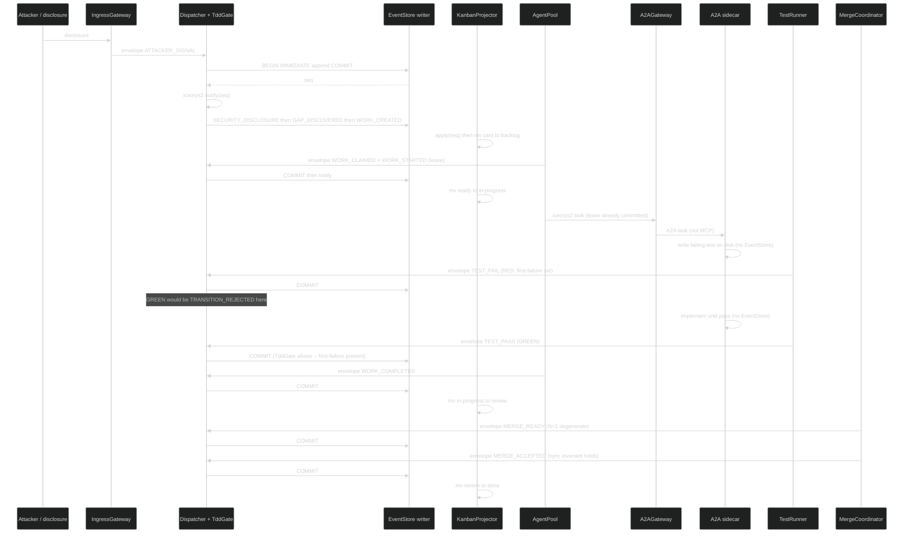

**Sidecar P2 loop (allow-list only):**

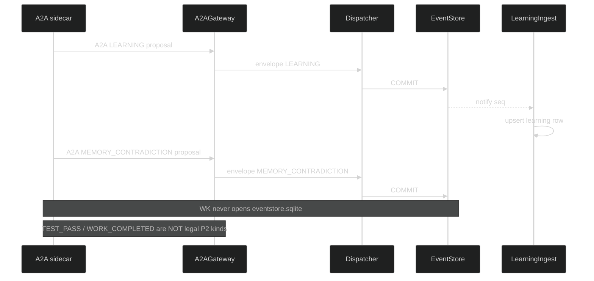

### 7.11 Watchdogs -- gone-crazy process AND gone-crazy AI

| Probe | Period / trigger | Crazy / dead if | Action |
|---|---|---|---|
| Heartbeat fd | `heartbeat_ms` | No beat for `3 * heartbeat_ms` | `WATCHDOG_HANG`; expire lease |
| Progress | `progress_idle_ms` | No `TRANSITION_COMMITTED` from agent | `WATCHDOG_STALL`; after 2, `WORK_BLOCKED` |
| Token / loop storm | sidecar stdout + A2A | `token_rate > token_storm_tps` | `WATCHDOG_AI_STORM`; SIGKILL |
| File write set | `notify` on workspace | Path not under `owned_subtree` | `WATCHDOG_PATH_VIOLATION`; SIGKILL |
| CPU / time budget | `procfs` + `TIMER_TICK` | Budget exceeded | `WATCHDOG_HANG`; SIGKILL |
| Oscillation | on RGB / merge | Flip-flop past bound | `WATCHDOG_OSCILLATION`; force RGB |

### 7.10 Errant forks and bad work

| Kind | How discovered | Event | Remedy |
|---|---|---|---|
| Orphan process | Heartbeat miss | `WATCHDOG_HANG` / `WORK_RELEASED` | SIGKILL; card to `ready`/`blocked` |
| Orphan branch | write_set with no lease | `FORK_ORPHAN` | Do not merge; card `blocked` |
| Bad fork (writes outside subtree) | `notify` vs `owned_subtree` | `WATCHDOG_PATH_VIOLATION` | SIGKILL; revoke lease |
| Thrash / reward-hack GREEN | `TEST_PASS` with null `first_failure` | `TRANSITION_REJECTED` + `WATCHDOG_THRASH` | TddGate forbids; Watchdog kills |
| Token / loop storm | token_rate / identical loop | `WATCHDOG_AI_STORM` | SIGKILL |
| Oscillating MERGE_REJECTED | flip-flop rate | `WATCHDOG_OSCILLATION` | Block; kill |
| Split-brain two owners | second `WORK_CLAIMED` | `TRANSITION_REJECTED` | First lease wins |
| Recursion bomb | spawn beyond depth/budget | `TRANSITION_REJECTED` | No new agent |

### 7.11 API boundary

| Direction | Events |
|---|---|
| **Ingress** | `MESH_JOIN`, `MESH_LEAVE`, daemon lifecycle |
| **Egress** | `MESH_*`, `AGENT_CARD_*`, `WATCHDOG_*`, `FORK_ORPHAN` |

---

## SUBSYSTEM 8: Harvest & Emergence -- Lifecycle

### 8.0 Identity

Harvest is **not** a different kind of process. Zoom out from a SPEC card and the same observe-decide-act-emit-project cycle is looking at usage, duplication, and coupling. When a threshold crosses on a live event, the engine mints a harvest card on the **same** kanban.

### 8.1 Harvesting thresholds (live)

| Metric | Threshold | Action |
|---|---|---|
| `usage_count` | > 3 nodes referencing same component | Candidate for EXTRACT_LIB |
| `duplication_ratio` | > 40% AST similarity across 2+ agents | Candidate for EXTRACT_LIB |
| `cross_boundary_coupling` | Shared interface across 2+ FEAT or ARCH | Candidate for EXTRACT_LIB |
| `lib_stable_cycles` | > 5 cycles with no API change | Promote to EXTRACT_SERVICE |
| `service_health` | SLA met for 10 cycles | Spawn child SDLC instance |

Thresholds live in Config. HarvestDaemon subscribes to `TRANSITION_COMMITTED` on iceoryx2. No nightly batch.

### 8.2 Spawn semantics

When a component is promoted to a service and spawns a child SDLC:

1. A new `STRAT` is created for the service (new engine instance).
2. The child inherits guard and breaker **definitions** from parent, with independent thresholds and its own EventStore SQLite.
3. The child gets its own one kanban, agent pool, and own iceoryx2 domain.
4. Parent DAG updated: component node replaced with a service-dependency work item (board-proxy card).
5. Parent and child communicate via API contracts plus zenoh egress, not shared code.
6. Child lifecycle is fully independent -- own TDD, own RGB, own harvest, own breakers.
7. Depth: `spawn_budget(depth) = floor(8 / 2^depth)`, hard stop at depth 4.
8. Child starts with **one initial locator** pointing at parent zenoh peer.

### 8.3 Board of boards

When `SDLC_SPAWNED` fires, the parent kanban gains a `board-proxy` card. Zoom into that card and you are in the child's one kanban. Zoom out and it is one row.

### 8.4 Interfaces

**IHarvestRule:**

| Field | Type | Description |
|---|---|---|
| `id` | `string` | Rule identifier |
| `predicate()` | `fn(registry_state) -> bool` | When to trigger |
| `action` | `enum` | `EXTRACT_LIB`, `EXTRACT_SERVICE`, `REFACTOR_IN_PLACE` |
| `maturity_gate` | `dict` | Conditions for promotion |
| `spawn_sdlc` | `bool` | If true, component gets own engine instance |

**IComponentRegistry:**

| Field | Type | Description |
|---|---|---|
| `components` | `dict[id, IComponent]` | All registered shared components |
| `register(component)` | `fn` | Add or update component |
| `dependents(id)` | `fn -> list[node_id]` | Who depends on this component |
| `usage_count(id)` | `fn -> int` | How many nodes reference this |
| `lease_matrix` | `dict[path, lease]` | Who holds write lease on which path |

### 8.5 Harvest event payload schemas (colocated)

```json
{
  "$id": "https://hanaden.ai/sdlc/event/HARVEST_DETECTED/v1",
  "type": "object",
  "required": ["component_id", "rule_id", "evidence"],
  "properties": {
    "component_id": { "type": "string" },
    "rule_id": { "type": "string" },
    "evidence": { "type": "object" }
  }
}
```

### 8.6 API boundary

| Direction | Events |
|---|---|
| **Ingress** | `TRANSITION_COMMITTED` (live threshold evaluation) |
| **Egress** | `HARVEST_DETECTED`, `LIB_EXTRACTED`, `SERVICE_PROMOTED`, `SDLC_SPAWNED` |

---

## 9. Event Type Catalog (consolidated)

Every state change in the engine is one of these typed events. This is the complete catalog.

### 9.1 Work events

| Event | Source | Payload | Effect |
|---|---|---|---|
| `WORK_CREATED` | Hub / Ingress / Gap | `(work_item_id, node_ref, column=backlog)` | New card in `backlog` |
| `WORK_DECOMPOSED` | Hub | `list[IWorkItem]` | Child cards injected |
| `WORK_STARTED` | Agent | `(work_item_id, agent_id)` | `ready -> in-progress` |
| `WORK_CLAIMED` | Agent | `(work_item_id, agent_id, lease)` | Exclusive lease |
| `WORK_RELEASED` | Agent / LeaseDaemon | `(work_item_id, agent_id)` | `in-progress -> ready` |
| `WORK_COMPLETED` | Agent | `(work_item_id, artifacts)` | `in-progress -> review` |
| `WORK_BLOCKED` | Guard/Dep/Merge/Ingress | `(work_item_id, reason)` | any -> `blocked` |
| `WORK_UNBLOCKED` | Hub | `(work_item_id)` | `blocked -> ready` |
| `WORK_CONFLICTED` | Hub / LeaseDaemon | `(work_item_id, conflict_details)` | -> `blocked` |
| `WORK_MERGED` | (alias) | same as `MERGE_ACCEPTED` | Canonicalize to `MERGE_ACCEPTED` |

### 9.2 Merge events

| Event | Source | Payload | Effect |
|---|---|---|---|
| `MERGE_READY` | MergeCoordinator | `(merge_point_id, parent_card, child_cards)` | Parent eligible |
| `MERGE_BLOCKED` | MergeCoordinator | `(merge_point_id, parent_card, reason)` | Parent `blocked` |
| `MERGE_ACCEPTED` | MergeCoordinator | `(merge_point_id, parent_card, evidence)` | Parent `done`. Unblocks dependents |
| `MERGE_REJECTED` | MergeCoordinator | `(merge_point_id, parent_card, failures)` | Parent does not advance |
| `RECONCILE_PARENT` | ParentReconciler | `(child_id, old_parent, new_parent)` | Link repair |

### 9.3 TDD / process events

| Event | Effect |
|---|---|
| `TEST_FAIL` | TDD to RED; set `first-failure` if null |
| `TEST_PASS` | TDD RED -> GREEN if `first-failure` set; **REJECTED** if `NOT_STARTED` |
| `CODE_REGRESSION` | TDD GREEN/REFACTOR -> RED |
| `SPEC_WRONG` | SPEC re-entered; do not silently rewrite test |
| `FEAT_WRONG` | Parent FEAT re-entered |
| `GAP_DISCOVERED` | New cards in `backlog`/`ready` |
| `PROCESS_DEFECT` | Card against engine process docs |
| `TEMPLATE_DEFECT` | Card against templates |
| `SYNC_VIOLATION` | Blocks `MERGE_ACCEPTED` |

### 9.4 RGB events

| Event | Color | Source | Target |
|---|---|---|---|
| `CODE_REGRESSION` | RED | TestRunner | SPEC |
| `INTEGRATION_FLAW` | GREEN | TestRunner | FEAT and ARCH |
| `UNFEASIBLE_SCOPE` | GREEN | TestRunner | MOTI |
| `BROKEN_REQUIREMENT` | GREEN | TestRunner | DRIV |
| `PARADIGM_SHIFT` | BLUE | TestRunner | STRAT |

### 9.5 Guard / breaker events

| Event | Effect |
|---|---|
| `GUARD_PASSED` | Increment `consecutive_passes` |
| `GUARD_BLOCKED` | Transition aborted |
| `GUARD_REDIRECTED` | Event re-routed |
| `GUARD_ESCALATED` | Escalation handler |
| `FIXATION_DETECTED` | Force-fired guard |
| `BREAKER_TRIPPED` | All affected -> `blocked`. `RESET_STARTED` |
| `BREAKER_REARMED` | Guards updated |
| `RESET_STARTED` | Checkpoint |
| `RESET_COMPLETED` | Dispatch resumes |

### 9.6 External events

| Event | Source | Target |
|---|---|---|
| `STRATEGIC_PIVOT` | Market / exec | STRAT |
| `PROBLEM_SIGNAL` | User / market | DRIV |
| `USER_REPORT` | User | Bound node or new card |
| `ATTACKER_SIGNAL` | Attacker | STRAT or DRIV |
| `SECURITY_DISCLOSURE` | Attacker, user, scanner | SEC surface |

### 9.7 Harvest / engine / mesh / learning / watchdog events

| Event | Effect |
|---|---|
| `HARVEST_DETECTED` | Card in harvest partition |
| `LIB_EXTRACTED` | Registry updated |
| `SERVICE_PROMOTED` | Maturity gate passed |
| `SDLC_SPAWNED` | Child engine instance starts |
| `UNHANDLED_EVENT` | Dead-letter candidate |
| `TRANSITION_REJECTED` | No state change |
| `TRANSITION_COMMITTED` | State+projection applied |
| `TIMER_TICK` | TimerDaemon only |
| `LEARNING` | `class` EFFICIENCY/CAPABILITY; `action` CREATE/REVISE/RETIRE |
| `MEMORY_CONTRADICTION` | P2 sidecar proposal |
| `MESH_JOIN` | Peer/daemon appeared |
| `MESH_LEAVE` | Liveliness dropped |
| `MESH_EGRESS` | Parent-visible child event |
| `MESH_INGRESS` | Local append of child egress |
| `AGENT_CARD_PUBLISHED` | Sidecar claimable |
| `AGENT_CARD_REVOKED` | Card URL dead |
| `WATCHDOG_STALL` | After 2: `WORK_BLOCKED` |
| `WATCHDOG_THRASH` | Kill; no auto-GREEN |
| `WATCHDOG_AI_STORM` | SIGKILL |
| `WATCHDOG_PATH_VIOLATION` | SIGKILL + `WORK_CONFLICTED` |
| `WATCHDOG_HANG` | Lease expire |
| `WATCHDOG_OSCILLATION` | Block + kill |
| `FORK_ORPHAN` | `blocked`; no merge |

---

## 10. Nested Loop Architecture (binding)

These are **zoom levels of one loop**, not four engines.

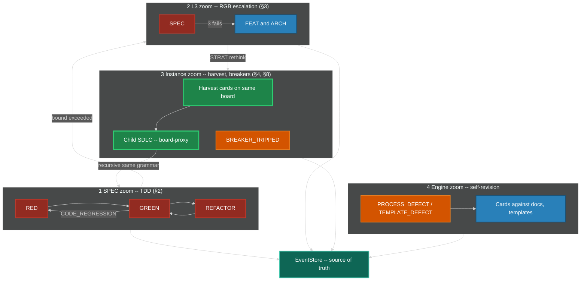

Self-improvement is not a special mode. A `PROCESS_DEFECT` is a card. A harvest is a card. All go RED before GREEN, fan in at a merge point.

---

## 11. Protection Summary

| Tier | Type | When | Construct | Scope |
|---|---|---|---|---|
| 0 | TDD gate | Every TDD transition | `machine.json` missing edge + TddGate | Per SPEC |
| 1 | Inline Guards | Every state entry | `IGuard.predicate()` | Per-node |
| 2 | RGB bounds | 3 fails / 2 redesigns / exhaustion / invalid | Mid-zoom escalation | Ladder |
| 3 | Emergency Breakers | Threshold exceeded | `IBreaker.trip()` | Per-metric |
| 4 | System Reset | Breaker trips | `RESET_*` + re-arm | Instance-wide |
| 5 | WIP Limits | Always | `IKanban.wip_limits` | Per column / agent |
| 6 | Exclusive lease | While `in-progress` | ILease TTL | Per card + subtree |
| 7 | Merge-point barrier | Fan-in of N cards | `IMergePoint` | Per parent |
| 8 | Sync invariant | Before `MERGE_ACCEPTED` | `SPEC == test == impl == process/template` | Per merge point |
| 9 | Harvest Rules | Pattern detected live | `IHarvestRule.predicate()` | Cross-cutting |
| 10 | Fixation Ceiling | Passes exceeded | Force-fire guard | Per-guard |
| 11 | Spawn budget | Agent spawn | `floor(8 / 2^depth)` | Per agent tree |
| 12 | SchemaRegistry | Every dispatch | Unknown kind -> `UNHANDLED_EVENT` | Instance |
| 13 | Watchdog | All probes | SIGKILL + card return | Per process |
| 14 | Sidecar boundary | Always | No LLM in core; P2 allow-list | Instance |

---

## 12. Implementation Slice Order (always-live, no batch)

Implement in this order. Each slice is **always live** when it exists.

| Slice | What boots | Live meaning |
|---|---|---|
| 1 | EventStore writer thread + pragmas | Process accepts envelopes, persists seq |
| 2 | Dispatcher + TddGate + seed `machine.json` | Canonicalize, illegal TDD rejected, `TRANSITION_COMMITTED` |
| 3 | KanbanProjector | seq -> row -> `mv`; repair-on-replay |
| 4 | Watchdog | OS probes; envelopes to Dispatcher |
| 5 | LeaseDaemon + AgentPool | Exclusive claim |
| 6 | MergeCoordinator + ParentReconciler | Fan-in |
| 7 | TestRunner | `WORK_STARTED` / notify |
| 8 | GuardDaemon + BreakerDaemon + TimerDaemon | Guards, breakers, sole clock |
| 9 | SchemaRegistry + Config (figment) | Dynamic kinds and weights |
| 10 | IngressGateway + A2AGateway + LearningIngest | P1 / P2 / P3 |
| 11 | HarvestDaemon + DiscoveryDaemon + zenoh | Instance zoom + child engines |
| 12 | DeadLetter + Retry + MetricsDaemon | Poison, backoff, export |

A running EventStore + Dispatcher is already an engine.

---

## 13. Production Requirements Checklist

### 13.1 Product (engine semantics)

- [ ] Cohesive event + feedback + docs + process + TDD (one catalog: seed `machine.json`)
- [ ] One workstream kanban + merge-point columns
- [ ] Parallel subagents with exclusive card + subtree leases
- [ ] Merge points (N-child fan-in; N=1 = `MERGE_ACCEPTED`)
- [ ] External and internal events both on the named mesh
- [ ] Learning CREATE/REVISE/RETIRE; sidecar memory optional and off-engine
- [ ] Sync invariant at `MERGE_ACCEPTED`
- [ ] One loop at SPEC / L3 / instance / engine / recursion zooms
- [ ] Recursive child SDLC with own iceoryx2 and EventStore
- [ ] Named Rust daemons (§7)
- [ ] Dynamic registries
- [ ] Async event-driven (`TIMER_TICK`)
- [ ] TDD gate: `NOT_STARTED -> GREEN` is `TRANSITION_REJECTED`
- [ ] Hub never content-merges files
- [ ] iceoryx2 + zenoh named mesh; no god bus
- [ ] Discovery from one `INITIAL_LOCATOR`
- [ ] Optional A2A sidecar; MCP absent; core tests pass with Ollama down
- [ ] Live scheduler; no batch sort

### 13.2 Production hardening

- [ ] Authn/authz on IngressGateway and A2AGateway
- [ ] Audit log = EventStore
- [ ] Secrets: opaque secret ids; no vault in seed
- [ ] Schema evolution / `machine.json` reload + hash
- [ ] Idempotency keys on ingress and projector apply
- [ ] Graceful drain
- [ ] Backup / restore of EventStore
- [ ] Dead-letter + retry/backoff
- [ ] TTL leases (no forever locks)
- [ ] One writer thread per sqlite; CAS on that writer
- [ ] Always-on daemons -- no batch
- [ ] Errant-fork detection (§7.10)

---

## Changelog

| Version | Date | Author | Changes |
|---|---|---|---|
| 0.0.1 | 2026-08-18 | Frederick Bloom | Original generic engine: taxonomy, RGB, guards, breakers, event-sourced core, star orchestrator, harvest, interfaces. |
| 0.0.2 | 2026-08-30 | Frederick Bloom + Claude | Overlay attempt. FAILED integration. Do not implement. |
| 0.0.3 | 2026-08-30 | Frederick Bloom + Claude | Integrated rewrite. Generic event bus still named. Do not implement. |
| 0.0.4 | 2026-08-30 | Frederick Bloom + Claude | Named iceoryx2 + zenoh. Do not implement. |
| 0.0.5 | 2026-08-31 | Frederick Bloom + Grok 4.6 | Closes G-001–G-067. Monolithic -- superseded by 0.0.5.1. |
| 0.0.5.1 | 2026-08-31 | Frederick Bloom + Antigravity | System-of-systems restructure. 8 bounded subsystems. Decomposed machine.json. DRY. Restored TDD+RGB recursive loop. |
