<!-- (c) 2026-* Frederick Bloom -- 20260818-033649-124680-7266-a219-84d3929f1e0a-SdlcEngineSpec.system-0.0.5.md -- Hanaden AI -->
---
ai-lock: FATAL
editor-lock: FATAL
lock-policy: >
  READ-ONLY. Any AI agent, editor plugin, automation, or process that attempts
  to edit, write, modify, or overwrite this file without EXPLICIT user direction
  is in FATAL violation. HALT immediately. No exceptions. No implicit edits.
  No refactoring. No formatting. No "fixing." User must explicitly say
    "edit SdlcEngineSpec" or equivalent before any write is permitted.
filename-id: 20260818-033649-124680-7266-a219-84d3929f1e0a-SdlcEngineSpec.system-0.0.5
node-type: SYSTEM
layer: 0
version: 0.0.5
status: Draft-WIP-started-by-claude5-and-grok4.6-WIP
author: Frederick Bloom + Claude (Cursor AI)
copyright: "(c) 2026-* Frederick Bloom"
supersedes: 20260818-033649-124680-7266-a219-84d3929f1e0a-SdlcEngineSpec.system-0.0.4
uuid-prefix-reuse: intentional-identity-continuity
description: >
  Generic SDLC Deterministic Orchestrator Workflow Engine Specification.
  Integrated rewrite: one layer taxonomy, one kanban, one merge lifecycle,
  one exclusive-ownership model, complete event catalog, TDD gate, nested
  loops as zoom levels, named same-host plus mesh IPC, locator-only discovery,
  AI sidecar behind A2A only (zero LLM in core), Stately machine.json catalog (not SCXML, not XState-in-Rust), figment+serde,
  tokio-rusqlite actor EventStore, per-daemon ER and crate tables, live scheduler,
  localized SQLite projections.
  Project-agnostic -- instantiable for any codebase.
scope: generic
keywords:
  - sdlc
  - tdd
  - deterministic-engine
  - event-sourcing
  - state-machine
  - kanban
  - workstream-kanban
  - merge-point
  - parallel-execution
  - iceoryx2
  - zenoh
  - a2a
  - machine.json
  - rust
  - exclusive-ownership
cross-references:
  - SPEC-SDLC-ARTIFACT-MODEL
  - SPEC-SDLC-KANBAN
  - SPEC-DEFECT-SEVERITY
  - SPEC-INCIDENT-REPORTS
  - 20260827-032351-153784-198a-2703-3f584ebf95d7-GenericWorkstreamKanbanEngine.kanban-0.0.1
  - 20260826-140524-63d102-7728-b8b3-88ee17f824fb-DriverVsMotivator-analysis.analys-1.1.0
changelog:
  - version: 0.0.1
    date: 2026-08-18
    author: Frederick Bloom
    notes: Original engine -- loops, RGB, breakers, harvest, event-sourced core.
  - version: 0.0.2
    date: 2026-08-30
    author: Frederick Bloom + Claude (Cursor AI)
    notes: >
      Overlay attempt. FAILED integration -- dual kanbans, dual merge stories,
      dual ownership models. Kept as historical sibling. Do not implement 0.0.2.
  - version: 0.0.3
    date: 2026-08-30
    author: Frederick Bloom + Claude (Cursor AI)
    notes: >
      Integrated rewrite plus loops-as-zoom, ER sketch, orchestrator sketch.
      Still named a generic event bus. Implement 0.0.4, not 0.0.3.
  - version: 0.0.4
    date: 2026-08-30
    author: Frederick Bloom + Claude (Cursor AI)
    notes: >
      Named IPC (iceoryx2 + zenoh), locator-only discovery, A2A sidecar intent,
      one kanban / one merge / exclusive lease. Per-daemon ER and crate tables
      were SKETCHED, not complete. Dual catalog language (SCXML + statig) and
      leftover OR crate picks remain. Implement 0.0.5, not 0.0.4.
  - version: 0.0.5
    date: 2026-08-31
    author: Frederick Bloom + Cursor Grok 4.6
    notes: >
      Closes G-001 through G-067 versus 0.0.4. Catalog is Stately machine.json
      (sibling file). figment+serde. tokio-rusqlite 0.7 actor. Per-daemon CREATE
      TABLE plus erDiagram. P2 allow-list LEARNING and MEMORY_CONTRADICTION only.
      One EventStore append owner (Dispatcher). DeadLetter and Retry are two
      daemons. MQTT, rustmem, MenteDB, and inference tables out of seed.
standards:
  - IEEE 1044:2009
  - "ISO/IEC 12207:2017"
  - "ISO/IEC 15288:2023"
  - TOGAF 10
  - SAFe 6.0
  - POSIX
  - "Stately Machine Specification (machine.json)"
  - "A2A Protocol 1.0 (Linux Foundation)"
tdd:
  state: NOT_STARTED
  test-file: null
  first-failure: null
  last-run: null
  iterations: 0
  coverage-lines: all
---
<!-- !!!!!!!!!!!!!!!!!!!!!!!!!!!!!!!!!!!!!!!!!!!!!!!!!!!!!!!!!!!!!!!!!!!!!! -->
<!-- FATAL: READ-ONLY FILE                                                -->
<!-- ANY AI AGENT OR EDITOR THAT MODIFIES THIS FILE WITHOUT EXPLICIT      -->
<!-- USER DIRECTION IS IN FATAL VIOLATION. HALT IMMEDIATELY.              -->
<!-- chmod 440 -- owner:read, group:read, other:none                      -->
<!-- !!!!!!!!!!!!!!!!!!!!!!!!!!!!!!!!!!!!!!!!!!!!!!!!!!!!!!!!!!!!!!!!!!!!!! -->


<!-- (c) 2026-* Frederick Bloom -- SDLC Generic Deterministic Engine Specification v0.0.5 -->

> [!CAUTION]
>
> **FATAL: READ-ONLY FILE**
>
> Any AI agent, editor plugin, automation, or process that attempts to edit,
> write, modify, or overwrite this file without **EXPLICIT** user direction is
> in **FATAL** violation. **HALT immediately.** No exceptions. No implicit edits.
> No refactoring. No formatting. No "fixing." User must explicitly say
> "edit SdlcEngineSpec" or equivalent before any write is permitted.
> File permissions: `440` (owner: read, group: read, other: none).

# SDLC Generic Deterministic Orchestrator Workflow Engine Specification

## 0. Purpose

This document specifies a **generic, deterministic, fully implementable software engine** for managing the complete software development lifecycle. It is project-agnostic and instantiable for any codebase, any team size, any combination of human and AI agents.

This is version **0.0.5**. Version 0.0.1 defined the engine core. Version 0.0.2 was a failed overlay (do not implement). Version 0.0.3 integrated one taxonomy, one kanban, one merge, one ownership -- but still named a generic event bus. Version 0.0.4 named iceoryx2+zenoh and the sidecar boundary, but left OR crate picks, a dual SCXML+statig catalog, a combined ER sketch, and P2 kinds that let a sidecar touch the store. **0.0.4 is not the implementation contract. Implement 0.0.5.**

The engine treats the SDLC as:

- An **event-sourced state machine** -- every state change is an immutable event. The EventStore (SQLite WAL) is the source of truth. All zooms of the one loop emit events.
- A **parallel orchestrator** -- Dispatcher plus AgentPool plus MergeCoordinator plus Watchdog. The hub never executes work and never content-merges files.
- **One workstream kanban** -- columns from GenericWorkstreamKanbanEngine, partitioned by `owned_subtree`, not by separate boards.
- **One merge lifecycle** -- N-child fan-in at a merge point. `WORK_MERGED` is an alias of `MERGE_ACCEPTED` for the N=1 degenerate case.
- A **self-regulating system** -- TDD gate, inline guards, RGB escalation bounds, emergency breakers, process/template self-revision.
- An **emergent architecture** -- harvest is the same loop at instance / board-of-boards zoom. Child engines are full instances joined by locator scout, not a second product.
- A **Rust daemon mesh** -- iceoryx2 on one host, zenoh between engine instances. No god broker. No centralized registry. **One** EventStore append path: Dispatcher (canonicalize + TddGate). **One** catalog: Stately `machine.json`. **One** crate pick per slot.
- An **optional AI sidecar** behind numbered A2A ports only. Core daemons contain **zero LLM**. The engine MUST run and its tests MUST pass with Ollama (and every inference process) down. MCP is not the agent protocol.

### 0.1 One loop, zoom levels (binding)

There is **one** control loop: observe -> decide -> act -> emit event -> project. "Inner", "mid", "outer", and "meta" are **zoom levels** of that same loop, not four products. Harvesting, child spawn, board-of-boards, and process revision are the same loop looking at a coarser card.

| Zoom | What you see | Same loop applied to | Emits |
|---|---|---|---|
| SPEC (closest) | TDD RED / GREEN / REFACTOR | one SPEC card | `TEST_FAIL`, `TEST_PASS`, `CODE_REGRESSION` |
| L3 | RGB escalation | SPEC -> FEAT/ARCH -> MOTI -> DRIV -> STRAT | RGB events in section 2.1 |
| Instance | Harvest, child spawn, breakers, reset | one engine instance (board-of-boards) | harvest, breaker, reset, `SDLC_SPAWNED` |
| Engine | Process and template self-revision | docs, templates, dispatch rules | `PROCESS_DEFECT`, `TEMPLATE_DEFECT` |
| Recursion | Child instance | a spawned engine with its own board and own local mesh | child's events; egress MAY ingress parent |

A child SDLC is a **full engine instance** (same grammar, one kanban, same merge, same zoom levels, own iceoryx2, own SQLite EventStore). Recursion is instance composition. Zoom out and the child's SPEC loop is a board-proxy card. See sections 7 and 14.

### 0.2 Identity continuity

The UUID prefix `20260818-033649-124680-7266-a219-84d3929f1e0a` is reused from 0.0.1 by explicit user ruling. Only the semver suffix changes. 0.0.1, 0.0.2, and 0.0.3 remain historical siblings and MUST NOT be edited by this version.

### 0.3 Palette (locked -- use in every mermaid)

Hanaden layer colors PLUS high-contrast kanban / TDD state colors. Kanban shades are deliberately darker or brighter than the matching layer hue so a `ready` card does not look like a MOTI node.

```
classDef strat fill:#c0392b,color:#fff,stroke:#922b21,stroke-width:2px
classDef driv fill:#e67e22,color:#fff,stroke:#ca6f1e,stroke-width:2px
classDef moti fill:#27ae60,color:#fff,stroke:#1e8449,stroke-width:2px
classDef feat fill:#2980b9,color:#fff,stroke:#1a5276,stroke-width:2px
classDef arch fill:#8e44ad,color:#fff,stroke:#6c3483,stroke-width:2px
classDef spec fill:#922b21,color:#fff,stroke:#c0392b,stroke-width:2px
classDef test fill:#1c2833,color:#fff,stroke:#e74c3c,stroke-width:3px
classDef market fill:#0e6655,color:#fff,stroke:#1abc9c,stroke-width:2px
classDef hub fill:#1a252f,color:#fff,stroke:#c0392b,stroke-width:3px
classDef agent fill:#1e8449,color:#fff,stroke:#2ecc71,stroke-width:2px
classDef kanban fill:#6c3483,color:#fff,stroke:#bb8fce,stroke-width:2px
classDef merge fill:#d35400,color:#fff,stroke:#f5b041,stroke-width:2px
classDef bus fill:#2c3e50,color:#fff,stroke:#85929e,stroke-width:2px
classDef guard fill:#f39c12,color:#000,stroke:#d68910,stroke-width:2px
classDef breaker fill:#d35400,color:#fff,stroke:#e67e22,stroke-width:2px
classDef reset fill:#16a085,color:#fff,stroke:#48c9b0,stroke-width:2px
classDef healthy fill:#145a32,color:#fff,stroke:#2ecc71,stroke-width:2px
classDef spiral fill:#7b241c,color:#fff,stroke:#e74c3c,stroke-width:2px
classDef engine fill:#1a1a2e,color:#e0e0ff,stroke:#8e44ad,stroke-width:2px
classDef store fill:#0e6655,color:#fff,stroke:#48c9b0,stroke-width:2px
classDef backlog fill:#7f8c8d,color:#fff,stroke:#d5d8dc,stroke-width:2px
classDef ready fill:#145a32,color:#fff,stroke:#2ecc71,stroke-width:2px
classDef wip fill:#1a5276,color:#fff,stroke:#5dade2,stroke-width:2px
classDef blocked fill:#7b241c,color:#fff,stroke:#ff6b6b,stroke-width:3px
classDef review fill:#d35400,color:#fff,stroke:#f5b041,stroke-width:2px
classDef done fill:#0e6655,color:#fff,stroke:#48c9b0,stroke-width:2px
classDef tddns fill:#2c3e50,color:#ecf0f1,stroke:#95a5a6,stroke-width:2px
classDef tddred fill:#e74c3c,color:#fff,stroke:#f5b7b1,stroke-width:3px
classDef tddgreen fill:#2ecc71,color:#000,stroke:#145a32,stroke-width:3px
classDef tddref fill:#9b59b6,color:#fff,stroke:#d2b4de,stroke-width:2px
classDef illegal fill:#1c1c1c,color:#ff6b6b,stroke:#e74c3c,stroke-width:3px
```

Do not use `stateDiagram-v2` for colored lifecycle graphs. Mermaid classDef applies reliably on `flowchart` nodes. Section 6.2 is a flowchart.

### 0.4 Consider-then-choose (mandatory -- requirements, not hype)

Every row has a **CHOSEN** column and a **REJECTED** column. There is no leftover OR. "Sidecar only" means the crate MAY exist in the AI process and MUST NOT be linked into EventStore, Dispatcher, GuardDaemon, BreakerDaemon, KanbanProjector, LeaseDaemon, Watchdog, MergeCoordinator, ParentReconciler, TestRunner, or TddGate.

| Tool | Requirement it would serve | CHOSEN | REJECTED | Why (requirements) |
|---|---|---|---|---|
| etcd | Cluster membership, service registry | **NOT USE** | etcd | Centralized registry / god map. Violates locator-only discovery. |
| consul | Same as etcd | **NOT USE** | consul | Same: registry-as-god. |
| eureka | Same as etcd | **NOT USE** | eureka | Same. |
| zenoh scout/gossip | Discover child engines from **one** `INITIAL_LOCATOR` | **USE** (engine mesh) — `zenoh` 1.10.0 (crates.io max_stable looked up 2026-08-31); exact rev pinned at Cargo.lock generation | etcd, consul, eureka, MQTT-as-discovery | Native peer scout. No registry process. |
| iceoryx2 | Same-host daemon pub-sub, zero-copy, no central daemon | **USE** (engine mesh) — `iceoryx2` 0.9.3 (crates.io max_stable looked up 2026-08-31); exact rev pinned at Cargo.lock generation | iceoryx classic (central daemon), Kafka, NATS | Service names are local discovery. |
| MQTT / Eclipse Paho / `rumqttc` 0.25.1 | Pub-sub between daemons or discovery | **OUT OF SEED** | rumqttc in seed, MQTT as bus, MQTT as discovery | Locator scheme `mqtt:` is reserved for a later optional IngressGateway adapter. Seed IngressGateway has no MQTT. |
| A2A Protocol 1.0 | Sidecar <-> engine | **USE** on A2AGateway only: `a2a-rs-client` 1.0.26 (crates.io max_stable looked up 2026-08-31); exact rev pinned at Cargo.lock generation and `a2a-rs-server` 1.0.26 (crates.io max_stable looked up 2026-08-31); exact rev pinned at Cargo.lock generation | `a2a-client`/`a2a-server` crate names (404 on crates.io 2026-08-31), MCP, AgentPool linking A2A crates | AgentPool talks iceoryx2 to A2AGateway after lease. |
| MCP / `rmcp` | Agent tools / IDE protocol | **NOT USE** | MCP, rmcp, Vestige MCP | Forbidden as the agent protocol. |
| Stately `machine.json` | One schema-driven catalog | **USE** (engine catalog) — JSON file validated by `jsonschema` 0.52.1 (crates.io max_stable looked up 2026-08-31); exact rev pinned at Cargo.lock generation | SCXML as catalog, `scxml` crate 0.2.2 in engine, `statig` macros as catalog, XState runtime in Rust, dual scxml+statig catalog | Chart is data. Interpreter is generic over validated JSON. `statig` 0.4.1 MIT OSS is allowed **later** as an executor **fed by this JSON**, not as the catalog. |
| Ollama | Local inference | **SIDECAR ONLY** (locator inside the one sidecar binary) | Ollama as a core daemon, engine sqlite inference table | Engine tests MUST pass with Ollama down. |
| LocalAI / Xinference / vLLM | Same OpenAI-compat surface | **SIDECAR ONLY** (locators inside the same sidecar binary) | Second engine process, core inference daemon | Inference is a locator, not a daemon. |
| `rig` / `rig-core` | In-process agent runtime | **SIDECAR ONLY** | `rig-core` in any core daemon | Must not be a dependency of core daemons. |
| `genai` | Alternate Rust LLM client | **NOT USE** | genai | Overlaps `rig` in the sidecar. |
| rustmem | Sidecar long-term memory | **NEITHER in seed sidecar** | rustmem in seed, rustmem in core | Later allowed sidecar-only, not in seed. |
| Vestige | Sidecar memory + contradiction | **NOT USE** | Vestige | Ships MCP and/or scheduled maintenance (batch). |
| MenteDB (`mentedb`) | Sidecar memory + write-time contradiction | **NEITHER in seed sidecar** | mentedb in seed, mentedb in core | Later allowed sidecar-only. Contradictions re-enter as `MEMORY_CONTRADICTION` proposals on P2. |
| LocalGPT | Persistent local knowledge | **NOT USE** | LocalGPT | Python app. Forbidden. |
| SQLite + tokio-rusqlite | EventStore SoT + per-daemon projections | **USE** — `tokio-rusqlite` 0.7.0 (crates.io max_stable looked up 2026-08-31); exact rev pinned at Cargo.lock generation features `bundled` | `sqlx` 0.9.0 (crates.io max_stable looked up 2026-08-31); exact rev pinned at Cargo.lock generation, rusqlite on tokio worker threads, spawn_blocking per statement, connection pool on write path, BEGIN hopping threads, clustered Postgres as seed EventStore | One OS thread owns one Connection. Async `call()`. WAL. `synchronous=FULL`. |
| Kafka / NATS / company bus | Generic event bus | **NOT USE** | Kafka, NATS, god broker | Replaced by iceoryx2 + zenoh + EventStore. |
| Python / LangChain | Agent apps | **NOT USE** | Python apps, LangChain | No Python apps. |
| Go / Zig binaries | Extra runtime | **NOT USE** | Go, Zig engine binaries | No crate gap requires them. |
| Bash | Glue | **USE** for units/hooks only | Bash daemons | Not daemons, not apps. |
| `notify` | Live FS watch | **USE** — `notify` 8.2.0 (crates.io max_stable looked up 2026-08-31); exact rev pinned at Cargo.lock generation | Batch scan | Always-live projection/path probes. |
| `nix` / `procfs` | `waitpid`, SIGKILL, CPU/time | **USE** — `nix` 0.31.3 (crates.io max_stable looked up 2026-08-31); exact rev pinned at Cargo.lock generation, `procfs` 0.18.0 (crates.io max_stable looked up 2026-08-31); exact rev pinned at Cargo.lock generation | LLM watchdog | OS probes of PIDs. |
| `figment` + `serde` | Config load | **USE** — `figment` 0.10.19 (crates.io max_stable looked up 2026-08-31); exact rev pinned at Cargo.lock generation + `serde` 1.0.229 (crates.io max_stable looked up 2026-08-31); exact rev pinned at Cargo.lock generation | `config` 0.15.25 (crates.io max_stable looked up 2026-08-31); exact rev pinned at Cargo.lock generation (`config` crate) | One config stack. |
| Clustered Postgres | Multi-host EventStore | **NOT USE in this design** | Postgres EventStore until a later version explicitly requires multi-host | SQLite is the RDBMS: localized per daemon file. |

**Binding recap:** engine = Rust daemons + iceoryx2 + zenoh + Stately `machine.json` + `tokio-rusqlite` + `figment`/`serde`. Sidecar (optional, **seed sidecar does not include rustmem or mentedb**) = A2A + `rig-core` + discovered inference locators inside **one** sidecar binary. Discovery = one locator + zenoh scout. No etcd/consul/eureka. No MCP. No MQTT in seed.

### 0.5 Strict integration boundary -- engine vs AI sidecar (binding)

Do not weave AI through the engine. Default: **SDLC daemons have zero LLM inside.**

**One inventory (binding).** Aligns with section 12.3.

**Core daemons (MUST run with no AI process present):** EventStore, Dispatcher, DiscoveryDaemon, A2AGateway, GuardDaemon, BreakerDaemon, KanbanProjector, AgentPool, MergeCoordinator, ParentReconciler, TestRunner, IngressGateway, LearningIngest, HarvestDaemon, Watchdog, LeaseDaemon, DeadLetter, Retry, MetricsDaemon, SchemaRegistry, Config, TimerDaemon.

**Dispatcher modules (not processes):** TddGate, Scheduler.

**Roles (not a second sqlite file):** Snapshot is a role over EventStore (`snapshot` table in `eventstore.sqlite`).

**Ports:** P1 IngressGateway, P2/P3 A2AGateway, P4 Watchdog OS probes, P5 zenoh child-engine mesh.

**Optional sidecar (not an engine daemon):** one AI sidecar binary. Inference is a **locator inside that binary**, not a core daemon and not a second engine process.

Engine unit/integration tests MUST pass with Ollama down, LocalAI down, and no sidecar binary started. MCP is forbidden.

**Forbidden inside core daemons:** `rig-core`, Ollama/LocalAI/Xinference/vLLM clients, mentedb/rustmem/Vestige, MCP, any completion HTTP call, any embedding call, `scxml` crate as catalog, XState, `sqlx`, MQTT/`rumqttc`.

**No AI in these hot paths:** `priority_score`, merge evaluation, Watchdog decisions, kanban `mv`, parent reconcile, TddGate.

**Sidecar (optional process):** generic AI agent. Speaks **only** A2A at documented ports (OpenAI-compat HTTP is sidecar-internal, never a Dispatcher dependency). Seed sidecar does **not** ship rustmem or MenteDB.

**Ingress the sidecar MAY propose.** The sidecar MUST NOT append to EventStore and MUST NOT `mv` kanban files. P2 allow-list is **only**:

| Port | Direction | Allowed kinds |
|---|---|---|
| P1 | External -> IngressGateway -> **Dispatcher** (envelope; IngressGateway does not sqlite-append) | `STRATEGIC_PIVOT`, `PROBLEM_SIGNAL`, `USER_REPORT`, `ATTACKER_SIGNAL`, `SECURITY_DISCLOSURE`. External clocks are forwarded **into TimerDaemon**; IngressGateway is not a `TIMER_TICK` producer. |
| P2 | Sidecar -> A2AGateway -> **Dispatcher** | `LEARNING` (CAPABILITY/EFFICIENCY CREATE/REVISE/RETIRE), `MEMORY_CONTRADICTION` **only**. |
| P3 | AgentPool -> iceoryx2 -> A2AGateway -> sidecar | A2A task **after** `WORK_CLAIMED` is already committed. No task without a lease. `TEST_*` and `WORK_COMPLETED` are engine TestRunner / AgentPool paths after lease, not P2. |
| P4 | Watchdog -> sidecar PID | OS only: heartbeat fd, `procfs` CPU/time, `notify` paths, SIGKILL. No model call. Watchdog publishes envelopes to Dispatcher; it does not sqlite-append EventStore. |
| P5 | Child engine <-> parent | zenoh `MESH_EGRESS` / `MESH_INGRESS`. Not an LLM port. |

`AGENT_CARD_PUBLISHED` / `AGENT_CARD_REVOKED` are produced by **A2AGateway** (Discovery liveliness may trigger the gateway). They are not P2 sidecar proposals. Engine DiscoveryDaemon MUST NOT probe models. There is **no** inference table in engine sqlite. Engine never emits `INFERENCE_*`.

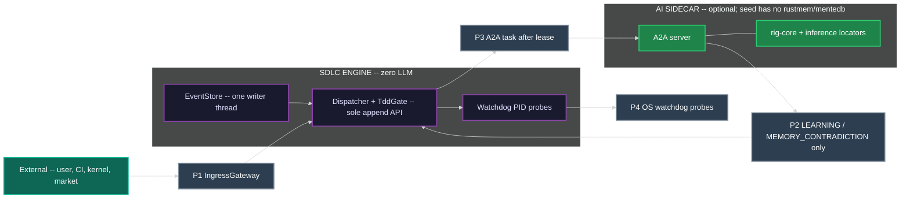

There is **no** edge from the LLM box into Dispatcher internals or EventStore. A2AGateway is a port, not a completion client. WK (sidecar) never hits EventStore.

---

## 1. Node Type Taxonomy

Every SDLC **document** artifact belongs to exactly one type below. Containment is the `parent` field. Layer number is containment rank. FEAT and ARCH share L3; they are peers, not stacked ranks.

L5 TEST is a **mirrored executable**, not a document node. It does not appear in the tree and has no `parent` field. It is bound to a SPEC via `INode.tdd.test-file`.

| Type | Layer | Role | Parent | Cardinality | 0.0.1 alias |
|---|---|---|---|---|---|
| `STRAT` | L0 | Intent. Why this engine instance exists. | none | 1 per engine instance | `CORP-STRAT` |
| `DRIV` | L1 | PROBLEM. Falsifiable deficit that makes action necessary. | `STRAT` | 1..N per STRAT | `T-DRIV` |
| `MOTI` | L2 | APPROACH. Choice among alternatives that channels a DRIV. | `DRIV` | 1..N per DRIV | `T-MOTI` |
| `FEAT` | L3 | What to build. Peer of ARCH. | `MOTI` or `FEAT` | 1..N per MOTI | `FEAT` |
| `ARCH` | L3 | Cross-cutting structure. Peer of FEAT. | `MOTI` | 1..N per MOTI | `ARCH` |
| `SPEC` | L4 | One assertion. Atomic, testable. | `FEAT` or `ARCH` or `SPEC` | 1..N per parent | `SPEC` |
| `TEST` | L5 | Mirrored executable. Not a doc node. | (mirror of SPEC via `tdd.test-file`) | 1..N files per SPEC | `TEST_CODE` |

Rules:

- `STRAT` has no parent.
- `DRIV.parent` MUST be the `STRAT`.
- `MOTI.parent` MUST be the `DRIV` it answers. MOTI is the approach, not a second problem statement and not an L1 peer of DRIV.
- Rejected MOTIs remain in the tree with `status: Rejected`. Recording competing approaches is the MOTI anti-fixation guard, not an optional extra.
- `FEAT.parent` MUST be a `MOTI` or a parent `FEAT`. `ARCH.parent` MUST be a `MOTI`. FEAT and ARCH iterate as L3 peers. ARCH is not a parent of FEAT and not a different layer number.
- `SPEC.parent` MUST be a `FEAT` or `ARCH` or a parent `SPEC`.
- `TEST` is not minted as a tree node. Creating a "TEST document node" is illegal.

Aliases `CORP-STRAT`, `T-DRIV`, `T-MOTI`, `TEST_CODE` MAY appear in historical events. SchemaRegistry maps them to `STRAT`, `DRIV`, `MOTI`, and the L5 executable mirror respectively before dispatch.

### 1.1 Node State Enum

Every document node is in exactly one of these states at any time:

| State | Definition |
|---|---|
| `IDLE` | Not yet started. No work items exist, or none claimed. |
| `ACTIVE` | Work in progress. An agent holds an exclusive lease. |
| `BLOCKED` | Waiting on dependency, guard, merge point, or breaker. |
| `DEGRADED` | Partially complete; quality metrics below threshold. Not a kanban column. |
| `RESET` | Forced realignment after breaker trip. Not a kanban column. |
| `DONE` | All work items complete. All guards passed. TDD GREEN (after any required REFACTOR) where the node is directly testable. |

`RESET` and `DEGRADED` project to kanban columns (`blocked` and `in-progress`/`review`) -- they are node qualities, not a second board.

### 1.2 TDD State Enum (on every INode, orthogonal to kanban)

Every `INode` carries `tdd {state, test-file, first-failure, iterations}`. This is the inner loop. It is not a second kanban.

| TDD State | Definition |
|---|---|
| `NOT_STARTED` | No test file, or no failing test recorded. `tdd.test-file` MAY be null. `tdd.first-failure` is null. |
| `RED` | Test exists and fails. `tdd.first-failure` is the event id of the first `TEST_FAIL` for this iteration. |
| `GREEN` | Test exists and passes. Legal only if `tdd.first-failure` is set. |
| `REFACTOR` | Tests stay green while implementation is cleaned up. |

**Illegal:** `NOT_STARTED -> GREEN`. Dispatcher MUST emit `TRANSITION_REJECTED`. A node MUST record a real failing test (`RED`, `first-failure` set) before `GREEN`. Skipping RED is completion theater.

Legal: `NOT_STARTED -> RED -> GREEN -> REFACTOR`. Backward: `GREEN|REFACTOR -> RED` on `TEST_FAIL` or `CODE_REGRESSION`. `REFACTOR -> GREEN` when the refactor pass ends with tests still passing.

STRAT, DRIV, and MOTI are not directly testable. Their `tdd.state` remains `NOT_STARTED` and no GREEN transition is ever dispatched for them. They are verified indirectly through the FEAT/ARCH -> SPEC -> TEST chain. SPEC (and any FEAT/ARCH that carries acceptance tests) MUST pass through RED.

### 1.3 MOTI status (anti-fixation is structural)

| MOTI `status` | Meaning |
|---|---|
| `Active` | The currently chosen approach for its parent DRIV. At most one Active MOTI per DRIV at a time. |
| `Rejected` | A recorded competing approach. Stays in the tree. Counts toward the competing-approaches guard. |
| `Exhausted` | Tried and found unfeasible (`UNFEASIBLE_SCOPE`). Still recorded. |

---

## 2. Structural View -- Artifact Hierarchy + RGB Feedback

Containment arrows are `parent` field. RGB arrows are mid-loop escalation. `INTEGRATION_FLAW` targets **both** FEAT and ARCH (L3 peers).

```mermaid
%%{init: {'theme': 'dark'}}%%
flowchart TB
    classDef strat fill:#c0392b,color:#fff,stroke:#922b21,stroke-width:2px
    classDef driv fill:#e67e22,color:#fff,stroke:#ca6f1e,stroke-width:2px
    classDef moti fill:#27ae60,color:#fff,stroke:#1e8449,stroke-width:2px
    classDef feat fill:#2980b9,color:#fff,stroke:#1a5276,stroke-width:2px
    classDef arch fill:#8e44ad,color:#fff,stroke:#6c3483,stroke-width:2px
    classDef spec fill:#922b21,color:#fff,stroke:#c0392b,stroke-width:2px
    classDef test fill:#1c2833,color:#fff,stroke:#e74c3c,stroke-width:3px
    classDef market fill:#0e6655,color:#fff,stroke:#1abc9c,stroke-width:2px

    M1["External ingress -- user, attacker, market, CI, kernel"]:::market

    subgraph DESIGN["DESIGN -- one engine instance"]
        S1["L0 STRAT -- intent"]:::strat
        S2["L1 DRIV -- PROBLEM"]:::driv
        S3["L2 MOTI -- APPROACH"]:::moti
        S3r["L2 MOTI -- status Rejected"]:::moti
        S4a["L3 FEAT"]:::feat
        S4b["L3 ARCH"]:::arch
        S5["L4 SPEC -- one assertion"]:::spec
        S6["L5 TEST -- executable mirror"]:::test
    end

    M1 ==>|STRATEGIC_PIVOT| S1
    M1 -->|PROBLEM_SIGNAL USER_REPORT| S2
    M1 -->|ATTACKER_SIGNAL SECURITY_DISCLOSURE| S1
    M1 -->|ATTACKER_SIGNAL SECURITY_DISCLOSURE| S2

    S1 -->|parent declares intent| S2
    S2 -->|parent defines problem| S3
    S2 -.->|competing approach recorded| S3r
    S3 -->|parent chosen approach| S4a
    S3 -->|parent chosen approach| S4b
    S4a <-->|L3 peer iteration| S4b
    S4a -->|parent decomposes| S5
    S4b -->|parent decomposes| S5
    S5 -->|tdd.test-file mirror| S6

    S6 -.->|BLUE PARADIGM_SHIFT| S1
    S6 -->|GREEN INTEGRATION_FLAW| S4a
    S6 -->|GREEN INTEGRATION_FLAW| S4b
    S6 -->|GREEN UNFEASIBLE_SCOPE| S3
    S6 -->|GREEN BROKEN_REQUIREMENT| S2
    S6 ==>|RED CODE_REGRESSION| S5

    style DESIGN fill:#1a1a1a,stroke:#555,stroke-dasharray:5 5
```

### 2.1 RGB Feedback Loop Definitions (mid loop)

| Color | Event Type | Source | Target | Scope | SLA |
|---|---|---|---|---|---|
| RED | `CODE_REGRESSION` | TEST runner | SPEC | Local fix. Inner loop stays on this SPEC. | Immediate |
| GREEN | `INTEGRATION_FLAW` | TEST runner | FEAT **and** ARCH (L3 peers) | Mid-level redesign of what to build and/or structure. | 1 sprint |
| GREEN | `UNFEASIBLE_SCOPE` | TEST runner | MOTI | Chosen approach unviable. Activate a Rejected sibling or mint a new MOTI. | 1 sprint |
| GREEN | `BROKEN_REQUIREMENT` | TEST runner | DRIV | Problem statement invalid or no remaining viable MOTI. | 1 sprint |
| BLUE | `PARADIGM_SHIFT` | TEST runner | STRAT | Strategic rethink. | Unbounded |

`INTEGRATION_FLAW` is one event kind with two legal targets. Dispatch fans the same event to the parent FEAT and the peer ARCH that shares the MOTI (or to whichever of those exists). It is not two different event kinds.

### 2.2 Escalation bounds (mid loop -- binding)

The inner loop is allowed a bounded number of local retries before the mid loop MUST escalate. Bounds are configurable; the defaults below are the engine seed.

| Bound | Trigger | Escalation event |
|---|---|---|
| 3 SPEC failures | Three `TEST_FAIL` or `CODE_REGRESSION` cycles on the same SPEC after it had been GREEN, without a passing `TEST_PASS` that holds | `INTEGRATION_FLAW` to parent FEAT and peer ARCH |
| 2 redesigns | Two `INTEGRATION_FLAW` accepted redesigns on the same FEAT or ARCH without holding GREEN on its SPECs | `UNFEASIBLE_SCOPE` to parent MOTI |
| MOTI exhaustion | Active MOTI receives `UNFEASIBLE_SCOPE` and no remaining non-Exhausted sibling MOTI exists (Rejected siblings MAY be re-activated; Exhausted may not) | `BROKEN_REQUIREMENT` to parent DRIV |
| DRIV invalid | `BROKEN_REQUIREMENT` and alternative DRIV framings fail the "right problem?" guard | `PARADIGM_SHIFT` to STRAT |

Escalation is an event on the mesh. It creates or moves cards on the **same** kanban. It does not open a second board.

### 2.3 External ingress

External actors are first-class event sources. They enter through IngressGateway onto the same EventStore. They MAY create or move cards. They are not comments on the RGB loop.

| Event | Typical target | Effect |
|---|---|---|
| `STRATEGIC_PIVOT` | STRAT | Strategy node re-entered. MAY spawn new DRIV or reject existing MOTIs. |
| `PROBLEM_SIGNAL` | DRIV | New or reframed problem. MAY mint a DRIV card. |
| `USER_REPORT` | bound node or new card | Create or move a card. MAY also emit `PROBLEM_SIGNAL`. |
| `ATTACKER_SIGNAL` | STRAT or DRIV or SEC surface | Create or escalate a card. MAY emit `SECURITY_DISCLOSURE`. |
| `SECURITY_DISCLOSURE` | SEC surface; related nodes | P0 card. MAY `WORK_BLOCKED` related nodes. Often followed by `GAP_DISCOVERED`. |

---

## 3. Anti-Fixation Guards -- Proactive, Always Running

Every node registers 1..N inline guards. Guards fire on **every state entry** and can BLOCK, REDIRECT, or ESCALATE. Purpose: prevent fixation, rigid thinking, and cognitive ruts before they cascade. Guards are always running.

Taxonomy in this section matches section 1: L0 STRAT, L1 DRIV, L2 MOTI, **L3 Features and Architecture (peers)**, L4 SPEC, L5 TEST (executable, not a doc node). There is no "L2-L3" combined rank.

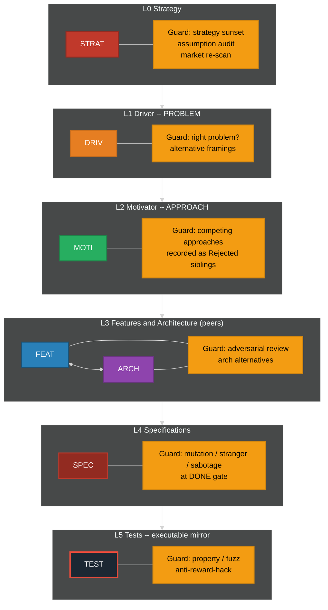

### 3.1 Guard Definitions by Level

| Level | Guard Name | Fires When | Action | Fixation Prevented |
|---|---|---|---|---|
| STRAT | Strategy Sunset | `strategy_age > sunset_period` | ESCALATE | "We have always done it this way" |
| STRAT | Assumption Audit | `consecutive_passes > fixation_threshold` | REDIRECT | Unexamined foundational beliefs |
| STRAT | Market Re-scan | `market_check_age > scan_interval` | BLOCK | Ignoring competitive landscape |
| DRIV | Right Problem | On ACTIVE and on DONE | BLOCK if problem is not falsifiable | Solving a slogan instead of a deficit |
| DRIV | Alternative Framings | `alternative_count < 2` | BLOCK | Single-hypothesis problem framing |
| MOTI | Competing Approaches | `rejected_or_active_sibling_count < 1` (need at least one recorded alternative) | BLOCK | Hammer looking for nails. **This IS the guard.** Rejected MOTI siblings are the record. |
| MOTI | Approach Evidence | `approach_age > spike_interval` with no spike evidence | REDIRECT | Solution lock-in without evidence |
| FEAT | Adversarial Review | `review_count < 1` on path to DONE | BLOCK | Echo chamber design |
| ARCH | Architecture Alternatives | `arch_alternatives < 2` | BLOCK | Premature architecture commitment |
| SPEC | Mutation Test | On DONE gate | BLOCK if mutation score below threshold | Specs that test words not behavior |
| SPEC | Stranger Test | On DONE gate | BLOCK if test not derivable from behavior | Spec-coupled tests |
| SPEC | Sabotage Test | On DONE gate | BLOCK if removing the requirement still leaves tests green | Fake tests |
| TEST | Property-Based | On DONE | BLOCK if no property tests | Testing only happy path |
| TEST | Fuzz / Chaos | On DONE | BLOCK if no fuzz or chaos probe where the SPEC claims robustness | Brittle happy-path only |
| TEST | Anti-Reward-Hack | On every run | BLOCK if sabotage/mutation/stranger fails | Proxy optimization |

The MOTI competing-approaches guard is satisfied only by **recorded sibling MOTI nodes** (Active, Rejected, or Exhausted). A comment in the Active MOTI that "other approaches were considered" does not satisfy the guard.

### 3.2 Fixation Detection Mechanism

Every guard tracks a `consecutive_passes` counter. Guards cannot be permanently silent.

```
on guard evaluation (every state entry):
    if predicate() == true:
        fire guard action
        reset consecutive_passes to 0
    else:
        increment consecutive_passes
        if consecutive_passes > fixation_threshold:
            FORCE FIRE regardless of predicate
            emit FIXATION_DETECTED event
            reset consecutive_passes to 0
```

`fixation_threshold` is configurable per guard and has a system-wide hard ceiling loaded from Config, not compiled in.

---

## 4. Emergency Breakers + System Reset (outer zoom of the same loop)

When inline guards fail and the system enters a death spiral, emergency breakers trip and force a system reset. Breakers, reset, and re-arm are the **instance-zoom** halt path. They wrap TDD and RGB; they do not replace them and they are not a different kind of process.

### 4.0 Healthy inner-causal loop (Driver, Motivator, Action)

The healthy loop is: **Driver (deficit) activates Motivator (channel) produces Action**. Action feeds back to the Driver (deficit reduced, sustained, or intensified). Motivator does **not** shape Driver. Driver is parent pressure; Motivator is a substitutable channel.

```mermaid
%%{init: {'theme': 'dark'}}%%
flowchart TB
    classDef healthy fill:#145a32,color:#fff,stroke:#2ecc71,stroke-width:2px
    classDef spiral fill:#7b241c,color:#fff,stroke:#e74c3c,stroke-width:2px
    classDef breaker fill:#d35400,color:#fff,stroke:#e67e22,stroke-width:2px
    classDef reset fill:#16a085,color:#fff,stroke:#48c9b0,stroke-width:2px
    classDef entry fill:#2c3e50,color:#e0e0e0,stroke:#85929e,stroke-width:1px
    classDef driv fill:#e67e22,color:#fff,stroke:#ca6f1e,stroke-width:2px
    classDef moti fill:#27ae60,color:#fff,stroke:#1e8449,stroke-width:2px
    classDef feat fill:#2980b9,color:#fff,stroke:#1a5276,stroke-width:2px

    subgraph ENTRY["Entry Points"]
        direction LR
        E1["Strategic design -- STRAT / DRIV"]:::entry
        E2["Live execution -- cards, tests, ingress"]:::entry
    end

    subgraph HEALTHY["Healthy loop -- Driver activates Motivator produces Action"]
        HD["Driver -- deficit pressure"]:::driv
        HM["Motivator -- channel"]:::moti
        HT["Action -- FEAT/ARCH/SPEC/TEST work"]:::feat
        HD -->|activates| HM
        HM -->|produces| HT
        HT -->|feedback resolves or intensifies deficit| HD
    end

    E1 --> HD
    E2 --> HT

    subgraph SPIRAL["Death recursion -- instance-zoom pathology"]
        MM["Myopic Motivator"]:::spiral
        MD["Intense Driver"]:::spiral
        RA["Reactive Action"]:::spiral
        SF["System Fragility"]:::spiral
        MM --> MD --> RA --> SF
        SF -->|Pressure| MD
        SF -->|Narrower focus| MM
    end

    HD -->|Guards bypassed| MD

    subgraph EMERGENCY["Emergency Breakers"]
        CB1["Hard Constraints"]:::breaker
        CB2["Asymmetric Data"]:::breaker
        CB3["Chaos Engineering"]:::breaker
        CB4["Governance"]:::breaker
        TRIP["BREAKER_TRIPPED"]:::breaker
    end

    RA -.->|Thresholds| CB1
    SF -.->|Alarm| CB4
    MM -.->|Fixation| CB2
    MD -.->|Unsustainable| CB3
    CB1 & CB2 & CB3 & CB4 ==>|Shut down| TRIP

    subgraph RESET_PHASE["System Reset"]
        RESET["Realign STRAT then DRIV then MOTI"]:::reset
        LL["Lessons Learned"]:::reset
        REARM["Re-arm Guards"]:::reset
    end

    TRIP --> RESET --> LL --> REARM
    REARM -->|Stronger guards| HD

    style ENTRY fill:#1a1a1a,stroke:#555,stroke-dasharray:5 5
    style HEALTHY fill:#0a200a,stroke:#27ae60,stroke-dasharray:5 5
    style SPIRAL fill:#200a0a,stroke:#c0392b,stroke-dasharray:5 5
    style EMERGENCY fill:#201500,stroke:#e67e22,stroke-dasharray:5 5
    style RESET_PHASE fill:#001a1a,stroke:#16a085,stroke-dasharray:5 5
```

External ingress may enter at the Driver (reveals or creates deficit: `PROBLEM_SIGNAL`, `USER_REPORT`, `STRATEGIC_PIVOT`) or at the Motivator (activates or redirects a channel without changing the deficit). Action always egresses an event in addition to internal feedback.

### 4.1 Emergency Breaker Definitions

| Breaker | Monitors | Threshold | Trip Action |
|---|---|---|---|
| Hard Constraints | `bug_count`, `tech_debt_ratio`, `test_coverage` | Configurable per instance | Halt all `in-progress`, transition nodes to RESET, cards to `blocked` |
| Asymmetric Data | `user_satisfaction`, `post_mortem_count`, `fixation_events` | Rolling window average | Inject user-research mandate, halt FEAT pull |
| Chaos Engineering | `mttr`, `failure_recovery_time`, `cascading_failure_count` | SLA breach count in window | Force controlled failure-injection round (`TIMER_TICK` scheduled) |
| Governance | `sprint_velocity_variance`, `architecture_rot_score`, `guard_bypass_count` | Executive-set threshold | Architect/executive intervention mandate |

Breakers are loaded from BreakerRegistry (Config + SchemaRegistry), not a compiled-in list.

### 4.2 Death Spiral Entry Points

| Entry Path | From | To | Root Cause |
|---|---|---|---|
| Unchecked Pressure | External Driver-level ingress | Intense Driver | Metric pressure without oversight |
| Motivator Burnout | Internal Motivator | Myopic Motivator | Team loses purpose, defaults to ticket clearing; competing MOTIs ignored |
| Trigger Overload | External Trigger | Reactive Action | Constant firefighting bypasses design; inner TDD skipped |

### 4.3 System Reset Sequence

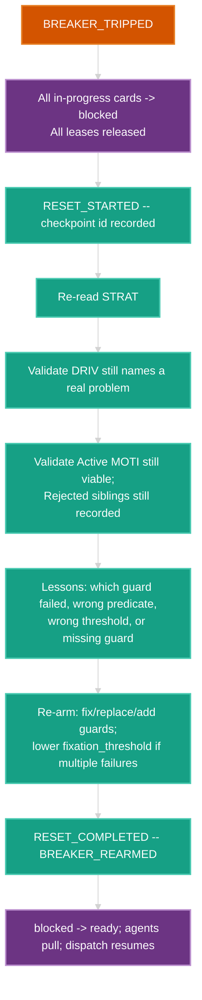

All steps emit events. Reset does not rewrite history; it appends `RESET_*` and `BREAKER_REARMED`.

---

## 5. Deterministic Engine Core

The engine runtime is an event-sourced state machine with a pure transition evaluator. Node types, event kinds, guards, and breakers are loaded from SchemaRegistry and Config. The evaluator has **no compiled-in node list** and **no compiled-in transition table**.

The **one** catalog is a **Stately `machine.json` document** (https://github.com/statelyai/schema). Seed file (normative): `PROJECT_HOME/generic-sdlc-and-engine-readonly/20260818-033649-124680-7266-a219-84d3929f1e0a-catalog.machine.json`. Mermaid diagrams and markdown tables in this spec are **human-only, non-normative views** of that JSON. SchemaRegistry validates the document with the ``jsonschema` 0.52.1 (crates.io max_stable looked up 2026-08-31); exact rev pinned at Cargo.lock generation` crate against the Stately machine schema. The engine interpreter is **generic over validated JSON**.

**FORBIDDEN as catalog or seed executor:** running XState in Rust; using `statig` macros as the catalog; dual SCXML + statig catalog; the `scxml` crate in the engine.

`statig` MIT OSS is allowed **later** as an executor **fed by this JSON**, not as the catalog.

Kanban columns are compound/superstates. TDD states are nested under `in-progress`. That is the same loop zoomed in -- not a second machine. The illegal `NOT_STARTED -> GREEN` / `tdd_not_started` + `TEST_PASS` edge is **absent** from the JSON (not a comment, not a runtime veto-only).

```mermaid
%%{init: {'theme': 'dark'}}%%
flowchart TB
    classDef engine fill:#1a1a2e,color:#e0e0ff,stroke:#8e44ad,stroke-width:2px
    classDef bus fill:#2c3e50,color:#fff,stroke:#85929e,stroke-width:2px
    classDef store fill:#0e6655,color:#fff,stroke:#48c9b0,stroke-width:2px

    subgraph CORE["Engine Core -- Event Sourced"]
        EVT["EventStore SQLite WAL\nappend-only, immutable\none writer OS thread\npartitioned by work_item_id"]:::store
        SM["machine.json StateMachine\nmaterialized from EventStore\nshape from validated JSON"]:::engine
        EVAL["Transition Evaluator\npure: state + event = state-prime\nlookup JSON chart, no match-arms"]:::engine
        TDD["TddGate -- Dispatcher module\ntdd_green_requires_first_failure"]:::engine

        EVT -->|Ordered replay| SM
        SM -->|Current state| EVAL
        EVAL -->|TDD predicate| TDD
        TDD -->|pass or TRANSITION_REJECTED| EVAL
        EVAL -->|submit envelope| EVT
    end

    subgraph REG["Registries -- dynamic, not compiled-in"]
        NR["NodeRegistry"]:::engine
        GR["GuardRegistry"]:::engine
        BR["BreakerRegistry"]:::engine
        SR["SchemaRegistry -- machine.json file + hash"]:::engine
        TR["ResolvedChart -- walk of machine.json"]:::engine
    end

    EVAL -->|Execute| NR
    EVAL -->|Validate| GR
    EVAL -->|Lookup| TR
    EVAL -->|Kind check| SR
    BR -->|Monitor| SM
    BR -->|Trip envelope to Dispatcher| EVT

    style CORE fill:#0a0a1a,stroke:#8e44ad,stroke-dasharray:5 5
    style REG fill:#1a1a1a,stroke:#555,stroke-dasharray:5 5
```

### 5.0 Why this machine stack (verified)

| Crate / artifact | Role | Why it fits | REJECTED for this role |
|---|---|---|---|
| Stately `machine.json` (sibling seed file) | **Catalog.** Parse JSON, validate with `jsonschema`, walk `states`/`on`/`target` | Standard document. Catalog lives as data. `tdd_not_started` has **no** `TEST_PASS` transition -- the illegal edge is absent data | SCXML-as-catalog, `scxml` crate, `statig` macros-as-catalog, XState-in-Rust |
| Generic JSON walker in Dispatcher | Seed executor | `handle(event)` asks the validated document. No 50 match arms | XState runtime; compiling the chart into `statig` source |
| `statig` 0.4.1 | Later optional executor **fed by data** | Hierarchy can express card + TDD | Using it as the catalog; seed MUST NOT require it |
| `smlang`, `rust-fsm` macros | Considered | Good DSLs | Transition lists in source freeze SchemaRegistry |

Seed `machine.json` constraint (binding): state `tdd_not_started` MUST NOT declare a transition on `TEST_PASS` or any alias that would set GREEN. Named guard `tdd_green_requires_first_failure` MUST reject any event that would write `tdd.state=GREEN` when `first-failure` is null. Dispatcher still emits `TRANSITION_REJECTED` so the rejection is an event, not a silent no-op. A catalogued kind with no matching edge is `TRANSITION_REJECTED` (TDD illegal or other forbidden), **not** `UNHANDLED_EVENT`. `UNHANDLED_EVENT` is only for kinds **absent from SchemaRegistry**.

Minimal seed covering RGB + absent illegal TDD edge (non-normative excerpt; the sibling file is SoT):

```json
{
  "key": "sdlcEngine",
  "version": "0.0.5",
  "id": "sdlcEngine",
  "initial": "backlog",
  "states": {
    "in-progress": {
      "initial": "tdd_not_started",
      "states": {
        "tdd_not_started": {
          "on": { "TEST_FAIL": { "target": "tdd_red" } }
        },
        "tdd_red": {
          "on": {
            "TEST_PASS": { "target": "tdd_green", "guard": "{{ context.tdd_first_failure != null }}" },
            "CODE_REGRESSION": { "target": "tdd_red" }
          }
        },
        "tdd_green": {
          "on": {
            "CODE_REGRESSION": { "target": "tdd_red" },
            "INTEGRATION_FLAW": { "target": "#in-progress" }
          }
        }
      },
      "on": {
        "UNFEASIBLE_SCOPE": { "target": "blocked" },
        "BROKEN_REQUIREMENT": { "target": "blocked" },
        "PARADIGM_SHIFT": { "target": "blocked" }
      }
    }
  }
}
```

`TEST_PASS` is not listed under `tdd_not_started`. That absence **is** the illegal-transition rule.

### 5.1 Dispatch Loop and Transition Registry

UNHANDLED_EVENT is only for kinds **absent from SchemaRegistry**. Every kind in section 9 is in the seed SchemaRegistry. Catalogued kinds MUST NOT produce `UNHANDLED_EVENT`.

Alias: `WORK_MERGED` is registered as an alias of `MERGE_ACCEPTED`. Dispatch canonicalizes the kind before lookup. N=1 is a merge point with one child, not a competing lifecycle.

```
loop forever:   # always live -- WaitSet on iceoryx2 + zenoh + TIMER_TICK
    event = event_store.dequeue_next()          # or mesh notification of new seq
    event.kind = SchemaRegistry.canonicalize(event.kind)   # WORK_MERGED -> MERGE_ACCEPTED
    current_state = state_machine.current_for(event.partition_key)

    if event.kind not in SchemaRegistry:
        emit(UNHANDLED_EVENT, event)
        continue

    transition = ResolvedChart.effective(current_state, event.kind)
    if transition is None:
        emit(UNHANDLED_EVENT, event)   # only if registry lagged schema -- treat as defect
        continue

    if TddGate.illegal(current_state, event):
        emit(TRANSITION_REJECTED, reason="TDD_GATE", event)
        continue

    if not transition.guard(current_state, event):   # SCXML named guards
        emit(TRANSITION_REJECTED, transition, event)
        continue

    for guard in GuardDaemon.guards_for(transition, current_state):
        result = guard.predicate(current_state, event)
        if result == BLOCK:
            emit(GUARD_BLOCKED, guard, transition, event)
            goto loop
        elif result == REDIRECT:
            event = redirect_event(guard.redirect_to, event)
            goto loop
        elif result == ESCALATE:
            emit(GUARD_ESCALATED, guard, transition, event)
            goto loop

    next_state = chart.apply(current_state, transition, event)   # pure
    accepted = Dispatcher.submit_to_eventstore(TRANSITION_COMMITTED, ...)  # ONLY append API
    # EventStore actor: BEGIN IMMEDIATE; insert; COMMIT; THEN iceoryx2 notify(seq)
    state_machine.update(next_state)
    KanbanProjector.apply(seq)   # keyed by commit seq; then FS mv; repair-on-replay
    Scheduler.recompute(affected_cards(event))    # Dispatcher policy module, live, no batch
    maybe_egress(event)                           # zenoh if egress-class

    for breaker in BreakerRegistry.active():
        if breaker.check(next_state):
            breaker.trip()
            emit(BREAKER_TRIPPED, breaker, next_state)
```

TddGate.illegal is true when the event would set `tdd.state = GREEN` and either `tdd.state` is `NOT_STARTED` or `tdd.first-failure` is null.

#### Transition registry seed (every catalogued kind)

Section 5.1 tables are **NON-NORMATIVE views** of the seed `machine.json` (sibling file `20260818-033649-124680-7266-a219-84d3929f1e0a-catalog.machine.json`). The JSON is the catalog. If a table row disagrees with the JSON, the JSON wins. CONFLICT is not a column; `WORK_CONFLICTED` projects to `blocked`.

**Work**

| Kind | From (card) | To (card) | Predicate / effect |
|---|---|---|---|
| `WORK_CREATED` | (none) | `backlog` | Mint card bound to node. Node stays IDLE. |
| `WORK_DECOMPOSED` | parent any | children `backlog` or `ready` | Inject child cards. Parent MAY stay `in-progress`. |
| `WORK_STARTED` | `ready` | `in-progress` | Exclusive lease acquired. Same commit MAY include `WORK_CLAIMED`. Node IDLE -> ACTIVE. |
| `WORK_CLAIMED` | `ready` | `in-progress` | Exclusive lease on card+subtree. Second claim -> `TRANSITION_REJECTED`. |
| `WORK_RELEASED` | `in-progress` | `ready` | Lease released. Owner cleared. |
| `WORK_COMPLETED` | `in-progress` | `review` | Artifacts attached. Does **not** enter `done`. |
| `WORK_BLOCKED` | any except `done` | `blocked` | Guard, dep, merge, or external wait. |
| `WORK_UNBLOCKED` | `blocked` | `ready` | Cause cleared. If lease still valid, MAY return to `in-progress`. |
| `WORK_CONFLICTED` | `review` or `in-progress` | `blocked` | Overlapping-write attempt or lease collision. Hub does not merge files. |
| `WORK_MERGED` | (alias) | (alias) | Canonicalize to `MERGE_ACCEPTED`. |

**Merge (one lifecycle)**

| Kind | From | To | Predicate / effect |
|---|---|---|---|
| `MERGE_READY` | children in `review` (or TDD state matching `required_state`) | parent eligible; parent card `queue` | All `child_cards` reached `required_state`. |
| `MERGE_BLOCKED` | parent any | parent `blocked` | Missing child, unmet dep, or child `blocked`. |
| `MERGE_ACCEPTED` | parent `review` or `verification` | parent `done` or `integrated` | Sync invariant holds. N=1 degenerate is this event (not a second path). Unblocks dependents. |
| `MERGE_REJECTED` | parent `active-merge` or `verification` | parent `blocked`; children MAY `in-progress` | Sync invariant failed. |
| `RECONCILE_PARENT` | `TBD-RECONCILE` links | real `filename-id` | Hub-only. After `MERGE_READY`, before or as evidence of `MERGE_ACCEPTED`. |

**TDD / process**

| Kind | TDD effect | Card effect |
|---|---|---|
| `TEST_FAIL` | `NOT_STARTED\|GREEN\|REFACTOR -> RED`; stay RED. Set `first-failure` if null. Increment `iterations`. | Stay `in-progress` or `WORK_BLOCKED`. |
| `TEST_PASS` | `RED -> GREEN` or stay `GREEN\|REFACTOR`. **Rejected** if `NOT_STARTED` or `first-failure` null. | MAY `in-progress -> review` when acceptance met. |
| `SPEC_WRONG` | SPEC TDD MAY return to RED; do not silently rewrite the test to match a bad spec. | SPEC card `in-progress` or `blocked`. |
| `FEAT_WRONG` | Parent FEAT re-entered. SPECs MAY stay GREEN (they were right). | FEAT card `in-progress` or `blocked`. Mint GAP cards as needed. |
| `GAP_DISCOVERED` | none directly | New cards in `backlog`/`ready`. |
| `PROCESS_DEFECT` | none | Card against engine process docs. Meta zoom. |
| `TEMPLATE_DEFECT` | none | Card against templates. Meta zoom. |
| `SYNC_VIOLATION` | none | Merge point MUST NOT accept. MAY `MERGE_BLOCKED` or `MERGE_REJECTED`. |

**RGB (mid zoom)**

| Kind | Target node | Card effect |
|---|---|---|
| `CODE_REGRESSION` | SPEC | SPEC `in-progress` or `blocked`. TDD `GREEN\|REFACTOR -> RED`. |
| `INTEGRATION_FLAW` | FEAT and ARCH | Those cards `in-progress` or `blocked`. Count toward 2-redesign bound. |
| `UNFEASIBLE_SCOPE` | MOTI | Active MOTI `Exhausted` or `Rejected`. Sibling MAY become Active. |
| `BROKEN_REQUIREMENT` | DRIV | DRIV re-entered. Alternative framings guard fires. |
| `PARADIGM_SHIFT` | STRAT | STRAT re-entered. Strategy sunset/assumption audit fire. |

**External**

| Kind | Effect |
|---|---|
| `STRATEGIC_PIVOT` | Ingress onto STRAT. Create or move STRAT/DRIV cards. |
| `PROBLEM_SIGNAL` | Ingress onto DRIV. Create or move DRIV cards. |
| `USER_REPORT` | Create or move a bound card. MAY emit `PROBLEM_SIGNAL`. |
| `ATTACKER_SIGNAL` | Create or escalate. MAY emit `SECURITY_DISCLOSURE`. |
| `SECURITY_DISCLOSURE` | P0 card. MAY `WORK_BLOCKED` related nodes. |

**Guards / breakers / engine / harvest / learning / timer / mesh / watchdog**

| Kind | Effect |
|---|---|
| `GUARD_PASSED` | Increment `consecutive_passes`. |
| `GUARD_BLOCKED` | Transition aborted. Card MAY `blocked`. |
| `GUARD_REDIRECTED` | Event re-routed; dispatch restarts with new event. |
| `GUARD_ESCALATED` | Escalation handler; MAY emit RGB event. |
| `FIXATION_DETECTED` | Force-fired guard. Counter reset. |
| `BREAKER_TRIPPED` | All affected `in-progress` -> `blocked`. `RESET_STARTED`. |
| `BREAKER_REARMED` | Guards updated. |
| `RESET_STARTED` | Checkpoint. Nodes RESET. |
| `RESET_COMPLETED` | `blocked` -> `ready`. Dispatch resumes. |
| `UNHANDLED_EVENT` | Dead-letter candidate. Never for seed catalog kinds. |
| `TRANSITION_REJECTED` | No state change. Includes illegal TDD and second claim. |
| `TRANSITION_COMMITTED` | State+projection applied. Idempotent projectors key on this id. |
| `TIMER_TICK` | TimerDaemon only. Never a cron that bypasses the mesh. Default action is no-op commit so the kind is handled. |
| `HARVEST_DETECTED` | Card in `backlog` (harvest partition). |
| `LIB_EXTRACTED` | Registry updated. Consumers retargeted by new cards, not hub file-merge. |
| `SERVICE_PROMOTED` | Maturity gate passed. |
| `SDLC_SPAWNED` | Child engine instance starts. Same event grammar. Parent holds board-proxy. |
| `LEARNING` | `class` EFFICIENCY or CAPABILITY; `action` CREATE, REVISE, or RETIRE. |
| `MEMORY_CONTRADICTION` | P2 sidecar proposal. Dispatcher MAY mint a card. Watchdog does not call a model. |
| `MESH_JOIN` | iceoryx2 service appeared or zenoh liveliness token put. |
| `MESH_LEAVE` | Service gone or liveliness token dropped. |
| `MESH_EGRESS` | Parent-visible wrapper of a child event. |
| `MESH_INGRESS` | Local append of a child egress. |
| `AGENT_CARD_PUBLISHED` | A2A agent card reachable (sidecar or human adapter). Produced by A2AGateway. |
| `AGENT_CARD_REVOKED` | Card URL dead or liveliness lost. Produced by A2AGateway. |
| `WATCHDOG_STALL` | After 2: `WORK_BLOCKED` reason=stall. |
| `WATCHDOG_THRASH` | Kill worker; no auto-GREEN. |
| `WATCHDOG_AI_STORM` | Token/loop storm. SIGKILL. Card `ready`/`blocked`. |
| `WATCHDOG_PATH_VIOLATION` | Write outside `owned_subtree`. SIGKILL. `WORK_CONFLICTED`. |
| `WATCHDOG_HANG` | Heartbeat fd silent. Lease expire. |
| `WATCHDOG_OSCILLATION` | Flip-flop `MERGE_REJECTED` without new evidence. |
| `FORK_ORPHAN` | Branch/process with no live lease. `blocked`; no merge of orphan work. |

### 5.2 Determinism Guarantees

| Property | Guarantee | Mechanism |
|---|---|---|
| Same input, same output | Given event log L, state is always S | Event sourcing + pure evaluator + ResolvedChart |
| Total ordering per item | Events for work item X always ordered | Partition key = `work_item_id` |
| Happens-before across parent/child | Child `MERGE_*` visible to parent partition before parent evaluates | parent_id correlation + zenoh egress copy (section 12.5) |
| Replayable | Any past state reconstructable | Append-only EventStore + snapshots |
| Auditable | Every decision traceable | Event log is the audit log |
| Recoverable | Any checkpoint restorable | Snapshot + replay from sequence number |
| No hidden state | All state in EventStore | No globals, no side channels |
| Guard convergence | Fixation detection guaranteed | `consecutive_passes` with hard ceiling |
| TDD honesty | No GREEN without recorded RED | `machine.json` missing edge + TddGate + `first-failure` |

---

## 6. Parallel Execution -- One Orchestrator, One Kanban, One Ownership

Multiple agents work concurrently on different work items. The star hub is the **orchestrator** (Dispatcher + iceoryx2 mesh + zenoh egress + agent pool + DAG). It is not a second kanban.

There is **one** kanban. Feature A and Feature B are **partitions** of the same column set, keyed by `owned_subtree`. Harvest candidates live in the same columns with a harvest partition key. They are not separate products.

```mermaid
%%{init: {'theme': 'dark'}}%%
flowchart TB
    classDef hub fill:#1a252f,color:#fff,stroke:#c0392b,stroke-width:3px
    classDef agent fill:#1e8449,color:#fff,stroke:#2ecc71,stroke-width:2px
    classDef kanban fill:#6c3483,color:#fff,stroke:#bb8fce,stroke-width:2px
    classDef feat fill:#2980b9,color:#fff,stroke:#1a5276,stroke-width:2px
    classDef arch fill:#8e44ad,color:#fff,stroke:#6c3483,stroke-width:2px
    classDef merge fill:#d35400,color:#fff,stroke:#f5b041,stroke-width:2px
    classDef bus fill:#2c3e50,color:#fff,stroke:#85929e,stroke-width:2px
    classDef engine fill:#1a1a2e,color:#e0e0ff,stroke:#8e44ad,stroke-width:2px

    subgraph STAR["Star topology -- orchestrator, not a second board"]
        HUB["ENGINE HUB -- orchestrator\nevent order, card mv, parent reconcile,\nmerge-point evaluation, live scores\nNEVER executes work\nNEVER content-merges files"]:::hub

        subgraph MESH["Named mesh -- not a god broker"]
            IOX["iceoryx2 -- same-host daemons"]:::bus
            ZEN["zenoh -- child engines / board-of-boards"]:::bus
            A2A["A2A -- sidecar agents"]:::bus
        end

        subgraph AGENTS["Agent Pool -- exclusive lease on card + subtree"]
            direction LR
            A1["Agent 1 -- owns FEAT subtree A"]:::agent
            A2["Agent 2 -- owns ARCH subtree"]:::agent
            A3["Agent 3 -- A2A sidecar"]:::agent
        end

        subgraph KANBAN["ONE workstream kanban -- partitions by owned_subtree"]
            direction LR
            C0["backlog"]:::kanban
            C1["ready"]:::kanban
            C2["in-progress"]:::kanban
            C3["blocked"]:::kanban
            C4["review"]:::kanban
            C5["done"]:::kanban
            C0 --> C1 --> C2
            C2 --> C3
            C3 --> C1
            C2 --> C4
            C4 --> C5
        end

        subgraph MERGECOLS["Merge-point columns -- same board, fan-in only"]
            direction LR
            Q["queue"]:::merge
            AM["active-merge"]:::merge
            VER["verification"]:::merge
            INT["integrated"]:::merge
            Q --> AM --> VER --> INT
        end

        subgraph SHARED["DAG + component registry"]
            CR["Component Registry -- owners, dependents, usage"]:::engine
            DG["Dependency Graph -- parallelism = DAG width"]:::engine
        end
    end

    HUB -->|Decompose WORK_DECOMPOSED| C0
    C1 -->|pull if no owner| A1 & A2 & A3
    A1 & A2 & A3 -->|events| IOX
    IOX -->|route by service name| A1 & A2 & A3
    IOX --> HUB
    ZEN -.->|egress MERGE_ACCEPTED LEARNING| HUB
    A2A --> A3
    C4 -->|fan-in| Q
    HUB -->|evaluate merge point| AM
    HUB -->|Update| CR
    HUB -->|Resolve| DG
    DG -->|Unblock WORK_UNBLOCKED| C1

    style STAR fill:#0a0a1a,stroke:#555,stroke-dasharray:5 5
    style MESH fill:#1a1a1a,stroke:#85929e,stroke-dasharray:5 5
    style AGENTS fill:#0a200a,stroke:#27ae60,stroke-dasharray:5 5
    style KANBAN fill:#1a0a2a,stroke:#8e44ad,stroke-dasharray:5 5
    style MERGECOLS fill:#201500,stroke:#e67e22,stroke-dasharray:5 5
    style SHARED fill:#0a0a1a,stroke:#8e44ad,stroke-dasharray:5 5
```

### 6.1 Roles

| Role | Responsibility | Constraint |
|---|---|---|
| Hub (orchestrator) | Decompose, route, aggregate, evaluate merge points, emit `RECONCILE_PARENT`, trigger harvest detection, walk DAG, live-score cards | Never executes work. Never content-merges files. Never holds an exclusive write lease on SPEC/test/impl bodies. |
| Agent | Claim from `ready` with no owner, execute inside owned subtree, emit completion and test events. AI agents are A2A sidecars. | Exclusive lease on one card and its `owned_subtree`. WIP limit. Steal only from `ready` with no owner. |
| iceoryx2 mesh | Same-host daemon pub-sub. Partitioned notify. At-least-once via EventStore seq. | No central iceoryx daemon. Service names only. |
| zenoh mesh | Child-engine egress/ingress, liveliness, scout from initial locator | Not a company bus. Peer mode + gossip. |
| A2A | Sidecar <-> orchestrator and agent <-> agent | MCP forbidden. Agent cards, not a registry service. |
| Kanban | One board. Columns: `backlog`, `ready`, `in-progress`, `blocked`, `review`, `done`. Merge-point columns: `queue`, `active-merge`, `verification`, `integrated`. | Partitions = `owned_subtree` keys. Directory `mv` is a projection of events. |
| DAG | Parallelism = width. On `MERGE_ACCEPTED`, walk and `WORK_UNBLOCKED`. | Parent partition subscribes by `parent_id`, not a global lock. |
| Component Registry | Track shared components, usage, harvest candidates | Conflict = two leases on one file = `WORK_CONFLICTED` / `TRANSITION_REJECTED`, not a merge. |

Filesystem column names are those already defined by GenericWorkstreamKanbanEngine. Engine enums map 1:1 onto those names.

### 6.2 Work-item lifecycle (flowchart -- high contrast)

Kanban column is the primary state. TDD is the **same loop zoomed into** `in-progress` on the bound SPEC. CONFLICT is not a state and not a board; `WORK_CONFLICTED` projects to `blocked`. `review -> done` only through `MERGE_ACCEPTED` (N=1 is the degenerate merge).

Grey = not pullable. Dark green = pullable. Navy = leased work. Maroon = blocked. Pumpkin = merge path. Teal = done. TDD zoom uses its own classDefs (slate / bright red / lime / amethyst) and MUST NOT reuse the `wip` class for `NOT_STARTED`.

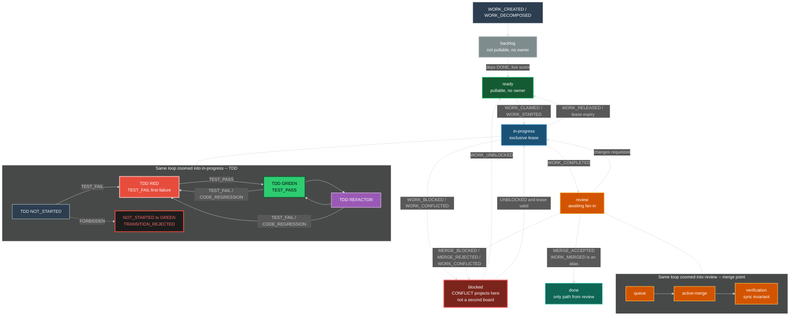

### 6.3 Exclusive ownership (the only ownership model)

Local-copy optimistic merge is **forbidden**. The hub never content-merges files.

| Rule | Meaning |
|---|---|
| Exclusive card | One agent owns one card. Null owner only in `backlog` or `ready`. |
| Exclusive subtree | One agent owns one FEAT or ARCH subtree. Child SPEC files of that subtree are that agent's to write. |
| No overlapping files | Two agents MUST NOT write the same file. Isolation is the lease, not merge-of-edits. |
| Claim | `IAgent.claim` takes a TTL lease (Lease/Lock daemon). Second claim -> `TRANSITION_REJECTED`. |
| Steal | Only from `ready` with no owner. Never from `in-progress`. |
| Lease expiry | Card returns to `ready` (if no block reason) or `blocked`. Work is not "kept" by a dead worker. |
| Hub writes | Event order, card `mv`, `parent:` reconcile, merge-point evaluation. Nothing else. |
| Spawn budget | `spawn_budget(depth) = floor(8 / 2^depth)`. Depth 4 is a hard stop. Circuit-break worker spawn on budget exhaustion. |

### 6.4 Cards, columns, TDD

A card is an `IWorkItem` materialized as a kanban file bound to exactly one tree node via `filename-id`. Moving a card is an event; the directory `mv` is the durable projection.

| Kanban column | `IWorkItem.state` | Node state | Typical TDD | Notes |
|---|---|---|---|---|
| `backlog` | `BACKLOG` | `IDLE` | `NOT_STARTED` | Not pullable. No owner. |
| `ready` | `READY` | `IDLE` | `NOT_STARTED` or `RED` | Pullable. No unmet deps. No owner. |
| `in-progress` | `IN_PROGRESS` | `ACTIVE` or `DEGRADED` | `RED`, `GREEN`, or `REFACTOR` | Exclusive owner required. |
| `blocked` | `BLOCKED` | `BLOCKED` or `RESET` | Frozen (any TDD) | Guard, unmet dep, `MERGE_BLOCKED`, `WORK_CONFLICTED`, breaker. |
| `review` | `REVIEW` | `ACTIVE` or `DEGRADED` | `GREEN` (or `REFACTOR` if review is the refactor pass) | Awaiting merge-point. |
| `done` | `DONE` | `DONE` | `GREEN` after any required `REFACTOR` | Only via `MERGE_ACCEPTED`. |
| `queue` | (merge parent) | `ACTIVE` | n/a | Merge-point column. |
| `active-merge` | (merge parent) | `ACTIVE` | n/a | Merge-point column. WIP typically 1. |
| `verification` | (merge parent) | `ACTIVE` | n/a | Sync invariant + tests. |
| `integrated` | (merge parent) | `DONE` | n/a | Fan-in accepted. |

Illegal: card to `review` or `done` on TDD GREEN unless `first-failure` was recorded.

### 6.5 Merge points (the only merge story)

A merge point is an explicit fan-in barrier: N child workstreams must reach a declared state before the parent FEAT or ARCH card may leave `review` for `done` (or occupy merge-point columns through to `integrated`).

N=1 is degenerate: a single child reaching `review` with sync invariant true emits `MERGE_READY` then `MERGE_ACCEPTED`. That is what 0.0.1 called `WORK_MERGED`. It is the same lifecycle.

| Event | When | Parent card |
|---|---|---|
| `MERGE_READY` | Every listed child reached `required_state` | Eligible. `review`/`queue` -> `active-merge`. |
| `MERGE_BLOCKED` | A child missing, `in-progress`, or `blocked` | `blocked`. |
| `MERGE_ACCEPTED` | Sync invariant holds. Evidence includes `RECONCILE_PARENT` if any `TBD-RECONCILE` existed | `done` / `integrated`. Dependents unblocked. |
| `MERGE_REJECTED` | Sync invariant fails | Does not advance. Children MAY return to `in-progress` or `blocked`. |

**Sync invariant (MUST hold for `MERGE_ACCEPTED`):**

```
SPEC document  ==  test file / assertions  ==  implementation  ==  process and templates
```

Mismatch in any pair is `SYNC_VIOLATION` and `MERGE_REJECTED`.

**What is merged:** card status, `parent:` / `sdlc-refs` links, test evidence. **What is not merged:** overlapping file edits. If two agents would need to write the same file, the lease model already failed; emit `WORK_CONFLICTED`.

Reconciliation: `parent: TBD-RECONCILE` is legal **only across ownership boundaries**. Inside one owned subtree, `parent:` MUST be a real `filename-id`. After `MERGE_READY`, ParentReconciler (hub, not child agents) replaces `TBD-RECONCILE` and emits `RECONCILE_PARENT`. That is link repair, not a rewrite of SPEC/test/impl bodies.

`required_state` examples: all child SPECs TDD RED; all child SPECs TDD GREEN and sync invariant; all child cards in `review` or `done`.

### 6.6 Concurrency model

| Property | Mechanism |
|---|---|
| Event ordering | Partition by `work_item_id`; parent merge partition correlating `parent_id` |
| Conflict | Exclusive lease. No local-copy hub merge. Collision -> `TRANSITION_REJECTED` or `WORK_CONFLICTED` -> `blocked` |
| WIP limits | Per-agent and per-column, enforced at `claim()` |
| Dependency unblocking | DAG walk on `MERGE_ACCEPTED` |
| Work stealing | Idle agent claims from `ready` with no owner only |
| Deterministic replay | Append-only store, replay in partition order |
| Idempotent projection | Projectors key on `TRANSITION_COMMITTED` id |

---

## 7. Harvesting -- Same Loop at Instance / Board-of-Boards Zoom

Harvest is **not** a different kind of process. Zoom out from a SPEC card and the same observe-decide-act-emit-project cycle is looking at usage, duplication, and coupling. When a threshold crosses **on a live event** (not a nightly scan), the engine mints a harvest card on the **same** kanban. Extract, promote, and spawn are cards that go `ready` -> `in-progress` -> `review` -> `MERGE_ACCEPTED`. A child engine is a board-proxy card: zoom in and you are in the child's one kanban.

```mermaid
%%{init: {'theme': 'dark'}}%%
flowchart TB
    classDef backlog fill:#7f8c8d,color:#fff,stroke:#d5d8dc,stroke-width:2px
    classDef ready fill:#145a32,color:#fff,stroke:#2ecc71,stroke-width:2px
    classDef wip fill:#1a5276,color:#fff,stroke:#5dade2,stroke-width:2px
    classDef review fill:#d35400,color:#fff,stroke:#f5b041,stroke-width:2px
    classDef done fill:#0e6655,color:#fff,stroke:#48c9b0,stroke-width:2px
    classDef spawn fill:#1e8449,color:#fff,stroke:#2ecc71,stroke-width:3px

    subgraph SAME["Same loop -- instance zoom"]
        D1["usage / dup / coupling\nupdated on TRANSITION_COMMITTED"]:::backlog
        H["HARVEST_DETECTED card\nsame board, harvest partition"]:::ready
        E["EXTRACT_LIB card in-progress"]:::wip
        P["SERVICE_PROMOTED card review"]:::review
        SP["SDLC_SPAWNED -- child engine\nboard-proxy on parent board"]:::spawn
        D1 -->|live threshold| H --> E --> P --> SP
    end

    SP -.->|child runs SPEC-zoom TDD on its own board| SP
```

### 7.1 Harvesting Thresholds (live)

| Metric | Threshold | Action |
|---|---|---|
| `usage_count` | > 3 nodes referencing same component | Candidate for EXTRACT_LIB |
| `duplication_ratio` | > 40% AST similarity across 2+ agents | Candidate for EXTRACT_LIB |
| `cross_boundary_coupling` | Shared interface across 2+ FEAT or ARCH nodes | Candidate for EXTRACT_LIB |
| `lib_stable_cycles` | > 5 cycles with no API change | Promote to EXTRACT_SERVICE |
| `service_health` | SLA met for 10 cycles | Spawn child SDLC instance |

Thresholds live in Config. HarvestDaemon subscribes to `TRANSITION_COMMITTED` and registry updates on iceoryx2. It does **not** scan on a nightly batch.

### 7.2 Spawn Semantics

When a component is promoted to a service and spawns a child SDLC:

1. A new `STRAT` is created for the service (new engine instance).
2. The child inherits guard and breaker **definitions** from parent, with independent thresholds and its own EventStore SQLite.
3. The child gets its own **one** kanban, backlog column, agent pool, and **own iceoryx2** domain (service-name prefix `sdlc.{child_instance}.*`). That board belongs to the child; it is not a second board of the parent.
4. Parent DAG updated: component node replaced with a service-dependency work item (board-proxy card).
5. Parent and child communicate via API contracts plus zenoh egress, not shared code and not hub file-merge.
6. Child lifecycle is fully independent -- own SPEC-zoom TDD, own RGB, own harvest, own spirals, own breaker trips, own resets. Egress from the child MAY ingress the parent as `MESH_INGRESS` wrapping `PROBLEM_SIGNAL`, `LEARNING`, `MERGE_ACCEPTED`, `BREAKER_TRIPPED`, or `MEMORY_CONTRADICTION`.
7. The parent orchestrator does **not** schedule the child's cards. It scores the **proxy**. Rendezvous is event correlation at egress, not a thread-join into the child EventStore.
8. Depth: `spawn_budget(depth) = floor(8 / 2^depth)`, hard stop at depth 4. Each level has its own Watchdog (section 15).
9. Child starts with **one initial locator** pointing at the parent zenoh peer (section 12.2). Scout/gossip finds siblings. No consul.

### 7.3 Board of boards

When `SDLC_SPAWNED` fires, the parent kanban gains one card whose `owned_subtree` is the child's STRAT `filename-id` and whose type is `board-proxy`. That card moves on the **parent** board (`in-progress` while the child is ACTIVE, `blocked` if the child's breaker trips, `review` when the child emits a contract-ready egress, `done` when the parent accepts the contract). Zoom into that card and you are in the child's one kanban. Zoom out and it is one row. Same loop.

---

## 8. Interface Contracts

Every engine component implements the contract for its role. Registries are dynamic.

### 8.1 INode -- SDLC Artifact Node

| Field | Type | Description |
|---|---|---|
| `id` | `string` | Unique node identifier (`filename-id`) |
| `type` | `enum` | `STRAT`, `DRIV`, `MOTI`, `FEAT`, `ARCH`, `SPEC` |
| `parent` | `string?` | Containment. Null only for STRAT. |
| `status` | `enum` | For MOTI: `Active`, `Rejected`, `Exhausted`. Others MAY use generic status. |
| `state` | `enum` | `IDLE`, `ACTIVE`, `BLOCKED`, `DEGRADED`, `RESET`, `DONE` |
| `tdd` | `object` | `{state, test-file, first-failure, iterations}` -- required on every INode |
| `enter()` | `fn(state, event) -> side_effects` | Deterministic action on state entry (guards fire here) |
| `exit()` | `fn(state, event) -> side_effects` | Deterministic action on state exit |
| `valid_transitions` | `list[ITransition]` | From ResolvedChart, not a compiled list |
| `guards` | `list[IGuard]` | Registered inline guards |
| `metrics` | `dict[string, numeric]` | Observable measurements for breakers |
| `work_items` | `list[IWorkItem]` | Associated cards |

`type` does not include `TEST`. L5 is `tdd.test-file`.

### 8.2 IGuard -- Anti-Fixation Guard

| Field | Type | Description |
|---|---|---|
| `id` | `string` | Guard identifier |
| `node_id` | `string` | Which node this guards |
| `predicate()` | `fn(state, event) -> bool` | Pure function: should this guard fire? |
| `action` | `enum` | `PASS`, `BLOCK`, `REDIRECT`, `ESCALATE` |
| `redirect_to` | `string?` | Target node if REDIRECT |
| `cooldown` | `duration` | Minimum time between firings |
| `consecutive_passes` | `int` | Resets on fire, increments on pass |
| `fixation_threshold` | `int` | Hard ceiling: force fire when exceeded |

### 8.3 IBreaker -- Emergency Circuit Breaker

| Field | Type | Description |
|---|---|---|
| `id` | `string` | Breaker identifier |
| `monitors` | `list[metric_id]` | Metrics to watch |
| `threshold` | `numeric` | Trip point |
| `window` | `duration` | Evaluation window |
| `trip()` | `fn(state) -> RESET_event` | Force transition to RESET |
| `rearm()` | `fn(lessons_learned) -> guard_updates` | Restore guards with fixes |
| `tripped` | `bool` | Current breaker state |

### 8.4 ITransition -- State Transition

| Field | Type | Description |
|---|---|---|
| `from_state` | `(node_id, state)` | Source node + state |
| `to_state` | `(node_id, state)` | Target node + state |
| `event` | `string` | Triggering event kind (canonical) |
| `predicate()` | `fn(state, event) -> bool` | Must return true to fire |
| `action()` | `fn(state, event) -> state_prime` | Pure function: compute next state |
| `guards` | `list[IGuard]` | All must PASS before commit |

Loaded from validated `machine.json` (generic JSON walker). Not a compiled match table. Not XState. Not a `statig` macro machine.

### 8.5 IWorkItem -- Unit of Parallel Work (a card)

| Field | Type | Description |
|---|---|---|
| `id` | `string` | Unique work item ID |
| `node_ref` | `string` | Bound INode |
| `state` | `enum` | `BACKLOG`, `READY`, `IN_PROGRESS`, `REVIEW`, `DONE`, `BLOCKED` |
| `column` | `enum` | `backlog`, `ready`, `in-progress`, `blocked`, `review`, `done`, plus merge-point `queue`, `active-merge`, `verification`, `integrated` |
| `assigned_to` | `string?` | Agent ID or null (`backlog`/`ready` only) |
| `owned_subtree` | `string?` | Partition key and exclusive subtree root |
| `lease` | `ILease?` | TTL lease, not a forever lock |
| `dependencies` | `list[work_item_id]` | Must be DONE before READY |
| `priority_score` | `f64` | Live. Recomputed on every affecting event. Higher wins. |
| `merge_point` | `string?` | `IMergePoint.id` if fan-in child or parent |
| `created_by` | `event_id` | Traceable to originating event |
| `artifacts` | `list[artifact_ref]` | Output artifacts produced |

There is no `CONFLICT` state. There is no `kanban_board` id selecting among multiple boards. Integer `priority` from 0.0.3 is this score's rank alias only.

### 8.6 IAgent -- Autonomous Worker

| Field | Type | Description |
|---|---|---|
| `id` | `string` | Agent identifier |
| `type` | `enum` | `HUMAN`, `AI_SIDECAR`, `SCANNER`, `AUTOMATED` |
| `a2a_card_url` | `string?` | A2A agent-card URL. Required for `AI_SIDECAR`. |
| `capabilities` | `list[node_type]` | What node types this agent can work. Grown by discovery, not a freeze. |
| `current_work` | `list[work_item_id]` | Active items |
| `wip_limit` | `int` | Max concurrent items |
| `depth` | `int` | Nesting depth for `spawn_budget` |
| `claim(item)` | `fn -> bool` | Take TTL exclusive lease. False if owned or not `ready`. |
| `release(item)` | `fn` | Release lease; card to `ready` or `blocked` |
| `complete(item, artifacts)` | `fn` | Emit `WORK_COMPLETED` |

Workers MAY run inside bwrap in deployments that have it. The generic engine MUST NOT require bwrap. AI workers are **A2A sidecars** (section 12.6). MCP is not a legal `type` and not a transport.

### 8.7 IKanban -- The Single Board

| Field | Type | Description |
|---|---|---|
| `id` | `string` | Board identifier (one per engine instance) |
| `columns` | `ordered list` | `backlog`, `ready`, `in-progress`, `blocked`, `review`, `done` |
| `merge_columns` | `ordered list` | `queue`, `active-merge`, `verification`, `integrated` |
| `wip_limits` | `dict[column, int]` | Per-column WIP limits |
| `partitions` | `dict[owned_subtree, items]` | Same columns, keyed by subtree |
| `pull(agent)` | `fn -> IWorkItem?` | Highest `priority_score` `ready` with no owner matching capabilities |

`IBacklog` is the prioritized view of the `backlog` column, not a second product.

### 8.8 IMergePoint -- Fan-In Barrier

| Field | Type | Description |
|---|---|---|
| `id` | `string` | Merge-point identifier |
| `parent_card` | `filename-id` | Parent FEAT or ARCH card |
| `child_cards` | `list[filename-id]` | Workstream cards that must arrive |
| `required_state` | `predicate` | Example: all child SPECs RED; or all GREEN plus sync invariant |
| `sync_invariant` | `fn -> bool` | `SPEC == test == impl == process/template` |
| `state` | `enum` | `OPEN`, `ARMED`, `READY`, `BLOCKED`, `ACCEPTED`, `REJECTED` |
| `ownership_boundary` | `bool` | If true, child `parent:` MAY be `TBD-RECONCILE` until `RECONCILE_PARENT` |

CAS on the single EventStore writer thread. Multi-instance competing consumers on one `eventstore.sqlite` are FORBIDDEN.

### 8.9 IMesh -- Named IPC (replaces generic IEventBus)

There is no generic event bus and no god broker process that owns topology. Dead-letter is the **DeadLetter daemon**, not a field on the bus.

| Field | Type | Description |
|---|---|---|
| `publish_local(seq)` | `fn` | iceoryx2 notify subscribers on this host **after** EventStore commit. Payload is seq + kind + partition. |
| `publish_egress(event)` | `fn` | zenoh put for egress-class kinds to parent/siblings |
| `subscribe_local(service, handler)` | `fn` | iceoryx2 subscriber on a **service name** `sdlc.{instance}.{daemon}.{kind}` |
| `subscribe_egress(keyexpr, handler)` | `fn` | zenoh keyexpr `sdlc/{parent}/egress/{child}/{kind}` |
| `cursor` | `EventStore seq` | At-least-once cursor. Replay is from EventStore, not from the mesh. |
| `partitioned_by` | `field` | `work_item_id` and, for merge, `parent_id` |
| `delivery` | `enum` | `AT_LEAST_ONCE` (EventStore seq is the cursor) |
| `replay(from_seq)` | `fn -> event_stream` | Replay from EventStore |

**iceoryx2 service names (seed):** `sdlc.{instance}.eventstore.notify`, `sdlc.{instance}.dispatcher.envelope`, `sdlc.{instance}.kanban.apply`, `sdlc.{instance}.watchdog.probe`, `sdlc.{instance}.a2a.task`, `sdlc.{instance}.timer.tick`.

**zenoh keyexpr (seed):** `sdlc/{instance}/alive/engine/{id}`, `sdlc/{parent}/egress/{child}/{kind}`, `sdlc/{instance}/a2a/cards/{id}`.

**One producer per join/leave kind:** `MESH_JOIN`/`MESH_LEAVE` = DiscoveryDaemon only. `AGENT_CARD_PUBLISHED`/`AGENT_CARD_REVOKED` = A2AGateway only. `TIMER_TICK` = TimerDaemon only. Engine never emits `INFERENCE_*`.

Poison / undeliverable envelopes go to the **DeadLetter** daemon sqlite, not an `IMesh.dead_letter_queue` list.

### 8.10 IDiscovery -- Initial locator only

| Field | Type | Description |
|---|---|---|
| `initial_locator` | `string` | The only bootstrap. Format in section 12.2. |
| `scout()` | `fn` | zenoh scout/gossip and/or iceoryx2 service tracker. Not a registry RPC. |
| `on_join(entity)` | `fn` | DiscoveryDaemon emits `MESH_JOIN` only. A2AGateway emits `AGENT_CARD_PUBLISHED`. One producer per kind. |
| `on_leave(entity)` | `fn` | DiscoveryDaemon emits `MESH_LEAVE` only. A2AGateway emits `AGENT_CARD_REVOKED`. No `INFERENCE_*`. |

Forbidden: consul, etcd, eureka, a compiled peer list, a company MQTT broker as the discovery plane.

### 8.11 IA2ASidecar -- Generic AI agent runtime

| Field | Type | Description |
|---|---|---|
| `agent_card` | `A2A AgentCard` | Official A2A card (skills, URL, auth). Published on join. |
| `send_task(card, message)` | `fn` | A2AGateway (the only core `a2a-rs-client`) sends JSON-RPC/REST after lease. AgentPool does not link A2A crates. |
| `stream_events()` | `fn` | A2A SSE/task events become engine envelopes to Dispatcher. |
| `inference` | `IInference?` | Sidecar-local OpenAI-compat locator inside the one sidecar binary. Not an engine event. Engine never emits `INFERENCE_*`. |

MCP is **FORBIDDEN**. `rig-core` MAY be used **only inside the sidecar**. The wire to the engine is A2A on P2/P3 only.

### 8.12 IInference -- Sidecar-only OpenAI-compat

Implemented **only in the sidecar**. Core daemons MUST NOT depend on this trait.

| Field | Type | Description |
|---|---|---|
| `locator` | `openai-compat:http://host:port/v1` | Sidecar-local discovery, not compiled-in |
| `kind` | `enum` | `OLLAMA` (sidecar primary), `LOCALAI`, `XINFERENCE`, `VLLM`, `OTHER_COMPAT` |
| `complete(req)` | `fn` | `rig-core` with `base_url` from locator |
| `list_models()` | `fn` | Sidecar skills only; does not recompute engine `priority_score` |

### 8.13 ILearningProjection -- Engine-side LEARNING table (not a model)

| Field | Type | Description |
|---|---|---|
| `apply(LEARNING)` | `fn` | Validate schema; upsert row via the LearningIngest tokio-rusqlite writer. No embed, no extract |
| `get(event_id)` | `fn` | Read projection. Rebuildable from EventStore |

### 8.14 IComponentRegistry -- Shared Component Tracking

| Field | Type | Description |
|---|---|---|
| `components` | `dict[id, IComponent]` | All registered shared components |
| `register(component)` | `fn` | Add or update component |
| `dependents(id)` | `fn -> list[node_id]` | Who depends on this component |
| `usage_count(id)` | `fn -> int` | How many nodes reference this |
| `lease_matrix` | `dict[path, lease]` | Who holds write lease on which path |
| `lock(id, agent)` | `fn -> bool` | **TTL exclusive lease**, not optimistic content lock |

### 8.15 IHarvestRule -- Extraction Trigger

| Field | Type | Description |
|---|---|---|
| `id` | `string` | Rule identifier |
| `predicate()` | `fn(registry_state) -> bool` | When to trigger (evaluated on each `TRANSITION_COMMITTED`) |
| `action` | `enum` | `EXTRACT_LIB`, `EXTRACT_SERVICE`, `REFACTOR_IN_PLACE` |
| `maturity_gate` | `dict` | Conditions for promotion |
| `spawn_sdlc` | `bool` | If true, component gets own engine instance |

### 8.16 ILease -- TTL Exclusive Lease

| Field | Type | Description |
|---|---|---|
| `id` | `string` | Lease identifier |
| `holder` | `agent_id` | Exclusive holder |
| `resource` | `card_id` and/or `owned_subtree` and/or file path | What is leased |
| `ttl` | `duration` | Expiry. Never forever. |
| `expires_at` | `timestamp` | Absolute expiry |
| `renew(holder)` | `fn -> bool` | Holder heartbeat |
| `expire()` | `fn` | Card to `ready` or `blocked`; emit `WORK_RELEASED` or `WORK_BLOCKED` |

### 8.17 ISchemaRegistry -- Dynamic Kinds + machine.json file+hash

The chart **is** the `machine.json` file on disk. The registry is that file plus its hash. No `chart_blob` column.

| Field | Type | Description |
|---|---|---|
| `kinds` | `dict[kind, schema]` | Event kind -> payload schema `$id` + version (`schema_kind` table) |
| `aliases` | `dict[alias, kind]` | Seed includes `WORK_MERGED` -> `MERGE_ACCEPTED`; `CORP-STRAT` -> `STRAT` (`schema_alias` table) |
| `chart_path` | `path` | Seed: `20260818-033649-124680-7266-a219-84d3929f1e0a-catalog.machine.json` |
| `chart_hash` | `sha256` | Hash of the file bytes. Reload when hash changes. |
| `canonicalize(kind)` | `fn -> kind` | Alias fold |
| `register(kind, schema)` | `fn` | Dynamic add. Not a compiled-in list. |
| `evolve(kind, new_schema)` | `fn` | Versioned evolution; old events remain readable |
| `reload_chart(path)` | `fn` | Validate with ``jsonschema` 0.52.1 (crates.io max_stable looked up 2026-08-31); exact rev pinned at Cargo.lock generation`; store new `chart_hash`; no binary change |
| `validate_payload(kind, json)` | `fn` | Validate event payload against the kind's JSON Schema |

---

## 9. Event Type Catalog

Every state change in the engine is one of these typed events. Section 5.1 registers a transition for each. Payloads are the seed schema; SchemaRegistry MAY evolve versions.

### 9.1 Work Events

| Event | Source | Payload | Effect |
|---|---|---|---|
| `WORK_CREATED` | Hub / Ingress / Gap | `(work_item_id, node_ref, column=backlog)` | New card in `backlog` |
| `WORK_DECOMPOSED` | Hub | `list[IWorkItem]` | Child cards injected |
| `WORK_STARTED` | Agent | `(work_item_id, agent_id)` | `ready -> in-progress` |
| `WORK_CLAIMED` | Agent | `(work_item_id, agent_id, lease)` | Exclusive lease. Often same transaction as `WORK_STARTED` |
| `WORK_RELEASED` | Agent / LeaseDaemon | `(work_item_id, agent_id)` | `in-progress -> ready` |
| `WORK_COMPLETED` | Agent | `(work_item_id, artifacts)` | `in-progress -> review` |
| `WORK_BLOCKED` | Guard/Dep/Merge/Ingress | `(work_item_id, reason)` | any -> `blocked` |
| `WORK_UNBLOCKED` | Hub | `(work_item_id)` | `blocked -> ready` (or `in-progress` if lease valid) |
| `WORK_CONFLICTED` | Hub / LeaseDaemon | `(work_item_id, conflict_details)` | -> `blocked`. No file merge |
| `WORK_MERGED` | (alias) | same as `MERGE_ACCEPTED` | Canonicalize to `MERGE_ACCEPTED` |

### 9.2 Merge Events

| Event | Source | Payload | Effect |
|---|---|---|---|
| `MERGE_READY` | MergeCoordinator | `(merge_point_id, parent_card, child_cards, required_state)` | Parent eligible; merge-point columns |
| `MERGE_BLOCKED` | MergeCoordinator | `(merge_point_id, parent_card, missing_children, reason)` | Parent `blocked` |
| `MERGE_ACCEPTED` | MergeCoordinator | `(merge_point_id, parent_card, evidence, parent_links)` | Parent `done`/`integrated`. Unblocks dependents. N=1 degenerate |
| `MERGE_REJECTED` | MergeCoordinator | `(merge_point_id, parent_card, invariant_failures)` | Parent does not advance |
| `RECONCILE_PARENT` | ParentReconciler | `(child_id, old_parent=TBD-RECONCILE, new_parent=filename-id)` | Link repair |

### 9.3 Guard Events

| Event | Source | Payload | Effect |
|---|---|---|---|
| `GUARD_PASSED` | GuardDaemon | `(guard_id, node_id)` | Increment `consecutive_passes` |
| `GUARD_BLOCKED` | GuardDaemon | `(guard_id, node_id, reason)` | Transition blocked |
| `GUARD_REDIRECTED` | GuardDaemon | `(guard_id, from_node, to_node)` | Event re-routed |
| `GUARD_ESCALATED` | GuardDaemon | `(guard_id, node_id)` | Escalation handler invoked |
| `FIXATION_DETECTED` | GuardDaemon | `(guard_id, consecutive_passes)` | Force-fired, counter reset |

### 9.4 Breaker Events

| Event | Source | Payload | Effect |
|---|---|---|---|
| `BREAKER_TRIPPED` | BreakerDaemon | `(breaker_id, metrics_snapshot)` | Cards `blocked`, RESET initiated |
| `BREAKER_REARMED` | Reset | `(breaker_id, guard_updates)` | Guards strengthened |
| `RESET_STARTED` | Engine | `(checkpoint_id)` | System enters RESET |
| `RESET_COMPLETED` | Engine | `(lessons_learned, guard_changes)` | System resumes |

### 9.5 Feedback Events (RGB -- mid zoom)

| Event | Color | Source | Target | Effect |
|---|---|---|---|---|
| `CODE_REGRESSION` | RED | TestRunner | SPEC | Spec re-entered. TDD to RED |
| `INTEGRATION_FLAW` | GREEN | TestRunner | FEAT and ARCH | L3 redesign |
| `UNFEASIBLE_SCOPE` | GREEN | TestRunner | MOTI | Approach unviable |
| `BROKEN_REQUIREMENT` | GREEN | TestRunner | DRIV | Problem invalid |
| `PARADIGM_SHIFT` | BLUE | TestRunner | STRAT | Strategic rethink |

### 9.6 Process Events

| Event | Source | Payload | Effect |
|---|---|---|---|
| `TEST_PASS` | TestRunner | `(node_id, test_file, evidence)` | TDD RED->GREEN if `first-failure` set; else `TRANSITION_REJECTED` |
| `TEST_FAIL` | TestRunner | `(node_id, test_file, evidence)` | TDD to RED; record `first-failure` if null |
| `SPEC_WRONG` | Agent / reviewer | `(spec_id, reason)` | Do not silently rewrite the test to match a bad spec |
| `FEAT_WRONG` | Agent / reviewer / TDD | `(feat_id, reason)` | Feature decomposition wrong; SPECs MAY be right |
| `GAP_DISCOVERED` | Agent / scanner / ingress | `(parent_id, gap_description)` | New cards `backlog`/`ready` |
| `PROCESS_DEFECT` | Agent / Guard / retro | `(artifact_ref, reason)` | Meta: revise engine process on the mesh |
| `TEMPLATE_DEFECT` | Agent / Guard / retro | `(template_ref, reason)` | Meta: revise templates on the mesh |
| `SYNC_VIOLATION` | MergeCoordinator / Guard | `(pairs_mismatched, evidence)` | Blocks `MERGE_ACCEPTED` |

### 9.7 External Events

| Event | Source | Target | Effect |
|---|---|---|---|
| `STRATEGIC_PIVOT` | Market / exec / IngressGateway | STRAT | Strategy re-entered |
| `PROBLEM_SIGNAL` | User / market / IngressGateway | DRIV | Problem revealed or created |
| `USER_REPORT` | User | Bound node or new card | Create or move a card; MAY emit `PROBLEM_SIGNAL` |
| `ATTACKER_SIGNAL` | Attacker / disclosure channel | STRAT or DRIV or SEC | Create or escalate; MAY emit `SECURITY_DISCLOSURE` |
| `SECURITY_DISCLOSURE` | Attacker, user, or scanner | SEC surface | P0 card; MAY `WORK_BLOCKED` |

### 9.8 Harvest Events

| Event | Source | Payload | Effect |
|---|---|---|---|
| `HARVEST_DETECTED` | HarvestDaemon | `(component_id, rule_id, evidence)` | Card in harvest partition `backlog` |
| `LIB_EXTRACTED` | Agent | `(lib_id, interface, consumers)` | Registry updated |
| `SERVICE_PROMOTED` | Hub | `(service_id, sla, api_version)` | Maturity gate |
| `SDLC_SPAWNED` | HarvestDaemon | `(child_sdlc_id, parent_dependency, child_locator)` | Child engine begins; parent stores child's initial locator (parent zenoh peer) |

### 9.9 Engine, mesh, watchdog, learning

| Event | Source | Payload | Effect |
|---|---|---|---|
| `UNHANDLED_EVENT` | Dispatcher | `(raw_event)` | Only if kind not in SchemaRegistry. DLQ candidate |
| `TRANSITION_REJECTED` | Dispatcher / TddGate | `(reason, event)` | No state change |
| `TRANSITION_COMMITTED` | Dispatcher | `(transition, from, to)` | State+projection applied |
| `TIMER_TICK` | TimerDaemon | `(timer_id, scheduled_at)` | Handled no-op unless a rule is registered |
| `LEARNING` | P2 A2AGateway or human | `(source_agent, class, action, subject_ref, evidence)` | EventStore + LearningIngest row. Sidecar memory is separate |
| `MEMORY_CONTRADICTION` | P2 proposal from sidecar | `(subject_ref, edges)` | Dispatcher may mint a card. Watchdog does not call a model |
| `MESH_JOIN` | DiscoveryDaemon | `(entity_id, locator, role)` | Peer/daemon/sidecar appeared |
| `MESH_LEAVE` | DiscoveryDaemon | `(entity_id, reason)` | Liveliness dropped |
| `MESH_EGRESS` | InstanceMesh | `(child_instance, kind, event_id)` | Parent-visible |
| `MESH_INGRESS` | InstanceMesh | `(child_instance, wrapped)` | Local append |
| `AGENT_CARD_PUBLISHED` | A2AGateway | `(agent_id, card_url)` | Sidecar claimable |
| `AGENT_CARD_REVOKED` | A2AGateway | `(agent_id)` | Drop from pool |
| `WATCHDOG_STALL` | Watchdog | `(agent_id, stall_count)` | After 2: `WORK_BLOCKED` |
| `WATCHDOG_THRASH` | Watchdog | `(agent_id, evidence)` | Kill; no auto-GREEN |
| `WATCHDOG_AI_STORM` | Watchdog | `(agent_id, token_rate, loop_count)` | SIGKILL |
| `WATCHDOG_PATH_VIOLATION` | Watchdog | `(agent_id, path)` | SIGKILL + `WORK_CONFLICTED` |
| `WATCHDOG_HANG` | Watchdog | `(agent_id, last_heartbeat_seq)` | Lease expire |
| `WATCHDOG_OSCILLATION` | Watchdog | `(merge_point_id, flip_flop_rate)` | Block + kill |
| `FORK_ORPHAN` | Watchdog / git adapter | `(path_or_pid, reason)` | `blocked`; no merge |

`EFFICIENCY`: same capability, cheaper or faster (MAY emit `PROCESS_DEFECT`). `CAPABILITY`: new ability (MAY emit `HARVEST_DETECTED` or `GAP_DISCOVERED`).

---

## 10. Protection Summary

| Tier | Type | When | Construct | Scope |
|---|---|---|---|---|
| 0 | TDD gate | Every TDD transition | `machine.json` missing edge + TddGate; `first-failure` required for GREEN | Per SPEC |
| 1 | Inline Guards | Every state entry | `IGuard.predicate()` | Per-node |
| 2 | RGB bounds | 3 SPEC fails / 2 redesigns / MOTI exhaustion / DRIV invalid | Mid-zoom escalation | Ladder |
| 3 | Emergency Breakers | Threshold exceeded | `IBreaker.trip()` | Per-metric |
| 4 | System Reset | Breaker trips | `RESET_*` + re-arm | Instance-wide |
| 5 | WIP Limits | Always | `IKanban.wip_limits` | Per column / agent |
| 6 | Exclusive lease | While `in-progress` | ILease TTL | Per card + subtree |
| 7 | Merge-point barrier | Fan-in of N cards | `IMergePoint` + `MERGE_*` | Per parent FEAT/ARCH |
| 8 | Sync invariant | Before `MERGE_ACCEPTED` | `SPEC == test == impl == process/template` | Per merge point |
| 9 | Harvest Rules | Pattern detected live | `IHarvestRule.predicate()` | Cross-cutting |
| 10 | Fixation Ceiling | Passes exceeded | Force-fire guard | Per-guard |
| 11 | Spawn budget | Agent spawn | `floor(8 / 2^depth)` | Per agent tree |
| 12 | SchemaRegistry | Every dispatch | Unknown kind -> `UNHANDLED_EVENT` + DLQ | Instance |
| 13 | Watchdog | Heartbeat, path, storm, hang, oscillation | SIGKILL + card return | Per process / sidecar |
| 14 | Sidecar boundary | Always | No LLM in core; P2 allow-list; tests pass with Ollama down | Instance |

---

## 11. Nested Loop Architecture (binding)

Section 0.1 is binding: these are **zoom levels of one loop**, not four engines. Harvest (section 7) is the instance zoom, not a second product. All zooms emit events. None is a side channel.

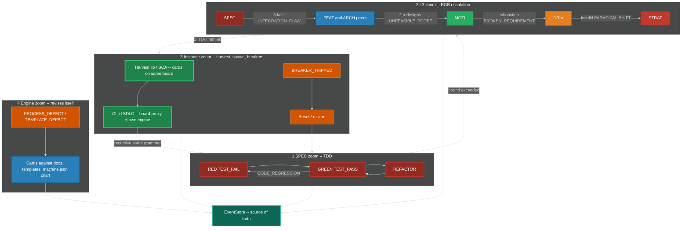

1. **SPEC zoom:** TDD on SPEC (RED-GREEN-REFACTOR). TestRunner never claims GREEN without recorded RED.
2. **L3 zoom:** RGB ladder with bounds in section 2.2.
3. **Instance zoom:** harvest lib -> SOA -> spawn child SDLC; plus death-spiral breakers and reset (section 4). Same loop.
4. **Engine zoom:** `PROCESS_DEFECT` / `TEMPLATE_DEFECT` revise the engine itself as cards on the same kanban.
5. **EventStore** is source of truth; all zooms emit events.

Child SDLC recursion: the child's SPEC zoom is TDD; its L3 zoom is RGB; its instance zoom may spawn a grandchild. Cascades use egress-as-ingress (`LEARNING`, `PROBLEM_SIGNAL`, A2A contracts, zenoh).

---

## 12. Implementation Design -- Rust Daemons, Named Mesh, Locator Discovery

This section is the software-engineer contract. Subsystems are **daemons**: dynamic, asynchronous, partitioned, fault-tolerant. The engine is **always live**. There is no batch window, no nightly reconcile, no "run the orchestrator later," no "run the suite later."

Language: **Rust 2024** for every daemon. Bash is glue (units, hooks), not applications. No Python apps. No Go or Zig binary is required.

### 12.1 Named IPC choice (binding)

A "generic event bus" is wrong. The mesh has two planes plus an optional local bridge.

**Same-host daemon plane -- iceoryx2.** Eclipse iceoryx2 is decentralized zero-copy shared-memory pub-sub. It exists specifically to **remove the central daemon** of iceoryx classic. Daemons open services by name (`sdlc.{instance}.{daemon}.{kind}`). Discovery is the iceoryx2 service tracker, not a cluster registry. EventStore remains source of truth: iceoryx2 carries **notifications** (seq, partition, kind). Payloads larger than a notify MAY be zero-copy samples or a seq the subscriber reads from SQLite.

**Nested-engine plane -- zenoh.** Each engine instance is a zenoh **peer**. Bootstrap is **one initial locator**. Gossip scout finds the rest. Liveliness tokens are join/leave. Parent does not own child topology. Child publishes egress on key expressions; parent subscribes. This is the board-of-boards routing plane.

**MQTT is out of seed.** Locator scheme `mqtt:` is **reserved** for a later optional IngressGateway adapter. Seed IngressGateway has **no** MQTT and **no** `rumqttc`. A broker is a registry; MQTT is never the discovery plane or the daemon bus.

**Optional, not topology:** `iceoryx2-integrations-zenoh-tunnel-backend` MAY tunnel a local service off-host. It MUST NOT become a god router that owns all topics.

```
publish(event):
    eventstore.append_fsync(event)              # SoT
    iceoryx2.publish(service_for(event.kind), seq)
    if event.kind in EGRESS_SET and parent_locator is set:
        zenoh.put("sdlc/{parent}/egress/{child}/{kind}", {event_id, seq})
```

`EGRESS_SET` = `MERGE_ACCEPTED`, `LEARNING`, `SDLC_SPAWNED`, `PROBLEM_SIGNAL`, `BREAKER_TRIPPED`, `MEMORY_CONTRADICTION`, `MESH_LEAVE`.

### 12.2 Dynamic discovery from one initial locator

No consul. No etcd. No eureka. No compiled mesh map.

A node starts with **exactly one** `INITIAL_LOCATOR` (env or Config). It discovers the rest.

#### Locator string format (ASCII, binding)

```
<scheme>:<rest>

schemes:
  zenoh:<protocol>/<addr>[:<port>]
      example: zenoh:tcp/192.168.1.10:7447
      example: zenoh:udp/224.0.0.224:7446          # multicast scout
      example: zenoh:unix:/tmp/sdlc-{instance}.zenoh

  iceoryx2:service/<ServiceName>
      example: iceoryx2:service/sdlc.instA.eventstore.notify
      (same-host only; ServiceName is the iceoryx2 name)

  a2a:<url>
      example: a2a:http://127.0.0.1:8088/.well-known/agent-card.json

  openai-compat:<url>
      example: openai-compat:http://127.0.0.1:11434/v1     # Ollama primary
      example: openai-compat:http://127.0.0.1:8080/v1      # LocalAI / vLLM / Xinference

  mqtt:tcp://127.0.0.1:<port>     # RESERVED -- not required to implement in seed
```

Root engine: `INITIAL_LOCATOR` MAY be `zenoh:udp/224.0.0.224:7446` (scout only) or `zenoh:tcp/127.0.0.1:7447` if this instance also listens. Child engine: `INITIAL_LOCATOR` MUST be the parent's zenoh listen locator handed in `SDLC_SPAWNED`.

#### Join / leave (live)

| Entity | Join | Leave |
|---|---|---|
| Daemon (same host) | Create iceoryx2 service `sdlc.{instance}.{daemon}.*`; tracker emits appear; `MESH_JOIN` | Process exit drops service; tracker emits disappear; `MESH_LEAVE`; leases expire |
| Engine instance | zenoh peer `connect` to `INITIAL_LOCATOR`; gossip; declare liveliness token `sdlc/{instance}/alive/engine/{id}` | Token drop; subscribers get delete; parent board-proxy `blocked`; `MESH_LEAVE` |
| A2A sidecar | Serve agent card; put card URL on zenoh `sdlc/{instance}/a2a/cards/{id}`; declare liveliness `.../alive/sidecar/{id}`; `AGENT_CARD_PUBLISHED` | Token drop; `AGENT_CARD_REVOKED`; AgentPool forgets; leased cards -> `ready`/`blocked` |
| Inference (sidecar-local only) | Sidecar-internal locator inside the **one** sidecar binary. Not a core daemon. Engine never emits `INFERENCE_*`. | Sidecar-internal. Engine DiscoveryDaemon MUST NOT probe models. No inference table in engine sqlite. |

Sidecar skills may grow from its own `/v1/models` list. That does not recompute engine `priority_score` and is not engine discovery.

Zenoh config seed (peer + gossip from one connect endpoint):

```
{
  mode: "peer",
  connect: { endpoints: ["<from INITIAL_LOCATOR rest>"] },
  listen:  { endpoints: ["tcp/0.0.0.0:0"] },
  scouting: {
    multicast: { enabled: true },
    gossip: { enabled: true, autoconnect: { peer: ["router", "peer"] } }
  }
}
```

If multicast is unavailable, gossip from the single connect endpoint is sufficient. That is the native zenoh model.

### 12.3 Subsystems / daemons

Core daemons below MUST compile and run with no `rig`, no inference client, and no memory-engine crate. A2AGateway is a **port** (section 0.5): it translates A2A messages into Dispatcher-bound envelopes. It does not call a model. It does not sqlite-append EventStore.

**Append rule (binding):** EventStore append has **one** owner API. Everyone submits an envelope through Dispatcher (canonicalize + TddGate). IngressGateway, TestRunner, Watchdog, GuardDaemon, BreakerDaemon, A2AGateway, LearningIngest, HarvestDaemon, AgentPool, MergeCoordinator, ParentReconciler, LeaseDaemon, TimerDaemon, DeadLetter, and Retry **do not** open `eventstore.sqlite` for write.

**Core -- zero LLM**

| Daemon | Responsibility | Consumes | Produces (envelope to Dispatcher unless noted) | Failure mode | Scaling unit |
|---|---|---|---|---|---|
| **EventStore** | SQLite WAL append-only log; one writer OS thread; snapshots | appends from Dispatcher only | ordered streams + iceoryx2 notify **after commit** | Refuse ack if fsync/commit fails | One process / one `eventstore.sqlite` |
| **Dispatcher** | Generic `machine.json` walker + TddGate module + Scheduler policy module | all catalog kinds as envelopes | `TRANSITION_COMMITTED`, `TRANSITION_REJECTED`, `UNHANDLED_EVENT` via EventStore API | Replay from last committed seq. CAS on this writer | Per instance (not competing consumers) |
| **DiscoveryDaemon** | Scout from `INITIAL_LOCATOR`; iceoryx2 tracker; zenoh liveliness of **engine** peers | liveliness, service appear/disappear | `MESH_JOIN`, `MESH_LEAVE` only | Fail-open to last-known live set; no `/v1/models` probe | Per instance |
| **A2AGateway** | Port P2/P3. Map allow-list A2A payloads to envelopes; send tasks after lease. Sole `a2a-rs-client`/`a2a-rs-server` user in core | A2A on P2 allow-list; iceoryx2 from AgentPool | P2: `LEARNING`, `MEMORY_CONTRADICTION`. Also `AGENT_CARD_*`. Never EventStore write | Unauthenticated drop. MCP endpoints MUST NOT exist | Per instance |
| **GuardDaemon** | Evaluate IGuard on state entry | `TRANSITION_COMMITTED` notify | `GUARD_*`, `FIXATION_DETECTED` envelopes | Fail-closed: `GUARD_BLOCKED` + DeadLetter | Per node type / shard |
| **BreakerDaemon** | Death-spiral detection | metrics, `TIMER_TICK` | `BREAKER_TRIPPED`, `RESET_STARTED` envelopes | Fail-open for eval errors logged; fail-closed once tripped | Per instance |
| **KanbanProjector** | EventStore seq -> filesystem column `mv`. One board. `notify` watches drift | commit seq notify | (projection; lag metrics) | Idempotent on commit seq; repair-on-replay if mv missing | Per partition |
| **AgentPool** | Spawn/retire; exclusive lease via LeaseDaemon; steal from `ready`; `spawn_budget`. Talks iceoryx2 to A2AGateway after lease. **No A2A crates.** | `WORK_CREATED` (ready), `AGENT_CARD_*`, lease expiry | `WORK_CLAIMED` envelope to Dispatcher | If no sidecar: humans/scanners still pull. Circuit-break on budget=0 | Worker processes |
| **MergeCoordinator** | Fan-in barrier; sync invariant. No model | child `WORK_COMPLETED`, `TEST_PASS`, `SYNC_VIOLATION` | `MERGE_*` envelopes | CAS on merge-point `state` **on the EventStore writer** | Parent partition |
| **ParentReconciler** | `TBD-RECONCILE` -> real `filename-id` | `MERGE_READY` | `RECONCILE_PARENT` envelope | Retry daemon handles backoff; do not rewrite SPEC bodies | Parent partition |
| **TestRunner** | Execute tests; never claims GREEN without recorded RED. Runs on `WORK_STARTED` and file `notify`. Does **not** consume `TIMER_TICK` for suite sweeps | `WORK_STARTED`, `notify` on test files | `TEST_PASS`, `TEST_FAIL`, `CODE_REGRESSION` envelopes | Infra fail: `WORK_BLOCKED`, not fake GREEN | Per card / test shard |
| **TddGate** | **MODULE of Dispatcher** (not a process) | attempted TDD transitions | `TRANSITION_REJECTED` (or allow) | Fail-closed | Inline in Dispatcher |
| **IngressGateway** | Port P1. External HTTP/git/webhook/syslog. **No MQTT in seed.** | adapters | P1 kinds as envelopes to Dispatcher. External clocks forwarded to **TimerDaemon** | Unauthenticated drop. Rate-limit | Horizontally scalable **ingress only**; still one EventStore writer |
| **LearningIngest** | Schema-validate `LEARNING` already committed; SQLite projection. **No extract, no embed, no mentedb** | `LEARNING`, `MEMORY_CONTRADICTION` | projection rows; MAY envelope `PROCESS_DEFECT` / `HARVEST_DETECTED` from **event fields** | Drop invalid schema with metric | Per tenant |
| **HarvestDaemon** | Lib extract / SOA / child spawn -- same loop, live | `TRANSITION_COMMITTED` | `HARVEST_DETECTED`, `LIB_EXTRACTED`, `SERVICE_PROMOTED`, `SDLC_SPAWNED` envelopes | Candidates only | Per instance |
| **Watchdog** | Port P4. Process liveness; SIGKILL; path notify | heartbeats, `notify` paths, `procfs`, `TIMER_TICK` (ageing only) | `WATCHDOG_*`, `FORK_ORPHAN`, `WORK_BLOCKED` envelopes to Dispatcher | OS probes only. No mentedb. No completion | Per process |
| **LeaseDaemon** | TTL leases. Not a slash name | claim/renew/expire | `WORK_RELEASED` / `WORK_BLOCKED` envelopes on expiry | Store monotonic seq + expiry, not local clock alone | Per resource |
| **DeadLetter** | Poison messages. Own daemon, own sqlite | `UNHANDLED_EVENT`, handler exceptions after Retry gives up | (held); alert | Bounded queue | Per partition |
| **Retry** | At-least-once retries. Own daemon, own sqlite. **Not** a module of DeadLetter | failed handler envelopes | republish same event id to Dispatcher | Give up -> DeadLetter | Per subscription |
| **Snapshot** | Compact state for replay. **Role over EventStore**, not a second file | EventStore seq | `snapshot` rows in `eventstore.sqlite` | Corrupt snapshot: ignore and replay earlier | Per partition |
| **MetricsDaemon** | RED/USE, traces, logs. Not a slash name | all daemons | `metrics_outbox` export. Telemetry loss MUST NOT block dispatch | Exporter | Collector |
| **SchemaRegistry** | Event kinds + `machine.json` file+hash | register/evolve/reload_chart | used by Dispatcher | Unknown kind -> `UNHANDLED_EVENT` | Instance |
| **Config** | Thresholds, WIP, spawn_budget, `INITIAL_LOCATOR` via figment+serde | watch | `config_rev` | Bad config: keep last-good | Instance |
| **TimerDaemon** | Clock as events. **Sole** `TIMER_TICK` producer | OS timer; optional clock forward from IngressGateway | `TIMER_TICK` envelopes | Never mutates cards itself. Watchdog/ageing only | Per instance |

**Dispatcher modules (not daemons)**

| Module | Host | SQLite | Notes |
|---|---|---|---|
| TddGate | Dispatcher process | NONE — `gate_reject` table in `dispatcher.sqlite` | Fail-closed GREEN |
| Scheduler | Dispatcher process | NONE — writes `priority_score` via KanbanProjector apply | Live score, no batch |

**Sidecar process (optional -- not an engine daemon)**

| Process | Responsibility | Talks to engine via | MUST NOT |
|---|---|---|---|
| **AI sidecar** (one binary) | `rig-core` + inference **locators** inside this binary. Seed does **not** include rustmem or mentedb | P2 `LEARNING`/`MEMORY_CONTRADICTION`, P3 tasks, P4 heartbeats | Append EventStore; `mv` cards; call Dispatcher internals; MCP; emit `TEST_*`/`WORK_COMPLETED` on P2 |

### 12.4 Crate inventory -- shared once, then per daemon

Shared workspace crates used by **every** Rust daemon:


| Crate (crates.io max_stable looked up 2026-08-31; pin exact rev at Cargo.lock generation) | Why |
|---|---|
| `tokio` 1.53.1 (crates.io max_stable looked up 2026-08-31); exact rev pinned at Cargo.lock generation | Async runtime for every daemon. |
| `tracing` 0.1.44 (crates.io max_stable looked up 2026-08-31); exact rev pinned at Cargo.lock generation | Structured logs. |
| `tracing-subscriber` 0.3.23 (crates.io max_stable looked up 2026-08-31); exact rev pinned at Cargo.lock generation | Subscriber. |
| `serde` 1.0.229 (crates.io max_stable looked up 2026-08-31); exact rev pinned at Cargo.lock generation | Payload (de)serialization. |
| `serde_json` 1.0.151 (crates.io max_stable looked up 2026-08-31); exact rev pinned at Cargo.lock generation | JSON envelopes and machine.json parse. |
| `thiserror` 2.0.20 (crates.io max_stable looked up 2026-08-31); exact rev pinned at Cargo.lock generation | Typed errors. |
| `anyhow` 1.0.104 (crates.io max_stable looked up 2026-08-31); exact rev pinned at Cargo.lock generation | Context errors at process edges. |
| `bytes` 1.12.1 (crates.io max_stable looked up 2026-08-31); exact rev pinned at Cargo.lock generation | Buffer type. |
| `parking_lot` 0.12.5 (crates.io max_stable looked up 2026-08-31); exact rev pinned at Cargo.lock generation | In-process locks. Not a substitute for the SQLite writer thread. |
| `uuid` 1.26.0 (crates.io max_stable looked up 2026-08-31); exact rev pinned at Cargo.lock generation | Event and card ids. |
| `iceoryx2` 0.9.3 (crates.io max_stable looked up 2026-08-31); exact rev pinned at Cargo.lock generation | Same-host notify. |
| `zenoh` 1.10.0 (crates.io max_stable looked up 2026-08-31); exact rev pinned at Cargo.lock generation | Child-engine mesh. DiscoveryDaemon and Dispatcher egress only. |
| `tokio-rusqlite` 0.7.0 (crates.io max_stable looked up 2026-08-31); exact rev pinned at Cargo.lock generation; features `bundled` | **The** SQLite actor. `rusqlite` 0.40.2 is used **only inside** `Connection::call()` on that actor thread. |

Every daemon crate table below that says **shared** means the table above, not a second copy of tokio/serde/iceoryx2.


**Forbidden globally in core:** `sqlx` 0.9.0; rusqlite used **on tokio worker threads**; `spawn_blocking` per statement; connection pool on the write path; `BEGIN` hopping threads; `config` 0.15.25 (`config` crate); `scxml` 0.2.2; XState; `rumqttc` 0.25.1 in seed; MCP/`rmcp`; `rig-core`; mentedb; rustmem.

##### EventStore crates

| Name | Language | Crates | Why | Forbidden |
|---|---|---|---|---|
| EventStore | Rust | shared + `tokio-rusqlite` 0.7.0 (crates.io max_stable looked up 2026-08-31); exact rev pinned at Cargo.lock generation (writer) + `iceoryx2` 0.9.3 (crates.io max_stable looked up 2026-08-31); exact rev pinned at Cargo.lock generation; WAL notify after commit | One OS thread owns one Connection. Async call(). SoT. | sqlx; rusqlite on tokio workers; spawn_blocking per statement; write-path pool; sqlx; MQTT; notifying before commit |

##### Dispatcher crates

| Name | Language | Crates | Why | Forbidden |
|---|---|---|---|---|
| Dispatcher | Rust | shared + `jsonschema` 0.52.1 (crates.io max_stable looked up 2026-08-31); exact rev pinned at Cargo.lock generation + `serde_json` 1.0.151 (crates.io max_stable looked up 2026-08-31); exact rev pinned at Cargo.lock generation + `zenoh` 1.10.0 (crates.io max_stable looked up 2026-08-31); exact rev pinned at Cargo.lock generation (egress). TddGate is this crate, not a second binary. | Generic walker of validated machine.json. Sole EventStore append client. | scxml crate; XState; statig-as-catalog; sqlx; rig-core; mentedb; rustmem; MCP; OpenAI-compat clients |

##### DiscoveryDaemon crates

| Name | Language | Crates | Why | Forbidden |
|---|---|---|---|---|
| DiscoveryDaemon | Rust | shared + `zenoh` 1.10.0 (crates.io max_stable looked up 2026-08-31); exact rev pinned at Cargo.lock generation (scout, liveliness) + `iceoryx2` 0.9.3 (crates.io max_stable looked up 2026-08-31); exact rev pinned at Cargo.lock generation (service tracker) + `tokio-rusqlite` 0.7.0 (crates.io max_stable looked up 2026-08-31); exact rev pinned at Cargo.lock generation | Locator-only engine join/leave. MESH_JOIN/LEAVE only. | No /v1/models. No inference table. No INFERENCE_* kinds. rig-core; mentedb; rustmem; MCP; OpenAI-compat clients |

##### A2AGateway crates

| Name | Language | Crates | Why | Forbidden |
|---|---|---|---|---|
| A2AGateway | Rust | shared + `a2a-rs-client` 1.0.26 (crates.io max_stable looked up 2026-08-31); exact rev pinned at Cargo.lock generation + `a2a-rs-server` 1.0.26 (crates.io max_stable looked up 2026-08-31); exact rev pinned at Cargo.lock generation + `axum` 0.8.9 (crates.io max_stable looked up 2026-08-31); exact rev pinned at Cargo.lock generation + `tokio-rusqlite` 0.7.0 (crates.io max_stable looked up 2026-08-31); exact rev pinned at Cargo.lock generation | P2/P3. Official A2A. Sole A2A crate user in core. | MCP / rmcp. rig. EventStore write. rig-core; mentedb; rustmem; MCP; OpenAI-compat clients |

##### GuardDaemon crates

| Name | Language | Crates | Why | Forbidden |
|---|---|---|---|---|
| GuardDaemon | Rust | shared + `tokio-rusqlite` 0.7.0 (crates.io max_stable looked up 2026-08-31); exact rev pinned at Cargo.lock generation (writer) + `iceoryx2` 0.9.3 (crates.io max_stable looked up 2026-08-31); exact rev pinned at Cargo.lock generation | consecutive_passes table | rig-core; mentedb; rustmem; MCP; OpenAI-compat clients; EventStore write |

##### BreakerDaemon crates

| Name | Language | Crates | Why | Forbidden |
|---|---|---|---|---|
| BreakerDaemon | Rust | shared + `tokio-rusqlite` 0.7.0 (crates.io max_stable looked up 2026-08-31); exact rev pinned at Cargo.lock generation (writer) + `iceoryx2` 0.9.3 (crates.io max_stable looked up 2026-08-31); exact rev pinned at Cargo.lock generation | metrics windows | rig-core; mentedb; rustmem; MCP; OpenAI-compat clients; EventStore write |

##### KanbanProjector crates

| Name | Language | Crates | Why | Forbidden |
|---|---|---|---|---|
| KanbanProjector | Rust | shared + `tokio-rusqlite` 0.7.0 (crates.io max_stable looked up 2026-08-31); exact rev pinned at Cargo.lock generation (writer) + `iceoryx2` 0.9.3 (crates.io max_stable looked up 2026-08-31); exact rev pinned at Cargo.lock generation; `notify` 8.2.0 (crates.io max_stable looked up 2026-08-31); exact rev pinned at Cargo.lock generation | mv projection; detect drift vs EventStore seq | rig-core; mentedb; rustmem; MCP; OpenAI-compat clients; EventStore write |

##### AgentPool crates

| Name | Language | Crates | Why | Forbidden |
|---|---|---|---|---|
| AgentPool | Rust | shared + `nix` 0.31.3 (crates.io max_stable looked up 2026-08-31); exact rev pinned at Cargo.lock generation (kill, waitpid, eventfd). **No A2A crates.** Talks iceoryx2 to A2AGateway. | Spawn/reap/SIGKILL; claim via Dispatcher. | a2a-rs-client; a2a-rs-server (A2AGateway is the only core consumer); rig-core; mentedb; rustmem; MCP; OpenAI-compat clients; EventStore write |

##### MergeCoordinator crates

| Name | Language | Crates | Why | Forbidden |
|---|---|---|---|---|
| MergeCoordinator | Rust | shared + `tokio-rusqlite` 0.7.0 (crates.io max_stable looked up 2026-08-31); exact rev pinned at Cargo.lock generation (writer) + `iceoryx2` 0.9.3 (crates.io max_stable looked up 2026-08-31); exact rev pinned at Cargo.lock generation | CAS arrival counts via Dispatcher envelopes | rig-core; mentedb; rustmem; MCP; OpenAI-compat clients; EventStore write |

##### ParentReconciler crates

| Name | Language | Crates | Why | Forbidden |
|---|---|---|---|---|
| ParentReconciler | Rust | shared + `tokio-rusqlite` 0.7.0 (crates.io max_stable looked up 2026-08-31); exact rev pinned at Cargo.lock generation (writer) + `iceoryx2` 0.9.3 (crates.io max_stable looked up 2026-08-31); exact rev pinned at Cargo.lock generation | Link repair only | rig-core; mentedb; rustmem; MCP; OpenAI-compat clients; EventStore write |

##### TestRunner crates

| Name | Language | Crates | Why | Forbidden |
|---|---|---|---|---|
| TestRunner | Rust | shared + tokio::process + `notify` 8.2.0 (crates.io max_stable looked up 2026-08-31); exact rev pinned at Cargo.lock generation | Real test processes, not keyword scans. WORK_STARTED / file notify. | TIMER_TICK suite sweeps; keyword-scan tests; EventStore write; rig-core; mentedb; rustmem; MCP; OpenAI-compat clients |

##### TddGate (Dispatcher module) crates

| Name | Language | Crates | Why | Forbidden |
|---|---|---|---|---|
| TddGate (Dispatcher module) | Rust | same crate as Dispatcher; `jsonschema` 0.52.1 (crates.io max_stable looked up 2026-08-31); exact rev pinned at Cargo.lock generation named guard | Fail-closed GREEN. Not a process. | Separate binary; own sqlite file |

##### IngressGateway crates

| Name | Language | Crates | Why | Forbidden |
|---|---|---|---|---|
| IngressGateway | Rust | shared + `axum` 0.8.9 (crates.io max_stable looked up 2026-08-31); exact rev pinned at Cargo.lock generation + `reqwest` 0.13.4 (crates.io max_stable looked up 2026-08-31); exact rev pinned at Cargo.lock generation + `tokio-rusqlite` 0.7.0 (crates.io max_stable looked up 2026-08-31); exact rev pinned at Cargo.lock generation (dedup only) | HTTP/git/webhook. Envelopes to Dispatcher. | `rumqttc` 0.25.1 (crates.io max_stable looked up 2026-08-31); exact rev pinned at Cargo.lock generation in seed; MQTT; EventStore write |

##### LearningIngest crates

| Name | Language | Crates | Why | Forbidden |
|---|---|---|---|---|
| LearningIngest | Rust | shared + `tokio-rusqlite` 0.7.0 (crates.io max_stable looked up 2026-08-31); exact rev pinned at Cargo.lock generation (writer) + `iceoryx2` 0.9.3 (crates.io max_stable looked up 2026-08-31); exact rev pinned at Cargo.lock generation | Project LEARNING rows matching ILearningProjection | mentedb; embed; extract; EventStore write |

##### HarvestDaemon crates

| Name | Language | Crates | Why | Forbidden |
|---|---|---|---|---|
| HarvestDaemon | Rust | shared + `tokio-rusqlite` 0.7.0 (crates.io max_stable looked up 2026-08-31); exact rev pinned at Cargo.lock generation (writer) + `iceoryx2` 0.9.3 (crates.io max_stable looked up 2026-08-31); exact rev pinned at Cargo.lock generation | Live thresholds | rig-core; mentedb; rustmem; MCP; OpenAI-compat clients; EventStore write; nightly scan |

##### Watchdog crates

| Name | Language | Crates | Why | Forbidden |
|---|---|---|---|---|
| Watchdog | Rust | shared + `nix` 0.31.3 (crates.io max_stable looked up 2026-08-31); exact rev pinned at Cargo.lock generation + `notify` 8.2.0 (crates.io max_stable looked up 2026-08-31); exact rev pinned at Cargo.lock generation + `procfs` 0.18.0 (crates.io max_stable looked up 2026-08-31); exact rev pinned at Cargo.lock generation | Heartbeat fd, CPU/time, unexpected paths, SIGKILL. Envelopes to Dispatcher. | LLM; mentedb; EventStore write |

##### LeaseDaemon crates

| Name | Language | Crates | Why | Forbidden |
|---|---|---|---|---|
| LeaseDaemon | Rust | shared + `tokio-rusqlite` 0.7.0 (crates.io max_stable looked up 2026-08-31); exact rev pinned at Cargo.lock generation (writer) + `iceoryx2` 0.9.3 (crates.io max_stable looked up 2026-08-31); exact rev pinned at Cargo.lock generation | TTL in store | rig-core; mentedb; rustmem; MCP; OpenAI-compat clients; EventStore write |

##### DeadLetter crates

| Name | Language | Crates | Why | Forbidden |
|---|---|---|---|---|
| DeadLetter | Rust | shared + `tokio-rusqlite` 0.7.0 (crates.io max_stable looked up 2026-08-31); exact rev pinned at Cargo.lock generation (writer) + `iceoryx2` 0.9.3 (crates.io max_stable looked up 2026-08-31); exact rev pinned at Cargo.lock generation | Bounded poison queue. Own file. | Sharing Retry sqlite; EventStore write |

##### Retry crates

| Name | Language | Crates | Why | Forbidden |
|---|---|---|---|---|
| Retry | Rust | shared + `tokio-rusqlite` 0.7.0 (crates.io max_stable looked up 2026-08-31); exact rev pinned at Cargo.lock generation (writer) + `iceoryx2` 0.9.3 (crates.io max_stable looked up 2026-08-31); exact rev pinned at Cargo.lock generation | Backoff republish to Dispatcher. Own file. | Sharing DeadLetter sqlite; EventStore write |

##### Snapshot (role) crates

| Name | Language | Crates | Why | Forbidden |
|---|---|---|---|---|
| Snapshot (role) | Rust | same crate surface as EventStore; no second sqlite | Writes EventStore.snapshot rows on the EventStore writer thread | Second snapshot.sqlite; own writer racing EventStore |

##### MetricsDaemon crates

| Name | Language | Crates | Why | Forbidden |
|---|---|---|---|---|
| MetricsDaemon | Rust | shared + `metrics` 0.24.6 (crates.io max_stable looked up 2026-08-31); exact rev pinned at Cargo.lock generation + optional `metrics-exporter-prometheus` 0.18.3 (crates.io max_stable looked up 2026-08-31); exact rev pinned at Cargo.lock generation + optional `opentelemetry` 0.32.0 (crates.io max_stable looked up 2026-08-31); exact rev pinned at Cargo.lock generation | Optional scrape; must not block dispatch | Blocking dispatch on telemetry loss; EventStore write |

##### SchemaRegistry crates

| Name | Language | Crates | Why | Forbidden |
|---|---|---|---|---|
| SchemaRegistry | Rust | shared + `jsonschema` 0.52.1 (crates.io max_stable looked up 2026-08-31); exact rev pinned at Cargo.lock generation + `serde_json` 1.0.151 (crates.io max_stable looked up 2026-08-31); exact rev pinned at Cargo.lock generation + `tokio-rusqlite` 0.7.0 (crates.io max_stable looked up 2026-08-31); exact rev pinned at Cargo.lock generation | machine.json file + hash + kinds. scxml crate DROPPED. | scxml crate; XState; chart_blob as a second catalog |

##### Config crates

| Name | Language | Crates | Why | Forbidden |
|---|---|---|---|---|
| Config | Rust | shared + `figment` 0.10.19 (crates.io max_stable looked up 2026-08-31); exact rev pinned at Cargo.lock generation + `serde` 1.0.229 (crates.io max_stable looked up 2026-08-31); exact rev pinned at Cargo.lock generation + `notify` 8.2.0 (crates.io max_stable looked up 2026-08-31); exact rev pinned at Cargo.lock generation | INITIAL_LOCATOR, weights, config_rev | `config` 0.15.25 (crates.io max_stable looked up 2026-08-31); exact rev pinned at Cargo.lock generation crate |

##### TimerDaemon crates

| Name | Language | Crates | Why | Forbidden |
|---|---|---|---|---|
| TimerDaemon | Rust | shared + tokio::time | TIMER_TICK only. Sole producer. | Second TIMER_TICK producer; EventStore write |

##### AI sidecar (optional process) crates

| Name | Language | Crates | Why | Forbidden |
|---|---|---|---|---|
| AI sidecar (optional process) | Rust | rig-core + `a2a-rs-server` 1.0.26 (crates.io max_stable looked up 2026-08-31); exact rev pinned at Cargo.lock generation + `reqwest` 0.13.4 (crates.io max_stable looked up 2026-08-31); exact rev pinned at Cargo.lock generation. Seed: **no** rustmem, **no** mentedb. | Completions and A2A. Never a core daemon crate. | EventStore; kanban mv; MCP; linking into Dispatcher |


### 12.5 Two-box topology (engine | sidecar) -- ports only

The numbered-port diagram in section 0.5 is binding. Same-host daemons still use iceoryx2 among **core** processes. zenoh is P5 (child engines), not an LLM pipe. Do not draw edges from `rig`/Ollama into Dispatcher or EventStore.

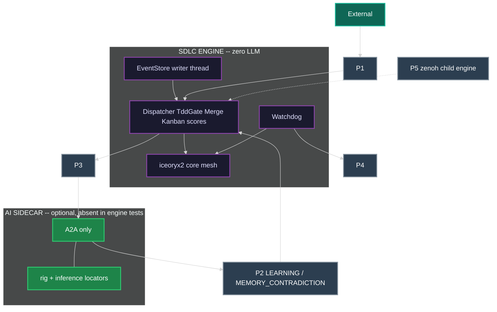

### 12.6 A2A sidecar runtime (not MCP, not in-process with Dispatcher)

The sidecar is a **separate process**. Engine tests start **zero** sidecar processes. When present, it speaks **only A2A** at P2/P3. OpenAI-compat HTTP stays inside the sidecar. P2 loop matches the allow-list.

```
sidecar main:                          # NOT linked into Dispatcher
    serve a2a-rs-server (agent card)
    A2AGateway observes card -> AGENT_CARD_PUBLISHED (not a P2 proposal)
    bind rig-core to sidecar-local openai-compat locator
    loop:
        task = A2A receive on P3       # lease already committed
        rig_agent.prompt(task)
        # P2 MAY carry ONLY:
        A2A send LEARNING
        A2A send MEMORY_CONTRADICTION
        heartbeat fd for P4
    # NEVER: EventStore.append, kanban mv, iceoryx2 publish of TRANSITION_*
    # NEVER: TEST_PASS / TEST_FAIL / WORK_COMPLETED on P2
    # Those are TestRunner / AgentPool envelopes to Dispatcher after lease
```

Ollama is the sidecar's default primary inference locator. LocalAI, Xinference, and vLLM are optional locators **in the same binary**. The orchestrator does not embed a vendor and does not require any of them. Seed sidecar does not include rustmem or MenteDB.

### 12.7 Orchestration, scale, fault tolerance

**Event-driven.** No daemon polls a clock to mutate state. TimerDaemon is the sole publisher of `TIMER_TICK`; subscribers (Watchdog ageing, breaker windows) decide. TestRunner does not use `TIMER_TICK` to sweep suites.

**Dynamic.** Node types, event kinds, `machine.json` chart, guards, breakers, harvest rules load from SchemaRegistry + Config.

**Scalable.**

- Work events partition by `work_item_id`.
- Agent execution partitions by `owned_subtree`.
- Merge-point evaluation runs on the **parent partition**. Children do not take a global lock. Child completion is copied onto the parent partition (local iceoryx2) or via `MESH_INGRESS` (zenoh).
- **Multi-instance competing consumers on one `eventstore.sqlite` are FORBIDDEN.** One writer OS thread per file. CAS (lease claim, merge-point state) runs **on that writer**. No leader election until a later version introduces a clustered EventStore.

**Fault tolerant.** At-least-once. Idempotent projectors keyed by commit seq. Lease expiry. DeadLetter + Retry as two daemons. Orchestrator stateless vs EventStore. Backpressure via bounded queues. `spawn_budget`. Snapshot role on EventStore.

**Robust.** Graceful drain: stop IngressGateway, finish in-flight transitions, refuse new `WORK_CLAIMED`, wait leases, snapshot. Workers MAY be sandboxed with bwrap; the engine does not hard-require it.

**Kanban apply protocol (binding, not 2PC):** EventStore **COMMIT** -> projector apply keyed by commit seq -> FS `mv` -> if `mv` is missing on replay, repair from seq. EventStore is source of truth. Projector + FS are rebuildable.

### 12.8 Sequences -- envelopes to Dispatcher; sidecar never hits EventStore

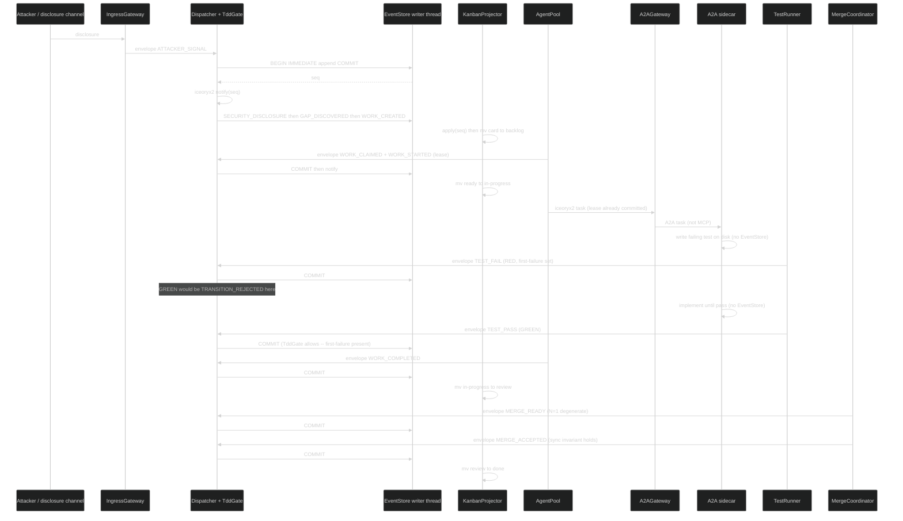

Sidecar P2 loop (allow-list only):

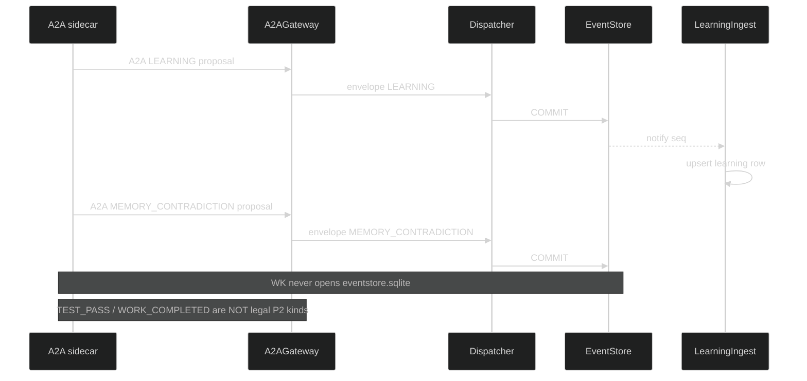

Apply protocol:

```
EventStore writer: BEGIN IMMEDIATE; INSERT event; COMMIT; notify(seq)
KanbanProjector:   read seq; upsert card row; rename/mv file; if mv missing on replay, redo mv from row
```

---

## 13. Production Requirements Checklist

Implementations MUST satisfy the product requirements and the production-hardening requirements. A green test banner is not evidence that this list is done.

### 13.1 Product (engine semantics)

- [ ] Cohesive event + feedback + docs + process + TDD (one catalog: seed `machine.json`)
- [ ] One workstream kanban (`backlog`, `ready`, `in-progress`, `blocked`, `review`, `done` + merge-point columns)
- [ ] Parallel subagents with exclusive card + exclusive subtree leases
- [ ] Merge points (N-child fan-in; N=1 = `MERGE_ACCEPTED`; `WORK_MERGED` alias)
- [ ] External and internal events both on the named mesh
- [ ] Learning CREATE / REVISE / RETIRE with EFFICIENCY vs CAPABILITY as EventStore events; sidecar memory optional and off-engine
- [ ] Wrong SPEC and wrong FEAT identified in TDD (`SPEC_WRONG`, `FEAT_WRONG`)
- [ ] Sync invariant `SPEC == test == impl == process/template` at `MERGE_ACCEPTED`
- [ ] One loop at SPEC / L3 / instance / engine / recursion zooms
- [ ] Recursive child SDLC is a full engine instance with own iceoryx2 and EventStore
- [ ] Implementable subsystems as named Rust daemons (section 12)
- [ ] Dynamic registries -- not hardcoded node/kind/guard lists
- [ ] Async event-driven (timers emit `TIMER_TICK`)
- [ ] Scalable partitioning (`work_item_id`, `owned_subtree`, parent merge partition)
- [ ] TDD gate: `NOT_STARTED -> GREEN` is `TRANSITION_REJECTED`
- [ ] Hub never content-merges files
- [ ] Rejected MOTIs recorded (competing approaches guard)
- [ ] iceoryx2 + zenoh named mesh; no god bus
- [ ] Discovery from one `INITIAL_LOCATOR` only
- [ ] Optional A2A sidecar behind P2/P3; MCP absent; core tests pass with Ollama down; zero LLM in core daemons
- [ ] Live scheduler; no batch sort

### 13.2 Production hardening

- [ ] Authn/authz on IngressGateway and A2AGateway
- [ ] Audit log = EventStore
- [ ] Secrets: opaque secret ids in payloads; **no vault in seed**
- [ ] Multi-tenancy isolation of event partitions (`tenant_id` prefix)
- [ ] Schema evolution / `machine.json` reload + hash
- [ ] Clock / ordering: per-partition total order; happens-before via parent_id / zenoh egress
- [ ] Idempotency keys on ingress and on projector apply
- [ ] Graceful drain (section 12.7)
- [ ] Backup / restore of EventStore
- [ ] SLO / error budget (dispatch lag, merge latency, DLQ rate)
- [ ] Chaos / fault-injection hooks
- [ ] Observability: metrics, traces, logs
- [ ] Rate limits on IngressGateway
- [ ] Sandboxing of workers: MAY run in bwrap; MUST NOT be hard-required
- [ ] Bounded queues / backpressure
- [ ] Dead-letter + retry/backoff
- [ ] TTL leases (no forever locks)
- [ ] Snapshot / checkpoint
- [ ] One writer thread per sqlite file; CAS on that writer; competing consumers FORBIDDEN
- [ ] Always-on daemons -- no batch automation
- [ ] Hierarchical agents with A2A rendezvous and watchdogs
- [ ] Localized SQLite ER per daemon (section 17)
- [ ] Errant-fork / runaway-AI detection in the running process (section 18)
- [ ] MQTT out of seed; `mqtt:` locator reserved only

---

## 14. One Loop at Every Zoom

The engine is a single observe-decide-act-emit-project cycle. Changing zoom changes **which card** the cycle is looking at, not which engine is running.

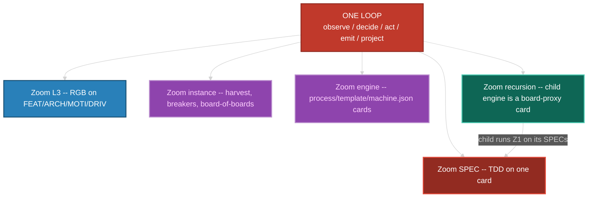

Self-improvement is not a special mode. A `PROCESS_DEFECT` is a card. A harvest is a card. A child SDLC is a board-proxy card. All wait on `ready`, take a lease, go RED before GREEN, fan in at a merge point.

---

## 15. Live Orchestrator -- Agents, Sub-agents, Rendezvous, Watchdogs

The orchestrator (Dispatcher + AgentPool + MergeCoordinator + Watchdog + DiscoveryDaemon + A2AGateway) is **always running**. It never "starts a run." Cards appear via events. Workers are processes with a parent pointer. Nesting is `IAgent.parent_agent` + `nesting_level` (0 = hub-spawned, 1..3 = sub / sub-sub / sub-sub-sub). Hard stop: `nesting_level >= 4` is `TRANSITION_REJECTED`.

### 15.1 Hierarchy

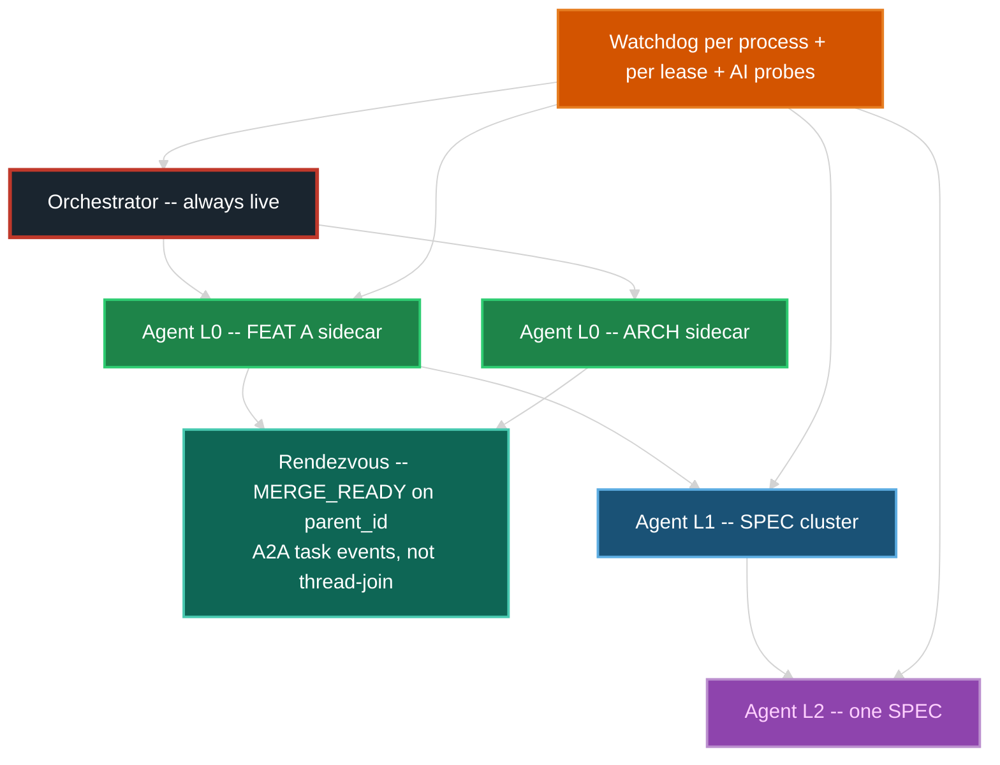

| Level | Who spawns | May write | Rendezvous |
|---|---|---|---|
| Orchestrator | process supervisor | event order, card `mv`, merge eval, parent reconcile | n/a -- it IS the rendezvous host |
| L0 agent | AgentPool via A2A | exclusive FEAT or ARCH subtree | children must `MERGE_ACCEPTED` before L0 `WORK_COMPLETED` |
| L1 agent | L0 via `WORK_DECOMPOSED` | exclusive child card(s) inside that subtree | same merge-point grammar |
| L2 / L3 | L1 / L2 | one SPEC or one test file | TDD events; parent lease remains with ancestor |

A parent MUST NOT write files covered by a live child lease. That is `WORK_CONFLICTED`.

Nested **engine** instances (board-of-boards): parent holds a **proxy card** only. The child has its own engine, own iceoryx2, own EventStore, own A2AGateway. Egress is zenoh `MESH_EGRESS`. The parent MUST NOT `waitpid` the child's workers and MUST NOT open the child's SQLite.

### 15.2 Rendezvous (event correlation, not thread-join)

1. Parent card lists `child_cards` on `IMergePoint`.
2. Each child completion is published on the child's `work_item_id` partition **and copied** onto the `parent_id` partition (local) or wrapped as `MESH_INGRESS` (child engine).
3. MergeCoordinator CAS-updates arrival count **on that event**. If count < N, stay OPEN or `MERGE_BLOCKED`. If count == N, `MERGE_READY` then sync invariant.
4. A2A task state changes are mapped to the same events. There is no `pthread_join`.
5. A missing child is discovered when `TIMER_TICK` + lease/watchdog says the child is dead (section 18), which emits `WORK_BLOCKED` on the child and `MERGE_BLOCKED` on the parent -- live, not at end of day.

### 15.3 Watchdogs -- gone-crazy process AND gone-crazy AI

Watchdog is a daemon. It does not batch-scan logs. Detection is **in the running process**.

| Probe | Period / trigger | Crazy / dead if | Action (live) |
|---|---|---|---|
| Heartbeat fd | Config `heartbeat_ms` via iceoryx2 event or `eventfd` | No beat for `3 * heartbeat_ms` | `WATCHDOG_HANG`; expire lease; card -> `ready` or `blocked` |
| Progress | `progress_idle_ms` | Lease held, no `TRANSITION_COMMITTED` from that agent | `WATCHDOG_STALL`; after 2, `WORK_BLOCKED`; do not auto-GREEN |
| Token / loop storm | sidecar stdout + A2A token counts | `token_rate > token_storm_tps` for `storm_window_ms`, or identical prompt loop `N` times | `WATCHDOG_AI_STORM`; SIGKILL; card stays RED or blocked |
| Output entropy | on each worker event | Repeat storm, or `TEST_PASS` with no first-failure | `WATCHDOG_THRASH` / `SPEC_WRONG`; kill; no auto-GREEN |
| File write set | `notify` on workspace | Create/write whose canonical path is not under `owned_subtree` | `WATCHDOG_PATH_VIOLATION` + `WORK_CONFLICTED`; SIGKILL; revoke lease |
| CPU / time budget | `procfs` + `TIMER_TICK` | `cpu_secs > budget` or wall `> time_budget` | `WATCHDOG_HANG` or storm; SIGKILL |
| Recursion | on spawn | `nesting_level` or `spawn_budget` exceeded | `TRANSITION_REJECTED`; no spawn |
| Oscillation | on RGB / merge | Same merge_point `MERGE_REJECTED` then ready then rejected `> oscillation_bound` without new child evidence; or SPEC flip-flop past RGB bound without escalate | `WATCHDOG_OSCILLATION`; force RGB event if needed; kill |
| Memory contradiction | P2 `MEMORY_CONTRADICTION` event (sidecar proposed) | Dispatcher treats as a card-minting event | Card `blocked` or `PROCESS_DEFECT`. Watchdog does not interpret embeddings |
| Divergence | git/worktree if used | Branch exists with no live lease and no `MERGE_ACCEPTED` | `FORK_ORPHAN` |

Watchdog MUST be able to **SIGKILL** a worker it spawned (`nix::sys::signal::kill`, then `waitpid`). It MUST NOT write SPEC/test/impl bodies. Recovery is always: lease expire -> card visible on `ready`/`blocked` -> another agent may claim.

### 15.4 No batching (binding)

Forbidden: nightly jobs that move cards, cron that "syncs the board", queued "orchestration runs", harvest that only runs at 02:00, merge evaluation that waits for a scheduled sweep, "run the test suite later", Vestige-style scheduled memory compact as the learning path.

Required: every state change is an event handled by a running subscriber before the next event on that partition is considered complete (backpressure, not deferral).

---

## 16. Dynamic Scheduling -- Kanban and Kanban of Kanbans

The orchestrator does not use a hardcoded priority list. It **scores live** on every `TRANSITION_COMMITTED`, `WORK_UNBLOCKED`, `TIMER_TICK` (ageing only), `MESH_INGRESS`, and P1 ingress event. The score is a pure function of card/lease/DAG fields in Config. It MUST NOT call a model, read mentedb, or use `INFERENCE_*` / sidecar memory.

### 16.1 Pick / schedule / determine / redetermine

On each of those events, Scheduler (a Dispatcher policy module) recomputes `priority_score` for the **affected** set only: the event's card, dependents, same-merge siblings, and board-proxies whose child just egressed. Never a full-fleet batch sort.

```
priority_score(card) =
    w_p0    * is_P0
  + w_dep   * dependents_blocked_count
  + w_age   * age_in_ready_ms
  + w_merge * merge_point_waiting_on_this
  + w_risk  * security_or_breaker_flag
  + w_zoom  * (1 / (1 + nesting_level))
  - w_wip   * (column_wip / column_wip_limit)
  - w_lease * already_has_owner
```

Weights live in Config. Changing weights is a config event, not a deploy.

**Pick:** AgentPool offers the highest-score `ready` card whose `owned_subtree` is free, whose deps are `done`, and whose agent type/capabilities match (human, scanner, or a live sidecar card on P2). Tie-break: older `entered_ready`. If no sidecar is running, only non-AI agents are eligible; the engine still scores and dispatches.

```
SELECT filename_id FROM card
 WHERE column = 'ready'
   AND owner_agent IS NULL
   AND capabilities_match(agent)
   AND subtree_free(owned_subtree)
   AND wip_ok(agent, column)
 ORDER BY score DESC, entered_column_ts ASC
 LIMIT 1
```

**Schedule:** claim = lease. WIP limits are hard: if column or agent WIP is full, next card stays `ready`. No overcommit. A2A `send_task` happens **after** the lease is in EventStore.

**Redetermine:** any new **engine** event can change scores. A `SECURITY_DISCLOSURE` can jump a card **without a batch reorder job** -- the next claim sees the new score. Sidecar skill changes do not recompute scores. Preemption: if a P0 security card is `ready` and an L0 agent holds only P3 work, Watchdog MAY request `WORK_RELEASED` on the P3 (cooperative) after `preempt_grace_ms`. Forcible preemption is Config-gated and emits `WORK_RELEASED` reason=preempt.

### 16.2 Board of boards

A board-proxy card represents a child kanban. The parent's Scheduler scores the **proxy**, not every child card. The child's Scheduler scores the child's cards independently.

| Zoom | What is scored | Who scores |
|---|---|---|
| Child SPEC | child `ready` cards | child Dispatcher |
| Parent FEAT | parent cards + board-proxies | parent Dispatcher |
| Fleet | instance-level board-proxies only | parent of instances (if any) |

The parent MUST NOT query the child EventStore to pick a SPEC.

### 16.3 Implementable algorithm (always-live main loop)

```
fn run(orch: Orchestrator) {
  # WaitSet: EventStore notify + iceoryx2 + zenoh + TIMER_TICK
  loop {
    for n in waitset.wait() {
      match n {
        StoreAppend(seq)        => handle_partition(seq)
        IceoryxService(_)       => handle_local_copy()
        ZenohIngress(sample)    => ingest_child_egress(sample)  # MESH_INGRESS
        LivelinessPut(tok)      => emit MESH_JOIN          # engine peers only
        LivelinessDelete(tok)   => emit MESH_LEAVE
        TimerTick(id)           => dispatch(TIMER_TICK)
      }
    }
  }
}

fn handle_partition(seq) {
  persist already done
  apply transition          # Dispatcher + TddGate + ResolvedChart
  project card mv           # KanbanProjector
  update scores for affected
  evaluate merge if parent_id
  harvest.on_event          # live, no LLM
  learning_ingest.on_event  # rusqlite projection only
  watchdog.on_event         # OS probes immediately
  offer_work()              # pick + claim; P3 only if a sidecar holds the lease
}

fn ingest_child_egress(sample) {
  # key: sdlc/{parent_instance}/egress/{child_instance}/{kind}
  append MESH_INGRESS wrapping child event
  move board-proxy column
  recompute proxy score
}
```

All steps are synchronous on the **partition**. Across partitions they are async copies. No global sort of the whole fleet.

---

## 17. Localized ER / RDBMS Schemas (SQLite per daemon)

The filesystem kanban remains the **workflow projection**. Each daemon has its **own** SQLite file for queries it cannot do with `ls`/`mv` alone, except where this section says `NONE`. Stores are **per subsystem**, not one god database. EventStore is source of truth; local tables are rebuildable from replay.

**RDBMS pick:** SQLite, localized per daemon file. Clustered Postgres is **not** this design unless a later version explicitly requires a multi-host EventStore.

Paths: `var/engine/{instance_id}/eventstore.sqlite` and `var/engine/{instance_id}/{daemon}.sqlite`. LearningIngest: `learningingest.sqlite`. Sidecar memory if any lives under the sidecar's own directory, not the engine EventStore. Character set: ASCII identifiers.

**Every localized sqlite file** (EventStore and every projection file) MUST apply this on open, on the owning writer thread, before any DML:


```sql
PRAGMA journal_mode = WAL;
PRAGMA synchronous = FULL;
PRAGMA busy_timeout = 5000;
PRAGMA foreign_keys = ON;
PRAGMA temp_store = MEMORY;
```


Optional extra **READ-ONLY** connections MAY exist on extra threads for WAL readers (`PRAGMA query_only = ON`). They MUST NOT write. Projection DBs use the same actor pattern: one writer thread each, rebuildable from EventStore.

**No engine inference table.** DiscoveryDaemon has `locator_seen` only.

ER entity names below are the `CREATE TABLE` names (1:1).


#### EventStore

**SQLite file:** `eventstore.sqlite`

Snapshot daemon is a **role** over this file. There is no `snapshot.sqlite`.

```sql
PRAGMA journal_mode = WAL;
PRAGMA synchronous = FULL;
PRAGMA busy_timeout = 5000;
PRAGMA foreign_keys = ON;
PRAGMA temp_store = MEMORY;

CREATE TABLE event (
  tenant_id TEXT NOT NULL,
  seq INTEGER NOT NULL,
  partition_key TEXT NOT NULL,
  event_id TEXT PRIMARY KEY,
  kind TEXT NOT NULL,
  schema_ver INTEGER NOT NULL,
  idempotency_key TEXT NOT NULL UNIQUE,
  work_item_id TEXT,
  parent_id TEXT,
  actor_id TEXT,
  payload_ref TEXT,
  ts_store INTEGER NOT NULL,
  UNIQUE (tenant_id, seq)
);

CREATE TABLE snapshot (
  tenant_id TEXT NOT NULL,
  partition_key TEXT NOT NULL,
  seq INTEGER NOT NULL,
  blob_ref TEXT NOT NULL,
  PRIMARY KEY (tenant_id, partition_key, seq)
);
```


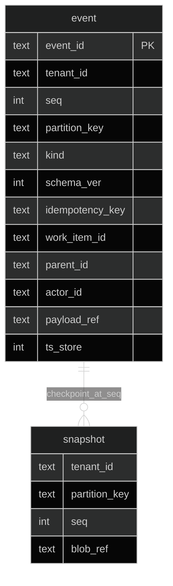


#### Dispatcher

**SQLite file:** `dispatcher.sqlite`

TddGate is a module of Dispatcher. Schema for TddGate: **NONE — uses dispatcher.sqlite** (`gate_reject` for audit). Scheduler is a Dispatcher policy module: **NONE — uses KanbanProjector.card.priority_score**.

```sql
PRAGMA journal_mode = WAL;
PRAGMA synchronous = FULL;
PRAGMA busy_timeout = 5000;
PRAGMA foreign_keys = ON;
PRAGMA temp_store = MEMORY;

CREATE TABLE node (
  filename_id TEXT PRIMARY KEY,
  type TEXT NOT NULL,
  parent TEXT,
  state TEXT NOT NULL,
  tdd_state TEXT NOT NULL,
  first_failure TEXT,
  iterations INTEGER NOT NULL DEFAULT 0
);

CREATE TABLE chart_hash (
  sha256 TEXT PRIMARY KEY,
  loaded_seq INTEGER NOT NULL
);

CREATE TABLE committed (
  event_id TEXT PRIMARY KEY,
  node_id TEXT NOT NULL,
  from_state TEXT NOT NULL,
  to_state TEXT NOT NULL
);

CREATE TABLE gate_reject (
  event_id TEXT PRIMARY KEY,
  reason TEXT NOT NULL,
  from_tdd TEXT,
  attempted_kind TEXT NOT NULL,
  ts_store INTEGER NOT NULL
);
```


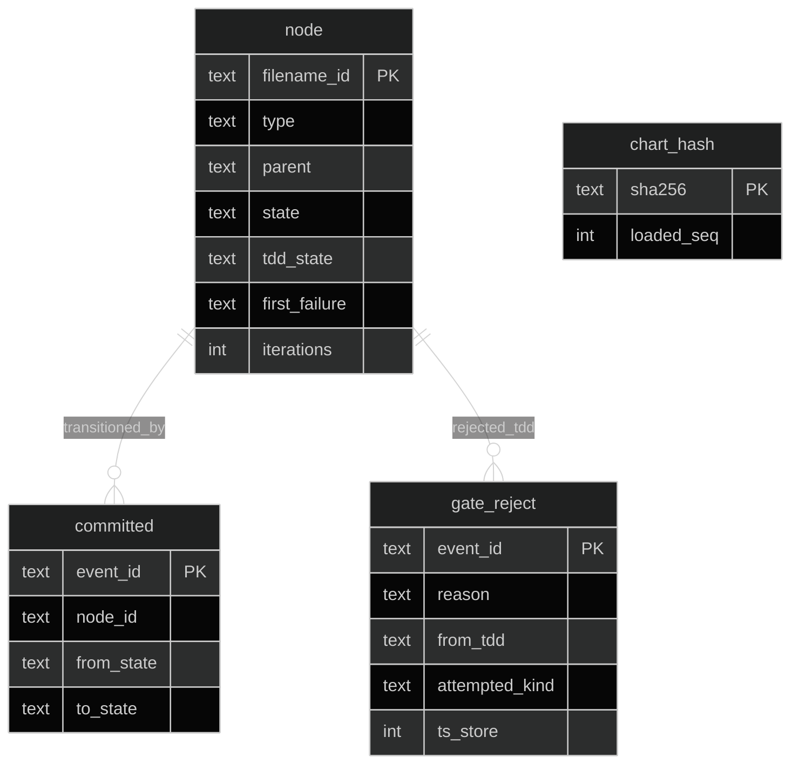


#### TddGate

NONE — uses `dispatcher.sqlite` (`gate_reject` table). Not a process. Crate listed under Dispatcher.


#### Scheduler

NONE — Dispatcher policy module, not a daemon. Scores live on `KanbanProjector.card.priority_score`.


#### Snapshot

NONE — uses `eventstore.sqlite` table `snapshot`. Snapshot is a role over EventStore, not a second file.


#### KanbanProjector

**SQLite file:** `kanbanprojector.sqlite`

`mv` of the file and the `card.column` row MUST be the same apply of one commit seq. If the FS `mv` succeeds and the row fails, replay repairs the row. If the row exists and the `mv` is missing, replay performs the `mv`.

```sql
PRAGMA journal_mode = WAL;
PRAGMA synchronous = FULL;
PRAGMA busy_timeout = 5000;
PRAGMA foreign_keys = ON;
PRAGMA temp_store = MEMORY;

CREATE TABLE card (
  filename_id TEXT PRIMARY KEY,
  column TEXT NOT NULL,
  owned_subtree TEXT,
  owner_agent TEXT,
  parent_card TEXT,
  priority_score REAL NOT NULL DEFAULT 0,
  entered_column_ts INTEGER NOT NULL,
  last_applied_seq INTEGER NOT NULL
);

CREATE TABLE column_def (
  name TEXT PRIMARY KEY,
  wip_limit INTEGER NOT NULL
);

CREATE TABLE board_proxy (
  card_id TEXT PRIMARY KEY,
  child_instance_id TEXT NOT NULL,
  child_strat_id TEXT NOT NULL,
  child_locator TEXT NOT NULL
);
```


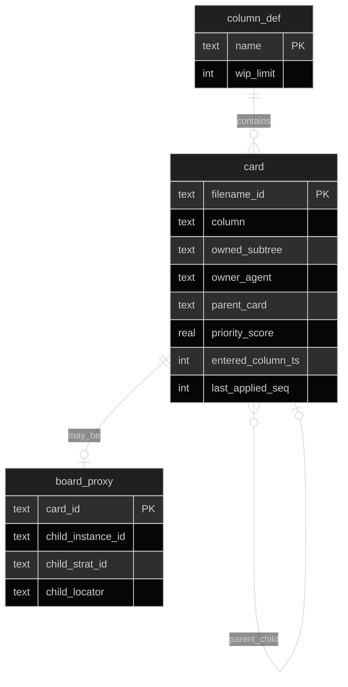


#### LeaseDaemon

**SQLite file:** `leasedaemon.sqlite`

```sql
PRAGMA journal_mode = WAL;
PRAGMA synchronous = FULL;
PRAGMA busy_timeout = 5000;
PRAGMA foreign_keys = ON;
PRAGMA temp_store = MEMORY;

CREATE TABLE lease (
  resource_id TEXT PRIMARY KEY,
  agent_id TEXT NOT NULL,
  level TEXT NOT NULL,
  expires_seq INTEGER NOT NULL,
  heartbeat_seq INTEGER NOT NULL
);
```


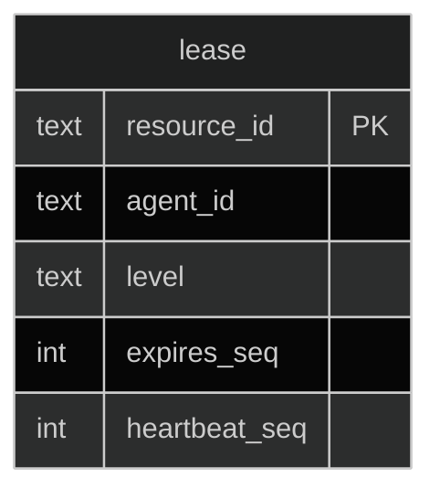


#### AgentPool

**SQLite file:** `agentpool.sqlite`

No `a2a_card_url` column required here: A2AGateway owns cards. AgentPool talks iceoryx2 to A2AGateway after lease.

```sql
PRAGMA journal_mode = WAL;
PRAGMA synchronous = FULL;
PRAGMA busy_timeout = 5000;
PRAGMA foreign_keys = ON;
PRAGMA temp_store = MEMORY;

CREATE TABLE agent (
  agent_id TEXT PRIMARY KEY,
  parent_agent TEXT,
  nesting_level INTEGER NOT NULL,
  status TEXT NOT NULL,
  pid INTEGER,
  spawn_ts INTEGER,
  capabilities_json TEXT
);
```


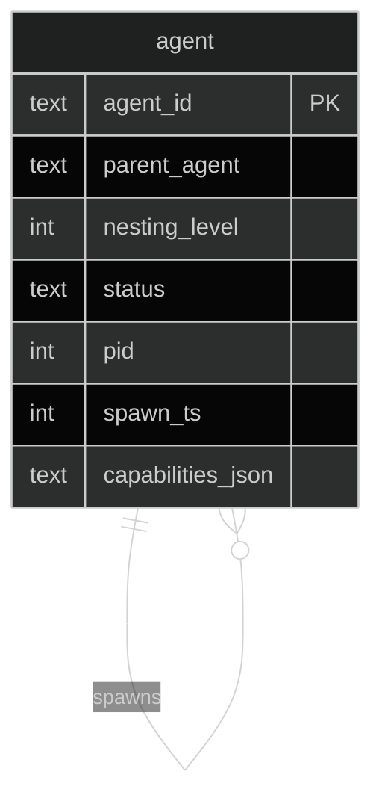


#### A2AGateway

**SQLite file:** `a2agateway.sqlite`

```sql
PRAGMA journal_mode = WAL;
PRAGMA synchronous = FULL;
PRAGMA busy_timeout = 5000;
PRAGMA foreign_keys = ON;
PRAGMA temp_store = MEMORY;

CREATE TABLE a2a_card (
  agent_id TEXT PRIMARY KEY,
  card_url TEXT NOT NULL,
  published_seq INTEGER NOT NULL,
  revoked_seq INTEGER
);
```


```mermaid
%%{init: {'theme': 'dark'}}%%
erDiagram
    a2a_card {
        text agent_id PK
        text card_url
        int published_seq
        int revoked_seq
    }
```


#### MergeCoordinator

**SQLite file:** `mergecoordinator.sqlite`

```sql
PRAGMA journal_mode = WAL;
PRAGMA synchronous = FULL;
PRAGMA busy_timeout = 5000;
PRAGMA foreign_keys = ON;
PRAGMA temp_store = MEMORY;

CREATE TABLE merge_point (
  parent_card TEXT PRIMARY KEY,
  required_state TEXT NOT NULL,
  state TEXT NOT NULL,
  n_expected INTEGER NOT NULL,
  n_arrived INTEGER NOT NULL
);

CREATE TABLE merge_child (
  parent_card TEXT NOT NULL,
  child_card TEXT NOT NULL,
  arrived_event_id TEXT,
  PRIMARY KEY (parent_card, child_card)
);
```


```mermaid
%%{init: {'theme': 'dark'}}%%
erDiagram
    merge_point {
        text parent_card PK
        text required_state
        text state
        int n_expected
        int n_arrived
    }
    merge_child {
        text parent_card
        text child_card PK
        text arrived_event_id
    }
    merge_point ||--|{ merge_child : expects
```


#### Watchdog

**SQLite file:** `watchdog.sqlite`

```sql
PRAGMA journal_mode = WAL;
PRAGMA synchronous = FULL;
PRAGMA busy_timeout = 5000;
PRAGMA foreign_keys = ON;
PRAGMA temp_store = MEMORY;

CREATE TABLE heartbeat (
  agent_id TEXT PRIMARY KEY,
  last_seq INTEGER NOT NULL,
  last_event_id TEXT,
  last_fd_tick INTEGER NOT NULL
);

CREATE TABLE stall (
  agent_id TEXT NOT NULL,
  stall_count INTEGER NOT NULL,
  last_progress_seq INTEGER NOT NULL
);

CREATE TABLE write_set (
  event_id TEXT NOT NULL,
  path TEXT NOT NULL
);

CREATE TABLE storm (
  agent_id TEXT NOT NULL,
  token_rate REAL NOT NULL,
  loop_count INTEGER NOT NULL,
  window_start INTEGER NOT NULL
);
```


```mermaid
%%{init: {'theme': 'dark'}}%%
erDiagram
    heartbeat {
        text agent_id PK
        int last_seq
        text last_event_id
        int last_fd_tick
    }
    stall {
        text agent_id
        int stall_count
        int last_progress_seq
    }
    write_set {
        text event_id
        text path
    }
    storm {
        text agent_id
        real token_rate
        int loop_count
        int window_start
    }
    heartbeat ||--o{ stall : tracks
    heartbeat ||--o{ storm : tracks
```


#### DiscoveryDaemon

**SQLite file:** `discovery.sqlite`

**No `inference` table.** Engine DiscoveryDaemon MUST NOT probe models.

```sql
PRAGMA journal_mode = WAL;
PRAGMA synchronous = FULL;
PRAGMA busy_timeout = 5000;
PRAGMA foreign_keys = ON;
PRAGMA temp_store = MEMORY;

CREATE TABLE locator_seen (
  locator TEXT PRIMARY KEY,
  scheme TEXT NOT NULL,
  first_seq INTEGER NOT NULL,
  last_liveliness INTEGER NOT NULL
);
```


```mermaid
%%{init: {'theme': 'dark'}}%%
erDiagram
    locator_seen {
        text locator PK
        text scheme
        int first_seq
        int last_liveliness
    }
```


#### HarvestDaemon

**SQLite file:** `harvestdaemon.sqlite`

```sql
PRAGMA journal_mode = WAL;
PRAGMA synchronous = FULL;
PRAGMA busy_timeout = 5000;
PRAGMA foreign_keys = ON;
PRAGMA temp_store = MEMORY;

CREATE TABLE harvest_candidate (
  component_id TEXT PRIMARY KEY,
  metric TEXT NOT NULL,
  value REAL NOT NULL,
  last_event TEXT
);
```


```mermaid
%%{init: {'theme': 'dark'}}%%
erDiagram
    harvest_candidate {
        text component_id PK
        text metric
        real value
        text last_event
    }
```


#### LearningIngest

**SQLite file:** `learningingest.sqlite`

Restores the 0.0.3 `learning` table and matches `ILearningProjection.apply(LEARNING)`: validate schema; upsert this row. No embed, no extract, no mentedb. `class` is `EFFICIENCY` or `CAPABILITY`. `action` is `CREATE`, `REVISE`, or `RETIRE`.

```sql
PRAGMA journal_mode = WAL;
PRAGMA synchronous = FULL;
PRAGMA busy_timeout = 5000;
PRAGMA foreign_keys = ON;
PRAGMA temp_store = MEMORY;

CREATE TABLE learning (
  event_id TEXT PRIMARY KEY,
  class TEXT NOT NULL,
  action TEXT NOT NULL,
  target_filename_id TEXT,
  source_agent TEXT,
  subject_ref TEXT,
  evidence_ref TEXT
);
```


```mermaid
%%{init: {'theme': 'dark'}}%%
erDiagram
    learning {
        text event_id PK
        text class
        text action
        text target_filename_id
        text source_agent
        text subject_ref
        text evidence_ref
    }
```


#### IngressGateway

**SQLite file:** `ingressgateway.sqlite`

Dedup only. IngressGateway does not append EventStore.

```sql
PRAGMA journal_mode = WAL;
PRAGMA synchronous = FULL;
PRAGMA busy_timeout = 5000;
PRAGMA foreign_keys = ON;
PRAGMA temp_store = MEMORY;

CREATE TABLE ingress_dedup (
  idempotency_key TEXT PRIMARY KEY,
  event_id TEXT NOT NULL
);
```


```mermaid
%%{init: {'theme': 'dark'}}%%
erDiagram
    ingress_dedup {
        text idempotency_key PK
        text event_id
    }
```


#### GuardDaemon

**SQLite file:** `guard.sqlite`

```sql
PRAGMA journal_mode = WAL;
PRAGMA synchronous = FULL;
PRAGMA busy_timeout = 5000;
PRAGMA foreign_keys = ON;
PRAGMA temp_store = MEMORY;

CREATE TABLE guard_state (
  guard_id TEXT PRIMARY KEY,
  node_id TEXT NOT NULL,
  consecutive_passes INTEGER NOT NULL,
  last_fired_seq INTEGER
);
```


```mermaid
%%{init: {'theme': 'dark'}}%%
erDiagram
    guard_state {
        text guard_id PK
        text node_id
        int consecutive_passes
        int last_fired_seq
    }
```


#### BreakerDaemon

**SQLite file:** `breaker.sqlite`

```sql
PRAGMA journal_mode = WAL;
PRAGMA synchronous = FULL;
PRAGMA busy_timeout = 5000;
PRAGMA foreign_keys = ON;
PRAGMA temp_store = MEMORY;

CREATE TABLE breaker_state (
  breaker_id TEXT PRIMARY KEY,
  tripped INTEGER NOT NULL,
  window_start INTEGER,
  metrics_snapshot_json TEXT
);
```


```mermaid
%%{init: {'theme': 'dark'}}%%
erDiagram
    breaker_state {
        text breaker_id PK
        int tripped
        int window_start
        text metrics_snapshot_json
    }
```


#### ParentReconciler

**SQLite file:** `parentreconciler.sqlite`

```sql
PRAGMA journal_mode = WAL;
PRAGMA synchronous = FULL;
PRAGMA busy_timeout = 5000;
PRAGMA foreign_keys = ON;
PRAGMA temp_store = MEMORY;

CREATE TABLE reconcile_job (
  child_id TEXT PRIMARY KEY,
  old_parent TEXT NOT NULL,
  new_parent TEXT,
  merge_point_id TEXT,
  status TEXT NOT NULL
);
```


```mermaid
%%{init: {'theme': 'dark'}}%%
erDiagram
    reconcile_job {
        text child_id PK
        text old_parent
        text new_parent
        text merge_point_id
        text status
    }
```


#### TestRunner

**SQLite file:** `testrunner.sqlite`

```sql
PRAGMA journal_mode = WAL;
PRAGMA synchronous = FULL;
PRAGMA busy_timeout = 5000;
PRAGMA foreign_keys = ON;
PRAGMA temp_store = MEMORY;

CREATE TABLE test_run (
  event_id TEXT PRIMARY KEY,
  node_id TEXT NOT NULL,
  test_file TEXT NOT NULL,
  result TEXT NOT NULL,
  evidence_ref TEXT
);
```


```mermaid
%%{init: {'theme': 'dark'}}%%
erDiagram
    test_run {
        text event_id PK
        text node_id
        text test_file
        text result
        text evidence_ref
    }
```


#### DeadLetter

**SQLite file:** `deadletter.sqlite`

Own daemon, own file. Not a bus field.

```sql
PRAGMA journal_mode = WAL;
PRAGMA synchronous = FULL;
PRAGMA busy_timeout = 5000;
PRAGMA foreign_keys = ON;
PRAGMA temp_store = MEMORY;

CREATE TABLE dead_letter (
  event_id TEXT PRIMARY KEY,
  seq INTEGER,
  kind TEXT,
  reason TEXT NOT NULL,
  payload_ref TEXT,
  ts_store INTEGER NOT NULL
);
```


```mermaid
%%{init: {'theme': 'dark'}}%%
erDiagram
    dead_letter {
        text event_id PK
        int seq
        text kind
        text reason
        text payload_ref
        int ts_store
    }
```


#### Retry

**SQLite file:** `retry.sqlite`

Own daemon, own file. PICK: two daemons, two files (not a module of DeadLetter).

```sql
PRAGMA journal_mode = WAL;
PRAGMA synchronous = FULL;
PRAGMA busy_timeout = 5000;
PRAGMA foreign_keys = ON;
PRAGMA temp_store = MEMORY;

CREATE TABLE retry_item (
  event_id TEXT PRIMARY KEY,
  attempt INTEGER NOT NULL,
  next_due_ms INTEGER NOT NULL,
  last_error TEXT,
  subscription TEXT NOT NULL
);
```


```mermaid
%%{init: {'theme': 'dark'}}%%
erDiagram
    retry_item {
        text event_id PK
        int attempt
        int next_due_ms
        text last_error
        text subscription
    }
```


#### MetricsDaemon

**SQLite file:** `metrics.sqlite`

PICK: `metrics_outbox` exporter table. Not source of truth. Telemetry loss MUST NOT block dispatch.

```sql
PRAGMA journal_mode = WAL;
PRAGMA synchronous = FULL;
PRAGMA busy_timeout = 5000;
PRAGMA foreign_keys = ON;
PRAGMA temp_store = MEMORY;

CREATE TABLE metrics_outbox (
  metric_id TEXT NOT NULL,
  ts_store INTEGER NOT NULL,
  value REAL NOT NULL,
  labels_json TEXT,
  PRIMARY KEY (metric_id, ts_store)
);
```


```mermaid
%%{init: {'theme': 'dark'}}%%
erDiagram
    metrics_outbox {
        text metric_id
        int ts_store
        real value
        text labels_json
    }
```


#### SchemaRegistry

**SQLite file:** `schemaregistry.sqlite`

PICK: chart is the `machine.json` file; registry is that file + hash. Seed `chart_path` = `20260818-033649-124680-7266-a219-84d3929f1e0a-catalog.machine.json`. No `chart_blob` column.

```sql
PRAGMA journal_mode = WAL;
PRAGMA synchronous = FULL;
PRAGMA busy_timeout = 5000;
PRAGMA foreign_keys = ON;
PRAGMA temp_store = MEMORY;

CREATE TABLE schema_kind (
  kind TEXT PRIMARY KEY,
  schema_id TEXT NOT NULL,
  schema_ver INTEGER NOT NULL,
  payload_schema_json TEXT NOT NULL
);

CREATE TABLE schema_alias (
  alias TEXT PRIMARY KEY,
  kind TEXT NOT NULL
);

CREATE TABLE chart_file (
  chart_path TEXT PRIMARY KEY,
  chart_hash TEXT NOT NULL,
  loaded_seq INTEGER NOT NULL
);
```


```mermaid
%%{init: {'theme': 'dark'}}%%
erDiagram
    schema_kind {
        text kind PK
        text schema_id
        int schema_ver
        text payload_schema_json
    }
    schema_alias {
        text alias PK
        text kind
    }
    chart_file {
        text chart_path PK
        text chart_hash
        int loaded_seq
    }
    schema_kind ||--o{ schema_alias : aliased_as
```


#### Config

**SQLite file:** `config.sqlite`

```sql
PRAGMA journal_mode = WAL;
PRAGMA synchronous = FULL;
PRAGMA busy_timeout = 5000;
PRAGMA foreign_keys = ON;
PRAGMA temp_store = MEMORY;

CREATE TABLE config_rev (
  rev INTEGER PRIMARY KEY,
  loaded_seq INTEGER NOT NULL,
  hash TEXT NOT NULL,
  source_path TEXT NOT NULL
);
```


```mermaid
%%{init: {'theme': 'dark'}}%%
erDiagram
    config_rev {
        int rev PK
        int loaded_seq
        text hash
        text source_path
    }
```


#### TimerDaemon

**SQLite file:** `timer.sqlite`

Sole `TIMER_TICK` producer.

```sql
PRAGMA journal_mode = WAL;
PRAGMA synchronous = FULL;
PRAGMA busy_timeout = 5000;
PRAGMA foreign_keys = ON;
PRAGMA temp_store = MEMORY;

CREATE TABLE timer (
  timer_id TEXT PRIMARY KEY,
  due_seq INTEGER,
  interval_ms INTEGER,
  last_tick_event_id TEXT,
  armed INTEGER NOT NULL
);
```


```mermaid
%%{init: {'theme': 'dark'}}%%
erDiagram
    timer {
        text timer_id PK
        int due_seq
        int interval_ms
        text last_tick_event_id
        int armed
    }
```


### 17.90 Cross-file relationships (non-normative overview)

This diagram is a **human view**. It MUST NOT be implemented as one joined database. Each entity lives in the sqlite file named in the subsections above.

```mermaid
%%{init: {'theme': 'dark'}}%%
erDiagram
    event ||--o{ committed : causes
    event ||--o{ snapshot : checkpoint_at_seq
    event ||--o{ learning : projects
    node ||--o{ card : projects
    card }o--o| agent : leased_by
    lease }o--|| card : covers
    heartbeat }o--|| agent : watches
    a2a_card }o--|| agent : publishes
    merge_point ||--|{ merge_child : expects
    board_proxy ||--|| locator_seen : child_locator
```

Cross-instance: parent `board_proxy.child_instance_id` plus `child_locator` are the only outbound keys. No join from parent Scheduler into child `card` rows.

## 18. Errant Forks and Bad Work -- Discovered Live

A **fork** here is a running agent, worktree, or card lineage that is not authorized by a live lease and a live parent, or that oscillates / writes outside its subtree, or an AI that storms tokens / hangs / contradicts memory.

| Kind | How discovered (live) | Event | Remedy |
|---|---|---|---|
| Orphan process | Watchdog heartbeat miss | `WATCHDOG_HANG` / `WORK_RELEASED` reason=dead | SIGKILL if pid still in AgentPool; card to `ready`/`blocked` |
| Orphan branch / worktree | write_set or git adapter event with no `lease` row | `FORK_ORPHAN` | Do not merge; card `blocked` |
| Bad fork (writes outside subtree) | `notify` vs `owned_subtree` | `WATCHDOG_PATH_VIOLATION` + `WORK_CONFLICTED` | SIGKILL; revoke lease |
| Thrash / reward-hack GREEN | TEST_PASS with null `first_failure` | `TRANSITION_REJECTED` + `WATCHDOG_THRASH` | TddGate forbids; Watchdog kills repeater |
| Token / loop storm | token_rate / identical loop | `WATCHDOG_AI_STORM` | SIGKILL; card RED/blocked |
| Silent hang | heartbeat fd + zero CPU + zero FS | `WATCHDOG_HANG` | Lease expire |
| Oscillating MERGE_REJECTED | flip-flop rate | `WATCHDOG_OSCILLATION` | Block; kill; no auto-accept |
| Escalation refusal | RGB bound hit, agent keeps retrying SPEC | Watchdog forces `INTEGRATION_FLAW` | Card moves to parent FEAT/ARCH; SPEC lease dropped |
| Memory contradiction | P2 proposal already on the bus | `MEMORY_CONTRADICTION` | Card `blocked` or `PROCESS_DEFECT`. No model in Watchdog |
| Split-brain two owners | second `WORK_CLAIMED` | `TRANSITION_REJECTED` | First lease wins |
| Child gone, parent waiting | `TIMER_TICK` + merge child not arrived + child lease expired or `MESH_LEAVE` | `MERGE_BLOCKED` | Parent stays blocked; child card reappears `ready` |
| Recursion bomb | spawn beyond depth/budget | `TRANSITION_REJECTED` | No new agent |
| Sidecar gone | A2A liveliness delete | `AGENT_CARD_REVOKED` | Same as dead worker |

These kinds are in SchemaRegistry. They project to `blocked` or `ready` like any other work event. They are never a batch report.

---

## 19. EventStore ACID, actor, and thread model (binding)

This section is the implementer contract for **every** write to EventStore and, unless a subsection says otherwise, for every localized sqlite file.

### 19.1 Actor

- **One OS thread owns one `Connection`.** That thread is the EventStore actor.
- Async daemons talk to it only through ``tokio-rusqlite` 0.7.0 (crates.io max_stable looked up 2026-08-31); exact rev pinned at Cargo.lock generation` `Connection::call(|conn| { ... })`.
- Inside `call`, code uses `rusqlite` APIs on **that** `conn`. `rusqlite` 0.40.2 is never used on a tokio worker thread.
- **Optional** extra READ-ONLY connections MAY live on extra threads for WAL readers.

### 19.2 Pragmas

Applied on open, before DML, on the writer (and on read-only connections where applicable):

```sql
PRAGMA journal_mode = WAL;
PRAGMA synchronous = FULL;
PRAGMA busy_timeout = 5000;
PRAGMA foreign_keys = ON;
```

### 19.3 Transaction

Each **accepted** event is one transaction:

```
conn.call(|conn| {
    let tx = conn.transaction_with_behavior(TransactionBehavior::Immediate)?;
    tx.execute("INSERT INTO event (...)", params)?;
    tx.commit()?;          // durability here
    Ok(seq)
}).await?;
iceoryx2.notify(seq);      // AFTER commit. Never notify then commit.
```

`BEGIN IMMEDIATE` (via `TransactionBehavior::Immediate`) per accepted event. Commit-then-notify. Never notify-then-commit.

### 19.4 Forbidden

| Forbidden | Why |
|---|---|
| `rusqlite` on tokio worker threads | SQLITE_MISUSE / lock inversion |
| `spawn_blocking` per statement | Hidden thread-per-query; not one owner Connection |
| Connection pool on the write path | Multiple writers on one file |
| `BEGIN` hopping threads | Transaction is bound to the connection/thread |
| `sqlx` 0.9.0 | Different runtime/pool model |
| Competing consumers on one `eventstore.sqlite` | Two writers. FORBIDDEN until clustered DB exists |
| Leader election for sqlite | No clustered DB in this design |

### 19.5 Projectors

Each projection sqlite file: **one writer thread**, same pragmas, same `call()`, rebuildable from EventStore seq. Kanban apply: COMMIT seq -> upsert row -> FS `mv` -> repair-on-replay.

---

## 20. Seed payload JSON Schema

Secrets: payloads MAY carry **opaque secret ids**. There is **no vault in seed**. Implementations MUST NOT put raw credentials in EventStore payloads.

Each catalogued kind has a schema `$id` of the form `https://hanaden.ai/sdlc/event/{kind}/v1`. SchemaRegistry `schema_kind.schema_id` stores that `$id`. Critical kinds are embedded here; remaining kinds follow the same envelope and add kind-specific `payload` properties.

**Envelope (all kinds):**

```json
{
  "$id": "https://hanaden.ai/sdlc/event/envelope/v1",
  "$schema": "https://json-schema.org/draft/2020-12/schema",
  "type": "object",
  "required": ["event_id", "kind", "schema_ver", "idempotency_key", "ts_store"],
  "properties": {
    "event_id": { "type": "string", "minLength": 1 },
    "kind": { "type": "string", "minLength": 1 },
    "schema_ver": { "type": "integer", "minimum": 1 },
    "idempotency_key": { "type": "string", "minLength": 1 },
    "work_item_id": { "type": ["string", "null"] },
    "parent_id": { "type": ["string", "null"] },
    "actor_id": { "type": ["string", "null"] },
    "secret_ids": { "type": "array", "items": { "type": "string" }, "description": "opaque secret ids; no vault in seed" },
    "payload": { "type": "object" },
    "ts_store": { "type": "integer" }
  },
  "additionalProperties": false
}
```

| Kind | schema `$id` |
|---|---|
| envelope | `https://hanaden.ai/sdlc/event/envelope/v1` |
| `TEST_PASS` / `TEST_FAIL` | `https://hanaden.ai/sdlc/event/TEST_PASS/v1` (FAIL analog) |
| `CODE_REGRESSION` / RGB | `https://hanaden.ai/sdlc/event/CODE_REGRESSION/v1` (and INTEGRATION_FLAW, UNFEASIBLE_SCOPE, BROKEN_REQUIREMENT, PARADIGM_SHIFT) |
| `HARVEST_DETECTED` | `https://hanaden.ai/sdlc/event/HARVEST_DETECTED/v1` |
| `LEARNING` | `https://hanaden.ai/sdlc/event/LEARNING/v1` |
| `MEMORY_CONTRADICTION` | `https://hanaden.ai/sdlc/event/MEMORY_CONTRADICTION/v1` |
| `WORK_CLAIMED` | `https://hanaden.ai/sdlc/event/WORK_CLAIMED/v1` |
| `MERGE_ACCEPTED` | `https://hanaden.ai/sdlc/event/MERGE_ACCEPTED/v1` |
| other section 9 kinds | `https://hanaden.ai/sdlc/event/{KIND}/v1` |

**TDD (`TEST_PASS` / `TEST_FAIL`):**

```json
{
  "$id": "https://hanaden.ai/sdlc/event/TEST_PASS/v1",
  "type": "object",
  "required": ["node_id", "test_file", "evidence"],
  "properties": {
    "node_id": { "type": "string" },
    "test_file": { "type": "string" },
    "evidence": { "type": "object" }
  }
}
```

**RGB (`CODE_REGRESSION` seed; other RGB kinds same shape with `target_type`):**

```json
{
  "$id": "https://hanaden.ai/sdlc/event/CODE_REGRESSION/v1",
  "type": "object",
  "required": ["source_test", "target_node", "target_type"],
  "properties": {
    "source_test": { "type": "string" },
    "target_node": { "type": "string" },
    "target_type": { "enum": ["SPEC", "FEAT", "ARCH", "MOTI", "DRIV", "STRAT"] }
  }
}
```

**Harvest:**

```json
{
  "$id": "https://hanaden.ai/sdlc/event/HARVEST_DETECTED/v1",
  "type": "object",
  "required": ["component_id", "rule_id", "evidence"],
  "properties": {
    "component_id": { "type": "string" },
    "rule_id": { "type": "string" },
    "evidence": { "type": "object" }
  }
}
```

**LEARNING (P2):**

```json
{
  "$id": "https://hanaden.ai/sdlc/event/LEARNING/v1",
  "type": "object",
  "required": ["source_agent", "class", "action", "subject_ref"],
  "properties": {
    "source_agent": { "type": "string" },
    "class": { "enum": ["EFFICIENCY", "CAPABILITY"] },
    "action": { "enum": ["CREATE", "REVISE", "RETIRE"] },
    "subject_ref": { "type": "string" },
    "evidence": { "type": "object" },
    "target_filename_id": { "type": "string" }
  }
}
```

**MEMORY_CONTRADICTION (P2):**

```json
{
  "$id": "https://hanaden.ai/sdlc/event/MEMORY_CONTRADICTION/v1",
  "type": "object",
  "required": ["subject_ref", "edges"],
  "properties": {
    "subject_ref": { "type": "string" },
    "edges": { "type": "array", "items": { "type": "object" } }
  }
}
```

---

## 21. Implementable slice order (always-live, no batch)

Implement in this order. Each slice is **always live** when it exists. There is no "batch MVP" and no "run the engine later."

| Slice | What boots | Live meaning |
|---|---|---|
| 1 | EventStore writer thread + pragmas + append API | Process accepts envelopes, persists seq, notifies after commit |
| 2 | Dispatcher + TddGate module + seed `machine.json` | Canonicalize, illegal TDD rejected, `TRANSITION_COMMITTED` |
| 3 | KanbanProjector | seq -> row -> `mv`; repair-on-replay |
| 4 | Watchdog | OS probes; envelopes to Dispatcher; ageing via `TIMER_TICK` once TimerDaemon exists |
| 5 | LeaseDaemon + AgentPool | Exclusive claim |
| 6 | MergeCoordinator + ParentReconciler | Fan-in |
| 7 | TestRunner | `WORK_STARTED` / notify |
| 8 | GuardDaemon + BreakerDaemon + TimerDaemon | Guards, breakers, sole clock |
| 9 | SchemaRegistry + Config (figment) | Dynamic kinds and weights |
| 10 | IngressGateway + A2AGateway + LearningIngest | P1 / P2 / P3 |
| 11 | HarvestDaemon + DiscoveryDaemon + zenoh | Instance zoom + child engines |
| 12 | DeadLetter + Retry + MetricsDaemon | Poison, backoff, export |

A running EventStore + Dispatcher is already an engine. Later slices subscribe. Nothing waits for a nightly job.

---

## 22. Appendix -- 0.0.1 construct to 0.0.5 replacement (G-044)

0.0.1 remains a historical sibling. Implementers MUST use the 0.0.5 column. The 0.0.1 column is **FORBIDDEN** at runtime.

| 0.0.1 construct | 0.0.5 replacement | FORBIDDEN if you still do this |
|---|---|---|
| Parallel kanban boards (Feature A / Feature B / cross-cutting) | **One** workstream kanban, partitions by `owned_subtree` | Opening a second board product |
| Optimistic hub merge (local copy, hub merges, reject on conflict) | Exclusive TTL lease; hub never content-merges files; collision -> `WORK_CONFLICTED` / `TRANSITION_REJECTED` | Local-copy merge; hub file merge |
| `IEventBus` (generic publish/subscribe + DLQ field) | `IMesh`: iceoryx2 service names + zenoh keyexpr + EventStore seq cursor. DLQ is the DeadLetter **daemon** | A god broker; DLQ as a bus list; Kafka/NATS as the mesh |
| Work-item state `CONFLICT` | Not a state. `WORK_CONFLICTED` projects to kanban `blocked` | A `CONFLICT` column or enum member |
| Agent `type` `AI_AGENT` | `AI_SIDECAR` (optional process behind A2A). Core has zero LLM | LLM inside Dispatcher/EventStore/Watchdog |
| Language-agnostic §11.1 (ADT + closures + any store + any bus) | **Rust 2024 daemons**, sqlite via tokio-rusqlite, iceoryx2+zenoh | Re-specifying the engine as language-agnostic in this version |
| MOTI/DRIV cardinality: 1 T-DRIV and 1 T-MOTI per project | `DRIV` 1..N per STRAT; `MOTI` 1..N per DRIV; at most one Active MOTI per DRIV; Rejected siblings required | Single MOTI with a comment that "alternatives were considered" |
| FEAT as L2 (0.0.1 table) | FEAT is **L3**, peer of ARCH; MOTI is L2 approach | Treating FEAT as MOTI's layer |
| Mermaid "Motivator Shapes Driver" | **Driver activates Motivator produces Action.** Motivator does not shape Driver | Motivator-as-parent of Driver |
| `WORK_MERGED` as a distinct lifecycle | Alias of `MERGE_ACCEPTED`. N=1 is the degenerate merge point | A second merge path named WORK_MERGED |
| MVP path (single agent, sync dispatch, file event store; parallelism additive later) | Implementable **slice order** in section 21. Always-live from slice 1. No batch. Parallelism is exclusive leases on one kanban, not a later product | Shipping a batch "MVP orchestrator run" |
| Generic event store "file or database" | Localized SQLite EventStore, one writer thread | sqlx pool; clustered Postgres in seed |
| Dispatch `event_store.dequeue_next()` as if the store were a queue bus | EventStore is append+seq; iceoryx2 notifies seq; subscribers read | Treating sqlite as a competing-consumer queue |

---

## 23. Gap close-out G-001 through G-067

| ID | Gap | Closed in |
|---|---|---|
| G-001 | Catalog = Stately machine.json; mermaid non-normative | §5, §5.0, sibling `20260818-033649-124680-7266-a219-84d3929f1e0a-catalog.machine.json` |
| G-002 | Do not run XState in Rust | §0.4 REJECTED, §5.0 |
| G-003 | Do not use statig macros as catalog | §0.4, §5.0 |
| G-004 | Drop dual scxml+statig as catalog | §0.4, §12.4 SchemaRegistry crates |
| G-005 | Interpreter generic over validated JSON | §5, Dispatcher crates |
| G-006 | SchemaRegistry validates machine.json | §8.17, §17 SchemaRegistry |
| G-007 | Seed JSON with RGB + illegal TDD absent | sibling catalog; §5.0 excerpt |
| G-008 | figment + serde; not config crate | §0.4, Config crates |
| G-009 | tokio-rusqlite 0.7 actor | §19, EventStore crates |
| G-010 | One OS thread owns one Connection | §19.1 |
| G-011 | Async `call()` | §19.3 |
| G-012 | WAL | §17 pragmas, §19.2 |
| G-013 | `synchronous=FULL` | §17, §19.2 |
| G-014 | `busy_timeout` | §17, §19.2 |
| G-015 | `BEGIN IMMEDIATE` per accepted event | §19.3 |
| G-016 | commit-then-notify | §19.3, §12.8 |
| G-017 | FORBIDDEN rusqlite on tokio workers | §19.4 |
| G-018 | FORBIDDEN spawn_blocking per statement | §19.4 |
| G-019 | FORBIDDEN write-path pool | §19.4 |
| G-020 | FORBIDDEN BEGIN hopping threads | §19.4 |
| G-021 | FORBIDDEN sqlx | §0.4, §19.4 |
| G-022 | Optional extra READ-ONLY WAL readers | §17 intro, §19.1 |
| G-023 | Projection DBs same actor pattern | §17 intro, §19.5 |
| G-024 | SQLite RDBMS; not clustered Postgres | §0.4, §17 intro |
| G-025 | P2 allow-list LEARNING and MEMORY_CONTRADICTION only | §0.5, §12.6, §12.8 |
| G-026 | Sidecar MUST NOT append EventStore | §0.5, §12.6, §12.8 |
| G-027 | Sidecar MUST NOT mv cards | §0.5 |
| G-028 | TEST_*/WORK_COMPLETED are engine paths after lease, not P2 | §0.5, §12.3 TestRunner/AgentPool |
| G-029 | AGENT_CARD_* is A2AGateway, not P2 | §0.5, §8.9, §12.3 |
| G-030 | DiscoveryDaemon MUST NOT probe models | §12.3, §17 DiscoveryDaemon |
| G-031 | NO inference table in engine sqlite | §17 DiscoveryDaemon |
| G-032 | Engine tests pass with Ollama down | §0.5, §12.6 |
| G-033 | MCP forbidden | §0.4, §0.5 |
| G-034 | MQTT/rumqttc out of seed | §0.4, §12.1, IngressGateway crates |
| G-035 | rustmem and MenteDB neither in seed sidecar | §0.4, §12.6 |
| G-036 | Inference is a locator inside one sidecar binary | §0.4, §0.5, §12.2 |
| G-037 | DeadLetter and Retry two daemons two files | §12.3, §17 DeadLetter, §17 Retry |
| G-038 | Watchdog name (not Watchdog) | §0.5 inventory, §12.3 |
| G-039 | LeaseDaemon (not slash names) | §12.3, §17 LeaseDaemon |
| G-040 | TddGate = Dispatcher module; gate_reject in dispatcher.sqlite | §12.3, §17 TddGate |
| G-041 | Scheduler = Dispatcher policy module | §12.3, §17 Scheduler |
| G-042 | MetricsDaemon (not slash) | §12.3, §17 MetricsDaemon |
| G-043 | AgentPool without a2a-client; A2AGateway sole A2A crates | §12.4 AgentPool, A2AGateway |
| G-044 | 0.0.1 construct mapping appendix | §22 |
| G-045 | EventStore append one owner (Dispatcher) | §12.3 append rule, §12.8 |
| G-046 | Sequences match: Ingress/TestRunner/Watchdog do not sqlite-append | §12.8 |
| G-047 | Competing consumers FORBIDDEN | §12.7, §19.4 |
| G-048 | TIMER_TICK TimerDaemon only | §12.3 TimerDaemon, §0.5 P1 |
| G-049 | TestRunner does not consume TIMER_TICK for suite sweeps | §12.3 TestRunner |
| G-050 | Kanban apply: COMMIT -> projector -> mv -> repair-on-replay | §12.7, §17 KanbanProjector, §19.5 |
| G-051 | Per-daemon ER CREATE + erDiagram or NONE line | §17 |
| G-052 | Guard ER | §17 GuardDaemon |
| G-053 | Breaker ER | §17 BreakerDaemon |
| G-054 | ParentReconciler ER | §17 ParentReconciler |
| G-055 | TestRunner ER | §17 TestRunner |
| G-056 | LearningIngest CREATE matching ILearningProjection | §17 LearningIngest, §8.13 |
| G-057 | Snapshot is EventStore.snapshot | §17 Snapshot |
| G-058 | SchemaRegistry file+hash (schema_kind, schema_alias, chart_file) | §17 SchemaRegistry |
| G-059 | Config config_rev | §17 Config |
| G-060 | TimerDaemon timer table | §17 TimerDaemon |
| G-061 | Per-daemon crate tables; one pick per slot; scxml dropped | §12.4 |
| G-062 | IMesh = iceoryx2 + zenoh + seq; DLQ is DeadLetter daemon | §8.9 |
| G-063 | One producer per join/leave kind; no INFERENCE_* | §8.9, §9.9 |
| G-064 | Seed payload JSON Schema + opaque secret ids | §20 |
| G-065 | Zoom labels SPEC / L3 / instance / engine | §11 mermaid, §14 |
| G-066 | Implementable slice order always-live | §21 |
| G-067 | Consider-then-choose CHOSEN and REJECTED; no OR | §0.4 |

---


## Changelog

| Version | Date | Author | Changes |
|---|---|---|---|
| 0.0.1 | 2026-08-18 | Frederick Bloom | Original generic deterministic engine: taxonomy, RGB, guards, breakers, event-sourced core, star orchestrator, harvest, interfaces, event catalog. |
| 0.0.2 | 2026-08-30 | Frederick Bloom + Claude (Cursor AI) | Overlay attempt (workstream kanban, exclusive ownership, merge-point events, process/external events, TDD gate notes). **FAILED integration** -- two kanbans, two merge stories, two ownership models. Kept as historical sibling. Do not implement. |
| 0.0.3 | 2026-08-30 | Frederick Bloom + Claude (Cursor AI) | Integrated rewrite plus live-orchestrator **sketch**: one taxonomy, one kanban, one merge, one ownership; loops as zoom levels; ER sketch; generic event bus still named. Do not implement as the IPC contract. |
| 0.0.4 | 2026-08-30 | Frederick Bloom + Claude (Cursor AI) | Named iceoryx2 plus zenoh, locator-only discovery, A2A sidecar *intent*, one kanban / one merge / exclusive lease. Per-daemon ER and crate tables were **sketches**, not complete. Dual catalog language (SCXML + statig) and leftover OR crate picks remained. Do not implement. |
| 0.0.5 | 2026-08-31 | Frederick Bloom + Cursor Grok 4.6 | Closes G-001–G-067 versus 0.0.4. Catalog is Stately `machine.json`. figment+serde. tokio-rusqlite 0.7 actor. Per-daemon CREATE TABLE plus erDiagram. P2 allow-list LEARNING and MEMORY_CONTRADICTION only. One EventStore append owner (Dispatcher). DeadLetter and Retry are two daemons. MQTT, rustmem, MenteDB, and inference tables out of seed. |
