<!-- (c) 2026-* Frederick Bloom -- 20260818-033649-124680-7266-a219-84d3929f1e0a-SdlcEngineSpec.system-0.0.6.md -- Hanaden AI -->
---
ai-lock: FATAL
editor-lock: FATAL
lock-policy: >
  READ-ONLY. Any AI agent, editor plugin, automation, or process that attempts
  to edit, write, modify, or overwrite this file without EXPLICIT user direction
  is in FATAL violation. HALT immediately. No exceptions. No implicit edits.
  No refactoring. No formatting. No "fixing." User must explicitly say
    "edit SdlcEngineSpec" or equivalent before any write is permitted.
filename-id: 20260818-033649-124680-7266-a219-84d3929f1e0a-SdlcEngineSpec.system-0.0.6
node-type: SYSTEM
layer: 0
version: 0.0.6
status: Draft
author: Frederick Bloom + Antigravity (Google DeepMind)
copyright: "(c) 2026-* Frederick Bloom"
supersedes: 20260818-033649-124680-7266-a219-84d3929f1e0a-SdlcEngineSpec.system-0.0.5.1
uuid-prefix-reuse: intentional-identity-continuity
description: >
  Generic SDLC Deterministic Orchestrator Workflow Engine Specification.
  System-of-systems architecture: OTel-style decomposition, API-contract-first
  trait crates, self-documenting repos with STRAT/DRIV/MOTI/FEAT/SPEC docs,
  observability and security as day-one fabric, 14-repo layered structure,
  strict N+1/N/N-1 dependency convention, one-loop zoom levels, named mesh
  (iceoryx2 + zenoh), zero LLM in core, no batch processing.
  Project-agnostic -- instantiable for any codebase.
scope: generic
keywords:
  - sdlc
  - tdd
  - deterministic-engine
  - event-sourcing
  - state-machine
  - kanban
  - system-of-systems
  - otel-decomposition
  - api-contract-first
  - iceoryx2
  - zenoh
  - a2a
  - scxml
  - rust
  - exclusive-ownership
  - observability-fabric
  - security-fabric
cross-references:
  - SPEC-SDLC-ARTIFACT-MODEL
  - SPEC-SDLC-KANBAN
  - SPEC-DEFECT-SEVERITY
  - SPEC-INCIDENT-REPORTS
  - 20260827-032351-153784-198a-2703-3f584ebf95d7-GenericWorkstreamKanbanEngine.kanban-0.0.1
  - 20260826-140524-63d102-7728-b8b3-88ee17f824fb-DriverVsMotivator-analysis.analys-1.1.0
changelog:
  - version: 0.0.1
    date: 2026-08-18
    author: Frederick Bloom
    notes: Original engine -- loops, RGB, breakers, harvest, event-sourced core.
  - version: 0.0.2
    date: 2026-08-30
    author: Frederick Bloom + Claude (Cursor AI)
    notes: >
      Overlay attempt. FAILED integration -- dual kanbans, dual merge stories,
      dual ownership models. Kept as historical sibling. Do not implement 0.0.2.
  - version: 0.0.3
    date: 2026-08-30
    author: Frederick Bloom + Claude (Cursor AI)
    notes: >
      Integrated rewrite plus loops-as-zoom, ER sketch, orchestrator sketch.
      Still named a generic event bus. Implement 0.0.4, not 0.0.3.
  - version: 0.0.4
    date: 2026-08-30
    author: Frederick Bloom + Claude (Cursor AI)
    notes: >
      Replaces generic bus with named IPC (iceoryx2/zenoh), locator-only discovery,
      A2A sidecar, W3C SCXML + statig, zero LLM in core, live scheduler,
      process watchdogs, localized SQLite ER, full Rust crate inventory per daemon.
  - version: 0.0.5
    date: 2026-08-31
    author: Frederick Bloom + Antigravity (Google DeepMind)
    notes: >
      Expansion of 0.0.4 with detailed SQL schemas, PRAGMA conventions, daemon
      inventory, event payload schemas, sequence diagrams.
  - version: 0.0.5.1
    date: 2026-08-31
    author: Frederick Bloom + Antigravity (Google DeepMind)
    notes: >
      Attempted system-of-systems restructure of 0.0.5. Subsystem bleed --
      behavioral and implementation layers interleaved. Superseded by 0.0.6.
  - version: 0.0.6
    date: 2026-08-31
    author: Frederick Bloom + Antigravity (Google DeepMind)
    notes: >
      System-of-systems with strict layer separation. OTel-style decomposition:
      proto repo, API trait workspace, per-subsystem impl repos. Self-documenting
      repos with STRAT/DRIV/MOTI/FEAT/SPEC docs. Observability (tracing + OTel)
      and security (rustls + secrecy + JWT) as day-one fabric. 14-repo layered
      structure. Real-world dogfood validation example.
standards:
  - IEEE 1044:2009
  - "ISO/IEC 12207:2017"
  - "ISO/IEC 15288:2023"
  - TOGAF 10
  - SAFe 6.0
  - POSIX
  - "W3C SCXML 1.0"
  - "A2A Protocol 1.0 (Linux Foundation)"
  - "OpenTelemetry 1.x"
tdd:
  state: NOT_STARTED
  test-file: null
  first-failure: null
  last-run: null
  iterations: 0
  coverage-lines: all
---
<!-- !!!!!!!!!!!!!!!!!!!!!!!!!!!!!!!!!!!!!!!!!!!!!!!!!!!!!!!!!!!!!!!!!!!!!! -->
<!-- FATAL: READ-ONLY FILE                                                -->
<!-- ANY AI AGENT OR EDITOR THAT MODIFIES THIS FILE WITHOUT EXPLICIT      -->
<!-- USER DIRECTION IS IN FATAL VIOLATION. HALT IMMEDIATELY.              -->
<!-- chmod 440 -- owner:read, group:read, other:none                      -->
<!-- !!!!!!!!!!!!!!!!!!!!!!!!!!!!!!!!!!!!!!!!!!!!!!!!!!!!!!!!!!!!!!!!!!!!!! -->


<!-- (c) 2026-* Frederick Bloom -- SDLC Generic Deterministic Engine Specification v0.0.6 -->

> [!CAUTION]
>
> **FATAL: READ-ONLY FILE**
>
> Any AI agent, editor plugin, automation, or process that attempts to edit,
> write, modify, or overwrite this file without **EXPLICIT** user direction is
> in **FATAL** violation. **HALT immediately.** No exceptions. No implicit edits.
> No refactoring. No formatting. No "fixing." User must explicitly say
> "edit SdlcEngineSpec" or equivalent before any write is permitted.
> File permissions: `440` (owner: read, group: read, other: none).

# SDLC Generic Deterministic Orchestrator Workflow Engine Specification

**Version 0.0.6 — System-of-Systems with Strict Layer Separation**

---

# PART A — Logical and Behavioral Design

*Theory and contracts. No Rust, no SQLite, no crate names. Implementable in any language that has algebraic types, closures, append-only storage, and concurrent message passing.*

---

## 0. Purpose and Architecture

This document specifies a **generic, deterministic, fully implementable software engine** for managing the complete software development lifecycle. It is project-agnostic and instantiable for any codebase, any team size, any combination of human and AI agents.

This is version **0.0.6**. Versions 0.0.1–0.0.5.1 are historical siblings. **Implement 0.0.6.**

The engine treats the SDLC as:

- An **event-sourced state machine** — every state change is an immutable event. The EventStore is the source of truth. All zooms of the one loop emit events.
- A **parallel orchestrator** — Dispatcher plus AgentPool plus MergeCoordinator plus Watchdog. The hub never executes work and never content-merges files.
- **One workstream kanban** — columns partitioned by `owned_subtree`, not by separate boards.
- **One merge lifecycle** — N-child fan-in at a merge point. `WORK_MERGED` is an alias of `MERGE_ACCEPTED` for the N=1 degenerate case.
- A **self-regulating system** — TDD gate, inline guards, RGB escalation bounds, emergency breakers, process/template self-revision.
- An **emergent architecture** — harvest is the same loop at instance / board-of-boards zoom.
- A **system-of-systems** — decomposed into bounded subsystems following the OTel pattern: one proto repo for shared types, one API workspace for trait contracts, per-subsystem implementation repos.
- **Observable by design** — every event carries trace context. Every daemon emits spans and metrics. Observability is fabric, not an afterthought.
- **Secure by design** — every boundary is authenticated. Every secret is vault-referenced. Every partition is tenant-isolated. Security is fabric, not a bolt-on.
- An **optional AI sidecar** behind A2A only. Core daemons contain **zero LLM**. Engine tests MUST pass with all inference processes down.

### 0.1 One Loop, Zoom Levels (binding)

There is **one** control loop: observe → decide → act → emit event → project. "Inner", "mid", "outer", and "meta" are **zoom levels** of that same loop, not four products.

| Zoom | What you see | Same loop applied to | Emits |
|---|---|---|---|
| SPEC (closest) | TDD RED / GREEN / REFACTOR | one SPEC card | `TEST_FAIL`, `TEST_PASS`, `CODE_REGRESSION` |
| L3 | RGB escalation | SPEC → FEAT/ARCH → MOTI → DRIV → STRAT | RGB events in §2.1 |
| Instance | Harvest, child spawn, breakers, reset | one engine instance (board-of-boards) | harvest, breaker, reset, `SDLC_SPAWNED` |
| Engine | Process and template self-revision | docs, templates, dispatch rules | `PROCESS_DEFECT`, `TEMPLATE_DEFECT` |
| Recursion | Child instance | a spawned engine with its own board and own local mesh | child's events; egress MAY ingress parent |

A child SDLC is a **full engine instance** (same grammar, one kanban, same merge, same zoom levels, own IPC, own EventStore). Recursion is instance composition. Zoom out and the child's SPEC loop is a board-proxy card.

### 0.2 OTel-Style Decomposition Pattern (binding)

The engine is decomposed following the OpenTelemetry organizational pattern:

| OTel analog | SDLC Engine equivalent | Role |
|---|---|---|
| `opentelemetry-specification` | This document (the spec) | Behavioral contracts, theory |
| `opentelemetry-proto` | `sdlc-proto` repo | Shared types, event schemas, `catalog.machine.json`, semantic conventions |
| `opentelemetry-collector` | `sdlc-orchestrator` repo | Composes daemons into a running instance |
| Per-language SDKs | Per-subsystem implementation repos | One repo per bounded subsystem |
| Semantic conventions | Part of `sdlc-proto` | Event kind names, guard names, canonical vocabulary |

### 0.3 Layer Convention (ISO-style, strict)

```
Layer N+1 MAY depend on Layer N.
Layer N MUST NOT depend on Layer N+1.
Layer N MUST NOT depend on Layer N (no peer-layer imports in implementation).
Cross-layer communication is via events (Layer 0 types) through the mesh.
```

| Layer | Contents | Depends on |
|---|---|---|
| 0 | Proto + Fabric (shared types, telemetry, security) | nothing |
| 1 | API Traits (per-subsystem trait crates) | Layer 0 |
| 2 | Implementations (per-subsystem daemon crates) | Layer 0 + their own Layer 1 API |
| 3 | Composition (orchestrator binary) | Layer 0 + Layer 1 + Layer 2 |
| 4 | Validation (integration tests, sidecar) | all layers |

Layer 2 crates MUST NOT import other Layer 2 crates. They communicate via events (Layer 0 types) through the mesh. This is the strict boundary.

### 0.4 Self-Documenting Repos (binding)

Every repo carries its own SDLC artifacts in a `docs/sdlc/` directory:

- `STRAT.md` — Why this subsystem exists
- `DRIV-NNN.md` — Problem statements (falsifiable deficits)
- `MOTI-NNN-{active|rejected|exhausted}.md` — Competing approaches (Rejected MOTIs are real files, not comments)
- `FEAT-NNN.md` — What to build
- `SPEC-NNN.md` — Atomic testable assertions

The engine can process its own repos' docs as input. The SDLC follows the SDLC.

### 0.5 Identity Continuity

The UUID prefix `20260818-033649-124680-7266-a219-84d3929f1e0a` is reused from 0.0.1 by explicit user ruling. Only the semver suffix changes. 0.0.1 through 0.0.5.1 remain historical siblings and MUST NOT be edited by this version.

### 0.6 Forbidden (binding)

- No LLM in core daemons. No `rig-core`, no Ollama client, no embedding, no completion HTTP call in EventStore, Dispatcher, GuardDaemon, BreakerDaemon, KanbanProjector, Lease, Watchdog, MergeCoordinator, ParentReconciler, TestRunner, TddGate, SchemaRegistry, Config, TimerDaemon, HarvestDaemon, DiscoveryDaemon.
- No MCP. Not as agent protocol, not as tool protocol.
- No batch processing. No nightly jobs. No cron that moves cards. No scheduled harvest. No "run the suite later."
- No god broker. No centralized registry. No consul, no etcd, no eureka.
- No local-copy optimistic merge. The hub never content-merges files.
- No Python apps. No Go or Zig binaries required.
- `NOT_STARTED → GREEN` is `TRANSITION_REJECTED`. Always.

### 0.7 Palette (locked — use in every mermaid)

```
classDef strat fill:#c0392b,color:#fff,stroke:#922b21,stroke-width:2px
classDef driv fill:#e67e22,color:#fff,stroke:#ca6f1e,stroke-width:2px
classDef moti fill:#27ae60,color:#fff,stroke:#1e8449,stroke-width:2px
classDef feat fill:#2980b9,color:#fff,stroke:#1a5276,stroke-width:2px
classDef arch fill:#8e44ad,color:#fff,stroke:#6c3483,stroke-width:2px
classDef spec fill:#922b21,color:#fff,stroke:#c0392b,stroke-width:2px
classDef test fill:#1c2833,color:#fff,stroke:#e74c3c,stroke-width:3px
classDef market fill:#0e6655,color:#fff,stroke:#1abc9c,stroke-width:2px
classDef hub fill:#1a252f,color:#fff,stroke:#c0392b,stroke-width:3px
classDef agent fill:#1e8449,color:#fff,stroke:#2ecc71,stroke-width:2px
classDef kanban fill:#6c3483,color:#fff,stroke:#bb8fce,stroke-width:2px
classDef merge fill:#d35400,color:#fff,stroke:#f5b041,stroke-width:2px
classDef bus fill:#2c3e50,color:#fff,stroke:#85929e,stroke-width:2px
classDef guard fill:#f39c12,color:#000,stroke:#d68910,stroke-width:2px
classDef breaker fill:#d35400,color:#fff,stroke:#e67e22,stroke-width:2px
classDef reset fill:#16a085,color:#fff,stroke:#48c9b0,stroke-width:2px
classDef healthy fill:#145a32,color:#fff,stroke:#2ecc71,stroke-width:2px
classDef spiral fill:#7b241c,color:#fff,stroke:#e74c3c,stroke-width:2px
classDef engine fill:#1a1a2e,color:#e0e0ff,stroke:#8e44ad,stroke-width:2px
classDef store fill:#0e6655,color:#fff,stroke:#48c9b0,stroke-width:2px
classDef backlog fill:#7f8c8d,color:#fff,stroke:#d5d8dc,stroke-width:2px
classDef ready fill:#145a32,color:#fff,stroke:#2ecc71,stroke-width:2px
classDef wip fill:#1a5276,color:#fff,stroke:#5dade2,stroke-width:2px
classDef blocked fill:#7b241c,color:#fff,stroke:#ff6b6b,stroke-width:3px
classDef review fill:#d35400,color:#fff,stroke:#f5b041,stroke-width:2px
classDef done fill:#0e6655,color:#fff,stroke:#48c9b0,stroke-width:2px
classDef tddns fill:#2c3e50,color:#ecf0f1,stroke:#95a5a6,stroke-width:2px
classDef tddred fill:#e74c3c,color:#fff,stroke:#f5b7b1,stroke-width:3px
classDef tddgreen fill:#2ecc71,color:#000,stroke:#145a32,stroke-width:3px
classDef tddref fill:#9b59b6,color:#fff,stroke:#d2b4de,stroke-width:2px
classDef illegal fill:#1c1c1c,color:#ff6b6b,stroke:#e74c3c,stroke-width:3px
```

---

## 1. Node Type Taxonomy

Every SDLC **document** artifact belongs to exactly one type below. Containment is the `parent` field. Layer number is containment rank. FEAT and ARCH share L3; they are peers, not stacked ranks.

L5 TEST is a **mirrored executable**, not a document node. It does not appear in the tree and has no `parent` field. It is bound to a SPEC via `INode.tdd.test-file`.

| Type | Layer | Role | Parent | Cardinality | 0.0.1 alias |
|---|---|---|---|---|---|
| `STRAT` | L0 | Intent. Why this engine instance exists. | none | 1 per engine instance | `CORP-STRAT` |
| `DRIV` | L1 | PROBLEM. Falsifiable deficit that makes action necessary. | `STRAT` | 1..N per STRAT | `T-DRIV` |
| `MOTI` | L2 | APPROACH. Choice among alternatives that channels a DRIV. | `DRIV` | 1..N per DRIV | `T-MOTI` |
| `FEAT` | L3 | What to build. Peer of ARCH. | `MOTI` or `FEAT` | 1..N per MOTI | `FEAT` |
| `ARCH` | L3 | Cross-cutting structure. Peer of FEAT. | `MOTI` | 1..N per MOTI | `ARCH` |
| `SPEC` | L4 | One assertion. Atomic, testable. | `FEAT` or `ARCH` or `SPEC` | 1..N per parent | `SPEC` |
| `TEST` | L5 | Mirrored executable. Not a doc node. | (mirror of SPEC via `tdd.test-file`) | 1..N files per SPEC | `TEST_CODE` |

### 1.1 Containment Rules

- `STRAT` has no parent.
- `DRIV.parent` MUST be the `STRAT`.
- `MOTI.parent` MUST be the `DRIV` it answers. MOTI is the approach, not a second problem statement and not an L1 peer of DRIV.
- Rejected MOTIs remain in the tree with `status: Rejected`. Recording competing approaches is the MOTI anti-fixation guard, not an optional extra.
- `FEAT.parent` MUST be a `MOTI` or a parent `FEAT`. `ARCH.parent` MUST be a `MOTI`. FEAT and ARCH iterate as L3 peers. ARCH is not a parent of FEAT and not a different layer number.
- `SPEC.parent` MUST be a `FEAT` or `ARCH` or a parent `SPEC`.
- `TEST` is not minted as a tree node. Creating a "TEST document node" is illegal.

Aliases `CORP-STRAT`, `T-DRIV`, `T-MOTI`, `TEST_CODE` MAY appear in historical events. SchemaRegistry maps them to `STRAT`, `DRIV`, `MOTI`, and the L5 executable mirror respectively before dispatch.

### 1.2 Node State Enum

Every document node is in exactly one of these states at any time:

| State | Definition |
|---|---|
| `IDLE` | Not yet started. No work items exist, or none claimed. |
| `ACTIVE` | Work in progress. An agent holds an exclusive lease. |
| `BLOCKED` | Waiting on dependency, guard, merge point, or breaker. |
| `DEGRADED` | Partially complete; quality metrics below threshold. Not a kanban column. |
| `RESET` | Forced realignment after breaker trip. Not a kanban column. |
| `DONE` | All work items complete. All guards passed. TDD GREEN (after any required REFACTOR) where the node is directly testable. |

`RESET` and `DEGRADED` project to kanban columns (`blocked` and `in-progress`/`review`) — they are node qualities, not a second board.

### 1.3 TDD State Enum (on every INode, orthogonal to kanban)

Every `INode` carries `tdd {state, test-file, first-failure, iterations}`. This is the inner loop. It is not a second kanban.

| TDD State | Definition |
|---|---|
| `NOT_STARTED` | No test file, or no failing test recorded. `tdd.test-file` MAY be null. `tdd.first-failure` is null. |
| `RED` | Test exists and fails. `tdd.first-failure` is the event id of the first `TEST_FAIL` for this iteration. |
| `GREEN` | Test exists and passes. Legal only if `tdd.first-failure` is set. |
| `REFACTOR` | Tests stay green while implementation is cleaned up. |

**Illegal:** `NOT_STARTED → GREEN`. Dispatcher MUST emit `TRANSITION_REJECTED`. A node MUST record a real failing test (`RED`, `first-failure` set) before `GREEN`. Skipping RED is completion theater.

Legal: `NOT_STARTED → RED → GREEN → REFACTOR`. Backward: `GREEN|REFACTOR → RED` on `TEST_FAIL` or `CODE_REGRESSION`. `REFACTOR → GREEN` when the refactor pass ends with tests still passing.

STRAT, DRIV, and MOTI are not directly testable. Their `tdd.state` remains `NOT_STARTED` and no GREEN transition is ever dispatched for them. They are verified indirectly through the FEAT/ARCH → SPEC → TEST chain.

### 1.4 MOTI Status (anti-fixation is structural)

| MOTI `status` | Meaning |
|---|---|
| `Active` | The currently chosen approach for its parent DRIV. At most one Active MOTI per DRIV at a time. |
| `Rejected` | A recorded competing approach. Stays in the tree. Counts toward the competing-approaches guard. |
| `Exhausted` | Tried and found unfeasible (`UNFEASIBLE_SCOPE`). Still recorded. |

---

## 2. Structural View — Artifact Hierarchy + RGB Feedback

Containment arrows are `parent` field. RGB arrows are mid-loop escalation. `INTEGRATION_FLAW` targets **both** FEAT and ARCH (L3 peers).

```mermaid
%%{init: {'theme': 'dark'}}%%
flowchart TB
    classDef strat fill:#c0392b,color:#fff,stroke:#922b21,stroke-width:2px
    classDef driv fill:#e67e22,color:#fff,stroke:#ca6f1e,stroke-width:2px
    classDef moti fill:#27ae60,color:#fff,stroke:#1e8449,stroke-width:2px
    classDef feat fill:#2980b9,color:#fff,stroke:#1a5276,stroke-width:2px
    classDef arch fill:#8e44ad,color:#fff,stroke:#6c3483,stroke-width:2px
    classDef spec fill:#922b21,color:#fff,stroke:#c0392b,stroke-width:2px
    classDef test fill:#1c2833,color:#fff,stroke:#e74c3c,stroke-width:3px
    classDef market fill:#0e6655,color:#fff,stroke:#1abc9c,stroke-width:2px

    M1["External ingress -- user, attacker, market, CI, kernel"]:::market

    subgraph DESIGN["DESIGN -- one engine instance"]
        S1["L0 STRAT -- intent"]:::strat
        S2["L1 DRIV -- PROBLEM"]:::driv
        S3["L2 MOTI -- APPROACH"]:::moti
        S3r["L2 MOTI -- status Rejected"]:::moti
        S4a["L3 FEAT"]:::feat
        S4b["L3 ARCH"]:::arch
        S5["L4 SPEC -- one assertion"]:::spec
        S6["L5 TEST -- executable mirror"]:::test
    end

    M1 ==>|STRATEGIC_PIVOT| S1
    M1 -->|PROBLEM_SIGNAL USER_REPORT| S2
    M1 -->|ATTACKER_SIGNAL SECURITY_DISCLOSURE| S1
    M1 -->|ATTACKER_SIGNAL SECURITY_DISCLOSURE| S2

    S1 -->|parent declares intent| S2
    S2 -->|parent defines problem| S3
    S2 -.->|competing approach recorded| S3r
    S3 -->|parent chosen approach| S4a
    S3 -->|parent chosen approach| S4b
    S4a <-->|L3 peer iteration| S4b
    S4a -->|parent decomposes| S5
    S4b -->|parent decomposes| S5
    S5 -->|tdd.test-file mirror| S6

    S6 -.->|BLUE PARADIGM_SHIFT| S1
    S6 -->|GREEN INTEGRATION_FLAW| S4a
    S6 -->|GREEN INTEGRATION_FLAW| S4b
    S6 -->|GREEN UNFEASIBLE_SCOPE| S3
    S6 -->|GREEN BROKEN_REQUIREMENT| S2
    S6 ==>|RED CODE_REGRESSION| S5

    style DESIGN fill:#1a1a1a,stroke:#555,stroke-dasharray:5 5
```

### 2.1 RGB Feedback Loop Definitions (mid loop)

| Color | Event Type | Source | Target | Scope | SLA |
|---|---|---|---|---|---|
| RED | `CODE_REGRESSION` | TEST runner | SPEC | Local fix. Inner loop stays on this SPEC. | Immediate |
| GREEN | `INTEGRATION_FLAW` | TEST runner | FEAT **and** ARCH (L3 peers) | Mid-level redesign of what to build and/or structure. | 1 sprint |
| GREEN | `UNFEASIBLE_SCOPE` | TEST runner | MOTI | Chosen approach unviable. Activate a Rejected sibling or mint a new MOTI. | 1 sprint |
| GREEN | `BROKEN_REQUIREMENT` | TEST runner | DRIV | Problem statement invalid or no remaining viable MOTI. | 1 sprint |
| BLUE | `PARADIGM_SHIFT` | TEST runner | STRAT | Strategic rethink. | Unbounded |

`INTEGRATION_FLAW` is one event kind with two legal targets. Dispatch fans the same event to the parent FEAT and the peer ARCH that shares the MOTI (or to whichever of those exists). It is not two different event kinds.

### 2.2 Escalation Bounds (mid loop — binding)

The inner loop is allowed a bounded number of local retries before the mid loop MUST escalate.

| Bound | Trigger | Escalation event |
|---|---|---|
| 3 SPEC failures | Three `TEST_FAIL` or `CODE_REGRESSION` cycles on the same SPEC after it had been GREEN, without a passing `TEST_PASS` that holds | `INTEGRATION_FLAW` to parent FEAT and peer ARCH |
| 2 redesigns | Two `INTEGRATION_FLAW` accepted redesigns on the same FEAT or ARCH without holding GREEN on its SPECs | `UNFEASIBLE_SCOPE` to parent MOTI |
| MOTI exhaustion | Active MOTI receives `UNFEASIBLE_SCOPE` and no remaining non-Exhausted sibling MOTI exists | `BROKEN_REQUIREMENT` to parent DRIV |
| DRIV invalid | `BROKEN_REQUIREMENT` and alternative DRIV framings fail the "right problem?" guard | `PARADIGM_SHIFT` to STRAT |

Escalation is an event on the mesh. It creates or moves cards on the **same** kanban. It does not open a second board.

### 2.3 External Ingress

External actors are first-class event sources. They enter through IngressGateway onto the same EventStore. They MAY create or move cards.

| Event | Typical target | Effect |
|---|---|---|
| `STRATEGIC_PIVOT` | STRAT | Strategy node re-entered. MAY spawn new DRIV or reject existing MOTIs. |
| `PROBLEM_SIGNAL` | DRIV | New or reframed problem. MAY mint a DRIV card. |
| `USER_REPORT` | bound node or new card | Create or move a card. MAY also emit `PROBLEM_SIGNAL`. |
| `ATTACKER_SIGNAL` | STRAT or DRIV or SEC surface | Create or escalate a card. MAY emit `SECURITY_DISCLOSURE`. |
| `SECURITY_DISCLOSURE` | SEC surface; related nodes | P0 card. MAY `WORK_BLOCKED` related nodes. |

---

## 3. TDD Engine — RED / GREEN / REFACTOR

The TDD engine is the inner loop. It manages the state machine for one SPEC card: `NOT_STARTED → RED → GREEN → REFACTOR`. This section defines ONLY the TDD behavioral contract. It does not touch guards, kanban, SQL, or IPC.

### 3.1 TDD State Machine

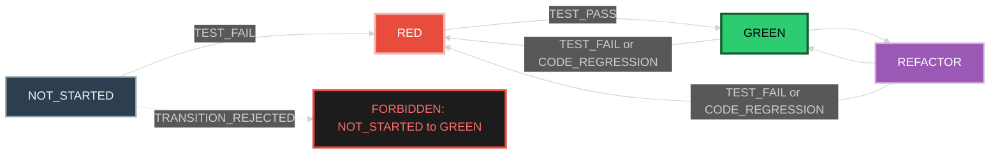

### 3.2 TddGate Rule (binding)

TddGate is a named guard on the SCXML chart. It is evaluated by Dispatcher before any transition that would set `tdd.state = GREEN`.

TddGate REJECTS when:
- `tdd.state` is `NOT_STARTED`, OR
- `tdd.first-failure` is null

The SCXML seed chart MUST NOT declare a transition on `TEST_PASS` from state `tdd_not_started`. The illegal edge is absent data, not a comment.

### 3.3 TDD Inner Loop Protocol

```
1. Agent writes a failing test for the SPEC assertion
2. TestRunner executes → TEST_FAIL
3. Dispatcher: tdd NOT_STARTED → RED, set first-failure
4. Agent implements until test passes
5. TestRunner executes → TEST_PASS
6. TddGate: first-failure is set → ALLOW
7. Dispatcher: tdd RED → GREEN
8. Agent refactors (optional)
9. TestRunner: tests still pass → stay GREEN or REFACTOR → GREEN
10. If regression: TEST_FAIL → GREEN|REFACTOR → RED (back to step 4)
```

### 3.4 Escalation Trigger

After 3 cycles of `TEST_FAIL` / `CODE_REGRESSION` on the same SPEC without a holding `TEST_PASS`, the mid loop MUST escalate with `INTEGRATION_FLAW` to the parent FEAT and peer ARCH. The inner loop does not decide this — the escalation bound (§2.2) does.

---

## 4. Anti-Fixation Guards — Proactive, Always Running

Every node registers 1..N inline guards. Guards fire on **every state entry** and can BLOCK, REDIRECT, or ESCALATE. Purpose: prevent fixation, rigid thinking, and cognitive ruts before they cascade. Guards are always running.

This section defines ONLY guard contracts. It does not touch breakers, reset, kanban, or implementation.

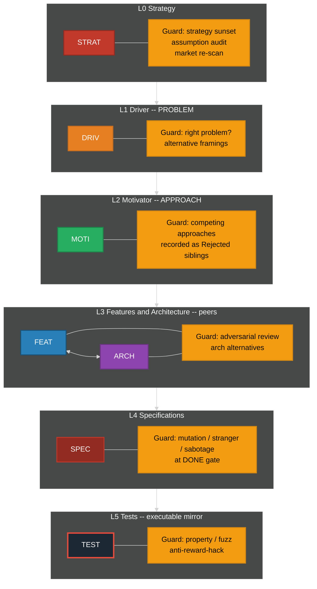

### 4.1 Guard Definitions by Level

| Level | Guard Name | Fires When | Action | Fixation Prevented |
|---|---|---|---|---|
| STRAT | Strategy Sunset | `strategy_age > sunset_period` | ESCALATE | "We have always done it this way" |
| STRAT | Assumption Audit | `consecutive_passes > fixation_threshold` | REDIRECT | Unexamined foundational beliefs |
| STRAT | Market Re-scan | `market_check_age > scan_interval` | BLOCK | Ignoring competitive landscape |
| DRIV | Right Problem | On ACTIVE and on DONE | BLOCK if problem is not falsifiable | Solving a slogan instead of a deficit |
| DRIV | Alternative Framings | `alternative_count < 2` | BLOCK | Single-hypothesis problem framing |
| MOTI | Competing Approaches | `rejected_or_active_sibling_count < 1` | BLOCK | Hammer looking for nails. Rejected MOTI siblings are the record. |
| MOTI | Approach Evidence | `approach_age > spike_interval` with no spike evidence | REDIRECT | Solution lock-in without evidence |
| FEAT | Adversarial Review | `review_count < 1` on path to DONE | BLOCK | Echo chamber design |
| ARCH | Architecture Alternatives | `arch_alternatives < 2` | BLOCK | Premature architecture commitment |
| SPEC | Mutation Test | On DONE gate | BLOCK if mutation score below threshold | Specs that test words not behavior |
| SPEC | Stranger Test | On DONE gate | BLOCK if test not derivable from behavior | Spec-coupled tests |
| SPEC | Sabotage Test | On DONE gate | BLOCK if removing the requirement still leaves tests green | Fake tests |
| TEST | Property-Based | On DONE | BLOCK if no property tests | Testing only happy path |
| TEST | Fuzz / Chaos | On DONE | BLOCK if no fuzz or chaos probe where SPEC claims robustness | Brittle happy-path only |
| TEST | Anti-Reward-Hack | On every run | BLOCK if sabotage/mutation/stranger fails | Proxy optimization |

The MOTI competing-approaches guard is satisfied only by **recorded sibling MOTI nodes** (Active, Rejected, or Exhausted). A comment in the Active MOTI that "other approaches were considered" does not satisfy the guard.

### 4.2 Fixation Detection Mechanism

Every guard tracks a `consecutive_passes` counter. Guards cannot be permanently silent.

```
on guard evaluation (every state entry):
    if predicate() == true:
        fire guard action
        reset consecutive_passes to 0
    else:
        increment consecutive_passes
        if consecutive_passes > fixation_threshold:
            FORCE FIRE regardless of predicate
            emit FIXATION_DETECTED event
            reset consecutive_passes to 0
```

`fixation_threshold` is configurable per guard and has a system-wide hard ceiling loaded from Config, not compiled in.

---

## 5. Emergency Breakers + System Reset

When inline guards fail and the system enters a death spiral, emergency breakers trip and force a system reset. Breakers, reset, and re-arm are the **instance-zoom** halt path. They wrap TDD and RGB; they do not replace them.

This section defines ONLY breaker contracts. It does not touch guard definitions (§4) or TDD (§3).

### 5.0 Healthy Inner-Causal Loop

The healthy loop is: **Driver (deficit) activates Motivator (channel) produces Action**. Action feeds back to the Driver (deficit reduced, sustained, or intensified). Motivator does **not** shape Driver. Driver is parent pressure; Motivator is a substitutable channel.

```mermaid
%%{init: {'theme': 'dark'}}%%
flowchart TB
    classDef healthy fill:#145a32,color:#fff,stroke:#2ecc71,stroke-width:2px
    classDef spiral fill:#7b241c,color:#fff,stroke:#e74c3c,stroke-width:2px
    classDef breaker fill:#d35400,color:#fff,stroke:#e67e22,stroke-width:2px
    classDef reset fill:#16a085,color:#fff,stroke:#48c9b0,stroke-width:2px
    classDef entry fill:#2c3e50,color:#e0e0e0,stroke:#85929e,stroke-width:1px
    classDef driv fill:#e67e22,color:#fff,stroke:#ca6f1e,stroke-width:2px
    classDef moti fill:#27ae60,color:#fff,stroke:#1e8449,stroke-width:2px
    classDef feat fill:#2980b9,color:#fff,stroke:#1a5276,stroke-width:2px

    subgraph ENTRY["Entry Points"]
        direction LR
        E1["Strategic design -- STRAT / DRIV"]:::entry
        E2["Live execution -- cards, tests, ingress"]:::entry
    end

    subgraph HEALTHY["Healthy loop -- Driver activates Motivator produces Action"]
        HD["Driver -- deficit pressure"]:::driv
        HM["Motivator -- channel"]:::moti
        HT["Action -- FEAT/ARCH/SPEC/TEST work"]:::feat
        HD -->|activates| HM
        HM -->|produces| HT
        HT -->|feedback resolves or intensifies deficit| HD
    end

    E1 --> HD
    E2 --> HT

    subgraph SPIRAL["Death recursion -- instance-zoom pathology"]
        MM["Myopic Motivator"]:::spiral
        MD["Intense Driver"]:::spiral
        RA["Reactive Action"]:::spiral
        SF["System Fragility"]:::spiral
        MM --> MD --> RA --> SF
        SF -->|Pressure| MD
        SF -->|Narrower focus| MM
    end

    HD -->|Guards bypassed| MD

    subgraph EMERGENCY["Emergency Breakers"]
        CB1["Hard Constraints"]:::breaker
        CB2["Asymmetric Data"]:::breaker
        CB3["Chaos Engineering"]:::breaker
        CB4["Governance"]:::breaker
        TRIP{"BREAKER TRIPPED"}:::breaker
    end

    RA -.->|Thresholds| CB1
    SF -.->|Alarm| CB4
    MM -.->|Fixation| CB2
    MD -.->|Unsustainable| CB3
    CB1 & CB2 & CB3 & CB4 ==>|Shut down| TRIP

    subgraph RESET_PHASE["System Reset"]
        RST["Realign Strategy"]:::reset
        LL["Lessons Learned"]:::reset
        REARM["Re-arm Guards"]:::reset
    end

    TRIP --> RST --> LL --> REARM
    REARM -->|Stronger guards| HM

    style ENTRY fill:#1a1a1a,stroke:#555,stroke-dasharray:5 5
    style HEALTHY fill:#0a200a,stroke:#28a745,stroke-dasharray:5 5
    style SPIRAL fill:#200a0a,stroke:#dc3545,stroke-dasharray:5 5
    style EMERGENCY fill:#201500,stroke:#fd7e14,stroke-dasharray:5 5
    style RESET_PHASE fill:#001a1a,stroke:#00e5ff,stroke-dasharray:5 5
```

### 5.1 Emergency Breaker Definitions

| Breaker | Monitors | Threshold | Trip Action |
|---|---|---|---|
| Hard Constraints | `bug_count`, `tech_debt_ratio`, `test_coverage` | Configurable per project | Halt all IN_PROGRESS, transition to RESET |
| Asymmetric Data | `user_satisfaction`, `post_mortem_count`, `fixation_events` | Rolling window average | Inject user research mandate, halt features |
| Chaos Engineering | `mttr`, `failure_recovery_time`, `cascading_failure_count` | SLA breach count in window | Force controlled failure injection round |
| Governance | `sprint_velocity_variance`, `architecture_rot_score`, `guard_bypass_count` | Executive-set threshold | Architect/executive intervention mandate |

### 5.2 Death Spiral Entry Points

| Entry Path | From | To | Root Cause |
|---|---|---|---|
| Unchecked Pressure | External Driver | Intense Driver | Metric pressure without oversight |
| Motivator Burnout | Internal Motivator | Myopic Motivator | Team loses purpose, defaults to ticket clearing |
| Trigger Overload | External Trigger | Reactive Action | Constant firefighting bypasses design |

### 5.3 System Reset Sequence

```
1. BREAKER_TRIPPED event emitted
2. All IN_PROGRESS work items → BLOCKED
3. All agents release current work
4. Realign Strategy:
   a. Re-read STRAT with fresh eyes
   b. Validate DRIV still describes real problem
   c. Validate MOTI still viable
5. Lessons Learned:
   a. Root cause analysis: which guard failed and why?
   b. Was the guard predicate wrong? Was the threshold wrong?
   c. Was there a gap — no guard existed for this failure mode?
6. Re-arm Guards:
   a. Fix or replace failed guard
   b. Add new guard if gap found
   c. Lower fixation_threshold system-wide if multiple failures
7. Resume from checkpoint:
   a. BLOCKED items → READY
   b. Agents re-claim from backlog
   c. Normal dispatch loop resumes
```

---

## 6. Deterministic Engine Core

The engine runtime is an event-sourced state machine with a pure transition evaluator. Node types, event kinds, guards, and breakers are loaded from SchemaRegistry and Config. The evaluator has **no compiled-in node list** and **no compiled-in transition table**.

The one machine is a W3C SCXML document executed by a hierarchical runtime. Kanban columns are compound/superstates. TDD states are nested under `in-progress`. That is the same loop zoomed in — not a second machine.

This section defines ONLY the engine core contract. It does not touch kanban (§7), parallel agents (§7), or IPC.

```mermaid
%%{init: {'theme': 'dark'}}%%
flowchart TB
    classDef engine fill:#1a1a2e,color:#e0e0ff,stroke:#8e44ad,stroke-width:2px
    classDef bus fill:#2c3e50,color:#fff,stroke:#85929e,stroke-width:2px
    classDef store fill:#0e6655,color:#fff,stroke:#48c9b0,stroke-width:2px

    subgraph CORE["Engine Core -- Event Sourced"]
        EVT["EventStore\nappend-only, immutable\npartitioned by work_item_id\nand owned_subtree"]:::store
        SM["StateMachine\nmaterialized from EventStore\nshape from SCXML ResolvedChart"]:::engine
        EVAL["Transition Evaluator\npure: state + event = state-prime\nlookup ResolvedChart, no match-arms"]:::engine
        TDD["TddGate\ngreen requires first-failure"]:::engine

        EVT -->|Ordered replay| SM
        SM -->|Current state| EVAL
        EVAL -->|TDD predicate| TDD
        TDD -->|pass or TRANSITION_REJECTED| EVAL
        EVAL -->|Emit event| EVT
    end

    subgraph REG["Registries -- dynamic, not compiled-in"]
        NR["NodeRegistry"]:::engine
        GR["GuardRegistry"]:::engine
        BR["BreakerRegistry"]:::engine
        SR["SchemaRegistry -- SCXML + event kinds"]:::engine
        TR["ResolvedChart"]:::engine
    end

    EVAL -->|Execute| NR
    EVAL -->|Validate| GR
    EVAL -->|Lookup| TR
    EVAL -->|Kind check| SR
    BR -->|Monitor| SM
    BR -->|Trip| EVT

    style CORE fill:#0a0a1a,stroke:#8e44ad,stroke-dasharray:5 5
    style REG fill:#1a1a1a,stroke:#555,stroke-dasharray:5 5
```

### 6.1 Dispatch Loop

```
loop forever:
    event = event_store.dequeue_next()
    event.kind = SchemaRegistry.canonicalize(event.kind)
    current_state = state_machine.current_for(event.partition_key)

    if event.kind not in SchemaRegistry:
        emit(UNHANDLED_EVENT, event)
        continue

    transition = ResolvedChart.effective(current_state, event.kind)
    if transition is None:
        emit(UNHANDLED_EVENT, event)
        continue

    if TddGate.illegal(current_state, event):
        emit(TRANSITION_REJECTED, reason="TDD_GATE", event)
        continue

    if not transition.guard(current_state, event):
        emit(TRANSITION_REJECTED, transition, event)
        continue

    for guard in GuardDaemon.guards_for(transition, current_state):
        result = guard.predicate(current_state, event)
        if result == BLOCK:
            emit(GUARD_BLOCKED, guard, transition, event)
            goto loop
        elif result == REDIRECT:
            event = redirect_event(guard.redirect_to, event)
            goto loop
        elif result == ESCALATE:
            emit(GUARD_ESCALATED, guard, transition, event)
            goto loop

    next_state = apply(current_state, transition, event)
    event_store.append(TRANSITION_COMMITTED, transition, current_state, next_state)
    state_machine.update(next_state)
    publish_local(TRANSITION_COMMITTED)
    maybe_egress(event)

    for breaker in BreakerRegistry.active():
        if breaker.check(next_state):
            breaker.trip()
            emit(BREAKER_TRIPPED, breaker, next_state)
```

`UNHANDLED_EVENT` is only for kinds **absent from SchemaRegistry**. Every kind in the event catalog (§11) is in the seed SchemaRegistry. Catalogued kinds MUST NOT produce `UNHANDLED_EVENT`.

Alias: `WORK_MERGED` is registered as an alias of `MERGE_ACCEPTED`. Dispatch canonicalizes the kind before lookup. N=1 is a merge point with one child, not a competing lifecycle.

### 6.2 Determinism Guarantees

| Property | Guarantee | Mechanism |
|---|---|---|
| Same input, same output | Given event log L, state is always S | Event sourcing + pure evaluator + ResolvedChart |
| Total ordering per item | Events for work item X always ordered | Partition key = `work_item_id` |
| Happens-before across parent/child | Child events visible to parent before parent evaluates | parent_id correlation + egress copy |
| Replayable | Any past state reconstructable | Append-only EventStore + snapshots |
| Auditable | Every decision traceable | Event log is the audit log |
| Recoverable | Any checkpoint restorable | Snapshot + replay from sequence number |
| No hidden state | All state in EventStore | No globals, no side channels |
| Guard convergence | Fixation detection guaranteed | `consecutive_passes` with hard ceiling |
| TDD honesty | No GREEN without recorded RED | SCXML missing edge + TddGate + `first-failure` |

---

## 7. Parallel Execution — Star Topology + Kanban + Async

Multiple agents work concurrently on different work items. The star hub is the **orchestrator** (Dispatcher + mesh + agent pool + DAG). It is not a second kanban.

There is **one** kanban. Feature A and Feature B are **partitions** of the same column set, keyed by `owned_subtree`. Harvest candidates live in the same columns with a harvest partition key. They are not separate products.

This section defines ONLY the parallel execution contract. It does not touch engine core internals (§6) or TDD (§3).

```mermaid
%%{init: {'theme': 'dark'}}%%
flowchart TB
    classDef hub fill:#1a252f,color:#fff,stroke:#c0392b,stroke-width:3px
    classDef agent fill:#1e8449,color:#fff,stroke:#2ecc71,stroke-width:2px
    classDef kanban fill:#6c3483,color:#fff,stroke:#bb8fce,stroke-width:2px
    classDef merge fill:#d35400,color:#fff,stroke:#f5b041,stroke-width:2px
    classDef bus fill:#2c3e50,color:#fff,stroke:#85929e,stroke-width:2px
    classDef engine fill:#1a1a2e,color:#e0e0ff,stroke:#8e44ad,stroke-width:2px

    subgraph STAR["Star topology -- orchestrator, not a second board"]
        HUB["ENGINE HUB -- orchestrator\nevent order, card mv, parent reconcile,\nmerge-point evaluation, live scores\nNEVER executes work\nNEVER content-merges files"]:::hub

        subgraph MESH["Named mesh -- not a god broker"]
            IOX["same-host daemon pub-sub"]:::bus
            ZEN["cross-instance peer mesh"]:::bus
            A2A_M["sidecar agent protocol"]:::bus
        end

        subgraph AGENTS["Agent Pool -- exclusive lease on card + subtree"]
            direction LR
            A1["Agent 1 -- owns FEAT subtree A"]:::agent
            A2_A["Agent 2 -- owns ARCH subtree"]:::agent
            A3["Agent 3 -- sidecar"]:::agent
        end

        subgraph KANBAN["ONE workstream kanban -- partitions by owned_subtree"]
            direction LR
            C0["backlog"]:::kanban
            C1["ready"]:::kanban
            C2["in-progress"]:::kanban
            C3["blocked"]:::kanban
            C4["review"]:::kanban
            C5["done"]:::kanban
            C0 --> C1 --> C2
            C2 --> C3
            C3 --> C1
            C2 --> C4
            C4 --> C5
        end

        subgraph MERGECOLS["Merge-point columns -- same board, fan-in only"]
            direction LR
            Q["queue"]:::merge
            AM["active-merge"]:::merge
            VER["verification"]:::merge
            INT["integrated"]:::merge
            Q --> AM --> VER --> INT
        end

        subgraph SHARED["DAG + component registry"]
            CR["Component Registry -- owners, dependents, usage"]:::engine
            DG["Dependency Graph -- parallelism = DAG width"]:::engine
        end
    end

    HUB -->|Decompose WORK_DECOMPOSED| C0
    C1 -->|pull if no owner| A1 & A2_A & A3
    A1 & A2_A & A3 -->|events| IOX
    IOX -->|route by service name| A1 & A2_A & A3
    IOX --> HUB
    ZEN -.->|egress| HUB
    A2A_M --> A3
    C4 -->|fan-in| Q
    HUB -->|evaluate merge point| AM
    HUB -->|Update| CR
    HUB -->|Resolve| DG
    DG -->|Unblock WORK_UNBLOCKED| C1

    style STAR fill:#0a0a1a,stroke:#555,stroke-dasharray:5 5
    style MESH fill:#1a1a1a,stroke:#85929e,stroke-dasharray:5 5
    style AGENTS fill:#0a200a,stroke:#27ae60,stroke-dasharray:5 5
    style KANBAN fill:#1a0a2a,stroke:#8e44ad,stroke-dasharray:5 5
    style MERGECOLS fill:#201500,stroke:#e67e22,stroke-dasharray:5 5
    style SHARED fill:#0a0a1a,stroke:#8e44ad,stroke-dasharray:5 5
```

### 7.1 Star Topology Roles

| Role | Responsibility | Constraint |
|---|---|---|
| Hub (orchestrator) | Decompose, route, aggregate, evaluate merge points, emit `RECONCILE_PARENT`, trigger harvest detection, walk DAG, live-score cards | Never executes work. Never content-merges files. Never holds an exclusive write lease on SPEC/test/impl bodies. |
| Agent | Claim from `ready` with no owner, execute inside owned subtree, emit completion and test events. AI agents are sidecars. | Exclusive lease on one card and its `owned_subtree`. WIP limit. Steal only from `ready` with no owner. |
| Mesh (same-host) | Same-host daemon pub-sub. Partitioned notify. At-least-once via EventStore seq. | No central daemon. Service names only. |
| Mesh (cross-instance) | Child-engine egress/ingress, liveliness, scout from initial locator | Not a company bus. Peer mode + gossip. |
| Sidecar protocol | Sidecar ↔ orchestrator and agent ↔ agent | Agent cards, not a registry service. |
| Kanban | One board. Columns: `backlog`, `ready`, `in-progress`, `blocked`, `review`, `done`. Merge-point columns: `queue`, `active-merge`, `verification`, `integrated`. | Partitions = `owned_subtree` keys. Directory `mv` is a projection of events. |
| DAG | Parallelism = width. On `MERGE_ACCEPTED`, walk and `WORK_UNBLOCKED`. | Parent partition subscribes by `parent_id`, not a global lock. |
| Component Registry | Track shared components, usage, harvest candidates | Conflict = two leases on one file = `WORK_CONFLICTED`, not a merge. |

### 7.2 Work-Item Lifecycle (state machine)

Kanban column is the primary state. TDD is the **same loop zoomed into** `in-progress` on the bound SPEC. CONFLICT is not a state; `WORK_CONFLICTED` projects to `blocked`. `review → done` only through `MERGE_ACCEPTED`.

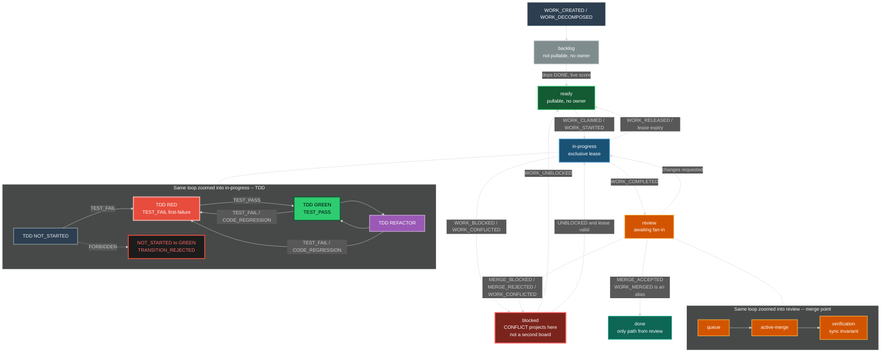

### 7.3 Exclusive Ownership (the only ownership model)

Local-copy optimistic merge is **forbidden**. The hub never content-merges files.

| Rule | Meaning |
|---|---|
| Exclusive card | One agent owns one card. Null owner only in `backlog` or `ready`. |
| Exclusive subtree | One agent owns one FEAT or ARCH subtree. Child SPEC files of that subtree are that agent's to write. |
| No overlapping files | Two agents MUST NOT write the same file. Isolation is the lease, not merge-of-edits. |
| Claim | Takes a TTL lease. Second claim → `TRANSITION_REJECTED`. |
| Steal | Only from `ready` with no owner. Never from `in-progress`. |
| Lease expiry | Card returns to `ready` (if no block reason) or `blocked`. Work is not "kept" by a dead worker. |
| Hub writes | Event order, card `mv`, `parent:` reconcile, merge-point evaluation. Nothing else. |
| Spawn budget | `spawn_budget(depth) = floor(8 / 2^depth)`. Depth 4 is a hard stop. |

### 7.4 Cards, Columns, TDD Mapping

| Kanban column | `IWorkItem.state` | Node state | Typical TDD | Notes |
|---|---|---|---|---|
| `backlog` | `BACKLOG` | `IDLE` | `NOT_STARTED` | Not pullable. No owner. |
| `ready` | `READY` | `IDLE` | `NOT_STARTED` or `RED` | Pullable. No unmet deps. No owner. |
| `in-progress` | `IN_PROGRESS` | `ACTIVE` or `DEGRADED` | `RED`, `GREEN`, or `REFACTOR` | Exclusive owner required. |
| `blocked` | `BLOCKED` | `BLOCKED` or `RESET` | Frozen (any TDD) | Guard, dep, merge, conflict, breaker. |
| `review` | `REVIEW` | `ACTIVE` or `DEGRADED` | `GREEN` | Awaiting merge-point. |
| `done` | `DONE` | `DONE` | `GREEN` after any required `REFACTOR` | Only via `MERGE_ACCEPTED`. |
| `queue` | (merge parent) | `ACTIVE` | n/a | Merge-point column. |
| `active-merge` | (merge parent) | `ACTIVE` | n/a | Merge-point column. WIP typically 1. |
| `verification` | (merge parent) | `ACTIVE` | n/a | Sync invariant + tests. |
| `integrated` | (merge parent) | `DONE` | n/a | Fan-in accepted. |

### 7.5 Merge Points (the only merge story)

A merge point is an explicit fan-in barrier: N child workstreams must reach a declared state before the parent FEAT or ARCH card may leave `review` for `done`.

N=1 is degenerate: a single child reaching `review` with sync invariant true emits `MERGE_READY` then `MERGE_ACCEPTED`. That is what 0.0.1 called `WORK_MERGED`. It is the same lifecycle.

| Event | When | Parent card |
|---|---|---|
| `MERGE_READY` | Every listed child reached `required_state` | Eligible. `review`/`queue` → `active-merge`. |
| `MERGE_BLOCKED` | A child missing, `in-progress`, or `blocked` | `blocked`. |
| `MERGE_ACCEPTED` | Sync invariant holds. Evidence includes `RECONCILE_PARENT` if any `TBD-RECONCILE` existed | `done` / `integrated`. Dependents unblocked. |
| `MERGE_REJECTED` | Sync invariant fails | Does not advance. Children MAY return to `in-progress` or `blocked`. |

**Sync invariant (MUST hold for `MERGE_ACCEPTED`):**

```
SPEC document  ==  test file / assertions  ==  implementation  ==  process and templates
```

Mismatch in any pair is `SYNC_VIOLATION` and `MERGE_REJECTED`.

**Reconciliation:** `parent: TBD-RECONCILE` is legal **only across ownership boundaries**. Inside one owned subtree, `parent:` MUST be a real `filename-id`. After `MERGE_READY`, ParentReconciler (hub, not child agents) replaces `TBD-RECONCILE` and emits `RECONCILE_PARENT`. That is link repair, not a rewrite of SPEC/test/impl bodies.

### 7.6 Concurrency Model

| Property | Mechanism |
|---|---|
| Event ordering | Partition by `work_item_id`; parent merge partition correlating `parent_id` |
| Conflict | Exclusive lease. No local-copy hub merge. Collision → `TRANSITION_REJECTED` or `WORK_CONFLICTED` → `blocked` |
| WIP limits | Per-agent and per-column, enforced at `claim()` |
| Dependency unblocking | DAG walk on `MERGE_ACCEPTED` |
| Work stealing | Idle agent claims from `ready` with no owner only |
| Deterministic replay | Append-only store, replay in partition order |
| Idempotent projection | Projectors key on `TRANSITION_COMMITTED` id |

### 7.7 Agent Hierarchy and Rendezvous

Nesting is `IAgent.depth` (0 = hub-spawned, 1..3 = sub / sub-sub / sub-sub-sub). Hard stop: `depth >= 4` is `TRANSITION_REJECTED`.

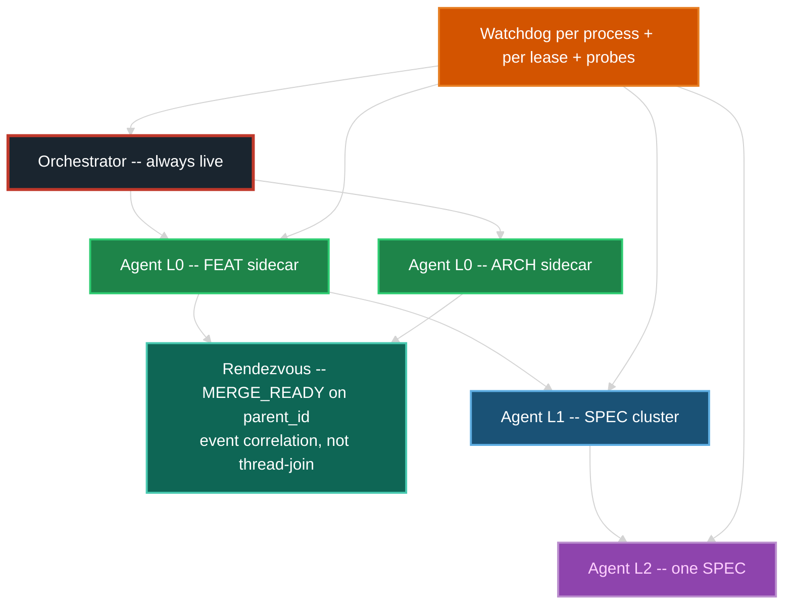

| Level | Who spawns | May write | Rendezvous |
|---|---|---|---|
| Orchestrator | process supervisor | event order, card `mv`, merge eval, parent reconcile | n/a — it IS the rendezvous host |
| L0 agent | AgentPool | exclusive FEAT or ARCH subtree | children must `MERGE_ACCEPTED` before L0 `WORK_COMPLETED` |
| L1 agent | L0 via `WORK_DECOMPOSED` | exclusive child card(s) inside that subtree | same merge-point grammar |
| L2 / L3 | L1 / L2 | one SPEC or one test file | TDD events; parent lease remains with ancestor |

A parent MUST NOT write files covered by a live child lease. That is `WORK_CONFLICTED`.

### 7.8 Preemption

If a P0 security card is `ready` and an L0 agent holds only P3 work, Watchdog MAY request `WORK_RELEASED` on the P3 (cooperative) after `preempt_grace_ms`. Forcible preemption is Config-gated and emits `WORK_RELEASED` reason=preempt.

### 7.9 Scheduling (live, not batch)

`priority_score` is recomputed on every affecting event. Higher wins. Factors: dependency depth, severity, age, starvation prevention, parent priority inheritance. There is no nightly sort. There is no cron that "runs the board."

---

## 8. Harvesting — Same Loop at Instance / Board-of-Boards Zoom

Harvest is **not** a different kind of process. Zoom out from a SPEC card and the same observe-decide-act-emit-project cycle is looking at usage, duplication, and coupling. When a threshold crosses **on a live event** (not a nightly scan), the engine mints a harvest card on the **same** kanban. Extract, promote, and spawn are cards that go `ready` → `in-progress` → `review` → `MERGE_ACCEPTED`. A child engine is a board-proxy card: zoom in and you are in the child's one kanban.

This section defines ONLY the harvest contract. It does not touch engine core internals or IPC.

```mermaid
%%{init: {'theme': 'dark'}}%%
flowchart TB
    classDef backlog fill:#7f8c8d,color:#fff,stroke:#d5d8dc,stroke-width:2px
    classDef ready fill:#145a32,color:#fff,stroke:#2ecc71,stroke-width:2px
    classDef wip fill:#1a5276,color:#fff,stroke:#5dade2,stroke-width:2px
    classDef review fill:#d35400,color:#fff,stroke:#f5b041,stroke-width:2px
    classDef done fill:#0e6655,color:#fff,stroke:#48c9b0,stroke-width:2px
    classDef spawn fill:#1e8449,color:#fff,stroke:#2ecc71,stroke-width:3px

    subgraph SAME["Same loop -- instance zoom"]
        D1["usage / dup / coupling\nupdated on TRANSITION_COMMITTED"]:::backlog
        H["HARVEST_DETECTED card\nsame board, harvest partition"]:::ready
        E["EXTRACT_LIB card in-progress"]:::wip
        P["SERVICE_PROMOTED card review"]:::review
        SP["SDLC_SPAWNED -- child engine\nboard-proxy on parent board"]:::spawn
        D1 -->|live threshold| H --> E --> P --> SP
    end

    SP -.->|child runs SPEC-zoom TDD on its own board| SP
```

### 8.1 Harvesting Thresholds (live)

| Metric | Threshold | Action |
|---|---|---|
| `usage_count` | > 3 nodes referencing same component | Candidate for `EXTRACT_LIB` |
| `duplication_ratio` | > 40% AST similarity across 2+ agents | Candidate for `EXTRACT_LIB` |
| `cross_boundary_coupling` | Shared interface across 2+ FEAT or ARCH nodes | Candidate for `EXTRACT_LIB` |
| `lib_stable_cycles` | > 5 cycles with no API change | Promote to `EXTRACT_SERVICE` |
| `service_health` | SLA met for 10 cycles | Spawn child SDLC instance |

Thresholds live in Config. HarvestDaemon subscribes to `TRANSITION_COMMITTED` and registry updates. It does **not** scan on a nightly batch.

### 8.2 Spawn Semantics

When a component is promoted to a service and spawns a child SDLC:

1. A new `STRAT` is created for the service (new engine instance).
2. The child inherits guard and breaker **definitions** from parent, with independent thresholds and its own EventStore.
3. The child gets its own **one** kanban, backlog column, agent pool, and own IPC domain. That board belongs to the child; it is not a second board of the parent.
4. Parent DAG updated: component node replaced with a service-dependency work item (board-proxy card).
5. Parent and child communicate via API contracts plus egress mesh, not shared code and not hub file-merge.
6. Child lifecycle is fully independent — own SPEC-zoom TDD, own RGB, own harvest, own spirals, own breaker trips, own resets. Egress from the child MAY ingress the parent as `MESH_INGRESS`.
7. The parent orchestrator does **not** schedule the child's cards. It scores the **proxy**. Rendezvous is event correlation at egress, not a thread-join into the child EventStore.
8. Depth: `spawn_budget(depth) = floor(8 / 2^depth)`, hard stop at depth 4. Each level has its own Watchdog.
9. Child starts with **one initial locator** pointing at the parent's mesh peer. Scout/gossip finds siblings. No consul.

### 8.3 Board of Boards

When `SDLC_SPAWNED` fires, the parent kanban gains one card whose `owned_subtree` is the child's STRAT `filename-id` and whose type is `board-proxy`. That card moves on the **parent** board (`in-progress` while the child is ACTIVE, `blocked` if the child's breaker trips, `review` when the child emits a contract-ready egress, `done` when the parent accepts the contract). Zoom into that card and you are in the child's one kanban. Zoom out and it is one row. Same loop.

---

## 9. Observability as Fabric

Observability is not a daemon bolted on at the end. It is in the system's genetics from day one. This section defines the CONCEPT only — no crate names, no library references. Implementation libraries are specified in PART C.

### 9.1 Principles

| Principle | Meaning |
|---|---|
| Every event carries trace context | A trace ID and span ID propagate from IngressGateway through Dispatcher to all downstream effects. The EventStore records the span context alongside the event. |
| Every daemon emits spans | Every daemon operation (dispatch loop iteration, guard evaluation, merge-point evaluation, lease claim, test execution) is a span. Spans are hierarchical — a Dispatcher span contains child guard spans. |
| Every boundary is metered | Request rate, error rate, duration (RED metrics) at every daemon-to-daemon boundary. Resource utilization, saturation, errors (USE metrics) per daemon. These are exported continuously. |
| Telemetry MUST NOT block dispatch | If the telemetry exporter is down, the engine continues. Telemetry loss is acceptable; dropped events are not. |
| Dead letter is observable | Every `UNHANDLED_EVENT`, every DLQ entry, every retry is a metric and a span. |
| Guard and breaker fires are spans | Guard evaluation results (pass, block, redirect, escalate, fixation-detected) are span events on the guard's parent span. Breaker trips are spans. |
| Sidecar has its own spans | The sidecar produces spans for completion calls and sends them to the same collector. Engine spans and sidecar spans correlate via trace context on the A2A wire. |
| Correlation across instances | Parent and child engines share trace context via the egress mesh. A `MERGE_ACCEPTED` in the child correlates to the parent's board-proxy span. |

### 9.2 What Is Observable

| Layer | What is measured | Key metrics |
|---|---|---|
| EventStore | Append throughput, replay latency, partition count, snapshot frequency | events/sec, p99 append latency, WAL size |
| Dispatcher | Loop iterations/sec, transition committed/rejected ratio, queue depth | transitions/sec, rejection rate, evaluator latency |
| GuardDaemon | Guard evaluations, fires, fixation detections | guard_fire_rate, consecutive_passes histogram |
| BreakerDaemon | Breaker checks, trips, rearms | breaker_trip_count, time_in_reset |
| KanbanProjector | Projection lag (EventStore seq vs projected seq), drift detections | lag_ms, drift_count |
| AgentPool | Active agents, WIP utilization, lease expirations, spawn budget remaining | active_agents, wip_utilization_pct |
| MergeCoordinator | Merge evaluations, accepts, rejects, blocked merges | merge_accept_rate, mean_time_to_merge |
| TestRunner | Tests executed, pass/fail ratio, TDD gate rejections | tests/sec, tdd_rejection_count |
| Mesh | Join/leave events, egress/ingress throughput, DLQ depth | mesh_events/sec, dlq_depth |
| Watchdog | Stall/thrash/storm/hang/oscillation detections, SIGKILL count | watchdog_fire_count, kill_count |

---

## 10. Security as Fabric

Security is not a bolt-on or a compliance checkbox. It is in the system's genetics from day one. This section defines the CONCEPT only — no crate names, no library references. Implementation libraries are specified in PART C.

### 10.1 Principles

| Principle | Meaning |
|---|---|
| Every boundary is authenticated | No unauthenticated message enters the Dispatcher. IngressGateway, A2AGateway, and mesh peers all require valid credentials before any event is accepted. |
| Every secret is vault-referenced | Event payloads MUST NOT contain raw secrets (API keys, tokens, passwords). They contain vault references. The vault is an external concern; the engine stores only the reference. |
| Every partition is tenant-isolated | Work items are partitioned by `work_item_id` and `owned_subtree`. Cross-partition access is a `TRANSITION_REJECTED`. |
| No self-policing | The sandbox (bwrap, namespaces, cgroups) and kernel guards enforce boundaries from the outside. The prisoner does not build its own cell. |
| Least privilege | Each daemon operates with the minimum permissions needed. EventStore owns append; Dispatcher owns transition evaluation; agents own their subtree and nothing else. |
| Audit trail is the event log | The EventStore is the immutable audit log. Every action, every rejection, every guard fire is traceable. There is no separate audit database. |
| Sidecar isolation | The AI sidecar is a separate process with no direct access to EventStore, no ability to `mv` cards, and no access to core daemon internals. It communicates only via the sidecar protocol on designated ports. |
| Path enforcement | Watchdog monitors filesystem writes. Any agent writing outside its `owned_subtree` receives `SIGKILL` and `WATCHDOG_PATH_VIOLATION`. |

### 10.2 Threat Boundaries

| Boundary | Threat | Mitigation |
|---|---|---|
| IngressGateway (P1) | Unauthenticated or malformed external input | Authentication, rate limiting, schema validation, payload size limits |
| A2AGateway (P2/P3) | Rogue sidecar submitting forged events | Allow-list of event kinds from sidecar, signed agent cards, JWT validation |
| Mesh (same-host) | Daemon impersonation | Service names include instance ID; shared-memory permissions |
| Mesh (cross-instance) | MITM on egress | TLS on mesh wire, mutual authentication |
| Agent subtree | Agent writes outside owned path | Watchdog `notify` + `SIGKILL` |
| Lease | Dead agent holding lease forever | TTL expiry — leases are never forever |
| EventStore | Unauthorized append | Only Dispatcher appends; single-writer per partition |

---

## 11. Event Type Catalog

Every state change in the engine is one of these typed events. §6.1 registers a transition for each. Payloads are the seed schema; SchemaRegistry MAY evolve versions.

### 11.1 Work Events

| Event | Source | Payload | Effect |
|---|---|---|---|
| `WORK_CREATED` | Hub / Ingress / Gap | `(work_item_id, node_ref, column=backlog)` | New card in `backlog` |
| `WORK_DECOMPOSED` | Hub | `list[IWorkItem]` | Child cards injected |
| `WORK_STARTED` | Agent | `(work_item_id, agent_id)` | `ready → in-progress` |
| `WORK_CLAIMED` | Agent | `(work_item_id, agent_id, lease)` | Exclusive lease. Often same transaction as `WORK_STARTED` |
| `WORK_RELEASED` | Agent / LeaseDaemon | `(work_item_id, agent_id)` | `in-progress → ready` |
| `WORK_COMPLETED` | Agent | `(work_item_id, artifacts)` | `in-progress → review` |
| `WORK_BLOCKED` | Guard/Dep/Merge/Ingress | `(work_item_id, reason)` | any → `blocked` |
| `WORK_UNBLOCKED` | Hub | `(work_item_id)` | `blocked → ready` (or `in-progress` if lease valid) |
| `WORK_CONFLICTED` | Hub / LeaseDaemon | `(work_item_id, conflict_details)` | → `blocked`. No file merge |
| `WORK_MERGED` | (alias) | same as `MERGE_ACCEPTED` | Canonicalize to `MERGE_ACCEPTED` |

### 11.2 Merge Events

| Event | Source | Payload | Effect |
|---|---|---|---|
| `MERGE_READY` | MergeCoordinator | `(merge_point_id, parent_card, child_cards, required_state)` | Parent eligible; merge-point columns |
| `MERGE_BLOCKED` | MergeCoordinator | `(merge_point_id, parent_card, missing_children, reason)` | Parent `blocked` |
| `MERGE_ACCEPTED` | MergeCoordinator | `(merge_point_id, parent_card, evidence, parent_links)` | Parent `done`/`integrated`. Unblocks dependents. N=1 degenerate |
| `MERGE_REJECTED` | MergeCoordinator | `(merge_point_id, parent_card, invariant_failures)` | Parent does not advance |
| `RECONCILE_PARENT` | ParentReconciler | `(child_id, old_parent=TBD-RECONCILE, new_parent=filename-id)` | Link repair |

### 11.3 TDD / Process Events

| Event | Source | Payload | Effect |
|---|---|---|---|
| `TEST_PASS` | TestRunner | `(node_id, test_file, evidence)` | TDD RED→GREEN if `first-failure` set; else `TRANSITION_REJECTED` |
| `TEST_FAIL` | TestRunner | `(node_id, test_file, evidence)` | TDD to RED; record `first-failure` if null |
| `SPEC_WRONG` | Agent / reviewer | `(spec_id, reason)` | Do not silently rewrite the test to match a bad spec |
| `FEAT_WRONG` | Agent / reviewer / TDD | `(feat_id, reason)` | Feature decomposition wrong; SPECs MAY be right |
| `GAP_DISCOVERED` | Agent / scanner / ingress | `(parent_id, gap_description)` | New cards `backlog`/`ready` |
| `PROCESS_DEFECT` | Agent / Guard / retro | `(artifact_ref, reason)` | Meta: revise engine process on the mesh |
| `TEMPLATE_DEFECT` | Agent / Guard / retro | `(template_ref, reason)` | Meta: revise templates on the mesh |
| `SYNC_VIOLATION` | MergeCoordinator / Guard | `(pairs_mismatched, evidence)` | Blocks `MERGE_ACCEPTED` |

### 11.4 Guard Events

| Event | Source | Payload | Effect |
|---|---|---|---|
| `GUARD_PASSED` | GuardDaemon | `(guard_id, node_id)` | Increment `consecutive_passes` |
| `GUARD_BLOCKED` | GuardDaemon | `(guard_id, node_id, reason)` | Transition blocked |
| `GUARD_REDIRECTED` | GuardDaemon | `(guard_id, from_node, to_node)` | Event re-routed |
| `GUARD_ESCALATED` | GuardDaemon | `(guard_id, node_id)` | Escalation handler invoked |
| `FIXATION_DETECTED` | GuardDaemon | `(guard_id, consecutive_passes)` | Force-fired, counter reset |

### 11.5 Breaker Events

| Event | Source | Payload | Effect |
|---|---|---|---|
| `BREAKER_TRIPPED` | BreakerDaemon | `(breaker_id, metrics_snapshot)` | Cards `blocked`, RESET initiated |
| `BREAKER_REARMED` | Reset | `(breaker_id, guard_updates)` | Guards strengthened |
| `RESET_STARTED` | Engine | `(checkpoint_id)` | System enters RESET |
| `RESET_COMPLETED` | Engine | `(lessons_learned, guard_changes)` | System resumes |

### 11.6 RGB Feedback Events (mid zoom)

| Event | Color | Source | Target | Effect |
|---|---|---|---|---|
| `CODE_REGRESSION` | RED | TestRunner | SPEC | Spec re-entered. TDD to RED |
| `INTEGRATION_FLAW` | GREEN | TestRunner | FEAT and ARCH | L3 redesign |
| `UNFEASIBLE_SCOPE` | GREEN | TestRunner | MOTI | Approach unviable |
| `BROKEN_REQUIREMENT` | GREEN | TestRunner | DRIV | Problem invalid |
| `PARADIGM_SHIFT` | BLUE | TestRunner | STRAT | Strategic rethink |

### 11.7 External Events

| Event | Source | Target | Effect |
|---|---|---|---|
| `STRATEGIC_PIVOT` | Market / exec / IngressGateway | STRAT | Strategy re-entered |
| `PROBLEM_SIGNAL` | User / market / IngressGateway | DRIV | Problem revealed or created |
| `USER_REPORT` | User | Bound node or new card | Create or move a card; MAY emit `PROBLEM_SIGNAL` |
| `ATTACKER_SIGNAL` | Attacker / disclosure channel | STRAT or DRIV or SEC | Create or escalate; MAY emit `SECURITY_DISCLOSURE` |
| `SECURITY_DISCLOSURE` | Attacker, user, or scanner | SEC surface | P0 card; MAY `WORK_BLOCKED` |

### 11.8 Harvest Events

| Event | Source | Payload | Effect |
|---|---|---|---|
| `HARVEST_DETECTED` | HarvestDaemon | `(component_id, rule_id, evidence)` | Card in harvest partition `backlog` |
| `LIB_EXTRACTED` | Agent | `(lib_id, interface, consumers)` | Registry updated |
| `SERVICE_PROMOTED` | Hub | `(service_id, sla, api_version)` | Maturity gate |
| `SDLC_SPAWNED` | HarvestDaemon | `(child_sdlc_id, parent_dependency, child_locator)` | Child engine begins; parent stores child's initial locator |

### 11.9 Engine, Mesh, Watchdog, Learning Events

| Event | Source | Payload | Effect |
|---|---|---|---|
| `UNHANDLED_EVENT` | Dispatcher | `(raw_event)` | Only if kind not in SchemaRegistry. DLQ candidate |
| `TRANSITION_REJECTED` | Dispatcher / TddGate | `(reason, event)` | No state change |
| `TRANSITION_COMMITTED` | Dispatcher | `(transition, from, to)` | State+projection applied |
| `TIMER_TICK` | TimerDaemon | `(timer_id, scheduled_at)` | Handled no-op unless a rule is registered |
| `LEARNING` | P2 gateway or human | `(source_agent, class, action, subject_ref, evidence)` | EventStore + projection row |
| `MEMORY_CONTRADICTION` | P2 proposal from sidecar | `(subject_ref, edges)` | Dispatcher may mint a card |
| `MESH_JOIN` | DiscoveryDaemon | `(entity_id, locator, role)` | Peer/daemon/sidecar appeared |
| `MESH_LEAVE` | DiscoveryDaemon | `(entity_id, reason)` | Liveliness dropped |
| `MESH_EGRESS` | InstanceMesh | `(child_instance, kind, event_id)` | Parent-visible |
| `MESH_INGRESS` | InstanceMesh | `(child_instance, wrapped)` | Local append |
| `AGENT_CARD_PUBLISHED` | A2AGateway | `(agent_id, card_url)` | Sidecar claimable |
| `AGENT_CARD_REVOKED` | A2AGateway | `(agent_id)` | Drop from pool |
| `INFERENCE_DISCOVERED` | DiscoveryDaemon | `(locator, kind, models)` | Router adds backend |
| `INFERENCE_LOST` | DiscoveryDaemon | `(locator)` | Router removes backend |
| `WATCHDOG_STALL` | Watchdog | `(agent_id, stall_count)` | After 2: `WORK_BLOCKED` |
| `WATCHDOG_THRASH` | Watchdog | `(agent_id, evidence)` | Kill; no auto-GREEN |
| `WATCHDOG_AI_STORM` | Watchdog | `(agent_id, token_rate, loop_count)` | SIGKILL |
| `WATCHDOG_PATH_VIOLATION` | Watchdog | `(agent_id, path)` | SIGKILL + `WORK_CONFLICTED` |
| `WATCHDOG_HANG` | Watchdog | `(agent_id, last_heartbeat_seq)` | Lease expire |
| `WATCHDOG_OSCILLATION` | Watchdog | `(merge_point_id, flip_flop_rate)` | Block + kill |
| `FORK_ORPHAN` | Watchdog / git adapter | `(path_or_pid, reason)` | `blocked`; no merge |

`LEARNING.class`: `EFFICIENCY` (same capability, cheaper/faster — MAY emit `PROCESS_DEFECT`) or `CAPABILITY` (new ability — MAY emit `HARVEST_DETECTED` or `GAP_DISCOVERED`).

`LEARNING.action`: `CREATE`, `REVISE`, or `RETIRE`.

---

## 12. Nested Loop Architecture (binding)

§0.1 is binding: these are **zoom levels of one loop**, not four engines. Harvest (§8) is the instance zoom, not a second product. All zooms emit events. None is a side channel.

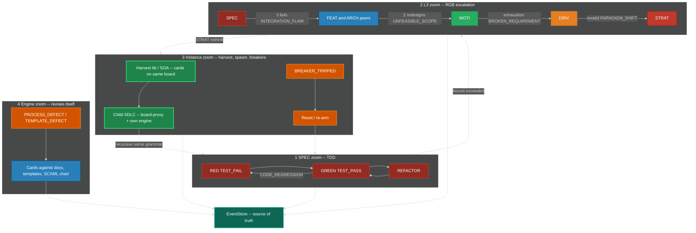

1. **SPEC zoom:** TDD on SPEC (RED-GREEN-REFACTOR). TestRunner never claims GREEN without recorded RED.
2. **L3 zoom:** RGB ladder with bounds in §2.2.
3. **Instance zoom:** harvest lib → SOA → spawn child SDLC; plus death-spiral breakers and reset (§5). Same loop.
4. **Engine zoom:** `PROCESS_DEFECT` / `TEMPLATE_DEFECT` revise the engine itself as cards on the same kanban.
5. **EventStore** is source of truth; all zooms emit events.

Child SDLC recursion: the child's SPEC zoom is TDD; its L3 zoom is RGB; its instance zoom may spawn a grandchild. Cascades use egress-as-ingress (`LEARNING`, `PROBLEM_SIGNAL`, mesh contracts).

---

## 13. Protection Summary

| Tier | Type | When | Construct | Scope |
|---|---|---|---|---|
| 0 | TDD gate | Every TDD transition | SCXML missing edge + TddGate; `first-failure` required for GREEN | Per SPEC |
| 1 | Inline Guards | Every state entry | `IGuard.predicate()` | Per-node |
| 2 | RGB bounds | 3 SPEC fails / 2 redesigns / MOTI exhaustion / DRIV invalid | Mid-zoom escalation | Ladder |
| 3 | Emergency Breakers | Threshold exceeded | `IBreaker.trip()` | Per-metric |
| 4 | System Reset | Breaker trips | `RESET_*` + re-arm | Instance-wide |
| 5 | WIP Limits | Always | `IKanban.wip_limits` | Per column / agent |
| 6 | Exclusive lease | While `in-progress` | ILease TTL | Per card + subtree |
| 7 | Merge-point barrier | Fan-in of N cards | `IMergePoint` + `MERGE_*` | Per parent FEAT/ARCH |
| 8 | Sync invariant | Before `MERGE_ACCEPTED` | `SPEC == test == impl == process/template` | Per merge point |
| 9 | Harvest Rules | Pattern detected live | `IHarvestRule.predicate()` | Cross-cutting |
| 10 | Fixation Ceiling | Passes exceeded | Force-fire guard | Per-guard |
| 11 | Spawn budget | Agent spawn | `floor(8 / 2^depth)` | Per agent tree |
| 12 | SchemaRegistry | Every dispatch | Unknown kind → `UNHANDLED_EVENT` + DLQ | Instance |
| 13 | Watchdog | Heartbeat, path, storm, hang, oscillation | SIGKILL + card return | Per process / sidecar |
| 14 | Sidecar boundary | Always | No LLM in core; P2 allow-list; tests pass with inference down | Instance |

---

# PART B — Interface Contracts

*ALL interfaces. Zero implementation. Every trait here carries trace context and auth token as concepts — the specific type depends on the implementation language.*

---

## 14. Interface Contracts

Every engine component implements the contract for its role. Registries are dynamic.

### 14.1 INode — SDLC Artifact Node

| Field | Type | Description |
|---|---|---|
| `id` | `string` | Unique node identifier (`filename-id`) |
| `type` | `enum` | `STRAT`, `DRIV`, `MOTI`, `FEAT`, `ARCH`, `SPEC` |
| `parent` | `string?` | Containment. Null only for STRAT. |
| `status` | `enum` | For MOTI: `Active`, `Rejected`, `Exhausted`. Others MAY use generic status. |
| `state` | `enum` | `IDLE`, `ACTIVE`, `BLOCKED`, `DEGRADED`, `RESET`, `DONE` |
| `tdd` | `object` | `{state, test-file, first-failure, iterations}` — required on every INode |
| `enter()` | `fn(state, event) → side_effects` | Deterministic action on state entry (guards fire here) |
| `exit()` | `fn(state, event) → side_effects` | Deterministic action on state exit |
| `valid_transitions` | `list[ITransition]` | From ResolvedChart, not a compiled list |
| `guards` | `list[IGuard]` | Registered inline guards |
| `metrics` | `dict[string, numeric]` | Observable measurements for breakers |
| `work_items` | `list[IWorkItem]` | Associated cards |

`type` does not include `TEST`. L5 is `tdd.test-file`.

### 14.2 IGuard — Anti-Fixation Guard

| Field | Type | Description |
|---|---|---|
| `id` | `string` | Guard identifier |
| `node_id` | `string` | Which node this guards |
| `predicate()` | `fn(state, event) → bool` | Pure function: should this guard fire? |
| `action` | `enum` | `PASS`, `BLOCK`, `REDIRECT`, `ESCALATE` |
| `redirect_to` | `string?` | Target node if REDIRECT |
| `cooldown` | `duration` | Minimum time between firings |
| `consecutive_passes` | `int` | Resets on fire, increments on pass |
| `fixation_threshold` | `int` | Hard ceiling: force fire when exceeded |

### 14.3 IBreaker — Emergency Circuit Breaker

| Field | Type | Description |
|---|---|---|
| `id` | `string` | Breaker identifier |
| `monitors` | `list[metric_id]` | Metrics to watch |
| `threshold` | `numeric` | Trip point |
| `window` | `duration` | Evaluation window |
| `trip()` | `fn(state) → RESET_event` | Force transition to RESET |
| `rearm()` | `fn(lessons_learned) → guard_updates` | Restore guards with fixes |
| `tripped` | `bool` | Current breaker state |

### 14.4 ITransition — State Transition

| Field | Type | Description |
|---|---|---|
| `from_state` | `(node_id, state)` | Source node + state |
| `to_state` | `(node_id, state)` | Target node + state |
| `event` | `string` | Triggering event kind (canonical) |
| `predicate()` | `fn(state, event) → bool` | Must return true to fire |
| `action()` | `fn(state, event) → state_prime` | Pure function: compute next state |
| `guards` | `list[IGuard]` | All must PASS before commit |

Loaded from SCXML ResolvedChart. Not a compiled match table in engine source.

### 14.5 IWorkItem — Unit of Parallel Work (a card)

| Field | Type | Description |
|---|---|---|
| `id` | `string` | Unique work item ID |
| `node_ref` | `string` | Bound INode |
| `state` | `enum` | `BACKLOG`, `READY`, `IN_PROGRESS`, `REVIEW`, `DONE`, `BLOCKED` |
| `column` | `enum` | `backlog`, `ready`, `in-progress`, `blocked`, `review`, `done`, plus merge-point `queue`, `active-merge`, `verification`, `integrated` |
| `assigned_to` | `string?` | Agent ID or null (`backlog`/`ready` only) |
| `owned_subtree` | `string?` | Partition key and exclusive subtree root |
| `lease` | `ILease?` | TTL lease, not a forever lock |
| `dependencies` | `list[work_item_id]` | Must be DONE before READY |
| `priority_score` | `f64` | Live. Recomputed on every affecting event. Higher wins. |
| `merge_point` | `string?` | `IMergePoint.id` if fan-in child or parent |
| `created_by` | `event_id` | Traceable to originating event |
| `artifacts` | `list[artifact_ref]` | Output artifacts produced |

There is no `CONFLICT` state. There is no `kanban_board` id selecting among multiple boards.

### 14.6 IAgent — Autonomous Worker

| Field | Type | Description |
|---|---|---|
| `id` | `string` | Agent identifier |
| `type` | `enum` | `HUMAN`, `AI_SIDECAR`, `SCANNER`, `AUTOMATED` |
| `a2a_card_url` | `string?` | Agent-card URL. Required for `AI_SIDECAR`. |
| `capabilities` | `list[node_type]` | What node types this agent can work. Grown by discovery, not a freeze. |
| `current_work` | `list[work_item_id]` | Active items |
| `wip_limit` | `int` | Max concurrent items |
| `depth` | `int` | Nesting depth for `spawn_budget` |
| `claim(item)` | `fn → bool` | Take TTL exclusive lease. False if owned or not `ready`. |
| `release(item)` | `fn` | Release lease; card to `ready` or `blocked` |
| `complete(item, artifacts)` | `fn` | Emit `WORK_COMPLETED` |

### 14.7 IKanban — The Single Board

| Field | Type | Description |
|---|---|---|
| `id` | `string` | Board identifier (one per engine instance) |
| `columns` | `ordered list` | `backlog`, `ready`, `in-progress`, `blocked`, `review`, `done` |
| `merge_columns` | `ordered list` | `queue`, `active-merge`, `verification`, `integrated` |
| `wip_limits` | `dict[column, int]` | Per-column WIP limits |
| `partitions` | `dict[owned_subtree, items]` | Same columns, keyed by subtree |
| `pull(agent)` | `fn → IWorkItem?` | Highest `priority_score` `ready` with no owner matching capabilities |

### 14.8 IMergePoint — Fan-In Barrier

| Field | Type | Description |
|---|---|---|
| `id` | `string` | Merge-point identifier |
| `parent_card` | `filename-id` | Parent FEAT or ARCH card |
| `child_cards` | `list[filename-id]` | Workstream cards that must arrive |
| `required_state` | `predicate` | Example: all child SPECs RED; or all GREEN plus sync invariant |
| `sync_invariant` | `fn → bool` | `SPEC == test == impl == process/template` |
| `state` | `enum` | `OPEN`, `ARMED`, `READY`, `BLOCKED`, `ACCEPTED`, `REJECTED` |
| `ownership_boundary` | `bool` | If true, child `parent:` MAY be `TBD-RECONCILE` until `RECONCILE_PARENT` |

### 14.9 IMesh — Named IPC

There is no generic event bus and no god broker process that owns topology.

| Field | Type | Description |
|---|---|---|
| `publish_local(event)` | `fn` | Append already in EventStore; notify subscribers on this host |
| `publish_egress(event)` | `fn` | Put for egress-class kinds to parent/siblings |
| `subscribe_local(service, handler)` | `fn` | Subscriber on a **service name** |
| `subscribe_egress(keyexpr, handler)` | `fn` | Subscriber for cross-instance |
| `partitioned_by` | `field` | `work_item_id` and, for merge, `parent_id` |
| `delivery` | `enum` | `AT_LEAST_ONCE` (EventStore seq is the cursor) |
| `dead_letter_queue` | `list[event]` | Undeliverable, timed-out, or poison events |
| `replay(from_seq)` | `fn → event_stream` | Replay from EventStore, not from the mesh |

### 14.10 IDiscovery — Initial Locator Only

| Field | Type | Description |
|---|---|---|
| `initial_locator` | `string` | The only bootstrap. Format in PART C. |
| `scout()` | `fn` | Protocol-specific scout/gossip. Not a registry RPC. |
| `on_join(entity)` | `fn` | Emits `MESH_JOIN` / `AGENT_CARD_PUBLISHED` / `INFERENCE_DISCOVERED` |
| `on_leave(entity)` | `fn` | Liveliness drop. Emits `MESH_LEAVE` / `AGENT_CARD_REVOKED` / `INFERENCE_LOST` |

Forbidden: consul, etcd, eureka, a compiled peer list, a company MQTT broker as the discovery plane.

### 14.11 IA2ASidecar — Generic AI Agent Runtime

| Field | Type | Description |
|---|---|---|
| `agent_card` | `AgentCard` | Official card (skills, URL, auth). Published on join. |
| `send_task(card, message)` | `fn` | JSON-RPC/REST. Orchestrator is the client. |
| `stream_events()` | `fn` | Task events become engine events. |
| `inference` | `IInference?` | Discovered inference URL. Bound at join, rebound on `INFERENCE_DISCOVERED`. |

MCP is **FORBIDDEN**. The wire to the engine is the sidecar protocol on designated ports only.

### 14.12 IInference — Sidecar-Only Inference

Implemented **only in the sidecar**. Core daemons MUST NOT depend on this trait.

| Field | Type | Description |
|---|---|---|
| `locator` | `string` | Sidecar-local discovery, not compiled-in |
| `kind` | `enum` | Provider kind (sidecar-specific) |
| `complete(req)` | `fn` | Completion call using locator |
| `list_models()` | `fn` | Sidecar skills only; does not recompute engine `priority_score` |

### 14.13 ILearningProjection — Engine-Side LEARNING Table (not a model)

| Field | Type | Description |
|---|---|---|
| `apply(LEARNING)` | `fn` | Validate schema; upsert row. No embed, no extract |
| `get(event_id)` | `fn` | Read projection. Rebuildable from EventStore |

### 14.14 IComponentRegistry — Shared Component Tracking

| Field | Type | Description |
|---|---|---|
| `components` | `dict[id, IComponent]` | All registered shared components |
| `register(component)` | `fn` | Add or update component |
| `dependents(id)` | `fn → list[node_id]` | Who depends on this component |
| `usage_count(id)` | `fn → int` | How many nodes reference this |
| `lease_matrix` | `dict[path, lease]` | Who holds write lease on which path |
| `lock(id, agent)` | `fn → bool` | **TTL exclusive lease**, not optimistic content lock |

### 14.15 IHarvestRule — Extraction Trigger

| Field | Type | Description |
|---|---|---|
| `id` | `string` | Rule identifier |
| `predicate()` | `fn(registry_state) → bool` | When to trigger (evaluated on each `TRANSITION_COMMITTED`) |
| `action` | `enum` | `EXTRACT_LIB`, `EXTRACT_SERVICE`, `REFACTOR_IN_PLACE` |
| `maturity_gate` | `dict` | Conditions for promotion |
| `spawn_sdlc` | `bool` | If true, component gets own engine instance |

### 14.16 ILease — TTL Exclusive Lease

| Field | Type | Description |
|---|---|---|
| `id` | `string` | Lease identifier |
| `holder` | `agent_id` | Exclusive holder |
| `resource` | `card_id` and/or `owned_subtree` and/or file path | What is leased |
| `ttl` | `duration` | Expiry. Never forever. |
| `expires_at` | `timestamp` | Absolute expiry |
| `renew(holder)` | `fn → bool` | Holder heartbeat |
| `expire()` | `fn` | Card to `ready` or `blocked`; emit `WORK_RELEASED` or `WORK_BLOCKED` |

### 14.17 ISchemaRegistry — Dynamic Kinds + SCXML

| Field | Type | Description |
|---|---|---|
| `kinds` | `dict[kind, schema]` | Event kind → payload schema + version |
| `aliases` | `dict[alias, kind]` | Seed includes `WORK_MERGED` → `MERGE_ACCEPTED`; `CORP-STRAT` → `STRAT` |
| `chart` | `Statechart` | The one machine document |
| `resolved` | `ResolvedChart` | Effective transitions |
| `canonicalize(kind)` | `fn → kind` | Alias fold |
| `register(kind, schema)` | `fn` | Dynamic add. Not a compiled-in list. |
| `evolve(kind, new_schema)` | `fn` | Versioned evolution; old events remain readable |
| `reload_chart(scxml)` | `fn` | Hot-load a new chart; validate; resolve; no binary change |

---

# PART C — Implementation Architecture

*Rust 2024, named mesh, daemon inventory, crate inventory, locator discovery, RDBMS schemas, sequence diagrams, scheduling, watchdogs, errant forks. This part names specific crates and libraries. PART A and B are implementable without reading PART C.*

---

## 15. Implementation Design — Rust Daemons, Named Mesh, Locator Discovery

This section is the software-engineer contract. Subsystems are **daemons**: dynamic, asynchronous, partitioned, fault-tolerant. The engine is **always live**. There is no batch window, no nightly reconcile, no "run the orchestrator later," no "run the suite later."

Language: **Rust 2024** for every daemon. Bash is glue (units, hooks), not applications. No Python apps. No Go or Zig binary is required.

### 15.1 Named IPC Choice (binding)

A "generic event bus" is wrong. The mesh has two planes plus an optional local bridge.

**Same-host daemon plane — iceoryx2.** Eclipse iceoryx2 is decentralized zero-copy shared-memory pub-sub. It exists specifically to **remove the central daemon** of iceoryx classic. Daemons open services by name (`sdlc.{instance}.{daemon}.{kind}`). Discovery is the iceoryx2 service tracker, not a cluster registry. EventStore remains source of truth: iceoryx2 carries **notifications** (seq, partition, kind). Payloads larger than a notify MAY be zero-copy samples or a seq the subscriber reads from SQLite.

**Nested-engine plane — zenoh.** Each engine instance is a zenoh **peer**. Bootstrap is **one initial locator**. Gossip scout finds the rest. Liveliness tokens are join/leave. Parent does not own child topology. Child publishes egress on key expressions; parent subscribes. This is the board-of-boards routing plane.

**MQTT is not the mesh.** A broker **is** a registry. `rumqttc` MAY talk to a **local Mosquitto (or equivalent) per engine instance** as an IngressGateway adapter for external IoT. That broker MUST bind localhost (or the instance netns) and MUST NOT be the discovery plane or the daemon bus.

**Optional, not topology:** `iceoryx2-integrations-zenoh-tunnel-backend` MAY tunnel a local service off-host. It MUST NOT become a god router that owns all topics.

```
publish(event):
    eventstore.append_fsync(event)              # SoT
    iceoryx2.publish(service_for(event.kind), seq)
    if event.kind in EGRESS_SET and parent_locator is set:
        zenoh.put("sdlc/{parent}/egress/{child}/{kind}", {event_id, seq})
```

`EGRESS_SET` = `MERGE_ACCEPTED`, `LEARNING`, `SDLC_SPAWNED`, `PROBLEM_SIGNAL`, `BREAKER_TRIPPED`, `MEMORY_CONTRADICTION`, `MESH_LEAVE`.

### 15.2 Dynamic Discovery from One Initial Locator

No consul. No etcd. No eureka. No compiled mesh map.

A node starts with **exactly one** `INITIAL_LOCATOR` (env or Config). It discovers the rest.

#### Locator String Format (ASCII, binding)

```
<scheme>:<rest>

schemes:
  zenoh:<protocol>/<addr>[:<port>]
      example: zenoh:tcp/192.168.1.10:7447
      example: zenoh:udp/224.0.0.224:7446          # multicast scout
      example: zenoh:unix:/tmp/sdlc-{instance}.zenoh

  iceoryx2:service/<ServiceName>
      example: iceoryx2:service/sdlc.instA.eventstore.notify
      (same-host only; ServiceName is the iceoryx2 name)

  a2a:<url>
      example: a2a:http://127.0.0.1:8088/.well-known/agent-card.json

  openai-compat:<url>
      example: openai-compat:http://127.0.0.1:11434/v1     # Ollama primary
      example: openai-compat:http://127.0.0.1:8080/v1      # LocalAI / vLLM / Xinference

  mqtt:tcp://127.0.0.1:<port>     # OPTIONAL local ingress bridge ONLY
```

Root engine: `INITIAL_LOCATOR` MAY be `zenoh:udp/224.0.0.224:7446` (scout only) or `zenoh:tcp/127.0.0.1:7447` if this instance also listens. Child engine: `INITIAL_LOCATOR` MUST be the parent's zenoh listen locator handed in `SDLC_SPAWNED`.

#### Join / Leave (live)

| Entity | Join | Leave |
|---|---|---|
| Daemon (same host) | Create iceoryx2 service `sdlc.{instance}.{daemon}.*`; tracker emits appear; `MESH_JOIN` | Process exit drops service; tracker emits disappear; `MESH_LEAVE`; leases expire |
| Engine instance | zenoh peer `connect` to `INITIAL_LOCATOR`; gossip; declare liveliness token `sdlc/{instance}/alive/engine/{id}` | Token drop; subscribers get delete; parent board-proxy `blocked`; `MESH_LEAVE` |
| A2A sidecar | Serve agent card; put card URL on zenoh `sdlc/{instance}/a2a/cards/{id}`; declare liveliness `.../alive/sidecar/{id}`; `AGENT_CARD_PUBLISHED` | Token drop; `AGENT_CARD_REVOKED`; AgentPool forgets; leased cards → `ready`/`blocked` |
| Inference (sidecar-local only) | Sidecar scouts its own `openai-compat:` locator | Sidecar-internal. Engine DiscoveryDaemon MUST NOT probe models |

Zenoh config seed (peer + gossip from one connect endpoint):

```json
{
  "mode": "peer",
  "connect": { "endpoints": ["<from INITIAL_LOCATOR rest>"] },
  "listen":  { "endpoints": ["tcp/0.0.0.0:0"] },
  "scouting": {
    "multicast": { "enabled": true },
    "gossip": { "enabled": true, "autoconnect": { "peer": ["router", "peer"] } }
  }
}
```

If multicast is unavailable, gossip from the single connect endpoint is sufficient. That is the native zenoh model.

### 15.3 Two-Box Topology (engine | sidecar) — Ports Only

The numbered-port diagram is binding. Same-host daemons still use iceoryx2 among **core** processes. zenoh is P5 (child engines), not an LLM pipe.

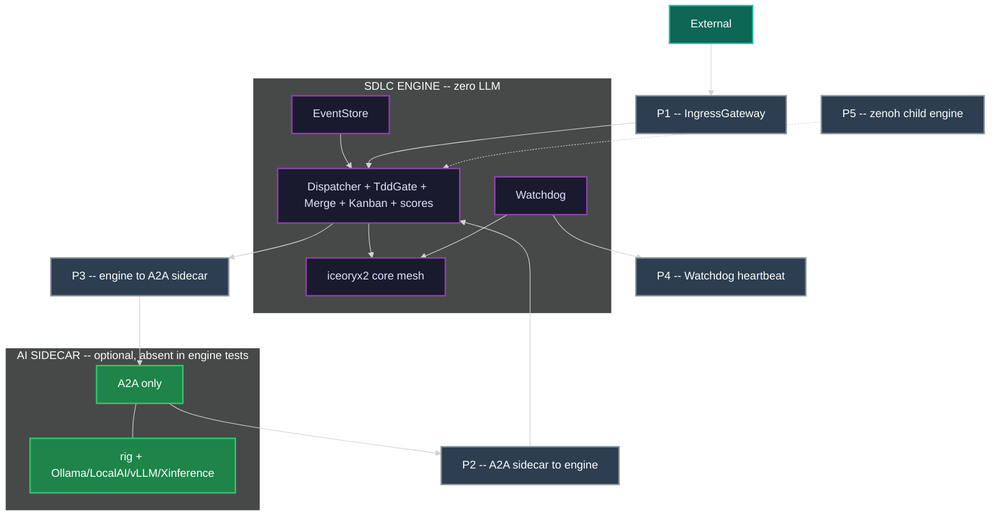

---

## 16. Subsystems / Daemons

Core daemons below MUST compile and run with no `rig`, no inference client, and no memory-engine crate. A2AGateway is a **port**: it translates A2A messages into Dispatcher-bound events. It does not call a model.

### 16.1 Core — Zero LLM

| Daemon | Responsibility | Consumes | Produces | Failure mode | Scaling unit |
|---|---|---|---|---|---|
| **EventStore** | SQLite WAL append-only log; partitioned replay; snapshots | appends from Dispatcher only | ordered streams + iceoryx2 notify | Refuse ack if fsync fails | Partition = `tenant_id` + `work_item_id` |
| **Dispatcher / Orchestrator** | `statig` + ResolvedChart evaluator. Stateless vs store | all catalog kinds | `TRANSITION_COMMITTED`, `TRANSITION_REJECTED`, `UNHANDLED_EVENT` | Replay from last committed seq. Merge eval CAS | Per partition |
| **DiscoveryDaemon** | Scout from `INITIAL_LOCATOR`; iceoryx2 tracker; zenoh liveliness of **engine** peers | liveliness, service appear/disappear | `MESH_JOIN`, `MESH_LEAVE` | Fail-open to last-known live set; no registry; no `/v1/models` probe | Per instance |
| **A2AGateway** | Port P2/P3. Map allowed A2A payloads to events; send tasks after lease | A2A on allow-list | events via Dispatcher only | Unauthenticated drop. MCP endpoints MUST NOT exist. No completion HTTP | Per instance |
| **GuardDaemon** | Evaluate IGuard on state entry | `TRANSITION_COMMITTED` | `GUARD_*`, `FIXATION_DETECTED` | Fail-closed: `GUARD_BLOCKED` + DLQ | Per node type / shard |
| **BreakerDaemon** | Death-spiral detection | metrics, `TIMER_TICK` | `BREAKER_TRIPPED`, `RESET_STARTED` | Fail-open for eval errors logged; fail-closed once tripped | Per instance |
| **KanbanProjector** | Event → filesystem column `mv`. One board. `notify` watches drift | `TRANSITION_COMMITTED` | (projection; lag metrics) | Idempotent on commit id | Per partition |
| **AgentPool / WorkerManager** | Spawn/retire; exclusive lease; steal from `ready`; `spawn_budget` | `WORK_CREATED` (ready), `AGENT_CARD_*`, lease expiry | `WORK_CLAIMED`, spawn/retire audit | If no sidecar: humans/scanners still pull. Circuit-break on budget=0 | Worker processes |
| **MergeCoordinator** | Fan-in barrier; sync invariant. No model | child `WORK_COMPLETED`, `TEST_PASS`, `SYNC_VIOLATION` | `MERGE_*` | CAS on merge-point `state` | Parent partition |
| **ParentReconciler** | `TBD-RECONCILE` → real `filename-id` | `MERGE_READY` | `RECONCILE_PARENT` | Retry with backoff; do not rewrite SPEC bodies | Parent partition |
| **TestRunner** | Execute tests; never claims GREEN without recorded RED | `WORK_STARTED`, `TIMER_TICK` | `TEST_PASS`, `TEST_FAIL`, `CODE_REGRESSION` | Infra fail: `WORK_BLOCKED`, not fake GREEN | Per card / test shard |
| **TddGate** | Reject `NOT_STARTED → GREEN` | attempted TDD transitions | `TRANSITION_REJECTED` (or allow) | Fail-closed | Inline in Dispatcher |
| **IngressGateway** | Port P1. External HTTP/git/webhook/syslog; optional local MQTT | adapters | `STRATEGIC_PIVOT`, `PROBLEM_SIGNAL`, `USER_REPORT`, `ATTACKER_SIGNAL`, `SECURITY_DISCLOSURE`, `TIMER_TICK` | Unauthenticated drop. Rate-limit | Horizontally scalable |
| **LearningIngest** | Schema-validate `LEARNING`; SQLite projection. **No extract, no embed** | `LEARNING`, `MEMORY_CONTRADICTION` | projection rows; MAY `PROCESS_DEFECT` / `HARVEST_DETECTED` from **event fields**, not from an LLM | Drop invalid schema with metric | Per tenant |
| **HarvestDaemon** | Lib extract / SOA / child spawn — same loop, live | `TRANSITION_COMMITTED` | `HARVEST_DETECTED`, `LIB_EXTRACTED`, `SERVICE_PROMOTED`, `SDLC_SPAWNED` | Candidates only | Per instance |
| **Watchdog** | Port P4. Process liveness; SIGKILL; path notify | heartbeats, `notify` paths, `procfs` | `WATCHDOG_*`, `FORK_ORPHAN`, `WORK_BLOCKED` | OS probes only. No LLM. No completion | Per process |
| **Lease / Lock** | TTL leases | claim/renew/expire | `WORK_RELEASED` / `WORK_BLOCKED` on expiry | Store monotonic seq + expiry, not local clock alone | Per resource |
| **DeadLetter** | Poison messages | `UNHANDLED_EVENT`, handler exceptions | (held); alert | Bounded queue | Per partition |
| **Retry / Backoff** | At-least-once retries | failed handler | republish same event id | Give up → DLQ | Per subscription |
| **Snapshot / Checkpoint** | Compact state for replay | EventStore seq | snapshot blob + seq | Corrupt snapshot: ignore and replay earlier | Per partition |
| **Metrics / Tracing** | RED/USE, traces, logs | all daemons | (telemetry) | Telemetry loss MUST NOT block dispatch | Collector |
| **SchemaRegistry** | Event kinds + SCXML chart | register/evolve/reload_chart | used by Dispatcher | Unknown kind → `UNHANDLED_EVENT` | Instance |
| **Config** | Thresholds, WIP, spawn_budget, `INITIAL_LOCATOR` | watch | (config updates as events if desired) | Bad config: keep last-good | Instance |
| **TimerDaemon** | Clock as events | OS timer | `TIMER_TICK` | Never mutates cards itself | Per instance |

### 16.2 Sidecar Process (optional — not an engine daemon)

| Process | Responsibility | Talks to engine via | MUST NOT |
|---|---|---|---|
| **AI sidecar** | `rig-core` + discovered Ollama/LocalAI/Xinference/vLLM; optional sidecar memory | P2 proposals, P3 tasks, P4 heartbeats | Append EventStore; `mv` cards; call Dispatcher internals; MCP |
| **Inference** | Lives only inside the sidecar | sidecar-local OpenAI-compat HTTP | Be a core crate or a Dispatcher client |

---

## 17. Full Crate Inventory (daemon | language | crates | why)

Shared workspace crates used by **every** Rust daemon: `tokio` (async runtime), `tracing` + `tracing-subscriber` (logs), `serde` + `serde_json` (payloads), `thiserror` + `anyhow` (errors), `bytes`, `parking_lot`, `uuid`.

### 17.1 Observability Fabric Crates

| Crate | Role | Layer |
|---|---|---|
| `tracing` | Structured span/event emission | Every daemon |
| `tracing-subscriber` | Local log formatting and filtering | Every daemon |
| `tracing-opentelemetry` | Bridge tracing spans to OTel SDK | Every daemon (optional) |
| `opentelemetry` | OTel SDK core | Collector adapter |
| `opentelemetry-otlp` | OTLP exporter (gRPC/HTTP) | Collector adapter |
| `metrics` | Metrics API (counters, gauges, histograms) | Every daemon |
| `metrics-exporter-prometheus` | Prometheus scrape endpoint | Collector adapter |

Telemetry loss MUST NOT block dispatch. If the OTel collector is down, daemons continue. The tracing layer is always active for local log output.

### 17.2 Security Fabric Crates

| Crate | Role | Layer |
|---|---|---|
| `rustls` | TLS for mesh wire, IngressGateway, A2AGateway | Boundary daemons |
| `secrecy` | `SecretString` / `SecretVec` — zeroizes on drop | Any daemon handling auth |
| `jsonwebtoken` | JWT validation for A2AGateway, IngressGateway | Port P1, P2 |
| `argon2` (or `scrypt`) | Password hashing if local auth is needed | Config/bootstrap |

Secrets in event payloads are **vault references**, not raw values. `secrecy` enforces this in Rust types.

### 17.3 Per-Daemon Crate Table

| Daemon | Language | Crates | Why |
|---|---|---|---|
| EventStore | Rust | `rusqlite` (bundled), `tokio` (spawn_blocking or `tokio-rusqlite-new`), `iceoryx2` | WAL SoT; notify seq on iceoryx2; no sqlx-over-network required |
| Dispatcher / Orchestrator | Rust | `statig`, `scxml`, `iceoryx2`, `zenoh` | Hierarchical SM; chart from schema; local+egress publish |
| DiscoveryDaemon | Rust | `zenoh` (scout, liveliness), `iceoryx2` (service tracker) | Locator-only engine join/leave. No `/v1/models`. |
| A2AGateway | Rust | `a2a`, `a2a-client`, `a2a-server` (a2aproject/a2a-rs), `axum`, `tokio`, `rustls`, `jsonwebtoken` | Ports P2/P3. Official A2A 1.0. **No MCP / `rmcp`. No `rig`.** |
| GuardDaemon | Rust | `statig` (guard hooks), `iceoryx2`, `rusqlite` | Local consecutive_passes table |
| BreakerDaemon | Rust | `iceoryx2`, `rusqlite` | Metrics windows |
| KanbanProjector | Rust | `notify` (fs watch), `rusqlite`, `iceoryx2` | `mv` projection; detect drift vs EventStore |
| AgentPool / WorkerManager | Rust | `nix` (`kill`, `waitpid`, `eventfd`), `a2a-client`, `iceoryx2` | Spawn/reap/SIGKILL; A2A claim |
| MergeCoordinator | Rust | `rusqlite`, `iceoryx2` | CAS arrival counts |
| ParentReconciler | Rust | `rusqlite` | Link repair only |
| TestRunner | Rust | `tokio::process`, `iceoryx2` | Real test processes, not keyword scans |
| TddGate | Rust | `scxml` (named guard), inline | Fail-closed GREEN |
| IngressGateway | Rust | `axum`, `reqwest`, optional `rumqttc`, `rustls`, `jsonwebtoken` | HTTP/git/webhook; MQTT local-only |
| LearningIngest | Rust | `rusqlite`, `iceoryx2` | Project `LEARNING` rows. No embed |
| HarvestDaemon | Rust | `iceoryx2`, `rusqlite` | Live thresholds |
| Watchdog | Rust | `nix`, `notify`, `procfs`, `iceoryx2`, `tokio` | Heartbeat fd, CPU/time, unexpected paths, SIGKILL. No LLM |
| AI sidecar (optional) | Rust | `rig-core`, `a2a-server`, optional memory, `reqwest` | Completions and sidecar memory. Never a core daemon crate |
| Lease / Lock | Rust | `rusqlite`, `iceoryx2` | TTL in store |
| DeadLetter / Retry | Rust | `rusqlite`, `iceoryx2` | Bounded poison |
| Snapshot | Rust | `rusqlite` | Checkpoint blobs |
| SchemaRegistry | Rust | `scxml`, `serde`, `rusqlite` | Chart + kinds |
| Config | Rust | `serde`, `notify` (watch file), `figment` or `config` | `INITIAL_LOCATOR`, weights |
| TimerDaemon | Rust | `tokio::time`, `iceoryx2` | `TIMER_TICK` only |

**Not used as apps:** Python, Go, Zig. **Not used as agent protocol:** MCP, `rmcp`. **Not used as discovery:** consul, etcd, eureka. **Not used as daemon bus:** MQTT, NATS, Kafka. **Not used in core daemons:** `rig-core`, any OpenAI-compat client.

### 17.4 Async Patterns (binding)

| Utility / Library | Primary Optimization Method | Best Target Use-Case |
|---|---|---|
| `async-trait` | Procedural macro code re-writing | Defining object-oriented ports and adapters in decoupled design models |
| `futures-util` | Practical method combinators (`.boxed()`) | Quick chaining, filtering, and pushing inline futures into vector collections |
| `pin-project` | Safe compiler field projections | Writing custom state machines or low-level async structural wrappers |
| `tower` | Middleware/decorator composition | **Gateways only** (IngressGateway, A2AGateway). Not for internal daemon-to-daemon. |

`tower` is reserved for HTTP-facing gateways. Internal daemon communication uses iceoryx2 (zero-copy shared memory, not middleware chains).

---

## 18. Localized ER / RDBMS Schemas (SQLite per daemon)

The filesystem kanban remains the **workflow projection**. Each daemon has its **own** SQLite file for queries it cannot do with `ls`/`mv` alone. Stores are **per subsystem**, not one god database. EventStore is source of truth; local tables are rebuildable from replay.

Paths: `var/engine/{instance_id}/eventstore.sqlite` and `var/engine/{instance_id}/{daemon}.sqlite`.

SQLite PRAGMA conventions:

```sql
PRAGMA journal_mode = WAL;
PRAGMA synchronous = NORMAL;    -- fsync on checkpoint, not every commit
PRAGMA foreign_keys = ON;
PRAGMA busy_timeout = 5000;
```

### 18.1 EventStore (instance-local)

```sql
CREATE TABLE event (
  tenant_id   TEXT NOT NULL,
  seq         INTEGER NOT NULL,
  partition_key TEXT NOT NULL,
  event_id    TEXT PRIMARY KEY,
  kind        TEXT NOT NULL,
  schema_ver  INTEGER NOT NULL DEFAULT 1,
  idempotency_key TEXT UNIQUE,
  work_item_id TEXT,
  parent_id   TEXT,
  actor_id    TEXT,
  trace_id    TEXT,
  span_id     TEXT,
  payload_ref TEXT,
  ts_store    TEXT NOT NULL DEFAULT (strftime('%Y-%m-%dT%H:%M:%fZ','now'))
);

CREATE TABLE snapshot (
  tenant_id     TEXT NOT NULL,
  partition_key TEXT NOT NULL,
  seq           INTEGER NOT NULL,
  blob_ref      TEXT NOT NULL,
  PRIMARY KEY (tenant_id, partition_key, seq)
);
```

### 18.2 Dispatcher / Transition

```sql
CREATE TABLE node (
  filename_id   TEXT PRIMARY KEY,
  type          TEXT NOT NULL CHECK(type IN ('STRAT','DRIV','MOTI','FEAT','ARCH','SPEC')),
  parent        TEXT,
  state         TEXT NOT NULL DEFAULT 'IDLE',
  tdd_state     TEXT NOT NULL DEFAULT 'NOT_STARTED',
  first_failure TEXT,
  iterations    INTEGER NOT NULL DEFAULT 0
);

CREATE TABLE chart_hash (
  sha256     TEXT PRIMARY KEY,
  loaded_seq INTEGER NOT NULL
);

CREATE TABLE committed (
  event_id   TEXT PRIMARY KEY,
  node_id    TEXT NOT NULL,
  from_state TEXT NOT NULL,
  to_state   TEXT NOT NULL
);
```

### 18.3 Kanban Projector

```sql
CREATE TABLE card (
  filename_id      TEXT PRIMARY KEY,
  column           TEXT NOT NULL,
  owned_subtree    TEXT,
  owner_agent      TEXT,
  parent_card      TEXT,
  priority_score   REAL NOT NULL DEFAULT 0.0,
  entered_column_ts TEXT NOT NULL DEFAULT (strftime('%Y-%m-%dT%H:%M:%fZ','now'))
);

CREATE TABLE column_def (
  name      TEXT PRIMARY KEY,
  wip_limit INTEGER NOT NULL
);

CREATE TABLE board_proxy (
  card_id            TEXT PRIMARY KEY,
  child_instance_id  TEXT NOT NULL,
  child_strat_id     TEXT NOT NULL,
  child_locator      TEXT NOT NULL
);
```

`mv` of the file and the `card.column` row MUST be the same apply of one `TRANSITION_COMMITTED`. If the FS `mv` succeeds and the row fails, replay repairs the row.

### 18.4 Lease / AgentPool / A2A

```sql
CREATE TABLE lease (
  resource_id   TEXT PRIMARY KEY,
  agent_id      TEXT NOT NULL,
  level         INTEGER NOT NULL DEFAULT 0,
  expires_seq   INTEGER NOT NULL,
  heartbeat_seq INTEGER NOT NULL
);

CREATE TABLE agent (
  agent_id       TEXT PRIMARY KEY,
  parent_agent   TEXT,
  nesting_level  INTEGER NOT NULL DEFAULT 0,
  status         TEXT NOT NULL DEFAULT 'IDLE',
  pid            INTEGER,
  spawn_ts       TEXT,
  a2a_card_url   TEXT,
  capabilities_json TEXT
);
```

### 18.5 MergeCoordinator

```sql
CREATE TABLE merge_point (
  parent_card    TEXT PRIMARY KEY,
  required_state TEXT NOT NULL,
  state          TEXT NOT NULL DEFAULT 'OPEN',
  n_expected     INTEGER NOT NULL,
  n_arrived      INTEGER NOT NULL DEFAULT 0
);

CREATE TABLE merge_child (
  parent_card      TEXT NOT NULL,
  child_card       TEXT PRIMARY KEY,
  arrived_event_id TEXT
);
```

### 18.6 Watchdog

```sql
CREATE TABLE heartbeat (
  agent_id      TEXT PRIMARY KEY,
  last_seq      INTEGER NOT NULL,
  last_event_id TEXT,
  last_fd_tick  INTEGER
);

CREATE TABLE stall (
  agent_id         TEXT PRIMARY KEY,
  stall_count      INTEGER NOT NULL DEFAULT 0,
  last_progress_seq INTEGER
);

CREATE TABLE write_set (
  event_id TEXT NOT NULL,
  path     TEXT NOT NULL
);

CREATE TABLE storm (
  agent_id     TEXT PRIMARY KEY,
  token_rate   REAL,
  loop_count   INTEGER,
  window_start TEXT
);
```

### 18.7 Discovery / Inference

```sql
CREATE TABLE locator_seen (
  locator          TEXT PRIMARY KEY,
  scheme           TEXT NOT NULL,
  first_seq        INTEGER NOT NULL,
  last_liveliness  TEXT
);

CREATE TABLE inference (
  locator     TEXT PRIMARY KEY,
  kind        TEXT NOT NULL,
  models_json TEXT,
  last_ok_seq INTEGER
);
```

### 18.8 Harvest / Learning / Ingress (local)

```sql
CREATE TABLE harvest_candidate (
  component_id TEXT PRIMARY KEY,
  metric       TEXT NOT NULL,
  value        REAL NOT NULL,
  last_event   TEXT NOT NULL
);

CREATE TABLE ingress_dedup (
  idempotency_key TEXT PRIMARY KEY,
  event_id        TEXT NOT NULL
);
```

Learning facts on the engine are EventStore events plus the LearningIngest projection. Sidecar memory files are not EventStore and are not required to run the engine.

### 18.9 ER Diagram (engine instance)

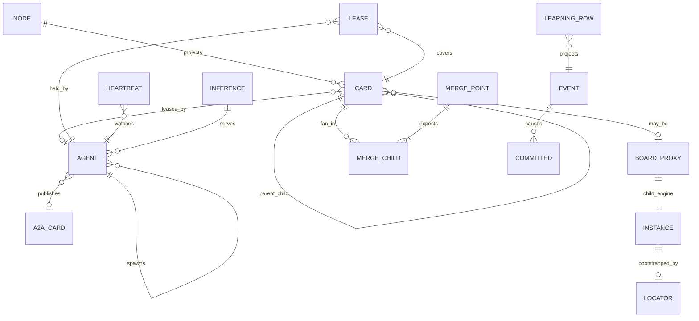

Cross-instance: parent `BOARD_PROXY.child_instance_id` plus `child_locator` are the only outbound keys. No join from parent Scheduler into child `CARD` rows.

---

## 19. Sequence — Attacker Disclosure to Merge Accepted

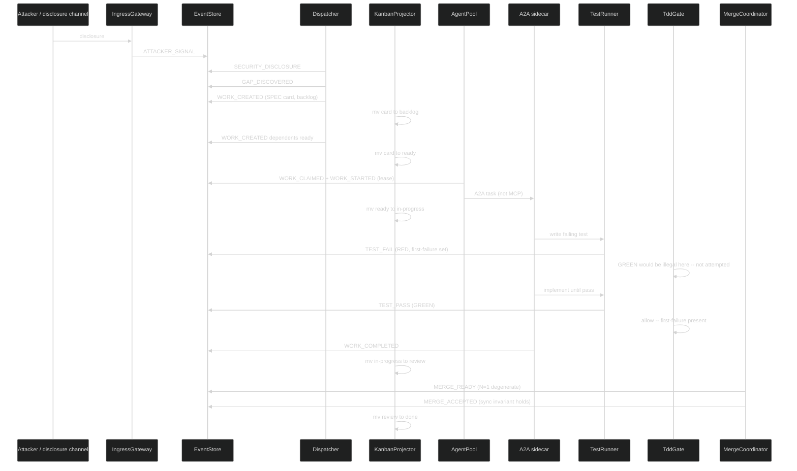

---

## 20. Dynamic Scheduling — Kanban and Kanban of Kanbans

The orchestrator does not use a hardcoded priority list. It **scores live** on every `TRANSITION_COMMITTED`, `WORK_UNBLOCKED`, `TIMER_TICK` (ageing only), `MESH_INGRESS`, and P1 ingress event. The score is a pure function of card/lease/DAG fields in Config. It MUST NOT call a model, read sidecar memory, or use `INFERENCE_*`.

### 20.1 Scoring Function

On each of those events, Scheduler (a Dispatcher policy module) recomputes `priority_score` for the **affected** set only: the event's card, dependents, same-merge siblings, and board-proxies whose child just egressed. Never a full-fleet batch sort.

```
priority_score(card) =
    w_p0    * is_P0
  + w_dep   * dependents_blocked_count
  + w_age   * age_in_ready_ms
  + w_merge * merge_point_waiting_on_this
  + w_risk  * security_or_breaker_flag
  + w_zoom  * (1 / (1 + nesting_level))
  - w_wip   * (column_wip / column_wip_limit)
  - w_lease * already_has_owner
```

Weights live in Config. Changing weights is a config event, not a deploy.

### 20.2 Pick / Schedule / Redetermine

```sql
SELECT filename_id FROM card
 WHERE column = 'ready'
   AND owner_agent IS NULL
   AND capabilities_match(agent)
   AND subtree_free(owned_subtree)
   AND wip_ok(agent, column)
 ORDER BY score DESC, entered_column_ts ASC
 LIMIT 1
```

**Pick:** AgentPool offers the highest-score `ready` card whose `owned_subtree` is free, whose deps are `done`, and whose agent type/capabilities match.

**Schedule:** claim = lease. WIP limits are hard: if column or agent WIP is full, next card stays `ready`. No overcommit. A2A `send_task` happens **after** the lease is in EventStore.

**Redetermine:** any new engine event can change scores. A `SECURITY_DISCLOSURE` can jump a card **without a batch reorder job** — the next claim sees the new score. Preemption: if a P0 security card is `ready` and an L0 agent holds only P3 work, Watchdog MAY request `WORK_RELEASED` on the P3 (cooperative) after `preempt_grace_ms`.

### 20.3 Board of Boards Scoring

A board-proxy card represents a child kanban. The parent's Scheduler scores the **proxy**, not every child card. The child's Scheduler scores the child's cards independently.

| Zoom | What is scored | Who scores |
|---|---|---|
| Child SPEC | child `ready` cards | child Dispatcher |
| Parent FEAT | parent cards + board-proxies | parent Dispatcher |
| Fleet | instance-level board-proxies only | parent of instances (if any) |

The parent MUST NOT query the child EventStore to pick a SPEC.

---

## 21. Watchdogs — Live Process and AI Detection

Watchdog is a daemon. It does not batch-scan logs. Detection is **in the running process**.

| Probe | Period / trigger | Crazy / dead if | Action (live) |
|---|---|---|---|
| Heartbeat fd | Config `heartbeat_ms` via iceoryx2 event or `eventfd` | No beat for `3 * heartbeat_ms` | `WATCHDOG_HANG`; expire lease; card → `ready` or `blocked` |
| Progress | `progress_idle_ms` | Lease held, no `TRANSITION_COMMITTED` from that agent | `WATCHDOG_STALL`; after 2, `WORK_BLOCKED`; do not auto-GREEN |
| Token / loop storm | sidecar stdout + A2A token counts | `token_rate > token_storm_tps` for `storm_window_ms`, or identical prompt loop `N` times | `WATCHDOG_AI_STORM`; SIGKILL; card stays RED or blocked |
| Output entropy | on each worker event | Repeat storm, or `TEST_PASS` with no first-failure | `WATCHDOG_THRASH` / `SPEC_WRONG`; kill; no auto-GREEN |
| File write set | `notify` on workspace | Create/write whose canonical path is not under `owned_subtree` | `WATCHDOG_PATH_VIOLATION` + `WORK_CONFLICTED`; SIGKILL; revoke lease |
| CPU / time budget | `procfs` + `TIMER_TICK` | `cpu_secs > budget` or wall `> time_budget` | `WATCHDOG_HANG` or storm; SIGKILL |
| Recursion | on spawn | `nesting_level` or `spawn_budget` exceeded | `TRANSITION_REJECTED`; no spawn |
| Oscillation | on RGB / merge | Same merge_point `MERGE_REJECTED` then ready then rejected `> oscillation_bound` | `WATCHDOG_OSCILLATION`; force RGB event if needed; kill |
| Memory contradiction | P2 event | Sidecar proposed contradiction | Card `blocked` or `PROCESS_DEFECT`. Watchdog does not interpret embeddings |
| Divergence | git/worktree if used | Branch exists with no live lease and no `MERGE_ACCEPTED` | `FORK_ORPHAN` |

Watchdog MUST be able to **SIGKILL** a worker it spawned (`nix::sys::signal::kill`, then `waitpid`). It MUST NOT write SPEC/test/impl bodies.

---

## 22. Errant Forks and Bad Work — Discovered Live

A **fork** here is a running agent, worktree, or card lineage that is not authorized by a live lease and a live parent.

| Kind | How discovered (live) | Event | Remedy |
|---|---|---|---|
| Orphan process | Watchdog heartbeat miss | `WATCHDOG_HANG` / `WORK_RELEASED` reason=dead | SIGKILL if pid still in AgentPool; card to `ready`/`blocked` |
| Orphan branch / worktree | write_set or git adapter event with no `lease` row | `FORK_ORPHAN` | Do not merge; card `blocked` |
| Bad fork (writes outside subtree) | `notify` vs `owned_subtree` | `WATCHDOG_PATH_VIOLATION` + `WORK_CONFLICTED` | SIGKILL; revoke lease |
| Thrash / reward-hack GREEN | TEST_PASS with null `first_failure` | `TRANSITION_REJECTED` + `WATCHDOG_THRASH` | TddGate forbids; Watchdog kills repeater |
| Token / loop storm | token_rate / identical loop | `WATCHDOG_AI_STORM` | SIGKILL; card RED/blocked |
| Silent hang | heartbeat fd + zero CPU + zero FS | `WATCHDOG_HANG` | Lease expire |
| Oscillating MERGE_REJECTED | flip-flop rate | `WATCHDOG_OSCILLATION` | Block; kill; no auto-accept |
| Escalation refusal | RGB bound hit, agent keeps retrying SPEC | Watchdog forces `INTEGRATION_FLAW` | Card moves to parent FEAT/ARCH; SPEC lease dropped |
| Memory contradiction | P2 proposal | `MEMORY_CONTRADICTION` | Card `blocked` or `PROCESS_DEFECT`. No model in Watchdog |
| Split-brain two owners | second `WORK_CLAIMED` | `TRANSITION_REJECTED` | First lease wins |
| Child gone, parent waiting | `TIMER_TICK` + child lease expired or `MESH_LEAVE` | `MERGE_BLOCKED` | Parent stays blocked; child card reappears `ready` |
| Recursion bomb | spawn beyond depth/budget | `TRANSITION_REJECTED` | No new agent |
| Sidecar gone | A2A liveliness delete | `AGENT_CARD_REVOKED` | Same as dead worker |

These kinds are in SchemaRegistry. They project to `blocked` or `ready` like any other work event. They are never a batch report.

---

# PART D — Cross-Cutting Concerns

*Repository structure, production checklist, config, graceful operations, SCXML seed, orchestration main loop.*

---

## 23. Repository Structure (OTel-style decomposition)

14 repos. Each is a Rust workspace. Each carries `docs/sdlc/` artifacts (§0.4). Cargo submodules where needed.

```
sdlc-spec/                        # This document + rendered HTML
sdlc-proto/                       # Layer 0 — shared types, event schemas, semantic conventions
  Cargo.toml (workspace)
  crates/
    sdlc-events/                  # Event kind enums, payload structs, serde
    sdlc-types/                   # INode, IWorkItem, IAgent, IGuard, IBreaker, ILease, etc.
    sdlc-scxml-seed/              # Seed SCXML chart + ResolvedChart loader
    sdlc-conventions/             # Semantic conventions (field names, kind prefixes)
  docs/sdlc/
    STRAT.md
    DRIV-001.md
    MOTI-001-active.md

sdlc-api/                         # Layer 1 — trait crates (API contracts only)
  Cargo.toml (workspace)
  crates/
    sdlc-api-eventstore/          # trait EventStore
    sdlc-api-dispatcher/          # trait Dispatcher, trait TddGate
    sdlc-api-guard/               # trait Guard, trait GuardRegistry
    sdlc-api-breaker/             # trait Breaker, trait BreakerRegistry
    sdlc-api-kanban/              # trait KanbanProjector, trait Kanban
    sdlc-api-merge/               # trait MergeCoordinator, trait MergePoint
    sdlc-api-agent/               # trait Agent, trait AgentPool
    sdlc-api-mesh/                # trait Mesh, trait Discovery
    sdlc-api-lease/               # trait Lease
    sdlc-api-watchdog/            # trait Watchdog
    sdlc-api-harvest/             # trait HarvestRule, trait HarvestDaemon
    sdlc-api-ingress/             # trait IngressGateway
    sdlc-api-a2a/                 # trait A2AGateway
    sdlc-api-learning/            # trait LearningIngest
    sdlc-api-config/              # trait Config
    sdlc-api-telemetry/           # trait TelemetryProvider (trace, metrics, logs)
    sdlc-api-security/            # trait AuthProvider, trait VaultRef
  docs/sdlc/

sdlc-eventstore/                  # Layer 2 — EventStore implementation
  Cargo.toml (workspace)
  crates/
    sdlc-eventstore-sqlite/       # rusqlite WAL implementation
  docs/sdlc/

sdlc-dispatcher/                  # Layer 2 — Dispatcher + TddGate + Scheduler
  Cargo.toml (workspace)
  crates/
    sdlc-dispatcher-core/
    sdlc-tdd-gate/
    sdlc-scheduler/
  docs/sdlc/

sdlc-guard/                       # Layer 2 — GuardDaemon + BreakerDaemon
  Cargo.toml (workspace)
  crates/
    sdlc-guard-daemon/
    sdlc-breaker-daemon/
  docs/sdlc/

sdlc-kanban/                      # Layer 2 — KanbanProjector
  Cargo.toml (workspace)
  crates/
    sdlc-kanban-projector/
  docs/sdlc/

sdlc-merge/                       # Layer 2 — MergeCoordinator + ParentReconciler
  Cargo.toml (workspace)
  crates/
    sdlc-merge-coordinator/
    sdlc-parent-reconciler/
  docs/sdlc/

sdlc-agent/                       # Layer 2 — AgentPool + WorkerManager
  Cargo.toml (workspace)
  crates/
    sdlc-agent-pool/
    sdlc-worker-manager/
  docs/sdlc/

sdlc-mesh/                        # Layer 2 — iceoryx2 + zenoh + discovery
  Cargo.toml (workspace)
  crates/
    sdlc-mesh-iceoryx2/
    sdlc-mesh-zenoh/
    sdlc-discovery-daemon/
  docs/sdlc/

sdlc-watchdog/                    # Layer 2 — Watchdog + Lease + Timer + Health
  Cargo.toml (workspace)
  crates/
    sdlc-watchdog-daemon/
    sdlc-lease-daemon/
    sdlc-timer-daemon/
  docs/sdlc/

sdlc-harvest/                     # Layer 2 — HarvestDaemon
  Cargo.toml (workspace)
  crates/
    sdlc-harvest-daemon/
  docs/sdlc/

sdlc-gateway/                     # Layer 2 — IngressGateway + A2AGateway + DeadLetter
  Cargo.toml (workspace)
  crates/
    sdlc-ingress-gateway/
    sdlc-a2a-gateway/
    sdlc-dead-letter/
    sdlc-retry/
  docs/sdlc/

sdlc-orchestrator/                # Layer 3 — Composition binary
  Cargo.toml (workspace)
  crates/
    sdlc-orchestrator-bin/        # main() — composes all Layer 2 daemons
    sdlc-snapshot/
    sdlc-config/
    sdlc-schema-registry/
  docs/sdlc/

sdlc-sidecar/                     # Layer 4 — Optional AI sidecar (not an engine daemon)
  Cargo.toml (workspace)
  crates/
    sdlc-sidecar-bin/             # main() — rig-core + A2A server + inference discovery
    sdlc-sidecar-inference/
  docs/sdlc/
```

Layer 2 crates depend on `sdlc-proto` (Layer 0) and their own `sdlc-api-*` trait crate (Layer 1). They MUST NOT import other Layer 2 crates. The orchestrator (Layer 3) composes them.

---

## 24. Production Requirements Checklist

Implementations MUST satisfy the product requirements and the production-hardening requirements. A green test banner is not evidence that this list is done.

### 24.1 Product (engine semantics)

- [ ] Cohesive event + feedback + docs + process + TDD (one catalog, one SCXML chart)
- [ ] One workstream kanban (`backlog`, `ready`, `in-progress`, `blocked`, `review`, `done` + merge-point columns)
- [ ] Parallel subagents with exclusive card + exclusive subtree leases
- [ ] Merge points (N-child fan-in; N=1 = `MERGE_ACCEPTED`; `WORK_MERGED` alias)
- [ ] External and internal events both on the named mesh
- [ ] Learning CREATE / REVISE / RETIRE with EFFICIENCY vs CAPABILITY as EventStore events
- [ ] Wrong SPEC and wrong FEAT identified in TDD (`SPEC_WRONG`, `FEAT_WRONG`)
- [ ] Sync invariant `SPEC == test == impl == process/template` at `MERGE_ACCEPTED`
- [ ] One loop at SPEC / L3 / instance / engine / recursion zooms
- [ ] Recursive child SDLC is a full engine instance with own iceoryx2 and EventStore
- [ ] Implementable subsystems as named Rust daemons (§16)
- [ ] Dynamic registries — not hardcoded node/kind/guard lists
- [ ] Async event-driven (timers emit `TIMER_TICK`)
- [ ] Scalable partitioning (`work_item_id`, `owned_subtree`, parent merge partition)
- [ ] TDD gate: `NOT_STARTED → GREEN` is `TRANSITION_REJECTED`
- [ ] Hub never content-merges files
- [ ] Rejected MOTIs recorded (competing approaches guard)
- [ ] iceoryx2 + zenoh named mesh; no god bus
- [ ] Discovery from one `INITIAL_LOCATOR` only
- [ ] Optional A2A sidecar behind P2/P3; MCP absent; core tests pass with inference down; zero LLM in core daemons
- [ ] Live scheduler; no batch sort

### 24.2 Production Hardening

- [ ] Authn/authz on IngressGateway and A2AGateway
- [ ] Audit log = EventStore
- [ ] Secrets: not in event payloads; reference vault ids
- [ ] Multi-tenancy isolation of event partitions (`tenant_id` prefix)
- [ ] Schema evolution / SCXML reload
- [ ] Clock / ordering: per-partition total order; happens-before via parent_id / zenoh egress
- [ ] Idempotency keys on ingress and on projector apply
- [ ] Graceful drain (§28)
- [ ] Backup / restore of EventStore
- [ ] SLO / error budget (dispatch lag, merge latency, DLQ rate)
- [ ] Chaos / fault-injection hooks
- [ ] Observability: metrics, traces, logs (§9)
- [ ] Security: authenticated boundaries, vault-ref secrets, path enforcement (§10)
- [ ] Rate limits on IngressGateway
- [ ] Sandboxing of workers: MAY run in bwrap; MUST NOT be hard-required
- [ ] Bounded queues / backpressure
- [ ] Dead-letter + retry/backoff
- [ ] TTL leases (no forever locks)
- [ ] Snapshot / checkpoint
- [ ] Multi-instance Dispatcher with CAS on merge-point state
- [ ] Always-on daemons — no batch automation
- [ ] Hierarchical agents with A2A rendezvous and watchdogs
- [ ] Localized SQLite ER per daemon (§18)
- [ ] Errant-fork / runaway-AI detection in the running process (§21, §22)
- [ ] MQTT if present is localhost-only per instance

---

## 25. One Loop at Every Zoom

The engine is a single observe-decide-act-emit-project cycle. Changing zoom changes **which card** the cycle is looking at, not which engine is running.

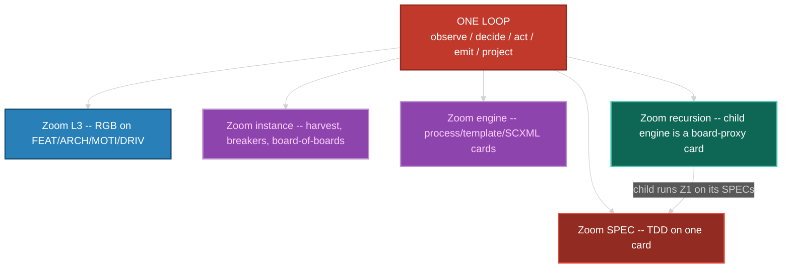

Self-improvement is not a special mode. A `PROCESS_DEFECT` is a card. A harvest is a card. A child SDLC is a board-proxy card. All wait on `ready`, take a lease, go RED before GREEN, fan in at a merge point.

---

## 26. SCXML Seed Chart (sketch — binding structure, not literal XML)

The seed chart defines the compound/superstates, orthogonal regions, and key transitions. The chart is loaded from `sdlc-scxml-seed` crate, resolved by `statig`, and hot-reloadable via `SchemaRegistry.reload_chart()`.

```
<scxml name="sdlc-engine" initial="board">

  <!-- One board: compound superstate -->
  <state id="board">
    <state id="backlog">
      <transition event="WORK_READY" target="ready"/>
    </state>
    <state id="ready">
      <transition event="WORK_CLAIMED" target="in_progress"/>
    </state>

    <!-- in_progress: orthogonal region for TDD -->
    <state id="in_progress">
      <transition event="WORK_BLOCKED" target="blocked"/>
      <transition event="WORK_RELEASED" target="ready"/>
      <transition event="WORK_COMPLETED" target="review"/>

      <!-- TDD nested states -->
      <state id="tdd_not_started" initial="true">
        <transition event="TEST_FAIL" target="tdd_red"/>
        <!-- NO transition on TEST_PASS from tdd_not_started -->
        <!-- This is the TddGate: the absent edge -->
      </state>
      <state id="tdd_red">
        <transition event="TEST_PASS" target="tdd_green" cond="first_failure_set"/>
      </state>
      <state id="tdd_green">
        <transition event="REFACTOR_START" target="tdd_refactor"/>
        <transition event="TEST_FAIL" target="tdd_red"/>
        <transition event="CODE_REGRESSION" target="tdd_red"/>
      </state>
      <state id="tdd_refactor">
        <transition event="REFACTOR_DONE" target="tdd_green"/>
        <transition event="TEST_FAIL" target="tdd_red"/>
        <transition event="CODE_REGRESSION" target="tdd_red"/>
      </state>
    </state>

    <state id="blocked">
      <transition event="WORK_UNBLOCKED" target="ready"/>
    </state>
    <state id="review">
      <transition event="MERGE_ACCEPTED" target="done"/>
      <transition event="MERGE_REJECTED" target="in_progress"/>
      <transition event="MERGE_BLOCKED" target="blocked"/>
      <transition event="WORK_CONFLICTED" target="blocked"/>
    </state>
    <state id="done" type="final"/>
  </state>

  <!-- Merge-point states (same board, separate region) -->
  <state id="merge_region">
    <state id="merge_queue"/>
    <state id="active_merge"/>
    <state id="merge_verification"/>
    <state id="merge_integrated" type="final"/>
  </state>
</scxml>
```

The actual chart shipped in `sdlc-scxml-seed` is a valid SCXML 1.0 document. The above is a structural sketch showing key states and transitions. Guard predicates (`cond=`) are registered in GuardRegistry, not inline scripts.

---

## 27. Config Schema (binding fields)

Config is loaded from file (TOML or YAML), watched for changes. Bad config: keep last-good. Config changes MAY be emitted as events.

| Section | Key | Type | Default | Description |
|---|---|---|---|---|
| `engine` | `instance_id` | string | required | Unique engine instance ID |
| `engine` | `initial_locator` | string | required | Bootstrap locator (§15.2) |
| `engine` | `tenant_id` | string | `"default"` | Multi-tenant partition prefix |
| `tdd` | `gate_enabled` | bool | `true` | TddGate active. MUST be true in production |
| `kanban` | `wip_limits` | dict | `{in-progress: 8, review: 4}` | Per-column WIP limits |
| `agent` | `spawn_budget_base` | int | `8` | `floor(base / 2^depth)` |
| `agent` | `max_depth` | int | `4` | Hard stop on nesting |
| `agent` | `preempt_grace_ms` | int | `30000` | Cooperative release grace |
| `watchdog` | `heartbeat_ms` | int | `5000` | Heartbeat interval |
| `watchdog` | `progress_idle_ms` | int | `60000` | Stall detection |
| `watchdog` | `token_storm_tps` | int | `100` | Token rate SIGKILL threshold |
| `watchdog` | `storm_window_ms` | int | `10000` | Storm measurement window |
| `watchdog` | `oscillation_bound` | int | `3` | Merge flip-flop kill threshold |
| `guard` | `fixation_ceiling` | int | `10` | System-wide hard ceiling |
| `guard` | `competing_approaches_min` | int | `1` | MOTI siblings for competing-approaches guard |
| `breaker` | `hard_constraints` | dict | project-specific | bug_count, tech_debt, coverage thresholds |
| `breaker` | `window_seconds` | int | `3600` | Rolling evaluation window |
| `harvest` | `usage_threshold` | int | `3` | Min references for EXTRACT_LIB |
| `harvest` | `duplication_ratio` | float | `0.4` | AST similarity threshold |
| `harvest` | `stable_cycles` | int | `5` | Cycles without API change for SERVICE promote |
| `scheduler` | `weights` | dict | `{p0: 100, dep: 10, age: 1, merge: 20, risk: 50, zoom: 5, wip: -3, lease: -100}` | Scoring weights |
| `security` | `require_auth` | bool | `true` | Enforce authentication on all ports |
| `security` | `tls_cert_path` | string | optional | Path to TLS certificate |
| `security` | `tls_key_path` | string | optional | Path to TLS private key |
| `telemetry` | `otlp_endpoint` | string | optional | OTel collector endpoint |
| `telemetry` | `prometheus_port` | int | optional | Prometheus scrape port |

---

## 28. Graceful Drain

```
1. Stop IngressGateway (refuse new external events)
2. Finish in-flight transitions (Dispatcher drains queue)
3. Refuse new WORK_CLAIMED (AgentPool rejects claims)
4. Wait for active leases to expire or complete (bounded by max TTL)
5. Snapshot EventStore
6. Stop iceoryx2 services (tracker sees disappear)
7. Drop zenoh liveliness token (parent sees MESH_LEAVE)
8. Shutdown daemons in reverse dependency order
```

---

## 29. Orchestration Main Loop (always-live)

```
fn run(orch: Orchestrator) {
  # WaitSet: EventStore notify + iceoryx2 + zenoh + TIMER_TICK
  loop {
    for n in waitset.wait() {
      match n {
        StoreAppend(seq)        => handle_partition(seq)
        IceoryxService(_)       => handle_local_copy()
        ZenohIngress(sample)    => ingest_child_egress(sample)  # MESH_INGRESS
        LivelinessPut(tok)      => emit MESH_JOIN          # engine peers only
        LivelinessDelete(tok)   => emit MESH_LEAVE
        TimerTick(id)           => dispatch(TIMER_TICK)
      }
    }
  }
}

fn handle_partition(seq) {
  persist already done
  apply transition          # Dispatcher + TddGate + ResolvedChart
  project card mv           # KanbanProjector
  update scores for affected
  evaluate merge if parent_id
  harvest.on_event          # live, no LLM
  learning_ingest.on_event  # rusqlite projection only
  watchdog.on_event         # OS probes immediately
  offer_work()              # pick + claim; P3 only if a sidecar holds the lease
}

fn ingest_child_egress(sample) {
  # key: sdlc/{parent_instance}/egress/{child_instance}/{kind}
  append MESH_INGRESS wrapping child event
  move board-proxy column
  recompute proxy score
}
```

All steps are synchronous on the **partition**. Across partitions they are async copies. No global sort.

---

## 30. EGRESS_SET (binding)

Events that a child engine publishes to its parent via zenoh:

| Event | Why egress |
|---|---|
| `MERGE_ACCEPTED` | Parent board-proxy may advance |
| `LEARNING` | Parent may detect `PROCESS_DEFECT` or `HARVEST_DETECTED` |
| `SDLC_SPAWNED` | Grandchild awareness |
| `PROBLEM_SIGNAL` | Parent may create a DRIV card |
| `BREAKER_TRIPPED` | Parent board-proxy to `blocked` |
| `MEMORY_CONTRADICTION` | Parent may mint a card |
| `MESH_LEAVE` | Parent liveliness tracking |

---

## 31. Orchestration, Scale, Fault Tolerance

**Event-driven.** No daemon polls a clock to mutate state. TimerDaemon publishes `TIMER_TICK`; subscribers decide.

**Dynamic.** Node types, event kinds, SCXML chart, guards, breakers, harvest rules load from SchemaRegistry + Config.

**Scalable.**

- Work events partition by `work_item_id`.
- Agent execution partitions by `owned_subtree`.
- Merge-point evaluation runs on the **parent partition**. Children do not take a global lock.
- Multi-instance Dispatcher: competing consumers with partition affinity preferred. Merge eval: CAS on merge-point state.

**Fault tolerant.** At-least-once. Idempotent projectors. Lease expiry. DLQ. Orchestrator stateless vs EventStore. Backpressure via bounded queues. `spawn_budget`. Snapshot/Checkpoint.

**Robust.** Graceful drain (§28). Workers MAY be sandboxed with bwrap; the engine does not hard-require it.

---

## 32. A2A Sidecar Runtime (not MCP, not in-process with Dispatcher)

The sidecar is a **separate process**. Engine tests start **zero** sidecar processes. When present, it speaks **only A2A** at P2/P3. OpenAI-compat HTTP stays inside the sidecar.

```
sidecar main:                          # NOT linked into Dispatcher
    serve a2a-server (agent card)
    announce card via A2A to P2 (AGENT_CARD_PUBLISHED)
    bind rig-core to sidecar-local openai-compat locator
    loop:
        task = A2A receive on P3       # lease already committed
        rig_agent.prompt(task)
        A2A respond; P2 may carry LEARNING / TEST_* / WORK_COMPLETED proposals
        heartbeat fd for P4
    # NEVER: EventStore.append, kanban mv, iceoryx2 publish of TRANSITION_*
```

Ollama is the sidecar's default primary inference. LocalAI, Xinference, and vLLM are optional sidecar backends. The orchestrator does not embed a vendor and does not require any of them.

---

# PART E — Validation

*The engine builds itself using its own grammar.*

---

## 33. Dogfood Validation — The Engine Builds Itself

The ultimate validation example is not a toy. The SDLC engine project itself is instantiated as an engine instance:

### 33.1 The Dogfood Instance

1. **STRAT:** "Build a generic, deterministic SDLC orchestrator engine."
2. **DRIV-001:** "No existing tool provides event-sourced, TDD-gated, anti-fixation SDLC orchestration."
3. **MOTI-001-active:** "Rust system-of-systems with iceoryx2 + zenoh + A2A."
4. **MOTI-002-rejected:** "Monolithic Python orchestrator." (Rejected: no zero-copy IPC, no compile-time safety)
5. **FEAT-001:** "EventStore daemon with SQLite WAL and iceoryx2 notify."
6. **ARCH-001:** "OTel-style decomposition: proto → API → impl → orchestrator."
7. **SPEC-001:** "EventStore append MUST be fsync'd before ack."
8. **TEST for SPEC-001:** Write a test that appends an event, kills the process, restarts, and verifies the event is present. RED first.

### 33.2 What This Validates

| Engine feature | Dogfood exercises |
|---|---|
| TDD gate | Every SPEC in every repo goes RED → GREEN → REFACTOR |
| Anti-fixation guards | MOTI-002-rejected exists as a real file. Competing-approaches guard satisfied |
| Merge points | Each Layer 2 repo's SPECs fan in to their FEAT card |
| Board of boards | `sdlc-sidecar` MAY be spawned as a child engine instance |
| Live scheduling | Cards are scored and dispatched as events arrive |
| Watchdog | Build agents are monitored for hang/storm/path violations |
| Observability fabric | Build events carry trace context; metrics exported |
| Security fabric | A2A sidecar (if present) authenticated via JWT |
| Sync invariant | SPEC document == test file == implementation code |
| SCXML chart | The engine's own state machine is the one being tested |

### 33.3 Validation Criteria (all MUST hold)

1. Engine tests pass with zero sidecar processes running (zero LLM).
2. `NOT_STARTED → GREEN` is `TRANSITION_REJECTED` in every test run.
3. Every SPEC has a recorded `first-failure` before any `TEST_PASS`.
4. Every repo has at least one Rejected MOTI in `docs/sdlc/`.
5. Merge points with N>1 correctly block until all children arrive.
6. Watchdog detects and kills a deliberately hung test agent.
7. EventStore survives crash-restart with no event loss.
8. Traces from IngressGateway through Dispatcher to TestRunner are correlated.
9. Guard `consecutive_passes` resets on fire, force-fires on ceiling.
10. `PROCESS_DEFECT` creates a card on the same kanban (engine-zoom).

---

## Changelog

| Version | Date | Author | Changes |
|---|---|---|---|
| 0.0.1 | 2026-08-18 | Frederick Bloom | Original generic deterministic engine: taxonomy, RGB, guards, breakers, event-sourced core, star orchestrator, harvest, interfaces, event catalog. |
| 0.0.2 | 2026-08-30 | Frederick Bloom + Claude (Cursor AI) | Overlay attempt (workstream kanban, exclusive ownership, merge-point events, process/external events, TDD gate notes). **FAILED integration** — two kanbans, two merge stories, two ownership models. Kept as historical sibling. Do not implement. |
| 0.0.3 | 2026-08-30 | Frederick Bloom + Claude (Cursor AI) | Integrated rewrite plus live-orchestrator **sketch**: one taxonomy, one kanban, one merge, one ownership; loops as zoom levels; ER sketch; generic event bus still named. Do not implement as the IPC contract. |
| 0.0.4 | 2026-08-30 | Frederick Bloom + Claude (Cursor AI) | Replaces the generic bus with **iceoryx2** plus **zenoh**. One machine: **SCXML** + **`statig`**. AI is a sidecar only: core daemons have zero LLM. **MCP forbidden**. Live scheduler, OS watchdogs, localized SQLite ER, crate inventory. |
| 0.0.5 | 2026-08-31 | Frederick Bloom + Antigravity (Google DeepMind) | Expansion of 0.0.4 with detailed SQL schemas, PRAGMA conventions, daemon inventory, event payload schemas, sequence diagrams. |
| 0.0.5.1 | 2026-08-31 | Frederick Bloom + Antigravity (Google DeepMind) | Attempted system-of-systems restructure of 0.0.5. Subsystem bleed — behavioral and implementation layers interleaved. Superseded by 0.0.6. |
| 0.0.6 | 2026-08-31 | Frederick Bloom + Antigravity (Google DeepMind) | **System-of-systems with strict layer separation.** OTel-style decomposition: proto repo, API trait workspace, per-subsystem impl repos. 5-PART structure: A (Logical/Behavioral §§0-13), B (Interface Contracts §14), C (Implementation §§15-22), D (Cross-Cutting §§23-32), E (Validation §33). Self-documenting repos with STRAT/DRIV/MOTI/FEAT/SPEC docs. Observability (`tracing` + OTel) and security (`rustls` + `secrecy` + JWT) as day-one fabric. 14-repo layered structure. Async patterns table (`async-trait`, `futures-util`, `pin-project`, `tower` gateway-only). SCXML seed chart sketch. Config schema. Graceful drain. Dogfood validation: engine builds itself using its own grammar. Real-world example: attacker disclosure to merge accepted sequence diagram. |

