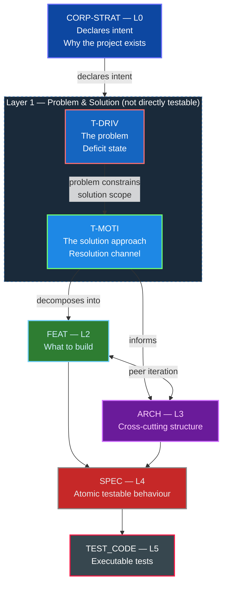
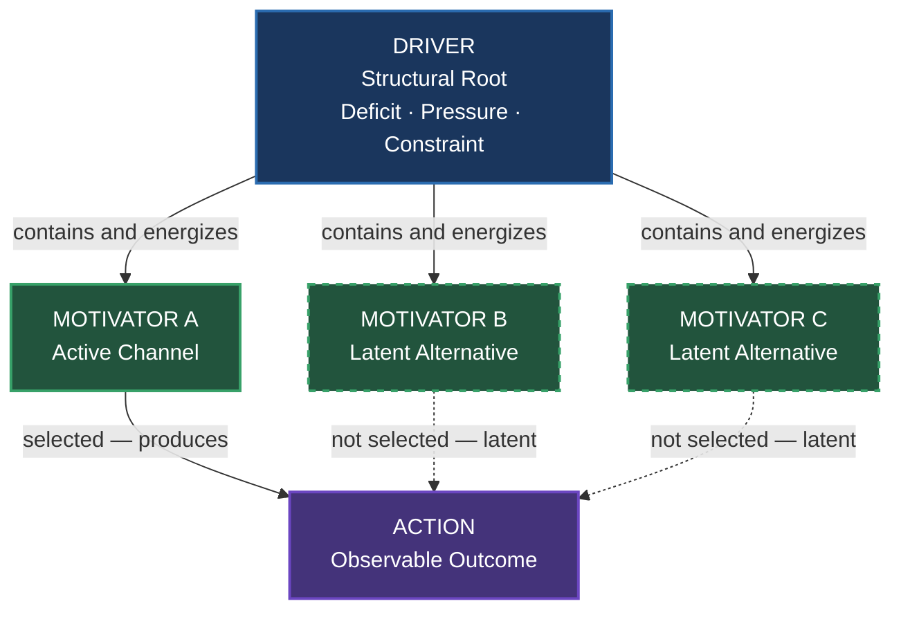
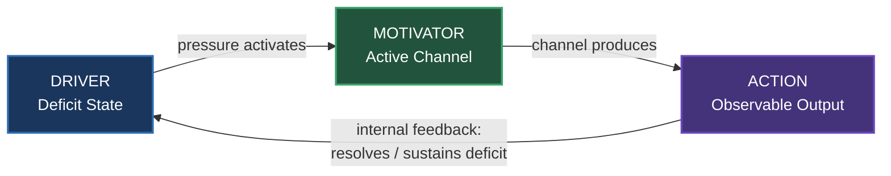
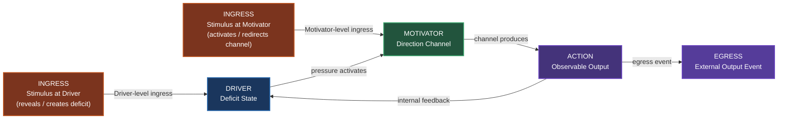
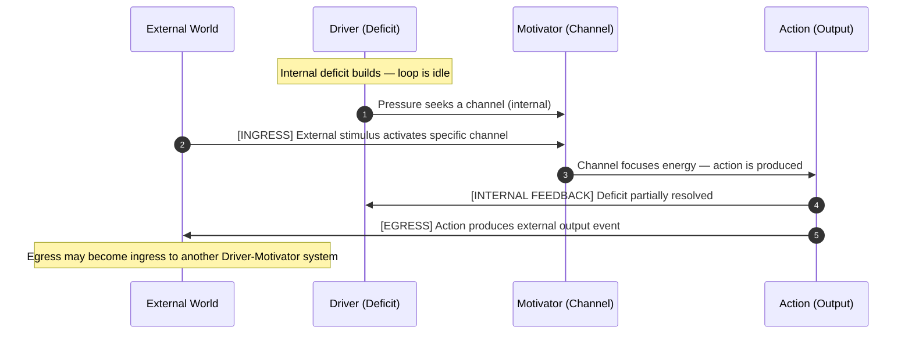
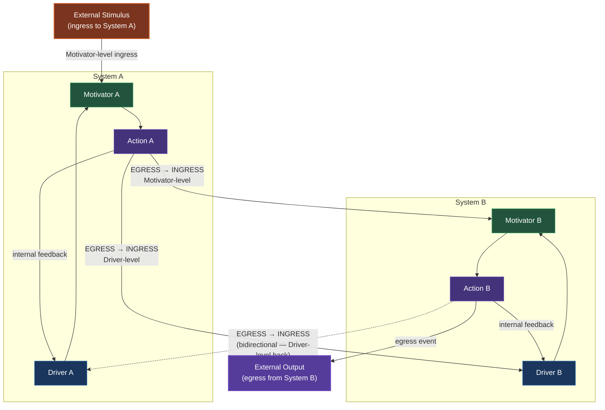
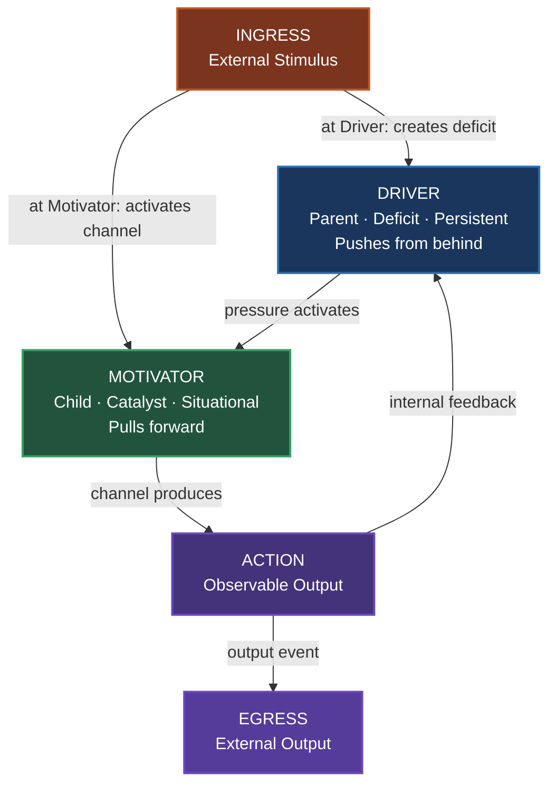

<!-- (c) 2026-* Frederick Bloom -- 20260826-140524-63d102-7728-b8b3-88ee17f824fb-DriverVsMotivator-analysis.analys-1.1.0.md -- Hanaden AI -->
---
filename-id:   20260826-140524-63d102-7728-b8b3-88ee17f824fb-DriverVsMotivator-analysis.analys-1.1.0
node-type:     ANALYS
layer:         meta
version:       1.1.0
status:        Active
author:        Frederick Bloom
copyright:     "(c) 2026-* Frederick Bloom"
description: >
  Pure ontological analysis of the conceptual relationship between Driver and
  Motivator. Establishes their distinct roles, structural hierarchy, directional
  nature, closed-loop interaction, and event-driven ingress/egress topology.
  Domain-agnostic. No project coupling. No framework coupling.
scope:         universal
keywords:
  - ontology
  - driver
  - motivator
  - causation
  - hierarchy
  - feedback-loop
  - event-driven
  - ingress
  - egress
  - stimulus-response
---

<!-- (c) 2026-* Frederick Bloom -- Ontology Analysis: Driver and Motivator v1.1.0 -->

# Ontology Analysis: Driver and Motivator

---

## Abstract

**What this document is.**
A self-contained ontological analysis of two words: *Driver* and *Motivator*.
It establishes their precise definitions, the structural relationship between
them, the directional nature of their interaction, the internal feedback loop
they form, and the event-driven topology that connects that loop to external
stimuli and output events.

**What this document is not.**
It is not a project plan, an SDLC specification, a process guide, or a
framework reference. It contains no examples from any specific project,
codebase, or domain. All content is universal and domain-agnostic.

**Key findings.**

- A Driver and a Motivator are structurally distinct: they occupy different
  positions in a causation chain and perform non-interchangeable roles.
- Driver is the **parent**: a persistent, direction-neutral deficit pressure
  that makes action necessary. It pushes from behind.
- Motivator is the **child**: a situational, direction-specific catalyst that
  channels Driver energy toward a concrete action. It pulls forward.
- Together they form a **closed internal feedback loop**: Driver → Motivator
  → Action → feedback → Driver.
- The loop has **two ingress points**: external stimuli can enter at the
  Driver level (creating/revealing deficit) or the Motivator level
  (activating/redirecting a channel).
- The loop has **one egress point**: Action always produces an external
  output event in addition to its internal feedback path.
- Egress from one system can become ingress to another, forming **cascades**
  of coupled Driver-Motivator loops.

**Position in the SDLC artifact hierarchy.**

`T-DRIV` and `T-MOTI` occupy **Layer 1** as **peers** — they sit side by side
at the same level, both one step below `CORP-STRAT`. `T-DRIV` names the
*problem* (the deficit state that makes work necessary); `T-MOTI` names the
*solution approach* chosen to resolve it. The Driver's problem scope constrains
the Motivator's solution space — but neither is parent to the other in the
strict hierarchy sense. Everything below them (`FEAT`, `ARCH`, `SPEC`,
`TEST_CODE`) derives from the Motivator's chosen approach. Everything above
(`CORP-STRAT`) declares the strategic intent that legitimises the Driver.

`T-DRIV` and `T-MOTI` are **not directly testable**. They do not own
`TEST_CODE` nodes. They may produce *test suite harness definitions* — grouping
and ordering rules for the concrete tests that live at the `SPEC` and
`TEST_CODE` layers — but the executable verification of their claims is done
indirectly through the `FEAT` → `SPEC` → `TEST_CODE` chain they decompose into.

*This document analyses the ontological meaning of `T-DRIV` and `T-MOTI`
— the L1 peer layer highlighted above — as pure concepts, independent of
any specific instantiation of the hierarchy.*

---

## 1. The Two Concepts Defined

### 1.1 Driver

A Driver is a **structural root force** — an underlying state of tension,
deficit, or constraint that makes action necessary. It does not point toward any
specific outcome. It simply establishes that the current state cannot persist
unchanged.

A Driver **pushes from behind**. It is the pressure that exists regardless of
what reward is offered. It is the *why* that cannot be suppressed by ignoring it.

Core properties:

| Property | Description |
|:---|:---|
| **Internal and structural** | Exists within the system before any external stimulus arrives |
| **Deficit-based** | Arises from a gap between current state and a required state |
| **Non-negotiable** | Does not dissolve because it is ignored or deferred |
| **Direction-neutral** | Creates pressure without specifying the path of release |
| **Persistent** | Continues until the underlying deficit is genuinely resolved |

### 1.2 Motivator

A Motivator is an **operational catalyst** — a specific incentive, reward
mechanism, or trigger that gives the energy of a Driver a concrete direction.
It converts unformed pressure into goal-directed action.

A Motivator **pulls forward**. It is the specific thing that makes one
particular path of action attractive or worthwhile at this moment.

Core properties:

| Property | Description |
|:---|:---|
| **External or contextual** | Arrives as a stimulus, opportunity, or perceived reward |
| **Reward-based** | Operates by making one direction more attractive than alternatives |
| **Situational** | Sensitive to context; the same Driver can be channeled by different Motivators |
| **Direction-specific** | Selects and focuses the release path for Driver energy |
| **Substitutable** | Can be replaced by a different Motivator without changing the underlying Driver |

---

## 2. Structural Hierarchy

The Driver is the **parent**. The Motivator is the **child**.

This is a dependency statement, not a value judgment. A Motivator has nothing
to channel without a Driver behind it. A Driver without a Motivator has energy
but no direction.

One Driver can have **many candidate Motivators**. At any moment, one is active
and the others remain latent. If the active Motivator is removed, the Driver
persists and will find or create another channel.

---

## 3. Directionality: Push vs Pull

The axis between Driver and Motivator is directional. They operate at opposite
ends of the causation chain.

| Dimension | Driver | Motivator |
|:---|:---|:---|
| **Direction** | Pushes from behind | Pulls forward |
| **Origin** | Internal deficit | External incentive |
| **Persistence** | Continuous until deficit resolved | Contextual and transient |
| **Function** | Establishes the necessity of action | Establishes the direction of action |
| **Framing** | Escaping an unwanted state | Approaching a desired state |

The Driver answers: **must something change?**
The Motivator answers: **toward what?**

---

## 4. The Internal Feedback Loop

At its core, Driver and Motivator participate in a **closed internal feedback
loop**: Driver pressure activates a Motivator channel, the channel produces an
Action, and the Action's outcome feeds back into the Driver's deficit state —
either reducing, sustaining, or intensifying it.

Key observations:

- **Partial resolution:** A single action rarely fully resolves a Driver. The
  loop continues until the deficit is genuinely eliminated.
- **Motivator substitution:** If the outcome does not satisfy the Driver, a
  different Motivator channel activates on the next cycle.
- **Driver dissolution:** Only when the underlying deficit is genuinely resolved
  does the Driver release its pressure and the loop terminate.

---

## 5. Event-Driven Extension: Ingress and Egress

The internal loop does not run in isolation. It has **boundary crossings**: points
where external events enter the loop (**ingress**) and where the loop produces
events that leave into the external world (**egress**).

### 5.1 The Open Loop Topology

Two ingress points. One egress point. The internal feedback path is separate
from the egress path — an action can simultaneously close the internal loop
*and* produce an external output event.

### 5.2 Motivator-Level Ingress (Most Common)

An external stimulus arrives and **activates, replaces, or intensifies** the
active Motivator. The Driver's existing deficit pressure is already present.
The stimulus does not create the need — it provides a **specific direction**
for energy that was already seeking a channel.

The external event answers: *toward what?* — it supplies the pull that the
Driver was missing.

Characteristics of Motivator-level ingress:

| Property | Description |
|:---|:---|
| **Precondition** | A Driver with built-up pressure must already exist |
| **Effect** | Selects or replaces the active Motivator channel |
| **Driver state** | Unchanged — the deficit remains; only the direction shifts |
| **Immediacy** | Can trigger an immediate response if Driver pressure is high |
| **Reversibility** | Removing the stimulus may leave the Driver without a channel but does not dissolve it |

### 5.3 Driver-Level Ingress (Less Common)

An external stimulus **reveals, creates, or amplifies** a Driver. It brings a
deficit into awareness that was previously below threshold, or it creates a new
deficit by altering the system's state. The event does not point to any specific
direction — it creates the pressure that will then seek a Motivator.

The external event answers: *why must this change?* — it instantiates the need.

Characteristics of Driver-level ingress:

| Property | Description |
|:---|:---|
| **Precondition** | None — a latent Driver or zero Driver state is sufficient |
| **Effect** | Creates or intensifies a Driver; a Motivator must then be found |
| **Motivator state** | Indeterminate — the new Driver begins searching for a channel |
| **Immediacy** | Response is delayed while the system locates a Motivator |
| **Reversibility** | Removing the stimulus may or may not dissolve the new Driver |

### 5.4 Egress: Output Events at the Action Level

Every Action produces two kinds of output simultaneously:

1. **Internal feedback** — the path back to the Driver (closes the loop).
2. **External egress** — observable output that crosses the system boundary
   and enters the external world.

Egress events are not consumed by the internal loop. They carry information,
state change, or effect outward, where they may:
- Simply be observed (no onward consequence)
- Become a **Motivator-level ingress** into another system (directing existing
  pressure toward a specific response)
- Become a **Driver-level ingress** into another system (revealing or creating
  a new deficit in that system)

### 5.5 Full Event-Driven Sequence

### 5.6 Cascade: Egress as Ingress

When one system's egress event becomes another system's ingress, a **cascade**
forms. Each system has its own internal loop; boundary events connect them.

The cascade can be unidirectional (A → B only) or bidirectional (A ⇄ B,
shown as dashed). In the bidirectional case, System B's egress feeds back
as a Driver-level ingress to System A, creating a coupled oscillation.

---

## 6. Distinguishing the Two: Decision Tests

When it is unclear whether something is a Driver or a Motivator, apply these
tests in sequence.

### Test 1 — The Removal Test

Remove the candidate. Does the pressure to act remain?

- **Yes** → it was a Motivator. The Driver is still present; only the channel
  was removed.
- **No** → it is closer to the Driver itself. Its removal dissolved the
  underlying need.

### Test 2 — The Direction Test

Does the candidate explain *why* action is necessary, or *which* action is taken?

- *Why action is necessary* → Driver
- *Which action is taken* → Motivator

### Test 3 — The Substitution Test

Could a completely different candidate serve the same function without changing
the underlying need?

- **Yes** → it is a Motivator. It is one of several possible channels for the
  same Driver.
- **No** → it is more likely a structural Driver property, not a channel.

---

## 7. Summary

| | Driver | Motivator |
|:---|:---|:---|
| **Question answered** | Why must something change? | What is specifically pursued? |
| **Structural role** | Parent — root constraint | Child — operational channel |
| **Energy source** | Deficit / absence / tension | Reward / opportunity / trigger |
| **Temporal nature** | Persistent until deficit resolved | Situational and substitutable |
| **Direction** | Pushes — escaping a state | Pulls — approaching a state |
| **Boundary role** | Receives Driver-level ingress | Receives Motivator-level ingress |
