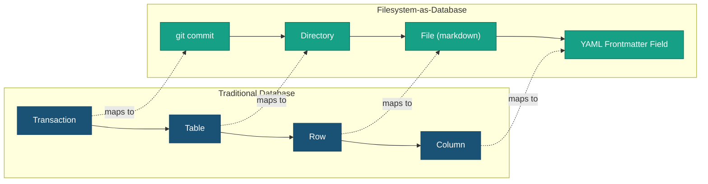
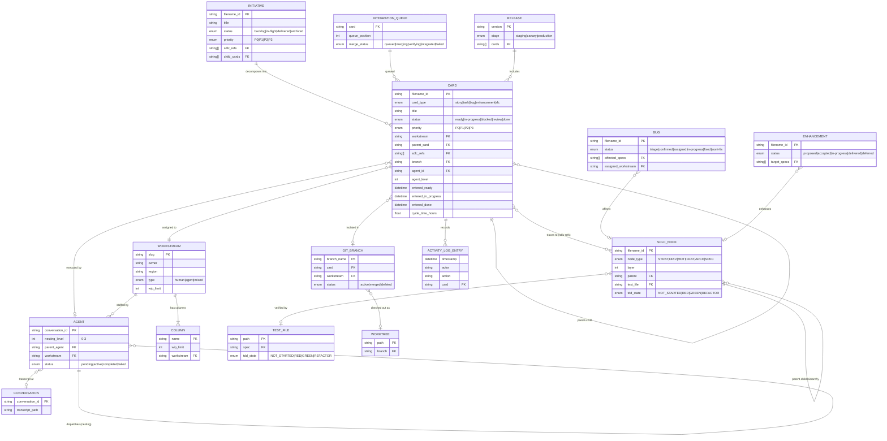
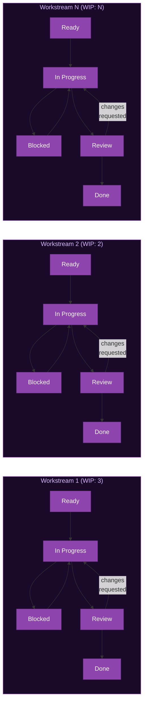
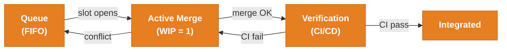
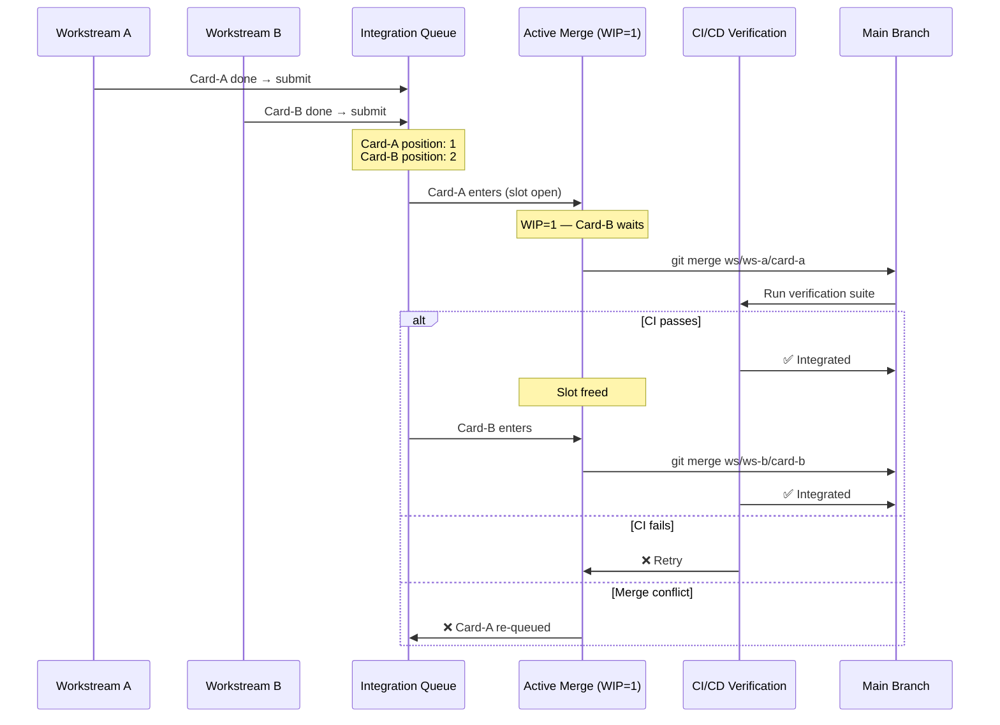
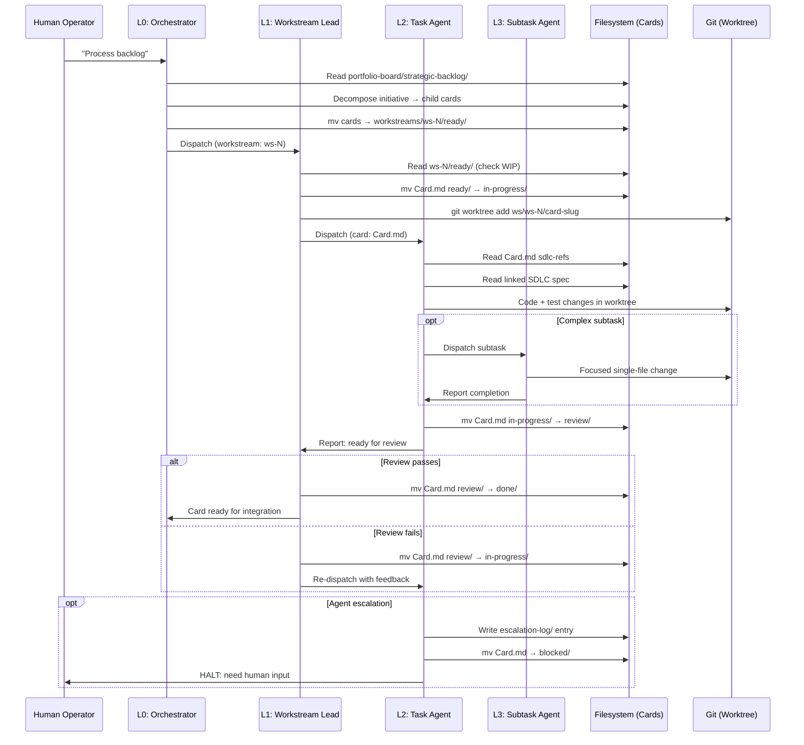
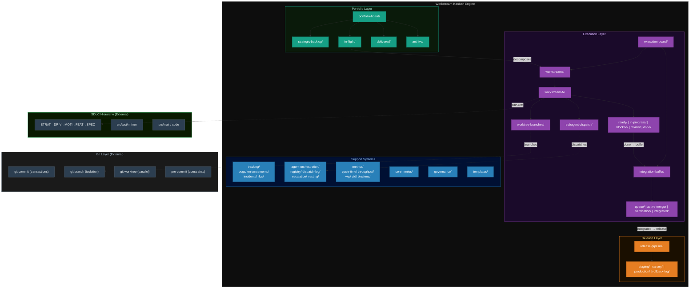
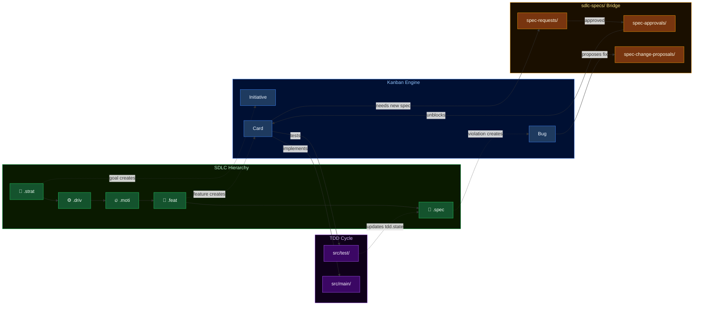
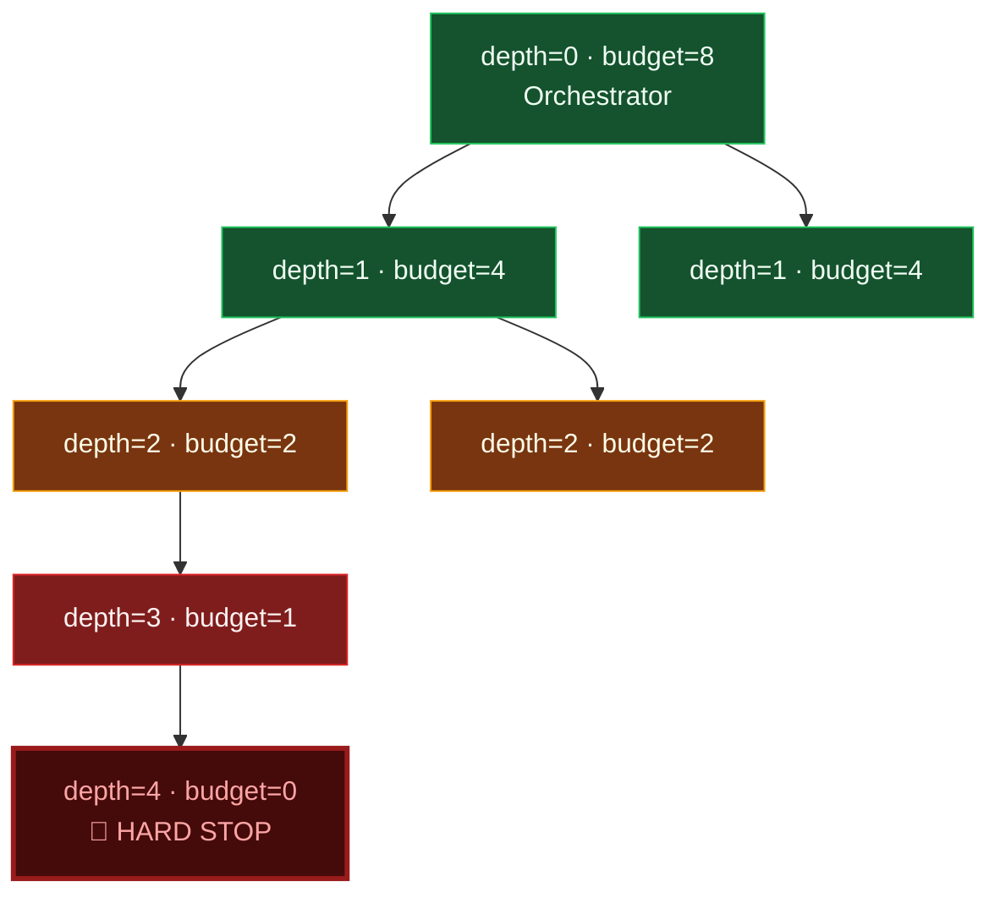
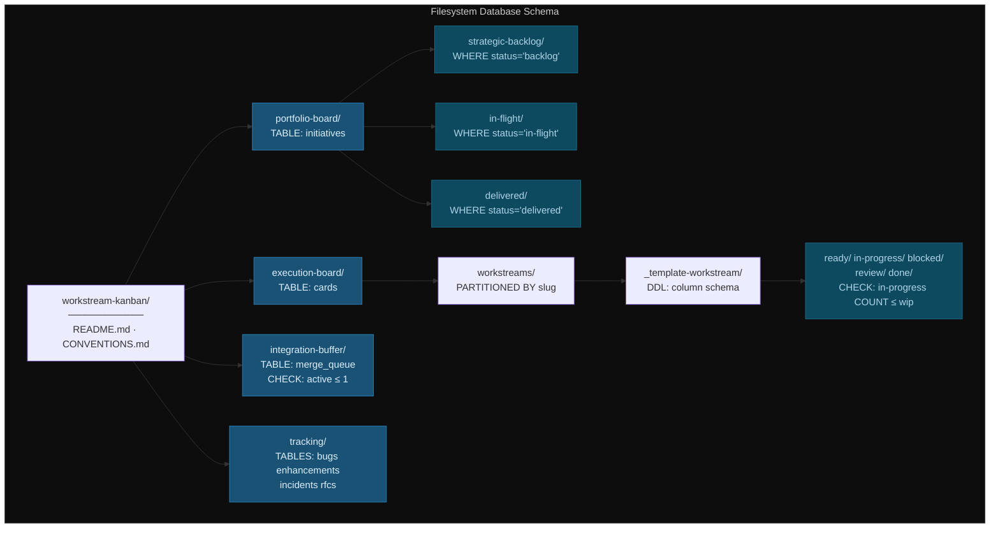

<!-- (c) 2026-* Frederick Bloom -- Generic Workstream Kanban Engine -- Hanaden AI -->

# Generic Workstream Kanban Engine — Filesystem-as-Database Workflow System

> **Status:** DRAFT — Design Only
> **Type:** Generic / Reusable — Project-Agnostic
> **Author:** Frederick Bloom + AI
> **Date:** 2026-08-27
> **Paradigm:** Filesystem = Database · Directories = Tables · Files = Rows · `mv` = State Transition · `git commit` = Transaction Log
> **Target:** `PROJECT_HOME/generic-sdlc-and-engine-readonly/`
> **Filename:** `20260827-032351-153784-198a-2703-3f584ebf95d7-GenericWorkstreamKanbanEngine.kanban-0.0.1.md`

---

## 1. Core Thesis: The Filesystem IS the Database

Git uses the filesystem as a content-addressable object store. This system
extends that idea: **the filesystem IS a relational workflow database** where
workflows are first-class citizens.



| Database Concept | Filesystem Equivalent | Example |
|------------------|-----------------------|---------|
| **Table** | Directory | `workstreams/backend-team/in-progress/` |
| **Row** | Markdown file + YAML frontmatter | `RefactorAuth.card-0.0.1.md` |
| **Column / Field** | YAML frontmatter key | `priority: P0` |
| **Primary Key** | `filename-id` (Hanaden UUIDv7) | `20260827-143000-...-RefactorAuth` |
| **Foreign Key** | `parent-card:`, `sdlc-refs:` | Points to another `filename-id` |
| **INSERT** | Create file in directory | `touch ready/NewCard.card-0.0.1.md` |
| **UPDATE** | Edit YAML frontmatter | Change `status:` field |
| **State Transition** | `mv` file between directories | `mv ready/Card.md in-progress/` |
| **SELECT / Query** | `ls`, `find`, `grep` | `ls in-progress/*.card-*.md` |
| **JOIN** | Resolve `parent:` / `sdlc-refs:` | Follow FK → read target file |
| **Transaction** | `git commit` | Atomic snapshot of state changes |
| **Transaction Log** | `git log` | Immutable audit with author + timestamp + diff |
| **Branching / Isolation** | `git worktree` / `git branch` | Parallel workstream isolation |
| **Merge** | `git merge` | Integration buffer merge |
| **Schema** | Directory convention + frontmatter template | `CONVENTIONS.md` + `.tmpl.md` files |
| **Index** | `find -name '*.card-*'` | Filesystem walk + frontmatter grep |
| **Constraint** | WIP limit check / pre-commit hook | `wip-config.yaml` + git hooks |
| **View** | Generated summary file | Auto-gen kanban `.md` from filesystem state |

**What git provides beyond traditional databases:** Every state change is
immutably recorded with author, timestamp, and diff. Every parallel workstream
gets full isolation via worktrees/branches. Merge = integration. Revert =
`git revert`. Audit = `git log --all`.

**What this system adds beyond git:** Workflows as first-class citizens.
Git tracks *what changed*; this system tracks *why it changed, who owns it,
what state it's in, and what happens next*.

---

## 2. Entity-Relationship Model



---

## 3. Two-Board Architecture

### 3.1 Board 1: Portfolio Kanban (Strategic Level)


Each **initiative** is a master card that decomposes into child cards routed
to specific workstreams.

### 3.2 Board 2: Parallel Execution Kanban (Workstream Level)



### 3.3 Integration Buffer (Pattern B — Serial Merge Gate)



---

## 4. Card Lifecycle State Machine

```mermaid
stateDiagram-v2
    [*] --> Backlog: Card created
    Backlog --> Ready: Prioritized + Spec linked

    state "Workstream Execution" as WSE {
        Ready --> InProgress: Pulled (WIP check passes)
        InProgress --> Blocked: External dependency
        Blocked --> InProgress: Dependency resolved
        InProgress --> Review: Work complete, tests pass
        Review --> InProgress: Changes requested
        Review --> Done: Approved by reviewer
    }

    Done --> IntegrationQueue: Submit to buffer

    state "Integration Buffer (WIP=1)" as IBuf {
        IntegrationQueue --> ActiveMerge: Buffer slot opens
        ActiveMerge --> Verification: Merge successful
        Verification --> Integrated: CI/CD passes
        Verification --> ActiveMerge: Verification failed
        ActiveMerge --> IntegrationQueue: Merge conflict
    end

    Integrated --> Staging: Deploy to staging

    state "Release Pipeline" as RPipe {
        Staging --> Canary: Partial rollout
        Canary --> Production: Full rollout
        Production --> Rollback: Defect detected
        Rollback --> Staging: Fix and redeploy
    }

    Production --> [*]: Released
```

---

## 5. Integration Buffer Sequence



---

## 6. Agent Dispatch Sequence



---

## 7. Component Architecture



---

## 8. SDLC ↔ Kanban Interaction Model



---

## 9. Agent Nesting — Tree of Trees with Exponential Backoff

Agents form a **tree of trees** — each agent can spawn 1:N child agents,
recursively. There are no fixed levels. Instead, depth is governed by a
**deterministic exponential backoff algorithm** inspired by Ethernet CSMA/CD
collision avoidance: the deeper the nesting, the harder it is to spawn.

### 9.1 Spawn Cost Algorithm

```
spawn_budget(depth) = floor(BASE_BUDGET / 2^depth)

where:
  BASE_BUDGET = 8            # Root agent can spawn up to 8 children
  depth       = 0, 1, 2, ... # Depth in the agent tree

Result:
  depth=0 → budget=8   (orchestrator spawns freely)
  depth=1 → budget=4   (workstream leads)
  depth=2 → budget=2   (task agents)
  depth=3 → budget=1   (single subtask)
  depth=4 → budget=0   (HARD STOP — cannot spawn)
```

This is **deterministic** — no randomness. The budget halves at every level.
When `spawn_budget(depth) == 0`, spawning is prohibited. The agent MUST
complete the work itself or escalate.

### 9.2 Backoff Rules

| Rule | Description |
|------|-------------|
| **Budget Gate** | Before spawning, check `spawn_budget(current_depth + 1) > 0`. If 0, HALT spawn. |
| **Sibling Limit** | Agent at depth `d` can have at most `spawn_budget(d)` active children at once. |
| **Escalation on Exhaustion** | If budget is 0 and work cannot be completed alone, escalate to parent with `blocked-reason: depth-limit-exceeded`. |
| **No Self-Deepening** | An agent MUST-NOT spawn a child that will itself immediately spawn — that's budget laundering. Each level must do meaningful work. |
| **Audit Trail** | Every spawn writes `agent-orchestration/dispatch-log/` entry with `parent-depth`, `child-depth`, `remaining-budget`. |

### 9.3 Class Diagram (Tree of Trees)

```mermaid
classDiagram
    class Agent {
        +conversation_id: string
        +depth: int
        +spawn_budget: int
        +parent_agent: Agent or null
        +children: Agent[]
        +workstream: string
        +card: Card or null
        +status: pending|active|completed|failed
        +escalates_to: Agent or Human
        +can_spawn(): bool
        +spawn(task): Agent
        +escalate(reason): void
    }

    class SpawnPolicy {
        +BASE_BUDGET: 8
        +budget_at(depth): int
        +can_spawn(depth): bool
    }

    Agent "1" --> "0..*" Agent : children (1:N recursive)
    Agent --> SpawnPolicy : governed by

    note for SpawnPolicy "budget = floor(8 / 2^depth)\ndepth 0→8, 1→4, 2→2, 3→1, 4→0"
```

### 9.4 Spawn Backoff Visualization



---

## 10. Schema Mapping — Directory = Table



---

## 11. Card Frontmatter Schema (Row Schema)

> **File naming:** `{timestamp-uuid}-{Slug}.{type}.kanban-{version}.md`
>
> Example: `20260827-143000-123456-7abc-def0-RefactorAuth.card.kanban-0.0.1.md`

```yaml
---
card-id: <Hanaden UUIDv7 Extended filename-id>
card-type: initiative | story | task | bug | enhancement | incident | rfc
title: "Human-readable title"
status: backlog | ready | in-progress | blocked | review | done | integrated | released
priority: P0 | P1 | P2 | P3
workstream: <workstream-slug>
assignee: <human-name or agent-id>
created: <ISO 8601>
updated: <ISO 8601>

# Hierarchical FK
parent-card: <filename-id or null>
child-cards: []

# SDLC traceability FK
sdlc-refs:
  - <spec/feat/driv filename-id>

# Git isolation FK
branch: <ws/workstream-slug/card-slug>
worktree: <path or null>

# Agent orchestration FK
agent-id: <conversation-id or null>
agent-depth: <int>          # depth in agent tree (0 = root)
spawn-budget: <int>          # floor(8 / 2^depth)
dispatch-parent: <conversation-id or null>

# Integration buffer FK
integration-queue-position: <int or null>
integration-status: queued | merging | verifying | integrated | failed

# Metrics (computed)
entered-ready: <ISO 8601 or null>
entered-in-progress: <ISO 8601 or null>
entered-review: <ISO 8601 or null>
entered-done: <ISO 8601 or null>
cycle-time-hours: <float or null>

# Blocking FK
blocked-by: <card-id or external-ref or null>
blocked-reason: <string or null>
---

# Card Title

## Description
...

## Acceptance Criteria
- [ ] ...

## Activity Log
| Date | Actor | Action |
|------|-------|--------|
```

---

## 12. WIP Configuration Format

```yaml
---
version: 1
default-wip-limit: 3

workstreams:
  example-team:
    wip-limit: 3
    owner: "Team Lead Name"
    region: "us-east"
    type: human    # human | agent | mixed

integration-buffer:
  wip-limit: 1
  verification-timeout-hours: 4
---
```

---

## 13. Naming Conventions

**File suffix pattern:** `{Slug}.{type}.kanban-{version}.md`

The `.kanban` namespace ensures `find -name '*.kanban-*.md'` matches all kanban
files, and `*.{type}.kanban-*` filters by type. This parallels the SDLC
convention (`.strat`, `.driv`, `.spec`) but sits in its own namespace.

| Element | Pattern | Example |
|---------|---------|---------|
| Workstream dir | `{lowercase-slug}/` | `backend-team/` |
| Card file | `{uuid}-{Slug}.card.kanban-{ver}.md` | `20260827-...-SpecClean.card.kanban-0.0.1.md` |
| Bug file | `{uuid}-{Slug}.bug.kanban-{ver}.md` | `20260827-...-X11AuthBug.bug.kanban-0.0.1.md` |
| Enhancement | `{uuid}-{Slug}.enh.kanban-{ver}.md` | `20260827-...-AsyncStandups.enh.kanban-0.0.1.md` |
| RFC | `{uuid}-{Slug}.rfc.kanban-{ver}.md` | `20260827-...-WipPolicy.rfc.kanban-0.0.1.md` |
| Incident | `{uuid}-{Slug}.incident.kanban-{ver}.md` | `20260827-...-ProdOutage.incident.kanban-0.0.1.md` |
| Initiative | `{uuid}-{Slug}.init.kanban-{ver}.md` | `20260827-...-TwoPlane.init.kanban-0.0.1.md` |
| Branch | `ws/{workstream}/{card-slug}` | `ws/backend-team/spec-clean` |
| Metric file | `YYYYMMDD-{metric}.jsonl` | `20260827-cycle-time.jsonl` |

**Glob patterns:**

| Query | Glob |
|-------|------|
| All kanban files | `*.kanban-*.md` |
| All cards | `*.card.kanban-*.md` |
| All bugs | `*.bug.kanban-*.md` |
| All in a workstream | `workstreams/{slug}/**/*.kanban-*.md` |

---

## 14. Skeletal Directory Tree Template

> Copy-paste ready. Run `mkdir -p` + `touch .gitkeep` to instantiate.
> All directories below are relative to `PROJECT_HOME/docs/workstream-kanban/`.

```
workstream-kanban/
├── README.md
├── CONVENTIONS.md
│
├── portfolio-board/
│   ├── README.md
│   ├── strategic-backlog/
│   │   └── .gitkeep
│   ├── in-flight/
│   │   └── .gitkeep
│   ├── delivered/
│   │   └── .gitkeep
│   └── archive/
│       └── .gitkeep
│
├── execution-board/
│   ├── README.md
│   ├── wip-config.yaml
│   ├── workstreams/
│   │   ├── README.md
│   │   └── _template-workstream/
│   │       ├── README.md
│   │       ├── ready/
│   │       │   └── .gitkeep
│   │       ├── in-progress/
│   │       │   └── .gitkeep
│   │       ├── blocked/
│   │       │   └── .gitkeep
│   │       ├── review/
│   │       │   └── .gitkeep
│   │       ├── done/
│   │       │   └── .gitkeep
│   │       ├── subagent-dispatch/
│   │       │   ├── README.md
│   │       │   ├── pending/
│   │       │   │   └── .gitkeep
│   │       │   ├── active/
│   │       │   │   └── .gitkeep
│   │       │   ├── completed/
│   │       │   │   └── .gitkeep
│   │       │   └── failed/
│   │       │       └── .gitkeep
│   │       ├── worktree-branches/
│   │       │   ├── README.md
│   │       │   ├── active-branches/
│   │       │   │   └── .gitkeep
│   │       │   └── merged-branches/
│   │       │       └── .gitkeep
│   │       └── artifacts/
│   │           ├── scratch/
│   │           │   └── .gitkeep
│   │           └── deliverables/
│   │               └── .gitkeep
│   │
│   └── integration-buffer/
│       ├── README.md
│       ├── queue/
│       │   └── .gitkeep
│       ├── active-merge/
│       │   └── .gitkeep
│       ├── verification/
│       │   └── .gitkeep
│       └── integrated/
│           └── .gitkeep
│
├── release-pipeline/
│   ├── README.md
│   ├── staging/
│   │   └── .gitkeep
│   ├── canary/
│   │   └── .gitkeep
│   ├── production/
│   │   └── .gitkeep
│   └── rollback-log/
│       └── .gitkeep
│
├── sdlc-specs/
│   ├── README.md
│   ├── spec-requests/
│   │   └── .gitkeep
│   ├── spec-reviews/
│   │   └── .gitkeep
│   ├── spec-approvals/
│   │   └── .gitkeep
│   └── spec-change-proposals/
│       └── .gitkeep
│
├── tracking/
│   ├── README.md
│   ├── bugs/
│   │   ├── README.md
│   │   ├── triage/
│   │   │   └── .gitkeep
│   │   ├── confirmed/
│   │   │   └── .gitkeep
│   │   ├── assigned/
│   │   │   └── .gitkeep
│   │   ├── in-progress/
│   │   │   └── .gitkeep
│   │   ├── fixed/
│   │   │   └── .gitkeep
│   │   └── wont-fix/
│   │       └── .gitkeep
│   ├── enhancements/
│   │   ├── README.md
│   │   ├── proposed/
│   │   │   └── .gitkeep
│   │   ├── accepted/
│   │   │   └── .gitkeep
│   │   ├── in-progress/
│   │   │   └── .gitkeep
│   │   ├── delivered/
│   │   │   └── .gitkeep
│   │   └── deferred/
│   │       └── .gitkeep
│   ├── incidents/
│   │   ├── README.md
│   │   ├── active/
│   │   │   └── .gitkeep
│   │   ├── mitigated/
│   │   │   └── .gitkeep
│   │   ├── resolved/
│   │   │   └── .gitkeep
│   │   └── post-mortems/
│   │       └── .gitkeep
│   └── rfcs/
│       ├── README.md
│       ├── draft/
│       │   └── .gitkeep
│       ├── review/
│       │   └── .gitkeep
│       ├── accepted/
│       │   └── .gitkeep
│       └── superseded/
│           └── .gitkeep
│
├── ceremonies/
│   ├── README.md
│   ├── standups/
│   │   └── .gitkeep
│   ├── retrospectives/
│   │   └── .gitkeep
│   ├── planning/
│   │   └── .gitkeep
│   ├── demos/
│   │   └── .gitkeep
│   └── cross-workstream-syncs/
│       └── .gitkeep
│
├── metrics/
│   ├── README.md
│   ├── cycle-time/
│   │   └── .gitkeep
│   ├── throughput/
│   │   └── .gitkeep
│   ├── wip-snapshots/
│   │   └── .gitkeep
│   ├── cumulative-flow/
│   │   └── .gitkeep
│   └── blocker-analysis/
│       └── .gitkeep
│
├── agent-orchestration/
│   ├── README.md
│   ├── SPAWN-POLICY.md              # Exponential backoff algorithm definition
│   ├── agent-registry/
│   │   └── .gitkeep
│   ├── dispatch-log/
│   │   └── .gitkeep
│   ├── escalation-log/
│   │   └── .gitkeep
│   └── conversation-index/
│       └── .gitkeep
│
├── governance/
│   ├── README.md
│   ├── access-control/
│   │   └── .gitkeep
│   ├── approval-gates/
│   │   └── .gitkeep
│   ├── audit-trail/
│   │   └── .gitkeep
│   └── compliance/
│       └── .gitkeep
│
└── templates/
    ├── README.md
    ├── initiative-card.tmpl.md
    ├── workstream-card.tmpl.md
    ├── bug-report.tmpl.md
    ├── enhancement-request.tmpl.md
    ├── incident-report.tmpl.md
    ├── rfc.tmpl.md
    ├── retrospective.tmpl.md
    ├── subagent-dispatch.tmpl.md
    ├── spec-change-proposal.tmpl.md
    ├── integration-request.tmpl.md
    └── release-checklist.tmpl.md
```

### Directory Statistics

| Category | Dirs | `.gitkeep` | READMEs | Templates |
|----------|------|------------|---------|-----------|
| Root | 1 | 0 | 1 | 0 |
| Portfolio Board | 5 | 4 | 1 | 0 |
| Execution Board | 14 | 12 | 3 | 0 |
| Integration Buffer | 5 | 4 | 1 | 0 |
| Release Pipeline | 5 | 4 | 1 | 0 |
| SDLC Specs | 5 | 4 | 1 | 0 |
| Tracking | 21 | 17 | 5 | 0 |
| Ceremonies | 6 | 5 | 1 | 0 |
| Metrics | 6 | 5 | 1 | 0 |
| Agent Orchestration | 5 | 3 | 1 | 0 |
| Governance | 5 | 4 | 1 | 0 |
| Templates | 1 | 0 | 1 | 12 |
| **TOTAL** | **79** | **62** | **20** | **12** |

---

## 15. Resolved Design Decisions

> [!NOTE]
> **Q1: Card Class Suffixes — RESOLVED**
> All kanban files use the `.{type}.kanban-{version}.md` suffix convention.
> Types: `.card.kanban`, `.bug.kanban`, `.enh.kanban`, `.rfc.kanban`,
> `.incident.kanban`, `.init.kanban`. This creates a distinct `.kanban` namespace
> that parallels but does not collide with the SDLC `.strat` / `.driv` / `.spec`
> namespace. `find -name '*.kanban-*.md'` matches all; `*.card.kanban-*.md`
> filters by type.

> [!NOTE]
> **Q2: Agent Nesting — RESOLVED**
> Tree of trees with deterministic exponential backoff. No fixed levels.
> `spawn_budget(depth) = floor(BASE_BUDGET / 2^depth)` where `BASE_BUDGET=8`.
> Depth 0→8 children, 1→4, 2→2, 3→1, 4→0 (hard stop). Parallels Ethernet
> CSMA/CD collision backoff — the deeper you go, the harder it is to spawn.
> Agent orchestration directories are flat (no `level-N/` dirs); depth is
> tracked in card frontmatter `agent-depth:` and `spawn-budget:` fields.

> [!NOTE]
> **Q3: Scripts / Automation — RESOLVED**
> No `scripts/` directory. AI processes the kanban engine for now.
> Eventually a purpose-built Rust engine will be built. The Rust kanban engine
> will talk to the SDLC engine, but the SDLC engine will NOT know about the
> kanban engine (one-way dependency: kanban → SDLC, not SDLC → kanban).

---

## 16. Future: Rust Engine Architecture (Placeholder)

> [!NOTE]
> This section is a placeholder. When the Rust engine is built, it will:
> - Read/write the filesystem database defined by this document
> - Enforce WIP limits, spawn policies, and integration buffer constraints
> - Generate materialized views (e.g., auto-generated kanban board markdown)
> - Interface with the SDLC engine (one-way: kanban reads SDLC, not vice versa)
> - The SDLC engine remains independent and unaware of the kanban system

---

## Changelog

| Version | Date | Author | Changes |
|---------|------|--------|---------|
| DRAFT | 2026-08-27 | Frederick Bloom + AI | Initial generic engine design with all Mermaid diagrams, ER model, skeletal dirtree |
| DRAFT v2 | 2026-08-27 | Frederick Bloom + AI | Resolved Q1 (`.{type}.kanban` suffix), Q2 (tree-of-trees + exponential backoff), Q3 (no scripts, future Rust engine). Removed fixed nesting-levels dirs. |
| DRAFT v3 | 2026-08-27 | Frederick Bloom + AI | Added Appendix A scaffold script. Set target to `generic-sdlc-and-engine-readonly/`. |

---

## Appendix A: Scaffold Script

> Copy-paste ready. Creates the complete skeletal directory tree.
> Idempotent — safe to run multiple times (`mkdir -p`, `touch`).
>
> **Usage:** `bash scaffold-workstream-kanban.sh /path/to/target`

```bash
#!/usr/bin/env bash
# (c) 2026-* Frederick Bloom -- Workstream Kanban Scaffold -- Hanaden AI
# Creates the complete skeletal directory tree for the workstream-kanban engine.
# Idempotent: safe to run multiple times (mkdir -p, touch).
#
# Usage: bash scaffold-workstream-kanban.sh [TARGET_DIR]
#   TARGET_DIR defaults to ./workstream-kanban

set -euo pipefail

TARGET="${1:-./workstream-kanban}"

echo "==> Creating workstream-kanban scaffold at: ${TARGET}"

# ── Portfolio Board ──────────────────────────────────────────────────────
mkdir -p "${TARGET}/portfolio-board/strategic-backlog"
mkdir -p "${TARGET}/portfolio-board/in-flight"
mkdir -p "${TARGET}/portfolio-board/delivered"
mkdir -p "${TARGET}/portfolio-board/archive"

# ── Execution Board: Template Workstream ─────────────────────────────────
TMPL="${TARGET}/execution-board/workstreams/_template-workstream"
mkdir -p "${TMPL}/ready"
mkdir -p "${TMPL}/in-progress"
mkdir -p "${TMPL}/blocked"
mkdir -p "${TMPL}/review"
mkdir -p "${TMPL}/done"
mkdir -p "${TMPL}/subagent-dispatch/pending"
mkdir -p "${TMPL}/subagent-dispatch/active"
mkdir -p "${TMPL}/subagent-dispatch/completed"
mkdir -p "${TMPL}/subagent-dispatch/failed"
mkdir -p "${TMPL}/worktree-branches/active-branches"
mkdir -p "${TMPL}/worktree-branches/merged-branches"
mkdir -p "${TMPL}/artifacts/scratch"
mkdir -p "${TMPL}/artifacts/deliverables"

# ── Integration Buffer ───────────────────────────────────────────────────
mkdir -p "${TARGET}/execution-board/integration-buffer/queue"
mkdir -p "${TARGET}/execution-board/integration-buffer/active-merge"
mkdir -p "${TARGET}/execution-board/integration-buffer/verification"
mkdir -p "${TARGET}/execution-board/integration-buffer/integrated"

# ── Release Pipeline ─────────────────────────────────────────────────────
mkdir -p "${TARGET}/release-pipeline/staging"
mkdir -p "${TARGET}/release-pipeline/canary"
mkdir -p "${TARGET}/release-pipeline/production"
mkdir -p "${TARGET}/release-pipeline/rollback-log"

# ── SDLC Specs Bridge ────────────────────────────────────────────────────
mkdir -p "${TARGET}/sdlc-specs/spec-requests"
mkdir -p "${TARGET}/sdlc-specs/spec-reviews"
mkdir -p "${TARGET}/sdlc-specs/spec-approvals"
mkdir -p "${TARGET}/sdlc-specs/spec-change-proposals"

# ── Tracking: Bugs ───────────────────────────────────────────────────────
mkdir -p "${TARGET}/tracking/bugs/triage"
mkdir -p "${TARGET}/tracking/bugs/confirmed"
mkdir -p "${TARGET}/tracking/bugs/assigned"
mkdir -p "${TARGET}/tracking/bugs/in-progress"
mkdir -p "${TARGET}/tracking/bugs/fixed"
mkdir -p "${TARGET}/tracking/bugs/wont-fix"

# ── Tracking: Enhancements ───────────────────────────────────────────────
mkdir -p "${TARGET}/tracking/enhancements/proposed"
mkdir -p "${TARGET}/tracking/enhancements/accepted"
mkdir -p "${TARGET}/tracking/enhancements/in-progress"
mkdir -p "${TARGET}/tracking/enhancements/delivered"
mkdir -p "${TARGET}/tracking/enhancements/deferred"

# ── Tracking: Incidents ──────────────────────────────────────────────────
mkdir -p "${TARGET}/tracking/incidents/active"
mkdir -p "${TARGET}/tracking/incidents/mitigated"
mkdir -p "${TARGET}/tracking/incidents/resolved"
mkdir -p "${TARGET}/tracking/incidents/post-mortems"

# ── Tracking: RFCs ───────────────────────────────────────────────────────
mkdir -p "${TARGET}/tracking/rfcs/draft"
mkdir -p "${TARGET}/tracking/rfcs/review"
mkdir -p "${TARGET}/tracking/rfcs/accepted"
mkdir -p "${TARGET}/tracking/rfcs/superseded"

# ── Ceremonies ───────────────────────────────────────────────────────────
mkdir -p "${TARGET}/ceremonies/standups"
mkdir -p "${TARGET}/ceremonies/retrospectives"
mkdir -p "${TARGET}/ceremonies/planning"
mkdir -p "${TARGET}/ceremonies/demos"
mkdir -p "${TARGET}/ceremonies/cross-workstream-syncs"

# ── Metrics ──────────────────────────────────────────────────────────────
mkdir -p "${TARGET}/metrics/cycle-time"
mkdir -p "${TARGET}/metrics/throughput"
mkdir -p "${TARGET}/metrics/wip-snapshots"
mkdir -p "${TARGET}/metrics/cumulative-flow"
mkdir -p "${TARGET}/metrics/blocker-analysis"

# ── Agent Orchestration ──────────────────────────────────────────────────
mkdir -p "${TARGET}/agent-orchestration/agent-registry"
mkdir -p "${TARGET}/agent-orchestration/dispatch-log"
mkdir -p "${TARGET}/agent-orchestration/escalation-log"
mkdir -p "${TARGET}/agent-orchestration/conversation-index"

# ── Governance ───────────────────────────────────────────────────────────
mkdir -p "${TARGET}/governance/access-control"
mkdir -p "${TARGET}/governance/approval-gates"
mkdir -p "${TARGET}/governance/audit-trail"
mkdir -p "${TARGET}/governance/compliance"

# ── Templates ────────────────────────────────────────────────────────────
mkdir -p "${TARGET}/templates"

# ══════════════════════════════════════════════════════════════════════════
# .gitkeep files — every leaf directory that starts empty gets one
# ══════════════════════════════════════════════════════════════════════════

GITKEEP_DIRS=(
  # Portfolio board
  "portfolio-board/strategic-backlog"
  "portfolio-board/in-flight"
  "portfolio-board/delivered"
  "portfolio-board/archive"
  # Workstream template columns
  "execution-board/workstreams/_template-workstream/ready"
  "execution-board/workstreams/_template-workstream/in-progress"
  "execution-board/workstreams/_template-workstream/blocked"
  "execution-board/workstreams/_template-workstream/review"
  "execution-board/workstreams/_template-workstream/done"
  # Subagent dispatch
  "execution-board/workstreams/_template-workstream/subagent-dispatch/pending"
  "execution-board/workstreams/_template-workstream/subagent-dispatch/active"
  "execution-board/workstreams/_template-workstream/subagent-dispatch/completed"
  "execution-board/workstreams/_template-workstream/subagent-dispatch/failed"
  # Worktree branches
  "execution-board/workstreams/_template-workstream/worktree-branches/active-branches"
  "execution-board/workstreams/_template-workstream/worktree-branches/merged-branches"
  # Artifacts
  "execution-board/workstreams/_template-workstream/artifacts/scratch"
  "execution-board/workstreams/_template-workstream/artifacts/deliverables"
  # Integration buffer
  "execution-board/integration-buffer/queue"
  "execution-board/integration-buffer/active-merge"
  "execution-board/integration-buffer/verification"
  "execution-board/integration-buffer/integrated"
  # Release pipeline
  "release-pipeline/staging"
  "release-pipeline/canary"
  "release-pipeline/production"
  "release-pipeline/rollback-log"
  # SDLC specs
  "sdlc-specs/spec-requests"
  "sdlc-specs/spec-reviews"
  "sdlc-specs/spec-approvals"
  "sdlc-specs/spec-change-proposals"
  # Bugs
  "tracking/bugs/triage"
  "tracking/bugs/confirmed"
  "tracking/bugs/assigned"
  "tracking/bugs/in-progress"
  "tracking/bugs/fixed"
  "tracking/bugs/wont-fix"
  # Enhancements
  "tracking/enhancements/proposed"
  "tracking/enhancements/accepted"
  "tracking/enhancements/in-progress"
  "tracking/enhancements/delivered"
  "tracking/enhancements/deferred"
  # Incidents
  "tracking/incidents/active"
  "tracking/incidents/mitigated"
  "tracking/incidents/resolved"
  "tracking/incidents/post-mortems"
  # RFCs
  "tracking/rfcs/draft"
  "tracking/rfcs/review"
  "tracking/rfcs/accepted"
  "tracking/rfcs/superseded"
  # Ceremonies
  "ceremonies/standups"
  "ceremonies/retrospectives"
  "ceremonies/planning"
  "ceremonies/demos"
  "ceremonies/cross-workstream-syncs"
  # Metrics
  "metrics/cycle-time"
  "metrics/throughput"
  "metrics/wip-snapshots"
  "metrics/cumulative-flow"
  "metrics/blocker-analysis"
  # Agent orchestration
  "agent-orchestration/agent-registry"
  "agent-orchestration/dispatch-log"
  "agent-orchestration/escalation-log"
  "agent-orchestration/conversation-index"
  # Governance
  "governance/access-control"
  "governance/approval-gates"
  "governance/audit-trail"
  "governance/compliance"
)

for dir in "${GITKEEP_DIRS[@]}"; do
  touch "${TARGET}/${dir}/.gitkeep"
done

echo "    .gitkeep files: ${#GITKEEP_DIRS[@]}"

# ══════════════════════════════════════════════════════════════════════════
# README stubs — one per major section
# ══════════════════════════════════════════════════════════════════════════

README_DIRS=(
  "."
  "portfolio-board"
  "execution-board"
  "execution-board/workstreams"
  "execution-board/workstreams/_template-workstream"
  "execution-board/workstreams/_template-workstream/subagent-dispatch"
  "execution-board/workstreams/_template-workstream/worktree-branches"
  "execution-board/integration-buffer"
  "release-pipeline"
  "sdlc-specs"
  "tracking"
  "tracking/bugs"
  "tracking/enhancements"
  "tracking/incidents"
  "tracking/rfcs"
  "ceremonies"
  "metrics"
  "agent-orchestration"
  "governance"
  "templates"
)

for dir in "${README_DIRS[@]}"; do
  readme="${TARGET}/${dir}/README.md"
  if [[ ! -f "$readme" ]]; then
    dirname_slug="$(basename "${dir}")"
    [[ "$dir" == "." ]] && dirname_slug="workstream-kanban"
    echo "# ${dirname_slug}" > "$readme"
  fi
done

echo "    README stubs: ${#README_DIRS[@]}"

# ── SPAWN-POLICY.md ──────────────────────────────────────────────────────
SPAWN_POLICY="${TARGET}/agent-orchestration/SPAWN-POLICY.md"
if [[ ! -f "$SPAWN_POLICY" ]]; then
  cat > "$SPAWN_POLICY" << 'SPAWN_EOF'
# Agent Spawn Policy — Exponential Backoff

## Algorithm

```
spawn_budget(depth) = floor(BASE_BUDGET / 2^depth)

BASE_BUDGET = 8

depth=0 → budget=8   (orchestrator)
depth=1 → budget=4
depth=2 → budget=2
depth=3 → budget=1
depth=4 → budget=0   (HARD STOP)
```

## Rules

1. Before spawning, check `spawn_budget(current_depth + 1) > 0`. If 0, HALT.
2. Agent at depth `d` can have at most `spawn_budget(d)` active children.
3. If budget is 0 and work cannot complete, escalate with `blocked-reason: depth-limit-exceeded`.
4. No budget laundering: each level must do meaningful work before spawning.
5. Every spawn writes `dispatch-log/` entry with `parent-depth`, `child-depth`, `remaining-budget`.
SPAWN_EOF
fi

# ── CONVENTIONS.md ───────────────────────────────────────────────────────
CONVENTIONS="${TARGET}/CONVENTIONS.md"
if [[ ! -f "$CONVENTIONS" ]]; then
  cat > "$CONVENTIONS" << 'CONV_EOF'
# Workstream Kanban Conventions

## File Naming

```
{YYYYMMDD}-{HHMMSS}-{microseconds}-{4hex}-{4hex}-{12hex}-{Slug}.{type}.kanban-{version}.md
```

### Types

| Type | Suffix | Description |
|------|--------|-------------|
| Card | `.card.kanban` | Generic work item |
| Bug | `.bug.kanban` | Defect report |
| Enhancement | `.enh.kanban` | Feature enhancement |
| RFC | `.rfc.kanban` | Request for comments |
| Incident | `.incident.kanban` | Production incident |
| Initiative | `.init.kanban` | Portfolio-level initiative |

### Glob Patterns

| Query | Glob |
|-------|------|
| All kanban files | `*.kanban-*.md` |
| All cards | `*.card.kanban-*.md` |
| All bugs | `*.bug.kanban-*.md` |

## State Transitions

Files are moved (`mv`) between directories to transition state.
`git commit` = transaction. `git log --follow` = audit trail.

## WIP Limits

Enforced per `wip-config.yaml`. `in-progress/` directory count must not
exceed the configured `wip-limit` for the workstream.
CONV_EOF
fi

# ── wip-config.yaml (empty template) ─────────────────────────────────────
WIP_CONFIG="${TARGET}/execution-board/wip-config.yaml"
if [[ ! -f "$WIP_CONFIG" ]]; then
  cat > "$WIP_CONFIG" << 'WIP_EOF'
---
version: 1
default-wip-limit: 3

workstreams: {}
  # example-team:
  #   wip-limit: 3
  #   owner: "Team Lead Name"
  #   type: human    # human | agent | mixed

integration-buffer:
  wip-limit: 1
  verification-timeout-hours: 4
---
WIP_EOF
fi

# ══════════════════════════════════════════════════════════════════════════
# Verification
# ══════════════════════════════════════════════════════════════════════════

DIR_COUNT=$(find "${TARGET}" -type d | wc -l)
FILE_COUNT=$(find "${TARGET}" -type f | wc -l)
GITKEEP_COUNT=$(find "${TARGET}" -name '.gitkeep' -type f | wc -l)

echo ""
echo "==> Scaffold complete."
echo "    Directories: ${DIR_COUNT}"
echo "    Files:       ${FILE_COUNT}"
echo "    .gitkeep:    ${GITKEEP_COUNT}"
echo "    Location:    ${TARGET}"
```

