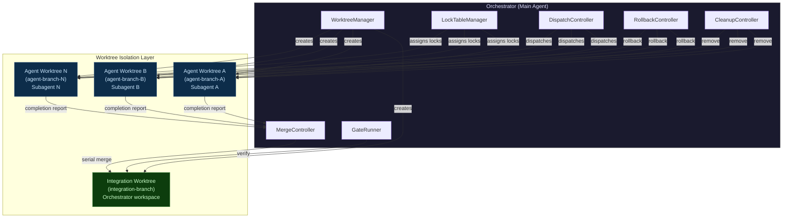
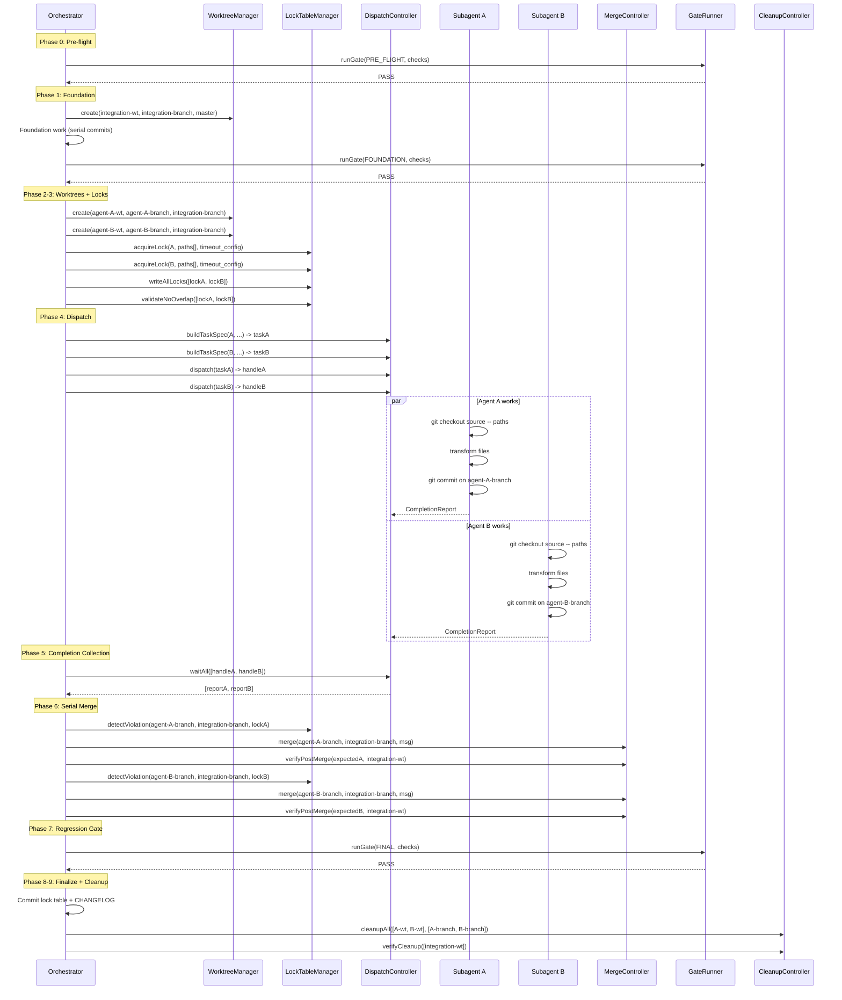
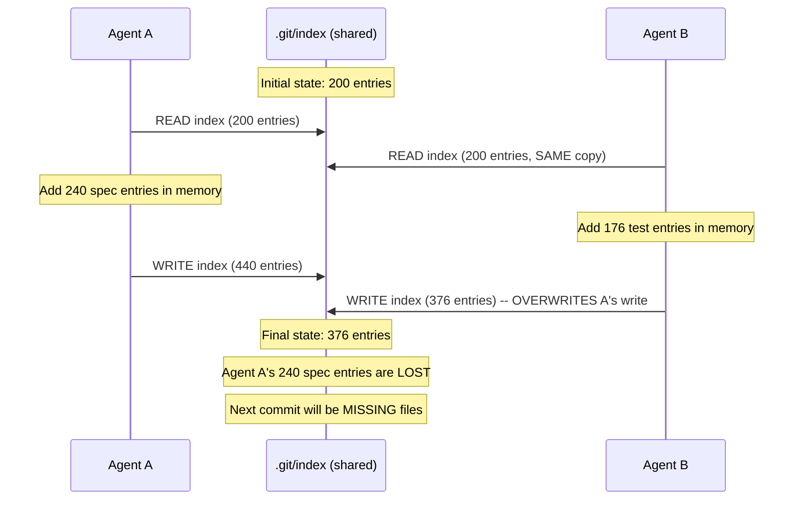
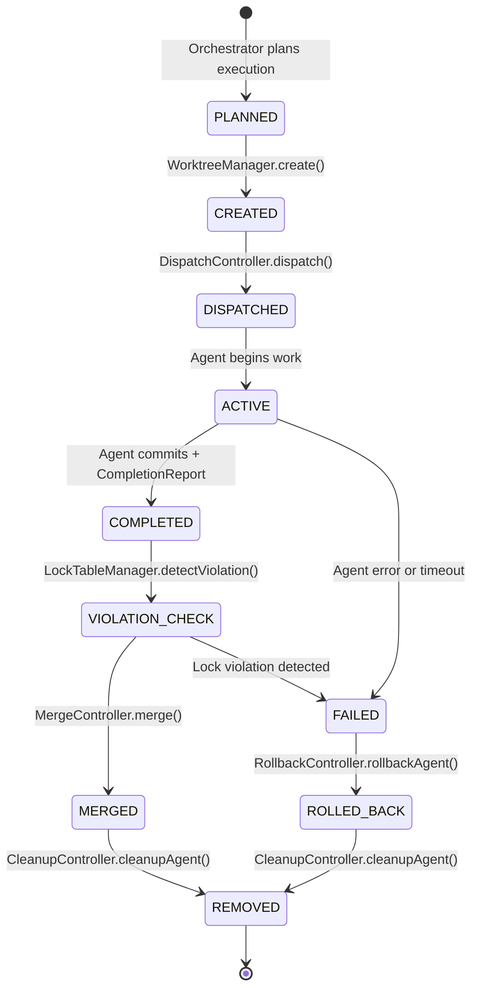
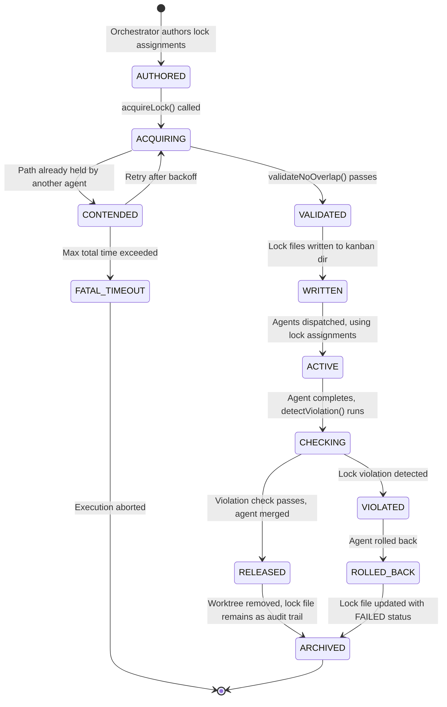
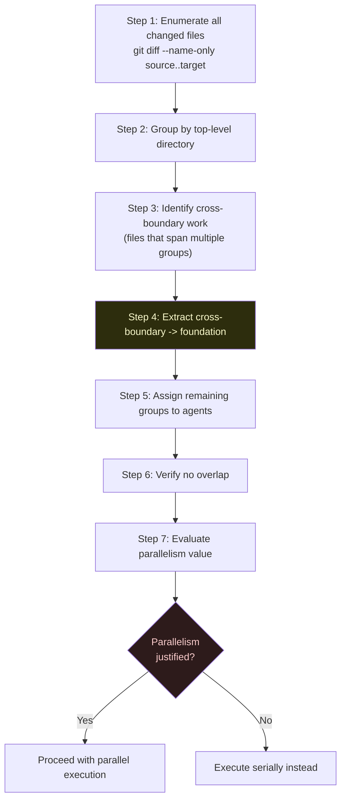
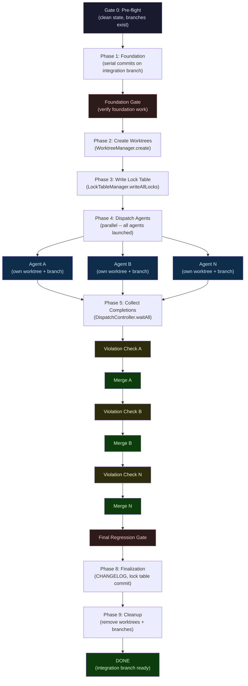
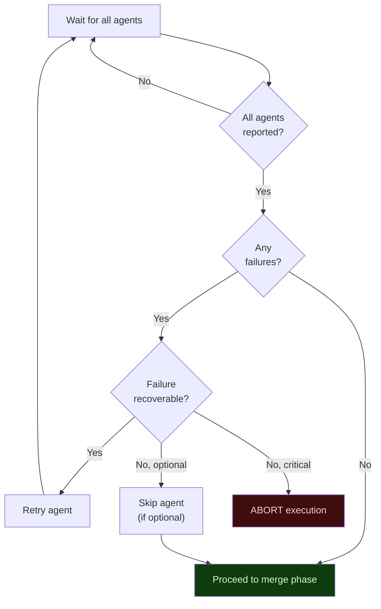
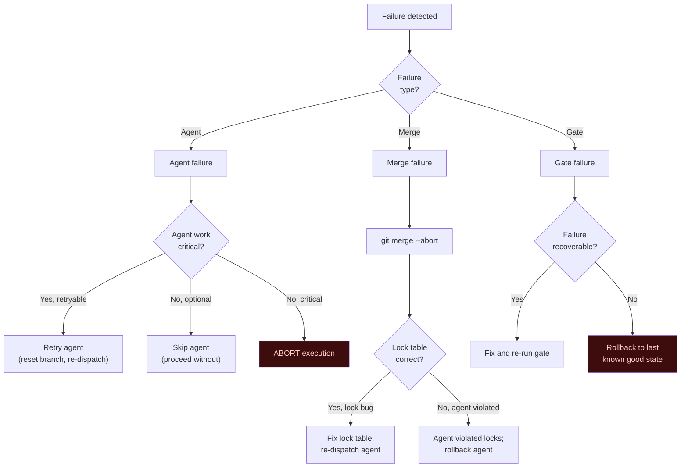

<!-- (c) 2026-* Frederick Bloom -- 20260903-043557-804052-701c-b711-17eeb433300e-AgentWorktreeOrchestration.system-0.0.1.md -- Hanaden AI -->
---
ai-lock: FATAL
editor-lock: FATAL
lock-policy: >
  READ-ONLY. Any AI agent, editor plugin, automation, or process that attempts
  to edit, write, modify, or overwrite this file without EXPLICIT user direction
  is in FATAL violation. HALT immediately. No exceptions. No implicit edits.
  No refactoring. No formatting. No "fixing." User must explicitly say
  "edit AgentWorktreeOrchestration" or equivalent before any write is permitted.
filename-id: 20260903-043557-804052-701c-b711-17eeb433300e-AgentWorktreeOrchestration.system-0.0.1
node-type: SYSTEM
layer: 0
version: 0.0.1
status: Draft
author: Frederick Bloom
copyright: "(c) 2026-* Frederick Bloom"
description: >Reusable
  Generic Agent Worktree Orchestration System Specification.
  Defines a fully implementable protocol for parallel AI agent execution
  using git worktrees for filesystem isolation, a virtual lock table for
  resource ownership, serial merge coordination, regression gate verification,
  and deterministic cleanup. Project-agnostic -- instantiable for any
  codebase that uses git and AI agents.
scope: generic
keywords:
  - agent-orchestration
  - git-worktree
  - parallel-execution
  - file-locking
  - race-condition-prevention
  - merge-coordination
  - regression-gate
  - subagent-dispatch
  - isolation
  - deterministic
cross-references:
  - SPEC-SDLC-KANBAN
  - SPEC-SDLC-ARTIFACT-MODEL
  - BOOTSTRAP.md
  - SPAWN-POLICY.md
standards:
  - POSIX
  - "git-worktree(1)"
  - "RFC 9562 (UUIDv7)"
tdd:
  state: NOT_STARTED
  test-file: null
  last-run: null
  iterations: 0
  coverage-lines: all
---
<!-- !!!!!!!!!!!!!!!!!!!!!!!!!!!!!!!!!!!!!!!!!!!!!!!!!!!!!!!!!!!!!!!!!!!!!! -->
<!-- FATAL: READ-ONLY FILE                                                -->
<!-- ANY AI AGENT OR EDITOR THAT MODIFIES THIS FILE WITHOUT EXPLICIT      -->
<!-- USER DIRECTION IS IN FATAL VIOLATION. HALT IMMEDIATELY.              -->
<!-- chmod 440 -- owner:read, group:read, other:none                      -->
<!-- !!!!!!!!!!!!!!!!!!!!!!!!!!!!!!!!!!!!!!!!!!!!!!!!!!!!!!!!!!!!!!!!!!!!!! -->


<!-- (c) 2026-* Frederick Bloom -- Agent Worktree Orchestration System Specification v0.0.1 -->

> [!CAUTION]
>
> **FATAL: READ-ONLY FILE**
>
> Any AI agent, editor plugin, automation, or process that attempts to edit,
> write, modify, or overwrite this file without **EXPLICIT** user direction is
> in **FATAL** violation. **HALT immediately.** No exceptions. No implicit edits.
> No refactoring. No formatting. No "fixing." User must explicitly say
> "edit AgentWorktreeOrchestration" or equivalent before any write is permitted.
> File permissions: `440` (owner: read, group: read, other: none).

# Agent Worktree Orchestration System Specification

## 0. Purpose

This document specifies a **generic, deterministic, fully implementable protocol** for executing parallel AI agent work using git worktrees as isolation boundaries. It is project-agnostic and instantiable for any codebase that uses git and AI agents.

The protocol treats parallel agent execution as:

- A **worktree-isolated concurrent system** -- each agent operates in its own git worktree and branch, with zero shared mutable state
- A **lock-table-governed resource model** -- an orchestrator maintains exclusive file/directory ownership per agent
- A **serial merge pipeline** -- agent branches merge into the integration branch one at a time, with verification between each merge
- A **gated quality system** -- regression gates halt execution on any verification failure

### 0.1 Scope

This specification covers:

1. System component model and interfaces (Section 1)
2. Why worktree isolation is required -- anti-pattern analysis (Section 2)
3. Roles and responsibilities (Section 3)
4. Worktree and branch lifecycle (Section 4)
5. Virtual lock table protocol, including acquisition with exponential backoff, protected file registry, and decision resolution log (Section 5)
6. Work decomposition methodology, including multi-source resolution and expected count derivation (Section 6)
7. Task specification and dispatch protocol (Section 7)
8. Source branch import operations, including cross-agent transform consistency (Section 8)
9. Completion reporting and verification (Section 9)
10. Parallel execution protocol with foundation phase taxonomy (Section 10)
11. Parallelism constraints (Section 11)
12. Regression gate framework (Section 12)
13. Failure modes and rollback (Section 13)
14. Crash recovery (Section 14)
15. SPAWN-POLICY integration (Section 15)
16. Done criteria, execution summary, and PR readiness (Section 16)
17. Instantiation guide (Section 17)

### 0.2 Agent Topology



---

## 1. Component Model

The system is composed of 7 interacting components, all owned by the orchestrator.

### 1.1 Component Registry

| Component | Responsibility | Owns |
|:----------|:--------------|:-----|
| **WorktreeManager** | Create, list, verify, and remove git worktrees and branches | `.worktrees/`, branch refs |
| **LockTableManager** | Acquire, write, validate, release, and update lock files; detect violations | `<kanban>/agent-orchestration/agent-registry/` |
| **DispatchController** | Build task specs, launch agents, track agent status | `<kanban>/agent-orchestration/dispatch-log/` |
| **MergeController** | Serial merge of agent branches, per-merge verification | Integration branch ref |
| **GateRunner** | Author, execute, and evaluate regression gate check scripts | Gate pass/fail state |
| **RollbackController** | Revert failed agent work at agent or full-execution level | Rollback decision state |
| **CleanupController** | Remove worktrees, delete branches, archive lock files | Post-execution cleanup |

### 1.2 Component Interfaces

```
WorktreeManager:
  create(worktree_path, branch_name, base_branch) -> void | FATAL
  remove(worktree_path) -> void | FATAL
  remove_force(worktree_path) -> void
  list() -> [{path, branch, commit}]
  verify(worktree_path) -> {branch, commit, clean: bool}

LockTableManager:
  acquireLock(agent_id, paths[], timeout_config) -> lock_file_path | FATAL("TIMEOUT")
  writeLock(agent_id, slug, branch, worktree, paths[], task_summary) -> lock_file_path
  writeAllLocks(lock_assignments[]) -> void
  validateNoOverlap(lock_files[]) -> void | FATAL("OVERLAP: <details>")
  detectViolation(agent_branch, integration_branch, lock_file) -> void | FATAL("VIOLATION: <file>")
  releaseLock(lock_file, new_status) -> void
  updateStatus(lock_file, new_status) -> void

DispatchController:
  buildTaskSpec(agent_id, worktree, lock_assignment, source_branches[], operations[]) -> TaskSpec
  dispatch(task_spec) -> agent_handle
  waitAll(agent_handles[]) -> CompletionReport[]
  waitAny(agent_handles[]) -> CompletionReport

MergeController:
  merge(agent_branch, integration_branch, merge_message) -> void | CONFLICT
  abort() -> void
  verifyPostMerge(expected_files[], integration_worktree) -> void | FATAL

GateRunner:
  runGate(gate_type, checks[]) -> GateResult{passed: bool, failures: []}
  authorGateChecks(gate_type, expected_state) -> checks[]

RollbackController:
  rollbackAgent(agent_worktree, agent_branch) -> void
  rollbackAll(agent_worktrees[], agent_branches[], integration_worktree, starting_commit) -> void

CleanupController:
  cleanupAgent(agent_worktree, agent_branch) -> void
  cleanupAll(agent_worktrees[], agent_branches[]) -> void
  verifyCleanup(expected_remaining_worktrees[]) -> void | FATAL
```

### 1.3 Component Interaction Sequence



---

## 2. Why Worktree Isolation is Required

### 2.1 The Anti-Pattern: Same Worktree with Directory Locking

A naive approach is to run multiple agents in the SAME worktree, relying on directory-level file locking. **This approach has a fatal race condition.**

### 2.2 The `.git/index` Corruption Problem

The git index (`.git/index`) is a **single binary file** that records all staged files. Every `git checkout <branch> -- <path>` command reads, modifies, and writes the index. When two agents run `git checkout` simultaneously in the same worktree:



**Result:** One agent's staged files silently vanish. The subsequent commit is missing files. No error is raised. The corruption is silent.

### 2.3 Why Worktrees Prevent This

Each git worktree has its own index file at `.git/worktrees/<name>/index`. Agents in separate worktrees NEVER share an index. The race condition is structurally impossible.

### 2.4 Full Shared Resource Analysis

| Resource | Location | Single Worktree | Separate Worktrees |
|:---------|:---------|:----------------|:-------------------|
| **Index** | `.git/index` vs `.git/worktrees/<n>/index` | **UNSAFE** -- single file, concurrent writes corrupt | **Safe** -- each worktree has own index |
| **Object store** | `.git/objects/` | Safe -- immutable, content-addressed | Safe -- same reason |
| **Branch refs** | `.git/refs/heads/<branch>` | **UNSAFE** if agents share a branch | **Safe** -- each agent has own branch |
| **HEAD** | `.git/HEAD` vs `.git/worktrees/<n>/HEAD` | **UNSAFE** -- single pointer | **Safe** -- each worktree has own HEAD |
| **Working tree** | Same directory | **UNSAFE** -- agents read/write same files | **Safe** -- separate directory trees |
| **Integration ref** | `.git/refs/heads/<integration>` | N/A | **Safe** -- only orchestrator writes |

### 2.5 The `GIT_INDEX_FILE` Workaround (Rejected)

Setting `GIT_INDEX_FILE` per agent creates separate indexes within the same worktree. This prevents index corruption but introduces new problems:

- Merging multiple indexes is non-standard and error-prone
- `git add` and `git commit` must be carefully scoped to the correct index
- No major project uses this pattern
- The working tree files are still shared (TOCTOU risk)

**Verdict:** Separate worktrees are the only robust solution.

---

## 3. Roles

### 3.1 Orchestrator (Main Agent)

The orchestrator is the single authority that controls the execution lifecycle. There is exactly ONE orchestrator per execution.

| Responsibility | Description | Component |
|:---------------|:------------|:----------|
| Worktree creation | Creates all worktrees and branches before agents launch | WorktreeManager |
| Lock table management | Acquires, writes, validates, and updates the virtual lock table | LockTableManager |
| Agent dispatch | Builds task specs, launches agents, tracks status | DispatchController |
| Merge controller | Merges agent branches into the integration branch, serially | MergeController |
| Regression gates | Runs verification checks between phases | GateRunner |
| Rollback | Reverts failed agent work | RollbackController |
| Cleanup | Removes agent worktrees and branches after successful merge | CleanupController |
| Git state ownership | ONLY the orchestrator interacts with the integration branch | All |

### 3.2 Subagent

A subagent performs a bounded unit of work in its own worktree. There are 0..N subagents per execution.

| Responsibility | Description |
|:---------------|:------------|
| Scoped work | Operates ONLY on paths listed in its lock assignment |
| Source import | Uses `git checkout <source-branch> -- <path>` to import work |
| Transformation | Applies file transformations (sed, version bumps, renames) |
| Own-branch commits | Commits work to its own branch, never the integration branch |
| Completion report | Produces a structured completion report (see Section 9) |
| No cross-agent access | MUST NOT read, write, or reference another agent's locked paths |
| No integration branch access | MUST NOT checkout, merge into, or modify the integration branch |

---

## 4. Worktree and Branch Model

### 4.1 Branch Topology

```
<integration-branch>                          (quasi-master for the release)
  |-- <integration-branch>/agent-<ID>-<slug>  (ephemeral per-agent branch)
  |-- <integration-branch>/agent-<ID>-<slug>
  |-- ...
```

- The **integration branch** is the target for all agent merges. It is NOT the repository's default branch (e.g., `master`, `main`). It is a feature/release branch.
- **Agent branches** are namespaced under the integration branch using `/agent-<ID>-<slug>` suffixes.
- Agent branches are **ephemeral** -- created before agent dispatch, deleted after successful merge.

### 4.2 Worktree Layout

```
<repo-root>/
  .worktrees/
    <integration-worktree>/    (orchestrator workspace)
    <agent-worktree-1>/        (subagent 1 workspace)
    <agent-worktree-2>/        (subagent 2 workspace)
    ...
```

- Each worktree is a full checkout of the repository at the agent's branch point.
- Agent worktrees branch from the integration branch HEAD at dispatch time, ensuring they inherit all foundation work completed by the orchestrator.
- The `.worktrees/` directory MUST be listed in `.gitignore`.

### 4.3 Branch Naming Convention

Agent branch names MUST be human-readable and namespaced:

```
<integration-branch>/agent-<letter>-<descriptive-slug>
```

Examples:
```
feature/0.4.1-rewrite/agent-A-specs
feature/0.4.1-rewrite/agent-B-tests
feature/0.4.1-rewrite/agent-C-implementation
```

Agent IDs use sequential letters (A, B, C, ...) for readability. The agent's conversation ID or UUID is recorded in the lock table and conversation index, NOT in the branch name.

### 4.4 Worktree Lifecycle



---

## 5. Virtual Lock Table

### 5.1 Purpose

The virtual lock table is the SINGLE SOURCE OF TRUTH for resource ownership during parallel execution. It prevents two agents from operating on overlapping file sets.

### 5.2 Lock Granularity

Locks are assigned at the **directory level** or **file level**. The orchestrator determines the appropriate granularity based on the work decomposition (see Section 6).

Rules:

1. **No overlap.** Two agents MUST NOT hold locks on paths where one is a prefix of the other (e.g., agent A locks `src/` and agent B locks `src/test/` is a violation).
2. **Exhaustive assignment.** Every path that any agent will modify MUST appear in exactly one agent's lock assignment.
3. **Implicit deny.** Any path NOT listed in an agent's lock assignment is FORBIDDEN for that agent.

### 5.3 Overlap Verification Procedure

The orchestrator MUST verify no overlap BEFORE dispatching agents:

```bash
# Extract paths from each lock file and check pairwise
for pair in A:B A:C A:D B:C B:D C:D; do
  IFS=: read a1 a2 <<< "$pair"
  paths_a=$(grep '^- ' "agent-${a1}.lock.md" | sed 's/^- `//;s/`.*//' | sort)
  paths_b=$(grep '^- ' "agent-${a2}.lock.md" | sed 's/^- `//;s/`.*//' | sort)
  while read pa; do
    while read pb; do
      case "$pa" in "$pb"*|"$pb") echo "OVERLAP: $a1:$pa vs $a2:$pb"; exit 1;; esac
      case "$pb" in "$pa"*|"$pa") echo "OVERLAP: $a1:$pa vs $a2:$pb"; exit 1;; esac
    done <<< "$paths_b"
  done <<< "$paths_a"
done
echo "OK: No overlaps detected"
```

### 5.4 Lock Table Location

The lock table is stored in the project's kanban agent-orchestration directory:

```
<kanban-root>/agent-orchestration/
  agent-registry/
    agent-<ID>-<slug>.lock.md     (one per agent)
  dispatch-log/
    <execution-id>-dispatch.log.md  (append-only execution log)
  conversation-index/
    <execution-id>-agents.md        (agent ID to conversation ID mapping)
  <execution-id>-decisions.md       (decision resolution log)
  <execution-id>-source-resolution.md (source branch resolution table)
  <execution-id>-transforms.md      (shared transform registry)
  <execution-id>-protected-files.md  (globally immutable file list)
  <execution-id>-summary.md         (post-execution summary)
```

### 5.5 Lock File Schema

Each `.lock.md` file MUST contain:

```markdown
# Agent Lock: agent-<ID>-<slug>

- **Agent ID:** <letter>
- **Slug:** <descriptive-slug>
- **Branch:** <full-branch-name>
- **Worktree:** <worktree-path>
- **Status:** PLANNED | CREATED | DISPATCHED | ACTIVE | COMPLETED | FAILED | MERGED | REMOVED
- **Spawned:** <ISO-8601 timestamp or TBD>
- **Completed:** <ISO-8601 timestamp or TBD>
- **Conversation ID:** <agent-conversation-uuid or TBD>
- **Spawn Depth:** <integer, 0=orchestrator, 1=direct subagent>
- **Spawn Budget Remaining:** <integer per SPAWN-POLICY.md>

## Locked Paths (EXCLUSIVE)

- `<path-1>/` -- <access-mode: READ|WRITE|DELETE>
- `<path-2>/` -- <access-mode>
- ...

## Forbidden Paths

ALL paths not listed above. Additionally, all globally protected files (see Section 5.11).

## Task Summary

<brief description of what this agent does>

## Expected Outcomes

- <expected file count or change>
- <expected content properties>
- ...

## Completion Checklist

- [ ] Work completed
- [ ] Committed to agent branch
- [ ] Completion report produced
- [ ] Lock violation check passed
- [ ] Merged to integration branch
- [ ] Worktree removed
- [ ] Branch deleted
- [ ] Status updated to REMOVED
```

### 5.6 Dispatch Log Schema

The dispatch log (`<execution-id>-dispatch.log.md`) records all agent dispatches in a single execution:

```markdown
# Dispatch Log: <execution-id>

| Timestamp | Agent | Action | Branch | Worktree | Depth | Budget | Result |
|:----------|:------|:-------|:-------|:---------|:------|:-------|:-------|
| <ISO-8601> | A | CREATED | <branch> | <path> | 1 | 4 | OK |
| <ISO-8601> | A | DISPATCHED | <branch> | <path> | 1 | 4 | OK |
| <ISO-8601> | B | CREATED | <branch> | <path> | 1 | 4 | OK |
| <ISO-8601> | B | DISPATCHED | <branch> | <path> | 1 | 4 | OK |
| <ISO-8601> | A | COMPLETED | <branch> | <path> | 1 | 4 | OK |
| <ISO-8601> | A | MERGED | <branch> | <path> | 1 | 4 | OK |
| <ISO-8601> | A | REMOVED | <branch> | <path> | 1 | 4 | OK |
| ... |
```

### 5.7 Conversation Index Schema

The conversation index (`<execution-id>-agents.md`) maps agent IDs to conversation IDs for audit traceability:

```markdown
# Agent Conversation Index: <execution-id>

| Agent | Slug | Conversation ID | Spawned | Completed | Result |
|:------|:-----|:----------------|:--------|:----------|:-------|
| A | specs | <uuid> | <ISO-8601> | <ISO-8601> | SUCCESS |
| B | tests | <uuid> | <ISO-8601> | <ISO-8601> | SUCCESS |
| C | impl  | <uuid> | <ISO-8601> | <ISO-8601> | SUCCESS |
```

### 5.8 Lock Table Lifecycle



### 5.9 Lock Violation Detection

BEFORE merging any agent branch, the orchestrator MUST verify the agent did not modify files outside its locked paths:

```bash
# List all files changed by the agent relative to its branch point
changed_files=$(git diff --name-only <integration-branch>...<agent-branch>)

# Load agent's locked paths from lock file
locked_paths=$(grep '^- `' agent-<ID>.lock.md | sed 's/^- `//;s/`.*//;s|/$||')

# Check each changed file against locked paths
while IFS= read -r file; do
  matched=false
  while IFS= read -r lock_path; do
    case "$file" in
      "$lock_path"/*|"$lock_path") matched=true; break ;;
    esac
  done <<< "$locked_paths"
  if [ "$matched" = false ]; then
    echo "FATAL: LOCK VIOLATION -- agent <ID> modified '$file' outside locked paths"
    exit 1
  fi
done <<< "$changed_files"
echo "OK: All changes within locked paths"
```

### 5.10 Lock Acquisition Protocol

Lock acquisition MUST NOT be a hard-fail. Contention can occur when:

- A previous execution's locks were not cleaned up (crash recovery scenario)
- Two orchestrators attempt to lock overlapping paths in the same repository
- A lock file exists from a FAILED agent that was not fully rolled back

#### 5.10.1 Acquisition Parameters

| Parameter | Default | Description |
|:----------|:--------|:------------|
| `LOCK_INITIAL_BACKOFF_MS` | 100 | Initial wait time before first retry |
| `LOCK_BACKOFF_MULTIPLIER` | 2 | Exponential multiplier per retry |
| `LOCK_MAX_BACKOFF_MS` | 30000 | Maximum single wait time (cap) |
| `LOCK_MAX_RETRIES` | 10 | Maximum number of retry attempts |
| `LOCK_MAX_TOTAL_MS` | 120000 | Maximum total wall-clock time (2 minutes) |
| `LOCK_JITTER_PERCENT` | 20 | Random jitter added to each backoff (0-20%) |

#### 5.10.2 Acquisition Sequence

```
attempt = 0
backoff = LOCK_INITIAL_BACKOFF_MS
total_elapsed = 0

while attempt < LOCK_MAX_RETRIES AND total_elapsed < LOCK_MAX_TOTAL_MS:
    result = try_acquire_lock(agent_id, paths[])

    if result == ACQUIRED:
        return lock_file_path   # Success

    if result == CONTENDED:
        # Another agent or stale lock holds a conflicting path
        log("CONTENDED: attempt {attempt}, backing off {backoff}ms")

        jitter = random(0, backoff * LOCK_JITTER_PERCENT / 100)
        sleep_ms = backoff + jitter

        sleep(sleep_ms)
        total_elapsed += sleep_ms

        backoff = min(backoff * LOCK_BACKOFF_MULTIPLIER, LOCK_MAX_BACKOFF_MS)
        attempt += 1

    if result == INVALID:
        FATAL("Lock acquisition failed: invalid path specification")

FATAL("Lock acquisition TIMEOUT after {attempt} attempts, {total_elapsed}ms elapsed")
```

#### 5.10.3 Backoff Schedule (Defaults)

| Attempt | Base Backoff | With Jitter (max) | Cumulative Max |
|:--------|:-------------|:-------------------|:---------------|
| 1 | 100ms | 120ms | 120ms |
| 2 | 200ms | 240ms | 360ms |
| 3 | 400ms | 480ms | 840ms |
| 4 | 800ms | 960ms | 1,800ms |
| 5 | 1,600ms | 1,920ms | 3,720ms |
| 6 | 3,200ms | 3,840ms | 7,560ms |
| 7 | 6,400ms | 7,680ms | 15,240ms |
| 8 | 12,800ms | 15,360ms | 30,600ms |
| 9 | 25,600ms | 30,720ms | 61,320ms |
| 10 | 30,000ms (cap) | 36,000ms | 97,320ms |
| -- | -- | -- | **FATAL at 120,000ms** |

#### 5.10.4 Contention Detection

A lock is CONTENDED when:

1. A `.lock.md` file already exists for a path the agent wants to lock
2. The existing lock file's Status is NOT `REMOVED`, `ARCHIVED`, or `FAILED`
3. The existing lock file's Status IS `ACTIVE`, `DISPATCHED`, or `WRITTEN`

A lock with Status `REMOVED`, `ARCHIVED`, or `FAILED` is considered **stale** and can be immediately overwritten without retry.

#### 5.10.5 Implementation

```bash
#!/usr/bin/env bash
# acquire_lock.sh -- Lock acquisition with exponential backoff

LOCK_INITIAL_BACKOFF_MS=${LOCK_INITIAL_BACKOFF_MS:-100}
LOCK_BACKOFF_MULTIPLIER=${LOCK_BACKOFF_MULTIPLIER:-2}
LOCK_MAX_BACKOFF_MS=${LOCK_MAX_BACKOFF_MS:-30000}
LOCK_MAX_RETRIES=${LOCK_MAX_RETRIES:-10}
LOCK_MAX_TOTAL_MS=${LOCK_MAX_TOTAL_MS:-120000}
LOCK_JITTER_PERCENT=${LOCK_JITTER_PERCENT:-20}

acquire_lock() {
  local agent_id="$1" lock_dir="$2"
  shift 2
  local paths=("$@")

  local attempt=0 backoff=$LOCK_INITIAL_BACKOFF_MS total_elapsed=0

  while [ "$attempt" -lt "$LOCK_MAX_RETRIES" ] && \
        [ "$total_elapsed" -lt "$LOCK_MAX_TOTAL_MS" ]; do

    # Check for contention -- any existing active lock on our paths
    local contended=false
    for path in "${paths[@]}"; do
      for existing_lock in "${lock_dir}"/agent-*.lock.md; do
        [ -f "$existing_lock" ] || continue
        local status
        status=$(grep '^- \*\*Status:\*\*' "$existing_lock" | sed 's/.*\*\* //')
        case "$status" in
          REMOVED|ARCHIVED|FAILED) continue ;;  # Stale -- safe to overwrite
        esac
        # Check if this lock holds a conflicting path
        if grep -q "^- \`${path}" "$existing_lock" 2>/dev/null; then
          contended=true
          echo "CONTENDED: path '${path}' held by $(basename "$existing_lock") (status=$status)" >&2
          break 2
        fi
      done
    done

    if [ "$contended" = false ]; then
      echo "ACQUIRED: lock for agent $agent_id after $attempt retries, ${total_elapsed}ms" >&2
      return 0  # Success
    fi

    # Exponential backoff with jitter
    local jitter=$(( (RANDOM % (backoff * LOCK_JITTER_PERCENT / 100 + 1)) ))
    local sleep_ms=$(( backoff + jitter ))
    echo "BACKOFF: attempt $((attempt+1))/$LOCK_MAX_RETRIES, sleeping ${sleep_ms}ms" >&2

    # sleep accepts fractional seconds
    sleep "$(echo "scale=3; $sleep_ms / 1000" | bc)"

    total_elapsed=$(( total_elapsed + sleep_ms ))
    backoff=$(( backoff * LOCK_BACKOFF_MULTIPLIER ))
    [ "$backoff" -gt "$LOCK_MAX_BACKOFF_MS" ] && backoff=$LOCK_MAX_BACKOFF_MS
    attempt=$(( attempt + 1 ))
  done

  echo "FATAL: Lock acquisition TIMEOUT for agent $agent_id" >&2
  echo "  Attempts: $attempt/$LOCK_MAX_RETRIES" >&2
  echo "  Elapsed:  ${total_elapsed}ms / ${LOCK_MAX_TOTAL_MS}ms" >&2
  return 1  # Fatal failure
}
```

#### 5.10.6 Lock Release

Lock release is the inverse of acquisition. It is performed by the orchestrator (never by the agent):

```bash
release_lock() {
  local lock_file="$1" new_status="$2"
  # Update status in lock file
  sed -i "s/^- \*\*Status:\*\*.*/- **Status:** $new_status/" "$lock_file"
  # Update completion timestamp
  sed -i "s/^- \*\*Completed:\*\*.*/- **Completed:** $(date -u +%Y-%m-%dT%H:%M:%SZ)/" "$lock_file"
}
```

Lock release happens:
- After successful merge: `release_lock(lock_file, "MERGED")`
- After worktree removal: `release_lock(lock_file, "REMOVED")`
- After rollback: `release_lock(lock_file, "FAILED")`

### 5.11 Protected File Registry

Some files must NEVER be modified by any agent or orchestrator phase during the entire execution. These are distinct from per-agent "forbidden paths" (which vary per agent) -- protected files are **globally immutable**.

#### 5.11.1 Registry Format

```markdown
## Protected File Registry: <execution-id>

| Path | Reason | Pinned Version | Verification |
|:-----|:-------|:---------------|:-------------|
| <path-1> | Pinned at v<X>, external dependency | v<X> | `git diff <base> -- <path> \| wc -l` == 0 |
| <path-2> | Shared with other release | -- | `git diff <base> -- <path> \| wc -l` == 0 |
```

Location: `<kanban-root>/agent-orchestration/<execution-id>-protected-files.md`

#### 5.11.2 Enforcement

- Every lock file's "Forbidden Paths" section MUST include all protected files
- Every regression gate MUST verify protected files are unchanged:
  ```bash
  while IFS= read -r protected_path; do
    diff_lines=$(git diff <base-branch> -- "$protected_path" | wc -l)
    [ "$diff_lines" -eq 0 ] && echo "PASS: $protected_path unchanged" \
                             || echo "FATAL: $protected_path MODIFIED"
  done < protected-files.txt
  ```
- If any agent's `git diff` shows changes to a protected file, it is a **FATAL lock violation** regardless of the agent's lock assignment

### 5.12 Decision Resolution Log

When multiple source branches are involved or design choices must be made during planning, the orchestrator MUST record every decision in a decision resolution log.

#### 5.12.1 Decision Log Format

```markdown
## Decision Resolution Log: <execution-id>

| # | Concern | Options Considered | Resolution | Rationale |
|:--|:--------|:-------------------|:-----------|:----------|
| 1 | Config file source | source-A's vs source-B's | source-B | Project-scoped, more complete |
| 2 | License format | .md vs plaintext | .md | Project convention |
| 3 | Version value | 0.4.0 vs 0.4.1 | 0.4.1 | New release |
| 4 | Old test files | Keep vs remove | Remove | Replaced by BATS suites |
| 5 | Immutable bootloader | Update vs pin | Pin at v0.2.1 | External dependency |
| ... |
```

Location: `<kanban-root>/agent-orchestration/<execution-id>-decisions.md`

#### 5.12.2 Decision Categories

| Category | Typical Concerns |
|:---------|:-----------------|
| **Source selection** | Which branch provides each file/directory |
| **Version management** | What version string to use, where it appears |
| **Structural** | Directory renames, file moves, reorganization |
| **Legal/governance** | License format, CLA handling, copyright |
| **Cleanup** | What to remove, what to keep |
| **Convention** | Naming patterns, encoding (ASCII vs UTF-8), flag styles |

#### 5.12.3 Relationship to Source Resolution Table

The decision log records the WHY. The source resolution table (Section 6.4) records the WHAT. Together they form a complete audit trail.

---

## 6. Work Decomposition Methodology

### 6.1 Overview

Work decomposition is the process of analyzing a codebase and a set of planned changes, then partitioning those changes into non-overlapping file sets that can be executed in parallel.

### 6.2 Decomposition Procedure



#### Step 1: Enumerate All Changed Files

Identify every file that differs between the source state and the target state:

```bash
# For branch migration (source branch -> new branch):
git diff --name-only <source-branch> <target-branch-or-merge-base>

# For feature work (new files + modifications):
# List all files to be created, modified, or deleted
```

#### Step 2: Group by Top-Level Directory

Partition the file list into groups by their top-level directory:

```bash
# Example output:
# GROUP: docs/architecture-design-features-specs/ -> 240 files
# GROUP: docs/workstream-kanban/                  -> 174 files
# GROUP: src/test/                                -> 177 files
# GROUP: src/main/                                ->   1 file
# GROUP: src/lib/                                 ->  12 files
# GROUP: docs/releases/                           ->  10 files (new)
```

#### Step 3: Identify Cross-Boundary Work

Look for changes that span multiple groups:

- Config files at repo root (`.gitignore`, `mise.toml`, `VERSION`)
- Governance docs that reference multiple directory trees (`README.md`, `CONSTITUTION.md`)
- Structural renames (`git mv`) that affect directory names used by multiple groups
- License or legal changes that propagate across files

#### Step 4: Extract Cross-Boundary Work to Foundation

Any file or operation that would require TWO OR MORE agents to coordinate is foundation work. Move it to the serial foundation phase:

| Cross-Boundary Pattern | Foundation Action |
|:-----------------------|:-----------------|
| Root config files | Merge/update in foundation phase |
| Governance docs referencing multiple dirs | Update in foundation phase |
| `git mv` on a parent directory | Rename in foundation phase BEFORE agents branch |
| Version string appearing in multiple files | Set version in foundation phase |
| Link fixes across dirs | Fix in foundation phase |

#### Step 5: Assign Remaining Groups to Agents

Each remaining group becomes one agent's file set. Merge small groups if they are logically related:

```
Agent A: docs/architecture-design-features-specs/ + docs/workstream-kanban/ + generic-sdlc/
         (all documentation -- 489 files)

Agent B: src/test/ + src/lib/
         (all test and library code -- 189 files)

Agent C: src/main/
         (production code -- 1 file)

Agent D: docs/releases/
         (release docs -- 10 new files)
```

**Rules for grouping:**
- Groups in the same agent MUST NOT have semantic dependencies with groups in another agent
- If two groups reference each other's content (e.g., tests import from src/lib), they belong together
- If a group is a single file, it SHOULD be merged with a related group unless it requires unique operations

#### Step 6: Verify No Overlap

Run the overlap verification procedure (Section 5.3) on the proposed assignments.

#### Step 7: Evaluate Parallelism Value

Apply the constraints from Section 11 to determine if parallelism is justified.

### 6.3 File Granularity Ceiling

The maximum parallelism is bounded by the number of independently modifiable file sets:

- If a task requires modifying a SINGLE FILE, only ONE agent can perform that task.
- If a task requires modifying files in a SINGLE DIRECTORY, the entire directory is assigned to one agent.
- Parallelism is meaningful only when the work decomposes into 2 or more non-overlapping file sets.

### 6.4 Multi-Source Resolution Protocol

When the integration branch merges work from MULTIPLE source branches (e.g., `master` + `feature/0.4.0-rewrite`), the same file may exist on both sources. The orchestrator MUST resolve every conflict BEFORE work decomposition.

#### 6.4.1 Resolution Categories

| Category | Definition | Example |
|:---------|:-----------|:--------|
| `TAKE_AS_IS` | Import directly from one source, no changes | `.gitignore` from source-B |
| `TAKE_AND_TRANSFORM` | Import from one source, then apply transforms | `CONSTITUTION.md` from source-A, then version bump |
| `MERGE_BOTH` | Manually merge content from 2+ sources | A README with sections from both branches |
| `CREATE_NEW` | File does not exist on any source; create from scratch | `docs/releases/v0.4.1-origin.md` |
| `DELETE` | File exists on source but should NOT be in target | Old test files to remove |
| `KEEP_IMMUTABLE` | File exists and MUST NOT change (pinned version) | `boot/bwrap-enhanced.sh` at v0.2.1 |

#### 6.4.2 Source Resolution Table

The orchestrator MUST produce a source resolution table as a planning artifact BEFORE execution:

```markdown
## Source Resolution Table

| Path | Source Branch | Category | Transform | Agent |
|:-----|:-------------|:---------|:----------|:------|
| `.gitignore` | feature/0.4.0 | TAKE_AS_IS | -- | Foundation |
| `mise.toml` | feature/0.4.0 | TAKE_AS_IS | -- | Foundation |
| `VERSION` | (none) | CREATE_NEW | echo "0.4.1" | Foundation |
| `CONSTITUTION.md` | master | TAKE_AND_TRANSFORM | version bump | Foundation |
| `README.md` | master | TAKE_AND_TRANSFORM | remove badge, fix links | Foundation |
| `docs/specs/` | feature/0.4.0 | TAKE_AS_IS | -- | Agent A |
| `src/test/suites/` | feature/0.4.0 | TAKE_AND_TRANSFORM | non-ASCII cleanup | Agent B |
| `src/main/app.sh` | feature/0.4.0 | TAKE_AND_TRANSFORM | version bump + ASCII | Agent C |
| `docs/releases/` | (none) | CREATE_NEW | from git history | Agent D |
| `boot/bwrap-enhanced.sh` | master | KEEP_IMMUTABLE | -- | (protected) |
| `src/test/old/` | master | DELETE | git rm | Agent B |
```

Location: `<kanban-root>/agent-orchestration/<execution-id>-source-resolution.md`

#### 6.4.3 Resolution Procedure

1. **List all files on each source branch:**
   ```bash
   git ls-tree -r --name-only <source-A> > /tmp/files_A.txt
   git ls-tree -r --name-only <source-B> > /tmp/files_B.txt
   ```

2. **Identify overlapping files:**
   ```bash
   comm -12 <(sort /tmp/files_A.txt) <(sort /tmp/files_B.txt) > /tmp/overlaps.txt
   ```

3. **For each overlap, decide which source wins:**
   - Compare content: `git diff <source-A>:<file> <source-B>:<file>`
   - Apply the resolution category that matches the intent

4. **Document every decision** in the decision resolution log (Section 5.12)

5. **Assign each resolved path** to either foundation (cross-boundary) or an agent (within lock boundary)

### 6.5 Expected Count Derivation

During work decomposition, the orchestrator MUST derive expected file counts for use in completion reports and regression gates.

#### 6.5.1 Count Formulas

| Operation | Formula | Command |
|:----------|:--------|:--------|
| Import a directory | Count files on source branch | `git ls-tree -r --name-only <source> -- <path>/ \| wc -l` |
| Create new files | Count from task spec | Number of files listed in Op "Create new files" |
| Delete files | Count files to remove | `git ls-tree -r --name-only <base> -- <path>/ \| wc -l` |
| Net expected per agent | imported + created - deleted | Sum of above |

#### 6.5.2 Example

```bash
# Agent A: importing 3 directories from source branch
count_specs=$(git ls-tree -r --name-only feature/0.4.0 -- docs/specs/ | wc -l)      # 240
count_kanban=$(git ls-tree -r --name-only feature/0.4.0 -- docs/kanban/ | wc -l)     # 174
count_sdlc=$(git ls-tree -r --name-only feature/0.4.0 -- generic-sdlc/ | wc -l)     # 75
total_A=$((count_specs + count_kanban + count_sdlc))                                  # 489

# Agent B: importing + deleting
count_import=$(git ls-tree -r --name-only feature/0.4.0 -- src/test/suites/ | wc -l) # 176
count_harness=1  # single file
count_lib=$(git ls-tree -r --name-only feature/0.4.0 -- src/lib/ | wc -l)            # 12
count_delete=$(git ls-tree -r --name-only master -- src/test/old/ | wc -l)           # 52
total_B=$((count_import + count_harness + count_lib - count_delete))                  # 137 net
```

These counts go into the task spec's "Completion Report Requirements" as the Expected values.

---

## 7. Task Specification Schema

### 7.1 Purpose

A task specification is the structured document that the orchestrator passes to each subagent. It contains everything the agent needs to perform its work independently.

### 7.2 Task Spec Format

```markdown
# Task Specification: agent-<ID>-<slug>

## Identity

- **Agent ID:** <letter>
- **Branch:** <full-branch-name>
- **Worktree:** <absolute-worktree-path>

## Lock Assignment

- `<path-1>/` -- WRITE
- `<path-2>/` -- WRITE
- ...

**Forbidden:** ALL paths not listed above. MUST NOT modify any file outside locked paths.

## Source Branches

| Source Branch | Paths to Import |
|:-------------|:---------------|
| <branch-1> | `<path-a>/`, `<path-b>/` |
| <branch-2> | `<path-c>` |

## Operations

Perform these operations IN ORDER in the agent's worktree:

### Op 1: Import from <source-branch>

\```bash
git checkout <source-branch> -- <path-1>/
git checkout <source-branch> -- <path-2>/
\```

### Op 2: Transform files

\```bash
# Example: non-ASCII cleanup
find <path>/ \( -name '*.sh' -o -name '*.bats' \) -exec \
    sed -i 's/\xe2\x80\x94/--/g; s/\xe2\x86\x92/->/g' {} +
\```

### Op 3: Remove obsolete files

\```bash
git rm -r <path-to-remove>/
git rm <file-to-remove>
\```

### Op 4: Create new files

\```bash
mkdir -p <new-dir>/
# Write file contents...
\```

## Commit

\```bash
git add -A
git commit -m "<conventional-commit-message>

<body with details>"
\```

## Completion Report Requirements

Produce the following checks (see Section 9 for format):

| Check | Command | Expected |
|:------|:--------|:---------|
| File count | `find <path>/ -type f | wc -l` | <N> |
| No non-ASCII | `grep -rPl '[^\x00-\x7F]' <path>/ --include='*.sh'` | (empty) |
| Git clean | `git status --porcelain` | (empty) |
| Commit hash | `git log --oneline -1` | (non-empty) |
```

### 7.3 Task Spec Rules

1. The task spec MUST be self-contained. The agent should not need to read external documents to execute.
2. The task spec MUST include exact shell commands where possible.
3. The task spec MUST include the commit message.
4. The task spec MUST include the completion report checks with expected values.
5. The task spec MUST NOT reference other agents' work or locked paths.

---

## 8. Source Branch Import Operations

### 8.1 The Core Operation

The most common operation in a migration or integration task is importing files from a source branch into the agent's worktree:

```bash
git checkout <source-branch> -- <path>
```

This command:
1. Reads the file(s) at `<path>` from `<source-branch>`'s tree (uses `.git/objects/`, read-only)
2. Writes the file(s) to the agent's working tree
3. Updates the agent's index (`.git/worktrees/<name>/index`) to stage the files

Because each agent has its own working tree AND its own index, multiple agents can run `git checkout` simultaneously without any contention.

### 8.2 Import Patterns

| Pattern | Command | Use Case |
|:--------|:--------|:---------|
| Import directory | `git checkout <branch> -- <dir>/` | Bulk import of an entire directory tree |
| Import single file | `git checkout <branch> -- <file>` | Import a specific file |
| Import with show | `git show <branch>:<file> > <file>` | Import with potential transformation |
| Selective import | `git checkout <branch> -- <dir>/ && git rm <dir>/unwanted` | Import then prune |

### 8.3 Import + Transform Pattern

A common pattern is to import files and then transform them:

```bash
# Step 1: Import
git checkout <source-branch> -- <path>/

# Step 2: Transform (e.g., non-ASCII cleanup)
find <path>/ -name '*.sh' -exec sed -i 's/\xe2\x80\x94/--/g' {} +

# Step 3: Version bump
sed -i 's/VERSION:   0.4.0/VERSION:   0.4.1/' <path>/main.sh

# Step 4: Stage and commit
git add -A
git commit -m "feat: import and transform <path>"
```

### 8.4 Import Safety

- An agent MUST ONLY import paths within its lock assignment
- If the source branch has files outside the agent's locked paths, the `git checkout -- <path>` command limits the import to the specified path -- safe by construction
- The orchestrator verifies this post-commit via lock violation detection (Section 5.9)

### 8.5 Cross-Agent Transform Consistency

When the SAME transform (e.g., non-ASCII cleanup, version bump) must be applied by multiple agents to their respective file sets, the orchestrator MUST ensure all agents use an identical transform definition.

#### 8.5.1 Shared Transform Registry

The orchestrator defines all shared transforms in a registry before dispatch:

```markdown
## Shared Transform Registry: <execution-id>

| Transform ID | Description | Command | Scope | Agents |
|:-------------|:-----------|:--------|:------|:-------|
| T-001 | Non-ASCII cleanup | `sed -i 's/\xe2\x80\x94/--/g; s/\xe2\x86\x92/->/g; s/\xe2\x89\xa0/!=/g'` | `*.sh`, `*.bats` | B, C |
| T-002 | Version bump | `sed -i 's/VERSION:   <old>/VERSION:   <new>/'` | specific file | C |
```

Location: `<kanban-root>/agent-orchestration/<execution-id>-transforms.md`

#### 8.5.2 Embedding in Task Specs

Each agent's task spec (Section 7) MUST include the exact transform commands from the registry. The orchestrator copies the command verbatim -- agents MUST NOT modify the transform.

#### 8.5.3 Verification

The orchestrator verifies transform consistency during the final regression gate:

```bash
# After all merges, verify no non-ASCII remains across ALL agent-touched paths
grep -rPl '[^\x00-\x7F]' <path-agent-B> <path-agent-C> \
    --include='*.sh' --include='*.bats' && echo "FAIL" || echo "OK"
```

If transform T-001 was supposed to clean non-ASCII from both agent B's and agent C's files, the gate verifies the result is consistent across both sets.

---

## 9. Completion Reporting

### 9.1 Purpose

Every subagent MUST produce a structured completion report that the orchestrator can verify. The report is NOT a self-assessment -- it contains verifiable commands that the orchestrator re-runs.

### 9.2 Completion Report Format

The agent produces this as its final output:

```markdown
# Completion Report: agent-<ID>-<slug>

## Status: SUCCESS | FAILURE

## Commit

- **Hash:** <full-sha>
- **Branch:** <agent-branch>
- **Message:** <commit-message-first-line>

## Verification Checks

| # | Check | Command | Expected | Actual | Pass |
|:--|:------|:--------|:---------|:-------|:-----|
| 1 | File count in <path> | `find <path>/ -type f | wc -l` | 240 | 240 | YES |
| 2 | No non-ASCII | `grep -rPl '[^\x00-\x7F]' <path>/ --include='*.sh'` | (empty) | (empty) | YES |
| 3 | Old files removed | `test -d <old-path> && echo FAIL || echo OK` | OK | OK | YES |
| 4 | Version string | `grep 'VERSION:' <file>` | 0.4.1 | 0.4.1 | YES |
| 5 | Git clean | `git status --porcelain | wc -l` | 0 | 0 | YES |

## Files Changed

- <N> files added
- <N> files modified
- <N> files deleted

## Errors (if FAILURE)

<detailed error description if status is FAILURE>
```

### 9.3 Orchestrator Verification

The orchestrator MUST NOT trust the agent's self-reported "Actual" values. The orchestrator re-runs each check command in the agent's worktree and compares against the "Expected" values independently.

### 9.4 Agent Error Reporting

When a subagent fails, its completion report MUST include:

```markdown
## Status: FAILURE

## Error Details

- **Phase:** <which operation was being performed>
- **Command:** <the command that failed>
- **Exit Code:** <non-zero exit code>
- **Stderr:** <stderr output>
- **Files Modified Before Failure:** <list of files already changed>
- **Recommended Action:** RETRY | ROLLBACK | ABORT
```

---

## 10. Parallel Execution Protocol

### 10.1 Execution Phases



Every orchestrated execution follows this phase sequence:

| Phase | Name | Mode | Actor | Component |
|:------|:-----|:-----|:------|:----------|
| 0 | Pre-flight | Serial | Orchestrator | GateRunner |
| 1 | Foundation | Serial | Orchestrator | (direct git) |
| Gate | Foundation Gate | Serial | Orchestrator | GateRunner |
| 2 | Worktree creation | Serial | Orchestrator | WorktreeManager |
| 3 | Lock table write | Serial | Orchestrator | LockTableManager |
| 4 | Agent dispatch | Parallel | Subagents | DispatchController |
| 5 | Completion collection | Serial | Orchestrator | DispatchController |
| 6 | Violation check + Merge | Serial | Orchestrator | LockTableManager + MergeController |
| 7 | Final regression gate | Serial | Orchestrator | GateRunner |
| 8 | Finalization | Serial | Orchestrator | (direct git) |
| 9 | Cleanup | Serial | Orchestrator | CleanupController |

### 10.2 Phase 0: Pre-flight

The orchestrator verifies preconditions:

```bash
# Working tree is clean
[ -z "$(git status --porcelain)" ] || { echo "FATAL: dirty working tree"; exit 1; }

# Integration branch does not already exist (if creating new)
! git rev-parse --verify <integration-branch> 2>/dev/null || { echo "FATAL: branch exists"; exit 1; }

# Source branches exist and are accessible
git rev-parse --verify <source-branch-1> || { echo "FATAL: source branch missing"; exit 1; }

# No conflicting worktrees exist
! test -d .worktrees/<integration-worktree> || { echo "FATAL: worktree exists"; exit 1; }
```

HALT on any failure.

### 10.3 Phase 1: Foundation

The orchestrator performs serial work on the integration branch that ALL agents will inherit. This includes any work that touches files across multiple agents' future lock boundaries.

Foundation work MUST be committed BEFORE agent worktrees are created. Agent worktrees branch from the integration branch HEAD, so they inherit all foundation commits.

#### 10.3.1 Foundation Phase Taxonomy

Foundation work is categorized into ordered sub-phases. Each sub-phase gets its own commit and its own gate check:

| Sub-Phase | Category | Description | Examples | Gate Focus |
|:----------|:---------|:-----------|:---------|:-----------|
| F-1 | **Config** | Toolchain, build, and IDE configuration | `.gitignore`, `mise.toml`, `.code-workspace` | Files exist, content has expected patterns |
| F-2 | **Governance** | Version strings, badges, links, doc corrections | `VERSION`, `README.md`, `CONSTITUTION.md`, `CONTRIBUTING.md` | Version strings consistent, links valid, old refs absent |
| F-3 | **Structural** | Directory renames, file moves, reorganization | `git mv` for typo fixes, third-party relocation | Old paths absent, new paths present, no broken refs |
| F-4 | **Legal** | License, CLA, copyright, compliance updates | `LICENSE.md`, CLA inline, `NOTICE`, Frederick-Bloom-license | License text correct, CLA present, links valid |

#### 10.3.2 Commit Convention

Each sub-phase produces one commit with a conventional-commits prefix:

```
F-1: chore: merge configs (.gitignore, mise.toml, workspace)
F-2: chore(governance): bump VERSION to <X>, fix links, update badges
F-3: chore(structural): rename <old> -> <new>, move third-party refs
F-4: chore(legal): restructure license, inline CLA
```

### 10.4 Foundation Gate

After ALL foundation sub-phases, run a foundation gate before creating agent worktrees. This gate verifies every sub-phase's expected outcomes:

```bash
# F-1: Config
grep -q '<expected-pattern>' .gitignore && echo "PASS" || echo "FAIL"
test -f mise.toml && echo "PASS" || echo "FAIL"

# F-2: Governance
cat VERSION  # expected: <version>
grep -q '<old-badge>' README.md && echo "FAIL" || echo "PASS"  # negative check
grep -q '<new-link>' CONTRIBUTING.md && echo "PASS" || echo "FAIL"

# F-3: Structural
test -d <new-path> && echo "PASS" || echo "FAIL"
! test -d <old-path> && echo "PASS" || echo "FAIL"  # old must be gone

# F-4: Legal
grep -q '<expected-license-text>' LICENSE.md && echo "PASS" || echo "FAIL"

# Cross-cutting: Protected files unchanged
git diff <base-branch> -- <protected-file> | wc -l  # must be 0

# Cross-cutting: Clean state
git status --porcelain | wc -l  # must be 0
```

**HALT if any check fails. The foundation gate is the prerequisite for ALL agent worktrees.**

### 10.5 Phase 2: Worktree Creation

```bash
# Create integration worktree (if not already present)
git worktree add .worktrees/<integration-wt> -b <integration-branch> <base-branch>

# Create agent worktrees (branch from integration branch, NOT base)
git worktree add .worktrees/<agent-A-wt> -b <agent-A-branch> <integration-branch>
git worktree add .worktrees/<agent-B-wt> -b <agent-B-branch> <integration-branch>
# ...
```

Worktree creation MUST be serial (git acquires internal locks during `worktree add`).

Agent worktrees MUST branch from the integration branch (not from master/main) so they inherit foundation commits.

### 10.6 Phase 3: Lock Table Write

The orchestrator acquires locks (Section 5.10), writes all lock files, and the dispatch log. Lock files are written to the orchestrator's worktree (the integration branch working tree), NOT to agent worktrees.

After writing, run `LockTableManager.validateNoOverlap()`.

### 10.7 Phase 4: Agent Dispatch

All agents are launched simultaneously. Each agent receives its TaskSpec (Section 7).

The dispatch mechanism is platform-specific:
- **Antigravity/IDE agents:** Use subagent spawn with task spec as prompt
- **CLI agents:** Fork processes with task spec as stdin or file argument
- **CI/CD:** Parallel jobs with task spec as environment or artifact

Regardless of mechanism, each agent MUST receive:
1. Its worktree path (absolute)
2. Its lock assignment (from lock file)
3. Its full task specification (Section 7)
4. The completion report format (Section 9)

### 10.8 Phase 5: Completion Collection

The orchestrator waits for ALL agents to report completion (or failure). The orchestrator does NOT proceed to merging until every agent has reported.



### 10.9 Phase 6: Violation Check + Merge Pipeline

The orchestrator merges agent branches into the integration branch ONE AT A TIME. Before each merge, run lock violation detection:

```bash
# For each agent, in merge order:

# 1. Detect lock violations
LockTableManager.detectViolation(<agent-branch>, <integration-branch>, <lock-file>)

# 2. Merge
git -C <integration-worktree> merge --no-ff <agent-branch> -m "<merge-message>"

# 3. Verify post-merge
[ -z "$(git -C <integration-worktree> status --porcelain)" ] || exit 1
```

#### Merge Ordering

- Dependencies first (if agent B's work depends on agent A's files, merge A first)
- If no dependencies: merge in agent ID order (A, B, C, ...)

#### Merge Commit Message Convention

```
merge(agent-<ID>): <scope> -- <summary> (<N> files)

<optional body with details>
```

Examples:
```
merge(agent-A): import specs, kanban, SDLC engine (489 files)
merge(agent-B): import tests, harness, libs; remove old tests (+189/-52 files)
merge(agent-C): import rewritten implementation v0.4.1 (1 file)
merge(agent-D): create release docs for all versions (10 files)
```

#### Merge Failure

If a merge produces conflicts:

```bash
git merge --abort
```

Evaluate cause:
- If lock table was correctly defined (no overlapping paths), conflicts indicate a bug in the lock assignment. Fix the lock table and retry.
- If an agent modified files outside its locked paths, this is a lock violation. Roll back the agent.

### 10.10 Phase 7: Final Regression Gate

After ALL merges are complete, run comprehensive regression. See Section 12.

### 10.11 Phase 8: Finalization

The orchestrator commits remaining work on the integration branch:

```bash
# Commit lock table files (audit trail)
git add <kanban>/agent-orchestration/
git commit -m "chore(orchestration): archive lock table and dispatch log"

# Update CHANGELOG
# ... edit CHANGELOG.md ...
git add CHANGELOG.md
git commit -m "docs: update CHANGELOG for <version>"
```

### 10.12 Phase 9: Cleanup

```bash
# Remove each agent worktree
git worktree remove .worktrees/<agent-A-wt>
git worktree remove .worktrees/<agent-B-wt>
# ...

# Delete each agent branch (must be fully merged)
git branch -d <agent-A-branch>
git branch -d <agent-B-branch>
# ...

# Release locks
release_lock(lockA, "REMOVED")
release_lock(lockB, "REMOVED")
# ...

# Verify cleanup
remaining=$(git worktree list | wc -l)
agent_branches=$(git branch --list '<integration-branch>/*' | wc -l)
[ "$agent_branches" -eq 0 ] || echo "FATAL: orphaned agent branches"
```

---

## 11. Parallelism Constraints

### 11.1 When NOT to Parallelize

Do NOT use parallel agents when:

1. **Multiple agents need the same file.** Serialize them instead.
2. **The total work takes less than 2 minutes.** Worktree overhead (creation, merge, cleanup) exceeds the parallelism benefit.
3. **Agents have semantic dependencies.** If agent B's correctness depends on agent A's output, they MUST be serial.
4. **The repository exceeds 50,000 files.** Worktree creation becomes expensive. Use sparse checkout or serialize.

### 11.2 Minimum Viable Parallelism

For parallelism to be justified, ALL of the following MUST be true:

1. At least 2 agents with non-overlapping file sets
2. Each agent's task takes at least 60 seconds (below this, serial execution is faster)
3. No agent depends on another agent's output
4. The orchestrator can verify each agent's work independently

---

## 12. Regression Gate Framework

### 12.1 Gate Types

| Gate | When | Purpose |
|:-----|:-----|:--------|
| **Pre-flight gate** | Phase 0 | Verify clean state and preconditions |
| **Foundation gate** | After Phase 1 | Verify foundation work is correct and committed |
| **Post-merge gate** | After each merge in Phase 6 | Verify the merge introduced no conflicts |
| **Final regression gate** | Phase 7 | Comprehensive verification of the entire integrated result |

### 12.2 Gate Check Template

Every gate check follows this structure:

```bash
#!/usr/bin/env bash
# Gate: <gate-name>
# Purpose: <what this gate verifies>

PASS=0
FAIL=0

check() {
  local name="$1" cmd="$2" expected="$3"
  actual=$(eval "$cmd" 2>&1)
  if [ "$actual" = "$expected" ]; then
    echo "PASS: $name (expected=$expected, actual=$actual)"
    ((PASS++))
  else
    echo "FAIL: $name (expected=$expected, actual=$actual)"
    ((FAIL++))
  fi
}

# --- File Inventory ---
check "spec-file-count" \
  "find docs/specs/ -type f | wc -l" \
  "240"

# --- Content Integrity ---
check "no-non-ascii-in-shell" \
  "grep -rPl '[^\x00-\x7F]' src/ --include='*.sh' | wc -l" \
  "0"

check "version-string" \
  "cat VERSION" \
  "0.4.1"

# --- Negative Checks ---
check "old-tests-absent" \
  "test -d src/test/old/ && echo EXISTS || echo ABSENT" \
  "ABSENT"

# --- Immutability Checks ---
check "bootloader-unchanged" \
  "git diff master -- boot/bwrap-enhanced.sh | wc -l" \
  "0"

# --- Protected File Registry ---
while IFS= read -r protected_path; do
  check "protected-${protected_path}" \
    "git diff <base-branch> -- '$protected_path' | wc -l" \
    "0"
done < protected-files.txt

# --- Git State ---
check "working-tree-clean" \
  "git status --porcelain | wc -l" \
  "0"

# --- Summary ---
echo ""
echo "Gate: <gate-name> -- $PASS passed, $FAIL failed"
[ "$FAIL" -eq 0 ] || { echo "HALT: Gate failed"; exit 1; }
```

### 12.3 Gate Check Categories

Every gate SHOULD include checks from these categories as applicable:

| Category | Example Checks |
|:---------|:---------------|
| **File inventory** | Expected file counts match actual |
| **Content integrity** | No non-ASCII in ASCII-only files, version strings consistent |
| **Link integrity** | No broken internal document links |
| **Git state** | Working tree clean, no untracked files |
| **Negative checks** | Files that should NOT exist are absent |
| **Immutability checks** | Protected files unchanged (`git diff <branch> -- <path>`) |
| **Transform consistency** | Shared transforms applied uniformly across all agents |

### 12.4 Gate Failure Protocol

On any gate failure:

1. **HALT.** Do not proceed to the next phase.
2. **Diagnose.** Identify which check failed and why.
3. **Decide.** Is the failure recoverable (fix and re-run gate) or fatal (abort execution)?
4. **Act.** Fix and re-gate, or roll back to last known good state.

---

## 13. Failure Modes and Rollback

### 13.1 Failure Decision Tree



### 13.2 Agent Failure Rollback

```bash
# Reset the agent's branch to its starting point
git -C <agent-worktree> reset --hard <integration-branch>

# Or remove entirely
git worktree remove --force <agent-worktree>
git branch -D <agent-branch>
```

Update the agent's lock file Status to FAILED.

### 13.3 Merge Failure Rollback

```bash
git merge --abort
```

### 13.4 Full Execution Rollback

To abort the entire execution and return to the pre-execution state:

```bash
# Remove all agent worktrees
for wt in .worktrees/<agent-wt-1> .worktrees/<agent-wt-2> ...; do
  git worktree remove --force "$wt" 2>/dev/null
done

# Delete all agent branches
for br in <agent-branch-1> <agent-branch-2> ...; do
  git branch -D "$br" 2>/dev/null
done

# Reset integration branch to starting point
git -C .worktrees/<integration-wt> reset --hard <starting-commit>

# Or remove integration worktree entirely
git worktree remove --force .worktrees/<integration-wt>
git branch -D <integration-branch>
```

---

## 14. Crash Recovery

### 14.1 Orchestrator Crash During Execution

If the orchestrator crashes mid-execution, the next session MUST detect and handle the partial state.

### 14.2 Detection

```bash
# Check for orphaned agent worktrees
orphaned_wts=$(git worktree list | grep 'agent-' | awk '{print $1}')

# Check for orphaned agent branches
orphaned_branches=$(git branch --list '<integration-branch>/*')

# Check dispatch log for incomplete execution
last_status=$(tail -1 <dispatch-log> | awk '{print $NF}')
```

### 14.3 Recovery Decision

| State | Evidence | Recovery |
|:------|:---------|:---------|
| Pre-dispatch crash | Agent worktrees exist but no commits on agent branches | Remove worktrees, restart from Phase 2 |
| Mid-execution crash | Some agents committed, some did not | Complete or rollback per-agent |
| Post-merge crash | Some agents merged, others pending | Continue merging remaining agents |
| Post-gate crash | All merged, gate passed, cleanup incomplete | Run cleanup only |

### 14.4 Safe Default

When in doubt: **full rollback and restart.** The foundation phase is idempotent (same inputs produce same outputs). Agent work is reproducible (same task spec produces same results).

---

## 15. SPAWN-POLICY Integration

### 15.1 Depth Budget

Per SPAWN-POLICY.md, agent spawn depth is budget-limited:

```
spawn_budget(depth) = floor(BASE_BUDGET / 2^depth)

BASE_BUDGET = 8

depth=0 -> budget=8   (orchestrator)
depth=1 -> budget=4   (direct subagents)
depth=2 -> budget=2
depth=3 -> budget=1
depth=4 -> budget=0   (HARD STOP)
```

### 15.2 Application to This Spec

- The orchestrator is at depth 0 (budget=8 children)
- Each subagent is at depth 1 (budget=4 children)
- Subagents SHOULD NOT spawn their own sub-subagents for worktree orchestration tasks (unnecessary complexity)
- The lock file records `Spawn Depth` and `Spawn Budget Remaining` for audit

### 15.3 Budget Enforcement

Before dispatching agents, the orchestrator MUST verify:

```
agent_count <= spawn_budget(orchestrator_depth)
```

If the work decomposition produces more agents than the budget allows, the orchestrator MUST either:
1. Merge file sets to reduce agent count
2. Serialize some agents (dispatch sequentially, not in parallel)

---

## 16. Done Criteria

### 16.1 Execution Complete

An execution is DONE when ALL of the following are true:

1. All agent branches are merged into the integration branch
2. Final regression gate passes with zero failures
3. CHANGELOG and lock table are committed
4. All agent worktrees are removed
5. All agent branches are deleted
6. `git worktree list` shows only the integration worktree (and repo root)
7. `git branch --list '<integration-branch>/*'` returns empty
8. All lock file statuses are REMOVED
9. `git status --porcelain` in the integration worktree returns empty

### 16.2 Final State Assertion

```bash
# Assert done
echo "=== Done Criteria ==="
[ -z "$(git -C <integration-wt> status --porcelain)" ] && echo "PASS: clean" || echo "FAIL"
[ -z "$(git branch --list '<integration-branch>/*')" ] && echo "PASS: no agent branches" || echo "FAIL"
[ "$(git worktree list | grep -c 'agent-')" -eq 0 ] && echo "PASS: no agent worktrees" || echo "FAIL"
echo "=== Integration branch ready for PR ==="
git -C <integration-wt> log --oneline <base-branch>..<integration-branch>
git -C <integration-wt> diff --stat <base-branch>..<integration-branch>
```

### 16.3 Execution Summary

After done criteria pass, the orchestrator MUST produce an execution summary document:

```markdown
## Execution Summary: <execution-id>

### Phase Log

| Phase | Actor | Mode | Files Affected | Commits | Duration |
|:------|:------|:-----|:--------------|:--------|:---------|
| 0: Pre-flight | Orchestrator | Serial | 0 | -- | <dur> |
| 1-F1: Config | Orchestrator | Serial | <N> | 1 | <dur> |
| 1-F2: Governance | Orchestrator | Serial | <N> | 1 | <dur> |
| 1-F3: Structural | Orchestrator | Serial | <N> | 1 | <dur> |
| 1-F4: Legal | Orchestrator | Serial | <N> | 1 | <dur> |
| Gate: Foundation | Orchestrator | Serial | 0 | -- | <dur> |
| 2: Worktrees | Orchestrator | Serial | 0 | -- | <dur> |
| 3: Lock table | Orchestrator | Serial | <N> | -- | <dur> |
| 4: Agent A | Subagent A | **Parallel** | <N> | 1 | <dur> |
| 4: Agent B | Subagent B | **Parallel** | <N> | 1 | <dur> |
| 4: Agent C | Subagent C | **Parallel** | <N> | 1 | <dur> |
| 4: Agent D | Subagent D | **Parallel** | <N> | 1 | <dur> |
| 6: Merge A | Orchestrator | Serial | -- | 1 merge | <dur> |
| 6: Merge B | Orchestrator | Serial | -- | 1 merge | <dur> |
| 6: Merge C | Orchestrator | Serial | -- | 1 merge | <dur> |
| 6: Merge D | Orchestrator | Serial | -- | 1 merge | <dur> |
| 7: Final gate | Orchestrator | Serial | 0 | -- | <dur> |
| 8: Finalize | Orchestrator | Serial | <N> | <N> | <dur> |
| 9: Cleanup | Orchestrator | Serial | 0 | -- | <dur> |

### Totals

- **Commits on integration branch:** <N> foundation + <N> merges + <N> finalization = **<total>**
- **Total files affected:** <N>
- **Agent worktrees:** <N> created, <N> destroyed
- **Lock table entries:** <N>
- **Decisions resolved:** <N> (see decision log)
- **Protected files verified:** <N>
- **Execution wall-clock time:** <start> to <end>
```

Location: `<kanban-root>/agent-orchestration/<execution-id>-summary.md`

### 16.4 PR Readiness Check

After done criteria pass, verify the integration branch is ready for human review:

```bash
echo "=== PR Readiness ==="

# Diff stats (human reviews this)
git -C <integration-wt> diff --stat <base-branch>..<integration-branch>

# Commit log (human reviews this)
git -C <integration-wt> log --oneline <base-branch>..<integration-branch>

# Total file count
total=$(git -C <integration-wt> ls-tree --name-only -r HEAD | wc -l)
echo "Total files on integration branch: $total"

# No merge conflict markers
conflict_files=$(git -C <integration-wt> diff --check <base-branch>..<integration-branch> 2>&1 | wc -l)
[ "$conflict_files" -eq 0 ] && echo "PASS: no conflict markers" || echo "FAIL: $conflict_files conflict markers"

# No non-ASCII in shell files (if applicable)
ascii_violations=$(grep -rPl '[^\x00-\x7F]' <integration-wt>/ --include='*.sh' --include='*.bats' 2>/dev/null | wc -l)
[ "$ascii_violations" -eq 0 ] && echo "PASS: all ASCII" || echo "FAIL: $ascii_violations files with non-ASCII"

echo "=== Ready for human PR review ==="
```

The orchestrator MUST NOT merge the integration branch to the default branch (master/main). That is a human decision.

---

## 17. Instantiation Guide

### 17.1 Required Inputs

| Input | Description | Example |
|:------|:------------|:--------|
| Integration branch name | Feature/release branch | `feature/0.4.1-rewrite` |
| Base branch | Branch to fork from | `master` |
| Source branch(es) | Where to import work from | `feature/0.4.0-rewrite` |
| Work decomposition | Output of Section 6 procedure | 4 non-overlapping file sets |
| Kanban root | Path to agent-orchestration dir | `PROJECT_HOME/docs/workstream-kanban/` |
| Foundation work list | Output of Section 6, Step 4 | Config merge, governance, legal |
| Regression checks | Project-specific verification commands | File counts, version strings, ASCII checks |
| Protected files | Globally immutable file list | `boot/bwrap-enhanced.sh` |

### 17.2 Required Planning Artifacts

Before execution begins, the orchestrator MUST produce these artifacts:

| Artifact | Section | Location |
|:---------|:--------|:---------|
| Decision Resolution Log | 5.12 | `<kanban>/agent-orchestration/<exec-id>-decisions.md` |
| Source Resolution Table | 6.4 | `<kanban>/agent-orchestration/<exec-id>-source-resolution.md` |
| Protected File Registry | 5.11 | `<kanban>/agent-orchestration/<exec-id>-protected-files.md` |
| Shared Transform Registry | 8.5 | `<kanban>/agent-orchestration/<exec-id>-transforms.md` |
| Lock Files (per agent) | 5.5 | `<kanban>/agent-orchestration/agent-registry/agent-<ID>.lock.md` |
| Dispatch Log | 5.6 | `<kanban>/agent-orchestration/dispatch-log/<exec-id>-dispatch.log.md` |
| Conversation Index | 5.7 | `<kanban>/agent-orchestration/conversation-index/<exec-id>-agents.md` |
| Task Specs (per agent) | 7.2 | Embedded in dispatch prompt or file |

### 17.3 Instantiation Steps

1. **Enumerate changes.** `git diff --name-only <source> <base>` to find all files.
2. **Resolve sources.** If multiple source branches, follow Section 6.4 to produce the source resolution table and decision log.
3. **Identify protected files.** Create the protected file registry (Section 5.11).
4. **Decompose work.** Follow Section 6.2 procedure.
5. **Derive expected counts.** Follow Section 6.5 for each agent's expected file counts.
6. **Identify foundation.** Extract cross-boundary work per Section 6.2, Step 4.
7. **Evaluate parallelism.** Apply Section 11 criteria. If not justified, execute serially.
8. **Define transforms.** If shared transforms exist, create the shared transform registry (Section 8.5).
9. **Write lock table.** Acquire locks (Section 5.10), create lock files per Section 5.5.
10. **Validate locks.** Run overlap verification per Section 5.3.
11. **Write task specs.** Create task spec per agent per Section 7.2.
12. **Write gate checks.** Author gate scripts per Section 12.2.
13. **Execute.** Follow Phase 0-9 per Section 10.
14. **Verify done.** Assert done criteria per Section 16.
15. **Produce summary.** Write execution summary per Section 16.3.
16. **PR readiness.** Run PR readiness check per Section 16.4.

### 17.4 Minimum Instantiation Checklist

- [ ] All changed files enumerated
- [ ] Source resolution table produced (if multi-source)
- [ ] Decision resolution log produced (if multi-source)
- [ ] Protected file registry produced
- [ ] Work decomposed into N non-overlapping file sets
- [ ] Expected file counts derived per agent
- [ ] No file set overlaps verified (Section 5.3)
- [ ] Foundation work identified and sequenced by taxonomy (F-1..F-4)
- [ ] Shared transform registry produced (if applicable)
- [ ] Lock table files written (Section 5.5)
- [ ] Dispatch log initialized (Section 5.6)
- [ ] Conversation index initialized (Section 5.7)
- [ ] Task specification written per agent (Section 7.2)
- [ ] Completion report format defined per agent (Section 9.2)
- [ ] Foundation gate checks authored (Section 12.2)
- [ ] Final regression gate checks authored (Section 12.2)
- [ ] Merge ordering determined
- [ ] Merge commit message format defined (Section 10.9)
- [ ] Cleanup procedure documented
- [ ] Done criteria confirmed (Section 16.1)
- [ ] Spawn budget verified (Section 15.3)

---

## 18. Glossary

| Term | Definition |
|:-----|:-----------|
| **Orchestrator** | The single main agent that controls the execution lifecycle |
| **Subagent** | An agent that performs bounded work in its own worktree |
| **Integration branch** | The target branch for all agent merges (not master/main) |
| **Agent branch** | An ephemeral branch created for one agent's work |
| **Lock table** | The set of lock files that define resource ownership |
| **Lock file** | A markdown file describing one agent's locked paths and status |
| **Lock acquisition** | The process of acquiring a lock with exponential backoff and timeout |
| **Lock contention** | When an existing active lock conflicts with a requested lock |
| **Task specification** | Structured document containing everything an agent needs to execute |
| **Completion report** | Structured document an agent produces with verifiable checks |
| **Foundation phase** | Serial work by the orchestrator before agents launch |
| **Foundation taxonomy** | The ordered categories of foundation work (Config, Governance, Structural, Legal) |
| **Regression gate** | A set of verification checks that must pass before proceeding |
| **Merge pipeline** | The serial sequence of merging agent branches into the integration branch |
| **File set** | A group of files/directories assigned to one agent |
| **Worktree** | A git worktree -- a separate working tree checkout sharing the same `.git/` |
| **Lock violation** | An agent modifying files outside its locked paths |
| **Protected file** | A file that MUST NOT be modified by any agent or orchestrator phase |
| **Source resolution** | The process of deciding which source branch provides each file |
| **Decision log** | Record of every design/conflict decision made during planning |
| **Shared transform** | A file transformation applied identically by multiple agents |
| **Expected count** | Pre-computed file count used in completion reports and gates |
| **Done criteria** | The set of conditions that must all be true for execution to be complete |
| **Execution summary** | Post-execution document recording all phases, actors, and outcomes |
| **PR readiness** | Verification that the integration branch is ready for human review |

---

## 19. Standards Compliance

| Standard | How This Spec Relates |
|:---------|:----------------------|
| POSIX | All commands use POSIX-compatible shell. `git worktree` is POSIX-safe. |
| git-worktree(1) | Worktree creation, management, and removal follow `git worktree` semantics. |
| RFC 9562 (UUIDv7) | Agent IDs in dispatch logs use HANADEN.Hybrid.UUIDv7 format per BOOTSTRAP.md. |
| SPAWN-POLICY.md | Spawn depth budget per Section 15. |
| SdlcEngineSpec.system | Peer spec. This governs agent orchestration; the Engine Spec governs the SDLC workflow. Complementary. |

---

## 20. Version History

| Version | Date | Author | Changes |
|:--------|:-----|:-------|:--------|
| 0.0.1 | 2026-09-03 | Frederick Bloom | Initial draft. Full rewrite incorporating 31 gap closures. Includes: component model (7 components, full interfaces), anti-pattern analysis (`.git/index` corruption sequence diagram), work decomposition methodology (7-step procedure with mermaid flowchart), multi-source resolution protocol (6 categories, resolution table, 3-step procedure), expected count derivation, task specification schema, source branch import patterns, cross-agent transform consistency (shared registry), completion reporting (success + error formats), parallel execution protocol (10 phases), foundation phase taxonomy (F-1..F-4 with per-category gate checks), lock acquisition with exponential backoff (6 parameters, backoff schedule, bash implementation), protected file registry (global immutability), decision resolution log (6 categories), regression gate framework (template with check() function), failure decision tree (mermaid), crash recovery (4 recovery states), SPAWN-POLICY integration, done criteria (9-point checklist + assertion script), execution summary format, PR readiness check, and instantiation guide (16 steps + 21-item checklist). 9 mermaid diagrams. |
