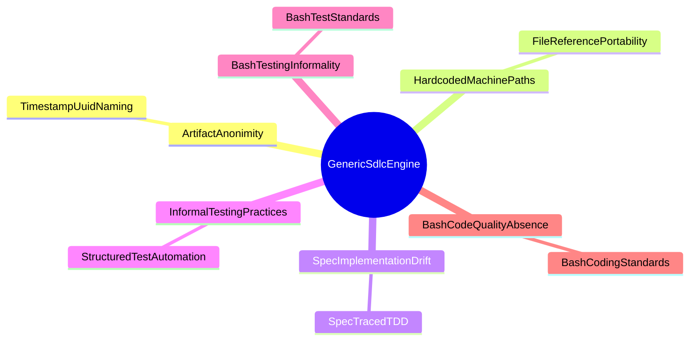

<!-- (c) 2026-* Frederick Bloom -- 20260826-144956-079805-7b55-a68b-b10a227b9f41-GenericSdlcEngine.strat-0.0.1.md -- Hanaden AI -->
---
filename-id:   20260826-144956-079805-7b55-a68b-b10a227b9f41-GenericSdlcEngine.strat-0.0.1
node-type:     CORP-STRAT
layer:         0
version:       0.0.1
status:        Draft
author:        Frederick Bloom
copyright:     "(c) 2026-* Frederick Bloom"
description: >
  Corporate strategy for the Generic SDLC Engine: a deterministic,
  spec-first workflow engine for managing artifact-driven software
  development with event-sourced state transitions and strict
  hierarchical decomposition.
tdd:
  state:         NOT_STARTED
  test-file:     null
  last-run:      null
  iterations:    0
  coverage-lines: all
---

# GenericSdlcEngine: Deterministic Spec-First SDLC Workflow Engine

## Strategic Vision

Establish a deterministic, spec-first SDLC workflow engine that manages
artifact-driven software development through event-sourced state transitions
and strict hierarchical decomposition. The engine enforces that every line of
production code traces back to a specification, every specification traces to
a feature, and every feature traces to a strategic driver. This traceability
chain — STRAT → DRIV → MOTI → FEAT → SPEC → TEST_CODE — is the foundation
of the Hanaden SDLC model.

## Strategic Goals

## Decomposition

- **ArtifactAnonimity.driv — files lack stable identity**
- **HardcodedMachinePaths.driv — scripts contain non-portable absolute paths**
- **SpecImplementationDrift.driv — specs and code drift apart silently**
- **InformalTestingPractices.driv — testing is ad-hoc and ungated**
- **BashTestingInformality.driv — bash test execution is unstructured**
- **BashCodeQualityAbsence.driv — bash code has no quality standards**

## Changelog

| Version | Date | Author | Changes |
|---------|------|--------|---------|
| 0.0.1 | 2026-08-26 | Frederick Bloom + AI | Initial strategy |
