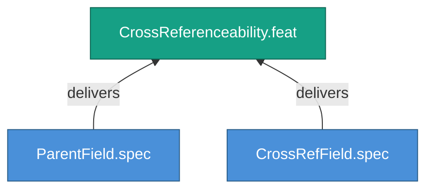

<!-- (c) 2026-* Frederick Bloom -- 20260826-144956-133838-7c67-b6de-e5d9a6451cb8-CrossReferenceability.feat-0.0.1.md -- Hanaden AI -->
---
filename-id:   20260826-144956-133838-7c67-b6de-e5d9a6451cb8-CrossReferenceability.feat-0.0.1
node-type:     FEAT
layer:         2
version:       0.0.1
status:        Draft
priority:      2
author:        Frederick Bloom
copyright:     "(c) 2026-* Frederick Bloom"
description: >
  Enable cross-referencing between SDLC artifacts via parent and
  references fields that use filename-id as the universal pointer.
parent:        20260826-144956-097671-7d5f-b421-adc38c124c3b-TimestampUuidNaming.moti-0.0.1
tdd:
  state:         NOT_STARTED
  test-file:     null
  last-run:      null
  iterations:    0
  coverage-lines: all
---

# CrossReferenceability: Cross-Reference Between Artifacts Via Filename-ID Pointers

## Goal

SDLC artifacts MUST be able to reference each other through stable
`filename-id` pointers. The `parent:` field provides the hierarchical
link (child → parent), while the `references:` field provides lateral
links to related documents at any layer.

## Requirements

| ID | Requirement | Constraint |
|----|-------------|------------|
| R1 | Every non-root node MUST have a parent: field containing the parent's filename-id | STRAT nodes exempt |
| R2 | The references: field MUST contain a list of filename-ids or URLs | Optional field |
| R3 | All filename-id values in parent: and references: MUST resolve to existing files | Validated at tree build |

## Feature Tree

## Test Suite

> **Suite ID:** PENDING
> **Suite name:** CrossReferenceability Feature Suite
> **Test file:** `null` (NOT_STARTED)

### ⚙️ Functional Tests

| ID | Description | Method | Pass Criteria | TDD |
|----|-------------|--------|---------------|-----|

## References

- SdlcEngineSpec.system-0.0.1

## Changelog

| Version | Date | Author | Changes |
|---------|------|--------|---------|
| 0.0.1 | 2026-08-26 | Frederick Bloom + AI | Initial feature |
