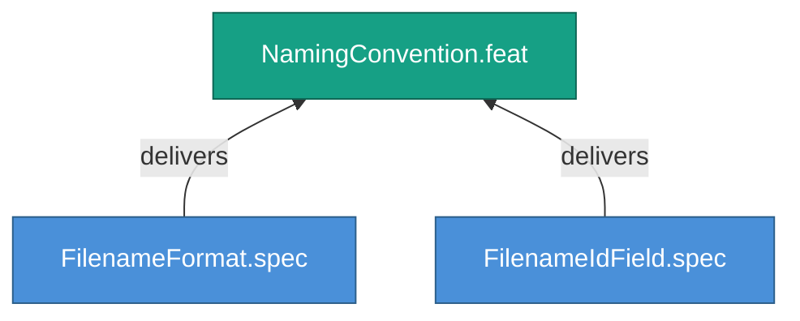

<!-- (c) 2026-* Frederick Bloom -- 20260826-144956-106349-7a50-b5b9-628391696867-NamingConvention.feat-0.0.1.md -- Hanaden AI -->
---
filename-id:   20260826-144956-106349-7a50-b5b9-628391696867-NamingConvention.feat-0.0.1
node-type:     FEAT
layer:         2
version:       0.0.1
status:        Draft
priority:      1
author:        Frederick Bloom
copyright:     "(c) 2026-* Frederick Bloom"
description: >
  Define the exact filename format and filename-id frontmatter field
  for all SDLC artifacts, ensuring every file is self-identifying.
parent:        20260826-144956-097671-7d5f-b421-adc38c124c3b-TimestampUuidNaming.moti-0.0.1
tdd:
  state:         NOT_STARTED
  test-file:     null
  last-run:      null
  iterations:    0
  coverage-lines: all
---

# NamingConvention: Hanaden UUIDv7 Extended Filename Format

## Goal

Every SDLC artifact file MUST use the Hanaden UUIDv7 Extended filename
format. The `filename-id` frontmatter field MUST match the filename stem
(without the `.md` extension). This ensures that files are self-identifying
and that cross-references can be validated mechanically.

## Requirements

| ID | Requirement | Constraint |
|----|-------------|------------|
| R1 | Every file MUST use the YYYYMMDD-HHMMSS-uuuuuu-7xxx-Nxxx-xxxxxxxxxxxx-Slug.class-version.md format | Max 249 chars total |
| R2 | filename-id frontmatter field MUST match the filename stem (sans .md) | Exact string match |
| R3 | uuuuuu = 000000 is a fabrication signal and MUST trigger investigation | Zero tolerance |

## Feature Tree

## Test Suite

> **Suite ID:** PENDING
> **Suite name:** NamingConvention Feature Suite
> **Test file:** `null` (NOT_STARTED)

### ⚙️ Functional Tests

| ID | Description | Method | Pass Criteria | TDD |
|----|-------------|--------|---------------|-----|

## References

- SdlcEngineSpec.system-0.0.1

## Changelog

| Version | Date | Author | Changes |
|---------|------|--------|---------|
| 0.0.1 | 2026-08-26 | Frederick Bloom + AI | Initial feature |
